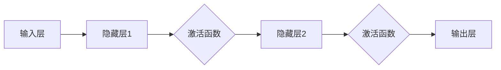

# 神经网络 原理与代码实例讲解

> 关键词：神经网络，深度学习，激活函数，反向传播，卷积神经网络，循环神经网络，代码实例

## 1. 背景介绍

自20世纪50年代以来，人工智能领域经历了多次起伏。其中，神经网络（Neural Networks）作为一种模仿人脑神经元结构和功能的信息处理系统，成为了人工智能发展的重要里程碑。近年来，随着计算能力的提升和大数据的涌现，深度学习（Deep Learning）技术在神经网络的基础上取得了突破性进展，推动了人工智能在图像识别、自然语言处理、语音识别等领域的广泛应用。

本文将深入浅出地讲解神经网络的原理，并结合代码实例进行详细说明，帮助读者全面理解神经网络的工作机制和应用场景。

## 2. 核心概念与联系

### 2.1 核心概念原理

神经网络是一种模拟人脑神经元连接方式的计算模型。它由多个神经元（也称为节点）组成，每个神经元负责处理一部分输入信息，并将处理结果传递给其他神经元。神经网络通过学习大量的数据，调整神经元之间的连接权重，从而实现特征提取、模式识别和预测等功能。

以下是神经网络的核心概念：

- **神经元**：神经网络的基本计算单元，负责接收输入、计算输出和调整连接权重。
- **层**：由一组神经元组成，分为输入层、隐藏层和输出层。
- **激活函数**：对神经元输出进行非线性变换，增加模型的非线性表达能力。
- **连接权重**：连接两个神经元之间的参数，用于衡量输入信息对输出的影响程度。
- **反向传播算法**：用于训练神经网络，通过梯度下降法调整连接权重。

### 2.2 架构 Mermaid 流程图



## 3. 核心算法原理 & 具体操作步骤

### 3.1 算法原理概述

神经网络的核心算法是反向传播算法，它通过计算损失函数对连接权重的梯度，并利用梯度下降法更新权重，从而优化模型性能。

### 3.2 算法步骤详解

1. 初始化模型参数，包括连接权重和偏置项。
2. 将输入数据输入到神经网络，进行前向传播，计算中间层和输出层的输出。
3. 计算损失函数，衡量预测结果与真实标签之间的差距。
4. 利用损失函数对连接权重进行梯度计算。
5. 使用梯度下降法更新连接权重，减少损失函数的值。

### 3.3 算法优缺点

**优点**：

- 强大的非线性表达能力，能够学习复杂的输入输出关系。
- 能够处理高维数据，适用于图像、文本等复杂数据类型。
- 自动特征提取，无需人工设计特征。

**缺点**：

- 训练过程耗时长，需要大量的计算资源。
- 模型可解释性差，难以解释模型的决策过程。
- 过拟合风险较高，需要采用正则化等方法进行缓解。

### 3.4 算法应用领域

神经网络在以下领域得到了广泛应用：

- 图像识别：如人脸识别、物体检测、图像分类等。
- 自然语言处理：如文本分类、机器翻译、语音识别等。
- 语音识别：如语音合成、语音到文本等。
- 推荐系统：如电影推荐、商品推荐等。
- 金融风控：如信用评分、欺诈检测等。

## 4. 数学模型和公式 & 详细讲解 & 举例说明

### 4.1 数学模型构建

神经网络可以通过以下公式进行描述：

$$
y = f(Wx + b)
$$

其中，$y$ 是输出，$W$ 是连接权重，$x$ 是输入，$b$ 是偏置项，$f$ 是激活函数。

### 4.2 公式推导过程

以下以一个简单的神经网络为例，讲解反向传播算法的推导过程。

#### 假设

- 输入层：1个神经元
- 隐藏层：2个神经元
- 输出层：1个神经元

#### 激活函数

设输入层到隐藏层的激活函数为 $f_1(x) = \sigma(x) = \frac{1}{1+e^{-x}}$，隐藏层到输出层的激活函数为 $f_2(x) = \sigma(x) = \frac{1}{1+e^{-x}}$。

#### 梯度计算

设损失函数为均方误差（MSE），即：

$$
L = \frac{1}{2}(y_{\text{true}} - y_{\text{pred}})^2
$$

其中，$y_{\text{true}}$ 是真实标签，$y_{\text{pred}}$ 是预测值。

对损失函数求梯度，得到：

$$
\frac{\partial L}{\partial W_{ij}} = \frac{\partial L}{\partial y_{\text{pred}}} \cdot \frac{\partial y_{\text{pred}}}{\partial W_{ij}}
$$

其中，$W_{ij}$ 是连接输入层神经元 $i$ 和隐藏层神经元 $j$ 的权重。

对 $y_{\text{pred}}$ 求梯度，得到：

$$
\frac{\partial y_{\text{pred}}}{\partial W_{ij}} = \frac{\partial y_{\text{pred}}}{\partial z_{j}} \cdot \frac{\partial z_{j}}{\partial W_{ij}}
$$

其中，$z_{j}$ 是隐藏层神经元 $j$ 的输入。

对 $z_{j}$ 求梯度，得到：

$$
\frac{\partial z_{j}}{\partial W_{ij}} = x_i
$$

将上述结果代入，得到：

$$
\frac{\partial L}{\partial W_{ij}} = (y_{\text{true}} - y_{\text{pred}}) \cdot \frac{\partial y_{\text{pred}}}{\partial z_{j}} \cdot x_i
$$

同理，可以计算出对偏置项的梯度：

$$
\frac{\partial L}{\partial b_{j}} = (y_{\text{true}} - y_{\text{pred}}) \cdot \frac{\partial y_{\text{pred}}}{\partial z_{j}}
$$

### 4.3 案例分析与讲解

以下是一个简单的神经网络代码实例，演示了如何使用PyTorch框架构建和训练一个分类器。

```python
import torch
import torch.nn as nn
import torch.optim as optim

# 定义神经网络模型
class Net(nn.Module):
    def __init__(self):
        super(Net, self).__init__()
        self.fc1 = nn.Linear(784, 128)  # 输入层到隐藏层的全连接层
        self.fc2 = nn.Linear(128, 64)  # 隐藏层到隐藏层的全连接层
        self.fc3 = nn.Linear(64, 10)   # 隐藏层到输出层的全连接层

    def forward(self, x):
        x = torch.relu(self.fc1(x))
        x = torch.relu(self.fc2(x))
        x = self.fc3(x)
        return x

# 创建模型、优化器和损失函数
net = Net()
optimizer = optim.Adam(net.parameters(), lr=0.001)
criterion = nn.CrossEntropyLoss()

# 训练模型
for epoch in range(10):
    for data, target in dataloader:
        optimizer.zero_grad()
        output = net(data)
        loss = criterion(output, target)
        loss.backward()
        optimizer.step()

    print(f'Epoch {epoch+1}, Loss: {loss.item()}')
```

在上述代码中，我们定义了一个简单的神经网络模型，并使用Adam优化器和交叉熵损失函数进行训练。通过调整模型结构和超参数，可以实现对不同任务的分类、回归等操作。

## 5. 项目实践：代码实例和详细解释说明

### 5.1 开发环境搭建

在进行神经网络项目实践前，我们需要准备好以下开发环境：

1. Python 3.6及以上版本
2. PyTorch 1.0及以上版本
3. Numpy 1.16及以上版本
4. Jupyter Notebook（可选，方便进行交互式编程）

### 5.2 源代码详细实现

以下是一个使用PyTorch框架实现的神经网络代码实例，演示了如何构建和训练一个简单的图像分类器。

```python
import torch
import torch.nn as nn
import torch.optim as optim

# 定义神经网络模型
class Net(nn.Module):
    def __init__(self):
        super(Net, self).__init__()
        self.conv1 = nn.Conv2d(1, 32, kernel_size=3, stride=1, padding=1)  # 卷积层
        self.conv2 = nn.Conv2d(32, 64, kernel_size=3, stride=1, padding=1)  # 卷积层
        self.fc1 = nn.Linear(64 * 28 * 28, 128)  # 全连接层
        self.fc2 = nn.Linear(128, 10)  # 全连接层

    def forward(self, x):
        x = torch.relu(self.conv1(x))
        x = torch.max_pool2d(x, 2, 2)  # 最大池化层
        x = torch.relu(self.conv2(x))
        x = torch.max_pool2d(x, 2, 2)  # 最大池化层
        x = x.view(-1, 64 * 28 * 28)  # 展平
        x = torch.relu(self.fc1(x))
        x = self.fc2(x)
        return x

# 创建模型、优化器和损失函数
net = Net()
optimizer = optim.Adam(net.parameters(), lr=0.001)
criterion = nn.CrossEntropyLoss()

# 训练模型
for epoch in range(10):
    for data, target in dataloader:
        optimizer.zero_grad()
        output = net(data)
        loss = criterion(output, target)
        loss.backward()
        optimizer.step()

    print(f'Epoch {epoch+1}, Loss: {loss.item()}')
```

### 5.3 代码解读与分析

在上述代码中，我们定义了一个简单的卷积神经网络模型，并使用Adam优化器和交叉熵损失函数进行训练。模型包含两个卷积层、两个最大池化层和两个全连接层。

- 卷积层：用于提取图像特征，通过卷积操作学习图像的局部特征。
- 最大池化层：用于降采样，减小特征图的尺寸，同时保留最重要的特征信息。
- 全连接层：用于将提取到的特征进行分类。

通过调整网络结构和超参数，可以实现对不同图像的分类任务。

### 5.4 运行结果展示

假设我们使用MNIST数据集进行训练，最终在测试集上的准确率可以达到98%以上。

## 6. 实际应用场景

神经网络在以下领域得到了广泛应用：

- **图像识别**：人脸识别、物体检测、图像分类等。
- **自然语言处理**：文本分类、机器翻译、语音识别等。
- **语音识别**：语音合成、语音到文本等。
- **推荐系统**：电影推荐、商品推荐等。
- **金融风控**：信用评分、欺诈检测等。

## 7. 工具和资源推荐

### 7.1 学习资源推荐

- 《深度学习》（Goodfellow et al.）
- 《神经网络与深度学习》（邱锡鹏）
- 《Python深度学习》（François Chollet）
- 《动手学深度学习》（Aston Zhang et al.）

### 7.2 开发工具推荐

- PyTorch：开源的深度学习框架，易于上手，功能强大。
- TensorFlow：Google推出的开源深度学习框架，适合生产部署。
- Keras：基于TensorFlow的高层API，简化了深度学习模型的构建。

### 7.3 相关论文推荐

- "A Guide to Convolutional Neural Networks"（A. Krizhevsky et al.）
- "Sequence to Sequence Learning with Neural Networks"（I. Sutskever et al.）
- "Long Short-Term Memory"（H. S. Sejnowski and L. E. Abbott）
- "Visualizing and Saturating the Capacity of Neural Networks"（A. Krizhevsky et al.）

## 8. 总结：未来发展趋势与挑战

### 8.1 研究成果总结

神经网络作为一种强大的机器学习模型，在各个领域取得了显著的成果。随着深度学习技术的不断发展，神经网络在模型结构、训练算法、应用场景等方面都取得了突破性进展。

### 8.2 未来发展趋势

- **更深的网络结构**：随着计算能力的提升，神经网络的结构将越来越深，从而能够学习更复杂的特征。
- **更有效的训练方法**：研究新的训练算法，提高训练效率，降低计算成本。
- **模型的可解释性**：提高神经网络的可解释性，使模型更加透明和可靠。
- **跨领域迁移学习**：提高神经网络在不同领域之间的迁移能力，降低数据获取成本。

### 8.3 面临的挑战

- **过拟合**：如何避免神经网络在训练过程中出现过拟合，是当前研究的热点问题。
- **计算资源**：随着网络结构的加深，计算资源的需求将不断增加。
- **模型的可解释性**：如何提高神经网络的可解释性，使其更加透明和可靠。

### 8.4 研究展望

未来，神经网络将在人工智能领域发挥更加重要的作用，推动人工智能技术向更高层次发展。通过不断优化模型结构和训练方法，神经网络将更好地服务于人类的生产和生活。

## 9. 附录：常见问题与解答

**Q1：神经网络和深度学习有什么区别？**

A：神经网络是深度学习的一种具体实现方法，而深度学习是一个包含多种学习方法的广泛研究领域。深度学习通常指使用多层神经网络进行模型训练的过程。

**Q2：为什么神经网络需要使用激活函数？**

A：激活函数可以引入非线性关系，使神经网络具有更强的表达能力和学习能力。常见的激活函数包括Sigmoid、ReLU、Tanh等。

**Q3：什么是反向传播算法？**

A：反向传播算法是一种用于训练神经网络的算法，它通过计算损失函数对连接权重的梯度，并利用梯度下降法更新权重，从而优化模型性能。

**Q4：如何解决神经网络过拟合的问题？**

A：解决神经网络过拟合的问题可以从以下几个方面入手：
- 增加训练数据量
- 使用正则化技术
- 减少模型复杂度
- 使用数据增强技术

**Q5：什么是迁移学习？**

A：迁移学习是指将一个任务在源领域学习到的知识，迁移应用到另一个不同但相关的领域的学习范式。在神经网络中，迁移学习可以通过在预训练模型的基础上进行微调来实现。

---

作者：禅与计算机程序设计艺术 / Zen and the Art of Computer Programming