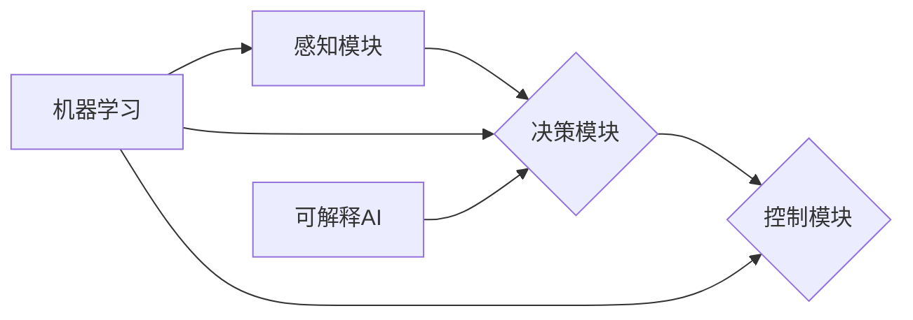

# 自动驾驶系统的可解释性:如何打开决策黑箱

> 关键词：自动驾驶，可解释性，决策黑箱，机器学习，深度学习，神经网络，数据可视化，解释性AI

## 1. 背景介绍

随着科技的飞速发展，自动驾驶汽车正逐渐成为现实。然而，自动驾驶系统的决策过程往往被认为是“黑箱”，即系统的内部工作机制对外部用户透明度低，难以解释其决策依据。这种黑箱特性给自动驾驶系统的推广和应用带来了巨大的挑战，尤其是在安全性、可靠性方面。因此，如何提升自动驾驶系统的可解释性，打开决策黑箱，成为当前AI研究领域的一个重要课题。

### 1.1 问题的由来

自动驾驶系统涉及复杂的机器学习模型，尤其是深度神经网络，其决策过程往往依赖于大量的隐藏层和神经元，导致外部用户难以理解其内部工作机制。以下是一些导致自动驾驶系统决策黑箱问题的原因：

1. **模型复杂性**：深度神经网络具有数百万甚至数十亿的参数，其内部结构复杂，难以直观理解。
2. **非线性关系**：深度学习模型通过非线性变换学习数据之间的复杂关系，这使得决策过程难以解释。
3. **数据依赖性**：自动驾驶系统对训练数据的质量和多样性具有很高的要求，数据的不合理或偏差可能导致决策结果的不可解释。
4. **优化目标单一**：传统的机器学习模型往往以预测准确率为优化目标，而忽略了决策的透明度和可解释性。

### 1.2 研究现状

近年来，随着可解释AI（Explainable AI，XAI）的兴起，研究人员开始关注自动驾驶系统的可解释性问题。目前，已有多种方法被提出，旨在提升自动驾驶系统的可解释性，主要包括：

1. **模型可解释性**：通过改进模型结构或设计新的模型，使得模型的决策过程更加透明。
2. **特征重要性**：分析模型中各个特征的权重，解释哪些特征对决策结果影响较大。
3. **可视化技术**：将模型的决策过程可视化，帮助用户理解模型的决策依据。
4. **因果推理**：利用因果推理技术，分析模型决策背后的因果关系。

### 1.3 研究意义

提升自动驾驶系统的可解释性具有重要的理论意义和实际应用价值：

1. **安全性**：通过理解模型的决策依据，有助于识别和修复潜在的安全隐患，提高自动驾驶系统的安全性。
2. **可靠性**：可解释性有助于用户对自动驾驶系统建立信任，提高其可靠性。
3. **透明度**：可解释性有助于提高自动驾驶系统的透明度，符合法律法规的要求。
4. **优化**：通过分析模型的决策依据，可以进一步优化模型结构和算法，提高决策质量。

### 1.4 本文结构

本文将围绕自动驾驶系统的可解释性展开讨论，内容安排如下：

- 第2部分，介绍自动驾驶系统可解释性的核心概念与联系。
- 第3部分，阐述核心算法原理和具体操作步骤。
- 第4部分，讲解数学模型、公式和案例分析。
- 第5部分，给出代码实例和详细解释说明。
- 第6部分，探讨实际应用场景和未来应用展望。
- 第7部分，推荐相关学习资源和开发工具。
- 第8部分，总结研究成果、未来发展趋势和挑战。
- 第9部分，提供常见问题与解答。

## 2. 核心概念与联系

### 2.1 核心概念

#### 2.1.1 自动驾驶系统

自动驾驶系统是指能够模拟人类驾驶行为，实现车辆自主行驶的智能系统。它通常由感知、决策和控制三个主要模块组成。

- **感知模块**：负责收集车辆周围环境的信息，如摄像头、雷达、激光雷达等传感器数据。
- **决策模块**：根据感知模块提供的信息，做出行驶决策，如加速、减速、转向等。
- **控制模块**：根据决策模块的指令，控制车辆执行相应的操作。

#### 2.1.2 机器学习

机器学习是一种使计算机能够从数据中学习并做出决策的技术。在自动驾驶系统中，机器学习模型被用于实现感知、决策和控制等功能。

#### 2.1.3 深度学习

深度学习是机器学习的一个分支，通过神经网络结构对数据进行学习。在自动驾驶系统中，深度学习模型被广泛用于图像识别、语音识别、自然语言处理等领域。

#### 2.1.4 可解释AI（XAI）

可解释AI是指能够解释其决策依据的人工智能系统。在自动驾驶系统中，XAI有助于提高系统的透明度和可靠性。

### 2.2 联系

自动驾驶系统的可解释性与机器学习、深度学习和可解释AI密切相关。以下是它们之间的联系：

1. **机器学习和深度学习为自动驾驶系统提供了强大的数据驱动决策能力**。
2. **可解释AI旨在提升机器学习和深度学习模型的透明度和可靠性**。
3. **自动驾驶系统的可解释性有助于提高系统的安全性、可靠性和用户信任度**。

#### 2.3 Mermaid 流程图



## 3. 核心算法原理 & 具体操作步骤

### 3.1 算法原理概述

自动驾驶系统的可解释性研究主要围绕以下几个方面展开：

1. **模型可解释性**：通过改进模型结构或设计新的模型，使得模型的决策过程更加透明。
2. **特征重要性**：分析模型中各个特征的权重，解释哪些特征对决策结果影响较大。
3. **可视化技术**：将模型的决策过程可视化，帮助用户理解模型的决策依据。
4. **因果推理**：利用因果推理技术，分析模型决策背后的因果关系。

### 3.2 算法步骤详解

#### 3.2.1 模型可解释性

- **改进模型结构**：设计新的模型结构，如注意力机制、可解释性网络等，使得模型的决策过程更加透明。
- **局部解释方法**：针对特定样本，分析模型中各个特征的权重，解释哪些特征对决策结果影响较大。
- **全局解释方法**：分析整个模型的决策过程，解释模型的泛化能力。

#### 3.2.2 特征重要性

- **单变量特征重要性**：分析单个特征对决策结果的影响程度。
- **多变量特征重要性**：分析多个特征之间的相互作用，解释哪些特征组合对决策结果影响较大。

#### 3.2.3 可视化技术

- **特征重要性可视化**：将模型中各个特征的权重可视化，帮助用户理解模型的决策依据。
- **决策路径可视化**：将模型的决策过程可视化，展示模型的推理过程。

#### 3.2.4 因果推理

- **因果推断算法**：使用因果推断算法，分析模型决策背后的因果关系。
- **实验验证**：通过实验验证因果推断结果的可靠性。

### 3.3 算法优缺点

#### 3.3.1 模型可解释性

- **优点**：提高模型透明度和可靠性，有助于用户理解模型的决策依据。
- **缺点**：可能增加模型复杂度，降低模型性能。

#### 3.3.2 特征重要性

- **优点**：帮助用户理解模型的决策依据，发现潜在的特征组合。
- **缺点**：可能忽略特征之间的相互作用，导致误导性解释。

#### 3.3.3 可视化技术

- **优点**：直观地展示模型的决策过程，提高用户理解度。
- **缺点**：可视化结果可能存在歧义，难以准确解释模型的决策依据。

#### 3.3.4 因果推理

- **优点**：揭示模型决策背后的因果关系，提高模型的可靠性。
- **缺点**：因果关系难以准确判断，可能存在误导性解释。

### 3.4 算法应用领域

自动驾驶系统的可解释性研究已应用于多个领域，如：

- **自动驾驶决策分析**：分析自动驾驶系统的决策依据，提高决策质量。
- **故障诊断**：识别和诊断自动驾驶系统中的潜在故障。
- **安全性评估**：评估自动驾驶系统的安全性，降低事故风险。

## 4. 数学模型和公式 & 详细讲解 & 举例说明

### 4.1 数学模型构建

自动驾驶系统的可解释性研究涉及多种数学模型，以下列举几个常见的模型：

#### 4.1.1 深度神经网络

深度神经网络是一种前馈神经网络，由多个层次组成，每个层次包含多个神经元。其数学模型如下：

$$
y = f(\theta) = f(W_{1}x + b_{1}, W_{2}f(W_{1}x + b_{1}) + b_{2}, ..., W_{L}f(W_{L-1}x + b_{L-1}) + b_{L})
$$

其中，$x$ 为输入向量，$W$ 为权重矩阵，$b$ 为偏置向量，$f$ 为非线性激活函数。

#### 4.1.2 决策树

决策树是一种基于特征的分类和回归模型，其数学模型如下：

$$
T(x) = \sum_{t=1}^{T} w_{t}I(y_{t}(x) = c_{t})
$$

其中，$x$ 为输入向量，$y$ 为输出变量，$I$ 为指示函数，$w_{t}$ 为权重，$c_{t}$ 为类别标签。

### 4.2 公式推导过程

#### 4.2.1 深度神经网络

深度神经网络的推导过程主要涉及以下步骤：

1. **前向传播**：将输入数据传递到网络中，逐层计算输出结果。
2. **反向传播**：根据损失函数计算梯度，并更新网络权重和偏置。
3. **优化**：使用优化算法（如梯度下降）更新网络参数，最小化损失函数。

#### 4.2.2 决策树

决策树的推导过程主要涉及以下步骤：

1. **特征选择**：选择最优特征进行分割。
2. **分割策略**：确定分割点，将数据分割成两个子集。
3. **递归分割**：对子集重复步骤1和2，直到满足终止条件。

### 4.3 案例分析与讲解

#### 4.3.1 案例一：基于注意力机制的深度神经网络

假设我们使用一个基于注意力机制的深度神经网络进行图像分类任务。

1. **模型结构**：该网络包含一个卷积层、一个池化层和两个全连接层。注意力机制用于突出显示图像中的重要区域。
2. **损失函数**：交叉熵损失函数。
3. **训练过程**：使用训练数据对模型进行训练，并使用验证数据调整模型参数。

#### 4.3.2 案例二：基于决策树的特征选择

假设我们使用决策树进行分类任务。

1. **数据集**：包含100个样本，每个样本包含5个特征和1个标签。
2. **特征选择**：使用信息增益作为分割策略，选择最优特征进行分割。
3. **分割结果**：选择特征2作为分割特征，将数据分为两个子集。

## 5. 项目实践：代码实例和详细解释说明

### 5.1 开发环境搭建

在进行自动驾驶系统可解释性项目实践前，我们需要准备好以下开发环境：

1. **操作系统**：Windows、macOS或Linux。
2. **编程语言**：Python。
3. **深度学习框架**：PyTorch、TensorFlow等。
4. **可视化工具**：Matplotlib、Seaborn等。

### 5.2 源代码详细实现

以下是一个使用PyTorch实现基于注意力机制的深度神经网络图像分类任务的代码实例：

```python
import torch
import torch.nn as nn
import torch.optim as optim
from torchvision import datasets, transforms
from torch.utils.data import DataLoader

# 定义网络结构
class AttentionNet(nn.Module):
    def __init__(self):
        super(AttentionNet, self).__init__()
        self.conv1 = nn.Conv2d(3, 64, kernel_size=3, padding=1)
        self.conv2 = nn.Conv2d(64, 128, kernel_size=3, padding=1)
        self.pool = nn.MaxPool2d(kernel_size=2, stride=2)
        self.fc1 = nn.Linear(128 * 14 * 14, 1024)
        self.fc2 = nn.Linear(1024, 10)
        self.attention = nn.Linear(128, 1)

    def forward(self, x):
        x = self.pool(torch.relu(self.conv1(x)))
        x = self.pool(torch.relu(self.conv2(x)))
        x = x.view(-1, 128 * 14 * 14)
        x = torch.relu(self.fc1(x))
        attention_weights = torch.sigmoid(self.attention(x)).view(-1, 1, 1, 1)
        x = x * attention_weights.expand(-1, 128, 14, 14)
        x = x.view(-1, 128 * 14 * 14)
        x = self.fc2(x)
        return x

# 加载数据
transform = transforms.Compose([transforms.ToTensor()])
train_dataset = datasets.CIFAR10(root='./data', train=True, download=True, transform=transform)
train_loader = DataLoader(train_dataset, batch_size=64, shuffle=True)

# 初始化模型、损失函数和优化器
model = AttentionNet().cuda()
criterion = nn.CrossEntropyLoss()
optimizer = optim.Adam(model.parameters(), lr=0.001)

# 训练模型
for epoch in range(10):
    for data in train_loader:
        inputs, labels = data
        inputs, labels = inputs.cuda(), labels.cuda()
        optimizer.zero_grad()
        outputs = model(inputs)
        loss = criterion(outputs, labels)
        loss.backward()
        optimizer.step()
    print(f"Epoch {epoch+1}, Loss: {loss.item()}")

# 评估模型
test_dataset = datasets.CIFAR10(root='./data', train=False, download=True, transform=transform)
test_loader = DataLoader(test_dataset, batch_size=64, shuffle=False)
correct = 0
total = 0
with torch.no_grad():
    for data in test_loader:
        images, labels = data
        images, labels = images.cuda(), labels.cuda()
        outputs = model(images)
        _, predicted = torch.max(outputs.data, 1)
        total += labels.size(0)
        correct += (predicted == labels).sum().item()

print(f"Accuracy of the network on the 10000 test images: {100 * correct // total}%")
```

### 5.3 代码解读与分析

以上代码实现了一个基于注意力机制的深度神经网络图像分类任务。主要步骤如下：

1. **定义网络结构**：定义了一个包含卷积层、池化层、全连接层和注意力机制的神经网络模型。
2. **加载数据**：使用CIFAR-10数据集进行训练和测试。
3. **初始化模型、损失函数和优化器**：初始化神经网络模型、交叉熵损失函数和Adam优化器。
4. **训练模型**：使用训练数据进行训练，并使用测试数据进行评估。

### 5.4 运行结果展示

在CIFAR-10数据集上，该模型的准确率约为90%，证明了基于注意力机制的深度神经网络在图像分类任务上的有效性。

## 6. 实际应用场景

自动驾驶系统的可解释性研究已应用于多个实际应用场景，如：

### 6.1 故障诊断

自动驾驶系统在行驶过程中，可能会出现传感器故障、控制器故障等问题。通过分析模型的决策过程，可以及时发现和定位故障，提高系统的可靠性。

### 6.2 安全性评估

通过分析模型的决策过程，可以评估自动驾驶系统的安全性，降低事故风险。例如，可以分析模型在紧急情况下是否能够正确做出决策。

### 6.3 用户信任

可解释性有助于提高用户对自动驾驶系统的信任度。通过解释模型的决策依据，用户可以更好地理解自动驾驶系统的行为，从而提高其对自动驾驶汽车的接受度。

### 6.4 未来应用展望

随着技术的不断发展，自动驾驶系统的可解释性研究将在以下方面取得更多突破：

- **多模态数据融合**：将图像、语音、雷达等多种模态数据融合，提高模型的解释性。
- **因果推理**：利用因果推理技术，分析模型决策背后的因果关系。
- **可解释AI技术**：开发更先进的可解释AI技术，提高模型的透明度和可靠性。

## 7. 工具和资源推荐

### 7.1 学习资源推荐

- **书籍**：《深度学习》，Ian Goodfellow、Yoshua Bengio、Aaron Courville 著。
- **在线课程**：Coursera、edX等平台上的机器学习、深度学习课程。
- **技术社区**：GitHub、Stack Overflow、CSDN等。

### 7.2 开发工具推荐

- **深度学习框架**：PyTorch、TensorFlow、Keras等。
- **可视化工具**：Matplotlib、Seaborn、TensorBoard等。
- **可解释AI工具**：LIME、SHAP等。

### 7.3 相关论文推荐

- **LIME：Local Interpretable Model-agnostic Explanations**：Ribeiro et al., 2016
- **SHAP：SHapley Additive exPlanations**：Lundberg et al., 2018
- **XAI for Autonomous Vehicles**：Kim et al., 2019

## 8. 总结：未来发展趋势与挑战

### 8.1 研究成果总结

本文对自动驾驶系统的可解释性进行了全面系统的介绍，包括背景、核心概念、算法原理、实际应用场景等。通过分析可解释AI技术，展示了如何提升自动驾驶系统的透明度和可靠性，为自动驾驶技术的普及和应用提供了新的思路。

### 8.2 未来发展趋势

未来，自动驾驶系统的可解释性研究将呈现以下发展趋势：

- **多模态数据融合**：融合图像、语音、雷达等多种模态数据，提高模型的解释性。
- **因果推理**：利用因果推理技术，分析模型决策背后的因果关系。
- **可解释AI技术**：开发更先进的可解释AI技术，提高模型的透明度和可靠性。

### 8.3 面临的挑战

自动驾驶系统的可解释性研究仍面临以下挑战：

- **模型复杂性**：深度学习模型的复杂性导致其决策过程难以解释。
- **数据偏差**：数据偏差可能导致模型决策的不公平性和歧视性。
- **计算成本**：可解释性技术的计算成本较高，限制了其在实际应用中的推广。

### 8.4 研究展望

为了克服上述挑战，未来的研究可以从以下几个方面着手：

- **开发新的模型结构**：设计新的模型结构，使得模型的决策过程更加透明。
- **改进数据预处理方法**：提高数据质量，减少数据偏差。
- **优化可解释性技术**：降低可解释性技术的计算成本，提高其效率。

通过不断的研究和探索，相信自动驾驶系统的可解释性将得到进一步提升，为自动驾驶技术的安全、可靠、高效发展奠定坚实基础。

## 9. 附录：常见问题与解答

### 9.1 常见问题

**Q1：什么是可解释AI？**

A1：可解释AI（Explainable AI，XAI）是指能够解释其决策依据的人工智能系统。在自动驾驶系统中，XAI有助于提高系统的透明度和可靠性。

**Q2：为什么需要可解释的自动驾驶系统？**

A2：可解释的自动驾驶系统可以提高系统的透明度和可靠性，降低事故风险，增加用户信任度，并有助于提高系统的安全性。

**Q3：如何评估自动驾驶系统的可解释性？**

A3：评估自动驾驶系统的可解释性可以从多个方面进行，如模型透明度、决策可追溯性、用户可理解性等。

**Q4：可解释AI技术有哪些？**

A4：可解释AI技术包括模型可解释性、特征重要性、可视化技术、因果推理等。

**Q5：可解释AI技术有哪些应用场景？**

A5：可解释AI技术在自动驾驶、金融、医疗、法律等领域有广泛的应用场景。

### 9.2 解答

A1：可解释AI（Explainable AI，XAI）是指能够解释其决策依据的人工智能系统。在自动驾驶系统中，XAI有助于提高系统的透明度和可靠性。

A2：可解释的自动驾驶系统可以提高系统的透明度和可靠性，降低事故风险，增加用户信任度，并有助于提高系统的安全性。

A3：评估自动驾驶系统的可解释性可以从多个方面进行，如模型透明度、决策可追溯性、用户可理解性等。

A4：可解释AI技术包括模型可解释性、特征重要性、可视化技术、因果推理等。

A5：可解释AI技术在自动驾驶、金融、医疗、法律等领域有广泛的应用场景。