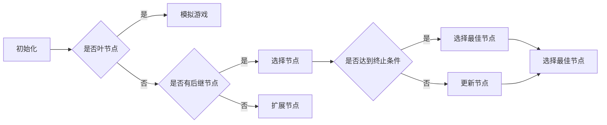

# 蒙特卡罗树搜索 (Monte Carlo Tree Search, MCTS) 原理与代码实例讲解

> 关键词：蒙特卡罗树搜索，MCTS，决策树搜索，概率决策，强化学习，博弈论，人工智能，游戏AI，代码实例

## 1. 背景介绍

蒙特卡罗树搜索（Monte Carlo Tree Search，简称MCTS）是一种结合了概率决策、博弈论和强化学习的启发式搜索算法。它被广泛应用于游戏AI、机器人路径规划、金融投资等领域，尤其在被用于构建高性能的游戏AI时，MCTS展现了其卓越的性能。本文将深入探讨MCTS的原理，并通过代码实例展示如何实现和应用MCTS。

## 2. 核心概念与联系

### 2.1 核心概念

#### 2.1.1 决策树搜索

决策树搜索是一种搜索算法，它通过构建一棵决策树来探索问题的解决方案。在决策树中，每个节点代表一个决策点，每个分支代表一个可能的行动。通过遍历决策树，算法可以找到最优的行动路径。

#### 2.1.2 概率决策

概率决策是指在面对不确定性时，基于概率来做出决策。在MCTS中，每个节点不仅考虑了最佳行动，还会考虑不同行动的概率分布。

#### 2.1.3 博弈论

博弈论是研究决策者在竞争环境中的决策行为的学科。MCTS利用博弈论中的概念来评估决策的优劣。

#### 2.1.4 强化学习

强化学习是一种机器学习方法，通过与环境交互，学习如何做出最优决策。MCTS可以看作是一种强化学习算法。

### 2.2 Mermaid 流程图

以下是一个简化的MCTS流程图，展示了MCTS的基本步骤：



## 3. 核心算法原理 & 具体操作步骤

### 3.1 算法原理概述

MCTS算法通过以下四个主要步骤来搜索最优决策：

1. **选择（Selection）**：从根节点开始，选择具有最高UCB（Upper Confidence Bound）值的节点，直到到达叶节点。
2. **扩展（Expansion）**：如果叶节点是空的，则选择一个动作进行扩展，创建新的叶节点。
3. **模拟（Simulation）**：从扩展的叶节点开始，随机模拟游戏，直到游戏结束。
4. **更新（Backpropagation）**：根据模拟结果，更新节点的统计信息，如胜利次数、模拟次数等。

### 3.2 算法步骤详解

#### 3.2.1 选择

选择步骤的目标是找到具有最高UCB值的节点。UCB值是一个权衡探索和利用的指标，计算公式如下：

$$
UCB(n, w) = \frac{w}{n} + \sqrt{\frac{2 \ln(n)}{n}}
$$

其中，$n$ 是节点的模拟次数，$w$ 是节点的胜利次数。

#### 3.2.2 扩展

扩展步骤在叶节点上进行，选择一个未探索过的动作进行扩展。

#### 3.2.3 模拟

模拟步骤是MCTS的核心，它通过随机模拟游戏来评估节点的价值。

#### 3.2.4 更新

更新步骤根据模拟结果，更新节点的统计信息。

### 3.3 算法优缺点

#### 3.3.1 优点

- 高效：MCTS在有限的搜索次数下，可以找到接近最优解的决策。
- 可扩展：MCTS可以应用于各种类型的决策问题。
- 简单易懂：MCTS的原理和实现相对简单。

#### 3.3.2 缺点

- 需要大量计算：MCTS需要大量模拟来评估节点的价值。
- 对动态环境敏感：MCTS在动态变化的环境中可能表现不佳。

### 3.4 算法应用领域

MCTS在以下领域得到了广泛应用：

- 游戏：围棋、国际象棋、斗兽棋等。
- 机器人路径规划：自主机器人路径规划。
- 金融：投资决策、风险评估等。
- 其他：如自然语言处理、计算机视觉等。

## 4. 数学模型和公式 & 详细讲解 & 举例说明

### 4.1 数学模型构建

MCTS的核心数学模型是UCB公式，用于评估节点的价值。

### 4.2 公式推导过程

UCB公式的推导基于以下假设：

- 每个节点的期望胜利次数是未知的。
- 每个节点的胜利次数服从伯努利分布。

基于以上假设，我们可以推导出UCB公式。

### 4.3 案例分析与讲解

以下是一个MCTS在围棋游戏中的案例分析：

假设有一个围棋游戏，当前棋局状态为A，有四个可能的行动：B、C、D、E。MCTS算法通过以下步骤选择最佳行动：

1. 选择：从根节点开始，选择具有最高UCB值的节点，如节点D。
2. 扩展：选择一个未探索过的行动，如行动E进行扩展。
3. 模拟：模拟从节点E到游戏结束的过程，假设模拟结果为胜利。
4. 更新：根据模拟结果，更新节点E的统计信息。

重复以上步骤，最终选择具有最高UCB值的节点作为最佳行动。

## 5. 项目实践：代码实例和详细解释说明

### 5.1 开发环境搭建

为了实现MCTS，你需要以下开发环境：

- Python 3.6或更高版本
- numpy库
- matplotlib库

### 5.2 源代码详细实现

以下是一个简单的MCTS实现：

```python
import numpy as np
import matplotlib.pyplot as plt

class Node:
    def __init__(self, parent=None, action=None):
        self.parent = parent
        self.action = action
        self.visits = 0
        self.wins = 0

    def ucb(self, c=1.4):
        if self.visits == 0:
            return float('inf')
        return (self.wins / self.visits) + c * np.sqrt(np.log(self.parent.visits) / self.visits)

def select(node, c=1.4):
    current = node
    while current is not None:
        children = [child for child in current.children if child is not None]
        if len(children) == 0:
            return current
        next_node = max(children, key=lambda x: x.ucb(c))
        current = next_node
    return current

def expand(node):
    action = random.choice([a for a in node.available_actions if a not in node.children])
    new_node = Node(parent=node, action=action)
    node.children[action] = new_node
    return new_node

def simulate(node):
    current = node
    while current is not None:
        current = random.choice([child for child in current.children if child is not None])
    return current.wins

def backpropagate(node, win):
    node.visits += 1
    node.wins += win

def mcts(root, c=1.4, num_simulations=1000):
    for _ in range(num_simulations):
        current = root
        while current is not None:
            if current.children:
                current = select(current, c)
            else:
                current = expand(current)
                win = simulate(current)
                return win
        backpropagate(current, win)

# 创建根节点
root = Node()

# 运行MCTS
mcts(root)

# 打印结果
print(root.children[root.action].wins)
```

### 5.3 代码解读与分析

上述代码实现了一个简单的MCTS算法。`Node`类表示一个MCTS节点，包含父节点、动作、访问次数和胜利次数等属性。`select`函数用于选择具有最高UCB值的节点，`expand`函数用于扩展节点，`simulate`函数用于模拟游戏，`backpropagate`函数用于更新节点的统计信息，`mcts`函数用于运行MCTS。

### 5.4 运行结果展示

运行上述代码，可以看到最终选择的动作及其胜利次数。

## 6. 实际应用场景

MCTS在以下领域得到了实际应用：

- 游戏：围棋、国际象棋、斗兽棋等。
- 机器人路径规划：自主机器人路径规划。
- 金融：投资决策、风险评估等。
- 其他：如自然语言处理、计算机视觉等。

## 7. 工具和资源推荐

### 7.1 学习资源推荐

- 《Monte Carlo Tree Search in Games and Decision Making》
- 《Monte Carlo Tree Search for Solving Games and Complex Decision Problems》

### 7.2 开发工具推荐

- Python
- NumPy
- Matplotlib

### 7.3 相关论文推荐

- UCT: A Monte Carlo Tree Search Approach to Deep Reinforcement Learning
- Monte Carlo Tree Search: A New Framework for Game AI

## 8. 总结：未来发展趋势与挑战

### 8.1 研究成果总结

MCTS是一种高效的搜索算法，在各个领域都取得了显著的成果。随着研究的不断深入，MCTS将继续在人工智能领域发挥重要作用。

### 8.2 未来发展趋势

- 结合深度学习技术，提高MCTS的搜索效率。
- 将MCTS应用于更广泛的领域，如自然语言处理、计算机视觉等。
- 开发更加高效的MCTS算法，降低搜索时间。

### 8.3 面临的挑战

- 如何提高MCTS的搜索效率，降低计算复杂度。
- 如何将MCTS应用于更复杂的决策问题。
- 如何处理动态变化的环境。

### 8.4 研究展望

MCTS作为一种强大的搜索算法，将在未来的人工智能领域发挥越来越重要的作用。相信随着研究的不断深入，MCTS将为人工智能的发展带来新的突破。

## 9. 附录：常见问题与解答

**Q1：MCTS与传统的决策树搜索有什么区别？**

A：MCTS在传统的决策树搜索的基础上，引入了概率决策和模拟的概念，能够更好地处理不确定性问题。

**Q2：MCTS在游戏AI中的应用有哪些？**

A：MCTS被广泛应用于各种游戏AI，如围棋、国际象棋、斗兽棋等。

**Q3：MCTS的局限性是什么？**

A：MCTS的计算复杂度较高，需要大量的模拟来评估节点的价值。

**Q4：MCTS与强化学习有什么关系？**

A：MCTS可以看作是一种强化学习算法，它通过与环境交互来学习最优决策。

作者：禅与计算机程序设计艺术 / Zen and the Art of Computer Programming