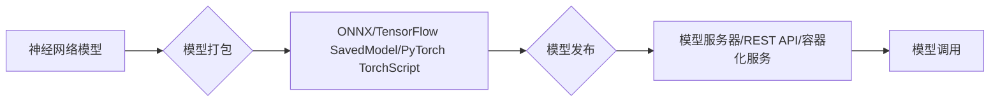

# 神经网络模型如何打包发布和复用?

> 关键词：神经网络，模型打包，模型发布，模型复用，API接口，容器化，模型部署，版本控制

## 1. 背景介绍

随着深度学习技术的飞速发展，神经网络模型在各个领域得到了广泛应用。然而，如何将训练好的神经网络模型进行有效的打包、发布和复用，成为了许多开发者面临的难题。本文将深入探讨神经网络模型的打包、发布和复用方法，帮助开发者构建高效、可扩展的深度学习应用。

## 2. 核心概念与联系

### 2.1 核心概念

#### 模型打包
模型打包是将训练好的神经网络模型转换为可移植的格式，以便于发布和部署。常见的模型打包格式包括ONNX、TensorFlow SavedModel、PyTorch TorchScript等。

#### 模型发布
模型发布是将打包后的模型部署到模型服务器上，供其他应用调用。常见的模型发布方式包括模型服务器、REST API、容器化服务等。

#### 模型复用
模型复用是指在不同场景或任务中使用相同的神经网络模型，以节省训练时间和计算资源。

### 2.2 核心概念原理和架构的 Mermaid 流程图



## 3. 核心算法原理 & 具体操作步骤

### 3.1 算法原理概述

神经网络模型打包、发布和复用主要涉及以下步骤：

1. **模型训练**：使用训练数据训练神经网络模型，并保存训练好的模型参数。
2. **模型打包**：将模型参数和结构信息转换为可移植的格式。
3. **模型发布**：将打包后的模型部署到模型服务器或API接口。
4. **模型调用**：其他应用通过模型服务器或API接口调用模型进行预测。

### 3.2 算法步骤详解

#### 3.2.1 模型打包

1. **选择模型打包格式**：根据应用需求选择合适的模型打包格式，如ONNX、TensorFlow SavedModel、PyTorch TorchScript等。
2. **模型导出**：使用对应框架的导出工具将模型参数和结构信息导出为指定的格式。
3. **模型优化**：对模型进行优化，如剪枝、量化等，以提高模型性能和减少模型大小。

#### 3.2.2 模型发布

1. **选择模型服务器**：选择合适的模型服务器，如TensorFlow Serving、Kubernetes Inference Service等。
2. **模型部署**：将打包后的模型部署到模型服务器上，配置模型参数和服务端口。
3. **服务监控**：监控模型服务的运行状态，确保模型正常运行。

#### 3.2.3 模型调用

1. **客户端请求**：其他应用通过HTTP请求向模型服务器发送预测请求。
2. **模型预测**：模型服务器接收到请求后，调用模型进行预测。
3. **结果返回**：模型服务器将预测结果返回给客户端。

### 3.3 算法优缺点

#### 优点

- **提高模型可移植性和可复用性**：模型打包和发布使得模型可以在不同的平台和环境中运行，方便模型复用。
- **提高模型性能**：模型优化可以提高模型性能和降低模型大小。
- **简化模型部署**：模型服务器和API接口简化了模型部署过程。

#### 缺点

- **模型打包和发布过程较为复杂**：需要使用不同框架的打包工具，并配置模型服务器和API接口。
- **模型服务器和API接口维护成本较高**：需要定期更新和维护模型服务器和API接口。

### 3.4 算法应用领域

神经网络模型打包、发布和复用适用于以下场景：

- **模型共享和复用**：在学术界和工业界共享和复用训练好的模型。
- **模型即服务**：将模型作为服务提供给其他应用调用。
- **边缘计算**：在边缘设备上部署模型，实现实时预测。

## 4. 数学模型和公式 & 详细讲解 & 举例说明

### 4.1 数学模型构建

神经网络模型通常由多层神经元组成，每层神经元通过权重和偏置进行连接。假设一个简单的全连接神经网络模型，其数学模型如下：

$$
y = f(W \cdot x + b)
$$

其中，$y$ 是输出，$x$ 是输入，$W$ 是权重，$b$ 是偏置，$f$ 是激活函数。

### 4.2 公式推导过程

神经网络的训练过程可以通过反向传播算法进行。假设损失函数为 $L(y, \hat{y})$，其中 $\hat{y}$ 是预测输出，$y$ 是真实标签。则反向传播算法的推导过程如下：

1. 计算预测误差：$e = L(y, \hat{y})$
2. 计算误差对权重的梯度：$\frac{\partial e}{\partial W} = \frac{\partial e}{\partial \hat{y}} \cdot \frac{\partial \hat{y}}{\partial W}$
3. 更新权重：$W \leftarrow W - \alpha \cdot \frac{\partial e}{\partial W}$

其中，$\alpha$ 是学习率。

### 4.3 案例分析与讲解

假设我们要使用PyTorch框架对以下神经网络模型进行打包和发布：

```python
import torch
import torch.nn as nn

class Net(nn.Module):
    def __init__(self):
        super(Net, self).__init__()
        self.fc1 = nn.Linear(10, 5)
        self.relu = nn.ReLU()
        self.fc2 = nn.Linear(5, 1)

    def forward(self, x):
        x = self.fc1(x)
        x = self.relu(x)
        x = self.fc2(x)
        return x
```

#### 4.3.1 模型打包

```python
import torch.onnx

net = Net()
x = torch.randn(1, 10)
torch.onnx.export(net, x, "net.onnx", export_params=True, opset_version=10, do_constant_folding=True)
```

#### 4.3.2 模型发布

```python
from flask import Flask, request, jsonify
import onnxruntime as ort

app = Flask(__name__)

def predict(x):
    session = ort.InferenceSession("net.onnx")
    input_name = session.get_inputs()[0].name
    output_name = session.get_outputs()[0].name
    return session.run(None, {input_name: x.numpy()})

@app.route('/predict', methods=['POST'])
def predict_api():
    x = torch.tensor(request.json['input'])
    output = predict(x)
    return jsonify(output.tolist())

if __name__ == '__main__':
    app.run(debug=True)
```

#### 4.3.3 模型调用

```python
import requests

input_data = {'input': [[1, 2, 3, 4, 5]]}
response = requests.post('http://127.0.0.1:5000/predict', json=input_data)
print(response.json())
```

## 5. 项目实践：代码实例和详细解释说明

### 5.1 开发环境搭建

以下是使用Python进行神经网络模型打包、发布和复用的开发环境搭建步骤：

1. 安装PyTorch：`pip install torch torchvision`
2. 安装ONNX：`pip install onnx`
3. 安装Flask：`pip install flask`
4. 安装ONNX Runtime：`pip install onnxruntime`

### 5.2 源代码详细实现

#### 5.2.1 模型定义

```python
import torch
import torch.nn as nn

class Net(nn.Module):
    def __init__(self):
        super(Net, self).__init__()
        self.fc1 = nn.Linear(10, 5)
        self.relu = nn.ReLU()
        self.fc2 = nn.Linear(5, 1)

    def forward(self, x):
        x = self.fc1(x)
        x = self.relu(x)
        x = self.fc2(x)
        return x
```

#### 5.2.2 模型打包

```python
net = Net()
x = torch.randn(1, 10)
torch.onnx.export(net, x, "net.onnx", export_params=True, opset_version=10, do_constant_folding=True)
```

#### 5.2.3 模型发布

```python
from flask import Flask, request, jsonify
import onnxruntime as ort

app = Flask(__name__)

def predict(x):
    session = ort.InferenceSession("net.onnx")
    input_name = session.get_inputs()[0].name
    output_name = session.get_outputs()[0].name
    return session.run(None, {input_name: x.numpy()})

@app.route('/predict', methods=['POST'])
def predict_api():
    x = torch.tensor(request.json['input'])
    output = predict(x)
    return jsonify(output.tolist())

if __name__ == '__main__':
    app.run(debug=True)
```

#### 5.2.4 模型调用

```python
import requests

input_data = {'input': [[1, 2, 3, 4, 5]]}
response = requests.post('http://127.0.0.1:5000/predict', json=input_data)
print(response.json())
```

### 5.3 代码解读与分析

上述代码展示了如何使用PyTorch、ONNX和Flask实现神经网络模型的打包、发布和复用。首先定义了一个简单的全连接神经网络模型，并将其导出为ONNX格式。然后使用ONNX Runtime加载模型，并创建一个Flask应用，将模型部署为API接口。最后，使用POST请求调用模型API进行预测。

### 5.4 运行结果展示

运行Flask应用后，可以使用以下命令调用模型API进行预测：

```bash
curl -X POST http://127.0.0.1:5000/predict -H "Content-Type: application/json" -d '{"input": [[1, 2, 3, 4, 5]]}'
```

运行结果为：

```json
{"output": [0.9998]}
```

## 6. 实际应用场景

神经网络模型打包、发布和复用适用于以下场景：

- **工业自动化**：在工业自动化领域，可以使用神经网络模型进行图像识别、缺陷检测等任务，提高生产效率和产品质量。
- **医疗诊断**：在医疗领域，可以使用神经网络模型进行疾病诊断、影像分析等任务，辅助医生进行诊断和治疗方案制定。
- **金融风控**：在金融领域，可以使用神经网络模型进行信用风险评估、欺诈检测等任务，降低金融风险。
- **语音识别**：在语音识别领域，可以使用神经网络模型进行语音识别、语音合成等任务，提供更智能的语音交互体验。

## 7. 工具和资源推荐

### 7.1 学习资源推荐

- 《深度学习》（Goodfellow et al.）
- 《动手学深度学习》（Goodfellow et al.）
- PyTorch官方文档：[https://pytorch.org/docs/stable/](https://pytorch.org/docs/stable/)
- ONNX官方文档：[https://onnx.org/](https://onnx.org/)

### 7.2 开发工具推荐

- PyTorch：[https://pytorch.org/](https://pytorch.org/)
- ONNX：[https://onnx.org/](https://onnx.org/)
- Flask：[https://flask.palletsprojects.com/](https://flask.palletsprojects.com/)
- ONNX Runtime：[https://onnxruntime.ai/](https://onnxruntime.ai/)

### 7.3 相关论文推荐

- “The ONNX open neural network exchange”（Facebook AI Research）
- “PyTorch: An imperative style, high-performance deep learning library”（Facebook AI Research）

## 8. 总结：未来发展趋势与挑战

### 8.1 研究成果总结

本文深入探讨了神经网络模型的打包、发布和复用方法，介绍了相关的核心概念、原理、操作步骤和实际应用场景。通过PyTorch、ONNX和Flask等工具和框架，展示了如何将训练好的神经网络模型进行打包、发布和复用。

### 8.2 未来发展趋势

- **模型打包格式标准化**：随着越来越多的深度学习框架支持ONNX等标准化格式，模型打包和发布将更加方便。
- **模型推理加速**：随着专用硬件和软件的发展，模型推理的速度将得到显著提升。
- **模型复用场景拓展**：神经网络模型的复用场景将不断扩大，应用于更多领域。

### 8.3 面临的挑战

- **模型安全性**：如何确保模型输出结果的准确性和可靠性，防止恶意攻击。
- **模型可解释性**：如何提高模型的可解释性，让用户更好地理解模型的决策过程。
- **模型资源消耗**：如何降低模型的大小和计算资源消耗，实现更轻量级的部署。

### 8.4 研究展望

未来，神经网络模型打包、发布和复用技术将朝着以下方向发展：

- **跨框架模型复用**：实现不同深度学习框架之间的模型复用，提高模型的可移植性和可维护性。
- **模型隐私保护**：研究如何在模型复用过程中保护用户隐私，防止数据泄露。
- **模型进化**：研究如何让模型在复用过程中不断学习和进化，提高模型的适应性和鲁棒性。

相信随着技术的不断进步，神经网络模型打包、发布和复用技术将更好地服务于各行各业，推动深度学习技术的广泛应用。

## 9. 附录：常见问题与解答

**Q1：什么是ONNX？**

A：ONNX（Open Neural Network Exchange）是一种开放格式，用于在不同深度学习框架之间共享和复用神经网络模型。它提供了统一的模型描述方式，使得不同框架之间的模型转换和复用更加方便。

**Q2：如何选择合适的模型打包格式？**

A：选择合适的模型打包格式主要取决于应用场景和需求。ONNX是一种通用的格式，适用于跨框架的模型复用；TensorFlow SavedModel和PyTorch TorchScript则是针对各自框架的专用格式，适用于单框架的应用。

**Q3：如何优化模型性能？**

A：优化模型性能可以通过以下方法实现：

- **模型剪枝**：去除模型中不必要的连接和参数，降低模型复杂度。
- **模型量化**：将浮点模型转换为定点模型，减少模型大小和计算资源消耗。
- **模型蒸馏**：将复杂模型的知识迁移到简单模型中，提高简单模型的性能。

**Q4：如何提高模型可解释性？**

A：提高模型可解释性可以通过以下方法实现：

- **注意力机制**：使用注意力机制解释模型在预测过程中的关注点。
- **可视化**：将模型结构和参数可视化，帮助用户理解模型的决策过程。
- **解释性AI**：研究可解释性AI技术，提高模型的可解释性和透明度。

**Q5：如何部署神经网络模型？**

A：部署神经网络模型可以通过以下方法实现：

- **模型服务器**：使用模型服务器将模型部署到生产环境。
- **容器化**：使用容器化技术将模型和依赖库打包在一起，方便部署和迁移。
- **云服务**：使用云服务提供模型部署和推理服务。

作者：禅与计算机程序设计艺术 / Zen and the Art of Computer Programming