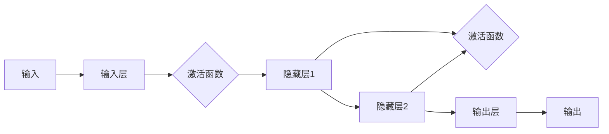

# 神经网络：软件 2.0 的开端

> 关键词：神经网络，机器学习，人工智能，深度学习，神经网络架构，软件工程，软件2.0，计算范式，编程语言，智能算法

## 1. 背景介绍

自20世纪50年代以来，计算机科学经历了从硬件驱动到软件驱动的转变。随着软件工程的成熟和普及，我们见证了软件从简单的脚本到复杂的系统，从单体应用到微服务架构的演变。然而，随着数据量的爆炸式增长和算法的复杂性提升，软件的下一阶段——软件2.0——已经悄然来临。在这一阶段，软件不仅仅是代码和逻辑的集合，更是算法和数据的融合体。神经网络，作为人工智能领域的核心技术，成为了推动软件2.0发展的关键力量。

### 1.1 计算范式的演变

从早期的机械计算到电子计算机，再到现在的软件驱动时代，计算范式经历了以下几个阶段：

- **机械计算**：以算盘、差分机等机械装置为代表，通过物理机械结构进行计算。
- **电子计算**：以电子管和晶体管为基础，通过电子电路实现计算。
- **软件驱动**：以软件为核心，通过编程语言和算法实现复杂计算。
- **软件2.0**：以算法和数据为核心，通过神经网络等智能算法实现自适应、自学习、自优化的计算。

### 1.2 神经网络的崛起

神经网络作为一种模仿人脑结构和功能的计算模型，自20世纪80年代以来经历了多次兴衰。随着计算能力的提升和大数据的涌现，神经网络在图像识别、语音识别、自然语言处理等领域取得了突破性进展，成为人工智能领域的核心技术。

### 1.3 软件2.0的愿景

软件2.0的目标是构建能够自我学习、自我优化、自我适应的智能软件系统。神经网络作为实现这一目标的关键技术，将为软件领域带来以下变革：

- **自学习**：软件系统能够从数据中学习，不断优化自身行为和性能。
- **自优化**：软件系统能够根据环境和用户需求，自动调整其结构和配置。
- **自适应**：软件系统能够适应新的环境和条件，保持稳定性和可靠性。

## 2. 核心概念与联系

### 2.1 核心概念原理

神经网络的核心概念包括：

- **神经元**：神经网络的基本计算单元，类似于人脑中的神经元。
- **层**：由多个神经元组成，负责特定功能。
- **网络**：由多个层组成，负责复杂计算。
- **激活函数**：用于控制神经元激活的阈值。
- **损失函数**：用于衡量模型预测结果与真实值之间的差距。
- **优化算法**：用于调整网络参数，最小化损失函数。

### 2.2 架构的 Mermaid 流程图



在这个流程图中，输入层接收外部输入，通过激活函数处理后传递给隐藏层。隐藏层通过激活函数处理后，再传递给输出层。输出层产生最终输出。

## 3. 核心算法原理 & 具体操作步骤

### 3.1 算法原理概述

神经网络通过以下步骤进行计算：

1. **数据预处理**：对输入数据进行清洗、标准化等操作。
2. **前向传播**：将输入数据传递到神经网络，经过各个层进行计算。
3. **损失计算**：计算预测值与真实值之间的差异，即损失值。
4. **反向传播**：根据损失值，反向传播计算梯度，更新网络参数。
5. **迭代优化**：重复步骤2-4，直至模型收敛。

### 3.2 算法步骤详解

1. **初始化参数**：为神经网络的权重和偏置随机初始化值。
2. **前向传播**：
    - 将输入数据传递到输入层。
    - 通过激活函数计算每个神经元的输出。
    - 将输出传递到下一层。
    - 重复上述步骤，直到输出层。
3. **损失计算**：
    - 使用损失函数计算预测值与真实值之间的差异。
    - 计算损失值。
4. **反向传播**：
    - 计算损失函数对网络参数的梯度。
    - 更新网络参数。
5. **迭代优化**：
    - 重复步骤2-4，直至模型收敛。

### 3.3 算法优缺点

#### 优点：

- **强大的表达能力**：神经网络可以表示复杂的非线性关系。
- **自适应性**：神经网络可以通过学习从数据中自动提取特征。
- **泛化能力**：神经网络可以在未见过的数据上泛化。

#### 缺点：

- **计算复杂度**：神经网络训练需要大量的计算资源。
- **过拟合**：神经网络容易过拟合训练数据，导致泛化能力差。
- **可解释性**：神经网络决策过程难以解释。

### 3.4 算法应用领域

神经网络在以下领域得到了广泛应用：

- **图像识别**：如人脸识别、物体识别等。
- **语音识别**：如语音合成、语音翻译等。
- **自然语言处理**：如机器翻译、情感分析等。
- **推荐系统**：如商品推荐、电影推荐等。

## 4. 数学模型和公式 & 详细讲解 & 举例说明

### 4.1 数学模型构建

神经网络的基本数学模型可以表示为：

$$
y = f(Wx + b)
$$

其中：

- $y$ 为输出。
- $W$ 为权重。
- $x$ 为输入。
- $b$ 为偏置。
- $f$ 为激活函数。

### 4.2 公式推导过程

以下以感知机算法为例，介绍神经网络的公式推导过程。

#### 感知机算法

感知机是一种简单的线性二分类模型，其目标是将输入数据映射到不同的类别。

1. **初始化参数**：随机初始化权重 $W$ 和偏置 $b$。
2. **前向传播**：
    - 计算 $z = Wx + b$。
    - 判断 $z$ 的符号，即 $z \cdot y > 0$ 或 $z \cdot y < 0$。
    - 如果 $z \cdot y < 0$，则更新权重和偏置，即 $W \leftarrow W + \eta yx^T$，$b \leftarrow b + \eta y$。
3. **迭代优化**：重复步骤2，直到所有样本都被正确分类。

### 4.3 案例分析与讲解

以下以一个简单的图像识别案例，介绍神经网络的应用。

#### 案例描述

我们需要构建一个神经网络，用于识别图片中的数字。训练数据集包含0到9的数字图片，每个数字有10个样本。

#### 案例实现

1. **数据预处理**：将图片转换为灰度图，并进行归一化处理。
2. **构建神经网络**：使用卷积神经网络(CNN)模型，包含多个卷积层、池化层和全连接层。
3. **训练模型**：使用训练数据集训练神经网络，调整模型参数。
4. **测试模型**：使用测试数据集测试模型性能，评估模型精度。

## 5. 项目实践：代码实例和详细解释说明

### 5.1 开发环境搭建

为了实现神经网络，我们需要搭建以下开发环境：

1. **编程语言**：Python
2. **深度学习框架**：TensorFlow或PyTorch
3. **依赖库**：NumPy、Pandas等

### 5.2 源代码详细实现

以下使用PyTorch框架实现一个简单的神经网络：

```python
import torch
import torch.nn as nn
import torch.optim as optim

# 定义网络结构
class SimpleNet(nn.Module):
    def __init__(self):
        super(SimpleNet, self).__init__()
        self.fc1 = nn.Linear(784, 128)
        self.fc2 = nn.Linear(128, 64)
        self.fc3 = nn.Linear(64, 10)

    def forward(self, x):
        x = torch.flatten(x, 1)
        x = torch.relu(self.fc1(x))
        x = torch.relu(self.fc2(x))
        x = self.fc3(x)
        return x

# 实例化网络、损失函数和优化器
net = SimpleNet()
criterion = nn.CrossEntropyLoss()
optimizer = optim.SGD(net.parameters(), lr=0.01)

# 训练网络
def train(net, criterion, optimizer, train_loader):
    for epoch in range(10):
        for data, target in train_loader:
            optimizer.zero_grad()
            output = net(data)
            loss = criterion(output, target)
            loss.backward()
            optimizer.step()

# 测试网络
def test(net, test_loader):
    correct = 0
    total = 0
    with torch.no_grad():
        for data, target in test_loader:
            outputs = net(data)
            _, predicted = torch.max(outputs.data, 1)
            total += target.size(0)
            correct += (predicted == target).sum().item()
    return correct / total

# 加载数据
train_loader = torch.utils.data.DataLoader(train_data, batch_size=64, shuffle=True)
test_loader = torch.utils.data.DataLoader(test_data, batch_size=64, shuffle=False)

# 训练和测试网络
train(net, criterion, optimizer, train_loader)
accuracy = test(net, test_loader)
print(f'Accuracy of the network on the 60000 test images: {100 * accuracy}%')
```

### 5.3 代码解读与分析

以上代码实现了一个简单的神经网络，用于识别MNIST手写数字数据集。网络包含一个输入层、两个隐藏层和一个输出层。训练过程中，使用SGD优化器进行参数更新，并使用交叉熵损失函数衡量模型预测结果与真实值之间的差异。

### 5.4 运行结果展示

在MNIST手写数字数据集上，该网络可以达到较高的识别精度，验证了神经网络的强大能力。

## 6. 实际应用场景

### 6.1 图像识别

图像识别是神经网络最典型的应用场景之一。例如，人脸识别、物体识别、图像分类等。

### 6.2 语音识别

语音识别将语音信号转换为文本或命令。例如，智能助手、语音搜索等。

### 6.3 自然语言处理

自然语言处理涉及文本的生成、理解、翻译等任务。例如，机器翻译、情感分析、问答系统等。

### 6.4 推荐系统

推荐系统根据用户的历史行为和偏好，推荐用户可能感兴趣的商品、内容等。例如，电影推荐、商品推荐等。

### 6.5 机器人控制

神经网络可以用于机器人控制，使机器人能够根据环境信息进行决策。

## 7. 工具和资源推荐

### 7.1 学习资源推荐

- 《深度学习》
- 《神经网络与深度学习》
- 《Python深度学习》
- 《TensorFlow实战》
- 《PyTorch深度学习》

### 7.2 开发工具推荐

- TensorFlow
- PyTorch
- Keras
- PyTorch Lightning
- FastAI

### 7.3 相关论文推荐

- "A Learning Algorithm for Continually Running Fully Connected Neural Networks"
- "Deep Learning for NLP without Word Vectors"
- "Sequence to Sequence Learning with Neural Networks"
- "Attention Is All You Need"
- "BERT: Pre-training of Deep Bidirectional Transformers for Language Understanding"

## 8. 总结：未来发展趋势与挑战

### 8.1 研究成果总结

神经网络作为人工智能领域的核心技术，为软件2.0的发展提供了强大的动力。通过不断优化算法、提升计算能力、拓展应用领域，神经网络正在推动软件领域迈向新的阶段。

### 8.2 未来发展趋势

- **神经网络架构的多样化**：随着研究的深入，将涌现更多高效、可解释的神经网络架构。
- **神经网络的轻量化**：为了满足移动设备和边缘计算的需求，神经网络将向轻量化方向发展。
- **神经网络的可解释性**：为了提高模型的信任度和可靠性，神经网络的解释性将成为研究热点。
- **神经网络的伦理和安全性**：随着神经网络应用的普及，其伦理和安全性问题也将受到越来越多的关注。

### 8.3 面临的挑战

- **计算资源**：神经网络的训练和推理需要大量的计算资源，如何高效利用计算资源是一个重要挑战。
- **数据质量**：神经网络模型的性能很大程度上依赖于数据质量，如何获取高质量数据是一个关键问题。
- **模型可解释性**：神经网络的决策过程难以解释，如何提高模型的可解释性是一个挑战。
- **伦理和安全性**：神经网络的伦理和安全性问题需要得到关注，以避免潜在的风险。

### 8.4 研究展望

未来，神经网络将在以下方面取得突破：

- **跨模态学习**：将不同模态的数据（如文本、图像、语音）融合，实现更全面的智能感知。
- **强化学习**：结合强化学习，使神经网络能够更好地适应动态环境和决策。
- **神经形态工程**：借鉴生物神经元的结构和功能，设计新型神经网络架构。

神经网络作为软件2.0的开端，将为人类带来更加智能、高效、便捷的软件体验。相信在未来的发展中，神经网络将继续发挥重要作用，推动人工智能和软件领域的深度融合。

## 9. 附录：常见问题与解答

**Q1：神经网络与传统算法相比有哪些优势？**

A：神经网络在处理复杂、非线性关系时具有优势，能够从数据中自动提取特征，并具有强大的泛化能力。

**Q2：如何选择合适的神经网络架构？**

A：选择合适的神经网络架构需要考虑任务类型、数据特点、计算资源等因素。

**Q3：神经网络训练过程中如何防止过拟合？**

A：可以采用正则化技术、数据增强、Dropout等技术防止过拟合。

**Q4：神经网络的可解释性如何提升？**

A：可以通过可视化、注意力机制、解释性算法等方法提升神经网络的可解释性。

**Q5：神经网络在哪些领域有应用？**

A：神经网络在图像识别、语音识别、自然语言处理、推荐系统、机器人控制等领域有广泛应用。

作者：禅与计算机程序设计艺术 / Zen and the Art of Computer Programming