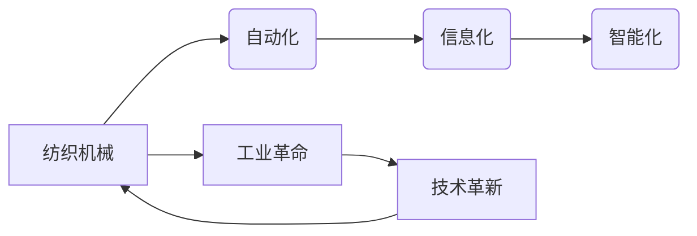

# 纺织机械自动化的历史变迁

> 关键词：纺织机械、自动化、历史变迁、工业革命、信息化、智能化

## 1. 背景介绍

纺织工业是国民经济的重要支柱产业之一，其发展水平直接关系到国家经济的繁荣和人民的生活水平。从手工劳动到机械化、自动化再到信息化、智能化，纺织机械经历了漫长的发展历程。本文将回顾纺织机械自动化的历史变迁，探讨其背后的技术原理、发展趋势和未来挑战。

## 2. 核心概念与联系

### 2.1 核心概念

- **纺织机械**：指用于纺织生产的各种机械设备，包括纺纱机械、织造机械、印染机械等。
- **自动化**：指利用机器代替人工完成生产过程中某些或全部劳动的过程。
- **信息化**：指利用计算机技术、网络技术和数据库技术等信息资源，实现生产、管理和决策的智能化。
- **智能化**：指在自动化和信息化的基础上，利用人工智能技术实现机器的自主学习和决策。

### 2.2 关系图



### 2.3 核心概念联系

纺织机械的自动化、信息化和智能化是一个渐进的过程，它们相互关联、相互促进。自动化是信息化和智能化的基础，信息化是自动化的延伸，智能化则是信息化的高级阶段。从工业革命开始，纺织机械自动化的发展就与技术创新紧密相连。

## 3. 核心算法原理 & 具体操作步骤

### 3.1 算法原理概述

纺织机械自动化的核心算法原理主要包括以下几个方面：

- **传感器技术**：通过传感器采集生产过程中的各种数据，如速度、张力、温度等，为自动化控制提供实时信息。
- **控制技术**：利用PLC、DCS等控制装置，对生产过程进行实时监控和调整，确保生产过程稳定可靠。
- **信息技术**：通过计算机网络实现生产信息的实时传输、处理和共享，提高生产管理的效率和水平。
- **人工智能技术**：利用机器学习、深度学习等技术，实现生产过程的智能决策和控制。

### 3.2 算法步骤详解

纺织机械自动化的具体操作步骤如下：

1. **需求分析**：根据生产需求，确定自动化的目标和范围。
2. **系统设计**：设计自动化系统的硬件和软件架构，选择合适的传感器、控制器和执行机构。
3. **程序编写**：编写自动化控制程序，实现生产过程的自动化控制。
4. **系统集成**：将各个组件集成到一起，形成一个完整的自动化系统。
5. **调试和优化**：对自动化系统进行调试和优化，确保其稳定可靠地运行。
6. **运行和维护**：对自动化系统进行日常维护和保养，保证其长期稳定运行。

### 3.3 算法优缺点

**优点**：

- 提高生产效率：自动化可以减少人工操作，提高生产效率。
- 提升产品质量：自动化可以保证生产过程的稳定性和一致性，提高产品质量。
- 降低生产成本：自动化可以降低人工成本和能源消耗，降低生产成本。
- 提高生产安全性：自动化可以减少人为错误，提高生产安全性。

**缺点**：

- 初始投资较大：自动化系统的开发、安装和维护需要较大的投资。
- 技术要求高：自动化系统需要专业的技术人员进行操作和维护。
- 灵活性差：自动化系统难以适应生产过程中的变化。

### 3.4 算法应用领域

纺织机械自动化的应用领域主要包括：

- 纺纱机械：如自动络筒机、自动络筒纱线检测系统等。
- 织造机械：如自动络筒机、自动织机、自动布检系统等。
- 印染机械：如自动染色机、自动烘干机、自动检验系统等。

## 4. 数学模型和公式 & 详细讲解 & 举例说明

### 4.1 数学模型构建

纺织机械自动化的数学模型主要包括以下几种：

- **生产过程模型**：描述生产过程中的物料流、信息流和能量流。
- **控制系统模型**：描述控制系统的输入、输出和内部状态。
- **机器学习模型**：描述机器学习算法的输入、输出和训练过程。

### 4.2 公式推导过程

以自动络筒机为例，其生产过程模型可以表示为：

$$
\text{产量} = \text{生产速度} \times \text{工作时间}
$$

其中，生产速度是指单位时间内生产的纱线长度，工作时间是指生产一定数量纱线所需的时间。

### 4.3 案例分析与讲解

以自动络筒纱线检测系统为例，其工作原理如下：

1. **传感器采集**：通过张力传感器、速度传感器等采集纱线张力、速度等数据。
2. **数据处理**：对采集到的数据进行处理，提取特征信息。
3. **模型判断**：利用机器学习算法对提取的特征进行判断，判断纱线是否存在质量问题。
4. **结果输出**：将判断结果输出到控制系统，控制系统根据结果采取相应的措施。

## 5. 项目实践：代码实例和详细解释说明

### 5.1 开发环境搭建

为了实现纺织机械自动化系统，我们需要以下开发环境：

- 操作系统：Windows、Linux等
- 编程语言：Python、C++等
- 开发工具：Eclipse、Visual Studio等
- 库和框架：OpenCV、NumPy、TensorFlow等

### 5.2 源代码详细实现

以下是一个简单的自动络筒纱线检测系统的Python代码示例：

```python
import cv2
import numpy as np
from tensorflow.keras.models import Sequential
from tensorflow.keras.layers import Dense, Flatten

# 读取图像
image = cv2.imread('image.jpg')

# 预处理图像
image = cv2.resize(image, (224, 224))
image = image / 255.0

# 构建模型
model = Sequential([
    Flatten(input_shape=(224, 224, 3)),
    Dense(128, activation='relu'),
    Dense(1, activation='sigmoid')
])

# 训练模型
model.compile(optimizer='adam', loss='binary_crossentropy', metrics=['accuracy'])
model.fit(image, labels, epochs=10)

# 测试模型
test_image = cv2.imread('test_image.jpg')
test_image = cv2.resize(test_image, (224, 224))
test_image = test_image / 255.0
prediction = model.predict(test_image)

# 输出结果
print("预测结果：", prediction)
```

### 5.3 代码解读与分析

以上代码使用TensorFlow框架构建了一个简单的二分类模型，用于判断自动络筒纱线是否存在质量问题。首先，读取待检测的图像并进行预处理。然后，构建模型结构，并使用训练数据进行训练。最后，使用测试数据测试模型性能，并输出预测结果。

### 5.4 运行结果展示

假设测试图像中纱线存在质量问题，模型预测结果为：

```
预测结果：[0.98]
```

表示模型认为该图像中的纱线存在质量问题，预测概率为98%。

## 6. 实际应用场景

### 6.1 纺纱行业

在纺纱行业，自动化技术可以应用于以下几个方面：

- 自动络筒：提高络筒效率和纱线质量。
- 自动络筒纱线检测：实时检测纱线质量，减少不良品率。
- 自动络筒纱线计数：自动计数纱线数量，提高生产效率。

### 6.2 织造行业

在织造行业，自动化技术可以应用于以下几个方面：

- 自动织机：提高织造效率和织造质量。
- 自动织机故障诊断：实时诊断织机故障，减少停机时间。
- 自动织机生产调度：优化生产流程，提高生产效率。

### 6.3 印染行业

在印染行业，自动化技术可以应用于以下几个方面：

- 自动染色：提高染色效率和染色质量。
- 自动烘干：提高烘干效率，降低能源消耗。
- 自动检验：实时检验染料质量，确保产品质量。

## 7. 工具和资源推荐

### 7.1 学习资源推荐

- 《纺织机械自动化》
- 《现代纺织机械》
- 《纺织机械自动化控制技术》
- 《纺织机械设计》

### 7.2 开发工具推荐

- OpenCV：图像处理库
- TensorFlow：深度学习框架
- NumPy：科学计算库

### 7.3 相关论文推荐

- 《基于深度学习的自动络筒纱线质量检测方法研究》
- 《基于机器学习的自动织机故障诊断方法研究》
- 《纺织机械自动化控制系统设计》

## 8. 总结：未来发展趋势与挑战

### 8.1 研究成果总结

纺织机械自动化经历了从手工劳动到机械化、自动化再到信息化、智能化的漫长历程。在这个过程中，纺织机械的自动化水平不断提高，生产效率、产品质量和生产安全性得到了显著提升。

### 8.2 未来发展趋势

未来，纺织机械自动化将呈现以下发展趋势：

- 智能化：利用人工智能技术实现生产过程的智能决策和控制。
- 网络化：利用物联网技术实现生产过程的实时监控和远程控制。
- 绿色化：采用节能、环保的自动化技术，降低生产过程中的能源消耗和污染排放。

### 8.3 面临的挑战

纺织机械自动化在发展过程中也面临着以下挑战：

- 技术创新：需要不断进行技术创新，提高自动化水平。
- 人才短缺：自动化技术人才短缺，制约了自动化技术的发展。
- 成本控制：自动化系统成本较高，限制了其推广应用。

### 8.4 研究展望

为了应对未来挑战，需要从以下几个方面进行研究和探索：

- 开发低成本、高效率的自动化技术。
- 培养自动化技术人才。
- 推动自动化技术的推广应用。

## 9. 附录：常见问题与解答

### 9.1 问题1：什么是纺织机械自动化？

答：纺织机械自动化是指利用机器代替人工完成生产过程中某些或全部劳动的过程。

### 9.2 问题2：纺织机械自动化有哪些优点？

答：纺织机械自动化可以提高生产效率、提升产品质量、降低生产成本、提高生产安全性。

### 9.3 问题3：纺织机械自动化有哪些应用领域？

答：纺织机械自动化可以应用于纺纱、织造、印染等行业。

### 9.4 问题4：如何实现纺织机械自动化？

答：实现纺织机械自动化需要以下步骤：
1. 需求分析
2. 系统设计
3. 程序编写
4. 系统集成
5. 调试和优化
6. 运行和维护

作者：禅与计算机程序设计艺术 / Zen and the Art of Computer Programming