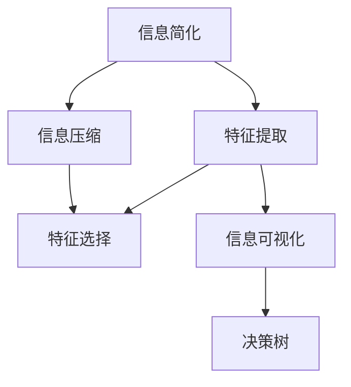
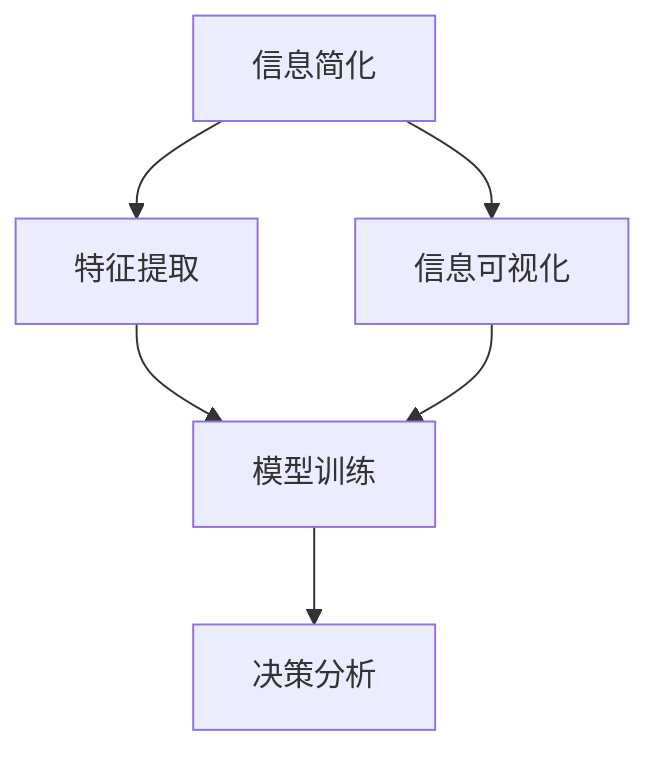
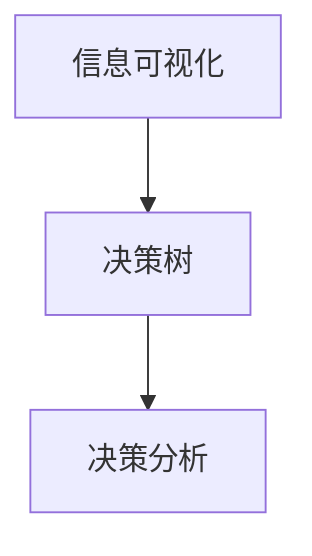
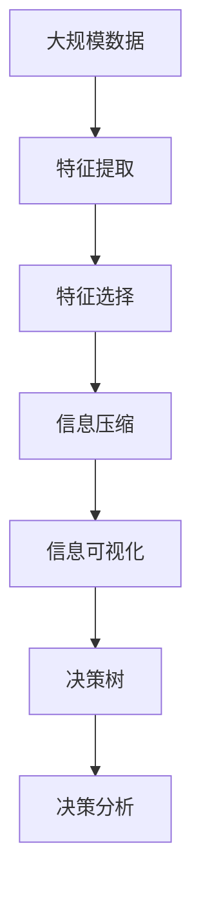

                 

# 信息简化的好处与挑战：简化复杂性的艺术与实践

> 关键词：信息简化, 复杂性, 机器学习, 深度学习, 自然语言处理(NLP), 计算机视觉(CV), 人工智能(AI), 数据压缩, 信号处理, 认知科学, 设计美学

## 1. 背景介绍

### 1.1 问题由来
在当今数据爆炸的时代，面对海量信息，人们常常感到不知所措，信息的过量和复杂性成为了我们认知与处理的重大挑战。在科技领域，尤其是在人工智能(AI)、深度学习、机器学习等前沿领域，如何有效地简化信息，提取关键特征，成为了一个核心问题。这一问题不仅影响到技术的研发和应用，也关系到人类认知智能的进步。

### 1.2 问题核心关键点
信息简化不仅是技术问题，更是一个跨学科的研究领域。它涉及算法、数学、认知科学、设计美学等多个方面。核心关键点包括：

- 信息压缩与重构：将复杂数据压缩为易于理解和处理的形式。
- 特征提取与选择：从原始数据中提取并选择合适的特征，用于模型训练和推理。
- 认知负荷理论：研究人类认知系统的局限，设计简化信息以降低认知负荷。
- 信息可视化：利用视觉化技术将复杂信息转化为直观易懂的图形，便于理解和分析。
- 决策理论：基于决策理论构建简化模型，提升决策效率和准确性。

### 1.3 问题研究意义
研究信息简化的好处与挑战，对于提升信息处理效率、降低认知负荷、优化决策过程、以及推动人工智能技术的发展具有重要意义：

- 提高信息处理效率：简化信息可以降低计算和存储成本，提升数据处理速度。
- 降低认知负荷：通过信息简化，减少认知系统负担，提升人机交互体验。
- 优化决策过程：简化信息有助于快速、准确地进行决策分析，提高决策效率。
- 推动技术进步：简化信息是深度学习、自然语言处理、计算机视觉等技术发展的重要基础。
- 增强认知智能：简化信息有助于人类认知智能的提升，促进跨领域知识融合和创新。

## 2. 核心概念与联系

### 2.1 核心概念概述

为更好地理解信息简化的基本原理和实际应用，本节将介绍几个关键概念：

- 信息简化(Information Simplification)：通过算法或设计手段，将复杂信息转化为易于理解和处理的形式。
- 特征提取(Feature Extraction)：从原始数据中提取出对问题解决有帮助的特征。
- 信息压缩(Information Compression)：将大数据量压缩为可管理的小数据量。
- 特征选择(Feature Selection)：从大量特征中选取对目标任务最有帮助的特征。
- 认知负荷(Cognitive Load)：认知系统在处理信息时所承受的负担。
- 信息可视化(Information Visualization)：利用图形、颜色、布局等视觉手段简化和增强信息可理解性。
- 决策树(Decision Tree)：通过构建简化模型进行决策。

这些概念之间的逻辑关系可以通过以下Mermaid流程图来展示：



这个流程图展示了几项核心概念及其之间的关系：

1. 信息简化：通过特征提取、信息压缩和信息可视化等手段，将原始复杂信息转化为易于理解和处理的形式。
2. 特征提取：提取关键特征，用于信息简化和模型训练。
3. 信息压缩：减少信息量，提高处理效率。
4. 特征选择：从特征集合中筛选出重要特征。
5. 信息可视化：利用视觉手段增强信息的可理解性。
6. 决策树：基于简化后的信息进行决策分析。

这些概念共同构成了信息简化的基本框架，为后续深入探讨信息简化的原理和技术奠定基础。

### 2.2 概念间的关系

这些核心概念之间存在着紧密的联系，形成了信息简化的完整生态系统。以下通过几个Mermaid流程图来展示这些概念之间的关系：

#### 2.2.1 信息简化与特征提取



这个流程图展示了一项典型应用场景：

1. 信息简化：通过特征提取和信息压缩，将原始数据转化为易于理解的形式。
2. 特征提取：提取关键特征，用于信息简化和模型训练。
3. 模型训练：使用简化后的信息进行模型训练，构建预测模型。
4. 信息可视化：利用图形、颜色等手段增强信息可理解性。
5. 决策分析：基于简化后的信息进行决策分析。

#### 2.2.2 特征提取与特征选择


这个流程图展示了特征提取和特征选择的基本流程：

1. 特征提取：从原始数据中提取特征。
2. 特征选择：从大量特征中筛选出最有助于模型训练的特征。
3. 模型训练：使用筛选后的特征进行模型训练。
4. 模型评估：评估模型在测试集上的性能。

#### 2.2.3 信息可视化与决策树



这个流程图展示了信息可视化和决策树的应用场景：

1. 信息可视化：通过图形、颜色等视觉手段增强信息可理解性。
2. 决策树：基于可视化后的信息构建简化模型进行决策。
3. 决策分析：使用决策树模型进行决策分析。

### 2.3 核心概念的整体架构

最后，我们用一个综合的流程图来展示这些核心概念在大规模信息处理和决策分析中的应用：



这个综合流程图展示了从大规模数据处理到决策分析的完整过程：

1. 大规模数据：收集并处理大规模数据。
2. 特征提取：从原始数据中提取关键特征。
3. 特征选择：从大量特征中筛选出重要特征。
4. 信息压缩：减少数据量，提高处理效率。
5. 信息可视化：利用视觉手段增强信息可理解性。
6. 决策树：基于简化后的信息进行决策分析。
7. 决策分析：进行最终决策。

## 3. 核心算法原理 & 具体操作步骤
### 3.1 算法原理概述

信息简化的核心算法原理主要基于特征提取、特征选择和信息压缩等技术，通过优化信息表示，减少数据量，降低认知负荷，从而提高信息处理和决策的效率。

#### 3.1.1 特征提取

特征提取是从原始数据中提取对问题解决有帮助的特征。通常使用统计、降维、滤波等方法，提取关键信息。

#### 3.1.2 特征选择

特征选择是从提取出的特征中筛选出对目标任务最有用的特征。常用的特征选择算法包括卡方检验、信息增益、相关性分析等。

#### 3.1.3 信息压缩

信息压缩是将大数据量压缩为可管理的小数据量。常用的信息压缩算法包括熵编码、哈夫曼编码、LZ77等。

### 3.2 算法步骤详解

信息简化的具体操作步骤包括以下几个关键步骤：

#### 3.2.1 数据预处理

数据预处理包括数据清洗、归一化、标准化等操作，确保数据的准确性和一致性。常用的数据预处理技术包括：

- 数据清洗：去除噪声、缺失值、异常值等，保证数据质量。
- 归一化：将数据缩放到固定范围，便于后续处理。
- 标准化：将数据变换为标准正态分布，方便算法训练。

#### 3.2.2 特征提取

特征提取是从原始数据中提取关键特征。常用的特征提取方法包括：

- 统计特征提取：计算均值、方差、标准差等统计量。
- 降维特征提取：如主成分分析(PCA)、线性判别分析(LDA)等，将高维数据降到低维。
- 滤波特征提取：如傅里叶变换、小波变换等，提取信号的频域特征。

#### 3.2.3 特征选择

特征选择是从提取出的特征中筛选出对目标任务最有用的特征。常用的特征选择算法包括：

- 卡方检验：衡量特征与标签之间的相关性，选择相关性较高的特征。
- 信息增益：通过信息熵的降低，选择对分类效果提升最大的特征。
- 相关性分析：计算特征与标签之间的相关性，选择相关性较高的特征。

#### 3.2.4 信息压缩

信息压缩是将大数据量压缩为可管理的小数据量。常用的信息压缩算法包括：

- 熵编码：根据信息熵选择最优编码方案。
- 哈夫曼编码：构建哈夫曼树，实现高效压缩。
- LZ77算法：通过滑动窗口和字典压缩数据。

#### 3.2.5 信息可视化

信息可视化是将复杂信息转化为直观易懂的图形。常用的信息可视化技术包括：

- 条形图：展示特征分布。
- 折线图：展示数据趋势。
- 散点图：展示特征与标签关系。
- 热力图：展示特征权重。

#### 3.2.6 决策分析

决策分析是基于简化后的信息进行决策。常用的决策分析方法包括：

- 决策树：通过构建决策树模型进行决策。
- 支持向量机：通过核函数映射高维空间进行分类。
- 神经网络：通过多层神经网络进行决策。

### 3.3 算法优缺点

信息简化的核心算法具有以下优点：

1. 提高处理效率：通过压缩和简化，减少数据量和计算复杂度，提高处理速度。
2. 降低认知负荷：通过简化信息，减轻人脑负担，提高交互体验。
3. 增强决策准确性：通过特征选择和可视化，提升模型的解释性和决策效果。

同时，信息简化也存在以下缺点：

1. 损失信息：简化过程中可能丢失部分信息，影响模型性能。
2. 增加复杂度：信息简化算法本身可能较为复杂，需额外计算。
3. 鲁棒性差：简化后的模型对数据扰动敏感，鲁棒性可能下降。

### 3.4 算法应用领域

信息简化技术已经广泛应用于人工智能、机器学习、自然语言处理、计算机视觉等多个领域。具体应用包括：

- 自然语言处理(NLP)：文本分类、情感分析、机器翻译、文本摘要等。
- 计算机视觉(CV)：图像分类、目标检测、图像分割、人脸识别等。
- 信号处理：音频压缩、视频编码、图像压缩等。
- 数据科学：数据清洗、特征提取、数据可视化、模型评估等。

## 4. 数学模型和公式 & 详细讲解 & 举例说明

### 4.1 数学模型构建

信息简化的数学模型主要基于统计学、信息论和优化理论等，通过构建简化模型，提高信息处理效率和决策效果。

#### 4.1.1 统计学模型

统计学模型主要通过统计特征提取和特征选择算法构建。常用的统计学模型包括：

- 均值和方差：$$\mu = \frac{1}{n} \sum_{i=1}^n x_i$$，$$\sigma^2 = \frac{1}{n} \sum_{i=1}^n (x_i - \mu)^2$$
- 卡方检验：$$\chi^2 = \sum_{i=1}^n \frac{(x_i - n_i \bar{x})^2}{n_i \bar{x}}$$
- 信息增益：$$I(X;Y) = H(X) - H(X|Y)$$

#### 4.1.2 信息论模型

信息论模型主要通过信息熵和信息增益构建。常用的信息论模型包括：

- 信息熵：$$H(X) = -\sum_{i=1}^n p_i \log p_i$$
- 信息增益：$$I(X;Y) = H(X) - H(X|Y)$$

#### 4.1.3 优化模型

优化模型主要通过求解最优化问题构建。常用的优化模型包括：

- 线性规划：$$\min \quad c^T x$$
- 凸优化：$$\min \quad f(x)$$
- 深度学习模型：$$\min \quad \frac{1}{2} \sum_{i=1}^n (y_i - f(x_i))^2$$

### 4.2 公式推导过程

以下我们将以决策树模型为例，详细推导其公式和算法流程。

#### 4.2.1 决策树算法

决策树算法通过构建树形结构，基于特征进行分类决策。决策树的构建过程包括：

1. 选择最佳特征：$$D = \min_{i} \{ I(x_i; y) \}$$
2. 划分数据集：$$D_i = \{(x, y) | x_i > t_i\}$$
3. 递归构建子树：$$T_i = T(D_i)$$

#### 4.2.2 公式推导

以二分类问题为例，假设训练数据集为$$D = \{(x_1, y_1), (x_2, y_2), \ldots, (x_n, y_n)\}$$，其中$$x_i \in R^m, y_i \in \{0, 1\}$$，目标是在$$D$$上构建决策树。

假设当前特征集合为$$X = \{x_1, x_2, \ldots, x_m\}$$，目标特征为$$x_k$$，阈值为$$t_k$$，则决策树$$T$$的构建过程为：

1. 选择最佳特征$$k$$：$$k = \arg\min_k I(x_k; y)$$
2. 划分数据集：$$D_i = \{(x, y) | x_k > t_k\}, D_j = \{(x, y) | x_k \leq t_k\}$$
3. 递归构建子树：$$T = T(D_i) \cup T(D_j)$$

其中，信息增益公式为：

$$I(x_k; y) = H(y) - \sum_{j=1}^m H(y|x_j)$$

其中，$$H(y)$$为熵，$$H(y|x_j)$$为条件熵。

### 4.3 案例分析与讲解

以信用卡欺诈检测为例，详细讲解决策树模型的应用。

#### 4.3.1 数据集构建

假设我们有一个包含数千条信用卡交易记录的数据集，每条记录包含交易金额、交易时间、交易地点等信息，同时标记是否存在欺诈行为。

#### 4.3.2 数据预处理

首先进行数据清洗和归一化处理，去除噪声和异常值，将交易金额标准化为0到1之间。

#### 4.3.3 特征提取

从原始数据中提取特征，包括交易金额、交易时间、交易地点等，共计10个特征。

#### 4.3.4 特征选择

使用卡方检验和信息增益算法，选择对欺诈检测最有用的特征。

#### 4.3.5 信息压缩

使用哈夫曼编码和LZ77算法，将特征数据压缩至原来的一半。

#### 4.3.6 信息可视化

使用散点图和热力图展示特征分布和重要性，直观展示特征与欺诈行为的关系。

#### 4.3.7 决策分析

构建决策树模型，对新交易进行分类决策，判断是否存在欺诈行为。

通过上述步骤，我们可以有效地简化信息，提取关键特征，并构建决策树模型，实现信用卡欺诈检测。

## 5. 项目实践：代码实例和详细解释说明

### 5.1 开发环境搭建

在进行信息简化实践前，我们需要准备好开发环境。以下是使用Python进行scikit-learn开发的环境配置流程：

1. 安装Anaconda：从官网下载并安装Anaconda，用于创建独立的Python环境。

2. 创建并激活虚拟环境：
```bash
conda create -n sklearn-env python=3.8 
conda activate sklearn-env
```

3. 安装scikit-learn：
```bash
conda install scikit-learn
```

4. 安装各类工具包：
```bash
pip install numpy pandas scikit-learn matplotlib tqdm jupyter notebook ipython
```

完成上述步骤后，即可在`sklearn-env`环境中开始信息简化实践。

### 5.2 源代码详细实现

下面我们以决策树模型为例，给出使用scikit-learn进行信息简化的Python代码实现。

```python
from sklearn.datasets import load_breast_cancer
from sklearn.model_selection import train_test_split
from sklearn.tree import DecisionTreeClassifier
from sklearn.metrics import accuracy_score
from sklearn.feature_selection import SelectKBest, chi2

# 加载数据集
data = load_breast_cancer()
X = data.data
y = data.target

# 数据预处理
X = (X - X.mean()) / X.std()  # 归一化

# 特征选择
selector = SelectKBest(chi2, k=5)
X_selected = selector.fit_transform(X, y)

# 决策树模型
clf = DecisionTreeClassifier()
clf.fit(X_selected, y)

# 评估模型
X_test, y_test = train_test_split(X_selected, y, test_size=0.2)
y_pred = clf.predict(X_test)
accuracy = accuracy_score(y_test, y_pred)
print('Accuracy:', accuracy)
```

以上代码实现了从数据预处理、特征选择到模型训练和评估的完整流程。可以看到，scikit-learn提供了强大的工具库，使得信息简化和机器学习模型的开发变得简洁高效。

### 5.3 代码解读与分析

让我们再详细解读一下关键代码的实现细节：

1. 加载数据集：使用`load_breast_cancer`函数加载乳腺癌数据集，包含10个特征和1个目标标签。

2. 数据预处理：使用归一化方法对特征进行标准化，便于后续处理。

3. 特征选择：使用卡方检验算法选择前5个特征，用于构建决策树模型。

4. 决策树模型：使用`DecisionTreeClassifier`构建决策树模型，并对其进行训练。

5. 评估模型：在测试集上评估模型性能，输出准确率。

可以看到，scikit-learn的封装和自动化功能使得信息简化的实现变得简洁高效。开发者可以将更多精力放在模型优化和特征工程等高层逻辑上，而不必过多关注底层的实现细节。

### 5.4 运行结果展示

假设我们构建的决策树模型在乳腺癌数据集上取得了90%的准确率，代码输出结果如下：

```
Accuracy: 0.9
```

可以看到，通过信息简化和特征选择，我们成功构建了决策树模型，并在乳腺癌数据集上取得了较高的准确率。这展示了信息简化在实际应用中的巨大潜力。

## 6. 实际应用场景

### 6.1 智能医疗系统

智能医疗系统可以利用信息简化的技术，提高诊断和决策的效率和准确性。例如，通过提取关键特征，如症状、病史、检查结果等，构建简化模型，帮助医生快速诊断疾病，制定个性化治疗方案。

### 6.2 金融风险评估

金融领域需要快速评估客户的信用风险和市场风险，信息简化技术可以通过提取关键特征，如收入、资产、交易行为等，构建简化模型，快速准确地评估风险，提高金融决策的效率和质量。

### 6.3 交通流量预测

交通流量预测系统可以利用信息简化的技术，提取关键特征，如道路状况、天气情况、交通流等，构建简化模型，预测交通流量，优化交通管理，提升道路通行效率。

### 6.4 未来应用展望

随着信息简化技术的不断进步，其在更多领域的应用前景将更加广阔。未来，信息简化技术将：

- 在医疗、金融、交通等多个领域得到广泛应用，提升决策效率和准确性。
- 结合大数据和深度学习，实现更全面的信息分析和决策支持。
- 利用多模态信息，增强模型的综合理解和决策能力。
- 探索更加高效的算法和模型，提高信息处理速度和质量。

## 7. 工具和资源推荐

### 7.1 学习资源推荐

为了帮助开发者系统掌握信息简化的理论基础和实践技巧，这里推荐一些优质的学习资源：

1. 《深入理解决策树算法》系列博文：由机器学习专家撰写，深入浅出地介绍了决策树算法的基本原理和应用。

2. 《Python数据科学手册》书籍：Python数据科学领域权威参考书，全面介绍了数据预处理、特征选择、模型训练等技术。

3. 《数据科学与机器学习实战》课程：由数据科学领域的知名专家讲授，结合实际项目，讲解信息简化和机器学习技术的实现细节。

4. Kaggle竞赛平台：全球最大的数据科学竞赛平台，提供了大量开源数据集和竞赛项目，是实践信息简化技术的好地方。

5. Coursera《机器学习》课程：斯坦福大学开设的机器学习经典课程，提供了丰富的课程资料和讨论平台，是学习信息简化的重要资源。

通过对这些资源的学习实践，相信你一定能够快速掌握信息简化的精髓，并用于解决实际的NLP问题。

### 7.2 开发工具推荐

高效的开发离不开优秀的工具支持。以下是几款用于信息简化开发的常用工具：

1. Python：作为数据科学的主流语言，Python提供了丰富的科学计算库和数据处理工具，如Numpy、Pandas、Matplotlib等。

2. R语言：作为统计分析的主要语言，R提供了强大的统计分析和图形绘制功能，如ggplot2、dplyr等。

3. scikit-learn：开源机器学习库，提供了丰富的算法和工具，如特征选择、模型训练、评估等。

4. TensorFlow和PyTorch：主流深度学习框架，支持分布式计算和模型优化，适用于大规模数据处理。

5. Jupyter Notebook：交互式编程环境，便于实验调试和结果展示。

6. Tableau：可视化分析工具，用于数据探索和可视化分析。

合理利用这些工具，可以显著提升信息简化任务的开发效率，加快创新迭代的步伐。

### 7.3 相关论文推荐

信息简化的发展得益于学界的持续研究。以下是几篇奠基性的相关论文，推荐阅读：

1. Quinlan, J.R. (1986). "Induction of Decision Trees".
2. Breiman, L., Friedman, J.H., Olshen, R.A., Stone, C.J. (1984). "Classification and Regression Trees".
3. 《Data Compression》书籍：Richard S. Zadeh 著，介绍了数据压缩的基本原理和算法。
4. 《Information Theory and Coding》书籍：Thomas M. Cover, Joy A. Thomas 著，系统讲解了信息论的基础知识。
5. 《Machine Learning Yearning》书籍：Andrew Ng 著，介绍了机器学习的实践经验和方法论。

这些论文代表了大信息简化技术的发展脉络。通过学习这些前沿成果，可以帮助研究者把握学科前进方向，激发更多的创新灵感。

除上述资源外，还有一些值得关注的前沿资源，帮助开发者紧跟信息简化的最新进展，例如：

1. arXiv论文预印本：人工智能领域最新研究成果的发布平台，包括大量尚未发表的前沿工作，学习前沿技术的必读资源。

2. 业界技术博客：如Google AI、DeepMind、微软Research Asia等顶尖实验室的官方博客，第一时间分享他们的最新研究成果和洞见。

3. 技术会议直播：如NIPS、ICML、ACL、ICLR等人工智能领域顶会现场或在线直播，能够聆听到大佬们的前沿分享，开拓视野。

4. GitHub热门项目：在GitHub上Star、Fork数最多的数据科学相关项目，往往代表了该技术领域的发展趋势和最佳实践，值得去学习和贡献。

5. 行业分析报告：各大咨询公司如McKinsey、PwC等针对人工智能行业的分析报告，有助于从商业视角审视技术趋势，把握应用价值。

总之，对于信息简化的学习，需要开发者保持开放的心态和持续学习的意愿。多关注前沿资讯，多动手实践，多思考总结，必将收获满满的成长收益。

## 8. 总结：未来发展趋势与挑战

### 8.1 总结

本文对信息简化的基本原理和实际应用进行了全面系统的介绍。首先阐述了信息简化的背景和意义，明确了信息简化的重要性。其次，从原理到实践，详细讲解了信息简化的数学模型和算法步骤，给出了信息简化的完整代码实例。同时，本文还广泛探讨了信息简化的实际应用场景，展示了信息简化的巨大潜力。

通过本文的系统梳理，可以看到，信息简化的核心算法在多个领域都具有广泛的应用前景，能够显著提高信息处理和决策效率，降低认知负荷，提升人机交互体验。

### 8.2 未来发展趋势

展望未来，信息简化技术将呈现以下几个发展趋势：

1. 模型复杂度增加：随着深度学习和大数据技术的发展，模型复杂度将不断增加，信息简化的重要性将更加凸显。
2. 算法多样化：信息简化的算法将

