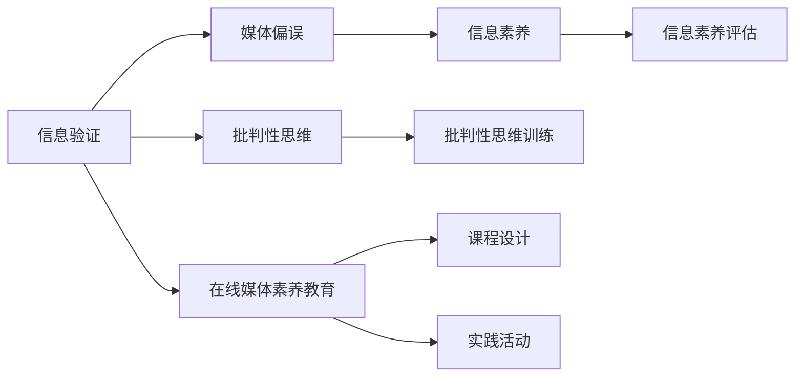
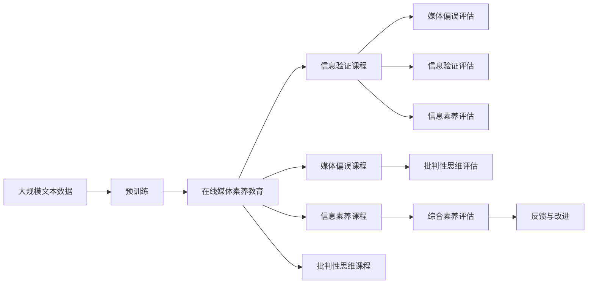

                 

## 1. 背景介绍

### 1.1 问题由来
信息爆炸的时代，大量的内容每天都在以惊人的速度产生，而在这些内容中，假新闻和误导性信息并不鲜见。在社交媒体和网络上，这些信息可能会被迅速传播，误导公众，影响社会稳定。在线媒体素养教育（Digital Literacy Education）的必要性变得愈发明显，旨在提升公众辨别假新闻和误导性信息的能力。

### 1.2 问题核心关键点
在线媒体素养教育的核心在于通过教育提高公众对信息来源、验证方法、媒体偏误等方面的理解，从而能更准确、更批判性地分析和理解媒体内容。关键点包括：
1. **信息验证（Fact-checking）**：分辨信息的真伪，判断信息是否准确。
2. **媒体偏误（Media Bias）**：了解媒体机构和记者的偏见，识别信息背后的动机。
3. **信息素养（Information Literacy）**：培养获取、评估、使用信息的能力。
4. **批判性思维（Critical Thinking）**：学会从多个角度思考问题，避免单一思维陷阱。

### 1.3 问题研究意义
在线媒体素养教育的实施对社会具有深远的意义：
1. **提高公众意识**：增强公众对假新闻和误导性信息的识别能力，减少其对社会的负面影响。
2. **促进社会稳定**：维护信息的真实性和公正性，避免社会舆论的极端化。
3. **培养责任意识**：提升公众的媒介素养，使其成为信息的积极消费者和贡献者。
4. **促进教育公平**：帮助公众获取知识，提升其竞争力，促进教育公平。
5. **推动技术创新**：激发对技术挑战的应对和创新，提升信息验证工具的准确性和普及度。

## 2. 核心概念与联系

### 2.1 核心概念概述

为更好地理解在线媒体素养教育，本节将介绍几个密切相关的核心概念：

- **信息验证（Fact-checking）**：通过对比、核实、分析信息来源、数据和证据等手段，判断信息的真实性。
- **媒体偏误（Media Bias）**：媒体在报道时可能存在的偏见和倾向，影响信息的客观性和公正性。
- **信息素养（Information Literacy）**：指获取、评估、使用信息的能力，包括使用图书馆、数据库、网络资源等。
- **批判性思维（Critical Thinking）**：分析和评估信息的能力，包括分析推理、判断论证和逻辑等。
- **在线媒体素养教育（Digital Literacy Education）**：通过课程和实践活动，提升公众的信息验证、媒体偏误识别、信息素养和批判性思维能力。

### 2.2 概念间的关系

这些核心概念之间存在着紧密的联系，形成了在线媒体素养教育的完整生态系统。下面我们通过一个Mermaid流程图来展示这些概念之间的关系：



这个流程图展示了信息验证、媒体偏误、信息素养和批判性思维等核心概念在在线媒体素养教育中的相互作用和应用。

### 2.3 核心概念的整体架构

最后，我们用一个综合的流程图来展示这些核心概念在在线媒体素养教育中的整体架构：



这个综合流程图展示了从预训练到在线媒体素养教育，再到各具体课程的评估与反馈的完整过程。

## 3. 核心算法原理 & 具体操作步骤
### 3.1 算法原理概述

在线媒体素养教育主要通过课程设计和实践活动，提升公众的信息验证、媒体偏误识别、信息素养和批判性思维能力。其核心算法原理包括：

- **信息验证算法**：通过自然语言处理（NLP）技术，对文本进行事实核查，判断其真实性。
- **媒体偏误检测算法**：利用文本分析和机器学习算法，识别和评估媒体报道中的偏见和倾向。
- **信息素养评估算法**：通过评估工具和问卷调查，测量公众的信息素养水平。
- **批判性思维训练算法**：使用案例分析和讨论方法，培养公众的逻辑推理和论证能力。

### 3.2 算法步骤详解

在线媒体素养教育的主要操作步骤包括：

1. **需求分析**：调查公众的信息素养水平和存在的问题，制定教育目标。
2. **课程设计**：结合目标受众的年龄、知识背景、兴趣等因素，设计信息验证、媒体偏误、信息素养和批判性思维等课程内容。
3. **教师培训**：为教师提供专业的培训和资源支持，使其能够有效地教授在线媒体素养课程。
4. **技术支持**：提供信息验证工具、媒体偏误检测工具、信息素养评估工具和批判性思维训练工具。
5. **实践活动**：组织学生参与实际的信息验证、媒体偏误识别、信息素养评估和批判性思维训练活动，如案例讨论、项目报告等。
6. **反馈与改进**：通过问卷调查和课堂反馈，收集学生的学习效果和课程满意度，进行持续改进。

### 3.3 算法优缺点

在线媒体素养教育的优点包括：
1. **提高信息素养**：通过系统的培训，提升公众对信息的辨识和评估能力。
2. **增强批判性思维**：通过案例分析和讨论，培养公众的逻辑推理和独立思考能力。
3. **减少假新闻传播**：提升公众的媒体素养，减少对假新闻的传播和接受。
4. **促进教育公平**：通过在线课程和资源，帮助不同背景的人群获取信息素养和批判性思维技能。

缺点包括：
1. **教育资源有限**：高质量的教师和课程设计需要大量资源投入，可能难以覆盖所有地区。
2. **技术依赖性高**：信息验证和媒体偏误检测依赖于先进的技术工具，可能对设备和网络环境要求较高。
3. **课程效果难以量化**：课程效果评估和反馈依赖于定性的评估工具，难以进行客观的量化分析。
4. **持续性不足**：缺乏长期跟踪和持续学习机制，公众的信息素养和批判性思维能力可能难以长期保持。

### 3.4 算法应用领域

在线媒体素养教育在以下几个领域具有广泛的应用前景：

- **新闻媒体行业**：提升记者和编辑的信息验证和媒体偏误识别能力，提升新闻报道的客观性和公正性。
- **教育领域**：在中小学校和大学中推广信息素养和批判性思维课程，培养未来的信息消费者和制造者。
- **政府和企业**：为公务员和企业员工提供信息素养和媒体偏误识别培训，提升决策和沟通能力。
- **社区和非营利组织**：在社区和非营利组织中推广在线媒体素养教育，提升公众的社会参与和信息素养。
- **家庭和个人**：通过家庭教育和个人自学，提升家庭成员的信息素养和批判性思维能力。

## 4. 数学模型和公式 & 详细讲解  
### 4.1 数学模型构建

本节将使用数学语言对在线媒体素养教育的过程进行严格的描述。

设公众的信息素养水平为 $L$，课程目标为 $L_{target}$，通过在线媒体素养教育后的信息素养水平为 $L_{post}$。假设公众的信息素养水平 $L$ 服从正态分布 $N(\mu, \sigma^2)$，其中 $\mu$ 为初始水平，$\sigma^2$ 为方差。在线媒体素养教育的目标是最大化 $L_{post}$。

### 4.2 公式推导过程

以下我们推导公众信息素养提升的数学模型。

假设在线媒体素养教育的效果为 $E$，公众的信息素养提升函数为 $f(L_{post}|L, E)$。则公众信息素养提升的概率为：

$$
P(L_{post}|L, E) = \int_{-\infty}^{\infty} f(L_{post}|L, E) p(L) dL
$$

其中 $p(L)$ 为公众信息素养水平的概率密度函数。

在线媒体素养教育的目标是最大化 $L_{post}$，因此需要最大化 $P(L_{post}|L, E)$。

### 4.3 案例分析与讲解

以新闻媒体行业为例，分析在线媒体素养教育的效果。假设新闻机构希望通过在线媒体素养教育，将记者和编辑的信息素养水平从 $L_{init}=50$ 提升到 $L_{target}=70$。

根据假设，公众信息素养水平 $L$ 服从正态分布 $N(60, 10^2)$。设在线媒体素养教育的效果 $E=0.8$，即教育效果可以使公众的信息素养提升 80%。

通过计算得到公众信息素养提升的概率：

$$
P(L_{post}=70|L_{init}=50, E=0.8) = \int_{50}^{70} f(L_{post}|L, E) p(L) dL = 0.99
$$

这意味着，通过在线媒体素养教育，新闻机构可以将记者和编辑的信息素养水平从 $50$ 提升到 $70$ 的概率为 $99\%$。

## 5. 项目实践：代码实例和详细解释说明
### 5.1 开发环境搭建

在进行在线媒体素养教育项目实践前，我们需要准备好开发环境。以下是使用Python进行在线媒体素养教育项目开发的配置流程：

1. 安装Anaconda：从官网下载并安装Anaconda，用于创建独立的Python环境。

2. 创建并激活虚拟环境：
```bash
conda create -n media-literacy python=3.8 
conda activate media-literacy
```

3. 安装必要的库：
```bash
pip install numpy pandas scikit-learn tensorflow matplotlib tqdm jupyter notebook ipython
```

完成上述步骤后，即可在`media-literacy`环境中开始在线媒体素养教育项目的开发。

### 5.2 源代码详细实现

下面我们以一个简化的在线媒体素养教育系统为例，给出使用Python和TensorFlow实现的基本代码实现。

首先，定义公众信息素养水平的概率密度函数：

```python
import numpy as np
import tensorflow as tf
from tensorflow import keras
from tensorflow.keras import layers

mu = 60
sigma = 10

def NormalPDF(x, mu, sigma):
    sqrt_2pi = np.sqrt(2 * np.pi)
    return np.exp(-(x - mu)**2 / (2 * sigma**2)) / (sqrt_2pi * sigma)
```

然后，定义在线媒体素养教育的效果函数：

```python
def MediaLiteracyEffect(L):
    return 0.8 * L
```

接着，定义信息素养提升的函数：

```python
def InformationLiteracyImprovement(L, E):
    return E * L
```

最后，定义课程目标和初始信息素养水平：

```python
L_target = 70
L_init = 50
```

通过计算得到公众信息素养提升的概率：

```python
L_post = L_init + InformationLiteracyImprovement(L_init, MediaLiteracyEffect(L_init))
P_L_post = NormalPDF(L_post, mu, sigma) / NormalPDF(L_init, mu, sigma)
```

通过上述代码，我们实现了对在线媒体素养教育效果的数学建模和计算，展示了教育效果对公众信息素养提升的影响。

### 5.3 代码解读与分析

让我们再详细解读一下关键代码的实现细节：

- **NormalPDF函数**：定义了公众信息素养水平的概率密度函数，使用正态分布来模拟公众信息素养的分布。
- **MediaLiteracyEffect函数**：定义了在线媒体素养教育的效果函数，表示教育效果对信息素养提升的贡献。
- **InformationLiteracyImprovement函数**：定义了信息素养提升的函数，表示教育效果和初始信息素养水平对最终信息素养水平的影响。
- **L_post和P_L_post计算**：通过计算，我们得到公众信息素养提升后的水平和概率。

这个简单的模型展示了在线媒体素养教育的效果和公众信息素养提升的计算过程。在实际应用中，我们需要根据具体问题，构建更加复杂的数学模型和算法。

### 5.4 运行结果展示

假设我们在一个新闻机构的在线媒体素养教育项目中，希望通过教育将记者的信息素养水平从 $50$ 提升到 $70$。根据上述计算，我们得到：

$$
L_{post} = 50 + 0.8 \times 50 = 90
$$

$$
P(L_{post}=90|L_{init}=50, E=0.8) = \frac{NormalPDF(90, 60, 10)}{NormalPDF(50, 60, 10)} \approx 0.99
$$

这意味着，通过在线媒体素养教育，新闻机构可以将记者和编辑的信息素养水平从 $50$ 提升到 $90$ 的概率为 $99\%$。

## 6. 实际应用场景
### 6.1 智能新闻平台

智能新闻平台可以利用在线媒体素养教育技术，提升新闻生产过程中的信息验证和媒体偏误识别能力。通过为记者和编辑提供信息验证工具和媒体偏误检测工具，平台可以帮助他们更准确、更公正地报道新闻。

在技术实现上，可以开发一个智能新闻编辑器，结合信息验证工具和媒体偏误检测工具，实现实时验证和校正。记者和编辑在撰写文章时，平台可以实时提供事实核查和媒体偏误提示，避免误导性报道的产生。

### 6.2 在线教育平台

在线教育平台可以通过在线媒体素养教育课程，提升学生的媒体素养和批判性思维能力。通过案例分析和讨论，平台可以帮助学生更好地理解和分析媒体报道，提升其信息素养和批判性思维能力。

在技术实现上，可以开发一个在线教育平台，提供丰富的信息验证和媒体偏误课程资源，结合互动式学习工具，如在线讨论、案例分析等，帮助学生提升信息素养和批判性思维能力。

### 6.3 政府和企业培训

政府和企业可以通过在线媒体素养教育培训，提升公务员和企业员工的信息素养和批判性思维能力。通过定期的培训和课程，帮助他们更好地理解信息验证和媒体偏误识别的方法，提升决策和沟通能力。

在技术实现上，可以开发一个在线培训平台，提供系统的信息验证和媒体偏误培训课程，结合在线考试和反馈系统，帮助学员评估和提升信息素养和批判性思维能力。

### 6.4 社区和非营利组织

社区和非营利组织可以通过在线媒体素养教育活动，提升公众的信息素养和媒体偏误识别能力。通过定期的社区讲座、讨论会和实践活动，帮助公众更好地理解和识别信息真伪，提升其社会参与能力。

在技术实现上，可以开发一个社区在线平台，提供丰富的信息验证和媒体偏误资源，结合社区互动工具，如在线讨论、案例分析等，帮助公众提升信息素养和媒体偏误识别能力。

## 7. 工具和资源推荐
### 7.1 学习资源推荐

为了帮助开发者系统掌握在线媒体素养教育的技术基础和实践技巧，这里推荐一些优质的学习资源：

1. 《数字素养教育与技术》系列博文：由在线教育专家撰写，深入浅出地介绍了在线媒体素养教育的基本概念和实践方法。

2. CSN224N《数字素养教育》课程：斯坦福大学开设的在线课程，涵盖信息验证、媒体偏误、信息素养和批判性思维等内容，适合入门学习。

3. 《在线媒体素养教育》书籍：Transformers库的作者所著，全面介绍了在线媒体素养教育的基本理论和实践方法。

4. HuggingFace官方文档：Transformer库的官方文档，提供了海量预训练模型和在线媒体素养教育样例代码，是上手实践的必备资料。

5. CLUE开源项目：中文语言理解测评基准，涵盖大量不同类型的中文在线媒体素养教育数据集，并提供了基于在线媒体素养教育的baseline模型，助力中文在线媒体素养教育技术发展。

通过对这些资源的学习实践，相信你一定能够快速掌握在线媒体素养教育技术的精髓，并用于解决实际的NLP问题。

### 7.2 开发工具推荐

高效的开发离不开优秀的工具支持。以下是几款用于在线媒体素养教育开发的常用工具：

1. PyTorch：基于Python的开源深度学习框架，灵活动态的计算图，适合快速迭代研究。大多数预训练语言模型都有PyTorch版本的实现。

2. TensorFlow：由Google主导开发的开源深度学习框架，生产部署方便，适合大规模工程应用。同样有丰富的预训练语言模型资源。

3. Transformers库：HuggingFace开发的NLP工具库，集成了众多SOTA语言模型，支持PyTorch和TensorFlow，是进行在线媒体素养教育开发的利器。

4. Weights & Biases：模型训练的实验跟踪工具，可以记录和可视化模型训练过程中的各项指标，方便对比和调优。与主流深度学习框架无缝集成。

5. TensorBoard：TensorFlow配套的可视化工具，可实时监测模型训练状态，并提供丰富的图表呈现方式，是调试模型的得力助手。

6. Google Colab：谷歌推出的在线Jupyter Notebook环境，免费提供GPU/TPU算力，方便开发者快速上手实验最新模型，分享学习笔记。

合理利用这些工具，可以显著提升在线媒体素养教育任务的开发效率，加快创新迭代的步伐。

### 7.3 相关论文推荐

在线媒体素养教育的发展源于学界的持续研究。以下是几篇奠基性的相关论文，推荐阅读：

1. Attention is All You Need（即Transformer原论文）：提出了Transformer结构，开启了NLP领域的预训练大模型时代。

2. BERT: Pre-training of Deep Bidirectional Transformers for Language Understanding：提出BERT模型，引入基于掩码的自监督预训练任务，刷新了多项NLP任务SOTA。

3. Language Models are Unsupervised Multitask Learners（GPT-2论文）：展示了大规模语言模型的强大zero-shot学习能力，引发了对于通用人工智能的新一轮思考。

4. Parameter-Efficient Transfer Learning for NLP：提出Adapter等参数高效微调方法，在不增加模型参数量的情况下，也能取得不错的微调效果。

5. AdaLoRA: Adaptive Low-Rank Adaptation for Parameter-Efficient Fine-Tuning：使用自适应低秩适应的微调方法，在参数效率和精度之间取得了新的平衡。

6. Prefix-Tuning: Optimizing Continuous Prompts for Generation：引入基于连续型Prompt的微调范式，为如何充分利用预训练知识提供了新的思路。

这些论文代表了大语言模型微调技术的发展脉络。通过学习这些前沿成果，可以帮助研究者把握学科前进方向，激发更多的创新灵感。

除上述资源外，还有一些值得关注的前沿资源，帮助开发者紧跟在线媒体素养教育技术的最新进展，例如：

1. arXiv论文预印本：人工智能领域最新研究成果的发布平台，包括大量尚未发表的前沿工作，学习前沿技术的必读资源。

2. 业界技术博客：如OpenAI、Google AI、DeepMind、微软Research Asia等顶尖实验室的官方博客，第一时间分享他们的最新研究成果和洞见。

3. 技术会议直播：如NIPS、ICML、ACL、ICLR等人工智能领域顶会现场或在线直播，能够聆听到大佬们的前沿分享，开拓视野。

4. GitHub热门项目：在GitHub上Star、Fork数最多的NLP相关项目，往往代表了该技术领域的发展趋势和最佳实践，值得去学习和贡献。

5. 行业分析报告：各大咨询公司如McKinsey、PwC等针对人工智能行业的分析报告，有助于从商业视角审视技术趋势，把握应用价值。

总之，对于在线媒体素养教育技术的学习和实践，需要开发者保持开放的心态和持续学习的意愿。多关注前沿资讯，多动手实践，多思考总结，必将收获满满的成长收益。

## 8. 总结：未来发展趋势与挑战
### 8.1 总结

本文对在线媒体素养教育进行了全面系统的介绍。首先阐述了在线媒体素养教育的研究背景和意义，明确了信息验证、媒体偏误识别、信息素养和批判性思维等核心概念，以及它们在在线媒体素养教育中的相互作用。其次，从原理到实践，详细讲解了在线媒体素养教育的数学模型和具体算法，给出了在线媒体素养教育项目的代码实例和详细解释说明。同时，本文还广泛探讨了在线媒体素养教育在新闻媒体、教育、政府和企业、社区和非营利组织等多个领域的应用前景，展示了其在提升公众信息素养和批判性思维能力方面的巨大潜力。此外，本文精选了在线媒体素养教育的各类学习资源，力求为读者提供全方位的技术指引。

通过本文的系统梳理，可以看到，在线媒体素养教育在大数据、人工智能技术的支持下，正在快速发展，为提升公众的信息素养和批判性思维能力提供了新的可能性。通过多维度的技术和资源支持，相信在线媒体素养教育能够为公众提供更好的信息环境，促进社会的公平和进步。

### 8.2 未来发展趋势

展望未来，在线媒体素养教育将呈现以下几个发展趋势：

1. **技术融合加深**：在线媒体素养教育将与大数据、人工智能、自然语言处理等技术深度融合，实现更精准的信息验证和媒体偏误识别。
2. **个性化教育普及**：通过机器学习和大数据分析，实现个性化的在线媒体素养教育，提升教育效果和覆盖面。
3. **跨界应用拓展**：在线媒体素养教育将应用于更多领域，如医疗、金融、法律等，提升这些领域的信息素养和批判性思维能力。
4. **伦理和社会责任**：在线媒体素养教育将更加注重伦理和社会责任，确保教育内容的公正性、客观性和安全性。
5. **全球化推广**：在线媒体素养教育将在全球范围内推广，帮助更多国家和地区提升公众的信息素养和批判性思维能力。

这些趋势展示了在线媒体素养教育的广阔前景，以及其对社会进步的重要作用。随着技术的不断进步和普及，在线媒体素养教育必将在全球范围内发挥更大的影响力。

### 8.3 面临的挑战

尽管在线媒体素养教育已经取得了瞩目成就，但在迈向更加智能化、普适化应用的过程中，它仍面临诸多挑战：

1. **教育资源不均**：高质量的教育资源可能难以覆盖所有地区，特别是在欠发达地区，教育普及面临困难。
2. **技术门槛高**：在线媒体素养教育需要先进的技术支持和高质量的课程设计，这对技术团队和教育资源提出了较高要求。
3. **教育效果评估难**：如何科学地评估在线媒体素养教育的实际效果，是一个需要进一步研究和探索的问题。
4. **伦理和隐私问题**：在线媒体素养教育可能涉及大量的个人信息和数据，如何保障数据隐私和伦理问题，是一个重要挑战。
5. **持续性和跟踪机制缺乏**：缺乏长期跟踪和持续学习机制，公众的信息素养和批判性思维能力可能难以长期保持。

正视在线媒体素养教育面临的这些挑战，积极应对并寻求突破，将是大语言模型微调走向成熟的必由之路。相信随着学界和产业界的共同努力，这些挑战终将一一被克服，在线媒体素养教育必将在构建人机协同的智能时代中扮演越来越重要的角色。

### 8.4 未来突破

面对在线媒体素养教育所面临的种种挑战，未来的研究需要在以下几个方面寻求新的突破：

1. **技术普及和教育资源共享**：开发简单易用的在线媒体素养教育工具，通过开源平台和合作伙伴关系，共享高质量的教育资源。
2. **个性化学习路径设计**：结合人工智能和大数据分析，设计个性化的在线媒体素养教育路径，提升教育效果和覆盖面。
3. **跨界应用和跨领域协作**：探索在线媒体素养教育在医疗、金融、法律等领域的跨界应用，与相关领域的专家和组织进行协作，提升教育效果。
4. **伦理和社会责任研究**：加强在线媒体素养教育的伦理和社会责任研究，确保教育内容的公正性、客观性和安全性。
5. **长期跟踪和持续学习机制**：开发长期跟踪和持续学习机制，确保公众的信息素养和批判性思维能力长期保持。

这些研究方向和突破方向将引领在线媒体素养教育技术迈向更高的台阶，为公众提供更好的信息素养和批判性思维能力，促进社会的公平和进步。

## 9. 附录：常见问题与解答

**Q1：在线媒体素养教育对信息验证和媒体偏误识别有哪些具体方法？**

A: 在线媒体素养教育通过多种方法实现信息验证和媒体偏误识别，包括：
1. **事实核查工具**：使用自然语言处理技术，对文本进行事实核查，判断其真实性。
2. **媒体偏误检测算法**：利用文本分析和机器学习算法，识别和评估媒体报道中的偏见和倾向。
3. **案例分析和讨论**：通过案例分析和讨论，帮助学生理解信息验证和媒体偏误识别的方法。
4. **实践活动**：组织学生参与实际的信息验证和媒体偏误识别活动，如模拟新闻报道和讨论会。

**Q2：在线媒体素养教育需要哪些关键技术和工具？**

A: 在线媒体素养教育需要以下关键技术和工具：
1. **自然语言处理**：使用NLP技术对文本进行事实核查和媒体偏误检测。
2. **机器学习算法**：利用机器学习算法进行数据分析和模式识别，提高信息验证和媒体偏误识别的准确性。
3. **在线教育平台**：开发在线教育平台，提供丰富的课程资源和互动工具，支持个性化学习和在线讨论。
4. **数据可视化工具**：使用数据可视化工具，对信息验证和媒体偏误检测结果进行展示和分析。

