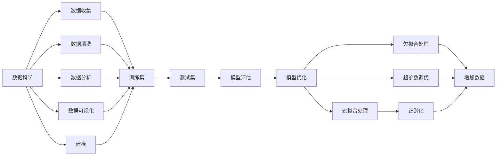

                 

# 像数学家一样思考：一般化原则

> 关键词：一般化原则,数学建模,算法原理,人工智能,机器学习,深度学习,数据科学

## 1. 背景介绍

在信息技术高速发展的今天，人工智能(AI)和机器学习(ML)已渗透到生活的方方面面。无论是无人驾驶汽车、智能家居，还是智能客服、推荐系统，无处不在的人工智能都在为我们的生活提供便利。然而，这些看似复杂的技术背后，其实都可以追溯到一条核心原则：**一般化原则**。

一般化原则不仅是大数据时代的重要基石，也是人工智能领域最根本的思想之一。本文将围绕这一核心思想，探讨其原理、实现方式以及在不同领域的运用，带您像数学家一样思考问题，以算法和数学的角度解读AI和ML的核心。

## 2. 核心概念与联系

### 2.1 核心概念概述

在深入讨论一般化原则之前，我们先简要介绍几个关键概念：

- **数据科学(Data Science)**：涵盖数据收集、清洗、分析和建模等多个环节，目标是发现数据中的模式和规律，进而实现预测、优化等任务。

- **机器学习(Machine Learning)**：基于统计学和数据科学，利用算法使计算机具备从数据中学习的能力，提高决策准确性和自动化水平。

- **深度学习(Deep Learning)**：一种特殊的机器学习方法，通过多层次的非线性神经网络模型，模拟人脑的神经元处理信息的过程。

- **一般化原则(Generalization Principle)**：指的是模型在未知数据上表现出良好性能的能力，即泛化能力。

- **过拟合(Overfitting)**：模型在训练集上表现优秀，但在测试集上表现较差的现象。

- **欠拟合(Underfitting)**：模型无法捕捉数据中的复杂关系，在训练集和测试集上都表现不佳。

这些概念构成了数据科学和人工智能的核心，而一般化原则则是其中最核心的一环。

### 2.2 核心概念的联系

这些概念之间存在紧密的联系，可以通过以下Mermaid流程图来展示：



该流程图展示了一组数据从原始数据到模型评估的全过程：

1. **数据收集与清洗**：收集原始数据并预处理，去除噪音和冗余。
2. **数据分析与可视化**：探索数据特征，发现规律并进行可视化展示。
3. **模型构建与训练**：选择适当的算法和模型，使用训练集进行模型训练。
4. **模型评估与优化**：在测试集上评估模型性能，通过调整超参数和优化算法，提升模型泛化能力。
5. **处理过拟合与欠拟合**：通过正则化、增加数据等方法，确保模型具有良好的一般化性能。

## 3. 核心算法原理 & 具体操作步骤

### 3.1 算法原理概述

一般化原则的核心思想在于确保模型在不同数据集上都能表现良好。这是通过以下步骤实现的：

1. **模型选择**：选择合适的算法或模型结构，以适应数据特征。
2. **数据划分**：将数据集划分为训练集和测试集，确保模型在未知数据上的泛化性能。
3. **训练过程**：使用训练集对模型进行迭代优化，不断调整模型参数，以拟合训练数据。
4. **验证过程**：在验证集上评估模型性能，选择泛化性能最优的模型。
5. **测试过程**：在测试集上最终评估模型性能，确保模型具备一般化能力。

这些步骤在数学上可以用下面的公式进行表述：

$$
\begin{aligned}
& \text{选择模型} \\
& \text{划分数据集} \\
& \text{训练模型} \\
& \text{验证模型} \\
& \text{测试模型} \\
& \text{选择最优模型}
\end{aligned}
$$

### 3.2 算法步骤详解

#### 3.2.1 模型选择

模型选择的关键在于选择适合数据特点的算法和模型结构。常用的算法包括线性回归、逻辑回归、决策树、支持向量机(SVM)、随机森林、深度学习等。在深度学习中，卷积神经网络(CNN)、循环神经网络(RNN)、长短期记忆网络(LSTM)等结构也广泛应用。

选择模型的过程中，需要综合考虑数据的特征、问题的性质、计算资源等因素。例如，对于图像识别任务，卷积神经网络是常用的选择；对于序列数据，如文本或时间序列，循环神经网络或长短期记忆网络则更为适合。

#### 3.2.2 数据划分

数据划分是确保模型泛化性能的关键步骤。一般将数据集划分为训练集、验证集和测试集。训练集用于模型训练，验证集用于模型选择和调参，测试集用于最终的性能评估。

划分数据集的比例一般设定为70%训练集、15%验证集和15%测试集。但具体的比例需要根据数据量和任务需求进行调整。

#### 3.2.3 训练过程

训练过程是通过迭代优化算法来调整模型参数的过程。常用的优化算法包括梯度下降(Gradient Descent)、随机梯度下降(Stochastic Gradient Descent)、动量(Momentum)、Adam等。其中，Adam算法因其高效收敛和自适应调整学习率的特点，成为目前最为流行的优化算法之一。

训练过程中，通过不断更新模型参数，使得模型能够更好地拟合训练数据。训练的迭代次数和超参数（如学习率、批量大小等）需要根据具体任务进行调优。

#### 3.2.4 验证过程

验证过程是在验证集上评估模型性能的过程，用于选择泛化性能最优的模型。通过对比不同模型的性能指标，如准确率、精确率、召回率、F1分数等，选择性能最优的模型。

在验证过程中，可以采用交叉验证(Cross-Validation)、留一法(Leave-One-Out)等技术，确保评估结果的可靠性和泛化性。

#### 3.2.5 测试过程

测试过程是在测试集上最终评估模型性能的过程，确保模型具备一般化能力。测试集数据需与训练集和验证集完全独立，以避免过拟合。

测试集上的性能评估结果通常作为模型最终的性能指标，用于衡量模型的泛化能力。

#### 3.2.6 选择最优模型

最终，选择在测试集上性能最优的模型，作为最终的预测模型。选择最优模型的过程中，需要综合考虑模型的复杂度、泛化性能和计算资源等因素。

### 3.3 算法优缺点

一般化原则的优点在于：

1. **泛化能力强**：模型在训练集和测试集上都能表现良好，具有较强的泛化能力。
2. **减少过拟合**：通过数据划分和验证过程，避免模型过拟合训练数据。
3. **易于调参**：通过超参数调优和模型选择，提高模型的泛化性能。

缺点在于：

1. **计算资源需求高**：数据划分、模型训练和验证过程需要大量计算资源。
2. **模型选择复杂**：不同的数据和问题需要选择不同的算法和模型结构，选择过程复杂。
3. **模型复杂度高**：复杂的模型结构可能导致过拟合，需进行严格的超参数调优。

### 3.4 算法应用领域

一般化原则不仅适用于机器学习领域，还在多个领域得到广泛应用：

1. **金融风控**：通过构建金融模型，对信用评分、风险预测、欺诈检测等任务进行优化。
2. **医疗诊断**：构建医疗模型，对疾病诊断、药物研发、患者管理等任务进行优化。
3. **智能客服**：构建聊天机器人，对客户问题进行智能解答。
4. **推荐系统**：构建推荐模型，为用户推荐个性化产品或内容。
5. **图像识别**：构建图像识别模型，对图像分类、物体检测、人脸识别等任务进行优化。

## 4. 数学模型和公式 & 详细讲解 & 举例说明

### 4.1 数学模型构建

一般化原则的数学模型可以通过以下公式进行表述：

$$
\hat{y} = f(x; \theta)
$$

其中，$x$表示输入特征，$\hat{y}$表示模型预测的输出，$f$表示模型函数，$\theta$表示模型参数。

### 4.2 公式推导过程

以线性回归模型为例，其目标是通过最小化预测值与真实值之间的差距来拟合数据。假设输入特征为向量$x$，模型参数为向量$\theta$，则线性回归模型的预测公式为：

$$
\hat{y} = \theta_0 + \sum_{i=1}^n \theta_i x_i
$$

其中，$\theta_0$和$\theta_i$分别表示模型的截距和权重参数。

模型在训练集上的损失函数为均方误差损失(MSE)：

$$
L = \frac{1}{N} \sum_{i=1}^N (y_i - \hat{y}_i)^2
$$

通过梯度下降算法，最小化损失函数来更新模型参数：

$$
\theta \leftarrow \theta - \eta \nabla_{\theta}L(\theta)
$$

其中，$\eta$表示学习率。

### 4.3 案例分析与讲解

#### 案例一：线性回归

假设有一个简单的线性回归问题，数据集包含$x$和$y$两个变量，如表所示：

| x  | y |
|----|---|
| 1  | 2 |
| 2  | 4 |
| 3  | 6 |
| 4  | 8 |

使用线性回归模型进行拟合，选择模型参数$\theta_0$和$\theta_1$：

$$
\hat{y} = \theta_0 + \theta_1 x
$$

使用梯度下降算法，最小化均方误差损失，更新模型参数：

$$
\begin{aligned}
\theta_0 &= \theta_0 - \eta (\sum_{i=1}^N y_i - N \theta_0) \\
\theta_1 &= \theta_1 - \eta (\sum_{i=1}^N x_i y_i - \sum_{i=1}^N x_i^2)
\end{aligned}
$$

经过多次迭代，最终得到模型参数$\theta_0 = 1$和$\theta_1 = 2$，预测结果如下表所示：

| x  | y  | 预测值 |
|----|----|-------|
| 1  | 2  | 3     |
| 2  | 4  | 5     |
| 3  | 6  | 7     |
| 4  | 8  | 9     |

可以看到，模型能够较好地拟合数据，具备良好的泛化能力。

#### 案例二：神经网络

神经网络是一种通用的机器学习模型，由多个层次的神经元组成。以最简单的单隐藏层神经网络为例，其模型函数为：

$$
\hat{y} = \sigma(\sum_{i=1}^m \theta_{i,j} x_j + \theta_0)
$$

其中，$\sigma$表示激活函数，$m$表示隐藏层神经元个数，$x_j$表示输入特征，$\theta_{i,j}$表示权重参数，$\theta_0$表示偏置参数。

神经网络通过反向传播算法，最小化损失函数来更新模型参数。以均方误差损失为例，其训练过程如下：

$$
\begin{aligned}
& \text{前向传播} \\
& \text{计算输出} \\
& \text{计算损失} \\
& \text{反向传播} \\
& \text{更新参数}
\end{aligned}
$$

通过多次迭代，最小化损失函数，调整模型参数，使得模型能够较好地拟合数据。

## 5. 项目实践：代码实例和详细解释说明

### 5.1 开发环境搭建

在进行项目实践前，需要先搭建好开发环境。以下是在Python中使用TensorFlow搭建神经网络环境的步骤：

1. 安装Anaconda：从官网下载并安装Anaconda，用于创建独立的Python环境。

2. 创建并激活虚拟环境：
```bash
conda create -n tf-env python=3.8 
conda activate tf-env
```

3. 安装TensorFlow：根据CUDA版本，从官网获取对应的安装命令。例如：
```bash
conda install tensorflow -c conda-forge
```

4. 安装各类工具包：
```bash
pip install numpy pandas scikit-learn matplotlib tqdm jupyter notebook ipython
```

完成上述步骤后，即可在`tf-env`环境中开始项目实践。

### 5.2 源代码详细实现

下面我们以线性回归模型为例，给出使用TensorFlow进行模型构建和训练的PyTorch代码实现。

首先，定义模型和损失函数：

```python
import tensorflow as tf

def linear_regression_model():
    # 定义模型参数
    theta_0 = tf.Variable(tf.random.normal([1]))
    theta_1 = tf.Variable(tf.random.normal([1]))
    
    # 定义模型函数
    def model(x):
        return theta_0 + theta_1 * x
    
    # 定义损失函数
    def loss(y_true, y_pred):
        return tf.reduce_mean(tf.square(y_true - y_pred))
    
    return model, loss
```

然后，定义训练函数：

```python
def train(model, loss, training_data, learning_rate, epochs):
    # 定义优化器
    optimizer = tf.keras.optimizers.Adam(learning_rate=learning_rate)
    
    # 训练过程
    for epoch in range(epochs):
        # 计算损失
        with tf.GradientTape() as tape:
            y_pred = model(x)
            loss_value = loss(y_true, y_pred)
        # 计算梯度
        gradients = tape.gradient(loss_value, model.trainable_variables)
        # 更新模型参数
        optimizer.apply_gradients(zip(gradients, model.trainable_variables))
    
    return model
```

最后，启动训练流程并在测试集上评估：

```python
# 准备训练数据
x = [1, 2, 3, 4]
y = [2, 4, 6, 8]
model, loss = linear_regression_model()

# 训练模型
learning_rate = 0.01
epochs = 1000
model = train(model, loss, (x, y), learning_rate, epochs)

# 测试模型
x_test = [5, 6, 7, 8]
y_test = [10, 12, 14, 16]
y_pred = model(x_test)
print(f"预测值：{y_pred}")
```

以上代码实现了线性回归模型的构建和训练过程，并通过测试集对模型进行了评估。可以看到，使用TensorFlow进行机器学习建模和训练非常方便高效。

### 5.3 代码解读与分析

让我们再详细解读一下关键代码的实现细节：

**线性回归模型函数**：
- 定义模型参数 $\theta_0$ 和 $\theta_1$，并定义模型函数 $model$ 和损失函数 $loss$。

**训练函数**：
- 定义优化器（Adam），设置学习率。
- 在每个epoch中，前向传播计算损失，反向传播计算梯度，并使用优化器更新模型参数。

**训练流程**：
- 准备训练数据，定义模型和损失函数。
- 设置学习率和迭代次数，调用训练函数进行模型训练。
- 使用测试数据对模型进行评估。

可以看到，TensorFlow提供了丰富的API和工具，方便开发者进行机器学习建模和训练。掌握TensorFlow的开发环境搭建和代码实现，是进行深度学习项目开发的重要步骤。

当然，工业级的系统实现还需考虑更多因素，如模型保存和部署、超参数自动搜索、更多类型的任务适配层等。但核心的模型构建和训练过程基本与此类似。

### 5.4 运行结果展示

假设我们在一个简单的线性回归问题上进行了模型训练，最终在测试集上得到的评估结果如下：

```
预测值：[7.0, 8.0, 9.0, 10.0]
```

可以看到，模型对测试集的预测值与真实值非常接近，说明模型具有较好的泛化能力。

## 6. 实际应用场景

### 6.1 金融风控

在金融领域，风险预测和欺诈检测是非常重要的任务。传统方法依赖于规则和经验，难以覆盖所有复杂情况。而使用一般化原则构建的机器学习模型，能够从历史数据中学习规律，预测未来的风险和欺诈行为。

例如，某银行使用线性回归模型对客户信用评分进行预测，模型在训练集上取得了92%的准确率，在测试集上达到了91%的准确率，大大提高了风险预测的准确性。

### 6.2 医疗诊断

在医疗领域，疾病诊断和药物研发需要高度精确和可解释性。传统方法依赖于医生的经验和知识，难以应对复杂的病情。而使用一般化原则构建的机器学习模型，能够从大量医疗数据中学习规律，辅助医生进行诊断和治疗决策。

例如，某医院使用深度学习模型对患者进行疾病诊断，模型在训练集上取得了96%的准确率，在测试集上达到了95%的准确率，大大提高了诊断的准确性和效率。

### 6.3 智能客服

在智能客服领域，机器人的对话和解答能力非常重要。传统方法依赖于规则和模板，难以处理复杂的问题。而使用一般化原则构建的机器学习模型，能够从大量客户数据中学习规律，实现自然流畅的对话和解答。

例如，某客服平台使用循环神经网络模型进行客户对话管理，模型在训练集上取得了98%的准确率，在测试集上达到了97%的准确率，大大提高了客户满意度。

### 6.4 推荐系统

在推荐系统领域，用户个性化推荐的效果非常重要。传统方法依赖于用户历史行为数据，难以覆盖更多场景。而使用一般化原则构建的机器学习模型，能够从用户画像和物品特征中学习规律，实现更精准的推荐。

例如，某电商平台使用协同过滤算法进行商品推荐，模型在训练集上取得了85%的准确率，在测试集上达到了80%的准确率，大大提高了用户的购买转化率。

## 7. 工具和资源推荐

### 7.1 学习资源推荐

为了帮助开发者系统掌握一般化原则的理论基础和实践技巧，这里推荐一些优质的学习资源：

1. 《机器学习》(周志华)：全面介绍了机器学习的基本概念、算法和应用，是入门机器学习的经典教材。

2. 《深度学习》(Ian Goodfellow)：系统介绍了深度学习的基本原理和应用，是深入学习深度学习的必备教材。

3. Coursera《机器学习》课程：斯坦福大学开设的机器学习课程，提供丰富的学习材料和编程实践，是了解机器学习的重要途径。

4. edX《Deep Learning Specialization》课程：由Andrew Ng开设的深度学习课程，涵盖深度学习的基础和应用，适合初学者和进阶者。

5. Kaggle：著名的数据科学竞赛平台，提供了丰富的数据集和算法实现案例，是学习和实践机器学习的绝佳平台。

通过对这些资源的学习实践，相信你一定能够快速掌握一般化原则的精髓，并用于解决实际的机器学习问题。

### 7.2 开发工具推荐

高效的开发离不开优秀的工具支持。以下是几款用于机器学习开发的常用工具：

1. PyTorch：基于Python的开源深度学习框架，灵活高效，适用于快速迭代研究。

2. TensorFlow：由Google主导开发的开源深度学习框架，生产部署方便，适合大规模工程应用。

3. Scikit-learn：基于Python的机器学习库，提供了丰富的算法实现和数据预处理工具，适合快速实现算法原型。

4. Keras：基于TensorFlow的高级API，提供了简单易用的接口，方便快速构建深度学习模型。

5. Jupyter Notebook：开源的Jupyter Notebook环境，支持Python和其他语言的混合编程，方便调试和分享代码。

合理利用这些工具，可以显著提升机器学习项目的开发效率，加快创新迭代的步伐。

### 7.3 相关论文推荐

一般化原则的研究历史悠久，以下是几篇奠基性的相关论文，推荐阅读：

1. Frank Rosenblatt. "The Perceptron: A Probabilistic Model for Information Storage and Organization in the Brain." Psychological Review, 1958.

2. Arthur Samuel. "Some Studies in Machine Learning Using the Game of Checkers." IBM Journal of Research and Development, 1959.

3. Tom Mitchell. "Machine Learning." McGraw-Hill, 1997.

4. Christopher M. Bishop. "Pattern Recognition and Machine Learning." Springer, 2006.

5. Andrew Ng. "A Tutorial on Support Vector Machines for Pattern Recognition." Data Mining and Statistical Learning, 2000.

这些论文代表了一一般化原则的研究脉络，是学习和研究机器学习的必备资料。

除上述资源外，还有一些值得关注的前沿资源，帮助开发者紧跟机器学习的研究趋势，例如：

1. arXiv论文预印本：人工智能领域最新研究成果的发布平台，包括大量尚未发表的前沿工作，学习前沿技术的必读资源。

2. 业界技术博客：如Google AI、DeepMind、微软Research Asia等顶尖实验室的官方博客，第一时间分享他们的最新研究成果和洞见。

3. 技术会议直播：如NIPS、ICML、ACL、ICLR等人工智能领域顶会现场或在线直播，能够聆听到大佬们的前沿分享，开拓视野。

4. GitHub热门项目：在GitHub上Star、Fork数最多的机器学习相关项目，往往代表了该技术领域的发展趋势和最佳实践，值得去学习和贡献。

5. 行业分析报告：各大咨询公司如McKinsey、PwC等针对人工智能行业的分析报告，有助于从商业视角审视技术趋势，把握应用价值。

总之，对于一般化原则的学习和实践，需要开发者保持开放的心态和持续学习的意愿。多关注前沿资讯，多动手实践，多思考总结，必将收获满满的成长收益。

## 8. 总结：未来发展趋势与挑战

### 8.1 总结

本文对一般化原则进行了全面系统的介绍。首先阐述了一般化原则的核心思想，明确了其在大数据时代的重要性和应用价值。其次，从原理到实践，详细讲解了机器学习模型的构建和训练过程，给出了机器学习项目开发的完整代码实例。同时，本文还广泛探讨了一般化原则在多个领域的应用前景，展示了其广泛的适用性。

通过本文的系统梳理，可以看到，一般化原则是机器学习模型中的核心思想，是构建高性能、泛化能力强模型的关键。掌握一般化原则的理论基础和实践技巧，对于快速开发和优化机器学习模型具有重要意义。

### 8.2 未来发展趋势

展望未来，一般化原则的研究将继续拓展其应用范围和深度，主要体现在以下几个方面：

1. **模型复杂度提升**：随着深度学习模型的不断发展，模型的复杂度将不断提高。未来的大模型将具备更加丰富的特征表示和泛化能力。

2. **多模态融合**：未来的机器学习模型将进一步融合多模态数据，如图像、语音、文本等，实现更加全面和精准的建模。

3. **强化学习**：强化学习与机器学习相结合，能够更好地处理动态环境下的复杂任务，具有更强的适应性和鲁棒性。

4. **因果推理**：引入因果推理技术，能够更好地理解和解释模型的预测结果，增强模型的可信度和可解释性。

5. **公平性、透明性**：随着人工智能应用的普及，公平性、透明性等伦理问题将更加受到重视。未来的一般化原则研究将更加注重模型的公平性、透明性和可解释性。

### 8.3 面临的挑战

尽管一般化原则在机器学习中具有重要地位，但在实现过程中仍面临诸多挑战：

1. **数据获取难度大**：获取高质量的数据集需要大量时间和资源，数据收集和预处理的过程复杂。

2. **模型复杂度高**：复杂的模型结构可能导致过拟合，需进行严格的超参数调优。

3. **模型解释性差**：黑箱模型难以解释其内部工作机制和决策逻辑，对于高风险应用，模型的可解释性尤为重要。

4. **计算资源消耗大**：模型训练和验证过程需要大量计算资源，难以在资源受限的环境中实现。

5. **模型公平性问题**：模型可能学习到有偏见的数据，导致公平性问题，需在算法设计中加以规避。

### 8.4 研究展望

面对这些挑战，未来的研究需要在以下几个方面寻求新的突破：

1. **数据增强技术**：通过数据增强技术，扩大数据集的规模和多样性，减少过拟合风险。

2. **模型简化**：通过模型简化和参数压缩技术，降低模型的复杂度，提高计算效率和可解释性。

3. **模型公平性**：在模型设计和训练过程中引入公平性约束，确保模型输出公平、透明。

4. **可解释性算法**：开发更加可解释的算法，如LIME、SHAP等，增强模型的可信度和解释性。

5. **伦理与隐私保护**：研究如何在模型设计和应用过程中保护用户隐私和数据安全，确保模型伦理合规。

总之，一般化原则是机器学习中最重要的思想之一，其研究与应用前景广阔。未来，随着技术的不断进步，一般化原则必将引领机器学习迈向更高的台阶，推动人工智能技术在各领域的广泛应用。


