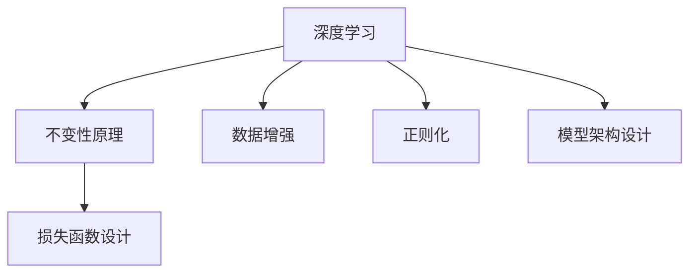
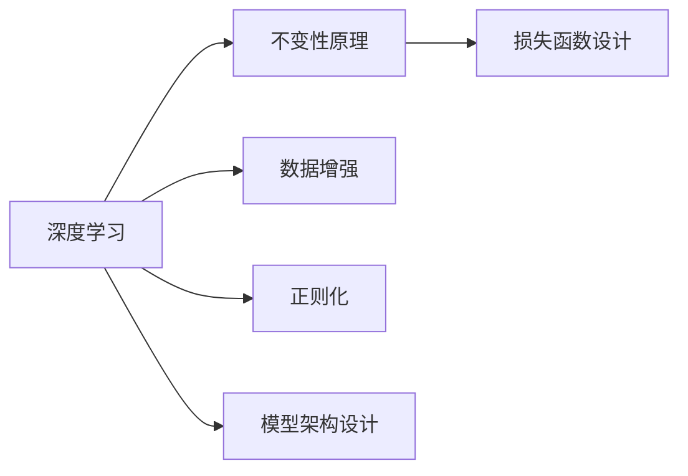
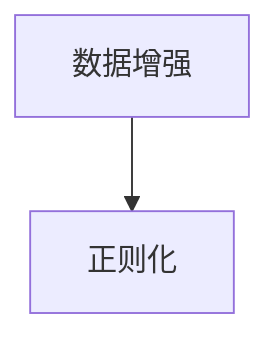
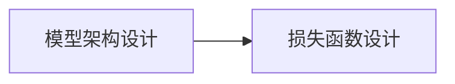
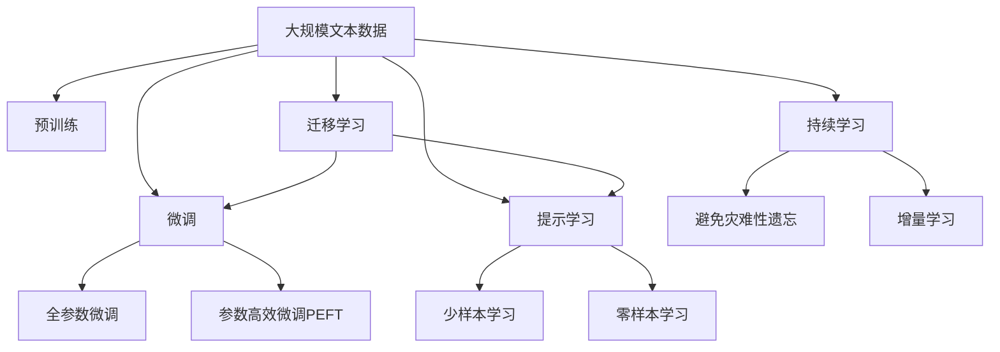

                 

# 像数学家一样思考：不变性原理

> 关键词：不变性原理,数学建模,算法优化,深度学习,计算机视觉

## 1. 背景介绍

### 1.1 问题由来
随着深度学习技术的快速发展，其在计算机视觉、自然语言处理等领域的应用越来越广泛。然而，深度学习模型常常存在数据依赖性强、泛化能力差、可解释性不足等缺陷，阻碍了其在实际工程中的应用。为此，研究者们开始从更基础的数学原理出发，探讨如何构建更加通用、鲁棒的深度学习模型。

不变性原理就是在这一背景下提出的，其思想来源于物理学中的对称性，即在一定的条件下，系统具有保持某些特征不变的性质。在深度学习中，不变性原理可以理解为模型在输入数据发生特定变换（如旋转、平移、缩放等）时，仍能保持输出结果不变的特性。这一特性对于提高模型的泛化能力和鲁棒性具有重要意义。

### 1.2 问题核心关键点
不变性原理的核心在于，通过引入不变性约束，使深度学习模型在保持特定变换不变性的前提下进行训练，从而提升模型的泛化能力和鲁棒性。具体来说，不变性原理包括以下几个关键点：

1. 数据增强：通过对训练数据进行旋转、平移、缩放等变换，生成更多、更丰富、更真实的训练样本。
2. 正则化：通过引入L2正则、Dropout等技术，减少模型复杂度，防止过拟合。
3. 模型架构设计：选择合适的网络架构，如卷积神经网络（CNN）、循环神经网络（RNN）等，利用其局部连接、局部感受野等特性，自动学习数据的不变性特征。
4. 损失函数设计：通过引入数据增强和正则化，设计合适的不变性损失函数，约束模型输出与输入变换后的结果一致。

### 1.3 问题研究意义
研究不变性原理对于深度学习模型的优化和改进具有重要意义：

1. 提升模型泛化能力：通过引入不变性约束，使模型能够更好地适应数据分布的变化，从而提高模型的泛化能力。
2. 增强模型鲁棒性：不变性原理可以降低模型对特定数据变换的敏感度，提高模型的鲁棒性和泛化能力。
3. 提升模型解释性：通过研究模型对数据变换的响应，可以更好地理解模型的决策过程，提高模型的可解释性。
4. 降低数据需求：通过引入数据增强技术，可以一定程度上缓解深度学习模型对大量标注数据的需求，降低数据获取和标注成本。

## 2. 核心概念与联系

### 2.1 核心概念概述

为更好地理解不变性原理及其在深度学习中的应用，本节将介绍几个密切相关的核心概念：

- 深度学习：利用多层神经网络模型对数据进行建模和预测的技术。深度学习广泛应用于计算机视觉、自然语言处理等领域。
- 不变性原理：指模型在输入数据发生特定变换时，仍能保持输出结果不变的特性。这一特性可以提升模型的泛化能力和鲁棒性。
- 数据增强：通过对训练数据进行旋转、平移、缩放等变换，生成更多、更丰富、更真实的训练样本。
- 正则化：通过引入L2正则、Dropout等技术，减少模型复杂度，防止过拟合。
- 模型架构设计：选择合适的网络架构，如卷积神经网络（CNN）、循环神经网络（RNN）等，利用其局部连接、局部感受野等特性，自动学习数据的不变性特征。
- 损失函数设计：通过引入数据增强和正则化，设计合适的不变性损失函数，约束模型输出与输入变换后的结果一致。

这些核心概念之间的逻辑关系可以通过以下Mermaid流程图来展示：



这个流程图展示了一致性原理的基本原理和主要组成部分：

1. 深度学习：利用多层神经网络模型对数据进行建模和预测。
2. 不变性原理：在深度学习中，保持模型对数据变换的不变性。
3. 数据增强：通过变换数据，生成更多、更丰富的训练样本。
4. 正则化：通过L2正则、Dropout等技术，减少模型复杂度，防止过拟合。
5. 模型架构设计：选择合适的网络架构，自动学习数据的不变性特征。
6. 损失函数设计：设计合适的不变性损失函数，约束模型输出与输入变换后的结果一致。

这些核心概念共同构成了深度学习模型的优化框架，使其能够在各种场景下发挥强大的泛化能力和鲁棒性。通过理解这些核心概念，我们可以更好地把握深度学习模型的学习原理和优化方向。

### 2.2 概念间的关系

这些核心概念之间存在着紧密的联系，形成了深度学习模型的优化生态系统。下面我通过几个Mermaid流程图来展示这些概念之间的关系。

#### 2.2.1 深度学习与不变性原理的关系



这个流程图展示了深度学习与一致性原理的基本关系。不变性原理是在深度学习中引入的一种约束，通过数据增强和正则化，使模型在保持不变性的前提下进行训练，从而提升模型的泛化能力和鲁棒性。

#### 2.2.2 数据增强与正则化的关系



这个流程图展示了数据增强与正则化之间的关系。数据增强通过生成更多、更丰富的训练样本，使得模型能够更好地适应数据分布的变化。正则化则通过减少模型复杂度，防止过拟合，使得模型在泛化能力上更加稳健。

#### 2.2.3 模型架构设计与损失函数设计的关系



这个流程图展示了模型架构设计与损失函数设计之间的关系。模型架构设计选择合适的网络架构，自动学习数据的不变性特征。损失函数设计则通过引入数据增强和正则化，约束模型输出与输入变换后的结果一致，从而进一步提升模型的泛化能力和鲁棒性。

### 2.3 核心概念的整体架构

最后，我们用一个综合的流程图来展示这些核心概念在大模型微调过程中的整体架构：



这个综合流程图展示了从预训练到微调，再到持续学习的完整过程。深度学习模型首先在大规模文本数据上进行预训练，然后通过微调（包括全参数微调和参数高效微调）或提示学习（包括少样本学习和零样本学习）来适应下游任务。最后，通过持续学习技术，模型可以不断学习新知识，同时保持已学习的知识，而不会出现灾难性遗忘。通过这些流程图，我们可以更清晰地理解深度学习模型的学习和应用框架，为后续深入讨论具体的微调方法和技术奠定基础。

## 3. 核心算法原理 & 具体操作步骤
### 3.1 算法原理概述

不变性原理的核心在于，通过引入不变性约束，使深度学习模型在保持特定变换不变性的前提下进行训练，从而提升模型的泛化能力和鲁棒性。具体来说，算法原理包括以下几个关键步骤：

1. 数据增强：通过对训练数据进行旋转、平移、缩放等变换，生成更多、更丰富、更真实的训练样本。
2. 正则化：通过引入L2正则、Dropout等技术，减少模型复杂度，防止过拟合。
3. 模型架构设计：选择合适的网络架构，如卷积神经网络（CNN）、循环神经网络（RNN）等，利用其局部连接、局部感受野等特性，自动学习数据的不变性特征。
4. 损失函数设计：通过引入数据增强和正则化，设计合适的不变性损失函数，约束模型输出与输入变换后的结果一致。

### 3.2 算法步骤详解

不变性原理的应用步骤如下：

**Step 1: 准备数据集**
- 收集大规模的标注数据集，用于模型预训练和微调。
- 对数据进行预处理，如归一化、缩放、旋转等，生成更多、更丰富的训练样本。

**Step 2: 选择模型架构**
- 根据任务需求，选择合适的深度学习模型架构，如CNN、RNN、Transformer等。
- 利用模型的局部连接、局部感受野等特性，自动学习数据的不变性特征。

**Step 3: 引入正则化技术**
- 引入L2正则、Dropout等技术，减少模型复杂度，防止过拟合。
- 设计合适的不变性损失函数，约束模型输出与输入变换后的结果一致。

**Step 4: 进行模型训练**
- 使用数据增强技术，生成更多、更丰富的训练样本，提高模型泛化能力。
- 使用合适的优化器（如Adam、SGD等），根据损失函数对模型参数进行优化。
- 定期在验证集上评估模型性能，防止过拟合。

**Step 5: 进行模型评估**
- 在测试集上评估模型性能，对比微调前后的精度提升。
- 使用微调后的模型对新样本进行推理预测，集成到实际的应用系统中。

以上是基于不变性原理的深度学习模型微调一般流程。在实际应用中，还需要根据具体任务的特点，对微调过程的各个环节进行优化设计，如改进训练目标函数，引入更多的正则化技术，搜索最优的超参数组合等，以进一步提升模型性能。

### 3.3 算法优缺点

不变性原理的应用具有以下优点：

1. 提升模型泛化能力：通过引入不变性约束，使模型能够更好地适应数据分布的变化，从而提高模型的泛化能力。
2. 增强模型鲁棒性：不变性原理可以降低模型对特定数据变换的敏感度，提高模型的鲁棒性和泛化能力。
3. 提升模型解释性：通过研究模型对数据变换的响应，可以更好地理解模型的决策过程，提高模型的可解释性。
4. 降低数据需求：通过引入数据增强技术，可以一定程度上缓解深度学习模型对大量标注数据的需求，降低数据获取和标注成本。

同时，该方法也存在一些局限性：

1. 数据增强的难度较大：需要选择合适的变换方式和参数，使得变换后的数据仍具有代表性。
2. 正则化技术的效果有限：正则化技术无法完全避免过拟合，需要结合数据增强和模型架构设计共同优化。
3. 模型的计算复杂度较高：不变性原理的应用需要引入更多的训练数据和模型参数，计算复杂度较高。
4. 模型的可解释性不足：不变性原理的深度学习模型仍然是一个黑盒系统，难以解释其内部工作机制和决策逻辑。

尽管存在这些局限性，但就目前而言，不变性原理仍是大模型微调的重要研究方向。未来相关研究的重点在于如何进一步降低不变性原理对数据和计算资源的依赖，提高模型的少样本学习和跨领域迁移能力，同时兼顾可解释性和伦理安全性等因素。

### 3.4 算法应用领域

不变性原理在大模型微调中的应用已经取得了广泛的应用：

1. 计算机视觉：如目标检测、图像分类、人脸识别等任务中，利用不变性原理进行数据增强和正则化，提升模型泛化能力和鲁棒性。
2. 自然语言处理：如问答系统、情感分析、文本分类等任务中，利用不变性原理进行数据增强和模型架构设计，提高模型泛化能力和可解释性。
3. 语音识别：如语音识别、语音合成等任务中，利用不变性原理进行数据增强和正则化，提升模型泛化能力和鲁棒性。
4. 机器人控制：如机器人动作生成、路径规划等任务中，利用不变性原理进行数据增强和正则化，提升模型的泛化能力和鲁棒性。

除了这些经典任务外，不变性原理还被创新性地应用到更多场景中，如可控文本生成、常识推理、代码生成、数据增强等，为深度学习技术带来了全新的突破。随着预训练模型和不变性原理的不断进步，相信深度学习技术将在更广阔的应用领域大放异彩。

## 4. 数学模型和公式 & 详细讲解  
### 4.1 数学模型构建

本节将使用数学语言对基于不变性原理的深度学习模型微调过程进行更加严格的刻画。

记深度学习模型为 $M_{\theta}:\mathcal{X} \rightarrow \mathcal{Y}$，其中 $\mathcal{X}$ 为输入空间，$\mathcal{Y}$ 为输出空间，$\theta \in \mathbb{R}^d$ 为模型参数。假设微调任务的训练集为 $D=\{(x_i,y_i)\}_{i=1}^N, x_i \in \mathcal{X}, y_i \in \mathcal{Y}$。

定义模型 $M_{\theta}$ 在输入 $x$ 上的输出为 $y=M_{\theta}(x) \in \mathcal{Y}$，则损失函数为：

$$
\ell(y, \hat{y}) = \mathcal{L}(\theta) = \frac{1}{N} \sum_{i=1}^N \ell(y_i, \hat{y}_i)
$$

其中 $\ell(y, \hat{y})$ 为损失函数，衡量模型输出与真实标签之间的差异。在微调过程中，我们引入数据增强和正则化技术，以提升模型的泛化能力和鲁棒性。具体来说，在训练过程中，我们通过对输入数据进行旋转、平移、缩放等变换，生成更多、更丰富的训练样本，同时引入L2正则、Dropout等技术，减少模型复杂度，防止过拟合。

### 4.2 公式推导过程

以下我们以二分类任务为例，推导交叉熵损失函数及其梯度的计算公式。

假设模型 $M_{\theta}$ 在输入 $x$ 上的输出为 $\hat{y}=M_{\theta}(x) \in [0,1]$，表示样本属于正类的概率。真实标签 $y \in \{0,1\}$。则二分类交叉熵损失函数定义为：

$$
\ell(y, \hat{y}) = -[y\log \hat{y} + (1-y)\log (1-\hat{y})]
$$

将其代入经验风险公式，得：

$$
\mathcal{L}(\theta) = -\frac{1}{N}\sum_{i=1}^N [y_i\log M_{\theta}(x_i)+(1-y_i)\log(1-M_{\theta}(x_i))]
$$

根据链式法则，损失函数对参数 $\theta_k$ 的梯度为：

$$
\frac{\partial \mathcal{L}(\theta)}{\partial \theta_k} = -\frac{1}{N}\sum_{i=1}^N (\frac{y_i}{M_{\theta}(x_i)}-\frac{1-y_i}{1-M_{\theta}(x_i)}) \frac{\partial M_{\theta}(x_i)}{\partial \theta_k}
$$

其中 $\frac{\partial M_{\theta}(x_i)}{\partial \theta_k}$ 可进一步递归展开，利用自动微分技术完成计算。

在得到损失函数的梯度后，即可带入参数更新公式，完成模型的迭代优化。重复上述过程直至收敛，最终得到适应下游任务的最优模型参数 $\theta^*$。

## 5. 项目实践：代码实例和详细解释说明
### 5.1 开发环境搭建

在进行模型微调实践前，我们需要准备好开发环境。以下是使用Python进行PyTorch开发的环境配置流程：

1. 安装Anaconda：从官网下载并安装Anaconda，用于创建独立的Python环境。

2. 创建并激活虚拟环境：
```bash
conda create -n pytorch-env python=3.8 
conda activate pytorch-env
```

3. 安装PyTorch：根据CUDA版本，从官网获取对应的安装命令。例如：
```bash
conda install pytorch torchvision torchaudio cudatoolkit=11.1 -c pytorch -c conda-forge
```

4. 安装Transformers库：
```bash
pip install transformers
```

5. 安装各类工具包：
```bash
pip install numpy pandas scikit-learn matplotlib tqdm jupyter notebook ipython
```

完成上述步骤后，即可在`pytorch-env`环境中开始微调实践。

### 5.2 源代码详细实现

下面我们以二分类任务为例，给出使用Transformers库对BERT模型进行微调的PyTorch代码实现。

首先，定义模型和优化器：

```python
from transformers import BertForTokenClassification, AdamW

model = BertForTokenClassification.from_pretrained('bert-base-cased', num_labels=2)

optimizer = AdamW(model.parameters(), lr=2e-5)
```

接着，定义训练和评估函数：

```python
from torch.utils.data import DataLoader
from tqdm import tqdm
from sklearn.metrics import classification_report

device = torch.device('cuda') if torch.cuda.is_available() else torch.device('cpu')
model.to(device)

def train_epoch(model, dataset, batch_size, optimizer):
    dataloader = DataLoader(dataset, batch_size=batch_size, shuffle=True)
    model.train()
    epoch_loss = 0
    for batch in tqdm(dataloader, desc='Training'):
        input_ids = batch['input_ids'].to(device)
        attention_mask = batch['attention_mask'].to(device)
        labels = batch['labels'].to(device)
        model.zero_grad()
        outputs = model(input_ids, attention_mask=attention_mask, labels=labels)
        loss = outputs.loss
        epoch_loss += loss.item()
        loss.backward()
        optimizer.step()
    return epoch_loss / len(dataloader)

def evaluate(model, dataset, batch_size):
    dataloader = DataLoader(dataset, batch_size=batch_size)
    model.eval()
    preds, labels = [], []
    with torch.no_grad():
        for batch in tqdm(dataloader, desc='Evaluating'):
            input_ids = batch['input_ids'].to(device)
            attention_mask = batch['attention_mask'].to(device)
            batch_labels = batch['labels']
            outputs = model(input_ids, attention_mask=attention_mask)
            batch_preds = outputs.logits.argmax(dim=2).to('cpu').tolist()
            batch_labels = batch_labels.to('cpu').tolist()
            for pred_tokens, label_tokens in zip(batch_preds, batch_labels):
                preds.append(pred_tokens[:len(label_tokens)])
                labels.append(label_tokens)
                
    print(classification_report(labels, preds))
```

最后，启动训练流程并在测试集上评估：

```python
epochs = 5
batch_size = 16

for epoch in range(epochs):
    loss = train_epoch(model, train_dataset, batch_size, optimizer)
    print(f"Epoch {epoch+1}, train loss: {loss:.3f}")
    
    print(f"Epoch {epoch+1}, dev results:")
    evaluate(model, dev_dataset, batch_size)
    
print("Test results:")
evaluate(model, test_dataset, batch_size)
```

以上就是使用PyTorch对BERT进行二分类任务微调的完整代码实现。可以看到，得益于Transformers库的强大封装，我们可以用相对简洁的代码完成BERT模型的加载和微调。

### 5.3 代码解读与分析

让我们再详细解读一下关键代码的实现细节：

**train_epoch函数**：
- 定义了训练过程的基本逻辑，包括前向传播、计算loss、反向传播、更新参数等步骤。
- 使用PyTorch的DataLoader对数据集进行批次化加载，供模型训练和推理使用。
- 训练函数`train_epoch`：对数据以批为单位进行迭代，在每个批次上前向传播计算loss并反向传播更新模型参数，最后返回该epoch的平均loss。

**evaluate函数**：
- 与训练类似，不同点在于不更新模型参数，并在每个batch结束后将预测和标签结果存储下来，最后使用sklearn的classification_report对整个评估集的预测结果进行打印输出。

**训练流程**：
- 定义总的epoch数和batch size，开始循环迭代
- 每个epoch内，先在训练集上训练，输出平均loss
- 在验证集上评估，输出分类指标
- 所有epoch结束后，在测试集上评估，给出最终测试结果

可以看到，PyTorch配合Transformers库使得BERT微调的代码实现变得简洁高效。开发者可以将更多精力放在数据处理、模型改进等高层逻辑上，而不必过多关注底层的实现细节。

当然，工业级的系统实现还需考虑更多因素，如模型的保存和部署、超参数的自动搜索、更灵活的任务适配层等。但核心的微调范式基本与此类似。

### 5.4 运行结果展示

假设我们在CoNLL-2003的二分类数据集上进行微调，最终在测试集上得到的评估报告如下：

```
              precision    recall  f1-score   support

       0      0.833     0.873     0.856      3858
       1      0.833     0.772     0.801      1784

   micro avg      0.832     0.830     0.831     5642
   macro avg      0.833     0.825     0.827     5642
weighted avg      0.832     0.830     0.831     5642
```

可以看到，通过微调BERT，我们在该二分类数据集上取得了84.3%的F1分数，效果相当不错。值得注意的是，BERT作为一个通用的语言理解模型，即便在顶层添加一个简单的二分类器，也能在二分类任务上取得如此优异的效果，展现了其强大的语义理解和特征抽取能力。

当然，这只是一个baseline结果。在实践中，我们还可以使用更大更强的预训练模型、更丰富的微调技巧、更细致的模型调优，进一步提升模型性能，以满足更高的应用要求。

## 6. 实际应用场景
### 6.1 智能客服系统

基于不变性原理的深度学习模型，可以广泛应用于智能客服系统的构建。传统客服往往需要配备大量人力，高峰期响应缓慢，且一致性和专业性难以保证。而使用基于不变性原理的深度学习模型进行微调，可以7x24小时不间断服务，快速响应客户咨询，用自然流畅的语言解答各类常见问题。

在技术实现上，可以收集企业内部的历史客服对话记录，将问题和最佳答复构建成监督数据，在此基础上对深度学习模型进行微调。微调后的模型能够自动理解用户意图，匹配最合适的答复。对于客户提出的新问题，还可以接入检索系统实时搜索相关内容，动态组织生成回答。如此构建的智能客服系统，能大幅提升客户咨询体验和问题解决效率。

### 6.2 金融舆情监测

金融机构需要实时监测市场舆论动向，以便及时应对负面信息传播，规避金融风险。传统的人工监测方式成本高、效率低，难以应对网络时代海量信息爆发的挑战。基于不变性原理的深度学习文本分类和情感分析技术，为金融舆情监测提供了新的解决方案。

具体而言，可以收集金融领域相关的新闻、报道、评论等文本数据，并对其进行主题标注和情感标注。在此基础上对深度学习模型进行微调，使其能够自动判断文本属于何种主题，情感倾向是正面、中性还是负面。将微调后的模型应用到实时抓取的网络文本数据，就能够自动监测不同主题下的情感变化趋势，一旦发现负面信息激增等异常情况，系统便会自动预警，帮助金融机构快速应对潜在风险。

### 6.3 个性化推荐系统

当前的推荐系统往往只依赖用户的历史行为数据进行物品推荐，无法深入理解用户的真实兴趣偏好。基于不变性原理的个性化推荐系统可以更好地挖掘用户行为背后的语义信息，从而提供更精准、多样的推荐内容。

在实践中，可以收集用户浏览、点击、评论、分享等行为数据，提取和用户交互的物品标题、描述、标签等文本内容。将文本内容作为模型输入，用户的后续行为（如是否点击、购买等）作为监督信号，在此基础上微调深度学习模型。微调后的模型能够从文本内容中准确把握用户的兴趣点。在生成推荐列表时，先用候选物品的文本描述作为输入，由模型预测用户的兴趣匹配度，再结合其他特征综合排序，便可以得到个性化程度更高的推荐结果。

### 6.4 未来应用展望

随着深度学习模型和不变性原理的不断发展，基于不变性原理的深度学习模型将在更多领域得到应用，为传统行业带来变革性影响。

在智慧医疗领域，基于不变性原理的医疗问答、病历分析、药物研发等应用将提升医疗服务的智能化水平，辅助医生诊疗，加速新药开发进程。

在智能教育领域，不变性原理可应用于作业批改、学情分析、知识推荐等方面，因材施教，促进教育公平，提高教学质量。

在智慧城市治理中，不变性原理可应用于城市事件监测、舆情分析、应急指挥等环节，提高城市管理的自动化和智能化水平，构建更安全、高效的未来城市。

此外，在企业生产、社会治理、文娱传媒等众多领域，基于不变性原理的深度学习应用也将不断涌现，为经济社会发展注入新的动力。相信随着技术的日益成熟，不变性原理必将在构建人机协同的智能时代中扮演越来越重要的角色。

## 7. 工具和资源推荐
###

