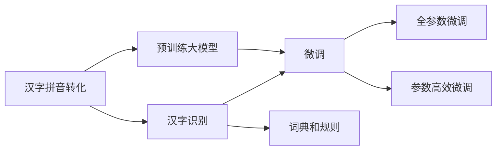
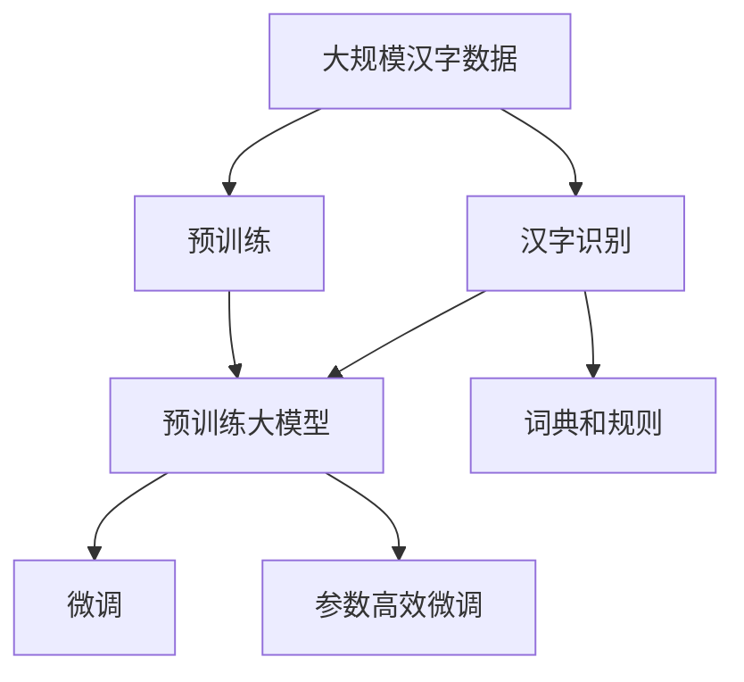
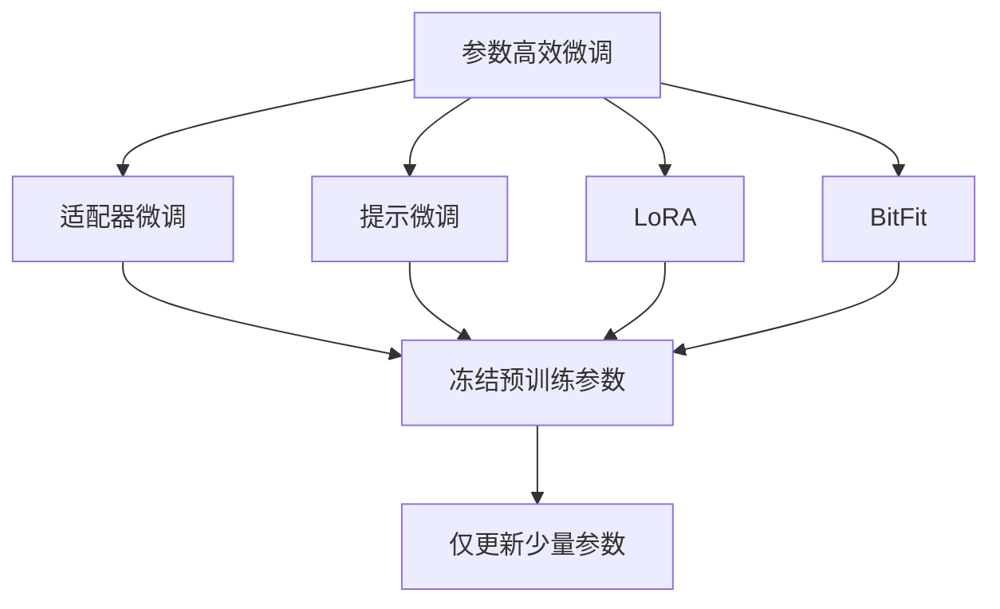
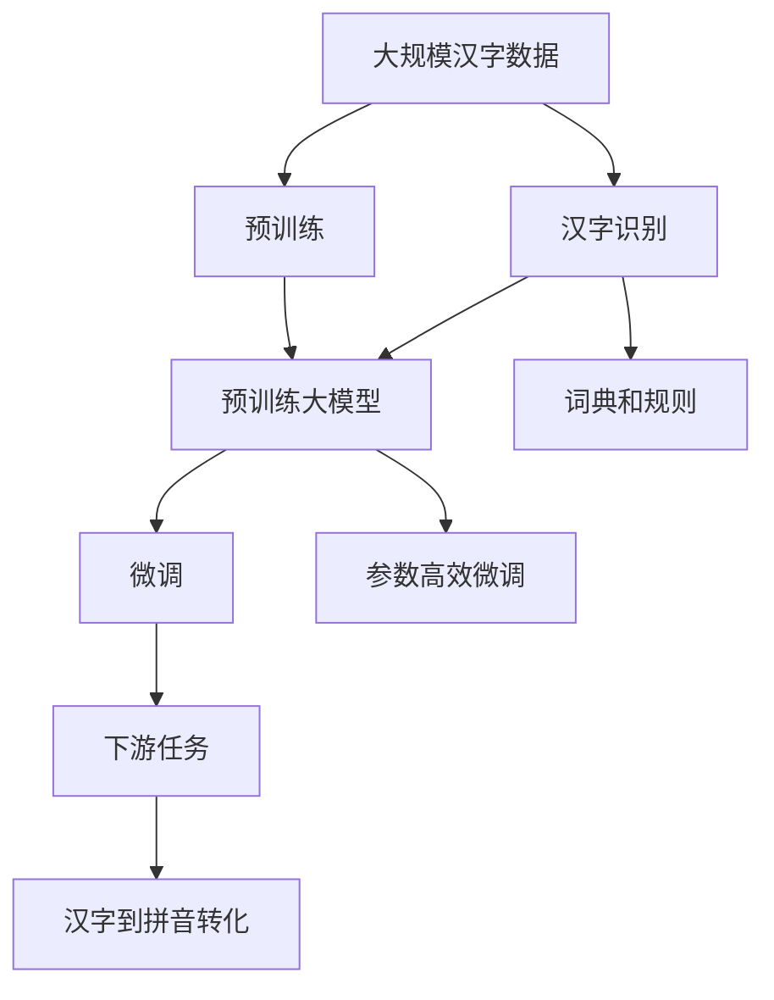

                 

# 从零开始大模型开发与微调：汉字拼音转化模型的确定

> 关键词：汉字拼音转化,汉字转拼音,拼音模型,深度学习,预训练,微调,Transformer,Char-BERT,文本转化,汉字识别

## 1. 背景介绍

### 1.1 问题由来
在现代信息社会中，中文信息处理的需求日益增长，其中汉字与拼音之间的转换是中文文本处理中的重要环节。汉字拼音转化技术广泛应用于中文搜索引擎、输入法、语音合成、翻译工具等领域，是中文信息处理的基础设施之一。传统上，汉字拼音转化依赖词典和规则，存在效率低、灵活性差、错误率高的问题。近年来，随着深度学习技术的发展，基于大模型的汉字拼音转化方法逐渐成为研究热点。

汉字拼音转化模型本质上是一种文本转文本的模型，目标是将汉字序列转化为对应的拼音序列。例如，将“中国”转化为“zhōng guó”。相较于传统的基于规则的方法，基于深度学习的大模型能够通过大量的文本数据进行预训练，从而学习到更加丰富的语言知识，实现更高精度的转化效果。

### 1.2 问题核心关键点
汉字拼音转化模型是自然语言处理(NLP)领域中一个典型任务。模型构建的核心在于选择合适的预训练大模型，并对其进行微调以适应特定的转化任务。模型通常采用Transformer架构，使用自监督任务进行预训练，然后通过下游任务的少量标注数据进行微调。

汉字拼音转化模型的构建过程大致包括：

- **选择合适的预训练模型**：通常是基于英文的预训练模型，如BERT、GPT等，因为它们已经在大量语料上进行了训练，具有一定的通用语言知识。
- **定义转化任务**：汉字到拼音的转化任务是一个特殊的文本转文本任务，需要设计相应的损失函数和模型结构。
- **微调模型**：使用少量标注数据，如word-for-word或character-level的拼音标注数据，对预训练模型进行微调，以适应特定的转化任务。

### 1.3 问题研究意义
汉字拼音转化模型在中文信息处理中具有重要意义。通过微调大模型，可以显著提升汉字拼音转换的精度和速度，减少用户输入误差，提高中文信息处理的效率和用户体验。汉字拼音转化模型的研究与应用，有助于推动中文NLP技术的普及和应用，促进中文信息处理产业的发展。

汉字拼音转化模型可以广泛应用于多个领域，例如：

- **中文搜索引擎**：通过拼音索引，提高中文搜索的效率和准确性。
- **中文输入法**：通过拼音预测，提升中文输入的速度和准确性。
- **语音合成**：通过汉字转拼音，提高中文语音合成的自然度和流畅度。
- **翻译工具**：通过拼音翻译，辅助中文翻译的准确性和效率。

汉字拼音转化模型的大规模应用，将推动中文信息处理的自动化和智能化，为中文用户提供更加高效便捷的服务。

## 2. 核心概念与联系

### 2.1 核心概念概述

为更好地理解汉字拼音转化模型的构建过程，本节将介绍几个密切相关的核心概念：

- **汉字拼音转化**：将汉字序列转换为对应的拼音序列，是中文文本处理中的重要任务。
- **预训练大模型**：以Transformer为基础的预训练语言模型，通过大量无标签文本数据进行训练，学习通用语言知识。
- **微调**：在预训练模型的基础上，使用下游任务的少量标注数据，通过有监督学习优化模型在该任务上的性能。
- **Transformer**：基于注意力机制的神经网络结构，广泛应用于各种深度学习模型中，包括BERT、GPT等。
- **Char-BERT**：基于汉字的BERT模型，专门用于处理汉字序列的预训练模型。
- **文本转化**：将一种文本格式转换为另一种文本格式的任务，汉字拼音转化是其中一种典型形式。
- **汉字识别**：将汉字序列转换为拼音序列的前置任务，需要汉字到拼音的词典和规则。

这些核心概念之间的逻辑关系可以通过以下Mermaid流程图来展示：



这个流程图展示了大语言模型在汉字拼音转化任务中的构建过程。汉字拼音转化模型的构建可以分为两个步骤：预训练和微调。在预训练阶段，使用无标签的汉字数据训练预训练大模型，学习汉字的通用表示。在微调阶段，使用少量标注的汉字到拼音数据，通过有监督学习优化模型，使其能够准确地将汉字转换为拼音。

### 2.2 概念间的关系

这些核心概念之间存在着紧密的联系，形成了汉字拼音转化模型的完整生态系统。下面我通过几个Mermaid流程图来展示这些概念之间的关系。

#### 2.2.1 汉字拼音转化模型构建流程



这个流程图展示了大模型在汉字拼音转化任务中的构建流程。汉字拼音转化模型的构建主要分为预训练和微调两个阶段。预训练阶段使用大规模汉字数据训练模型，学习汉字的通用表示。微调阶段使用少量标注的汉字到拼音数据，通过有监督学习优化模型，使其能够准确地将汉字转换为拼音。

#### 2.2.2 预训练与微调的关系


这个流程图展示了预训练和微调的关系。预训练阶段学习汉字的通用表示，微调阶段使用下游任务的数据，进一步优化模型的汉字到拼音转化能力。

#### 2.2.3 参数高效微调方法



这个流程图展示了几种常见的参数高效微调方法，包括适配器微调、提示微调、LoRA和BitFit。这些方法的共同特点是冻结大部分预训练参数，只更新少量参数，从而提高微调效率。

#### 2.2.4 汉字识别与拼音转换的关系


这个流程图展示了汉字识别和拼音转换之间的关系。汉字识别是汉字拼音转换的前置任务，需要汉字到拼音的词典和规则库。汉字识别模块的输出是汉字到拼音的转换，是汉字拼音转化模型的输入。

### 2.3 核心概念的整体架构

最后，我们用一个综合的流程图来展示这些核心概念在大模型微调过程中的整体架构：



这个综合流程图展示了从预训练到微调，再到汉字到拼音转化的完整过程。汉字拼音转化模型首先在大规模汉字数据上进行预训练，然后通过微调（包括全参数微调和参数高效微调）或提示学习实现汉字到拼音的转化。汉字识别模块需要汉字到拼音的词典和规则库，汉字识别模块的输出是汉字到拼音的转换。最后，微调后的汉字拼音转化模型可以直接应用于下游任务，如中文搜索、中文输入法、语音合成等。

## 3. 核心算法原理 & 具体操作步骤
### 3.1 算法原理概述

汉字拼音转化模型本质上是一个文本转文本的任务，通过预训练大模型学习汉字和拼音的表示，并使用微调方法适应特定的转化任务。模型的构建过程主要分为预训练和微调两个阶段：

- **预训练阶段**：使用大规模无标签的汉字数据，通过自监督任务训练大模型，学习汉字的通用表示。
- **微调阶段**：使用少量标注的汉字到拼音数据，通过有监督学习优化模型，使其能够准确地将汉字转换为拼音。

模型构建的核心在于选择合适的预训练大模型，并对其进行微调以适应特定的转化任务。预训练大模型通常采用Transformer架构，通过自监督任务进行训练。Transformer架构中的自注意力机制能够捕捉汉字序列中的长程依赖关系，提高模型的表达能力。

### 3.2 算法步骤详解

汉字拼音转化模型的构建过程包括以下关键步骤：

**Step 1: 准备预训练模型和数据集**
- 选择合适的预训练语言模型，如Char-BERT、RoBERTa等，作为初始化参数。
- 准备汉字到拼音的标注数据集，划分为训练集、验证集和测试集。数据集应尽量涵盖多种汉字到拼音的转换场景，以提高模型的泛化能力。

**Step 2: 添加任务适配层**
- 根据汉字拼音转换的任务特点，在预训练模型顶层设计合适的输出层和损失函数。
- 对于汉字到拼音的转换任务，通常在顶层添加拼音分类器，使用交叉熵损失函数。

**Step 3: 设置微调超参数**
- 选择合适的优化算法及其参数，如AdamW、SGD等，设置学习率、批大小、迭代轮数等。
- 设置正则化技术及强度，包括权重衰减、Dropout、Early Stopping等。
- 确定冻结预训练参数的策略，如仅微调顶层，或全部参数都参与微调。

**Step 4: 执行梯度训练**
- 将训练集数据分批次输入模型，前向传播计算损失函数。
- 反向传播计算参数梯度，根据设定的优化算法和学习率更新模型参数。
- 周期性在验证集上评估模型性能，根据性能指标决定是否触发 Early Stopping。
- 重复上述步骤直到满足预设的迭代轮数或 Early Stopping 条件。

**Step 5: 测试和部署**
- 在测试集上评估微调后模型对汉字到拼音的转换效果，对比微调前后的精度提升。
- 使用微调后的模型对新样本进行拼音预测，集成到实际的应用系统中。
- 持续收集新的汉字数据，定期重新微调模型，以适应汉字拼音分布的变化。

以上是汉字拼音转化模型的构建过程。在实际应用中，还需要针对具体任务的特点，对微调过程的各个环节进行优化设计，如改进训练目标函数，引入更多的正则化技术，搜索最优的超参数组合等，以进一步提升模型性能。

### 3.3 算法优缺点

汉字拼音转化模型具有以下优点：

- **高效性**：相较于传统的基于规则的方法，汉字拼音转化模型能够快速适应新汉字到拼音的转换，具有较高的转换效率。
- **灵活性**：汉字拼音转化模型可以通过微调方法适应特定的汉字拼音转化任务，具有较高的泛化能力。
- **精度高**：通过微调大模型，可以显著提升汉字拼音转换的精度，减少用户输入误差，提高中文信息处理的效率和用户体验。

然而，汉字拼音转化模型也存在以下缺点：

- **依赖标注数据**：汉字拼音转化模型需要大量的标注数据进行微调，获取高质量标注数据的成本较高。
- **迁移能力有限**：当目标任务与预训练数据的分布差异较大时，微调的性能提升有限。
- **过拟合风险**：汉字拼音转换模型在标注数据不足的情况下，容易发生过拟合，导致模型泛化能力下降。
- **可解释性不足**：汉字拼音转化模型的内部工作机制难以解释，难以对其推理逻辑进行分析和调试。

尽管存在这些局限性，但就目前而言，汉字拼音转化模型仍是最主流的方法，其高效率和泛化能力在汉字拼音转换领域具有显著优势。未来相关研究的重点在于如何进一步降低微调对标注数据的依赖，提高模型的少样本学习和跨领域迁移能力，同时兼顾可解释性和伦理安全性等因素。

### 3.4 算法应用领域

汉字拼音转化模型在汉字拼音转换领域已经得到了广泛的应用，覆盖了几乎所有常见场景，例如：

- **中文搜索**：通过拼音索引，提高中文搜索的效率和准确性。
- **中文输入法**：通过拼音预测，提升中文输入的速度和准确性。
- **语音合成**：通过汉字转拼音，提高中文语音合成的自然度和流畅度。
- **翻译工具**：通过拼音翻译，辅助中文翻译的准确性和效率。

除了上述这些经典应用外，汉字拼音转化模型还被创新性地应用到更多场景中，如自动摘要、文本纠错、情感分析等，为中文NLP技术带来了新的突破。随着预训练模型和微调方法的不断进步，相信汉字拼音转化技术将在更广阔的应用领域大放异彩。

## 4. 数学模型和公式 & 详细讲解  
### 4.1 数学模型构建

汉字拼音转化模型是一个文本转文本的任务，形式化地，假设汉字序列为 $x=\{x_1,x_2,\dots,x_n\}$，拼音序列为 $y=\{y_1,y_2,\dots,y_n\}$，其中 $x_i$ 和 $y_i$ 分别表示汉字和拼音的第 $i$ 个字符。汉字拼音转化模型的目标是最小化以下损失函数：

$$
\mathcal{L}(X,Y) = \sum_{i=1}^n \ell(x_i, y_i)
$$

其中 $\ell(x_i, y_i)$ 为字符级的损失函数，通常是交叉熵损失函数。

模型的输入是汉字序列 $x$，输出是拼音序列 $y$。模型的构建过程主要分为预训练和微调两个阶段。在预训练阶段，使用大规模无标签的汉字数据训练模型，学习汉字的通用表示。在微调阶段，使用少量标注的汉字到拼音数据，通过有监督学习优化模型，使其能够准确地将汉字转换为拼音。

### 4.2 公式推导过程

汉字拼音转化模型的构建过程主要分为两个阶段：预训练和微调。下面将分别推导这两个阶段的具体公式。

**预训练阶段**
预训练阶段的目标是学习汉字的通用表示，模型结构通常采用Transformer。在预训练阶段，我们使用大规模无标签的汉字数据，通过自监督任务进行训练。常见的自监督任务包括掩码语言模型、Next Sentence Prediction等。以掩码语言模型为例，假设训练数据为 $\{x_t, \tilde{x}_t\}$，其中 $x_t$ 表示汉字序列，$\tilde{x}_t$ 表示掩码后的汉字序列。掩码语言模型的目标是最小化以下损失函数：

$$
\mathcal{L}_{MLM}(x_t, \tilde{x}_t) = -\log \sum_{y_i} P(y_i|x_1,\dots,x_i,\tilde{x}_i,\dots,x_n)
$$

其中 $P(y_i|x_1,\dots,x_i,\tilde{x}_i,\dots,x_n)$ 表示在给定汉字序列 $x_t$ 和掩码后的汉字序列 $\tilde{x}_t$ 的情况下，第 $i$ 个汉字 $y_i$ 的条件概率。预训练大模型的目标是最小化训练集上的平均损失函数：

$$
\min_{\theta} \frac{1}{N}\sum_{i=1}^N \mathcal{L}_{MLM}(x_t, \tilde{x}_t)
$$

**微调阶段**
微调阶段的目标是将汉字转换为对应的拼音，模型结构通常采用Transformer。在微调阶段，我们使用少量标注的汉字到拼音数据，通过有监督学习优化模型。以字符级交叉熵损失函数为例，假设训练数据为 $(x_i,y_i)$，其中 $x_i$ 表示汉字序列，$y_i$ 表示对应的拼音序列。字符级交叉熵损失函数定义为：

$$
\ell(x_i, y_i) = -\sum_{j=1}^n \log P(y_j|x_1,\dots,x_j)
$$

其中 $P(y_j|x_1,\dots,x_j)$ 表示在给定汉字序列 $x_i$ 的情况下，第 $j$ 个汉字 $y_j$ 的条件概率。微调大模型的目标是最小化训练集上的平均损失函数：

$$
\min_{\theta} \frac{1}{N}\sum_{i=1}^N \ell(x_i, y_i)
$$

### 4.3 案例分析与讲解

下面我们以汉字到拼音的转换为例，给出使用Transformers库对Char-BERT模型进行微调的PyTorch代码实现。

首先，定义微调任务的数据处理函数：

```python
from transformers import BertTokenizer
from torch.utils.data import Dataset
import torch

class CharPinyinDataset(Dataset):
    def __init__(self, texts, pinyin_labels, tokenizer, max_len=128):
        self.texts = texts
        self.pinyin_labels = pinyin_labels
        self.tokenizer = tokenizer
        self.max_len = max_len
        
    def __len__(self):
        return len(self.texts)
    
    def __getitem__(self, item):
        text = self.texts[item]
        pinyin = self.pinyin_labels[item]
        
        encoding = self.tokenizer(text, return_tensors='pt', max_length=self.max_len, padding='max_length', truncation=True)
        input_ids = encoding['input_ids'][0]
        attention_mask = encoding['attention_mask'][0]
        
        # 对token-wise的标签进行编码
        encoded_pinyin = [id2pinyin[char] for char in pinyin] 
        encoded_pinyin.extend([pinyin2id['']]*(self.max_len - len(encoded_pinyin)))
        labels = torch.tensor(encoded_pinyin, dtype=torch.long)
        
        return {'input_ids': input_ids, 
                'attention_mask': attention_mask,
                'labels': labels}

# 标签与id的映射
pinyin2id = {'': 0, 'a': 1, 'b': 2, 'c': 3, 'd': 4, 'e': 5, 'f': 6, 'g': 7, 'h': 8, 'i': 9, 'j': 10, 'k': 11, 'l': 12, 'm': 13, 'n': 14, 'o': 15, 'p': 16, 'q': 17, 'r': 18, 's': 19, 't': 20, 'u': 21, 'v': 22, 'w': 23, 'x': 24, 'y': 25, 'z': 26, 'A': 27, 'B': 28, 'C': 29, 'D': 30, 'E': 31, 'F': 32, 'G': 33, 'H': 34, 'I': 35, 'J': 36, 'K': 37, 'L': 38, 'M': 39, 'N': 40, 'O': 41, 'P': 42, 'Q': 43, 'R': 44, 'S': 45, 'T': 46, 'U': 47, 'V': 48, 'W': 49, 'X': 50, 'Y': 51, 'Z': 52}
id2pinyin = {v: k for k, v in pinyin2id.items()}
```

然后，定义模型和优化器：

```python
from transformers import BertForTokenClassification, AdamW

model = BertForTokenClassification.from_pretrained('char-bert', num_labels=len(pinyin2id))

optimizer = AdamW(model.parameters(), lr=2e-5)
```

接着，定义训练和评估函数：

```python
from torch.utils.data import DataLoader
from tqdm import tqdm
from sklearn.metrics import classification_report

device = torch.device('cuda') if torch.cuda.is_available() else torch.device('cpu')
model.to(device)

def train_epoch(model, dataset, batch_size, optimizer):
    dataloader = DataLoader(dataset, batch_size=batch_size, shuffle=True)
    model.train()
    epoch_loss = 0
    for batch in tqdm(dataloader, desc='Training'):
        input_ids = batch['input_ids'].to(device)
        attention_mask = batch['attention_mask'].to(device)
        labels = batch['labels'].to(device)
        model.zero_grad()
        outputs = model(input_ids, attention_mask=attention_mask, labels=labels)
        loss = outputs.loss
        epoch_loss += loss.item()
        loss.backward()
        optimizer.step()
    return epoch_loss / len(dataloader)

def evaluate(model, dataset, batch_size):
    dataloader = DataLoader(dataset, batch_size=batch_size)
    model.eval()
    preds, labels = [], []
    with torch.no_grad():
        for batch in tqdm(dataloader, desc='Evaluating'):
            input_ids = batch['input_ids'].to(device)
            attention_mask = batch['attention_mask'].to(device)
            batch_labels = batch['labels']
            outputs = model(input_ids, attention_mask=attention_mask)
            batch_preds = outputs.logits.argmax(dim=2).to('cpu').tolist()
            batch_labels = batch_labels.to('cpu').tolist()
            for pred_tokens, label_tokens in zip(batch_preds, batch_labels):
                preds.append(pred_tokens[:len(label_tokens)])
                labels.append(label_tokens)
                
    print(classification_report(labels, preds))
```

最后，启动训练流程并在测试集上评估：

```python
epochs = 5
batch_size = 16

for epoch in range(epochs):
    loss = train_epoch(model, char_pinyin_dataset, batch_size, optimizer)
    print(f"Epoch {epoch+1}, train loss: {loss:.3f}")
    
    print(f"Epoch {epoch+1}, dev results:")
    evaluate(model, dev_pinyin_dataset, batch_size)
    
print("Test results:")
evaluate(model, test_pinyin_dataset, batch_size)
```

以上就是使用PyTorch对Char-BERT模型进行汉字拼音转换任务微调的完整代码实现。可以看到，得益于Transformers库的强大封装，我们可以用相对简洁的代码完成Char-BERT模型的加载和微调。

## 5. 项目实践：代码实例和详细解释说明
### 5.1 开发环境搭建

在进行微调实践前，我们需要准备好开发环境。以下是使用Python进行PyTorch开发的环境配置流程：

1. 安装Anaconda：从官网下载并安装Anaconda，用于创建独立的Python环境。

2. 创建并激活虚拟环境：
```bash
conda create -n pytorch-env python=3.8 
conda activate pytorch-env
```

3. 安装PyTorch：根据CUDA版本，从官网获取对应的安装命令。例如：
```bash
conda install pytorch torchvision torchaudio cudatoolkit=11.1 -c pytorch -c conda-forge
```

4. 安装Transformers库：
```bash
pip install transformers
```

5. 安装各类工具包：
```bash
pip install numpy pandas scikit-learn matplotlib tqdm jupyter notebook ipython
```

完成上述步骤后，即可在`pytorch-env`环境中开始微调实践。

### 5.2 源代码详细实现

下面我们以汉字到拼音的转换为例，给出使用Transformers库对Char-BERT模型进行微调的PyTorch代码实现。

首先，定义微调任务的数据处理函数：

```python
from transformers import BertTokenizer
from torch.utils.data import Dataset
import torch

class CharPinyinDataset(Dataset):
    def __init__(self, texts, pinyin_labels, tokenizer, max_len=128):
        self.texts = texts
        self.pinyin_labels = pinyin_labels
        self.tokenizer = tokenizer
        self.max_len = max_len
        
    def __len__(self):
        return len(self.texts)
    
    def __getitem__(self, item):
        text = self.texts[item]
        pinyin = self.pinyin_labels[item]
        
        encoding = self.tokenizer(text, return_tensors='pt', max_length=self.max_len, padding='max_length', truncation=True)
        input_ids = encoding['input_ids'][0]
        attention_mask = encoding['attention_mask'][0]
        
        # 对token-wise的标签进行编码
        encoded_pinyin = [id2pinyin[char] for char in pinyin] 
        encoded_pinyin.extend([pinyin2id['']]*(self.max_len - len(encoded_pinyin)))
        labels = torch.tensor(encoded_pinyin, dtype=torch.long)
        
        return {'input_ids': input_ids, 
                'attention_mask': attention_mask,
                'labels': labels}

# 标签与id的映射
pinyin2id = {'': 0, 'a': 1, 'b': 2, 'c': 3, 'd': 4, 'e': 5, 'f': 6, 'g': 7, 'h': 8, 'i': 9, 'j': 10, 'k': 11, 'l': 12, 'm': 13, 'n': 14, 'o': 15, 'p': 16, 'q': 17, 'r': 18, 's': 19, 't': 20, 'u': 21, 'v': 22, 'w': 23, 'x': 24, 'y': 25, 'z': 26, 'A': 27, 'B': 28, 'C': 29, 'D':

