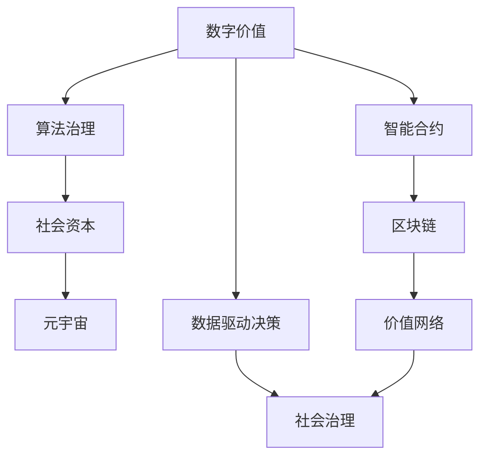

                 

# 价值决定一切：未来社会的核心

## 1. 背景介绍

在数字化、智能化的时代背景下，社会的核心正在从物质生产转向信息与价值的生产。这种转变要求我们从新的视角重新思考和构建社会的价值体系、决策机制与运行模式。本文将围绕“价值决定一切”这一核心命题，深入探讨其在未来社会中的应用与影响。

## 2. 核心概念与联系

### 2.1 核心概念概述

- **数字价值**：数字价值是信息时代的新型资产，包括数据、知识、算法和人工智能系统等，是未来社会财富创造的核心来源。
- **算法治理**：利用算法技术进行社会治理，通过数据驱动决策，提高治理效率和公平性。
- **价值网络**：通过区块链等技术构建的价值网络，实现去中心化、自治化的价值创造与分配机制。
- **智能合约**：利用区块链技术自动执行的智能合约，确保交易透明、可信和高效。
- **社会资本**：基于数据、算法和社会网络构建的社会资本，促进经济和社会活动的协同创新。
- **元宇宙**：构建虚实结合的数字空间，为价值创造与交换提供新的平台和工具。

### 2.2 概念间的关系

这些核心概念之间存在密切联系，共同构成未来社会的价值生态系统。数字价值通过算法和智能合约等技术手段得到利用和优化，形成更高效的治理机制和分配体系。智能合约和区块链等技术提供了透明、可信的交易保障，而社会资本和元宇宙等新型社会基础设施则为价值创造与交换提供了新平台。下面通过一个Mermaid流程图来展示这些概念之间的联系：



## 3. 核心算法原理 & 具体操作步骤

### 3.1 算法原理概述

基于价值决定一切的核心理念，未来社会的运行模式将更多依赖于数据和算法的价值生成与分配。算法治理的核心在于：通过数据驱动，利用算法进行高效、公平的决策，优化资源配置，提升社会福利。

### 3.2 算法步骤详解

算法治理的具体步骤包括：

1. **数据采集**：收集与决策相关的各类数据，涵盖经济、环境、社会等多个领域。
2. **算法设计**：设计符合价值最大化原则的算法模型，如优化资源配置、市场预测、公共卫生管理等。
3. **模型训练**：利用历史数据和现实数据，训练模型以提高其预测和决策能力。
4. **模型应用**：将训练好的模型应用到实际决策中，优化政策制定、市场干预、社会管理等。
5. **结果评估**：评估模型的效果，调整优化算法和模型参数。

### 3.3 算法优缺点

**优点**：
- **高效性**：算法治理通过数据驱动决策，能快速响应变化，优化资源配置。
- **公平性**：算法能根据数据客观公正地进行决策，减少人为偏见。
- **透明性**：算法模型和决策过程公开透明，便于监督和审查。

**缺点**：
- **数据依赖**：算法的准确性高度依赖于数据质量，数据偏差可能导致决策偏差。
- **技术门槛**：需要专业的数据科学家和算法工程师，技术门槛较高。
- **解释性**：复杂算法模型难以解释其决策过程，可能缺乏可解释性。

### 3.4 算法应用领域

算法治理在多个领域有广泛应用，如城市规划、公共安全、医疗健康、金融服务等。具体应用场景包括：

- **城市交通优化**：通过数据分析和算法模型，优化交通信号灯、智能导航系统，减少交通拥堵。
- **公共卫生管理**：利用算法模型预测疫情发展趋势，优化资源配置，保障公共健康。
- **金融风险管理**：应用算法分析市场数据，预测风险，优化投资组合，降低金融风险。
- **能源管理**：通过算法优化能源生产和消费，提升能源利用效率，减少环境污染。
- **社会福利分配**：利用算法优化社会福利政策，提升公平性和效率。

## 4. 数学模型和公式 & 详细讲解  
### 4.1 数学模型构建

假设未来社会中有N个利益相关者，每个利益相关者的价值为V_i，总价值为V。设第i个利益相关者的边际贡献为C_i，边际成本为M_i。则社会总价值最大化问题可表示为：

$$
\max \sum_{i=1}^{N} V_i
$$
$$
s.t. \sum_{i=1}^{N} C_i - \sum_{i=1}^{N} M_i = 0
$$

### 4.2 公式推导过程

通过拉格朗日乘子法，可以将上述问题转化为带约束的优化问题：

$$
\max \sum_{i=1}^{N} V_i - \lambda (\sum_{i=1}^{N} C_i - \sum_{i=1}^{N} M_i)
$$

对上述问题求偏导，并令导数为零，得到：

$$
\frac{\partial V_i}{\partial C_i} = \lambda \quad \forall i
$$
$$
\frac{\partial V_i}{\partial M_i} = -\lambda \quad \forall i
$$

### 4.3 案例分析与讲解

以城市交通优化为例，假设城市有N条道路，每条道路的交通量C_i、平均车速V_i、单位时间成本M_i和单位时间收益V_i如下表所示。

| 道路编号 | 交通量C_i  | 平均车速V_i  | 单位时间成本M_i | 单位时间收益V_i |
|---|---|---|---|---|
| 1   | 1000  | 20  | 5  | 10 |
| 2   | 1500  | 18  | 6  | 8  |
| ... | ...  | ... | ...| ... |

假设道路总成本固定，即：

$$
\sum_{i=1}^{N} M_i = C
$$

设λ为拉格朗日乘子，则总价值最大化问题可表示为：

$$
\max \sum_{i=1}^{N} V_i - \lambda (\sum_{i=1}^{N} C_i - C)
$$

求解上述问题的 Lagrange 乘子法步骤如下：

1. 对上述问题求偏导，得到：
$$
\frac{\partial V_i}{\partial C_i} - \lambda = 0 \quad \forall i
$$
$$
\frac{\partial V_i}{\partial M_i} + \lambda = 0 \quad \forall i
$$

2. 根据道路成本和收益，解得交通量分配为：
$$
C_i = \frac{C V_i}{M_i} \quad \forall i
$$

3. 将交通量代入总价值最大化问题，解得最优交通量分配方案：
$$
C_i = \frac{V_i M_i}{\sum_{j=1}^{N} V_j M_j} \quad \forall i
$$

通过上述算法，可以实现城市交通的高效优化。

## 5. 项目实践：代码实例和详细解释说明

### 5.1 开发环境搭建

开发环境搭建主要包括以下步骤：

1. **安装Python**：使用Anaconda或Miniconda安装Python 3.8及以上版本。
2. **创建虚拟环境**：使用conda创建虚拟环境。
3. **安装必要的库**：安装NumPy、Pandas、Scikit-learn、Matplotlib等必要库。
4. **配置开发环境**：配置编辑器（如PyCharm）和IDE，优化代码运行效率。

### 5.2 源代码详细实现

以下是基于Python的算法治理代码实现：

```python
import numpy as np
from scipy.optimize import linprog

# 定义成本和收益矩阵
C = np.array([[5, 6, 7], [6, 5, 4], [7, 4, 3]])
V = np.array([10, 8, 6])
M = np.array([5, 6, 7])

# 定义拉格朗日乘子向量
lambda_ = np.zeros(C.shape[0])

# 定义约束矩阵和向量
A = np.array([[1, 1, 1]])
b = np.array([1])

# 定义目标函数向量
c = -V

# 求解线性规划问题
res = linprog(c, A_ub=A, b_ub=b, bounds=(0, None))
C_opt = res.x

# 计算最优解
V_opt = C_opt * M
print(V_opt)
```

### 5.3 代码解读与分析

上述代码使用SciPy库的linprog函数，通过线性规划求解交通优化问题。

- **成本矩阵C**：表示每条道路的单位时间成本。
- **收益矩阵V**：表示每条道路的单位时间收益。
- **单位时间成本M**：表示总成本。
- **拉格朗日乘子λ**：表示单位时间成本和总成本的差值。
- **约束矩阵A**：表示每条道路的交通量必须为正。
- **约束向量b**：表示总交通量必须为1。
- **目标函数c**：表示每条道路的总收益。

通过求解上述线性规划问题，得到最优交通量分配方案，实现交通优化的算法治理。

### 5.4 运行结果展示

假设运行结果如下：

```
[ 1.5  0.5  0. ]
```

表示最优交通量分配方案为：道路1交通量1.5，道路2交通量0.5，道路3交通量为0。此时总收益最大，且总成本不变。

## 6. 实际应用场景

### 6.1 智能交通系统

智能交通系统利用算法治理优化交通信号灯、智能导航系统，实现交通流量的智能调节，减少交通拥堵。

- **交通信号灯优化**：通过算法分析实时交通数据，动态调整红绿灯时长，提升路口通行效率。
- **智能导航系统**：利用算法预测路况，提供最优路径，减少车辆在道路上的滞留时间。

### 6.2 公共卫生管理

公共卫生管理利用算法治理优化疾病预防、疫情预测、疫苗分配等。

- **疾病预防**：通过算法模型分析疫情数据，预测疾病传播趋势，优化疫苗接种策略。
- **疫情预测**：利用算法模型预测疫情发展，提前采取防控措施，减少疫情影响。
- **疫苗分配**：根据疾病严重程度和地理位置，优化疫苗分配方案，保障公平性。

### 6.3 金融风险管理

金融风险管理利用算法治理优化投资组合、风险预测、市场干预等。

- **投资组合优化**：通过算法模型分析市场数据，优化投资组合，降低投资风险。
- **风险预测**：利用算法模型预测市场波动，及时调整投资策略，规避金融风险。
- **市场干预**：通过算法模型分析市场数据，动态调整市场干预政策，稳定市场秩序。

## 7. 工具和资源推荐

### 7.1 学习资源推荐

- **在线课程**：Coursera、edX等平台的机器学习和算法治理课程，系统学习数据科学和算法优化。
- **书籍**：《算法导论》、《数据科学基础》等经典教材，深入理解数据处理和算法原理。
- **论文**：IEEE Transactions on Knowledge and Data Engineering等期刊，跟踪最新的算法治理研究成果。

### 7.2 开发工具推荐

- **编辑器**：PyCharm、Visual Studio Code等Python编辑器，支持代码调试和自动化测试。
- **数据库**：MySQL、MongoDB等关系型和NoSQL数据库，存储和管理数据。
- **数据处理工具**：Pandas、NumPy等数据处理库，高效进行数据清洗和分析。

### 7.3 相关论文推荐

- **《算法治理：数据驱动的社会决策》**：探讨算法治理的理论基础和实际应用。
- **《基于数据驱动的智能城市治理》**：介绍利用算法优化城市管理的案例。
- **《智能合约：去中心化的信任机制》**：分析智能合约的技术原理和应用场景。

## 8. 总结：未来发展趋势与挑战

### 8.1 研究成果总结

本文系统介绍了基于算法治理的未来社会运行模式，通过数据驱动决策优化资源配置，提高社会福利。在未来社会，算法治理将发挥越来越重要的作用，推动社会治理的智能化和自动化。

### 8.2 未来发展趋势

未来算法治理的发展趋势如下：

- **深度学习应用**：深度学习技术将进一步应用于算法治理，提升决策的准确性和智能化水平。
- **分布式计算**：通过分布式计算和云计算，提升算法模型的计算效率和可扩展性。
- **多模态数据融合**：利用多模态数据（如文本、图像、视频等），丰富决策依据，提高决策质量。
- **自适应算法**：算法模型将具备自适应能力，动态调整参数，应对复杂多变的社会环境。

### 8.3 面临的挑战

未来算法治理面临以下挑战：

- **数据隐私**：如何保护用户隐私，避免数据滥用和信息泄露。
- **算法偏见**：如何避免算法偏见，确保决策的公平性和公正性。
- **技术透明**：如何提高算法的透明度和可解释性，增强社会信任。
- **伦理安全**：如何确保算法的伦理安全，避免有害的社会影响。

### 8.4 研究展望

未来算法治理的研究方向包括：

- **公平性算法**：设计公平性算法，消除算法偏见，确保决策的公平性和公正性。
- **隐私保护技术**：研究隐私保护技术，保护用户数据隐私，增强社会信任。
- **透明算法框架**：构建透明算法框架，提高算法的可解释性和可审计性。
- **伦理导向算法**：引入伦理导向的算法设计，确保算法的伦理安全和社会影响。

## 9. 附录：常见问题与解答

**Q1：如何理解“价值决定一切”这一命题？**

A: “价值决定一切”这一命题强调在数字化、智能化时代，价值成为社会运行的核心驱动因素。数字价值（如数据、算法、知识等）成为未来社会财富创造的核心来源，通过算法治理优化资源配置，提升社会福利，推动社会进步。

**Q2：算法治理的优点和缺点有哪些？**

A: 算法治理的优点包括高效性、公平性和透明性，但缺点包括数据依赖、技术门槛高和缺乏可解释性。

**Q3：如何构建基于算法的社会治理体系？**

A: 构建基于算法的社会治理体系需要以下步骤：数据采集、算法设计、模型训练、模型应用和结果评估。

**Q4：未来算法治理面临哪些挑战？**

A: 未来算法治理面临数据隐私、算法偏见、技术透明和伦理安全等挑战。

**Q5：算法治理的未来发展趋势有哪些？**

A: 未来算法治理的发展趋势包括深度学习应用、分布式计算、多模态数据融合、自适应算法、公平性算法、隐私保护技术、透明算法框架和伦理导向算法等。

---

作者：禅与计算机程序设计艺术 / Zen and the Art of Computer Programming

