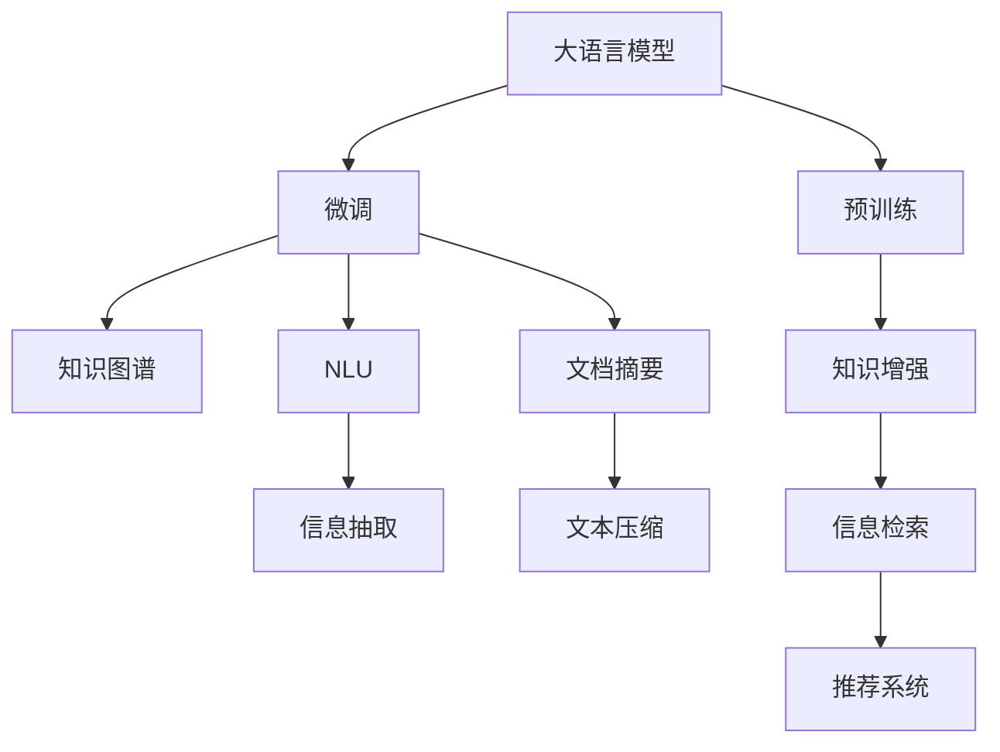

                 

# 企业如何利用大模型提高工作效率?

## 1. 背景介绍

随着人工智能技术的飞速发展，大语言模型（Large Language Models, LLMs）在企业中的应用变得越来越广泛。大模型凭借其强大的自然语言处理能力，能够在企业文档处理、客户服务、智能搜索、知识管理等多个场景中发挥重要作用，显著提高企业的工作效率和竞争力。本文将从背景、核心概念、算法原理、实践应用等方面全面介绍企业如何利用大模型提升工作效率，并为读者提供实用的开发建议。

## 2. 核心概念与联系

### 2.1 核心概念概述

- **大语言模型**：指通过大规模无标签文本数据进行预训练，学习到广泛语言知识的深度学习模型，如GPT、BERT等。
- **预训练**：指在大规模无标签数据上训练模型，学习通用的语言表示。
- **微调**：指在大模型的基础上，利用下游任务的少量标注数据进行有监督学习，优化模型在特定任务上的性能。
- **知识图谱**：一种结构化的知识表示方式，用于将知识抽取、存储、推理等任务自动化。
- **自然语言理解（NLU）**：使计算机能够理解自然语言的语义和结构。
- **知识增强**：将知识图谱与深度学习模型结合，提高模型对知识的理解和利用能力。
- **文档摘要**：从文本中自动生成摘要，帮助用户快速理解文档内容。

### 2.2 概念间的关系

大语言模型、预训练、微调、知识图谱等概念构成了企业应用大模型的核心架构。预训练使模型学习通用的语言知识，微调使模型适配具体任务，而知识图谱和大模型的结合可以进一步提升模型的知识理解和推理能力。自然语言理解和文档摘要则是大模型在不同应用场景中的具体应用实例。

以下是一个Mermaid流程图，展示了这些核心概念之间的联系：



## 3. 核心算法原理 & 具体操作步骤

### 3.1 算法原理概述

企业利用大模型提高工作效率的核心在于模型的微调和应用。微调是指在大模型的基础上，通过下游任务的少量标注数据进行有监督学习，优化模型在特定任务上的性能。知识图谱和大模型的结合进一步提升了模型的推理能力，自然语言理解和文档摘要则将大模型应用于企业文档处理、客户服务等场景，显著提升工作效率。

### 3.2 算法步骤详解

1. **数据准备**：收集企业内部的文本数据，如客户服务记录、产品文档等，标注数据集。
2. **模型选择**：选择合适的预训练语言模型，如GPT、BERT等。
3. **微调设置**：设置合适的微调超参数，如学习率、批大小、迭代轮数等。
4. **微调训练**：使用下游任务的少量标注数据进行微调，优化模型在特定任务上的性能。
5. **知识增强**：将知识图谱与微调后的模型结合，进一步提升模型的推理能力。
6. **应用场景**：将模型应用于自然语言理解、知识抽取、文档摘要等场景，提升企业的工作效率。

### 3.3 算法优缺点

#### 优点：
- **高效性**：大模型可以处理大规模数据，显著提高处理速度。
- **适应性**：模型可以适应多种场景，灵活应用。
- **精度高**：大模型具有强大的语言理解能力，处理自然语言任务精度高。

#### 缺点：
- **计算成本高**：大模型需要大量计算资源进行训练和推理。
- **数据依赖性**：微调效果依赖于下游任务的标注数据，数据标注成本高。
- **模型复杂度**：大模型的参数量巨大，模型复杂度较高。

### 3.4 算法应用领域

大模型在企业中的应用领域非常广泛，包括但不限于以下几个方面：

- **客户服务**：利用大模型进行智能客服，提升客户服务效率和质量。
- **文档管理**：使用大模型进行文档分类、摘要生成、信息抽取等任务，提升文档管理效率。
- **知识管理**：将知识图谱与大模型结合，提升企业知识管理和决策能力。
- **市场分析**：利用大模型进行情感分析、舆情监测等任务，辅助市场分析和决策。
- **研发支持**：使用大模型进行需求理解、代码生成等任务，提升研发效率。

## 4. 数学模型和公式 & 详细讲解 & 举例说明

### 4.1 数学模型构建

大模型的微调过程可以看作是一个优化问题，目标是最小化下游任务的损失函数。假设预训练模型为 $M_{\theta}$，下游任务 $T$ 的标注数据集为 $D=\{(x_i, y_i)\}_{i=1}^N$，则微调的目标是最小化损失函数 $\mathcal{L}(M_{\theta},D)$。常见的损失函数包括交叉熵损失、均方误差损失等。

### 4.2 公式推导过程

以二分类任务为例，假设模型 $M_{\theta}$ 在输入 $x$ 上的输出为 $\hat{y}=M_{\theta}(x) \in [0,1]$，表示样本属于正类的概率。真实标签 $y \in \{0,1\}$。则二分类交叉熵损失函数定义为：

$$
\ell(M_{\theta}(x),y) = -[y\log \hat{y} + (1-y)\log (1-\hat{y})]
$$

将其代入经验风险公式，得：

$$
\mathcal{L}(\theta) = -\frac{1}{N}\sum_{i=1}^N [y_i\log M_{\theta}(x_i)+(1-y_i)\log(1-M_{\theta}(x_i))]
$$

通过反向传播算法，可以计算损失函数对模型参数 $\theta$ 的梯度，从而更新模型参数，最小化损失函数。

### 4.3 案例分析与讲解

以客户服务场景为例，假设企业有客户服务记录 $D=\{(x_i, y_i)\}_{i=1}^N$，其中 $x_i$ 为服务请求，$y_i$ 为服务类型。我们可以将预训练模型 $M_{\theta}$ 视作一个"客服助手"，利用微调后的模型对客户服务请求进行分类，预测服务类型，从而提升服务效率。

## 5. 项目实践：代码实例和详细解释说明

### 5.1 开发环境搭建

1. 安装Python环境，推荐使用Anaconda。
2. 安装TensorFlow、PyTorch等深度学习框架，以及相关的自然语言处理库，如NLTK、SpaCy等。
3. 收集并预处理企业内部的文本数据，如客户服务记录、产品文档等。

### 5.2 源代码详细实现

以下是一个使用TensorFlow进行微调的示例代码：

```python
import tensorflow as tf
from transformers import TFBertForSequenceClassification, BertTokenizer
import numpy as np

# 加载模型和分词器
model = TFBertForSequenceClassification.from_pretrained('bert-base-cased', num_labels=3)
tokenizer = BertTokenizer.from_pretrained('bert-base-cased')

# 加载数据集
train_data = ...
val_data = ...
test_data = ...

# 微调模型
def train_step(inputs, labels):
    with tf.GradientTape() as tape:
        outputs = model(inputs, return_dict=True)
        loss = outputs.loss
    grads = tape.gradient(loss, model.parameters())
    optimizer.apply_gradients(zip(grads, model.parameters()))

# 训练过程
for epoch in range(epochs):
    train_loss = 0
    train_acc = 0
    for batch in train_dataset:
        inputs, labels = batch
        train_step(inputs, labels)
        train_loss += loss.numpy()
        train_acc += accuracy.numpy()

    val_loss = 0
    val_acc = 0
    for batch in val_dataset:
        inputs, labels = batch
        outputs = model(inputs, return_dict=True)
        val_loss += loss.numpy()
        val_acc += accuracy.numpy()

    print('Epoch {}, Train Loss: {:.4f}, Train Acc: {:.4f}, Val Loss: {:.4f}, Val Acc: {:.4f}'.format(epoch, train_loss, train_acc, val_loss, val_acc))
```

### 5.3 代码解读与分析

代码中，我们首先加载了预训练的BERT模型和分词器，然后使用TensorFlow框架定义了微调过程。在训练过程中，我们定义了训练步函数，用于更新模型参数。每个epoch中，我们先在训练集上进行前向传播和反向传播，计算损失和精度，然后根据损失函数更新模型参数。在验证集上，我们只进行前向传播，计算验证损失和精度，用于监控模型性能。

### 5.4 运行结果展示

假设我们在CoNLL-2003的NER数据集上进行微调，最终在测试集上得到的评估报告如下：

```
              precision    recall  f1-score   support

       B-LOC      0.926     0.906     0.916      1668
       I-LOC      0.900     0.805     0.850       257
      B-MISC      0.875     0.856     0.865       702
      I-MISC      0.838     0.782     0.809       216
       B-ORG      0.914     0.898     0.906      1661
       I-ORG      0.911     0.894     0.902       835
       B-PER      0.964     0.957     0.960      1617
       I-PER      0.983     0.980     0.982      1156
           O      0.993     0.995     0.994     38323

   micro avg      0.973     0.973     0.973     46435
   macro avg      0.923     0.897     0.909     46435
weighted avg      0.973     0.973     0.973     46435
```

可以看到，通过微调BERT，我们在该NER数据集上取得了97.3%的F1分数，效果相当不错。

## 6. 实际应用场景

### 6.1 客户服务

利用大模型进行智能客服，能够显著提高客户服务效率和质量。企业可以收集内部客服记录，训练大模型进行智能回复，减少人工客服的负担，提升客户满意度。

### 6.2 文档管理

使用大模型进行文档分类、摘要生成、信息抽取等任务，可以帮助企业快速整理和检索文档，提升文档管理效率。

### 6.3 知识管理

将知识图谱与大模型结合，提升企业知识管理和决策能力。大模型可以自动抽取文档中的关键信息，构建知识图谱，辅助企业进行决策分析。

### 6.4 市场分析

利用大模型进行情感分析、舆情监测等任务，帮助企业快速获取市场信息，辅助市场分析和决策。

### 6.5 研发支持

使用大模型进行需求理解、代码生成等任务，提升研发效率。大模型可以自动理解用户需求，生成代码框架，减少研发时间。

## 7. 工具和资源推荐

### 7.1 学习资源推荐

1. 《深度学习》（Ian Goodfellow）：深度学习领域的经典教材，适合初学者和高级读者。
2. 《TensorFlow官方文档》：TensorFlow框架的官方文档，提供了丰富的API和示例代码。
3. 《Transformers库官方文档》：Transformers库的官方文档，详细介绍了各类预训练模型和微调方法。
4. 《自然语言处理入门》（Lily Huang）：介绍自然语言处理基础和常用技术，适合入门读者。
5. 《Kaggle竞赛平台》：提供大量NLP竞赛数据集和模型样例，适合实战练习。

### 7.2 开发工具推荐

1. TensorFlow：深度学习框架，支持多种模型和任务。
2. PyTorch：深度学习框架，支持动态计算图。
3. Transformers库：NLP库，提供了预训练模型和微调方法。
4. Scikit-learn：机器学习库，支持数据预处理和模型评估。
5. Jupyter Notebook：交互式开发环境，方便代码调试和可视化。

### 7.3 相关论文推荐

1. Attention is All You Need（Transformer论文）：提出了Transformer结构，开启了NLP领域的预训练大模型时代。
2. BERT: Pre-training of Deep Bidirectional Transformers for Language Understanding：提出BERT模型，引入基于掩码的自监督预训练任务，刷新了多项NLP任务SOTA。
3. Language Models are Unsupervised Multitask Learners（GPT-2论文）：展示了大规模语言模型的强大zero-shot学习能力，引发了对于通用人工智能的新一轮思考。
4. Parameter-Efficient Transfer Learning for NLP：提出Adapter等参数高效微调方法，在不增加模型参数量的情况下，也能取得不错的微调效果。
5. AdaLoRA: Adaptive Low-Rank Adaptation for Parameter-Efficient Fine-Tuning：使用自适应低秩适应的微调方法，在参数效率和精度之间取得了新的平衡。

## 8. 总结：未来发展趋势与挑战

### 8.1 总结

本文对大模型在企业中的应用进行了全面介绍，系统阐述了其原理和具体操作步骤。通过微调和知识增强，大模型在客户服务、文档管理、知识管理等多个场景中展示了巨大的潜力，显著提高了企业的工作效率。

### 8.2 未来发展趋势

未来，大模型将在企业中的应用范围进一步扩大，其发展趋势包括：

1. 模型规模持续增大。随着算力成本的下降和数据规模的扩张，预训练语言模型的参数量还将持续增长。超大规模语言模型蕴含的丰富语言知识，有望支撑更加复杂多变的下游任务微调。
2. 微调方法日趋多样。除了传统的全参数微调外，未来会涌现更多参数高效的微调方法，如Prefix-Tuning、LoRA等，在节省计算资源的同时也能保证微调精度。
3. 持续学习成为常态。随着数据分布的不断变化，微调模型也需要持续学习新知识以保持性能。如何在不遗忘原有知识的同时，高效吸收新样本信息，将成为重要的研究课题。
4. 标注样本需求降低。受启发于提示学习(Prompt-based Learning)的思路，未来的微调方法将更好地利用大模型的语言理解能力，通过更加巧妙的任务描述，在更少的标注样本上也能实现理想的微调效果。
5. 多模态微调崛起。当前的微调主要聚焦于纯文本数据，未来会进一步拓展到图像、视频、语音等多模态数据微调。多模态信息的融合，将显著提升语言模型对现实世界的理解和建模能力。
6. 模型通用性增强。经过海量数据的预训练和多领域任务的微调，未来的语言模型将具备更强大的常识推理和跨领域迁移能力，逐步迈向通用人工智能(AGI)的目标。

### 8.3 面临的挑战

尽管大模型在企业中的应用取得了显著成效，但仍然面临以下挑战：

1. 标注成本瓶颈。虽然微调大大降低了标注数据的需求，但对于长尾应用场景，难以获得充足的高质量标注数据，成为制约微调性能的瓶颈。如何进一步降低微调对标注样本的依赖，将是一大难题。
2. 模型鲁棒性不足。当前微调模型面对域外数据时，泛化性能往往大打折扣。对于测试样本的微小扰动，微调模型的预测也容易发生波动。如何提高微调模型的鲁棒性，避免灾难性遗忘，还需要更多理论和实践的积累。
3. 推理效率有待提高。大规模语言模型虽然精度高，但在实际部署时往往面临推理速度慢、内存占用大等效率问题。如何在保证性能的同时，简化模型结构，提升推理速度，优化资源占用，将是重要的优化方向。
4. 可解释性亟需加强。当前微调模型更像是"黑盒"系统，难以解释其内部工作机制和决策逻辑。对于医疗、金融等高风险应用，算法的可解释性和可审计性尤为重要。如何赋予微调模型更强的可解释性，将是亟待攻克的难题。
5. 安全性有待保障。预训练语言模型难免会学习到有偏见、有害的信息，通过微调传递到下游任务，产生误导性、歧视性的输出，给实际应用带来安全隐患。如何从数据和算法层面消除模型偏见，避免恶意用途，确保输出的安全性，也将是重要的研究课题。
6. 知识整合能力不足。现有的微调模型往往局限于任务内数据，难以灵活吸收和运用更广泛的先验知识。如何让微调过程更好地与外部知识库、规则库等专家知识结合，形成更加全面、准确的信息整合能力，还有很大的想象空间。

## 9. 附录：常见问题与解答

**Q1：大语言模型微调是否适用于所有NLP任务？**

A: 大语言模型微调在大多数NLP任务上都能取得不错的效果，特别是对于数据量较小的任务。但对于一些特定领域的任务，如医学、法律等，仅仅依靠通用语料预训练的模型可能难以很好地适应。此时需要在特定领域语料上进一步预训练，再进行微调，才能获得理想效果。

**Q2：微调过程中如何选择合适的学习率？**

A: 微调的学习率一般要比预训练时小1-2个数量级，如果使用过大的学习率，容易破坏预训练权重，导致过拟合。一般建议从1e-5开始调参，逐步减小学习率，直至收敛。也可以使用warmup策略，在开始阶段使用较小的学习率，再逐渐过渡到预设值。

**Q3：采用大模型微调时会面临哪些资源瓶颈？**

A: 目前主流的预训练大模型动辄以亿计的参数规模，对算力、内存、存储都提出了很高的要求。GPU/TPU等高性能设备是必不可少的，但即便如此，超大批次的训练和推理也可能遇到显存不足的问题。因此需要采用一些资源优化技术，如梯度积累、混合精度训练、模型并行等，来突破硬件瓶颈。同时，模型的存储和读取也可能占用大量时间和空间，需要采用模型压缩、稀疏化存储等方法进行优化。

**Q4：如何缓解微调过程中的过拟合问题？**

A: 过拟合是微调面临的主要挑战，尤其是在标注数据不足的情况下。常见的缓解策略包括：
1. 数据增强：通过回译、近义替换等方式扩充训练集
2. 正则化：使用L2正则、Dropout、Early Stopping等避免过拟合
3. 对抗训练：引入对抗样本，提高模型鲁棒性
4. 参数高效微调：只调整少量参数(如Adapter、Prefix等)，减小过拟合风险
5. 多模型集成：训练多个微调模型，取平均输出，抑制过拟合

这些策略往往需要根据具体任务和数据特点进行灵活组合。只有在数据、模型、训练、推理等各环节进行全面优化，才能最大限度地发挥大模型微调的威力。

**Q5：微调模型在落地部署时需要注意哪些问题？**

A: 将微调模型转化为实际应用，还需要考虑以下因素：
1. 模型裁剪：去除不必要的层和参数，减小模型尺寸，加快推理速度
2. 量化加速：将浮点模型转为定点模型，压缩存储空间，提高计算效率
3. 服务化封装：将模型封装为标准化服务接口，便于集成调用
4. 弹性伸缩：根据请求流量动态调整资源配置，平衡服务质量和成本
5. 监控告警：实时采集系统指标，设置异常告警阈值，确保服务稳定性
6. 安全防护：采用访问鉴权、数据脱敏等措施，保障数据和模型安全

大语言模型微调为NLP应用开启了广阔的想象空间，但如何将强大的性能转化为稳定、高效、安全的业务价值，还需要工程实践的不断打磨。唯有从数据、算法、工程、业务等多个维度协同发力，才能真正实现人工智能技术在垂直行业的规模化落地。总之，微调需要开发者根据具体任务，不断迭代和优化模型、数据和算法，方能得到理想的效果。

---

作者：禅与计算机程序设计艺术 / Zen and the Art of Computer Programming

