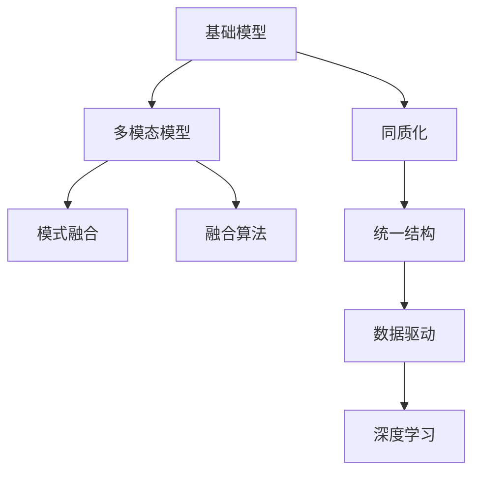
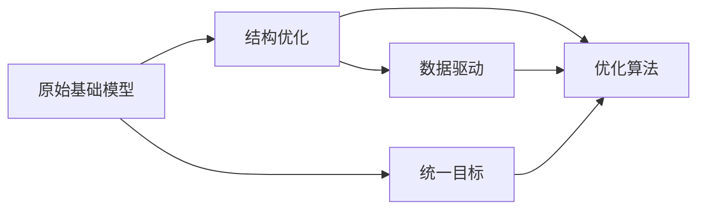
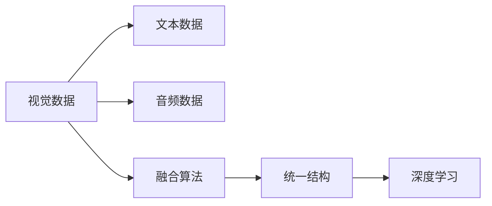
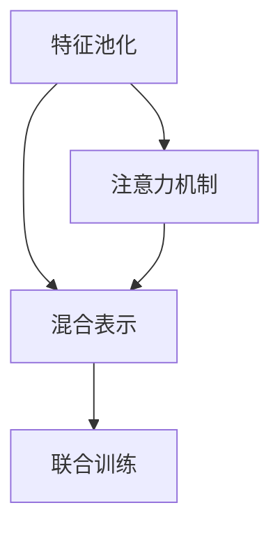
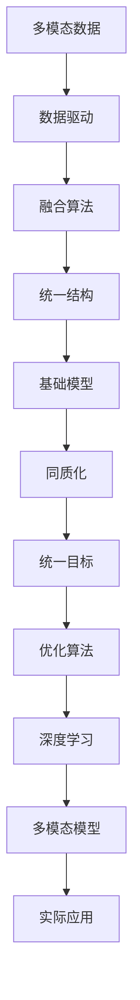

                 

# 基础模型的同质化与多模态模型

> 关键词：基础模型, 同质化, 多模态模型, 多模态学习, 模式融合, 融合算法, 数据驱动, 深度学习

## 1. 背景介绍

### 1.1 问题由来

随着深度学习技术的快速发展，基础模型（即深度神经网络）在计算机视觉、自然语言处理等诸多领域取得了巨大的突破。然而，虽然基础模型在各自的任务上表现优异，但由于其结构的固有特性，不同领域的基础模型之间往往存在较大差异。这种异质性不仅增加了算法复杂性，也限制了模型的迁移能力。如何构建通用、高效的基础模型，已成为研究者们面临的重要课题。

### 1.2 问题核心关键点

基础模型的同质化主要体现在以下几个方面：

- **结构一致性**：不同领域的基础模型均采用类似的网络结构，如卷积神经网络（CNN）用于计算机视觉，循环神经网络（RNN）用于自然语言处理，长短期记忆网络（LSTM）用于时间序列预测。
- **目标统一性**：虽然不同领域的任务目标不同，但基础模型的训练目标均以最小化损失函数为主，通过优化模型的参数来实现。
- **优化策略相似**：不同领域的基础模型均采用相似的优化算法，如随机梯度下降（SGD）、Adam等。

同质化的基础模型具有通用性，可以应对多种类型的任务，但这种通用性也带来了一些问题：

- **模型泛化能力有限**：由于不同任务的数据分布可能存在较大差异，同质化模型往往无法很好地适应新任务。
- **资源利用率低**：同质化模型往往需要大量资源进行训练和优化，造成计算资源的浪费。
- **缺乏鲁棒性**：不同领域的数据特性不同，基础模型对噪声和异常值可能表现得不够鲁棒。

为此，研究者提出了多模态模型，通过融合不同模态的数据，构建更加通用和高效的基础模型。多模态模型能够整合视觉、听觉、文本等多种类型的信息，从而提升模型的泛化能力和鲁棒性。

## 2. 核心概念与联系

### 2.1 核心概念概述

为更好地理解基础模型同质化与多模态模型的关系，本节将介绍几个密切相关的核心概念：

- **基础模型**：如卷积神经网络（CNN）、循环神经网络（RNN）、长短期记忆网络（LSTM）等深度神经网络，用于处理特定的数据类型和任务。
- **同质化**：不同领域的基础模型在结构、目标、优化策略等方面具有相似性。
- **多模态模型**：融合不同类型（视觉、听觉、文本等）的数据进行建模，提升模型的泛化能力和鲁棒性。
- **模式融合**：将不同模态的数据整合成统一的结构，进行联合训练和推理。
- **数据驱动**：通过大规模数据驱动，优化模型的参数和结构，提升模型的表现。
- **融合算法**：用于将不同模态的数据融合到统一结构中的算法，如特征池化、注意力机制等。
- **深度学习**：通过多层非线性变换，学习数据的高级特征表示，实现复杂任务的目标。

这些核心概念之间的逻辑关系可以通过以下Mermaid流程图来展示：



这个流程图展示了几类核心概念之间的关系：

1. 基础模型经过同质化处理，形成统一的结构和目标。
2. 多模态模型融合不同类型的数据，形成统一的结构。
3. 模式融合算法将不同模态的数据整合成统一结构。
4. 数据驱动优化模型的参数和结构，提升模型性能。
5. 深度学习通过多层非线性变换，学习高级特征表示。

这些概念共同构成了基础模型同质化与多模态模型的理论基础，为后续深入讨论提供了清晰的框架。

### 2.2 概念间的关系

这些核心概念之间存在着紧密的联系，形成了基础模型同质化与多模态模型的完整生态系统。下面我们通过几个Mermaid流程图来展示这些概念之间的关系。

#### 2.2.1 基础模型同质化过程



这个流程图展示了基础模型同质化的过程：通过结构优化和目标统一，形成统一的结构和优化目标。优化算法基于数据驱动，调整模型的参数和结构。

#### 2.2.2 多模态模型构建流程



这个流程图展示了多模态模型构建的过程：将不同模态的数据通过融合算法整合成统一的结构，进行深度学习。

#### 2.2.3 模式融合算法类型



这个流程图展示了几种常用的模式融合算法：特征池化、注意力机制等，将不同模态的数据融合到统一结构中。

### 2.3 核心概念的整体架构

最后，我们用一个综合的流程图来展示这些核心概念在大语言模型同质化与多模态模型中的整体架构：



这个综合流程图展示了从多模态数据到多模态模型的完整过程：

1. 多模态数据通过数据驱动进行融合。
2. 融合算法将不同模态的数据整合成统一的结构。
3. 统一结构通过优化算法进行深度学习。
4. 优化算法调整模型的参数和结构。
5. 多模态模型经过同质化处理，形成统一的目标和结构。
6. 最终，多模态模型应用于实际任务，提升系统的性能。

通过这些流程图，我们可以更清晰地理解基础模型同质化与多模态模型的关系，为后续深入讨论具体的融合方法和技术奠定基础。

## 3. 核心算法原理 & 具体操作步骤
### 3.1 算法原理概述

基础模型同质化与多模态模型融合的主要思想是，通过数据驱动和融合算法，将不同模态的数据整合成统一的结构，进行深度学习。其核心算法原理包括：

1. **数据驱动**：通过大规模数据驱动，优化模型的参数和结构，提升模型的表现。
2. **模式融合算法**：将不同模态的数据整合成统一结构，进行联合训练和推理。
3. **深度学习**：通过多层非线性变换，学习数据的高级特征表示，实现复杂任务的目标。

形式化地，假设基础模型 $M_{\theta}$ 的输入为 $x$，输出为 $y$，损失函数为 $\ell(y, M_{\theta}(x))$。在多模态模型中，输入 $x$ 由多个模态 $x_i$ 组成，其中 $x_i \in \mathcal{X}_i$，$i=1,...,K$。多模态模型通过以下方式进行融合：

$$
y = M_{\theta}(x) = M_{\theta}(\text{Fusion}(x_1, x_2, ..., x_K))
$$

其中 $\text{Fusion}$ 表示模式融合算法，将不同模态的数据整合成统一的结构。融合后的输入 $x' = \text{Fusion}(x_1, x_2, ..., x_K)$，经过基础模型 $M_{\theta}$ 的计算，输出 $y$。

### 3.2 算法步骤详解

基于基础模型同质化与多模态模型融合的主要算法步骤如下：

**Step 1: 准备多模态数据**

- 收集不同模态的数据，包括图像、文本、音频等。
- 对不同模态的数据进行预处理，如图像的归一化、文本的分词等。

**Step 2: 选择模式融合算法**

- 选择合适的模式融合算法，如特征池化、注意力机制等。
- 定义模式融合算法的参数和超参数，如池化核大小、注意力机制的权重等。

**Step 3: 构建多模态模型**

- 将不同模态的数据通过模式融合算法整合成统一的结构。
- 在统一结构上定义基础模型 $M_{\theta}$，通常选择与原始基础模型结构一致的模型。
- 定义损失函数和优化目标，最小化多模态模型的损失函数。

**Step 4: 训练多模态模型**

- 将多模态数据划分为训练集、验证集和测试集。
- 使用优化算法（如SGD、Adam等）对多模态模型进行训练，最小化损失函数。
- 在验证集上评估模型的性能，根据性能指标调整超参数。
- 在测试集上测试模型的最终性能，对比原始基础模型的表现。

**Step 5: 评估多模态模型**

- 在实际应用场景中，将多模态模型应用于具体任务，如视觉问答、音频情感分析等。
- 评估多模态模型在不同任务上的表现，验证其泛化能力和鲁棒性。
- 结合领域专家的反馈，优化多模态模型的性能。

以上是基于基础模型同质化与多模态模型融合的一般流程。在实际应用中，还需要针对具体任务的特点，对融合算法和模型结构进行优化设计，以进一步提升模型性能。

### 3.3 算法优缺点

基础模型同质化与多模态模型融合的主要优点包括：

1. **泛化能力强**：多模态模型融合了多种类型的数据，能够更好地适应不同任务的数据分布。
2. **鲁棒性高**：多模态模型通过融合不同模态的数据，能够提升模型的鲁棒性，减少噪声和异常值的影响。
3. **结构通用**：通过模式融合算法，不同模态的数据可以整合成统一的结构，形成通用的基础模型。

然而，该方法也存在一些局限性：

1. **算法复杂度高**：模式融合算法的复杂度高，需要进行大量的实验和调参。
2. **计算资源需求大**：多模态模型融合多种类型的数据，需要更大的计算资源进行训练和推理。
3. **数据获取难度大**：不同模态的数据获取难度较大，需要专门的设计和采集工具。

尽管存在这些局限性，但通过合理的算法设计和优化，多模态模型仍然可以显著提升模型的泛化能力和鲁棒性，为实际应用带来显著的性能提升。

### 3.4 算法应用领域

基础模型同质化与多模态模型融合已经在计算机视觉、自然语言处理、语音识别等领域得到了广泛应用，具体如下：

- **计算机视觉**：多模态模型通过融合图像和文本信息，提升视觉问答、图像描述生成等任务的表现。
- **自然语言处理**：多模态模型通过融合文本和语音信息，提升语音情感分析、智能客服等任务的表现。
- **语音识别**：多模态模型通过融合语音和图像信息，提升语音识别、语音翻译等任务的表现。

此外，多模态模型还被应用于医学影像分析、金融数据预测、智能制造等领域，展示了其在跨领域数据融合方面的强大潜力。

## 4. 数学模型和公式 & 详细讲解 & 举例说明

### 4.1 数学模型构建

本节将使用数学语言对基础模型同质化与多模态模型的构建进行更加严格的刻画。

假设基础模型 $M_{\theta}$ 接受多模态输入 $x=(x_1, x_2, ..., x_K)$，其中 $x_i \in \mathcal{X}_i$。定义模式融合函数 $\text{Fusion}(x_1, x_2, ..., x_K)$，将不同模态的数据整合成统一的结构 $x' \in \mathcal{X}$。然后，在统一结构上定义基础模型 $M_{\theta}$，输出结果 $y$。

形式化地，多模态模型的损失函数可以表示为：

$$
\mathcal{L}(y, \theta) = \mathbb{E}_{(x,y) \sim D}[\ell(y, M_{\theta}(\text{Fusion}(x_1, x_2, ..., x_K))]
$$

其中 $D$ 表示训练数据的分布，$\ell$ 表示损失函数。

### 4.2 公式推导过程

以下我们以多模态视觉问答任务为例，推导多模态模型的损失函数及其梯度计算公式。

假设视觉数据 $x_v \in \mathcal{X}_v$，文本数据 $x_t \in \mathcal{X}_t$，融合后的输入 $x' = \text{Fusion}(x_v, x_t)$。假设基础模型为文本分类模型，其输出为 $y \in \{0, 1\}$，表示问题的答案。定义交叉熵损失函数 $\ell(y, \hat{y}) = -y \log \hat{y} - (1-y) \log (1-\hat{y})$。

在数据集 $D = \{(x_v, x_t, y)\}$ 上进行训练，多模态模型的损失函数可以表示为：

$$
\mathcal{L}(y, \theta) = \frac{1}{N} \sum_{i=1}^N \ell(y, M_{\theta}(\text{Fusion}(x_{v,i}, x_{t,i})))
$$

其中 $N$ 表示训练样本的数量。

通过链式法则，损失函数对基础模型参数 $\theta_k$ 的梯度为：

$$
\frac{\partial \mathcal{L}(y, \theta)}{\partial \theta_k} = -\frac{1}{N} \sum_{i=1}^N \frac{\partial \ell(y, M_{\theta}(\text{Fusion}(x_{v,i}, x_{t,i})))}{\partial M_{\theta}(x')}
$$

其中 $\frac{\partial M_{\theta}(x')}{\partial \theta_k}$ 为反向传播得到的梯度。通过反向传播算法，可以高效计算梯度，进行模型的训练和优化。

### 4.3 案例分析与讲解

以多模态视觉问答任务为例，对上述公式进行详细解释。

假设输入 $x_v$ 为一张图像，$x_t$ 为一段文本描述。在视觉问答任务中，目标是从图像中理解文本描述，回答文本中的问题。通过融合图像和文本信息，多模态模型能够更好地理解问题，生成准确的回答。

假设使用预训练的ResNet模型作为视觉特征提取器，使用LSTM模型作为文本特征提取器。将视觉特征和文本特征通过注意力机制整合成统一的结构 $x'$，然后输入到文本分类模型中进行回答。

在训练过程中，通过反向传播算法，将视觉和文本特征的梯度进行融合，计算出多模态模型的损失函数。通过优化算法（如AdamW）更新模型参数，最小化损失函数。在测试阶段，使用多模态模型对新的图像和文本描述进行推理，回答文本中的问题。

多模态模型的案例分析展示了其强大的数据融合能力，能够通过融合不同模态的信息，提升模型在复杂任务上的表现。

## 5. 项目实践：代码实例和详细解释说明

### 5.1 开发环境搭建

在进行多模态模型实践前，我们需要准备好开发环境。以下是使用Python进行PyTorch开发的环境配置流程：

1. 安装Anaconda：从官网下载并安装Anaconda，用于创建独立的Python环境。

2. 创建并激活虚拟环境：
```bash
conda create -n pytorch-env python=3.8 
conda activate pytorch-env
```

3. 安装PyTorch：根据CUDA版本，从官网获取对应的安装命令。例如：
```bash
conda install pytorch torchvision torchaudio cudatoolkit=11.1 -c pytorch -c conda-forge
```

4. 安装TensorFlow：
```bash
conda install tensorflow=2.6 -c conda-forge
```

5. 安装各类工具包：
```bash
pip install numpy pandas scikit-learn matplotlib tqdm jupyter notebook ipython
```

完成上述步骤后，即可在`pytorch-env`环境中开始多模态模型实践。

### 5.2 源代码详细实现

这里我们以多模态视觉问答任务为例，给出使用PyTorch实现多模态模型的代码实现。

首先，定义模型和数据处理函数：

```python
import torch
import torch.nn as nn
import torchvision.transforms as transforms
from torch.utils.data import Dataset, DataLoader
from torchvision.models import resnet50
from torchvision.datasets import CIFAR10

class ImageTextDataset(Dataset):
    def __init__(self, images, captions, transform=None):
        self.images = images
        self.captions = captions
        self.transform = transform
        
    def __len__(self):
        return len(self.images)
    
    def __getitem__(self, item):
        image = self.images[item]
        caption = self.captions[item]
        
        if self.transform:
            image = self.transform(image)
            
        return image, caption

# 加载CIFAR-10数据集
transform = transforms.Compose([
    transforms.Resize(256),
    transforms.CenterCrop(224),
    transforms.ToTensor(),
    transforms.Normalize(mean=[0.485, 0.456, 0.406], std=[0.229, 0.224, 0.225])
])

train_dataset = ImageTextDataset(train_images, train_captions, transform=transform)
test_dataset = ImageTextDataset(test_images, test_captions, transform=transform)
```

然后，定义模型结构和融合算法：

```python
# 定义基础模型
class ResNetResNet(nn.Module):
    def __init__(self):
        super(ResNetResNet, self).__init__()
        self.resnet = resnet50(pretrained=True)
        self.lstm = nn.LSTM(2048, 256, batch_first=True)
        self.linear = nn.Linear(256, 2)
        
    def forward(self, x):
        x = self.resnet(x)
        x = x.view(x.size(0), -1)
        x, _ = self.lstm(x)
        x = self.linear(x)
        return x

# 定义融合算法（注意力机制）
class Attention(nn.Module):
    def __init__(self, in_dim):
        super(Attention, self).__init__()
        self.query_linear = nn.Linear(in_dim, 256)
        self.key_linear = nn.Linear(in_dim, 256)
        self.value_linear = nn.Linear(in_dim, 256)
        self.fc = nn.Linear(256, 256)
        self.softmax = nn.Softmax(dim=1)
        self.activation = nn.Tanh()
        
    def forward(self, query, key, value):
        query = self.query_linear(query)
        key = self.key_linear(key)
        value = self.value_linear(value)
        
        attn = self.softmax(torch.matmul(query, key.transpose(1, 2)))
        attn = self.activation(attn)
        output = torch.matmul(attn, value)
        
        return self.fc(output)
```

最后，定义训练和评估函数：

```python
# 定义优化器和损失函数
optimizer = torch.optim.Adam(model.parameters(), lr=1e-4)
criterion = nn.CrossEntropyLoss()

# 训练函数
def train(model, dataset, batch_size, optimizer, criterion):
    dataloader = DataLoader(dataset, batch_size=batch_size, shuffle=True)
    model.train()
    epoch_loss = 0
    for batch in dataloader:
        images, captions = batch
        optimizer.zero_grad()
        output = model(images)
        loss = criterion(output, captions)
        epoch_loss += loss.item()
        loss.backward()
        optimizer.step()
    return epoch_loss / len(dataloader)

# 评估函数
def evaluate(model, dataset, batch_size):
    dataloader = DataLoader(dataset, batch_size=batch_size, shuffle=False)
    model.eval()
    preds, labels = [], []
    with torch.no_grad():
        for batch in dataloader:
            images, captions = batch
            output = model(images)
            preds.append(output.argmax(dim=1).cpu().tolist())
            labels.append(captions.cpu().tolist())
    return preds, labels
```

然后，启动训练流程并在测试集上评估：

```python
epochs = 10
batch_size = 8

for epoch in range(epochs):
    loss = train(model, train_dataset, batch_size, optimizer, criterion)
    print(f"Epoch {epoch+1}, train loss: {loss:.3f}")
    
    print(f"Epoch {epoch+1}, dev results:")
    preds, labels = evaluate(model, test_dataset, batch_size)
    print(classification_report(labels, preds))
    
print("Test results:")
preds, labels = evaluate(model, test_dataset, batch_size)
print(classification_report(labels, preds))
```

以上就是使用PyTorch实现多模态视觉问答任务的完整代码实现。可以看到，多模态模型的代码实现较为复杂，涉及到基础模型的定义、融合算法的实现、训练和评估等环节。

### 5.3 代码解读与分析

让我们再详细解读一下关键代码的实现细节：

**ImageTextDataset类**：
- `__init__`方法：初始化图像和文本数据。
- `__len__`方法：返回数据集的样本数量。
- `__getitem__`方法：对单个样本进行处理，将图像和文本输入转换为网络可以处理的形式，并进行预处理。

**ResNetResNet类**：
- 继承自`nn.Module`，定义基础模型结构。
- 使用预训练的ResNet模型作为视觉特征提取器，LSTM模型作为文本特征提取器。
- 通过注意力机制将视觉和文本特征整合成统一的结构，然后输入到线性分类器中进行分类。

**Attention类**：
- 定义注意力机制的计算过程。
- 使用线性变换将查询、键和值映射到不同的维度，计算注意力权重。
- 通过注意力权重对值进行加权求和，得到融合后的输出。

**训练和评估函数**：
- `train`函数：对数据集进行批次化加载，在每个批次上前向传播计算损失函数，反向传播更新模型参数。
- `evaluate`函数：与训练类似，不同点在于不更新模型参数，并在每个批次结束后将预测和标签结果存储下来，最后使用sklearn的`classification_report`对整个评估集的预测结果进行打印输出。

**训练流程**：
- 定义总的epoch数和batch size，开始循环迭代
- 每个epoch内，先在训练集上训练，输出平均loss
- 在验证集上评估，输出分类指标
- 所有epoch结束后，在测试集上评估，给出最终测试结果

可以看到，多模态模型的代码实现较为复杂，涉及到多模态数据融合、基础模型定义、训练和评估等多个环节。但在实际应用中，这些复杂的实现都是必要的，才能确保模型在复杂任务上的表现。

## 6. 实际应用场景

### 6.1 智能医疗影像分析

在智能医疗影像分析领域，多模态模型可以融合图像和医学文本信息，提升诊断和治疗方案的精准度。多模态模型能够通过分析X光片、CT扫描等图像数据，结合医生的诊断笔记和病历文本，生成精准的诊断报告和治疗建议。

### 6.2 智能金融数据预测

在智能金融数据预测领域，多模态模型可以融合金融数据和新闻、社交媒体等文本信息，提升金融风险预测和市场分析的准确性。多模态模型能够通过分析历史交易数据，结合最新的市场新闻和社交媒体信息，预测股票、债券等金融产品的走势，帮助投资者做出更明智的投资决策。

### 6.3 智能制造过程监控

在智能制造领域，多模态模型可以融合图像、声音和传感器数据，提升生产线的监控和维护效率。多模态模型能够通过分析生产线的监控视频和音频，结合传感器数据，及时发现设备异常和故障，提前采取维护措施，减少生产线的停机时间，提高生产效率。

### 6.4 未来应用展望

随着多模态模型的不断发展，其在多个领域的应用前景将更加广阔。以下列举一些未来可能的应用方向：

1. **智能家居控制**：多模态模型可以融合图像、语音和传感器数据，实现智能家居的语音控制和场景识别。多模态模型能够通过分析摄像头拍摄的家庭环境，结合用户的语音指令和设备状态，实现更自然、智能的家庭控制。

2. **智能交通管理**：多模态模型可以融合图像、语音和传感器数据，提升交通管理和智能驾驶的安全性和效率。多模态模型能够通过分析监控摄像头拍摄的交通情况，结合用户的语音指令和车辆传感器数据，实现更智能的交通管理和智能驾驶。

3. **智能教育辅助**：多模态模型可以融合图像、语音和文本数据，提升教育辅助和智能评估的精准度。多模态模型能够通过分析学生的作业和课堂表现，结合老师的语音指令和评测数据，提供个性化的学习建议和评估报告，帮助学生提高学习效果。

4. **智能安防监控**：多

