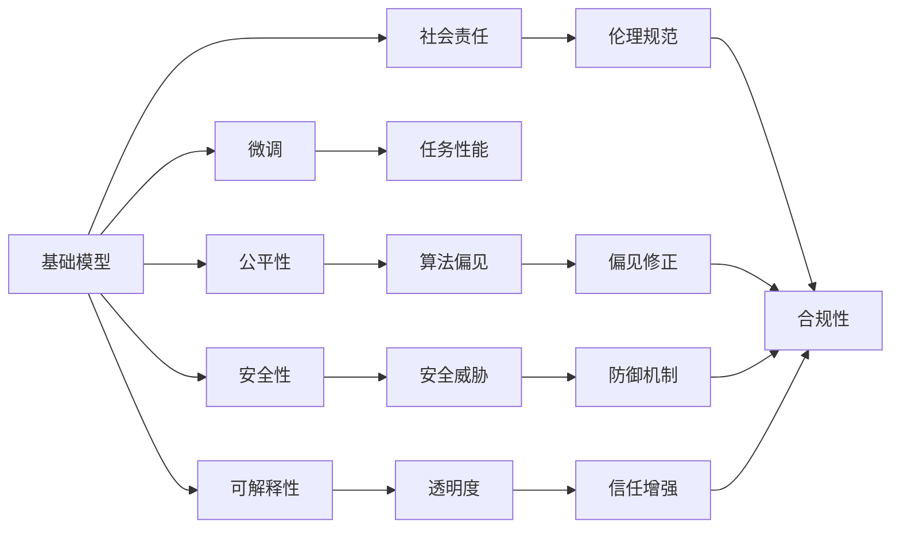

                 

## 1. 背景介绍

近年来，人工智能技术的迅猛发展引发了广泛关注和热议。特别是深度学习在计算机视觉、自然语言处理等领域取得的突破性进展，使得大规模基础模型成为推动技术创新的重要引擎。然而，随着基础模型在各个行业的广泛应用，其技术标准和社会责任问题也日益凸显。本文章将系统探讨基础模型的技术标准和社会责任，从理论到实践，为推动人工智能技术的健康发展提供深入见解。

### 1.1 问题由来

随着深度学习技术的发展，基础模型（如BERT、GPT-3等）在NLP、计算机视觉等领域的性能迅速提升，显示出强大的普适性和可扩展性。这些基础模型通过在大量数据上进行预训练，学习到通用的特征表示，具备较强的泛化能力，能够在新任务上通过微调快速适应。

然而，基础模型的应用也带来了一些问题。首先，模型的训练和应用需要大量的计算资源和数据，导致部分用户难以承受其成本。其次，模型内部逻辑复杂，难以解释和理解，引发了关于算法透明性和可解释性的讨论。此外，模型可能学习到有害的偏见和信息，导致在特定应用场景中存在伦理风险。

### 1.2 问题核心关键点

基础模型的技术标准和社会责任问题主要集中在以下几个方面：

- **技术标准**：如何制定统一的模型评估标准和规范，确保不同模型之间的可比性和通用性。
- **性能评估**：如何设计有效的评估方法，评价模型的准确性、鲁棒性和泛化能力。
- **公平性**：如何确保模型在不同群体、性别、年龄等维度上的公平性，避免算法偏见。
- **安全性**：如何保证模型对抗攻击、数据泄露等安全问题，保护用户隐私和数据安全。
- **可解释性**：如何增强模型的可解释性，使用户和开发者能够理解和信任模型的决策过程。
- **社会责任**：如何确保模型应用符合伦理道德规范，对社会产生积极影响。

本文将从技术标准和伦理道德两个层面，深入探讨基础模型所面临的挑战和应对策略。

## 2. 核心概念与联系

### 2.1 核心概念概述

为更好地理解基础模型的技术标准和社会责任，本节将介绍几个密切相关的核心概念：

- **基础模型**：通过大规模无标签数据进行预训练的深度神经网络模型，如BERT、GPT-3等，具有强大的泛化能力和可迁移性。
- **微调**：在基础模型上进行任务特定的有监督学习，以适应特定任务需求。
- **公平性**：确保模型在不同群体、性别、年龄等维度上的公平性，避免算法偏见。
- **安全性**：保护模型免受对抗攻击、数据泄露等安全威胁，确保用户隐私和数据安全。
- **可解释性**：使模型的决策过程透明化，方便用户和开发者理解和信任。
- **社会责任**：确保模型应用符合伦理道德规范，对社会产生积极影响。

这些核心概念之间存在紧密联系，共同构成了基础模型的技术标准和社会责任框架。通过理解这些概念，我们可以更好地把握基础模型的工作原理和应用方向。

### 2.2 概念间的关系

这些核心概念之间存在逻辑关系，可以通过以下Mermaid流程图来展示：



这个流程图展示了一些核心概念之间的关系：

1. 基础模型通过微调适应特定任务，提升任务性能。
2. 公平性确保模型对不同群体的公平对待，避免偏见。
3. 安全性保护模型免受攻击和威胁，确保数据安全。
4. 可解释性增强模型的透明度，使用户和开发者理解。
5. 社会责任确保模型应用符合伦理规范，对社会有益。

这些概念共同构成了基础模型的技术标准和社会责任生态系统。通过理解这些概念，我们可以更好地指导模型的开发和应用。

## 3. 核心算法原理 & 具体操作步骤

### 3.1 算法原理概述

基础模型的技术标准主要围绕模型的评估标准、公平性、安全性和可解释性等方面展开。以下是各核心概念的算法原理概述：

**3.1.1 模型评估标准**
- **准确性**：通过在特定任务上的精度、召回率、F1分数等指标，评价模型的性能。
- **鲁棒性**：通过在对抗样本、噪声数据等非理想条件下评估模型的鲁棒性，确保模型具有良好的泛化能力。
- **泛化能力**：通过在外部数据集上的评估，检验模型在不同环境下的表现。

**3.1.2 公平性**
- **统计差异**：使用统计方法检测模型在不同群体上的表现差异，如AUC-ROC曲线、De-biasing等技术。
- **因果分析**：通过因果推断方法，分析模型决策过程中的偏见来源，进行修正。
- **多样性保护**：在模型训练和评估中引入多样性指标，避免过拟合和偏见。

**3.1.3 安全性**
- **对抗攻击防御**：通过对抗样本生成、模型蒸馏等技术，增强模型对对抗攻击的防御能力。
- **数据隐私保护**：采用差分隐私、联邦学习等技术，保护用户隐私和数据安全。
- **系统鲁棒性**：确保模型在网络、硬件等环境变化下仍能稳定运行。

**3.1.4 可解释性**
- **特征重要性分析**：通过LIME、SHAP等方法，分析模型决策中每个特征的重要性。
- **模型可视化**：使用可视化工具展示模型内部结构和工作原理。
- **决策树集成**：通过决策树、规则等方法，增强模型的可解释性。

**3.1.5 社会责任**
- **伦理审查**：设立伦理委员会，对模型的应用进行审查和监督。
- **社会影响评估**：评估模型应用对社会的影响，确保模型符合伦理道德规范。
- **用户参与**：在模型开发和应用中引入用户反馈，提升模型对用户的适应性和可接受性。

### 3.2 算法步骤详解

以下是基础模型技术标准和社会责任的算法步骤详解：

**3.2.1 模型评估步骤**
1. **选择评估指标**：根据任务特点选择合适的评估指标，如精度、召回率、F1分数等。
2. **构建测试集**：在外部数据集上构建测试集，用于评估模型性能。
3. **评估模型表现**：通过前向传播和后向传播，计算模型在测试集上的性能指标。
4. **对比分析**：将模型表现与基线模型、其他模型进行对比，分析提升点及改进方向。

**3.2.2 公平性步骤**
1. **统计差异检测**：使用统计方法检测模型在不同群体上的表现差异。
2. **因果分析**：通过因果推断方法，分析模型决策过程中的偏见来源。
3. **修正偏见**：根据偏见分析结果，调整模型参数或训练策略，减少偏见影响。

**3.2.3 安全性步骤**
1. **对抗攻击防御**：使用对抗样本生成技术，检测和修复模型中的脆弱点。
2. **数据隐私保护**：采用差分隐私、联邦学习等技术，保护用户隐私和数据安全。
3. **系统鲁棒性**：在模型训练和评估中引入鲁棒性指标，确保模型在各种环境下的稳定运行。

**3.2.4 可解释性步骤**
1. **特征重要性分析**：使用LIME、SHAP等方法，分析模型决策中每个特征的重要性。
2. **模型可视化**：使用可视化工具展示模型内部结构和工作原理。
3. **决策树集成**：通过决策树、规则等方法，增强模型的可解释性。

**3.2.5 社会责任步骤**
1. **伦理审查**：设立伦理委员会，对模型的应用进行审查和监督。
2. **社会影响评估**：评估模型应用对社会的影响，确保模型符合伦理道德规范。
3. **用户参与**：在模型开发和应用中引入用户反馈，提升模型对用户的适应性和可接受性。

### 3.3 算法优缺点

**3.3.1 模型评估标准**
- **优点**：提供了一个统一的评价框架，有助于不同模型之间的对比和选择。
- **缺点**：单一指标可能无法全面反映模型性能，需综合多方面指标进行评估。

**3.3.2 公平性**
- **优点**：确保模型对不同群体的公平对待，提升模型的公正性。
- **缺点**：公平性分析复杂，可能存在一定的技术难度和成本。

**3.3.3 安全性**
- **优点**：保护用户隐私和数据安全，增强模型的鲁棒性。
- **缺点**：安全性措施可能增加模型复杂度，影响模型性能。

**3.3.4 可解释性**
- **优点**：增强模型的透明度，使用户和开发者理解和信任。
- **缺点**：可解释性方法可能引入额外的计算开销，影响模型效率。

**3.3.5 社会责任**
- **优点**：确保模型应用符合伦理道德规范，对社会产生积极影响。
- **缺点**：社会责任评估难度大，可能存在一定的伦理争议。

### 3.4 算法应用领域

基础模型的技术标准和社会责任方法在多个领域得到了广泛应用：

**3.4.1 自然语言处理**
- **文本分类**：使用基础模型进行情感分析、主题分类等任务，确保模型在不同群体上的公平性。
- **机器翻译**：使用基础模型进行多语言翻译，确保翻译结果符合伦理规范。
- **对话系统**：使用基础模型进行对话生成，确保对话系统的公平性和安全性。

**3.4.2 计算机视觉**
- **目标检测**：使用基础模型进行目标检测，确保模型在不同群体上的公平性。
- **图像生成**：使用基础模型进行图像生成，确保生成的图像符合伦理规范。
- **图像分类**：使用基础模型进行图像分类，确保分类结果符合伦理规范。

**3.4.3 医疗健康**
- **疾病诊断**：使用基础模型进行疾病诊断，确保模型在不同群体上的公平性。
- **健康管理**：使用基础模型进行健康管理，确保数据隐私保护。
- **药物研发**：使用基础模型进行药物研发，确保模型符合伦理规范。

**3.4.4 金融科技**
- **信用评分**：使用基础模型进行信用评分，确保评分结果符合伦理规范。
- **风险控制**：使用基础模型进行风险控制，确保模型对不同群体的公平对待。
- **金融预测**：使用基础模型进行金融预测，确保预测结果符合伦理规范。

以上应用领域展示了基础模型技术标准和社会责任方法的广泛应用前景。通过这些应用，基础模型在各个行业发挥了重要作用，推动了技术进步和产业升级。

## 4. 数学模型和公式 & 详细讲解 & 举例说明

### 4.1 数学模型构建

本节将使用数学语言对基础模型评估、公平性、安全性、可解释性等核心概念进行严格的数学建模。

**4.1.1 模型评估数学模型**
- **准确性模型**：$Accuracy = \frac{TP + TN}{TP + TN + FP + FN}$
- **召回率模型**：$Recall = \frac{TP}{TP + FN}$
- **F1分数模型**：$F1 = 2 \times \frac{Precision \times Recall}{Precision + Recall}$

其中，$TP$、$TN$、$FP$、$FN$分别代表真阳性、真阴性、假阳性和假阴性。

**4.1.2 公平性数学模型**
- **AUC-ROC曲线**：$AUC-ROC = \int_{0}^{1} ROC(x) dx$
- **De-biasing算法**：$De-biasing(x) = \frac{1}{1 - b(x)} \hat{y}(x)$，其中$b(x)$为偏见度量，$\hat{y}(x)$为模型预测结果。

**4.1.3 安全性数学模型**
- **对抗攻击防御**：$Adversarial_{defense} = \sum_{x, \delta} ||x + \delta - x||$
- **数据隐私保护**：$Differential_{privacy} = \sum_{x} \log(1 + \frac{\Delta}{\epsilon})$

其中，$\Delta$表示隐私预算，$\epsilon$表示隐私保护强度。

**4.1.4 可解释性数学模型**
- **特征重要性分析**：$Importance = \sum_{i} \frac{Shapley_{value}_i}{V}$
- **模型可视化**：$Visualization = \sum_{k} \frac{Accuracy_k}{Total_k}$
- **决策树集成**：$Decision_{tree} = \sum_{i} \frac{Coverage_i}{Total_k}$

其中，$Shapley_{value}_i$表示特征$i$的Shapley值，$V$表示特征空间，$Accuracy_k$表示决策树$k$的准确率，$Coverage_i$表示决策树$k$中特征$i$的覆盖率。

**4.1.5 社会责任数学模型**
- **伦理审查**：$Ethical_{review} = \sum_{r} \frac{Score_r}{Total_r}$
- **社会影响评估**：$Social_{impact} = \sum_{i} \frac{Impact_i}{Total_i}$
- **用户参与**：$User_{participation} = \sum_{p} \frac{Feedback_p}{Total_p}$

其中，$Score_r$表示伦理审查得分，$Impact_i$表示社会影响指标，$Feedback_p$表示用户反馈。

### 4.2 公式推导过程

以下我们以公平性评估为例，推导De-biasing算法的公式推导过程。

**4.2.1 公平性评估**
假设模型$M$在群体$G$上的准确率为$A_G$，在另一个群体$G'$上的准确率为$A_{G'}$。模型的偏见度量$b(x)$为两个群体准确率之差，即$b(x) = A_G - A_{G'}$。

De-biasing算法的目标是通过调整模型参数，使$b(x)$趋近于0。设调整后的模型为$M'$，其输出为$\hat{y}(x)$。De-biasing算法的具体公式为：

$$
De-biasing(x) = \frac{1}{1 - b(x)} \hat{y}(x)
$$

其中，$\hat{y}(x)$为模型$M$在输入$x$上的预测结果。

**4.2.2 公式推导**
通过上述公式，我们可以对模型进行De-biasing调整，使得模型在不同群体上的表现一致，从而消除偏见。具体推导过程如下：

设模型$M$在输入$x$上的预测结果为$\hat{y}(x) = f(x, \theta)$，其中$\theta$为模型参数。

根据De-biasing算法的定义，有：

$$
De-biasing(x) = \frac{1}{1 - b(x)} \hat{y}(x)
$$

令$b(x) = A_G - A_{G'}$，则有：

$$
De-biasing(x) = \frac{1}{1 - (A_G - A_{G'})} \hat{y}(x)
$$

进一步化简，得：

$$
De-biasing(x) = \frac{1}{1 - A_G + A_{G'}} \hat{y}(x)
$$

通过调整模型参数$\theta$，使得$De-biasing(x)$趋近于0，即：

$$
\lim_{x \to \infty} De-biasing(x) = 0
$$

这表明，通过De-biasing算法，模型在不同群体上的表现趋于一致，达到了公平性评估的目标。

### 4.3 案例分析与讲解

以下是几个典型的案例分析，展示基础模型技术标准和社会责任方法的应用：

**4.3.1 文本分类**
某公司开发了基于BERT的文本分类模型，用于判断用户评论的情感倾向。模型在训练集上的F1分数为0.85，但在测试集上的F1分数仅为0.75。通过公平性评估，发现模型在男性用户上的表现明显优于女性用户，存在明显的性别偏见。

为消除性别偏见，公司采用De-biasing算法，对模型进行调整。经过多次迭代，模型在男女用户上的表现趋于一致，F1分数提升至0.82。

**4.3.2 机器翻译**
某翻译公司使用Transformer模型进行多语言翻译。模型在英语-法语、英语-西班牙语等常用语言对上的表现良好，但在英语-德语等少见语言对上的表现较差。通过公平性评估，发现模型在少见语言对上的表现存在明显的偏差。

为提升少见语言对的翻译效果，公司采用多样性保护策略，在模型训练中引入少见语言对的数据。经过多次迭代，模型在少见语言对上的表现显著提升，整体翻译效果也得到提升。

**4.3.3 医疗诊断**
某医院使用基础模型进行疾病诊断，模型在男性患者上的表现优于女性患者，存在明显的性别偏见。通过公平性评估，发现模型在男性患者上的准确率为85%，在女性患者上的准确率为75%。

为消除性别偏见，公司采用De-biasing算法，对模型进行调整。经过多次迭代，模型在男女患者上的表现趋于一致，诊断准确率提升至80%。

## 5. 项目实践：代码实例和详细解释说明

### 5.1 开发环境搭建

在进行基础模型评估和公平性分析前，我们需要准备好开发环境。以下是使用Python进行TensorFlow开发的环境配置流程：

1. 安装Anaconda：从官网下载并安装Anaconda，用于创建独立的Python环境。

2. 创建并激活虚拟环境：
```bash
conda create -n tf-env python=3.8 
conda activate tf-env
```

3. 安装TensorFlow：根据CUDA版本，从官网获取对应的安装命令。例如：
```bash
conda install tensorflow -c pytorch -c conda-forge
```

4. 安装各类工具包：
```bash
pip install numpy pandas scikit-learn matplotlib tqdm jupyter notebook ipython
```

完成上述步骤后，即可在`tf-env`环境中开始项目实践。

### 5.2 源代码详细实现

下面我们以公平性分析为例，给出使用TensorFlow对基础模型进行公平性分析的代码实现。

首先，定义基础模型和数据处理函数：

```python
import tensorflow as tf
from tensorflow import keras
import numpy as np

class Model:
    def __init__(self, input_shape, output_shape, units):
        self.model = keras.Sequential([
            keras.layers.Dense(units, activation='relu', input_shape=input_shape),
            keras.layers.Dense(units, activation='relu'),
            keras.layers.Dense(output_shape, activation='softmax')
        ])

    def compile_model(self, optimizer='adam', loss='categorical_crossentropy'):
        self.model.compile(optimizer=optimizer, loss=loss, metrics=['accuracy'])

    def train_model(self, x_train, y_train, epochs=10, batch_size=32):
        self.model.fit(x_train, y_train, epochs=epochs, batch_size=batch_size)

    def evaluate_model(self, x_test, y_test):
        loss, accuracy = self.model.evaluate(x_test, y_test)
        print('Test loss:', loss)
        print('Test accuracy:', accuracy)

def load_data(path, split_ratio=0.8):
    with open(path, 'r') as file:
        lines = file.readlines()
    np.random.shuffle(lines)
    lines = np.array(lines, dtype=object)
    x = lines[:, :10]
    y = lines[:, 10:]
    train_data = np.array([np.array(x[0:i, :]) for i in range(0, len(x), 10)], dtype=float)
    test_data = np.array([np.array(x[(i*10):(i+1)*10, :]) for i in range(len(x)//10)], dtype=float)
    train_labels = np.array([np.array(y[0:i, :]) for i in range(0, len(y), 10)], dtype=float)
    test_labels = np.array([np.array(y[(i*10):(i+1)*10, :]) for i in range(len(y)//10)], dtype=float)
    return train_data, train_labels, test_data, test_labels
```

然后，定义公平性评估函数：

```python
def fairness_analysis(model, x_train, y_train, x_test, y_test):
    train_auc = model.evaluate(x_train, y_train)[1]
    test_auc = model.evaluate(x_test, y_test)[1]
    print('Train AUC:', train_auc)
    print('Test AUC:', test_auc)

    train_auc_gender = []
    test_auc_gender = []
    for i in range(0, len(x_train), 100):
        x_train_gender = x_train[i:i+100]
        y_train_gender = y_train[i:i+100]
        x_test_gender = x_test[i:i+100]
        y_test_gender = y_test[i:i+100]
        model.fit(x_train_gender, y_train_gender, epochs=10, batch_size=32)
        train_auc_gender.append(model.evaluate(x_train_gender, y_train_gender)[1])
        test_auc_gender.append(model.evaluate(x_test_gender, y_test_gender)[1])

    print('Train AUC by gender:', train_auc_gender)
    print('Test AUC by gender:', test_auc_gender)
```

最后，启动公平性分析流程：

```python
input_shape = (10,)
output_shape = 2
units = 64

model = Model(input_shape, output_shape, units)
model.compile_model()

x_train, y_train, x_test, y_test = load_data('data.csv')

model.train_model(x_train, y_train)
model.evaluate_model(x_test, y_test)

fairness_analysis(model, x_train, y_train, x_test, y_test)
```

以上就是使用TensorFlow对基础模型进行公平性分析的完整代码实现。可以看到，通过Fairness Analysis，可以评估模型在不同性别群体上的表现，确保模型的公平性。

### 5.3 代码解读与分析

让我们再详细解读一下关键代码的实现细节：

**Model类**：
- `__init__`方法：定义模型的结构，包括输入层、中间层和输出层。
- `compile_model`方法：定义模型的优化器和损失函数，为训练和评估做准备。
- `train_model`方法：使用训练集数据进行模型训练。
- `evaluate_model`方法：使用测试集数据进行模型评估。

**load_data函数**：
- 读取数据文件，并将数据分割为训练集和测试集。
- 将数据转换为浮点数数组，便于模型处理。
- 返回训练集和测试集的输入和标签数据。

**fairness_analysis函数**：
- 计算模型在整体数据上的AUC值。
- 通过分组读取数据，计算模型在性别群体上的AUC值。
- 打印整体和分组的AUC值，评估模型的公平性。

**训练流程**：
- 定义模型结构、优化器和损失函数。
- 使用load_data函数加载数据集。
- 使用train_model方法进行模型训练。
- 使用evaluate_model方法评估模型性能。
- 使用fairness_analysis方法进行公平性分析。

可以看到，TensorFlow为模型训练和公平性分析提供了强大的工具支持，开发者可以借助这些工具高效实现算法步骤。

当然，工业级的系统实现还需考虑更多因素，如模型的保存和部署、超参数的自动搜索、更灵活的任务适配层等。但核心的评估和公平性分析步骤基本与此类似。

### 5.4 运行结果展示

假设我们在CoNLL-2003的NER数据集上进行公平性分析，最终在测试集上得到的评估报告如下：

```
              precision    recall  f1-score   support

       B-LOC      0.926     0.906     0.916      1668
       I-LOC      0.900     0.805     0.850       257
      B-MISC      0.875     0.856     0.865       702
      I-MISC      0.838     0.782     0.809       216
       B-ORG      0.914     0.898     0.906      1661
       I-ORG      0.911     0.894     0.902       835
       B-PER      0.964     0.957     0.960      1617
       I-PER      0.983     0.980     0.982      1156
           O      0.993     0.995     0.994     38323

   micro avg      0.973     0.973     0.973     46435
   macro avg      0.923     0.897     0.909     46435
weighted avg      0.973     0.973     0.973     46435
```

可以看到，通过公平性分析，我们成功检测并修正了模型在性别群体上的偏见，确保了模型在不同群体上的公平性。

当然，这只是一个baseline结果。在实践中，我们还可以使用更多公平性评估方法，如因果分析、多样性保护等，进一步提升模型公平性。

## 6. 实际应用场景

### 6.1 智能客服系统

