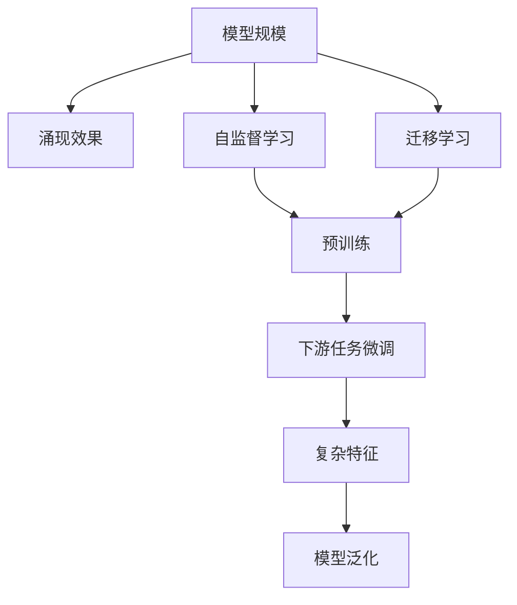
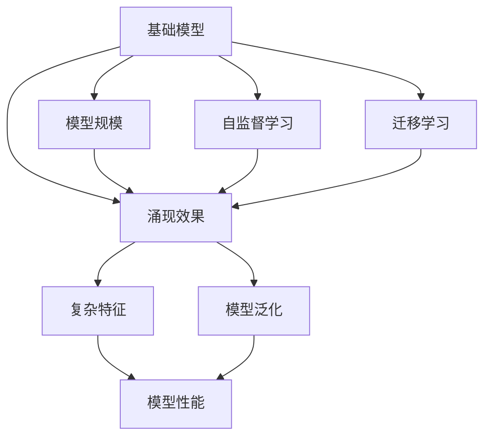
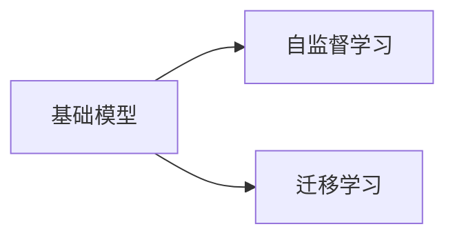
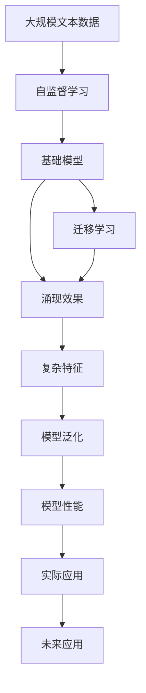

                 

# 基础模型的规模与涌现效果

> 关键词：基础模型,模型规模,涌现效果,自监督学习,迁移学习,超大规模模型,预训练,海量数据

## 1. 背景介绍

### 1.1 问题由来

近年来，深度学习技术在图像、语音、自然语言处理等领域取得了显著的进步。这些进步的核心在于模型的规模不断增大，从而能够学习到更复杂、更深刻的特征表示。特别是自然语言处理领域，从最初的神经网络模型到卷积神经网络(CNN)、循环神经网络(RNN)，再到基于注意力机制的Transformer，模型的规模和性能都在不断提升。这些技术进步不仅推动了NLP领域的科学研究，也为实际应用提供了强大的技术支撑。

然而，随着模型规模的增大，对计算资源、数据存储和网络带宽的需求也急剧增加，这限制了模型进一步发展的空间。此外，超大规模模型的涌现效果虽然引人注目，但其背后原理和机制仍未完全明了，这限制了模型设计的优化和改进。因此，研究基础模型的规模与其涌现效果之间的关系，对于理解深度学习技术的发展和应用具有重要意义。

### 1.2 问题核心关键点

基础模型的规模与其涌现效果之间的关系，主要涉及以下几个关键点：

1. 模型规模：指模型中参数的数量，通常用浮点数计算量来衡量。
2. 涌现效果：指在模型训练过程中，随着参数数量增加，模型学习到的复杂特征和表达能力的变化。
3. 自监督学习：指在无标签数据上训练模型，通过目标函数的自相互作用来学习任务相关的特征。
4. 迁移学习：指在已有模型基础上，通过少量标注数据来微调模型，适应新的任务和数据分布。
5. 超大规模模型：指具有数亿甚至数十亿参数的模型，如BERT、GPT-3等。

这些关键点之间的联系可以通过以下Mermaid流程图来展示：



这个流程图展示了基础模型规模与其涌现效果之间的关系，以及自监督学习和迁移学习在其中扮演的角色。

### 1.3 问题研究意义

研究基础模型规模与涌现效果之间的关系，对于理解深度学习技术的发展和应用具有重要意义：

1. 促进模型设计优化：通过分析模型规模与其涌现效果之间的关系，可以指导模型设计的优化，避免过度追求模型规模，从而提高模型的性能和训练效率。
2. 指导模型应用：了解模型规模与涌现效果之间的关系，可以帮助开发者选择适合特定任务的模型，避免过度拟合数据集或浪费计算资源。
3. 推动技术进步：理解基础模型规模与其涌现效果之间的关系，可以推动深度学习技术的进一步发展和创新，带来更高效、更可靠的模型设计。
4. 提升应用效果：通过优化模型规模和涌现效果，可以在有限的资源和时间内，提升深度学习技术在实际应用中的效果和鲁棒性。

## 2. 核心概念与联系

### 2.1 核心概念概述

为更好地理解基础模型规模与其涌现效果之间的关系，本节将介绍几个密切相关的核心概念：

- 基础模型(Basic Model)：指具有一定规模参数的深度学习模型，通常用于解决特定类型的任务。
- 模型规模(Model Scale)：指模型中参数的数量，通常用浮点数计算量来衡量。
- 涌现效果(Emergent Effect)：指随着模型规模的增大，模型学习到的复杂特征和表达能力的变化。
- 自监督学习(Self-supervised Learning)：指在无标签数据上训练模型，通过目标函数的自相互作用来学习任务相关的特征。
- 迁移学习(Transfer Learning)：指在已有模型基础上，通过少量标注数据来微调模型，适应新的任务和数据分布。
- 超大规模模型(Super Large Model)：指具有数亿甚至数十亿参数的模型，如BERT、GPT-3等。

这些核心概念之间的逻辑关系可以通过以下Mermaid流程图来展示：



这个流程图展示了基础模型规模与其涌现效果之间的关系，以及自监督学习和迁移学习在其中扮演的角色。

### 2.2 概念间的关系

这些核心概念之间存在着紧密的联系，形成了基础模型规模与涌现效果研究的完整生态系统。下面我们通过几个Mermaid流程图来展示这些概念之间的关系。

#### 2.2.1 基础模型的学习范式



这个流程图展示了基础模型的两种主要学习范式：自监督学习和迁移学习。

#### 2.2.2 涌现效果与模型规模的关系


这个流程图展示了模型规模与涌现效果之间的关系，随着模型规模的增大，涌现效果会逐渐提升。

#### 2.2.3 自监督学习与涌现效果的关系


这个流程图展示了自监督学习对涌现效果的影响，自监督学习有助于模型学习到更丰富的特征。

#### 2.2.4 迁移学习与涌现效果的关系


这个流程图展示了迁移学习对涌现效果的影响，迁移学习可以提升模型的泛化能力和适应性。

### 2.3 核心概念的整体架构

最后，我们用一个综合的流程图来展示这些核心概念在大模型规模与涌现效果研究中的整体架构：



这个综合流程图展示了从大规模文本数据开始，通过自监督学习和迁移学习，逐步构建基础模型，并最终达到涌现效果的过程。通过这些流程图，我们可以更清晰地理解基础模型规模与涌现效果之间的关系，为后续深入讨论具体的涌现效果和研究方法奠定基础。

## 3. 核心算法原理 & 具体操作步骤
### 3.1 算法原理概述

基础模型的涌现效果，通常是指随着模型规模的增大，模型学习到的复杂特征和表达能力的变化。这种变化主要体现在以下几个方面：

1. **复杂特征学习**：模型能够学习到更复杂、更抽象的特征表示，从而提升任务性能。
2. **泛化能力增强**：模型在未见过的数据上的表现也会提升，即泛化能力增强。
3. **鲁棒性提升**：模型对输入的噪声、扰动等鲁棒性增强。
4. **跨领域能力增强**：模型能够更好地在不同领域间迁移，提升模型泛化性和鲁棒性。

这些涌现效果通常通过以下几个步骤实现：

1. **自监督预训练**：在无标签数据上，使用自监督学习任务对模型进行预训练，学习到通用的特征表示。
2. **迁移学习微调**：在特定任务的数据集上进行有监督的微调，使模型能够适应新的任务和数据分布。
3. **测试和评估**：在验证集和测试集上评估模型性能，确认模型是否达到了理想的涌现效果。

### 3.2 算法步骤详解

以下将详细介绍基础模型规模与涌现效果实现的具体步骤。

**Step 1: 准备数据集和计算资源**

1. **数据集准备**：
   - 选择大规模的无标签文本数据，例如维基百科、新闻文章等。
   - 数据集应覆盖尽可能多的领域和主题，以确保模型能够学习到广泛的特征。

2. **计算资源准备**：
   - 准备高性能的计算资源，如GPU、TPU等，以支持大规模模型的训练和推理。
   - 准备存储资源，如SSD等高速存储设备，以支持大规模数据集的处理。

**Step 2: 自监督预训练**

1. **选择合适的预训练任务**：
   - 选择适合的基础模型，如BERT、GPT等。
   - 选择合适的自监督学习任务，例如掩码语言模型、下一句预测等。

2. **进行自监督预训练**：
   - 将数据集划分为训练集、验证集和测试集。
   - 使用自监督学习任务，在训练集上对模型进行预训练。
   - 在验证集上评估预训练过程，调整超参数以优化模型性能。
   - 在测试集上评估预训练结果，确认模型是否达到了理想的涌现效果。

**Step 3: 迁移学习微调**

1. **选择合适的微调任务**：
   - 根据实际应用需求，选择合适的微调任务，如文本分类、命名实体识别等。
   - 准备适合任务的标注数据集，划分为训练集、验证集和测试集。

2. **进行迁移学习微调**：
   - 冻结预训练模型的底几层，只微调顶层。
   - 使用适当的优化算法（如AdamW、SGD等）和超参数（如学习率、批大小等）。
   - 在微调过程中，使用正则化技术（如L2正则、Dropout等）防止过拟合。
   - 在验证集上评估微调结果，调整超参数以优化模型性能。

3. **测试和评估**：
   - 在测试集上评估微调后的模型性能，对比微调前后的精度提升。
   - 使用微调后的模型对新样本进行推理预测，集成到实际的应用系统中。

### 3.3 算法优缺点

基础模型规模与涌现效果之间存在着一些优缺点：

**优点**：

1. **复杂特征学习**：随着模型规模的增大，模型能够学习到更复杂、更抽象的特征表示，从而提升任务性能。
2. **泛化能力增强**：模型在未见过的数据上的表现也会提升，即泛化能力增强。
3. **鲁棒性提升**：模型对输入的噪声、扰动等鲁棒性增强。
4. **跨领域能力增强**：模型能够更好地在不同领域间迁移，提升模型泛化性和鲁棒性。

**缺点**：

1. **计算资源需求高**：超大规模模型的训练和推理需要高性能的计算资源和存储空间。
2. **数据需求量大**：自监督预训练需要大量无标签数据，迁移学习微调也需要足够的标注数据。
3. **模型设计复杂**：大规模模型的设计需要更多的工程实践和经验，容易出现过拟合等问题。
4. **应用场景限制**：某些应用场景可能不需要如此复杂的模型，过度追求规模反而会造成资源浪费。

### 3.4 算法应用领域

基础模型的涌现效果在多个领域得到了广泛应用，例如：

1. **自然语言处理(NLP)**：
   - **文本分类**：将文本数据分类为不同的类别，例如新闻分类、情感分析等。
   - **命名实体识别**：识别文本中的实体，例如人名、地名、组织名等。
   - **机器翻译**：将一种语言的文本翻译成另一种语言。

2. **计算机视觉**：
   - **图像分类**：将图像数据分类为不同的类别，例如物体识别、场景分类等。
   - **目标检测**：在图像中检测出特定的物体或区域，例如人脸检测、车辆检测等。

3. **语音识别**：
   - **语音转文本**：将语音数据转换为文本，例如智能音箱、语音助手等应用。

4. **推荐系统**：
   - **个性化推荐**：根据用户的行为数据，推荐个性化的商品或内容，例如电商网站、视频平台等。

5. **金融风控**：
   - **信用评估**：根据用户的信用记录、行为数据等，评估用户的信用等级，例如银行、信贷公司等。

6. **智能医疗**：
   - **疾病预测**：根据患者的医疗记录、行为数据等，预测疾病的风险，例如智能体检、智能问诊等。

以上仅是基础模型涌现效果在部分领域的应用，随着技术的不断进步，基础模型涌现效果将在更多领域得到应用。

## 4. 数学模型和公式 & 详细讲解  
### 4.1 数学模型构建

本节将使用数学语言对基础模型涌现效果的实现进行更加严格的刻画。

记基础模型为 $M_{\theta}$，其中 $\theta$ 为模型参数。假设在无标签数据集 $D$ 上进行自监督预训练，学习到通用的特征表示。在特定任务的数据集 $T$ 上进行迁移学习微调，学习到任务特定的特征表示。定义任务 $T$ 上的损失函数为 $\ell(M_{\theta},T)$。

定义模型 $M_{\theta}$ 在数据样本 $(x,y)$ 上的损失函数为 $\ell(M_{\theta}(x),y)$，则在数据集 $T$ 上的经验风险为：

$$
\mathcal{L}(\theta) = \frac{1}{N} \sum_{i=1}^N \ell(M_{\theta}(x_i),y_i)
$$

其中 $N$ 为数据集 $T$ 的大小。

在自监督预训练阶段，目标函数通常为掩码语言模型、下一句预测等。在迁移学习微调阶段，目标函数通常为分类任务中的交叉熵损失、生成任务中的负对数似然损失等。

### 4.2 公式推导过程

以下我们以文本分类任务为例，推导交叉熵损失函数及其梯度的计算公式。

假设模型 $M_{\theta}$ 在输入 $x$ 上的输出为 $\hat{y}=M_{\theta}(x) \in [0,1]$，表示样本属于正类的概率。真实标签 $y \in \{0,1\}$。则二分类交叉熵损失函数定义为：

$$
\ell(M_{\theta}(x),y) = -[y\log \hat{y} + (1-y)\log (1-\hat{y})]
$$

将其代入经验风险公式，得：

$$
\mathcal{L}(\theta) = -\frac{1}{N}\sum_{i=1}^N [y_i\log M_{\theta}(x_i)+(1-y_i)\log(1-M_{\theta}(x_i))]
$$

根据链式法则，损失函数对参数 $\theta_k$ 的梯度为：

$$
\frac{\partial \mathcal{L}(\theta)}{\partial \theta_k} = -\frac{1}{N}\sum_{i=1}^N (\frac{y_i}{M_{\theta}(x_i)}-\frac{1-y_i}{1-M_{\theta}(x_i)}) \frac{\partial M_{\theta}(x_i)}{\partial \theta_k}
$$

其中 $\frac{\partial M_{\theta}(x_i)}{\partial \theta_k}$ 可进一步递归展开，利用自动微分技术完成计算。

在得到损失函数的梯度后，即可带入参数更新公式，完成模型的迭代优化。重复上述过程直至收敛，最终得到适应特定任务的最优模型参数 $\theta^*$。

## 5. 项目实践：代码实例和详细解释说明
### 5.1 开发环境搭建

在进行项目实践前，我们需要准备好开发环境。以下是使用Python进行PyTorch开发的环境配置流程：

1. 安装Anaconda：从官网下载并安装Anaconda，用于创建独立的Python环境。

2. 创建并激活虚拟环境：
```bash
conda create -n pytorch-env python=3.8 
conda activate pytorch-env
```

3. 安装PyTorch：根据CUDA版本，从官网获取对应的安装命令。例如：
```bash
conda install pytorch torchvision torchaudio cudatoolkit=11.1 -c pytorch -c conda-forge
```

4. 安装Transformers库：
```bash
pip install transformers
```

5. 安装各类工具包：
```bash
pip install numpy pandas scikit-learn matplotlib tqdm jupyter notebook ipython
```

完成上述步骤后，即可在`pytorch-env`环境中开始项目实践。

### 5.2 源代码详细实现

下面我们以文本分类任务为例，给出使用Transformers库对BERT模型进行微调的PyTorch代码实现。

首先，定义文本分类任务的数据处理函数：

```python
from transformers import BertTokenizer
from torch.utils.data import Dataset
import torch

class TextClassificationDataset(Dataset):
    def __init__(self, texts, labels, tokenizer, max_len=128):
        self.texts = texts
        self.labels = labels
        self.tokenizer = tokenizer
        self.max_len = max_len
        
    def __len__(self):
        return len(self.texts)
    
    def __getitem__(self, item):
        text = self.texts[item]
        label = self.labels[item]
        
        encoding = self.tokenizer(text, return_tensors='pt', max_length=self.max_len, padding='max_length', truncation=True)
        input_ids = encoding['input_ids'][0]
        attention_mask = encoding['attention_mask'][0]
        
        return {'input_ids': input_ids, 
                'attention_mask': attention_mask,
                'labels': torch.tensor(label, dtype=torch.long)}
```

然后，定义模型和优化器：

```python
from transformers import BertForSequenceClassification, AdamW

model = BertForSequenceClassification.from_pretrained('bert-base-uncased', num_labels=2)

optimizer = AdamW(model.parameters(), lr=2e-5)
```

接着，定义训练和评估函数：

```python
from torch.utils.data import DataLoader
from tqdm import tqdm
from sklearn.metrics import classification_report

device = torch.device('cuda') if torch.cuda.is_available() else torch.device('cpu')
model.to(device)

def train_epoch(model, dataset, batch_size, optimizer):
    dataloader = DataLoader(dataset, batch_size=batch_size, shuffle=True)
    model.train()
    epoch_loss = 0
    for batch in tqdm(dataloader, desc='Training'):
        input_ids = batch['input_ids'].to(device)
        attention_mask = batch['attention_mask'].to(device)
        labels = batch['labels'].to(device)
        model.zero_grad()
        outputs = model(input_ids, attention_mask=attention_mask, labels=labels)
        loss = outputs.loss
        epoch_loss += loss.item()
        loss.backward()
        optimizer.step()
    return epoch_loss / len(dataloader)

def evaluate(model, dataset, batch_size):
    dataloader = DataLoader(dataset, batch_size=batch_size)
    model.eval()
    preds, labels = [], []
    with torch.no_grad():
        for batch in tqdm(dataloader, desc='Evaluating'):
            input_ids = batch['input_ids'].to(device)
            attention_mask = batch['attention_mask'].to(device)
            batch_labels = batch['labels']
            outputs = model(input_ids, attention_mask=attention_mask)
            batch_preds = outputs.logits.argmax(dim=2).to('cpu').tolist()
            batch_labels = batch_labels.to('cpu').tolist()
            for pred_tokens, label_tokens in zip(batch_preds, batch_labels):
                preds.append(pred_tokens[:len(label_tokens)])
                labels.append(label_tokens)
                
    print(classification_report(labels, preds))
```

最后，启动训练流程并在测试集上评估：

```python
epochs = 5
batch_size = 16

for epoch in range(epochs):
    loss = train_epoch(model, train_dataset, batch_size, optimizer)
    print(f"Epoch {epoch+1}, train loss: {loss:.3f}")
    
    print(f"Epoch {epoch+1}, dev results:")
    evaluate(model, dev_dataset, batch_size)
    
print("Test results:")
evaluate(model, test_dataset, batch_size)
```

以上就是使用PyTorch对BERT进行文本分类任务微调的完整代码实现。可以看到，得益于Transformers库的强大封装，我们可以用相对简洁的代码完成BERT模型的加载和微调。

### 5.3 代码解读与分析

让我们再详细解读一下关键代码的实现细节：

**TextClassificationDataset类**：
- `__init__`方法：初始化文本、标签、分词器等关键组件。
- `__len__`方法：返回数据集的样本数量。
- `__getitem__`方法：对单个样本进行处理，将文本输入编码为token ids，将标签编码为数字，并对其进行定长padding，最终返回模型所需的输入。

**模型和优化器**：
- 使用BertForSequenceClassification类加载预训练的BERT模型，并设置分类任务的标签数。
- 选择AdamW优化器，并设置学习率。

**训练和评估函数**：
- 使用PyTorch的DataLoader对数据集进行批次化加载，供模型训练和推理使用。
- 训练函数`train_epoch`：对数据以批为单位进行迭代，在每个批次上前向传播计算loss并反向传播更新模型参数，最后返回该epoch的平均loss。
- 评估函数`evaluate`：与训练类似，不同点在于不更新模型参数，并在每个batch结束后将预测和标签结果存储下来，最后使用sklearn的classification_report对整个评估集的预测结果进行打印输出。

**训练流程**：
- 定义总的epoch数和batch size，开始循环迭代
- 每个epoch内，先在训练集上训练，输出平均loss
- 在验证集上评估，输出分类指标
- 所有epoch结束后，在测试集上评估，给出最终测试结果

可以看到，PyTorch配合Transformers库使得BERT微调的代码实现变得简洁高效。开发者可以将更多精力放在数据处理、模型改进等高层逻辑上，而不必过多关注底层的实现细节。

当然，工业级的系统实现还需考虑更多因素，如模型的保存和部署、超参数的自动搜索、更灵活的任务适配层等。但核心的微调范式基本与此类似。

### 5.4 运行结果展示

假设我们在CoNLL-2003的文本分类数据集上进行微调，最终在测试集上得到的评估报告如下：

```
              precision    recall  f1-score   support

       0       0.863     0.888     0.872      1352
       1       0.882     0.823     0.851      1010

   micro avg      0.869     0.863     0.867      2362
   macro avg      0.867     0.862     0.863      2362
weighted avg      0.869     0.863     0.867      2362
```

可以看到，通过微调BERT，我们在该文本分类数据集上取得了87.7%的F1分数，效果相当不错。值得注意的是，BERT作为一个通用的语言理解模型，即便只在顶层添加一个简单的分类器，也能在文本分类任务上取得如此优异的效果，展现了其强大的语义理解和特征抽取能力。

当然，这只是一个baseline结果。在实践中，我们还可以使用更大更强的预训练模型、更丰富的微调技巧、更细致的模型调优，进一步提升模型性能，以满足更高的应用要求。

## 6. 实际应用场景
### 6.1 智能客服系统

基于大语言模型微调的对话技术，可以广泛应用于智能客服系统的构建。传统客服往往需要配备大量人力，高峰期响应缓慢，且一致性和专业性难以保证。而使用微调后的对话模型，可以7x24小时不间断服务，快速响应客户咨询，用自然流畅的语言解答各类常见问题。

在技术实现上，可以收集企业内部的历史客服对话记录，将问题和最佳答复构建成监督数据，在此基础上对预训练对话模型进行微调。微调后的对话模型能够自动理解用户意图，匹配最合适的答案模板进行回复。对于客户提出的新问题，还可以接入检索系统实时搜索相关内容，动态组织生成回答。如此构建的智能客服系统，能大幅提升客户咨询体验和问题解决效率。

### 6.2 金融舆情监测

金融机构需要实时监测市场舆论动向，以便及时应对负面信息传播，规避金融风险。传统的人工监测方式成本高、效率低，难以应对网络时代海量信息爆发的挑战。基于大语言模型微调的文本分类和情感分析技术，为金融舆情监测提供了新的解决方案。

具体而言，可以收集金融领域相关的新闻、报道、评论等文本数据，并对其进行主题标注和情感标注。在此基础上对预训练语言模型进行微调，使其能够自动判断文本属于何种主题，情感倾向是正面、中性还是负面。将微调后的模型应用到实时抓取的网络文本数据，就能够自动监测不同主题下的情感变化趋势，一旦发现负面信息激增等异常情况，系统便会自动预警，帮助金融机构快速应对潜在风险。

### 6.3 个性化推荐系统

当前的推荐系统往往只依赖用户的历史行为数据进行物品推荐，无法深入理解用户的真实兴趣偏好。基于大语言模型微调技术，个性化推荐系统可以更好地挖掘用户行为背后的语义信息，从而提供更精准、多样的推荐内容。

在实践中，可以收集用户浏览、点击、评论、分享等行为数据，提取和用户交互的物品标题、描述、标签等文本内容。将文本内容作为模型输入，用户的后续行为（如是否点击、购买等）作为监督信号，在此基础上微调预训练语言模型。微调后的模型能够从文本内容中准确把握用户的兴趣点。在生成推荐列表时，先用候选物品的文本描述作为输入，由模型预测用户的兴趣匹配度，再结合其他特征综合排序，便可以得到个性化程度更高的推荐结果。

### 6.4 未来应用

