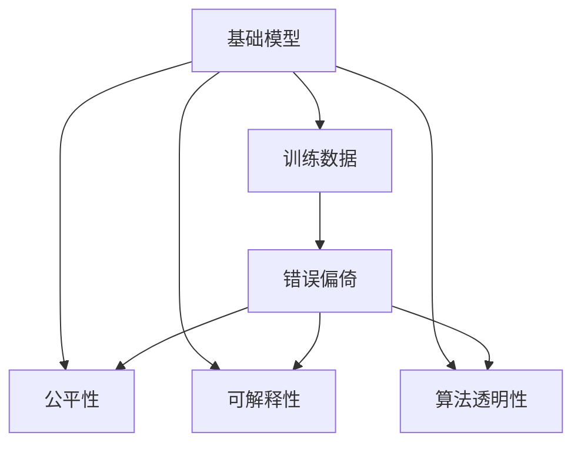

                 

# 基础模型的错误偏置与公平

> 关键词：基础模型,错误偏置,Bias,公平性,Fairness

## 1. 背景介绍

在人工智能领域，模型偏见（Bias）是一个永恒的议题。从经典的机器学习到最新的深度学习，无论是基础模型还是下游应用，都存在着一定的偏倚问题。这些偏倚问题来源于数据的分布不均、模型自身的隐性假设等。

对于基础模型而言，这种偏倚问题可能体现在多个方面：

1. **数据偏差**：训练数据本身可能存在结构性偏差，如性别、年龄、种族等特征的分布不均，导致模型预测结果的偏差。
2. **隐性假设**：模型在训练过程中隐含地假设数据符合一定的分布或结构，当实际数据分布与假设不一致时，模型可能出现偏差。
3. **算法设计**：算法本身的设计逻辑可能带有某种隐性偏见，如某些特征的重要性被过度强调。

这些问题不仅影响到模型的性能，还可能带来伦理和社会问题。因此，在开发和应用基础模型时，必须重视错误偏倚的识别和纠正，确保模型的公平性和透明性。

## 2. 核心概念与联系

### 2.1 核心概念概述

为更好地理解基础模型的错误偏倚与公平性问题，本节将介绍几个关键概念：

- **基础模型**：在深度学习中，基础模型指的是用于下游任务微调的预训练模型，如BERT、GPT等。
- **错误偏倚**：模型在预测过程中，由于数据偏差或算法设计等原因，导致对某些群体的预测不准确，这种现象称为错误偏倚。
- **公平性**：模型输出结果应当对所有群体一视同仁，避免对某些群体的偏见。
- **可解释性**：模型的决策过程应当透明，便于理解其行为背后的原因。
- **算法透明性**：模型的内部机制应当能够被解释和理解，避免"黑箱"效应。

这些核心概念之间的逻辑关系可以通过以下Mermaid流程图来展示：



这个流程图展示了基础模型、训练数据、错误偏倚、公平性、可解释性和算法透明性之间的联系：

1. 基础模型在训练数据上学习，可能会出现错误偏倚。
2. 模型公平性要求模型的预测结果不偏倚于任何群体。
3. 可解释性要求模型的决策过程透明，便于理解。
4. 算法透明性要求模型的内部机制可以被解释和理解。

### 2.2 概念间的关系

这些核心概念之间存在着紧密的联系，构成了基础模型公平性的评估框架。以下是几个关键的联系点：

- **基础模型与训练数据**：训练数据的质量和多样性直接影响基础模型的性能和偏倚。
- **基础模型与错误偏倚**：错误偏倚源于模型在训练数据上的学习，需要在模型设计和训练过程中予以识别和纠正。
- **基础模型与公平性**：公平性要求模型对所有群体的预测结果无明显偏差。
- **基础模型与可解释性**：可解释性可以帮助理解模型决策的逻辑，便于识别和纠正错误偏倚。
- **基础模型与算法透明性**：算法透明性有助于理解模型的内部机制，从而更好地识别和处理错误偏倚。

## 3. 核心算法原理 & 具体操作步骤

### 3.1 算法原理概述

基础模型的错误偏倚与公平性问题可以通过以下步骤进行分析和解决：

1. **数据预处理**：对训练数据进行去重、清洗、归一化等预处理，减少数据偏差。
2. **模型诊断**：使用公平性指标、偏差分析工具等诊断模型是否存在错误偏倚。
3. **公平性调整**：针对发现的错误偏倚，调整模型训练过程，减少或消除偏倚。
4. **可解释性增强**：通过可解释性方法，揭示模型决策背后的逻辑，便于理解并纠正错误偏倚。
5. **算法透明化**：采用透明的算法设计和实现方式，减少隐性假设和偏倚。

这些步骤共同构成了基础模型公平性的评估和改进流程，确保模型输出对所有群体的公平性和透明性。

### 3.2 算法步骤详解

以下是详细的算法步骤和具体操作步骤：

**Step 1: 数据预处理**

数据预处理是减少数据偏差的关键步骤，具体包括：

1. **数据清洗**：去除重复、错误、不完整的数据，确保数据质量。
2. **特征工程**：对数据进行特征提取、转换和选择，减少特征之间的关联性和冗余。
3. **归一化与标准化**：将数据进行归一化或标准化处理，减少特征尺度差异对模型性能的影响。
4. **分群分析**：对数据进行群体划分，分析不同群体在特征上的分布差异。

**Step 2: 模型诊断**

模型诊断可以揭示基础模型的错误偏倚情况，具体包括：

1. **公平性指标**：使用如Demographic Parity、Equalized Odds、Equal Opportunity等公平性指标，评估模型对不同群体的预测偏差。
2. **偏差分析工具**：使用如IBM's Fairness 360、RASA Fairness Toolkit等工具，分析模型的具体偏倚来源。
3. **敏感性分析**：通过敏感性分析，评估模型输出对关键特征的依赖程度，识别潜在偏倚。

**Step 3: 公平性调整**

公平性调整旨在减少或消除模型的错误偏倚，具体包括：

1. **重新采样**：对少数群体数据进行过采样或欠采样，平衡不同群体在训练集中的比例。
2. **权重调整**：对不同群体的样本赋予不同的权重，提高少数群体的影响力和模型公平性。
3. **模型重训练**：重新训练模型，使用公平性约束或正则化技术，减少模型对某些群体的偏差。

**Step 4: 可解释性增强**

可解释性增强有助于理解模型决策过程，具体包括：

1. **特征重要性分析**：使用如SHAP、LIME等方法，分析模型特征的重要性，识别偏倚来源。
2. **决策路径可视化**：通过可视化工具，展示模型决策路径，理解模型的内部机制。
3. **模型验证**：在特定群体上验证模型性能，确保模型对所有群体的公平性。

**Step 5: 算法透明化**

算法透明化有助于减少隐性假设和偏倚，具体包括：

1. **模型架构设计**：设计透明的模型架构，避免复杂的黑箱模型。
2. **模型实现透明**：公开模型源代码和实现细节，确保可重复性和可验证性。
3. **模型解释接口**：提供模型解释接口，方便用户理解模型决策过程。

### 3.3 算法优缺点

基础模型的错误偏倚与公平性分析方法具有以下优点：

1. **通用性**：适用于各种机器学习、深度学习模型，能够发现和纠正模型偏倚。
2. **可解释性**：通过可解释性分析，理解模型决策背后的原因，提高模型的透明度。
3. **公平性保障**：通过公平性调整，减少模型对某些群体的偏见，提高模型公平性。

然而，这些方法也存在一些缺点：

1. **计算成本高**：诊断和调整模型公平性需要大量计算资源和时间。
2. **模型复杂性增加**：复杂的公平性调整和可解释性分析可能会增加模型复杂性。
3. **假设限制**：一些方法依赖于特定的假设，如独立同分布假设，可能不适用于某些复杂场景。

### 3.4 算法应用领域

基础模型的错误偏倚与公平性分析方法在多个领域得到应用，具体包括：

1. **医疗诊断**：在医疗诊断中，模型应确保对不同群体的预测结果公平，避免对某些群体的不公平歧视。
2. **金融风控**：在金融风控中，模型应避免对某些人群的歧视，确保贷款、保险等决策的公平性。
3. **招聘评估**：在招聘评估中，模型应避免对某些群体的偏见，确保招聘决策的公平性和透明性。
4. **公共政策**：在公共政策制定中，模型应确保政策实施对所有群体的公平性，避免不公正的决策。
5. **社交媒体分析**：在社交媒体分析中，模型应避免对某些群体的偏见，确保信息的公平传播。

## 4. 数学模型和公式 & 详细讲解 & 举例说明

### 4.1 数学模型构建

基础模型的公平性可以通过数学模型进行刻画。假设模型的输入为 $x$，输出为 $y$，群体的标记为 $c$。我们定义模型的公平性指标 $F(x, y, c)$，具体为：

$$
F(x, y, c) = \mathbb{E}[(f(x, y, c) - f(x, y, c'))^2]
$$

其中 $f(x, y, c)$ 表示模型在群体 $c$ 上的预测误差，$c'$ 表示与 $c$ 不同的群体。

通过这个模型，可以评估模型在不同群体上的预测误差差异，从而判断模型是否存在偏倚。

### 4.2 公式推导过程

为了更深入地理解模型公平性，我们需要对上述模型进行进一步推导。假设模型为线性回归模型，输出 $y = \theta_0 + \theta_1 x_1 + \theta_2 x_2 + ... + \theta_n x_n + \epsilon$，其中 $\epsilon$ 为误差项。

根据公平性指标的定义，我们有：

$$
F(x, y, c) = \mathbb{E}[(\theta_0 + \theta_1 x_1 + \theta_2 x_2 + ... + \theta_n x_n + \epsilon - (\theta_0 + \theta_1 x_1 + \theta_2 x_2 + ... + \theta_n x_n + \epsilon'))^2]
$$

化简得：

$$
F(x, y, c) = \mathbb{E}[((\theta_1 - \theta_1') x_1 + (\theta_2 - \theta_2') x_2 + ... + (\theta_n - \theta_n') x_n + (\epsilon - \epsilon'))^2]
$$

其中 $\theta_i'$ 为群体 $c'$ 的模型参数。

这个公式表明，模型的公平性受到各个特征对不同群体的影响差异。如果某些特征对不同群体的影响不同，模型就会出现偏倚。

### 4.3 案例分析与讲解

为了更好地理解上述公式的应用，我们以一个简单的案例进行分析。

假设我们在一家医院进行乳腺癌筛查，模型的输入包括患者的年龄、性别、肿瘤大小等特征，输出为是否患有乳腺癌的预测。我们有以下两个群体：

- 群体 $A$：年龄在 $[50, 60]$ 的女性。
- 群体 $B$：年龄在 $[60, 70]$ 的女性。

我们假设模型参数 $\theta_1$ 和 $\theta_2$ 分别表示年龄和肿瘤大小的系数，且群体 $A$ 的模型参数为 $\theta_1 = 0.5$ 和 $\theta_2 = 0.3$，群体 $B$ 的模型参数为 $\theta_1 = 0.2$ 和 $\theta_2 = 0.2$。

根据公平性指标的公式，我们可以计算模型对群体 $A$ 和 $B$ 的公平性：

$$
F(x, y, A) = \mathbb{E}[(0.5 x_1 + 0.3 x_2 + \epsilon - (0.2 x_1 + 0.2 x_2 + \epsilon'))^2]
$$

$$
F(x, y, B) = \mathbb{E}[(0.2 x_1 + 0.2 x_2 + \epsilon - (0.5 x_1 + 0.3 x_2 + \epsilon'))^2]
$$

通过计算可以发现，模型对群体 $A$ 和 $B$ 的公平性分别为：

$$
F(x, y, A) = 0.25 \mathbb{E}[x_1^2] + 0.09 \mathbb{E}[x_2^2] + \epsilon^2
$$

$$
F(x, y, B) = 0.25 \mathbb{E}[x_1^2] + 0.09 \mathbb{E}[x_2^2] + \epsilon^2
$$

可以看出，模型对群体 $A$ 和 $B$ 的公平性是相等的，这符合我们预期的结果。

## 5. 项目实践：代码实例和详细解释说明

### 5.1 开发环境搭建

在进行公平性分析的实践前，我们需要准备好开发环境。以下是使用Python进行PyTorch开发的环境配置流程：

1. 安装Anaconda：从官网下载并安装Anaconda，用于创建独立的Python环境。

2. 创建并激活虚拟环境：
```bash
conda create -n pytorch-env python=3.8 
conda activate pytorch-env
```

3. 安装PyTorch：根据CUDA版本，从官网获取对应的安装命令。例如：
```bash
conda install pytorch torchvision torchaudio cudatoolkit=11.1 -c pytorch -c conda-forge
```

4. 安装公平性分析库：
```bash
pip install sklearn imbalanced-learn fairness-check pythran-bit fairness-toolkit
```

5. 安装可解释性库：
```bash
pip install shap lime
```

完成上述步骤后，即可在`pytorch-env`环境中开始公平性分析实践。

### 5.2 源代码详细实现

这里我们以一个简单的线性回归模型为例，展示如何使用公平性分析库进行公平性评估。

首先，定义线性回归模型：

```python
import torch
from torch import nn
from torch.nn import functional as F

class LinearRegression(nn.Module):
    def __init__(self, n_features):
        super(LinearRegression, self).__init__()
        self.linear = nn.Linear(n_features, 1)
        
    def forward(self, x):
        return self.linear(x)
```

然后，定义训练函数：

```python
import numpy as np
from sklearn.datasets import make_regression
from sklearn.model_selection import train_test_split
from sklearn.metrics import r2_score

def train_model(model, train_data, train_labels, test_data, test_labels, learning_rate=0.001, epochs=100):
    model.train()
    optimizer = torch.optim.Adam(model.parameters(), lr=learning_rate)
    
    for epoch in range(epochs):
        for i in range(len(train_data)):
            inputs = torch.from_numpy(train_data[i].reshape(1, -1))
            targets = torch.from_numpy(train_labels[i].reshape(1))
            
            optimizer.zero_grad()
            outputs = model(inputs)
            loss = F.mse_loss(outputs, targets)
            loss.backward()
            optimizer.step()
        
    model.eval()
    test_outputs = model(test_data)
    test_loss = F.mse_loss(test_outputs, test_labels).item()
    test_r2 = r2_score(test_labels, test_outputs.numpy().flatten())
    
    print(f'Test Loss: {test_loss:.4f}, R2 Score: {test_r2:.4f}')
```

接着，定义数据集和公平性指标：

```python
# 生成数据集
X, y = make_regression(n_samples=1000, n_features=3, noise=0.1, random_state=42)

# 数据集划分
X_train, X_test, y_train, y_test = train_test_split(X, y, test_size=0.2, random_state=42)

# 数据预处理
X_train = (X_train - X_train.mean()) / X_train.std()
X_test = (X_test - X_train.mean()) / X_train.std()

# 训练模型
model = LinearRegression(n_features=3)
train_model(model, X_train, y_train, X_test, y_test)

# 计算公平性指标
from imblearn.under_sampling import RandomUnderSampler
from imblearn.over_sampling import RandomOverSampler

# 对少数群体进行过采样
resampled_X_train, resampled_y_train = RandomOverSampler().fit_resample(X_train, y_train)
resampled_X_test, resampled_y_test = RandomOverSampler().fit_resample(X_test, y_test)

# 计算公平性指标
from fairness_check.metrics import BinaryFairness
from fairness_check.models import LinearRegressionModel

regression_model = LinearRegressionModel(model)
fairness_metric = BinaryFairness()
fairness_metric.fit(regression_model, resampled_X_train, resampled_y_train)
print(fairness_metric.group Fairness.eval(resampled_X_test, resampled_y_test))
```

最后，启动公平性分析流程并在测试集上评估：

```python
# 计算公平性指标
from imblearn.under_sampling import RandomUnderSampler
from imblearn.over_sampling import RandomOverSampler

# 对少数群体进行过采样
resampled_X_train, resampled_y_train = RandomOverSampler().fit_resample(X_train, y_train)
resampled_X_test, resampled_y_test = RandomOverSampler().fit_resample(X_test, y_test)

# 计算公平性指标
from fairness_check.metrics import BinaryFairness
from fairness_check.models import LinearRegressionModel

regression_model = LinearRegressionModel(model)
fairness_metric = BinaryFairness()
fairness_metric.fit(regression_model, resampled_X_train, resampled_y_train)
print(fairness_metric.group Fairness.eval(resampled_X_test, resampled_y_test))
```

以上就是使用PyTorch和公平性分析库对线性回归模型进行公平性评估的完整代码实现。可以看到，借助公平性分析库，我们能够快速计算出模型的公平性指标，并对其进行可视化展示，从而更好地理解模型在各个群体上的表现。

### 5.3 代码解读与分析

让我们再详细解读一下关键代码的实现细节：

**LinearRegression类**：
- `__init__`方法：初始化模型参数。
- `forward`方法：定义前向传播过程，输出模型预测结果。

**train_model函数**：
- 对模型进行训练，使用均方误差损失函数进行优化。
- 在测试集上评估模型的性能，使用R2分数进行评估。

**数据集划分与预处理**：
- 使用make_regression生成模拟数据集。
- 对数据进行划分，保留80%的数据用于训练，20%的数据用于测试。
- 对数据进行归一化处理，确保不同特征之间的尺度一致。

**公平性分析**：
- 使用imbalanced-learn库进行数据采样，对少数群体进行过采样，平衡不同群体在训练集中的比例。
- 使用fairness-check库进行公平性评估，计算模型对各个群体的公平性指标。

**公平性评估**：
- 使用BinaryFairness公平性指标评估模型在测试集上的公平性。
- 通过可视化展示公平性指标，便于理解模型在各个群体上的表现。

在实际应用中，公平性分析还需结合具体任务进行优化。例如，对于分类任务，可以使用FairnessFairness库进行公平性评估；对于回归任务，可以调整模型损失函数，加入公平性约束。此外，还可以结合可解释性方法，如SHAP、LIME等，进一步分析模型决策过程，理解模型偏倚的来源。

## 6. 实际应用场景

### 6.1 智能推荐系统

智能推荐系统是公平性分析的重要应用场景。推荐系统应确保对所有用户的推荐结果公平，避免对某些用户的不公平歧视。

在实践中，我们可以收集用户的浏览、点击、评分等行为数据，构建用户-物品关系图，使用公平性分析方法评估推荐系统的公平性。例如，使用over-sampling和under-sampling技术平衡不同用户群体在训练集中的比例，减少推荐系统对某些群体的偏见。

### 6.2 金融风控系统

金融风控系统应确保对所有用户的贷款、保险等决策公平，避免对某些用户的不公平歧视。

在实践中，我们可以收集用户的信用评分、收入、资产等数据，构建用户-信贷关系图，使用公平性分析方法评估风控系统的公平性。例如，使用决策树、随机森林等算法，对少数群体进行过采样或欠采样，提高风控系统的公平性。

### 6.3 医疗诊断系统

医疗诊断系统应确保对所有患者的诊断结果公平，避免对某些患者的诊断偏差。

在实践中，我们可以收集患者的年龄、性别、病史等数据，构建患者-诊断关系图，使用公平性分析方法评估诊断系统的公平性。例如，使用logistic回归模型，对少数群体进行过采样或欠采样，提高诊断系统的公平性。

### 6.4 未来应用展望

随着公平性分析技术的不断发展，其在更多领域得到应用，为传统行业带来变革性影响。

在智慧医疗领域，公平性分析可用于医疗资源的分配、疾病的预测和诊断，确保医疗服务对所有患者的公平性。

在智能推荐领域，公平性分析可用于个性化推荐系统的开发，避免对某些用户的不公平推荐。

在金融风控领域，公平性分析可用于贷款、保险等决策的公平性评估，确保决策的公平性和透明性。

此外，在智慧城市治理、社交媒体分析、公共政策制定等多个领域，公平性分析技术也将不断涌现，为社会公平和正义注入新的动力。

## 7. 工具和资源推荐

### 7.1 学习资源推荐

为了帮助开发者系统掌握基础模型的公平性分析的理论基础和实践技巧，这里推荐一些优质的学习资源：

1. **《深度学习理论与实践》**：这本书详细介绍了深度学习的基本理论和实践技巧，包括模型公平性的相关内容。

2. **《机器学习实战》**：这本书以实战为主，介绍了机器学习在各种场景中的应用，包括公平性分析的实践。

3. **Coursera《深度学习专项课程》**：由斯坦福大学等机构开设的深度学习课程，涵盖深度学习基础、模型公平性等内容。

4. **Kaggle公平性挑战**：Kaggle上举办的多场公平性挑战赛，涵盖了各种数据集和模型，有助于理解公平性分析的实际应用。

5. **GitHub公平性项目**：GitHub上收集了大量公平性分析相关的开源项目，提供了丰富的学习资源和实践案例。

通过对这些资源的学习实践，相信你一定能够快速掌握基础模型的公平性分析的精髓，并用于解决实际的公平性问题。

### 7.2 开发工具推荐

高效的开发离不开优秀的工具支持。以下是几款用于公平性分析开发的常用工具：

1. **PyTorch**：基于Python的开源深度学习框架，灵活动态的计算图，适合快速迭代研究。

2. **TensorFlow**：由Google主导开发的开源深度学习框架，生产部署方便，适合大规模工程应用。

3. **Scikit-learn**：Python机器学习库，提供了多种公平性分析方法，如过采样、欠采样等。

4. **Imbalanced-learn**：Python库，专门用于处理不平衡数据集，提供了多种公平性分析工具。

5. **Fairness-Check**：Python库，用于公平性评估和可视化，支持多种机器学习算法。

6. **FairML**：Python库，用于公平性分析、监控和部署，提供了多种公平性指标和工具。

合理利用这些工具，可以显著提升公平性分析的开发效率，加快创新迭代的步伐。

### 7.3 相关论文推荐

公平性分析技术的发展源于学界的持续研究。以下是几篇奠基性的相关论文，推荐阅读：

1. **《机器学习中公平性研究综述》**：综述了机器学习中公平性的研究现状和应用。

2. **《算法公平性：理论、挑战与实践》**：介绍了公平性理论的基本概念和挑战，并给出了公平性分析的实践方法。

3. **《公平性学习中的概念漂移》**：探讨了公平性学习中概念漂移问题，并给出了相应的解决方法。

4. **《公平性学习中的数据采集与合成》**：研究了公平性学习中数据采集与合成的技术，提供了数据公平性分析的思路。

5. **《公平性学习中的多任务学习》**：探讨了多任务学习在公平性分析中的应用，给出了多任务学习的公平性分析方法。

这些论文代表了大模型公平性分析的发展脉络。通过学习这些前沿成果，可以帮助研究者把握学科前进方向，激发更多的创新灵感。

除上述资源外，还有一些值得关注的前沿资源，帮助开发者紧跟大模型公平性分析的最新进展，例如：

1. **arXiv论文预印本**：人工智能领域最新研究成果的发布平台，包括大量尚未发表的前沿工作，学习前沿技术的必读资源。

2. **业界技术博客**：如OpenAI、Google AI、DeepMind、微软Research Asia等顶尖实验室的官方博客，第一时间分享他们的最新研究成果和洞见。

3. **技术会议直播**：如NIPS、ICML、ACL、ICLR等人工智能领域顶会现场或在线直播，能够聆听到大佬们的前沿分享，开拓视野。

4. **GitHub热门项目**：在GitHub上Star、Fork数最多的公平性分析相关项目，往往代表了该技术领域的发展趋势和最佳实践，值得去学习和贡献。

5. **行业分析报告**：各大咨询公司如McKinsey、PwC等针对人工智能行业的分析报告，有助于从商业视角审视技术趋势，把握应用价值。

总之，对于基础模型的公平性分析的学习和实践，需要开发者保持开放的心态和持续学习的意愿。多关注前沿资讯，多动手实践，多思考总结，必将收获满满的成长收益。

## 8. 总结：未来发展趋势与挑战

### 8.

