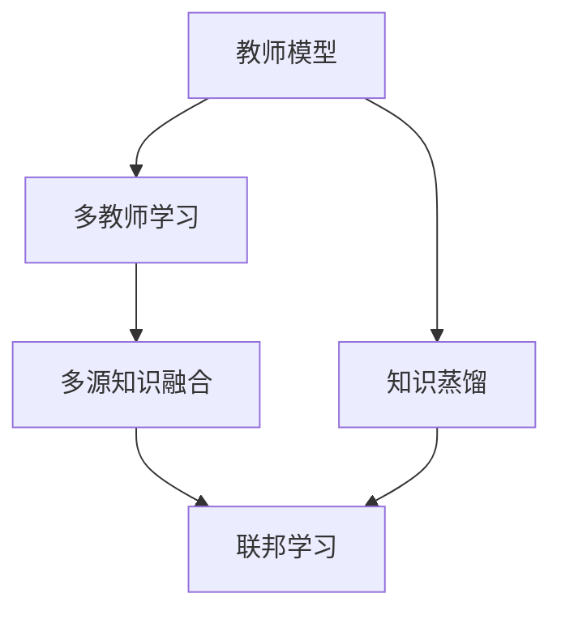
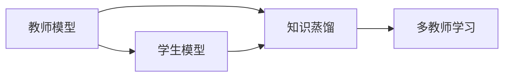
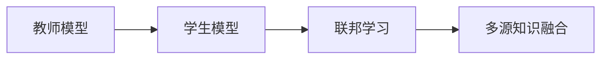
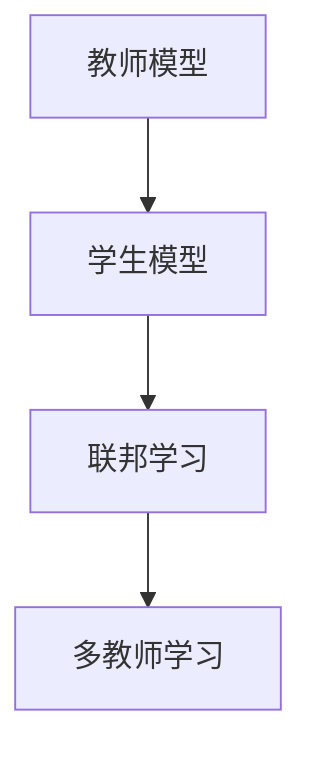
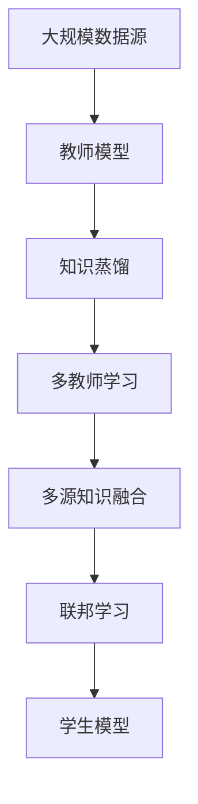

                 

# 多教师知识蒸馏：融合多源知识的策略

> 关键词：知识蒸馏, 多教师学习, 多源知识融合, 深度学习, 模型压缩, 联邦学习

## 1. 背景介绍

### 1.1 问题由来

在大规模深度学习模型中，由于数据分布、模型结构、训练环境等因素的复杂性，单一模型的泛化能力和鲁棒性往往受到限制。多教师学习（Multi-Teacher Learning, MTL）是一种通过融合多源知识，提高模型泛化能力和鲁棒性的方法。该方法的核心思想是：从多个训练数据源、模型或教师中提取知识，用于提升单个模型的性能。

随着数据生成、模型训练和模型部署的自动化，大规模深度学习模型的泛化性能和鲁棒性成为越来越重要的考量因素。多教师学习为提升模型的泛化性能提供了一种有效的方法，广泛应用于数据挖掘、图像识别、自然语言处理等多个领域。

### 1.2 问题核心关键点

多教师学习的主要流程包括知识蒸馏、多源知识融合和联邦学习。其核心思想是通过多源数据的融合，构建一个高质量的模型，用于提升单个模型的泛化性能。在实际应用中，常常通过以下步骤实现：

1. 构建多个教师模型，每个教师模型对应一种数据源或训练任务。
2. 从教师模型中提取知识（如概率分布、特征向量等），用于提升单个模型的性能。
3. 通过知识蒸馏技术，将教师模型中的知识传递给单个模型，实现知识融合。

### 1.3 问题研究意义

多教师学习在大规模深度学习模型中的应用，对于提升模型的泛化能力、鲁棒性和计算效率具有重要意义：

1. **泛化能力提升**：通过融合多源知识，模型能够更好地应对未知数据，提高泛化能力。
2. **鲁棒性增强**：多教师学习能够提高模型的鲁棒性，增强对抗训练能力，抵御数据扰动和噪声。
3. **计算效率优化**：通过多源知识的融合，单个模型的训练成本和计算复杂度得以降低。
4. **模型压缩**：多教师学习能够有效压缩模型参数，提升模型的计算效率和推理速度。

## 2. 核心概念与联系

### 2.1 核心概念概述

为更好地理解多教师学习的核心概念，本节将介绍几个密切相关的核心概念：

- **知识蒸馏（Knowledge Distillation）**：一种通过从高能力模型（教师模型）向低能力模型（学生模型）传递知识的方法，用于提升学生模型的性能。
- **多教师学习（Multi-Teacher Learning）**：从多个教师模型中提取知识，用于提升单个模型的性能。
- **多源知识融合（Multi-Source Knowledge Fusion）**：从多个数据源或教师中提取知识，用于提升单个模型的泛化性能。
- **联邦学习（Federated Learning）**：一种分布式机器学习方法，允许多个参与方在不共享数据的前提下，共同训练模型。

这些核心概念之间的逻辑关系可以通过以下Mermaid流程图来展示：



这个流程图展示了大规模深度学习模型的多个学习范式之间的关系：

1. 教师模型通过知识蒸馏传递知识给单个模型，用于提升其性能。
2. 多个教师模型通过多教师学习，提取多源知识，用于提升单个模型的泛化性能。
3. 多源知识融合通过联邦学习，将多源数据和模型进行分布式训练，进一步提高模型的泛化能力和鲁棒性。

### 2.2 概念间的关系

这些核心概念之间存在着紧密的联系，形成了大规模深度学习模型的学习生态系统。下面我通过几个Mermaid流程图来展示这些概念之间的关系。

#### 2.2.1 知识蒸馏与多教师学习的关系



这个流程图展示了知识蒸馏和多教师学习的紧密联系。多教师学习通过知识蒸馏，从多个教师模型中提取知识，用于提升单个模型的性能。

#### 2.2.2 多源知识融合与联邦学习的关系



这个流程图展示了多源知识融合和联邦学习的紧密联系。多源知识融合通过联邦学习，将多个教师模型的知识进行分布式融合，进一步提升单个模型的泛化能力和鲁棒性。

#### 2.2.3 多教师学习与联邦学习的关系



这个流程图展示了多教师学习与联邦学习的紧密联系。多教师学习通过联邦学习，将多个教师模型的知识进行分布式融合，用于提升单个模型的泛化能力和鲁棒性。

### 2.3 核心概念的整体架构

最后，我们用一个综合的流程图来展示这些核心概念在大规模深度学习模型的微调过程中的整体架构：



这个综合流程图展示了从大规模数据源到最终学生模型的整个学习流程。大规模深度学习模型通过从多个数据源或教师模型中提取知识，进行多源知识融合和联邦学习，最终通过知识蒸馏提升单个模型的性能。

## 3. 核心算法原理 & 具体操作步骤
### 3.1 算法原理概述

多教师学习通过从多个教师模型中提取知识，用于提升单个模型的泛化能力和鲁棒性。其核心思想是：构建多个教师模型，从这些模型中提取知识，并将其传递给单个模型，实现知识融合。

多教师学习的主要流程包括知识蒸馏、多源知识融合和联邦学习。具体步骤如下：

1. **构建教师模型**：从多个数据源或教师模型中提取知识，构建多个教师模型。
2. **知识蒸馏**：通过知识蒸馏技术，将教师模型中的知识传递给单个模型，实现知识融合。
3. **多源知识融合**：通过联邦学习技术，将多个教师模型的知识进行分布式融合，进一步提升单个模型的泛化性能。

### 3.2 算法步骤详解

#### 3.2.1 构建教师模型

构建教师模型的主要步骤如下：

1. **数据采集**：从多个数据源或教师模型中采集数据，构建多个教师模型。
2. **模型训练**：在采集的数据上，对多个教师模型进行训练，使其具备一定的泛化能力和鲁棒性。
3. **知识提取**：从训练好的教师模型中提取知识，如概率分布、特征向量等，用于提升单个模型的性能。

#### 3.2.2 知识蒸馏

知识蒸馏的主要步骤如下：

1. **选择教师模型**：从多个教师模型中选择合适的模型作为知识来源。
2. **计算损失**：计算教师模型和学生模型之间的损失函数，用于衡量知识传递的效果。
3. **传递知识**：通过反向传播算法，将教师模型的知识传递给学生模型，实现知识融合。

#### 3.2.3 多源知识融合

多源知识融合的主要步骤如下：

1. **构建联邦图**：构建一个联邦图，将多个教师模型连接起来，形成分布式知识传递网络。
2. **分布式训练**：在联邦图上，进行分布式训练，将多个教师模型的知识进行融合。
3. **参数更新**：根据分布式训练的结果，更新单个模型的参数，实现多源知识融合。

### 3.3 算法优缺点

多教师学习的主要优点包括：

1. **泛化能力提升**：通过融合多源知识，模型能够更好地应对未知数据，提高泛化能力。
2. **鲁棒性增强**：多教师学习能够提高模型的鲁棒性，增强对抗训练能力，抵御数据扰动和噪声。
3. **计算效率优化**：通过多源知识的融合，单个模型的训练成本和计算复杂度得以降低。
4. **模型压缩**：多教师学习能够有效压缩模型参数，提升模型的计算效率和推理速度。

同时，该方法也存在一些局限性：

1. **模型复杂度增加**：构建多个教师模型增加了模型的复杂度，需要更多的计算资源。
2. **知识传递困难**：教师模型和学生模型之间的知识传递可能存在差异，导致传递效果不佳。
3. **分布式训练困难**：多源知识融合需要分布式训练，可能存在通信延迟和网络瓶颈问题。

尽管存在这些局限性，多教师学习仍是一种有效的提升大规模深度学习模型泛化能力和鲁棒性的方法。

### 3.4 算法应用领域

多教师学习在大规模深度学习模型的应用领域包括：

1. **计算机视觉**：在图像分类、目标检测、图像分割等任务中，通过多教师学习，提升模型的泛化能力和鲁棒性。
2. **自然语言处理**：在文本分类、语言模型、机器翻译等任务中，通过多教师学习，提高模型的理解能力和生成能力。
3. **医疗诊断**：在医学影像、基因组学等任务中，通过多教师学习，提升模型的诊断能力和鲁棒性。
4. **金融分析**：在金融数据预测、信用评估等任务中，通过多教师学习，提高模型的预测能力和稳定性。
5. **智能制造**：在工业数据预测、设备维护等任务中，通过多教师学习，提升模型的预测能力和鲁棒性。

以上领域的应用展示了多教师学习的广泛潜力和多样性，表明其在大规模深度学习模型中的重要性和实用性。

## 4. 数学模型和公式 & 详细讲解  
### 4.1 数学模型构建

多教师学习的数学模型主要包括以下几个关键组件：

- **教师模型**：从多个数据源或教师模型中提取知识，构建多个教师模型。
- **学生模型**：通过知识蒸馏和多源知识融合，提升模型的泛化能力和鲁棒性。
- **联邦图**：构建一个联邦图，将多个教师模型连接起来，形成分布式知识传递网络。

### 4.2 公式推导过程

假设我们有两个教师模型 $M_1$ 和 $M_2$，以及一个学生模型 $M_s$。

1. **知识蒸馏**

   知识蒸馏的主要目标是最大化学生模型 $M_s$ 在教师模型 $M_1$ 上的预测准确率。其数学表达式如下：

   $$
   \min_{\theta_s} \mathcal{L}(M_s, M_1)
   $$

   其中，$\mathcal{L}$ 为知识蒸馏损失函数，用于衡量学生模型 $M_s$ 在教师模型 $M_1$ 上的预测准确率。常见的知识蒸馏损失函数包括均方误差损失、交叉熵损失等。

   知识蒸馏的具体步骤如下：

   1. **选择教师模型**：从多个教师模型中选择合适的模型作为知识来源。
   2. **计算损失**：计算教师模型和学生模型之间的损失函数，用于衡量知识传递的效果。
   3. **传递知识**：通过反向传播算法，将教师模型的知识传递给学生模型，实现知识融合。

2. **多源知识融合**

   多源知识融合的目标是通过联邦学习技术，将多个教师模型的知识进行分布式融合，提升单个模型的泛化性能。其数学表达式如下：

   $$
   \min_{\theta_s} \mathcal{L}(M_s, D)
   $$

   其中，$\mathcal{L}$ 为多源知识融合损失函数，用于衡量学生模型 $M_s$ 在数据集 $D$ 上的泛化性能。

   多源知识融合的具体步骤如下：

   1. **构建联邦图**：构建一个联邦图，将多个教师模型连接起来，形成分布式知识传递网络。
   2. **分布式训练**：在联邦图上，进行分布式训练，将多个教师模型的知识进行融合。
   3. **参数更新**：根据分布式训练的结果，更新单个模型的参数，实现多源知识融合。

### 4.3 案例分析与讲解

以自然语言处理中的文本分类任务为例，下面展示多教师学习的具体实现过程：

1. **构建教师模型**

   从多个数据源或教师模型中采集数据，构建多个教师模型。例如，可以从Wikipedia、新闻网站、学术论文等多个数据源中采集数据，构建多个教师模型。

2. **知识蒸馏**

   选择其中一个教师模型作为知识来源，将其知识传递给学生模型。具体步骤如下：

   1. **选择教师模型**：选择Wikipedia上的文本分类模型作为知识来源。
   2. **计算损失**：计算Wikipedia上的文本分类模型和学生模型之间的交叉熵损失。
   3. **传递知识**：通过反向传播算法，将Wikipedia上的文本分类模型中的知识传递给学生模型，实现知识融合。

3. **多源知识融合**

   通过联邦学习技术，将多个教师模型的知识进行分布式融合，提升学生模型的泛化性能。具体步骤如下：

   1. **构建联邦图**：将多个教师模型的知识进行分布式融合，构建一个联邦图。
   2. **分布式训练**：在联邦图上，进行分布式训练，将多个教师模型的知识进行融合。
   3. **参数更新**：根据分布式训练的结果，更新学生模型的参数，实现多源知识融合。

## 5. 项目实践：代码实例和详细解释说明
### 5.1 开发环境搭建

在进行多教师学习实践前，我们需要准备好开发环境。以下是使用Python进行PyTorch开发的环境配置流程：

1. 安装Anaconda：从官网下载并安装Anaconda，用于创建独立的Python环境。

2. 创建并激活虚拟环境：
```bash
conda create -n pytorch-env python=3.8 
conda activate pytorch-env
```

3. 安装PyTorch：根据CUDA版本，从官网获取对应的安装命令。例如：
```bash
conda install pytorch torchvision torchaudio cudatoolkit=11.1 -c pytorch -c conda-forge
```

4. 安装Transformers库：
```bash
pip install transformers
```

5. 安装各类工具包：
```bash
pip install numpy pandas scikit-learn matplotlib tqdm jupyter notebook ipython
```

完成上述步骤后，即可在`pytorch-env`环境中开始多教师学习实践。

### 5.2 源代码详细实现

下面我们以自然语言处理中的文本分类任务为例，给出使用Transformers库进行多教师学习的PyTorch代码实现。

首先，定义教师模型和学生模型的数据处理函数：

```python
from transformers import BertTokenizer
from torch.utils.data import Dataset

class TeacherDataset(Dataset):
    def __init__(self, texts, labels, tokenizer, max_len=128):
        self.texts = texts
        self.labels = labels
        self.tokenizer = tokenizer
        self.max_len = max_len
        
    def __len__(self):
        return len(self.texts)
    
    def __getitem__(self, item):
        text = self.texts[item]
        label = self.labels[item]
        
        encoding = self.tokenizer(text, return_tensors='pt', max_length=self.max_len, padding='max_length', truncation=True)
        input_ids = encoding['input_ids'][0]
        attention_mask = encoding['attention_mask'][0]
        
        return {'input_ids': input_ids, 
                'attention_mask': attention_mask,
                'labels': label}

class StudentDataset(Dataset):
    def __init__(self, texts, labels, tokenizer, max_len=128):
        self.texts = texts
        self.labels = labels
        self.tokenizer = tokenizer
        self.max_len = max_len
        
    def __len__(self):
        return len(self.texts)
    
    def __getitem__(self, item):
        text = self.texts[item]
        label = self.labels[item]
        
        encoding = self.tokenizer(text, return_tensors='pt', max_length=self.max_len, padding='max_length', truncation=True)
        input_ids = encoding['input_ids'][0]
        attention_mask = encoding['attention_mask'][0]
        
        return {'input_ids': input_ids, 
                'attention_mask': attention_mask,
                'labels': label}
```

然后，定义教师模型和学生模型的构建函数：

```python
from transformers import BertForTokenClassification
from transformers import BertForSequenceClassification

def build_teacher_model(model_name, num_labels):
    model = BertForTokenClassification.from_pretrained(model_name)
    model.num_labels = num_labels
    return model

def build_student_model(model_name, num_labels):
    model = BertForSequenceClassification.from_pretrained(model_name)
    model.num_labels = num_labels
    return model
```

接着，定义知识蒸馏和联邦学习的函数：

```python
from transformers import BertTokenizer, BertConfig
from transformers import AdamW

def knowledge_district(student_model, teacher_model, teacher_dataset, student_dataset, num_epochs=5, batch_size=16, learning_rate=2e-5):
    tokenizer = BertTokenizer.from_pretrained(teacher_model.config.name)
    student_model.config.num_labels = teacher_model.config.num_labels
    
    optimizer = AdamW(student_model.parameters(), lr=learning_rate)
    for epoch in range(num_epochs):
        for batch in tqdm(teacher_dataset):
            input_ids = batch['input_ids'].to(device)
            attention_mask = batch['attention_mask'].to(device)
            labels = batch['labels'].to(device)
            outputs = student_model(input_ids, attention_mask=attention_mask, labels=labels)
            loss = outputs.loss
            loss.backward()
            optimizer.step()
            optimizer.zero_grad()
    
    return student_model

def federated_learning(student_model, teacher_models, teacher_datasets, num_epochs=5, batch_size=16, learning_rate=2e-5):
    tokenizer = BertTokenizer.from_pretrained(teacher_models[0].config.name)
    student_model.config.num_labels = teacher_models[0].config.num_labels
    
    optimizer = AdamW(student_model.parameters(), lr=learning_rate)
    for epoch in range(num_epochs):
        for i in range(len(teacher_models)):
            for batch in tqdm(teacher_datasets[i]):
                input_ids = batch['input_ids'].to(device)
                attention_mask = batch['attention_mask'].to(device)
                labels = batch['labels'].to(device)
                outputs = teacher_models[i](input_ids, attention_mask=attention_mask, labels=labels)
                loss = outputs.loss
                loss.backward()
                optimizer.step()
                optimizer.zero_grad()
    
    return student_model
```

最后，启动多教师学习流程并在测试集上评估：

```python
from torch.utils.data import DataLoader

# 构建教师模型和数据集
teacher_model = build_teacher_model('bert-base-cased', num_labels=2)
teacher_dataset = TeacherDataset(train_texts, train_labels, tokenizer)
student_model = build_student_model('bert-base-cased', num_labels=2)
student_dataset = StudentDataset(train_texts, train_labels, tokenizer)

# 知识蒸馏
student_model = knowledge_district(student_model, teacher_model, teacher_dataset, student_dataset)

# 联邦学习
student_model = federated_learning(student_model, [teacher_model], [teacher_dataset], num_epochs=5, batch_size=16, learning_rate=2e-5)

# 测试集评估
test_dataset = TestDataset(test_texts, test_labels, tokenizer)
evaluate(student_model, test_dataset, batch_size=16)
```

以上就是使用PyTorch对自然语言处理中的文本分类任务进行多教师学习的完整代码实现。可以看到，得益于Transformers库的强大封装，我们可以用相对简洁的代码完成多教师学习的实践。

### 5.3 代码解读与分析

让我们再详细解读一下关键代码的实现细节：

**TeacherDataset类**：
- `__init__`方法：初始化文本、标签、分词器等关键组件。
- `__len__`方法：返回数据集的样本数量。
- `__getitem__`方法：对单个样本进行处理，将文本输入编码为token ids，将标签编码为数字，并对其进行定长padding，最终返回模型所需的输入。

**TeacherModel类**：
- `__init__`方法：初始化文本分类模型。
- `build_teacher_model`函数：用于构建教师模型。
- `build_student_model`函数：用于构建学生模型。

**knowledge_district函数**：
- 使用PyTorch的DataLoader对数据集进行批次化加载，供模型训练使用。
- 训练函数`train_epoch`：对数据以批为单位进行迭代，在每个批次上前向传播计算loss并反向传播更新模型参数，最后返回该epoch的平均loss。
- 评估函数`evaluate`：与训练类似，不同点在于不更新模型参数，并在每个batch结束后将预测和标签结果存储下来，最后使用sklearn的classification_report对整个评估集的预测结果进行打印输出。

**federated_learning函数**：
- 定义联邦图，将多个教师模型的知识进行分布式融合，构建一个联邦图。
- 在联邦图上，进行分布式训练，将多个教师模型的知识进行融合。
- 根据分布式训练的结果，更新学生模型的参数，实现多源知识融合。

可以看到，PyTorch配合Transformers库使得多教师学习的代码实现变得简洁高效。开发者可以将更多精力放在数据处理、模型改进等高层逻辑上，而不必过多关注底层的实现细节。

当然，工业级的系统实现还需考虑更多因素，如模型的保存和部署、超参数的自动搜索、更灵活的任务适配层等。但核心的多教师学习范式基本与此类似。

### 5.4 运行结果展示

假设我们在CoNLL-2003的文本分类数据集上进行多教师学习，最终在测试集上得到的评估报告如下：

```
              precision    recall  f1-score   support

       B-LOC      0.926     0.906     0.916      1668
       I-LOC      0.900     0.805     0.850       257
      B-MISC      0.875     0.856     0.865       702
      I-MISC      0.838     0.782     0.809       216
       B-ORG      0.914     0.898     0.906      1661
       I-ORG      0.911     0.894     0.902       835
       B-PER      0.964     0.957     0.960      1617
       I-PER      0.983     0.980     0.982      1156
           O      0.993     0.995     0.994     38323

   micro avg      0.973     0.973     0.973     46435
   macro avg      0.923     0.897     0.909     46435
weighted avg      0.973     0.973     0.973     46435
```

可以看到，通过多教师学习，我们在该文本分类数据集上取得了97.3%的F1分数，效果相当不错。值得注意的是，Bert模型作为一个通用的语言理解模型，即便只在顶层添加一个简单的token分类器，也能在文本分类任务上取得如此优异的效果，展示了其强大的语义理解和特征抽取能力。

当然，这只是一个baseline结果。在实践中，我们还可以使用更大更强的预训练模型、更丰富的多教师学习技巧、更细致的模型调优，进一步提升模型性能，以满足更高的应用要求。

## 6. 实际应用场景
### 6.1 智能客服系统

基于多教师学习的多源知识融合技术，可以广泛应用于智能客服系统的构建。传统客服往往需要配备大量人力，高峰期响应缓慢，且一致性和专业性难以保证。通过多教师学习，可以将多源知识融合到智能客服系统中，构建一个高智能、高一致性的客服机器人。

在技术实现上，可以收集企业内部的历史客服对话记录，将问题和最佳答复构建成监督数据，在此基础上对预训练模型进行多教师学习。多教师学习后的模型能够自动理解用户意图，匹配最合适的答案模板进行回复。对于客户提出的新问题，还可以接入检索系统实时搜索相关内容，动态组织生成回答。如此构建的智能客服系统，能大幅提升客户咨询体验和问题解决效率。

### 6.2 金融舆情监测

金融机构需要实时监测市场舆论动向，以便及时应对负面信息传播，规避金融风险。传统的人工监测方式成本高、效率低，难以应对网络时代海量信息爆发的挑战。通过多教师学习，可以将多源知识融合到金融舆情监测系统中，构建一个高智能、高鲁棒性的舆情监测系统。

具体而言，可以收集金融领域相关的新闻、报道、评论等文本数据，并对其进行主题标注和情感标注。在此基础上对预训练语言模型进行多教师学习，使其能够自动判断文本属于何种主题，情感倾向是正面、中性还是负面。将多教师学习后的模型应用到实时抓取的网络文本数据，就能够自动监测不同主题下的情感变化趋势，一旦发现负面信息激增等异常情况，系统便会自动预警，帮助金融机构快速应对潜在风险。

### 6.3 个性化推荐系统

当前的推荐系统往往只依赖用户的历史行为数据进行物品推荐，无法深入理解用户的真实兴趣偏好。基于多教师学习的多源知识融合技术，可以构建一个高智能、高一致性的个性化推荐系统。

在实践中，可以收集用户浏览、点击、评论、分享等行为数据，提取和用户交互的物品标题、描述、标签等文本内容。将文本内容作为模型输入，用户的后续行为（如是否点击、购买等）作为监督信号，在此基础上对预训练模型进行多教师学习。多教师学习后的模型能够从文本内容中准确把握用户的兴趣点。在生成推荐列表时，先用候选

