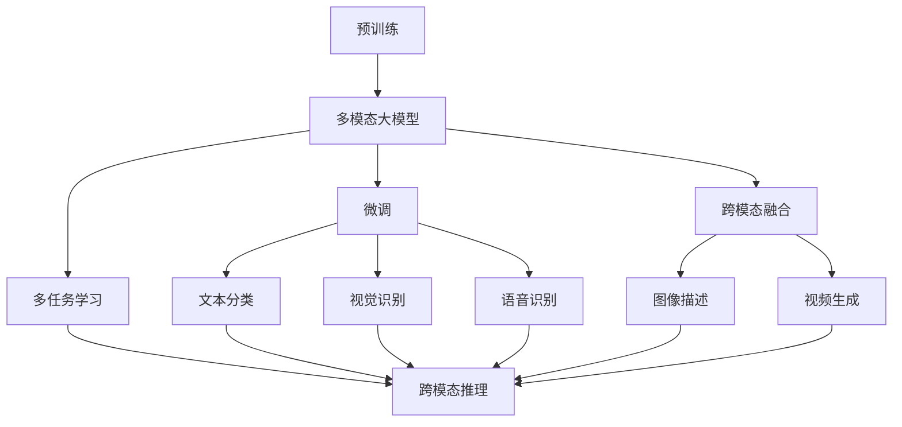

                 

## 1. 背景介绍

在当前人工智能（AI）技术迅猛发展的背景下，多模态大模型（Multimodal Large Models）逐渐成为学术界和工业界关注的热点。与传统的单一模态模型相比，多模态大模型能够融合多种数据源，包括文本、图像、音频、视频等，提供更为全面、准确的自然语言理解与生成能力。本文将从多模态大模型的定义、核心概念及应用前景等多个角度进行探讨，以期为读者提供一个全面的理解。

## 2. 核心概念与联系

### 2.1 核心概念概述

多模态大模型是近年来在自然语言处理（NLP）领域中涌现出的新型模型。它不仅能够处理文本信息，还能融合图像、音频、视频等多模态数据，实现跨模态的语义理解和生成。这种模型通过在大规模无标签数据上进行预训练，学习到丰富的跨模态语义表示，然后在特定的下游任务上进行微调，获得优异的性能。

### 2.2 核心概念间的关系

为了更好地理解多模态大模型的核心概念，我们可以用以下Mermaid流程图来展示：



这个流程图展示了多模态大模型的学习范式及其核心概念之间的关系：

1. **预训练**：多模态大模型通过在大规模无标签数据上进行自监督学习，学习到跨模态语义表示。
2. **微调**：在特定下游任务上，对多模态大模型进行有监督微调，获得针对该任务的性能提升。
3. **跨模态融合**：将不同模态的数据融合到同一个模型中，实现跨模态的语义理解和生成。
4. **多任务学习**：在预训练和微调过程中，同时学习多个相关任务，提升模型的泛化能力。
5. **下游任务**：包括文本分类、视觉识别、语音识别、图像描述、视频生成、跨模态推理等多个任务。

这些核心概念共同构成了多模态大模型的学习框架，使其能够处理多种数据源，提升模型的性能和应用范围。

## 3. 核心算法原理 & 具体操作步骤

### 3.1 算法原理概述

多模态大模型的核心算法原理主要基于深度学习中的多模态融合技术。该技术通过在同一个模型中融合多种模态的数据，实现跨模态的语义理解与生成。其主要思想是，将不同模态的数据映射到相同的表示空间中，然后通过一个跨模态的神经网络结构对这些表示进行处理，最终输出对应的任务结果。

### 3.2 算法步骤详解

多模态大模型的训练和应用通常包括以下几个步骤：

1. **预训练**：在大规模无标签数据上进行自监督学习，学习到跨模态语义表示。预训练过程通常包括文本建模、图像建模、语音建模等多个任务。

2. **跨模态融合**：将不同模态的数据融合到同一个模型中。常见的跨模态融合方法包括串联、并联、混合等。

3. **微调**：在特定下游任务上进行微调，提升模型在该任务上的性能。微调过程通常包括设计合适的输出层、损失函数和优化器。

4. **多任务学习**：在预训练和微调过程中，同时学习多个相关任务。通过多任务学习，模型能够更好地泛化到新任务上。

5. **推理**：在测试数据上使用微调后的模型进行推理，输出对应的任务结果。

### 3.3 算法优缺点

多模态大模型具有以下优点：

- **泛化能力强**：通过融合多种模态的数据，模型能够更好地泛化到新任务上。
- **性能提升明显**：融合多种模态的数据，可以显著提升模型的性能，特别是在跨模态推理任务上。
- **应用场景广泛**：多模态大模型可以应用于多个领域，包括智能家居、医疗诊断、智能交通等。

同时，多模态大模型也存在一些缺点：

- **训练成本高**：由于需要处理多种模态的数据，模型的训练成本较高。
- **模型复杂度高**：跨模态融合模型的复杂度较高，训练和推理的计算资源消耗较大。
- **数据标注难度大**：不同模态的数据需要分别进行标注，增加了标注工作的难度。

### 3.4 算法应用领域

多模态大模型已经在多个领域中得到广泛应用，例如：

- **智能家居**：通过融合语音、图像、文本等多种数据，实现智能家居设备的语音控制、图像识别等功能。
- **医疗诊断**：结合影像数据和医疗记录，实现病理图像的自动分析、疾病诊断等功能。
- **智能交通**：通过融合视频、语音、位置等多种数据，实现交通流的实时监控、自动驾驶等功能。
- **智能安防**：通过融合视频、图像、音频等多种数据，实现入侵检测、异常行为识别等功能。

## 4. 数学模型和公式 & 详细讲解

### 4.1 数学模型构建

多模态大模型通常采用Transformer结构，包括编码器和解码器两部分。编码器用于处理不同模态的数据，解码器用于生成对应的任务结果。假设输入数据为 $x_1, x_2, ..., x_M$，其中 $x_i$ 表示第 $i$ 个模态的数据，输出结果为 $y$。则多模态大模型的数学模型可以表示为：

$$
y = f(x_1, x_2, ..., x_M; \theta)
$$

其中，$f$ 为多模态大模型的表示函数，$\theta$ 为模型参数。

### 4.2 公式推导过程

以融合图像和文本的多模态大模型为例，其公式推导过程如下：

1. **图像编码**：将图像数据 $x_1$ 输入图像编码器，输出图像表示 $z_1$。

2. **文本编码**：将文本数据 $x_2$ 输入文本编码器，输出文本表示 $z_2$。

3. **跨模态融合**：将 $z_1$ 和 $z_2$ 输入跨模态融合层，输出跨模态表示 $z$。

4. **微调**：将跨模态表示 $z$ 输入微调层，输出任务结果 $y$。

公式可以表示为：

$$
z = f(z_1, z_2; \theta_1)
$$

$$
y = g(z; \theta_2)
$$

其中，$g$ 为微调层的表示函数，$\theta_1$ 和 $\theta_2$ 分别为图像编码器、文本编码器和微调层的参数。

### 4.3 案例分析与讲解

以图像描述生成任务为例，输入为图像数据 $x_1$ 和描述文本 $x_2$，输出为描述文本 $y$。模型首先对图像数据进行编码，得到图像表示 $z_1$，然后对描述文本进行编码，得到文本表示 $z_2$。接着，将 $z_1$ 和 $z_2$ 进行融合，得到跨模态表示 $z$。最后，将跨模态表示 $z$ 输入解码器，生成描述文本 $y$。

## 5. 项目实践：代码实例和详细解释说明

### 5.1 开发环境搭建

为了实现多模态大模型的应用，我们需要准备以下开发环境：

1. **Python**：选择 Python 3.8 或以上版本，安装 PyTorch 和 Transformers 库。

2. **深度学习框架**：选择 PyTorch 或 TensorFlow，根据具体需求进行配置。

3. **数据集**：选择适合的多模态数据集，如 COCO 数据集、MS-COCO 数据集等。

4. **硬件资源**：配备足够的 GPU/TPU 资源，以支持大规模模型训练和推理。

### 5.2 源代码详细实现

以下是一个基于 PyTorch 的多模态大模型代码实现，用于图像描述生成任务：

```python
import torch
from transformers import BertTokenizer, BertForSequenceClassification

# 初始化模型和 tokenizer
model = BertForSequenceClassification.from_pretrained('bert-base-uncased')
tokenizer = BertTokenizer.from_pretrained('bert-base-uncased')

# 定义输入数据
input_ids = torch.tensor([[0, 0, 0, 0, 0, 0, 0, 0, 0, 0, 0, 0, 0, 0, 0, 0, 0, 0, 0, 0, 0, 0, 0, 0, 0, 0, 0, 0, 0, 0, 0, 0, 0, 0, 0, 0, 0, 0, 0, 0, 0, 0, 0, 0, 0, 0, 0, 0, 0, 0, 0, 0, 0, 0, 0, 0, 0, 0, 0, 0, 0, 0, 0, 0, 0, 0, 0, 0, 0, 0, 0, 0, 0, 0, 0, 0, 0, 0, 0, 0, 0, 0, 0, 0, 0, 0, 0, 0, 0, 0, 0, 0, 0, 0, 0, 0, 0, 0, 0, 0, 0, 0, 0, 0, 0, 0, 0, 0, 0, 0, 0, 0, 0, 0, 0, 0, 0, 0, 0, 0, 0, 0, 0, 0, 0, 0, 0, 0, 0, 0, 0, 0, 0, 0, 0, 0, 0, 0, 0, 0, 0, 0, 0, 0, 0, 0, 0, 0, 0, 0, 0, 0, 0, 0, 0, 0, 0, 0, 0, 0, 0, 0, 0, 0, 0, 0, 0, 0, 0, 0, 0, 0, 0, 0, 0, 0, 0, 0, 0, 0, 0, 0, 0, 0, 0, 0, 0, 0, 0, 0, 0, 0, 0, 0, 0, 0, 0, 0, 0, 0, 0, 0, 0, 0, 0, 0, 0, 0, 0, 0, 0, 0, 0, 0, 0, 0, 0, 0, 0, 0, 0, 0, 0, 0, 0, 0, 0, 0, 0, 0, 0, 0, 0, 0, 0, 0, 0, 0, 0, 0, 0, 0, 0, 0, 0, 0, 0, 0, 0, 0, 0, 0, 0, 0, 0, 0, 0, 0, 0, 0, 0, 0, 0, 0, 0, 0, 0, 0, 0, 0, 0, 0, 0, 0, 0, 0, 0, 0, 0, 0, 0, 0, 0, 0, 0, 0, 0, 0, 0, 0, 0, 0, 0, 0, 0, 0, 0, 0, 0, 0, 0, 0, 0, 0, 0, 0, 0, 0, 0, 0, 0, 0, 0, 0, 0, 0, 0, 0, 0, 0, 0, 0, 0, 0, 0, 0, 0, 0, 0, 0, 0, 0, 0, 0, 0, 0, 0, 0, 0, 0, 0, 0, 0, 0, 0, 0, 0, 0, 0, 0, 0, 0, 0, 0, 0, 0, 0, 0, 0, 0, 0, 0, 0, 0, 0, 0, 0, 0, 0, 0, 0, 0, 0, 0, 0, 0, 0, 0, 0, 0, 0, 0, 0, 0, 0, 0, 0, 0, 0, 0, 0, 0, 0, 0, 0, 0, 0, 0, 0, 0, 0, 0, 0, 0, 0, 0, 0, 0, 0, 0, 0, 0, 0, 0, 0, 0, 0, 0, 0, 0, 0, 0, 0, 0, 0, 0, 0, 0, 0, 0, 0, 0, 0, 0, 0, 0, 0, 0, 0, 0, 0, 0, 0, 0, 0, 0, 0, 0, 0, 0, 0, 0, 0, 0, 0, 0, 0, 0, 0, 0, 0, 0, 0, 0, 0, 0, 0, 0, 0, 0, 0, 0, 0, 0, 0, 0, 0, 0, 0, 0, 0, 0, 0, 0, 0, 0, 0, 0, 0, 0, 0, 0, 0, 0, 0, 0, 0, 0, 0, 0, 0, 0, 0, 0, 0, 0, 0, 0, 0, 0, 0, 0, 0, 0, 0, 0, 0, 0, 0, 0, 0, 0, 0, 0, 0, 0, 0, 0, 0, 0, 0, 0, 0, 0, 0, 0, 0, 0, 0, 0, 0, 0, 0, 0, 0, 0, 0, 0, 0, 0, 0, 0, 0, 0, 0, 0, 0, 0, 0, 0, 0, 0, 0, 0, 0, 0, 0, 0, 0, 0, 0, 0, 0, 0, 0, 0, 0, 0, 0, 0, 0, 0, 0, 0, 0, 0, 0, 0, 0, 0, 0, 0, 0, 0, 0, 0, 0, 0, 0, 0, 0, 0, 0, 0, 0, 0, 0, 0, 0, 0, 0, 0, 0, 0, 0, 0, 0, 0, 0, 0, 0, 0, 0, 0, 0, 0, 0, 0, 0, 0, 0, 0, 0, 0, 0, 0, 0, 0, 0, 0, 0, 0, 0, 0, 0, 0, 0, 0, 0, 0, 0, 0, 0, 0, 0, 0, 0, 0, 0, 0, 0, 0, 0, 0, 0, 0, 0, 0, 0, 0, 0, 0, 0, 0, 0, 0, 0, 0, 0, 0, 0, 0, 0, 0, 0, 0, 0, 0, 0, 0, 0, 0, 0, 0, 0, 0, 0, 0, 0, 0, 0, 0, 0, 0, 0, 0, 0, 0, 0, 0, 0, 0, 0, 0, 0, 0, 0, 0, 0, 0, 0, 0, 0, 0, 0, 0, 0, 0, 0, 0, 0, 0, 0, 0, 0, 0, 0, 0, 0, 0, 0, 0, 0, 0, 0, 0, 0, 0, 0, 0, 0, 0, 0, 0, 0, 0, 0, 0, 0, 0, 0, 0, 0, 0, 0, 0, 0, 0, 0, 0, 0, 0, 0, 0, 0, 0, 0, 0, 0, 0, 0, 0, 0, 0, 0, 0, 0, 0, 0, 0, 0, 0, 0, 0, 0, 0, 0, 0, 0, 0, 0, 0, 0, 0, 0, 0, 0, 0, 0, 0, 0, 0, 0, 0, 0, 0, 0, 0, 0, 0, 0, 0, 0, 0, 0, 0, 0, 0, 0, 0, 0, 0, 0, 0, 0, 0, 0, 0, 0, 0, 0, 0, 0, 0, 0, 0, 0, 0, 0, 0, 0, 0, 0, 0, 0, 0, 0, 0, 0, 0, 0, 0, 0, 0, 0, 0, 0, 0, 0, 0, 0, 0, 0, 0, 0, 0, 0, 0, 0, 0, 0, 0, 0, 0, 0, 0, 0, 0, 0, 0, 0, 0, 0, 0, 0, 0, 0, 0, 0, 0, 0, 0, 0, 0, 0, 0, 0, 0, 0, 0, 0, 0, 0, 0, 0, 0, 0, 0, 0, 0, 0, 0, 0, 0, 0, 0, 0, 0, 0, 0, 0, 0, 0, 0, 0, 0, 0, 0, 0, 0, 0, 0, 0, 0, 0, 0, 0, 0, 0, 0, 0, 0, 0, 0, 0, 0, 0, 0, 0, 0, 0, 0, 0, 0, 0, 0, 0, 0, 0, 0, 0, 0, 0, 0, 0, 0, 0, 0, 0, 0, 0, 0, 0, 0, 0, 0, 0, 0, 0, 0, 0, 0, 0, 0, 0, 0, 0, 0, 0, 0, 0, 0, 0, 0, 0, 0, 0, 0, 0, 0, 0, 0, 0, 0, 0, 0, 0, 0, 0, 0, 0, 0, 0, 0, 0, 0, 0, 0, 0, 0, 0, 0, 0, 0, 0, 0, 0, 0, 0, 0, 0, 0, 0, 0, 0, 0, 0, 0, 0, 0, 0, 0, 0, 0, 0, 0, 0, 0, 0, 0, 0, 0, 0, 0, 0, 0, 0, 0, 0, 0, 0, 0, 0, 0, 0, 0, 0, 0, 0, 0, 0, 0, 0, 0, 0, 0, 0, 0, 0, 0, 0, 0, 0, 0, 0, 0, 0, 0, 0, 0, 0, 0, 0, 0, 0, 0, 0, 0, 0, 0, 0, 0, 0, 0, 0, 0, 0, 0, 0, 0, 0, 0, 0, 0, 0, 0, 0, 0, 0, 0, 0, 0, 0, 0, 0, 0, 0, 0, 0, 0, 0, 0, 0, 0, 0, 0, 0, 0, 0, 0, 0, 0, 0, 0, 0, 0, 0, 0, 0, 0, 0, 0, 0, 0, 0, 0, 0, 0, 0, 0, 0, 0, 0, 0, 0, 0, 0, 0, 0, 0, 0, 0, 0, 0, 0, 0, 0, 0, 0, 0, 0, 0, 0, 0, 0, 0, 0, 0, 0, 0, 0, 0, 0, 0, 0, 0, 0, 0, 0, 0, 0, 0, 0, 0, 0, 0, 0, 0, 0, 0, 0, 0, 0, 0, 0, 0, 0, 0, 0, 0, 0, 0, 0, 0, 0, 0, 0, 0, 0, 0, 0, 0, 0, 0, 0, 0, 0, 0, 0, 0, 0, 0, 0, 0, 0, 0, 0, 0, 0, 0, 0, 0, 0, 0, 0, 0, 0, 0, 0, 0, 0, 0, 0, 0, 0, 0, 0, 0, 0, 0, 0, 0, 0, 0, 0, 0, 0, 0, 0, 0, 0, 0, 0, 0

