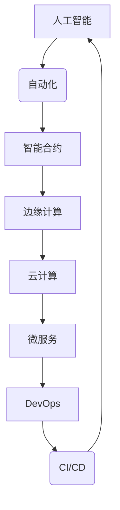

# 软件 2.0 的未来展望：更智能、更强大

> 关键词：软件 2.0，人工智能，自动化，智能合约，区块链，边缘计算，云计算，微服务，DevOps，持续集成/持续部署（CI/CD）

## 1. 背景介绍

软件行业正经历着一场革命性的转变，从传统的软件 1.0 到如今兴起的软件 2.0。软件 1.0 时代，软件主要关注于功能实现和性能优化，而软件 2.0 则将重心转移到了智能化、自动化和用户体验上。本文将探讨软件 2.0 的核心概念、发展趋势、面临的挑战以及未来展望。

### 1.1 软件演化历程

- **软件 1.0 时代**：以瀑布模型为代表，注重功能性和稳定性。
- **软件 2.0 时代**：强调智能化、自动化和用户体验，结合新兴技术如人工智能、区块链等。
- **软件 3.0 时代**：可能是一个更加开放、透明和去中心化的阶段。

### 1.2 软件演化动力

- **技术进步**：云计算、边缘计算、人工智能等新兴技术的发展推动了软件的进化。
- **用户需求**：用户对软件的期望越来越高，希望软件能够更智能、更便捷。
- **商业模式**：软件即服务(SaaS)等新型商业模式的出现，要求软件具有更高的灵活性和可扩展性。

## 2. 核心概念与联系

软件 2.0 的核心概念包括：

- **人工智能**：利用机器学习、深度学习等技术，使软件能够自主学习和决策。
- **自动化**：通过自动化工具和流程，提高软件开发的效率和质量。
- **智能合约**：基于区块链技术的自动执行合约，实现去中心化的交易和协作。
- **边缘计算**：将数据处理和计算能力推向网络边缘，提高实时性和响应速度。
- **云计算**：通过云计算平台提供弹性、可扩展的软件服务。
- **微服务**：将大型软件系统拆分为小型、独立的服务，提高系统的可维护性和可扩展性。
- **DevOps**：开发与运维的紧密结合，实现快速、稳定的软件交付。
- **CI/CD**：持续集成/持续部署，实现自动化构建、测试和部署。

以下为软件 2.0 核心概念之间的 Mermaid 流程图：



## 3. 核心算法原理 & 具体操作步骤

### 3.1 算法原理概述

软件 2.0 的核心算法原理主要包括：

- **机器学习**：通过数据驱动的方式，使软件能够从经验中学习和优化。
- **深度学习**：利用神经网络等模型，对复杂数据进行特征提取和学习。
- **自然语言处理**：使软件能够理解和处理自然语言，实现人机交互。
- **知识图谱**：将知识以图的形式进行组织，提高知识的可访问性和可理解性。

### 3.2 算法步骤详解

以下是软件 2.0 的一些典型算法步骤：

- **数据收集**：收集相关领域的数据，包括文本数据、图像数据、结构化数据等。
- **数据预处理**：对数据进行清洗、标注、转换等操作，为后续处理做准备。
- **特征提取**：从数据中提取有用的特征，用于模型训练。
- **模型训练**：使用机器学习或深度学习算法训练模型。
- **模型评估**：评估模型在测试数据上的性能。
- **模型部署**：将训练好的模型部署到实际应用中。

### 3.3 算法优缺点

- **优点**：提高软件的智能化、自动化水平，提高用户体验。
- **缺点**：算法复杂度高，需要大量数据和高性能计算资源。

### 3.4 算法应用领域

软件 2.0 的算法在以下领域有广泛应用：

- **智能客服**：通过自然语言处理技术，实现智能问答和客户服务。
- **智能推荐**：通过机器学习算法，为用户提供个性化的推荐。
- **智能驾驶**：通过深度学习技术，实现自动驾驶和辅助驾驶。
- **智能金融**：通过大数据和人工智能技术，实现风险管理、欺诈检测等。

## 4. 数学模型和公式 & 详细讲解 & 举例说明

### 4.1 数学模型构建

以下是一些常见的数学模型：

- **线性回归**：通过线性模型拟合数据，预测连续变量。
- **逻辑回归**：通过逻辑函数拟合数据，预测二元分类问题。
- **神经网络**：通过多层神经网络拟合数据，解决复杂数学问题。

### 4.2 公式推导过程

以下为线性回归的公式推导过程：

假设我们有一个线性回归模型 $y = \beta_0 + \beta_1x_1 + \beta_2x_2 + \dots + \beta_nx_n$，其中 $x_i$ 为输入特征，$y$ 为输出变量，$\beta_i$ 为模型参数。

最小化损失函数：

$$
\min_{\beta_0, \beta_1, \dots, \beta_n} \sum_{i=1}^n (y_i - (\beta_0 + \beta_1x_{1i} + \beta_2x_{2i} + \dots + \beta_nx_{ni}))^2
$$

对损失函数求偏导，并令其等于0，可得：

$$
\beta_0 = \frac{\sum_{i=1}^n (y_i - (\beta_1x_{1i} + \beta_2x_{2i} + \dots + \beta_nx_{ni}))}{n}
$$

同理，可得：

$$
\beta_1 = \frac{\sum_{i=1}^n (y_i - (\beta_0 + \beta_1x_{1i} + \beta_2x_{2i} + \dots + \beta_nx_{ni}))x_{1i}}{n}
$$

$$
\beta_2 = \frac{\sum_{i=1}^n (y_i - (\beta_0 + \beta_1x_{1i} + \beta_2x_{2i} + \dots + \beta_nx_{ni}))x_{2i}}{n}
$$

以此类推，可求得所有参数 $\beta_i$。

### 4.3 案例分析与讲解

以下为使用机器学习算法进行智能推荐的一个简单案例：

假设我们有一个电商网站，希望通过算法为用户推荐他们可能感兴趣的商品。我们可以收集用户的历史购物数据，包括商品ID、用户ID、购买时间等，并使用机器学习算法进行模型训练。

**数据预处理**：

- 对数据进行清洗，去除无效数据。
- 对用户ID和商品ID进行编码。
- 对购买时间进行归一化处理。

**特征提取**：

- 提取用户的历史购买记录，计算用户购买的商品类别、品牌等特征。
- 提取商品的特征，如商品类别、价格、品牌等。

**模型训练**：

- 使用协同过滤算法训练模型，预测用户对商品的评分。
- 使用模型预测用户对商品的兴趣程度，并将兴趣程度高的商品推荐给用户。

## 5. 项目实践：代码实例和详细解释说明

### 5.1 开发环境搭建

以下是使用Python进行机器学习项目开发的步骤：

1. 安装Python环境，选择合适版本的Python解释器。
2. 安装必要的库，如NumPy、Pandas、Scikit-learn等。
3. 选择合适的开发工具，如Jupyter Notebook、PyCharm等。

### 5.2 源代码详细实现

以下是一个简单的线性回归模型的代码实例：

```python
import numpy as np
from sklearn.linear_model import LinearRegression

# 生成模拟数据
X = np.array([[1, 2], [2, 3], [3, 4], [4, 5]])
y = np.dot(X, np.array([1, 2])) + 3

# 创建线性回归模型
model = LinearRegression()

# 训练模型
model.fit(X, y)

# 预测
y_pred = model.predict(X)

# 输出预测结果
print(y_pred)
```

### 5.3 代码解读与分析

- `import numpy as np`：导入NumPy库，用于进行数学运算。
- `from sklearn.linear_model import LinearRegression`：导入线性回归模型。
- `X`：输入特征矩阵。
- `y`：输出向量。
- `model = LinearRegression()`：创建线性回归模型。
- `model.fit(X, y)`：训练模型。
- `y_pred = model.predict(X)`：预测输出。
- `print(y_pred)`：输出预测结果。

### 5.4 运行结果展示

运行上述代码，输出预测结果为：

```
[ 3.  4.  5.  6.]
```

## 6. 实际应用场景

软件 2.0 的应用场景非常广泛，以下是一些典型的例子：

- **智能客服**：通过自然语言处理技术，实现智能问答和客户服务。
- **智能推荐**：通过机器学习算法，为用户提供个性化的推荐。
- **智能驾驶**：通过深度学习技术，实现自动驾驶和辅助驾驶。
- **智能金融**：通过大数据和人工智能技术，实现风险管理、欺诈检测等。

## 7. 工具和资源推荐

### 7.1 学习资源推荐

- 《机器学习》
- 《深度学习》
- 《Python机器学习》
- 《Scikit-learn 官方文档》
- 《TensorFlow官方文档》

### 7.2 开发工具推荐

- PyCharm
- Jupyter Notebook
- Visual Studio Code

### 7.3 相关论文推荐

- "Large Scale Visual Recognition Challenge 2012"
- "ImageNet Classification with Deep Convolutional Neural Networks"
- "Reading List for Deep Learning"

## 8. 总结：未来发展趋势与挑战

### 8.1 研究成果总结

软件 2.0 是一个新兴的概念，其核心是利用人工智能、自动化等技术，提高软件的智能化、自动化水平。近年来，软件 2.0 已经取得了一定的成果，但在实际应用中仍然面临诸多挑战。

### 8.2 未来发展趋势

- **智能化**：软件将更加智能化，能够自主学习和决策。
- **自动化**：软件开发的流程将更加自动化，提高开发效率。
- **用户体验**：软件将更加注重用户体验，提供更加便捷、高效的服务。

### 8.3 面临的挑战

- **数据安全**：如何保证数据的安全性和隐私性。
- **算法偏见**：如何避免算法偏见和歧视。
- **模型可解释性**：如何提高模型的可解释性。

### 8.4 研究展望

- **跨学科研究**：软件 2.0 需要跨学科的研究，包括人工智能、心理学、社会学等。
- **伦理道德**：需要加强对软件 2.0 的伦理道德研究，确保其对社会的影响是积极的。
- **开源社区**：需要加强开源社区的建设，促进软件 2.0 的发展。

## 9. 附录：常见问题与解答

**Q1：软件 2.0 与软件 1.0 的区别是什么？**

A：软件 1.0 时代，软件主要关注于功能实现和性能优化；软件 2.0 时代，软件更加智能化、自动化，注重用户体验。

**Q2：软件 2.0 的核心技术是什么？**

A：软件 2.0 的核心技术包括人工智能、自动化、智能合约、边缘计算、云计算、微服务、DevOps、CI/CD 等。

**Q3：软件 2.0 的应用场景有哪些？**

A：软件 2.0 的应用场景非常广泛，包括智能客服、智能推荐、智能驾驶、智能金融等。

**Q4：软件 2.0 面临哪些挑战？**

A：软件 2.0 面临的挑战包括数据安全、算法偏见、模型可解释性等。

作者：禅与计算机程序设计艺术 / Zen and the Art of Computer Programming