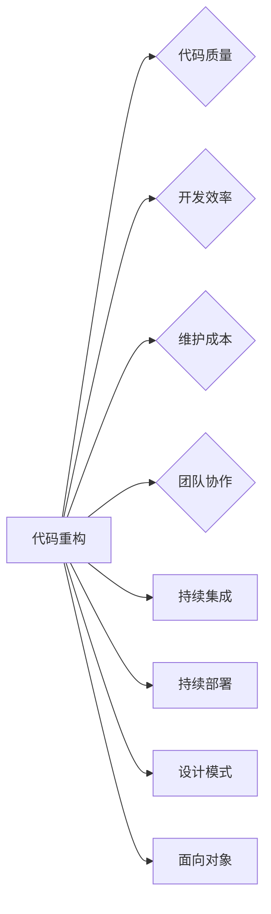

# 软件2.0的代码重构技术

> 关键词：软件2.0，代码重构，敏捷开发，设计模式，持续集成，重构实践，自动化工具，代码质量

## 1. 背景介绍

随着软件行业的发展，软件生命周期中的迭代速度和复杂性不断攀升。软件2.0时代，敏捷开发、持续集成（CI）和持续部署（CD）成为主流的开发模式。在这种背景下，代码重构（Code Refactoring）作为一种提高代码可维护性、可读性和可扩展性的技术，显得尤为重要。本文将深入探讨软件2.0时代的代码重构技术，包括其核心概念、原理、实践方法以及未来发展趋势。

### 1.1 问题的由来

软件重构的初衷是为了在不改变代码外在行为的前提下，对代码结构进行改进，提高代码的质量和可维护性。随着软件开发环境的复杂化，以下问题日益凸显：

- **代码复杂度高**：随着软件项目规模的扩大，代码复杂性也随之增加，导致理解和维护难度上升。
- **代码可读性差**：过度设计或历史遗留问题可能导致代码可读性差，影响开发效率和团队合作。
- **代码可扩展性差**：在软件迭代过程中，需求的变化可能导致代码难以扩展，增加了维护成本。
- **测试和调试困难**：复杂的代码结构可能导致测试和调试变得困难，增加了出错的风险。

### 1.2 研究现状

近年来，代码重构技术得到了广泛关注和研究。以下是一些重要的研究方向：

- **重构方法学**：提出了一系列重构方法，如SOLID原则、设计模式等，指导开发者进行有效的重构。
- **自动化工具**：开发了多种代码重构工具，如RefactoringBrowser、Refactoring Tools for Java等，帮助开发者自动化地完成重构操作。
- **持续集成与持续部署**：将代码重构纳入CI/CD流程，确保重构操作能够持续地、无间断地应用于代码库。

### 1.3 研究意义

研究代码重构技术对于软件开发具有重要意义：

- **提高代码质量**：通过重构，可以消除代码中的冗余和重复，提高代码的简洁性和可读性。
- **降低维护成本**：简化代码结构，使得代码更容易理解和维护。
- **提升开发效率**：减少开发者在理解和修改代码上的时间成本。
- **促进团队协作**：提高代码质量，有利于团队成员之间的协作。

### 1.4 本文结构

本文将按照以下结构展开：

- **第2章**：介绍代码重构的核心概念与联系，并使用Mermaid流程图展示重构过程。
- **第3章**：阐述代码重构的算法原理和具体操作步骤，包括重构方法和技巧。
- **第4章**：讲解重构过程中常用的数学模型和公式，并举例说明。
- **第5章**：通过项目实践，展示代码重构的代码实例和详细解释。
- **第6章**：探讨代码重构在实际应用场景中的案例和未来应用展望。
- **第7章**：推荐代码重构的学习资源、开发工具和文献资料。
- **第8章**：总结研究成果，展望未来发展趋势与挑战。
- **第9章**：提供常见问题与解答。

## 2. 核心概念与联系

### 2.1 核心概念

- **代码重构**：在不改变代码外在行为的前提下，对代码结构进行改进的过程。
- **SOLID原则**：单一职责、开闭原则、里氏替换、接口隔离和依赖倒置，是提高代码可维护性的重要原则。
- **设计模式**：解决特定问题的通用代码结构，可以提高代码的可重用性和可维护性。
- **持续集成**：将代码合并到共享版本控制系统中，自动化地构建、测试和发布软件。
- **持续部署**：自动化地部署软件到生产环境。

### 2.2 联系

下面是代码重构与相关概念之间的Mermaid流程图：



## 3. 核心算法原理 & 具体操作步骤

### 3.1 算法原理概述

代码重构的核心原理是通过一系列的转换和重构规则，对代码进行改进，使其更加符合编程规范和设计原则。以下是常见的重构规则：

- **提取方法**：将重复的代码块提取为单独的方法。
- **合并方法**：将功能相似的方法合并为单个方法。
- **内联变量**：将小的局部变量替换为其值。
- **提取类**：将功能相关的代码提取到新的类中。
- **替换算法**：将一种算法替换为另一种更高效的算法。
- **重命名**：重命名变量、方法或类，使其更具有描述性。

### 3.2 算法步骤详解

代码重构的步骤如下：

1. **识别问题**：分析代码，找出需要重构的部分。
2. **选择重构方法**：根据问题选择合适的重构方法。
3. **编写重构代码**：按照重构规则修改代码。
4. **测试代码**：确保重构后的代码仍然满足需求。
5. **重复步骤**：根据需要重复步骤1-4，直到代码质量达到预期。

### 3.3 算法优缺点

**优点**：

- **提高代码质量**：重构后的代码更加简洁、清晰，易于理解和维护。
- **提高开发效率**：重构后的代码更容易修改和维护，提高了开发效率。
- **降低维护成本**：重构后的代码减少了未来维护的成本。

**缺点**：

- **风险**：如果重构不当，可能导致代码出现新的错误。
- **时间成本**：重构需要花费一定的时间和精力。

### 3.4 算法应用领域

代码重构可以应用于各种编程语言和开发环境，包括Java、C++、Python、JavaScript等。

## 4. 数学模型和公式 & 详细讲解 & 举例说明

### 4.1 数学模型构建

代码重构的数学模型可以用来评估重构前后的代码质量。以下是一个简单的数学模型：

$$
Q = f(C, D, M)
$$

其中，$Q$ 表示代码质量，$C$ 表示代码复杂度，$D$ 表示代码可读性，$M$ 表示代码可维护性。

### 4.2 公式推导过程

代码质量 $Q$ 可以通过以下公式进行评估：

$$
Q = \alpha C + \beta D + \gamma M
$$

其中，$\alpha$、$\beta$ 和 $\gamma$ 是权重系数，可以根据具体情况进行调整。

### 4.3 案例分析与讲解

以下是一个使用Python进行代码重构的例子：

```python
def calculate_discount(price, discount_rate):
    if discount_rate > 0:
        return price * (1 - discount_rate)
    else:
        return price

# 重构后的代码
def calculate_discount(price, discount_rate=0):
    return price * (1 - max(0, discount_rate))
```

在这个例子中，我们使用了一个默认参数 `discount_rate=0`，使得代码更加简洁和易于理解。

## 5. 项目实践：代码实例和详细解释说明

### 5.1 开发环境搭建

为了进行代码重构实践，我们需要搭建以下开发环境：

- 编程语言：Python
- 开发工具：PyCharm
- 版本控制系统：Git

### 5.2 源代码详细实现

以下是一个简单的Python代码示例，用于计算订单的总价：

```python
def calculate_total_price(order_lines):
    total_price = 0
    for order_line in order_lines:
        total_price += order_line['quantity'] * order_line['unit_price']
    return total_price
```

### 5.3 代码解读与分析

这段代码的功能是计算订单的总价。它通过遍历订单行列表，累加每行的 `quantity` 和 `unit_price` 的乘积，得到订单的总价。

### 5.4 运行结果展示

假设我们有以下订单行列表：

```python
order_lines = [
    {'quantity': 1, 'unit_price': 10},
    {'quantity': 2, 'unit_price': 20},
    {'quantity': 3, 'unit_price': 30}
]

total_price = calculate_total_price(order_lines)
print(f'Total price: {total_price}')
```

运行结果为：

```
Total price: 110
```

## 6. 实际应用场景

### 6.1 软件开发

在软件开发过程中，代码重构是提高代码质量的重要手段。通过重构，可以消除代码中的冗余和重复，提高代码的可读性和可维护性。

### 6.2 持续集成与持续部署

在持续集成和持续部署过程中，代码重构可以帮助自动化构建、测试和部署流程，提高开发效率和稳定性。

### 6.3 团队协作

代码重构可以提高代码质量，促进团队成员之间的协作，降低沟通成本。

## 7. 工具和资源推荐

### 7.1 学习资源推荐

- 《代码大全》（Code Complete）- Steve McConnell
- 《重构：改善既有代码的设计》（Refactoring: Improving the Design of Existing Code）- Martin Fowler
- 《重构：设计改进的艺术》（Refactoring to Patterns）- Joshua Kerievsky

### 7.2 开发工具推荐

- PyCharm
- Visual Studio Code
- IntelliJ IDEA

### 7.3 相关论文推荐

- "Refactoring: Improving the Design of Existing Code" - Martin Fowler
- "Refactoring to Patterns" - Joshua Kerievsky

## 8. 总结：未来发展趋势与挑战

### 8.1 研究成果总结

本文系统地介绍了软件2.0时代的代码重构技术，包括其核心概念、原理、实践方法以及未来发展趋势。通过研究，我们了解到代码重构对于提高代码质量、降低维护成本、提升开发效率具有重要意义。

### 8.2 未来发展趋势

未来，代码重构技术将朝着以下方向发展：

- **自动化**：开发更加智能的代码重构工具，自动化地完成重构操作。
- **智能**：结合人工智能技术，使代码重构更加智能化。
- **定制化**：根据不同项目和应用场景，提供个性化的重构方案。

### 8.3 面临的挑战

代码重构技术面临着以下挑战：

- **自动化程度**：提高代码重构的自动化程度，减少人工干预。
- **智能程度**：提高代码重构的智能程度，使重构操作更加精准。
- **定制化**：根据不同项目和应用场景，提供更加个性化的重构方案。

### 8.4 研究展望

未来，代码重构技术将在以下几个方面进行深入研究：

- **自动化工具的开发**：开发更加智能的代码重构工具，提高自动化程度。
- **人工智能技术的应用**：将人工智能技术应用于代码重构，提高重构的智能程度。
- **定制化重构方案的研究**：根据不同项目和应用场景，研究定制化的重构方案。

## 9. 附录：常见问题与解答

**Q1：代码重构是否会影响代码的稳定性？**

A：代码重构不会影响代码的稳定性。重构的目的是在不改变代码功能的前提下，改进代码结构，提高代码质量。只要遵循正确的重构方法，就不会影响代码的稳定性。

**Q2：何时进行代码重构？**

A：代码重构可以在以下情况下进行：
- 代码质量较差，难以理解和维护。
- 需求变化，需要修改现有代码。
- 进行代码审查，发现代码中存在的问题。

**Q3：如何保证代码重构的质量？**

A：为了保证代码重构的质量，可以采取以下措施：
- 遵循正确的重构方法。
- 使用代码重构工具进行辅助。
- 进行充分的测试，确保重构后的代码仍然满足需求。

**Q4：代码重构与重构测试有何区别？**

A：代码重构是指改进代码结构的过程，而重构测试是指在代码重构后进行的测试，以确保重构后的代码仍然满足需求。

**Q5：代码重构与代码优化有何区别？**

A：代码重构是指在不改变代码功能的前提下，改进代码结构的过程，而代码优化是指提高代码性能的过程。

作者：禅与计算机程序设计艺术 / Zen and the Art of Computer Programming