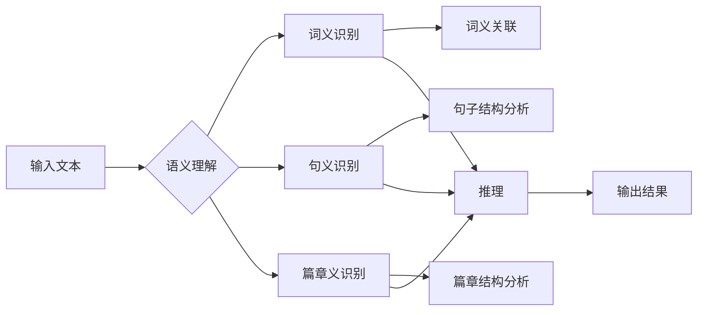

# 语言与推理：大模型的挑战

> 关键词：自然语言处理，大模型，推理能力，语义理解，可解释性，计算效率，模型压缩

## 1. 背景介绍

随着深度学习技术的飞速发展，自然语言处理（NLP）领域取得了令人瞩目的成果。特别是基于Transformer的大语言模型（Large Language Model，LLM），如BERT、GPT-3等，在文本生成、机器翻译、问答系统等任务上展现出惊人的表现。然而，这些模型在推理能力方面仍然面临着诸多挑战。本文将探讨大模型在语言与推理领域的挑战，分析其原理、应用以及未来发展趋势。

## 2. 核心概念与联系

### 2.1 核心概念

**自然语言处理（NLP）**：自然语言处理是人工智能领域的一个分支，旨在让计算机理解和生成人类自然语言。

**大语言模型（LLM）**：大语言模型是指参数量巨大、能够处理和理解复杂语言现象的模型。

**推理能力**：推理能力是指模型在理解语言的基础上，根据已有信息推断新信息的能力。

**语义理解**：语义理解是指模型对语言含义的理解，包括词义、句义、篇章义等。

**可解释性**：可解释性是指模型决策过程的透明度和可理解性。

**计算效率**：计算效率是指模型在保证性能的前提下，对计算资源的占用。

**模型压缩**：模型压缩是指减小模型参数量和计算复杂度，提高模型在资源受限设备上的运行效率。

### 2.2 Mermaid 流程图



## 3. 核心算法原理 & 具体操作步骤

### 3.1 算法原理概述

大语言模型在语言与推理领域的核心原理是利用深度神经网络学习语言模式和结构，从而实现对文本的理解和推理。

**词义识别**：通过Word Embedding将词汇映射到高维空间，使得具有相似语义的词汇在空间中距离更近。

**句义识别**：通过句法分析和语义角色标注等方法，识别句子中各个成分的语义关系。

**篇章义识别**：通过篇章分析，理解句子之间的逻辑关系，把握整个篇章的语义。

**推理**：在理解文本的基础上，根据已有信息推断出新的信息。

### 3.2 算法步骤详解

1. **数据预处理**：对文本进行分词、词性标注、命名实体识别等预处理操作。
2. **词义识别**：将预处理后的文本转化为词向量，并通过神经网络学习词义表示。
3. **句义识别**：利用句法分析工具，如依存句法分析，识别句子中各个成分的语义关系。
4. **篇章义识别**：分析句子之间的逻辑关系，把握篇章的整体语义。
5. **推理**：根据文本信息和语义知识，推断出新的信息。
6. **输出结果**：将推理结果输出为自然语言或结构化数据。

### 3.3 算法优缺点

**优点**：

* 强大的语义理解和推理能力
* 广泛的应用场景
* 易于集成和部署

**缺点**：

* 计算量大，效率低
* 可解释性差
* 模型压缩困难

### 3.4 算法应用领域

大语言模型在语言与推理领域的应用场景包括：

* 机器翻译
* 问答系统
* 文本摘要
* 文本分类
* 对话系统
* 语音识别

## 4. 数学模型和公式 & 详细讲解 & 举例说明

### 4.1 数学模型构建

大语言模型通常采用深度神经网络进行建模，包括以下几个关键层：

* **输入层**：将文本转化为词向量。
* **隐藏层**：利用神经网络学习词义表示和句子结构。
* **输出层**：根据句义和篇章义，输出推理结果。

### 4.2 公式推导过程

以下以BERT模型为例，介绍其核心公式的推导过程。

**Word Embedding**：

$$
\mathbf{w}_{i}^{(j)} = \text{Word2Vec}(\text{word}_j)
$$

其中，$\mathbf{w}_{i}^{(j)}$ 表示词 $j$ 的词向量，$\text{Word2Vec}$ 表示Word2Vec模型。

**Transformer编码器**：

$$
\mathbf{h}_{t}^{(l)} = \text{Transformer}(\mathbf{h}_{t}^{(l-1)})
$$

其中，$\mathbf{h}_{t}^{(l)}$ 表示第 $l$ 层第 $t$ 个隐藏状态，$\text{Transformer}$ 表示Transformer编码器。

**Softmax层**：

$$
\mathbf{p}_{t} = \text{softmax}(\mathbf{h}_{t}^{(L)})
$$

其中，$\mathbf{p}_{t}$ 表示第 $t$ 个预测标签的概率分布，$\text{softmax}$ 表示Softmax函数。

### 4.3 案例分析与讲解

以下以一个简单的文本分类任务为例，展示大语言模型在语言与推理中的应用。

**任务**：判断以下句子属于积极情感还是消极情感。

句子：今天天气真好，出门晒太阳很舒服。

**步骤**：

1. **数据预处理**：将句子进行分词、词性标注等预处理操作。
2. **词义识别**：将预处理后的词转化为词向量。
3. **句义识别**：通过句法分析，识别句子中各个成分的语义关系。
4. **篇章义识别**：分析句子之间的逻辑关系，把握整个句子的语义。
5. **推理**：根据文本信息和语义知识，判断句子属于积极情感还是消极情感。
6. **输出结果**：输出推理结果，例如：积极情感。

## 5. 项目实践：代码实例和详细解释说明

### 5.1 开发环境搭建

以下以TensorFlow为例，介绍大语言模型在语言与推理领域的项目实践。

1. 安装TensorFlow和TensorFlow Text库。
2. 安装预训练语言模型，如BERT。
3. 准备数据集，并进行预处理。

### 5.2 源代码详细实现

以下以TensorFlow实现BERT文本分类任务为例，展示代码实现过程。

```python
import tensorflow as tf
import tensorflow_text as text
from transformers import BertTokenizer, TFBertForSequenceClassification

# 加载数据集
train_data = tf.data.Dataset.from_tensor_slices((train_texts, train_labels))
dev_data = tf.data.Dataset.from_tensor_slices((dev_texts, dev_labels))

# 分词
tokenizer = BertTokenizer.from_pretrained('bert-base-uncased')
train_encodings = tokenizer(train_texts, truncation=True, padding=True)
dev_encodings = tokenizer(dev_texts, truncation=True, padding=True)

# 创建模型
model = TFBertForSequenceClassification.from_pretrained('bert-base-uncased')
model.compile(optimizer=tf.keras.optimizers.Adam(learning_rate=5e-5),
              loss=tf.keras.losses.SparseCategoricalCrossentropy(from_logits=True),
              metrics=[tf.keras.metrics.SparseCategoricalAccuracy()])

# 训练模型
model.fit(train_encodings['input_ids'], train_encodings['attention_mask'], epochs=3)

# 评估模型
dev_loss, dev_accuracy = model.evaluate(dev_encodings['input_ids'], dev_encodings['attention_mask'], verbose=2)
print(f"Dev loss: {dev_loss}, Dev accuracy: {dev_accuracy}")
```

### 5.3 代码解读与分析

以上代码展示了使用TensorFlow和Transformers库实现BERT文本分类任务的基本流程。

1. 导入必要的库。
2. 加载数据集，并进行预处理。
3. 创建模型，选择合适的预训练语言模型。
4. 编译模型，设置优化器、损失函数和评价指标。
5. 训练模型，在验证集上评估性能。
6. 打印评估结果。

## 6. 实际应用场景

### 6.1 机器翻译

大语言模型在机器翻译领域取得了显著的成果，例如Google的Neural Machine Translation（NMT）系统。

### 6.2 问答系统

大语言模型可以应用于问答系统，例如Microsoft的Siri和Amazon的Alexa。

### 6.3 文本摘要

大语言模型可以用于自动生成文本摘要，例如Google的BERT Summarization。

### 6.4 文本分类

大语言模型可以用于文本分类任务，例如垃圾邮件检测、情感分析等。

### 6.5 对话系统

大语言模型可以用于构建对话系统，例如聊天机器人、虚拟助手等。

## 7. 工具和资源推荐

### 7.1 学习资源推荐

* 《深度学习自然语言处理》（Goodfellow et al.）
* 《NLP进展》（ACL Annual Meeting）
* 《arXiv》

### 7.2 开发工具推荐

* TensorFlow
* PyTorch
* Hugging Face Transformers
* Jupyter Notebook

### 7.3 相关论文推荐

* "Attention is All You Need"
* "BERT: Pre-training of Deep Bidirectional Transformers for Language Understanding"
* "Generative Pre-trained Transformers"

## 8. 总结：未来发展趋势与挑战

### 8.1 研究成果总结

大语言模型在语言与推理领域取得了显著的成果，但仍面临诸多挑战。未来研究需要关注以下方向：

* 提高推理能力，实现更复杂的推理任务。
* 提升模型可解释性，增强模型决策过程的透明度和可理解性。
* 提高计算效率，降低模型对计算资源的占用。
* 提高模型压缩能力，实现模型在资源受限设备上的高效运行。

### 8.2 未来发展趋势

* 多模态模型融合，实现跨模态信息处理。
* 知识增强，提高模型的知识表示和学习能力。
* 元学习，实现模型的自适应和泛化能力。
* 可解释性和安全性研究，提高模型的可信度。

### 8.3 面临的挑战

* 计算资源消耗大
* 模型可解释性差
* 模型安全性和隐私问题
* 模型偏见和歧视问题

### 8.4 研究展望

大语言模型在语言与推理领域具有巨大的潜力，但同时也面临着诸多挑战。未来研究需要不断创新，探索新的模型结构、训练方法和应用场景，以推动大语言模型在语言与推理领域的进一步发展。

---

作者：禅与计算机程序设计艺术 / Zen and the Art of Computer Programming