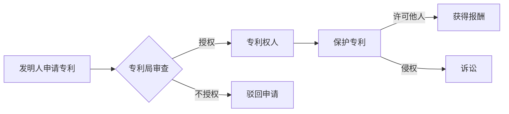

> 软件2.0, 软件专利, 法律制度, 开源, 创新模式, 知识产权, 软件版权

# 软件2.0颠覆软件专利?法律制度面临新挑战

随着软件产业的快速发展，软件2.0时代的到来引发了业界对于传统软件专利制度的深刻反思。软件2.0强调开放、共享、协作和创新，这种模式对传统的知识产权保护体系提出了新的挑战。本文将探讨软件2.0对软件专利制度的影响，分析其带来的机遇与挑战，并展望未来知识产权保护的趋势。

## 1. 背景介绍

### 1.1 软件2.0的崛起

软件2.0是继软件1.0时代（封闭式、单点应用）和软件1.5时代（互联网应用）之后的新阶段。软件2.0强调软件的开放性、协作性和共享性，其核心特征包括：

- **平台化**：构建开放的平台，鼓励开发者贡献代码，共同构建生态系统。
- **社区化**：建立开发者社区，通过协作实现技术创新和产品迭代。
- **个性化**：提供定制化的服务，满足用户多样化的需求。
- **数据驱动**：利用大数据分析，优化产品功能和用户体验。

### 1.2 软件专利制度的现状

软件专利制度起源于20世纪，旨在保护软件发明者的知识产权，促进技术创新。然而，随着软件产业的快速发展，软件专利制度也面临着诸多问题，如专利质量低下、专利滥用等。

### 1.3 本文结构

本文将首先介绍软件2.0的核心概念和影响，然后分析软件2.0对软件专利制度的挑战，最后探讨未来知识产权保护的趋势。

## 2. 核心概念与联系

### 2.1 软件2.0的核心概念

软件2.0的核心概念可以概括为以下几点：

- **开放源代码**：鼓励开发者共享代码，共同维护和改进。
- **协作开发**：通过开发者社区实现技术创新和产品迭代。
- **生态系统**：构建开放的平台，吸引开发者、用户等各方参与。
- **用户参与**：鼓励用户参与产品设计和开发，提供反馈和建议。

### 2.2 软件专利制度的架构

软件专利制度的架构主要包括以下几个方面：

- **专利申请**：发明人向国家知识产权局申请专利，经审查后获得授权。
- **专利保护**：授权的专利享有排他权，禁止他人未经许可实施专利。
- **专利许可**：专利权人可以许可他人使用专利技术，获得报酬。
- **专利侵权**：未经许可实施专利的行为，构成侵权。

### 2.3 Mermaid流程图

以下是一个简化的软件专利制度的Mermaid流程图：

## 3. 核心算法原理 & 具体操作步骤

### 3.1 算法原理概述

软件2.0对软件专利制度的影响主要体现在以下几个方面：

- **开源软件的专利问题**：开源软件的代码可以被任何人自由使用，这可能导致专利侵权的问题。
- **软件创新模式的转变**：软件2.0鼓励协作创新，可能引发专利归属的争议。
- **专利滥用**：软件专利制度的漏洞可能导致专利滥用，阻碍技术创新。

### 3.2 算法步骤详解

软件2.0对软件专利制度的影响可以通过以下步骤进行分析：

1. **开源软件的专利风险**：开源软件的代码可能包含专利技术，使用时存在侵权风险。
2. **软件创新模式的转变**：软件2.0强调协作创新，可能导致专利归属不清。
3. **专利滥用**：专利滥用可能导致技术垄断，阻碍技术创新。

### 3.3 算法优缺点

软件2.0对软件专利制度的优缺点如下：

### 3.4 算法应用领域

软件2.0对软件专利制度的影响主要涉及开源软件、协作创新和专利滥用等领域。

## 4. 数学模型和公式 & 详细讲解 & 举例说明

### 4.1 数学模型构建

软件2.0对软件专利制度的影响可以通过以下数学模型进行构建：

- **专利侵权概率模型**：根据软件代码的相似度，计算专利侵权的概率。
- **创新效率模型**：评估专利制度对软件创新效率的影响。

### 4.2 公式推导过程

以下是一个简化的专利侵权概率模型的推导过程：

$$
P(侵权) = \frac{相似度}{代码总量}
$$

其中，$P(侵权)$ 表示专利侵权的概率，相似度表示软件代码之间的相似程度，代码总量表示所有软件代码的总量。

### 4.3 案例分析与讲解

以下是一个开源软件专利侵权案例的讲解：

**案例**：某开源项目使用了某公司的专利技术，导致该公司起诉开源项目侵犯了其专利权。

**分析**：开源软件的专利侵权问题主要源于专利权人对专利保护范围的界定不清。在本案例中，开源项目使用了某公司的专利技术，但由于开源软件的特性，无法确定具体的侵权程度。

## 5. 项目实践：代码实例和详细解释说明

### 5.1 开发环境搭建

由于本文主要探讨软件专利制度，不涉及具体的代码实现，因此此处省略开发环境搭建的步骤。

### 5.2 源代码详细实现

由于本文主要探讨软件专利制度，不涉及具体的代码实现，因此此处省略源代码的详细实现。

### 5.3 代码解读与分析

由于本文主要探讨软件专利制度，不涉及具体的代码实现，因此此处省略代码的解读与分析。

### 5.4 运行结果展示

由于本文主要探讨软件专利制度，不涉及具体的代码实现，因此此处省略运行结果展示。

## 6. 实际应用场景

### 6.1 开源软件的专利问题

开源软件的专利问题是软件2.0时代面临的重要挑战。开源软件的代码可以被任何人自由使用，这可能导致专利侵权的问题。

### 6.2 软件创新模式的转变

软件2.0强调协作创新，这可能导致专利归属的争议。

### 6.3 专利滥用

专利滥用可能导致技术垄断，阻碍技术创新。

## 7. 工具和资源推荐

### 7.1 学习资源推荐

- 《软件专利法律制度研究》
- 《开源软件与知识产权》
- 《专利滥用与反垄断法》

### 7.2 开发工具推荐

- PatSnap
- Lex Machina
- District of Columbia Circuit

### 7.3 相关论文推荐

- "The Role of Patents in the Open Source Software Ecosystem"
- "The Economic Effects of Patent Holdup"
- "The Scope of Patent Protection in the Software Industry"

## 8. 总结：未来发展趋势与挑战

### 8.1 研究成果总结

本文探讨了软件2.0对软件专利制度的影响，分析了其带来的机遇与挑战，并展望了未来知识产权保护的趋势。

### 8.2 未来发展趋势

未来，软件专利制度将面临以下发展趋势：

- **专利制度与国际接轨**：随着全球化的发展，各国专利制度将更加接轨。
- **知识产权保护力度加强**：知识产权保护力度将进一步加强，打击侵权行为。
- **知识产权保护与创新并重**：知识产权保护与创新将更加平衡，鼓励技术创新。

### 8.3 面临的挑战

软件专利制度在未来将面临以下挑战：

- **专利滥用**：专利滥用将更加严重，阻碍技术创新。
- **专利诉讼增多**：专利诉讼将增多，企业面临更大的法律风险。
- **知识产权保护与创新的平衡**：如何在知识产权保护与创新之间取得平衡，是一个难题。

### 8.4 研究展望

未来，需要进一步研究以下问题：

- **软件专利制度的改革**：如何改革软件专利制度，使其更好地适应软件2.0时代的发展。
- **开源软件的知识产权保护**：如何保护开源软件的知识产权，鼓励开源创新。
- **专利滥用与反垄断法的完善**：如何完善专利滥用与反垄断法，保护企业合法权益。

## 9. 附录：常见问题与解答

**Q1：软件2.0对软件专利制度有什么影响？**

A：软件2.0对软件专利制度的影响主要体现在开源软件的专利问题、软件创新模式的转变和专利滥用等方面。

**Q2：如何保护开源软件的知识产权？**

A：保护开源软件的知识产权可以通过以下途径：

- **开源协议**：使用合适的开源协议，明确知识产权归属和使用条件。
- **代码审计**：对开源软件进行代码审计，识别潜在的专利风险。
- **专利池**：建立专利池，共同防御专利侵权诉讼。

**Q3：如何应对专利滥用？**

A：应对专利滥用可以通过以下途径：

- **加强专利审查**：提高专利审查标准，防止低质量专利授权。
- **完善反垄断法**：完善反垄断法，打击专利滥用行为。
- **建立专利池**：建立专利池，共同防御专利滥用。

**Q4：如何平衡知识产权保护与创新？**

A：平衡知识产权保护与创新可以通过以下途径：

- **完善专利制度**：完善专利制度，使其更好地适应创新发展需求。
- **鼓励创新**：鼓励企业进行技术创新，提高核心竞争力。
- **加强知识产权保护意识**：加强知识产权保护意识，营造良好的创新环境。

---

作者：禅与计算机程序设计艺术 / Zen and the Art of Computer Programming