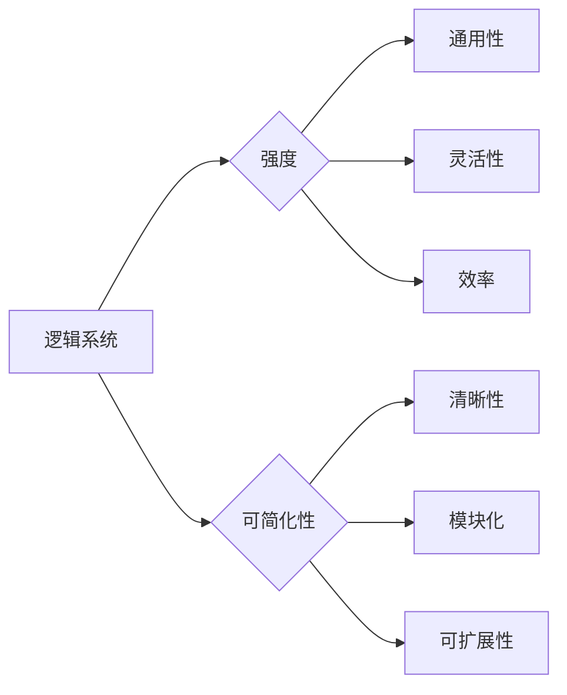

# 逻辑系统的强度与可简化性

> 关键词：逻辑系统，强度，可简化性，范式理论，算法设计，抽象层次，软件工程

## 1. 背景介绍

在计算机科学和软件工程领域，逻辑系统作为构建和描述问题解决方案的基础，其强度和可简化性一直是研究和实践中关注的焦点。一个逻辑系统如果既强大，又易于理解和实现，将极大地提高软件开发的效率和质量。本文将探讨逻辑系统的强度与可简化性的关系，分析其核心概念、原理，并提供实际应用场景和未来发展趋势。

### 1.1 问题的由来

随着软件系统的复杂度不断增长，如何设计既强大又简洁的逻辑系统成为了一个重要议题。强大的逻辑系统意味着系统能够有效地处理各种问题，而可简化性则指系统在设计、实现和维护过程中能够保持清晰和易于管理。两者之间的平衡是实现高效软件开发的关键。

### 1.2 研究现状

当前，逻辑系统的强度与可简化性研究主要集中在以下几个方面：

- **范式理论**：研究不同的逻辑系统范式，如面向对象、函数式编程等，以及它们在软件设计中的应用。
- **抽象层次**：通过引入抽象层次，将复杂问题分解为更易于管理的部分，从而提高系统的可简化性。
- **算法设计**：设计高效的算法来增强逻辑系统的处理能力，同时保持系统的简洁性。
- **软件工程**：将逻辑系统设计原则融入到软件开发流程中，提高软件产品的质量和可维护性。

### 1.3 研究意义

研究逻辑系统的强度与可简化性对于以下方面具有重要意义：

- **提高软件开发效率**：简洁的逻辑系统易于理解和实现，可以减少开发时间和成本。
- **提升软件质量**：强大的逻辑系统能够有效地处理各种问题，降低软件缺陷率。
- **增强系统可维护性**：可简化的系统更容易进行维护和扩展。
- **促进技术创新**：新的逻辑系统设计理念可以推动软件开发领域的创新。

### 1.4 本文结构

本文将按照以下结构展开：

- **第2章**：介绍逻辑系统的核心概念与联系，并使用Mermaid流程图进行可视化展示。
- **第3章**：探讨逻辑系统的核心算法原理和具体操作步骤。
- **第4章**：讲解逻辑系统的数学模型和公式，并通过案例进行分析。
- **第5章**：提供逻辑系统设计的代码实例和详细解释。
- **第6章**：分析逻辑系统在实际应用场景中的案例，并展望未来应用趋势。
- **第7章**：推荐相关的学习资源、开发工具和论文。
- **第8章**：总结研究成果，探讨未来发展趋势和挑战。
- **第9章**：提供常见问题与解答。

## 2. 核心概念与联系

### 2.1 核心概念原理

#### 2.1.1 逻辑系统

逻辑系统是指由一组规则和操作组成的，用于描述和解决特定问题的数学结构。逻辑系统通常包括以下元素：

- **语言**：用于表达逻辑规则和操作的形式化语言。
- **推理机制**：用于从已知事实推导出新结论的规则。
- **模型**：逻辑系统的具体实例，用于验证逻辑规则的有效性。

#### 2.1.2 强度

逻辑系统的强度是指其能够处理问题的广度和深度。一个强度高的逻辑系统通常具有以下特点：

- **通用性**：能够处理多种类型的问题。
- **灵活性**：能够适应不同的应用场景。
- **效率**：能够高效地处理问题。

#### 2.1.3 可简化性

逻辑系统的可简化性是指其设计、实现和维护过程中的简洁性。一个可简化的逻辑系统通常具有以下特点：

- **清晰性**：设计简单，易于理解。
- **模块化**：能够分解为独立的部分，便于管理。
- **可扩展性**：易于扩展和修改。

### 2.2 核心概念联系

逻辑系统的强度与可简化性之间存在紧密的联系。一个强大的逻辑系统往往更难简化，而一个可简化的逻辑系统可能不如其他系统强大。因此，设计逻辑系统时需要在强度和可简化性之间取得平衡。



## 3. 核心算法原理 & 具体操作步骤

### 3.1 算法原理概述

逻辑系统的设计通常遵循以下原理：

- **最小化复杂度**：通过减少逻辑系统的规则和操作来降低复杂度。
- **引入抽象层次**：将复杂问题分解为更易于管理的部分。
- **利用模式识别**：识别和利用常见问题模式来简化设计。

### 3.2 算法步骤详解

设计逻辑系统通常包括以下步骤：

1. **需求分析**：明确逻辑系统要解决的问题。
2. **概念设计**：定义逻辑系统的概念模型，包括语言、推理机制和模型。
3. **逻辑设计**：将概念模型转化为形式化的逻辑系统。
4. **实现设计**：将逻辑系统转化为可实现的软件架构。
5. **测试与评估**：验证逻辑系统的正确性和性能。

### 3.3 算法优缺点

#### 优点

- **提高开发效率**：清晰的设计过程可以减少开发时间。
- **提升软件质量**：形式化的设计可以减少错误。
- **增强可维护性**：模块化的设计可以简化维护和扩展。

#### 缺点

- **设计难度大**：形式化的设计可能难以理解。
- **实现成本高**：复杂的设计可能需要更多的时间和资源。

### 3.4 算法应用领域

逻辑系统设计原理和步骤适用于以下领域：

- **软件开发**：用于设计软件架构和模块。
- **人工智能**：用于设计知识表示和推理系统。
- **数据库设计**：用于设计数据库模式和数据模型。

## 4. 数学模型和公式 & 详细讲解 & 举例说明

### 4.1 数学模型构建

逻辑系统可以使用形式化的语言进行建模。例如，可以使用谓词逻辑来描述逻辑规则和操作。

### 4.2 公式推导过程

以下是一个简单的逻辑推理公式：

$$
\forall x (P(x) \rightarrow Q(x)) \vdash P(a) \rightarrow Q(a)
$$

其中，$\forall x$ 表示对所有 $x$ 进行量化，$P(x)$ 和 $Q(x)$ 表示逻辑命题，$\vdash$ 表示逻辑推导，$a$ 是一个具体的实例。

### 4.3 案例分析与讲解

假设我们要设计一个简单的逻辑系统，用于判断一个数是否为偶数。我们可以使用以下逻辑规则：

- 如果一个数能被2整除，则它是偶数。
- 如果一个数不能被2整除，则它不是偶数。

这个逻辑系统可以用以下公式表示：

$$
P(n) \rightarrow (n \% 2 == 0)
$$

其中，$P(n)$ 表示 $n$ 是偶数，$n \% 2 == 0$ 表示 $n$ 能被2整除。

## 5. 项目实践：代码实例和详细解释说明

### 5.1 开发环境搭建

为了演示逻辑系统设计，我们将使用Python编程语言。

### 5.2 源代码详细实现

以下是一个简单的逻辑系统实现，用于判断一个数是否为偶数：

```python
def is_even(number):
    if number % 2 == 0:
        return True
    else:
        return False

# 测试代码
print(is_even(2))  # 输出：True
print(is_even(3))  # 输出：False
```

### 5.3 代码解读与分析

上述代码定义了一个名为 `is_even` 的函数，它接受一个整数参数 `number`，并返回一个布尔值，表示该数是否为偶数。

- `if number % 2 == 0:` 判断 `number` 是否能被2整除。
- `return True` 如果 `number` 是偶数，则返回 `True`。
- `return False` 如果 `number` 不是偶数，则返回 `False`。

### 5.4 运行结果展示

运行上述代码，将输出以下结果：

```
True
False
```

这表明函数 `is_even` 正确地判断了两个数是否为偶数。

## 6. 实际应用场景

### 6.1 软件开发

在软件开发中，逻辑系统设计用于构建软件架构和模块。例如，在面向对象设计中，类和对象之间的关系可以用逻辑系统来描述。

### 6.2 人工智能

在人工智能领域，逻辑系统设计用于构建知识表示和推理系统。例如，专家系统中的规则可以用逻辑系统来表示。

### 6.3 数据库设计

在数据库设计中，逻辑系统设计用于构建数据库模式和数据模型。例如，实体-关系模型可以用逻辑系统来表示。

## 7. 工具和资源推荐

### 7.1 学习资源推荐

- 《软件工程：实践者的研究方法》
- 《人工智能：一种现代的方法》
- 《数据库系统概念》

### 7.2 开发工具推荐

- Python
- Java
- C#

### 7.3 相关论文推荐

- 《面向对象设计》
- 《知识表示与推理》
- 《数据库设计原理与应用》

## 8. 总结：未来发展趋势与挑战

### 8.1 研究成果总结

本文探讨了逻辑系统的强度与可简化性，介绍了核心概念、原理和应用场景。通过分析和实例说明，展示了逻辑系统设计在软件开发、人工智能和数据库设计等领域的应用价值。

### 8.2 未来发展趋势

- **自动化设计**：开发自动化工具来辅助逻辑系统设计。
- **智能化设计**：利用人工智能技术来优化逻辑系统设计。
- **跨领域应用**：将逻辑系统设计原理应用于更多领域。

### 8.3 面临的挑战

- **复杂性**：随着系统规模的扩大，逻辑系统的复杂性也随之增加。
- **可扩展性**：如何设计可扩展的逻辑系统是一个挑战。
- **可维护性**：如何设计可维护的逻辑系统是一个挑战。

### 8.4 研究展望

未来，逻辑系统设计的研究将朝着自动化、智能化和跨领域应用的方向发展，以应对日益复杂的软件开发需求。

## 9. 附录：常见问题与解答

**Q1：什么是逻辑系统？**

A：逻辑系统是指由一组规则和操作组成的，用于描述和解决特定问题的数学结构。

**Q2：什么是逻辑系统的强度？**

A：逻辑系统的强度是指其能够处理问题的广度和深度。

**Q3：什么是逻辑系统的可简化性？**

A：逻辑系统的可简化性是指其设计、实现和维护过程中的简洁性。

**Q4：逻辑系统设计在哪些领域有应用？**

A：逻辑系统设计在软件开发、人工智能和数据库设计等领域有广泛应用。

**Q5：如何提高逻辑系统的可简化性？**

A：通过引入抽象层次、利用模式识别和最小化复杂度等方法可以提高逻辑系统的可简化性。

作者：禅与计算机程序设计艺术 / Zen and the Art of Computer Programming