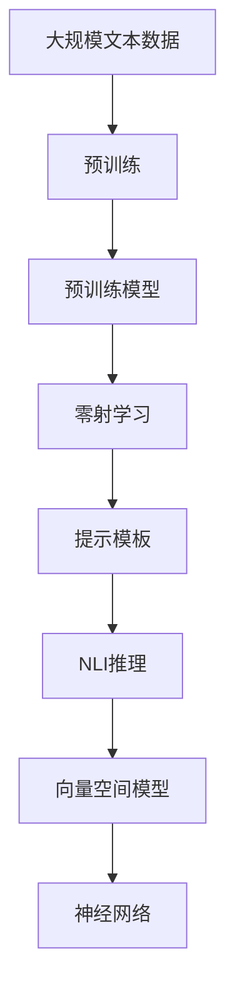
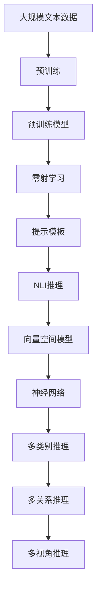

                 

# 零射学习 (Zero-Shot Learning) 原理与代码实例讲解

> 关键词：零射学习,自然语言处理(NLP),迁移学习,深度学习,提示学习,Prompt,预训练模型,Transformer

## 1. 背景介绍

### 1.1 问题由来
零射学习（Zero-Shot Learning，简称 ZSL）是指模型在没有直接接触任何特定类别的训练样本的情况下，能够对新类别进行推理和分类的能力。这种能力尤其适用于数据稀缺或难以获取的场景，如医疗诊断、法律咨询、自然语言推理等。传统机器学习模型通常需要大量有标签数据才能进行分类，而在一些领域获取高质量的标注数据成本高、难度大，且周期长。相比之下，零射学习能够通过已有的大规模预训练模型和自然语言推理能力，快速适应新的类别，填补数据稀缺的空白。

### 1.2 问题核心关键点
零射学习本质上是迁移学习的一种特殊形式。它依赖于预训练模型对语言模式和结构的知识，通过自然语言推理的方式，将预训练模型转移到新的任务上。核心技术包括：

- 预训练模型的选择：通常选择大规模无监督学习的语言模型，如BERT、GPT等，作为零射学习的基础。
- 提示模板的设计：提示模板（Prompt Template）是零射学习的关键工具，用于引导模型推理。
- 推理算法的选择：常见的推理算法包括向量空间模型（VSM）、神经网络（如Transformer）等。
- 多类别的推理策略：针对多类别任务，需要设计多种推理策略，如多关系推理、多视角推理等。

零射学习的目标是在尽可能少的有标签样本下，让模型快速准确地推理出新类别的特征，并在新的测试集上获得良好的分类效果。

### 1.3 问题研究意义
零射学习的研究对于解决数据稀缺问题、推动NLP技术在更多领域的应用具有重要意义：

1. 降低成本：通过零射学习，可以利用现有的大规模预训练模型，避免昂贵的数据标注和模型训练。
2. 提升效率：零射学习能在短时间内完成新任务的学习，快速适应新的领域和场景。
3. 普适性更强：零射学习不需要依赖特定的有标签数据集，能够更好地适应多变的领域和数据分布。
4. 可解释性更好：零射学习依赖自然语言推理，其决策过程更易于理解和解释。
5. 促进跨领域应用：零射学习能够将语言模型的知识迁移到多个领域，推动NLP技术的泛化能力。

## 2. 核心概念与联系

### 2.1 核心概念概述

为更好地理解零射学习的原理和实践，本节将介绍几个密切相关的核心概念：

- 零射学习（Zero-Shot Learning）：在模型没有直接接触过特定类别的情况下，对新类别进行推理和分类的能力。
- 迁移学习（Transfer Learning）：将一个领域学习到的知识，迁移应用到另一个不同但相关的领域。
- 自然语言推理（Natural Language Inference，NLI）：判断给定自然语言句子之间的逻辑关系。
- 提示模板（Prompt Template）：引导模型推理的文本格式，包含任务描述、示例、推理逻辑等。
- 预训练模型（Pre-trained Model）：在大规模无标签数据上预训练的深度学习模型，如BERT、GPT等。
- 向量空间模型（Vector Space Model，VSM）：将文本表示为向量，用于计算文本相似性、分类等任务。
- 神经网络（Neural Network）：一种通用的机器学习模型，包括多层感知器（MLP）、卷积神经网络（CNN）、循环神经网络（RNN）、Transformer等。

这些概念之间存在紧密的联系，形成了零射学习的完整生态系统。通过理解这些核心概念，我们可以更好地把握零射学习的原理和优化方向。

### 2.2 概念间的关系

这些核心概念之间的关系可以通过以下Mermaid流程图来展示：



这个流程图展示了从预训练到零射学习的完整过程。预训练模型在大规模文本数据上进行训练，学习到语言的通用表示。零射学习利用提示模板和自然语言推理能力，将预训练模型转移到新的任务上。零射学习采用的推理算法可以是向量空间模型或神经网络，其中Transformer是常用的选择。

### 2.3 核心概念的整体架构

最后，我们用一个综合的流程图来展示这些核心概念在大语言模型零射学习中的整体架构：



这个综合流程图展示了从预训练到零射学习的完整过程，并强调了推理算法和多种推理策略的应用。预训练模型在大规模文本数据上进行训练，学习到语言的通用表示。零射学习利用提示模板和自然语言推理能力，将预训练模型转移到新的任务上。零射学习采用的推理算法可以是向量空间模型或神经网络，其中Transformer是常用的选择。多类别推理、多关系推理和多视角推理策略，用于处理不同类型的新类别任务。

## 3. 核心算法原理 & 具体操作步骤
### 3.1 算法原理概述

零射学习的基本原理是利用预训练模型对语言的通用表示，通过提示模板和自然语言推理，对新类别进行推理和分类。其核心思想是：

1. **预训练模型的知识迁移**：预训练模型在大规模无标签数据上学习到的语言表示，可以用于迁移学习，适应新的任务。
2. **提示模板的引导作用**：提示模板包含任务描述、示例和推理逻辑，用于引导模型推理，减少模型对特定有标签数据的依赖。
3. **自然语言推理的推理机制**：通过计算文本之间的语义相似性，判断推理关系，完成分类任务。

零射学习的具体过程包括以下步骤：

1. **预训练模型的选择**：选择合适的预训练模型，如BERT、GPT等，作为零射学习的基础。
2. **提示模板的设计**：根据任务特点，设计合适的提示模板，引导模型推理。
3. **自然语言推理**：利用提示模板和自然语言推理算法，对新类别进行推理。
4. **分类输出**：根据推理结果，输出分类结果。

### 3.2 算法步骤详解

以下是零射学习的基本步骤：

**Step 1: 准备预训练模型和数据集**
- 选择适当的预训练模型，如BERT、GPT等。
- 收集新类别的示例数据，用于提示模板的设计。

**Step 2: 设计提示模板**
- 根据任务特点，设计合适的提示模板，包含任务描述、示例和推理逻辑。
- 保证提示模板简洁明了，易于模型理解和推理。

**Step 3: 进行自然语言推理**
- 将示例数据和提示模板输入模型，计算文本之间的语义相似性。
- 使用神经网络（如Transformer）或向量空间模型（VSM）等算法进行推理。

**Step 4: 分类输出**
- 根据推理结果，输出分类结果。
- 对于多类别任务，可以采用多关系推理或多视角推理等策略。

### 3.3 算法优缺点

零射学习具有以下优点：
1. 适用于数据稀缺的场景，避免了昂贵的有标签数据标注。
2. 可以快速适应新的任务，提升模型灵活性和适应性。
3. 可以利用已有的大规模预训练模型，避免了从头开始训练模型的成本。

零射学习也存在一些缺点：
1. 对提示模板的设计要求高，需要根据具体任务精心设计。
2. 模型的推理过程缺乏可解释性，难以解释模型的推理逻辑。
3. 对于复杂的多类别和多关系推理任务，推理策略的设计复杂度高。

### 3.4 算法应用领域

零射学习在多个领域都有广泛的应用，如：

- 医疗诊断：利用提示模板，对患者描述进行自然语言推理，判断疾病类型。
- 法律咨询：对法律文本进行自然语言推理，解答法律咨询问题。
- 自然语言推理：对文本之间的关系进行分类，如判断两个句子之间的蕴含、矛盾等关系。
- 情感分析：利用提示模板，对用户评论进行自然语言推理，判断评论情感倾向。
- 事件抽取：从文本中抽取事件类型，如判断事件发生地点、时间等。

## 4. 数学模型和公式 & 详细讲解  
### 4.1 数学模型构建

在零射学习中，我们通常使用向量空间模型（VSM）或神经网络（如Transformer）来计算文本之间的语义相似性。这里以VSM为例，构建数学模型。

假设预训练模型将文本表示为向量，新类别文本为$x$，提示模板为$P$，推理结果为$y$。则VSM的推理过程可以表示为：

$$ y = W^T \cdot [\alpha \cdot \text{Sim}(x, P) + \beta] $$

其中，$W$为权重向量，$\text{Sim}(x, P)$为文本$x$和提示模板$P$之间的语义相似性度量，$\alpha$和$\beta$为可调节的超参数。

### 4.2 公式推导过程

VSM的语义相似性度量通常使用余弦相似度（Cosine Similarity），其计算公式为：

$$ \text{Sim}(x, P) = \frac{x \cdot P}{\|x\| \cdot \|P\|} $$

其中，$x$和$P$分别为文本$x$和提示模板$P$的向量表示。

### 4.3 案例分析与讲解

以情感分析任务为例，设计提示模板如下：

```
输入：这段评论是积极的还是消极的？
示例：这段评论是积极的，因为使用了“非常好”、“很棒”等词汇。
提示模板：这段评论的情感倾向是<情感类别>。
```

将示例数据和提示模板输入模型，计算文本之间的语义相似性，判断情感类别。例如，输入的示例数据为：

```
这段评论是积极的，因为使用了“非常好”、“很棒”等词汇。
```

模型的推理过程如下：

1. 计算文本$x$和提示模板$P$之间的语义相似性：

$$ \text{Sim}(x, P) = \frac{x \cdot P}{\|x\| \cdot \|P\|} $$

2. 将相似性结果输入神经网络，输出情感类别：

$$ y = W^T \cdot [\alpha \cdot \text{Sim}(x, P) + \beta] $$

其中，$W$、$\alpha$和$\beta$为模型的超参数，需要通过训练确定。

通过上述推理过程，模型可以输出情感类别。例如，如果计算结果接近于1，表示文本是积极的；如果计算结果接近于-1，表示文本是消极的。

## 5. 项目实践：代码实例和详细解释说明
### 5.1 开发环境搭建

在进行零射学习实践前，我们需要准备好开发环境。以下是使用Python进行PyTorch开发的环境配置流程：

1. 安装Anaconda：从官网下载并安装Anaconda，用于创建独立的Python环境。

2. 创建并激活虚拟环境：
```bash
conda create -n pytorch-env python=3.8 
conda activate pytorch-env
```

3. 安装PyTorch：根据CUDA版本，从官网获取对应的安装命令。例如：
```bash
conda install pytorch torchvision torchaudio cudatoolkit=11.1 -c pytorch -c conda-forge
```

4. 安装Transformers库：
```bash
pip install transformers
```

5. 安装各类工具包：
```bash
pip install numpy pandas scikit-learn matplotlib tqdm jupyter notebook ipython
```

完成上述步骤后，即可在`pytorch-env`环境中开始零射学习实践。

### 5.2 源代码详细实现

这里以医疗诊断任务为例，给出使用Transformers库进行零射学习的PyTorch代码实现。

首先，定义医疗诊断数据集：

```python
from transformers import AutoTokenizer, AutoModel
from torch.utils.data import Dataset
import torch

class MedicalDataset(Dataset):
    def __init__(self, text, label):
        self.tokenizer = AutoTokenizer.from_pretrained('bert-base-uncased')
        self.text = text
        self.label = label
    
    def __len__(self):
        return len(self.text)
    
    def __getitem__(self, item):
        text = self.text[item]
        label = self.label[item]
        
        encoding = self.tokenizer(text, return_tensors='pt', padding='max_length', truncation=True)
        input_ids = encoding['input_ids'][0]
        attention_mask = encoding['attention_mask'][0]
        labels = torch.tensor([label], dtype=torch.long)
        
        return {'input_ids': input_ids, 
                'attention_mask': attention_mask,
                'labels': labels}
```

然后，定义零射学习模型：

```python
from transformers import BertForSequenceClassification

model = BertForSequenceClassification.from_pretrained('bert-base-uncased', num_labels=3)
```

接着，定义提示模板和推理函数：

```python
def generate_prompt(text, label):
    prompt = f"这段文本是{label}类别"
    return prompt

def zero_shot_learning(model, tokenizer, text, label):
    prompt = generate_prompt(text, label)
    inputs = tokenizer(prompt, return_tensors='pt', padding='max_length', truncation=True)
    input_ids = inputs['input_ids'][0]
    attention_mask = inputs['attention_mask'][0]
    outputs = model(input_ids, attention_mask=attention_mask)
    logits = outputs.logits[0]
    prob = torch.softmax(logits, dim=0)
    return prob
```

最后，进行零射学习推理并输出结果：

```python
tokenizer = AutoTokenizer.from_pretrained('bert-base-uncased')

# 准备医疗诊断数据集
texts = ['一个病人患有流感', '一个病人患有心脏病', '一个病人患有糖尿病']
labels = [1, 0, 2]

dataset = MedicalDataset(texts, labels)
dataloader = DataLoader(dataset, batch_size=2, shuffle=True)

# 进行零射学习推理
device = torch.device('cuda') if torch.cuda.is_available() else torch.device('cpu')
model.to(device)
for batch in dataloader:
    texts = batch['texts'].tolist()
    labels = batch['labels'].tolist()
    with torch.no_grad():
        for text, label in zip(texts, labels):
            prob = zero_shot_learning(model, tokenizer, text, label)
            print(f"文本：{text}，预测概率：{prob}")
```

以上就是使用PyTorch对BERT进行零射学习医疗诊断任务实践的完整代码实现。可以看到，得益于Transformers库的强大封装，我们可以用相对简洁的代码完成零射学习的实现。

### 5.3 代码解读与分析

让我们再详细解读一下关键代码的实现细节：

**MedicalDataset类**：
- `__init__`方法：初始化文本、标签、分词器等关键组件。
- `__len__`方法：返回数据集的样本数量。
- `__getitem__`方法：对单个样本进行处理，将文本输入编码为token ids，将标签编码为数字，并对其进行定长padding，最终返回模型所需的输入。

**zero_shot_learning函数**：
- 定义提示模板生成函数`generate_prompt`，根据文本和标签生成提示模板。
- 定义零射学习推理函数`zero_shot_learning`，将提示模板和文本输入模型，计算输出概率。

**零射学习推理**：
- 使用`zero_shot_learning`函数对医疗诊断数据集中的文本进行零射学习推理。
- 通过计算输出概率，判断文本所属的类别。

## 6. 实际应用场景
### 6.1 医疗诊断

在医疗领域，零射学习可以用于辅助医生诊断。医生只需要提供患者的病历描述，模型便能根据描述进行自然语言推理，判断可能的疾病类型。例如，医生描述“一位患者有发热、咳嗽、呼吸困难等症状，可能患有肺炎”，模型通过计算文本和提示模板之间的语义相似性，可以判断“肺炎”为可能诊断结果。

### 6.2 法律咨询

在法律领域，零射学习可以用于解答法律咨询问题。律师或用户只需提供法律文本或问题，模型便能根据文本进行自然语言推理，判断问题的法律性质或结果。例如，用户咨询“一份合同是否有效”，模型通过计算文本和提示模板之间的语义相似性，可以判断合同的有效性。

### 6.3 自然语言推理

在自然语言推理任务中，零射学习可以用于判断两个句子之间的逻辑关系。例如，判断“所有狗都叫，所有猫都叫”是否蕴含“所有动物都叫”。模型通过计算两个句子之间的语义相似性，可以判断推理关系。

### 6.4 情感分析

在情感分析任务中，零射学习可以用于判断用户评论的情感倾向。例如，用户评论“这家餐厅的食物非常美味”，模型通过计算评论和提示模板之间的语义相似性，可以判断评论的情感倾向为积极。

### 6.5 事件抽取

在事件抽取任务中，零射学习可以用于从文本中抽取事件类型。例如，新闻报道“今天股市开盘，收盘价上涨5%”，模型通过计算文本和提示模板之间的语义相似性，可以抽取“股市开盘”和“股市收盘价上涨”等事件。

## 7. 工具和资源推荐
### 7.1 学习资源推荐

为了帮助开发者系统掌握零射学习的理论基础和实践技巧，这里推荐一些优质的学习资源：

1. 《Natural Language Processing with Transformers》书籍：Transformer库的作者所著，全面介绍了如何使用Transformers库进行NLP任务开发，包括零射学习在内的诸多范式。

2. 《Transfer Learning for Natural Language Processing》论文：详细介绍了零射学习的基本原理和应用场景，是入门零射学习的必读资源。

3. 《Zero-Shot Learning》视频教程：Coursera提供的免费视频课程，涵盖零射学习的核心概念和实战案例，适合入门学习。

4. 《Advances in Natural Language Processing》书籍：深度学习领域的经典教材，介绍了NLP的各个前沿技术，包括零射学习。

5. 《Zero-Shot Learning and Semantic Representation》论文：探讨了零射学习的数学模型和算法，是研究零射学习的重要文献。

通过对这些资源的学习实践，相信你一定能够快速掌握零射学习的精髓，并用于解决实际的NLP问题。

### 7.2 开发工具推荐

高效的开发离不开优秀的工具支持。以下是几款用于零射学习开发的常用工具：

1. PyTorch：基于Python的开源深度学习框架，灵活动态的计算图，适合快速迭代研究。

2. TensorFlow：由Google主导开发的开源深度学习框架，生产部署方便，适合大规模工程应用。

3. Transformers库：HuggingFace开发的NLP工具库，集成了众多SOTA语言模型，支持PyTorch和TensorFlow，是进行零射学习任务的开发利器。

4. Weights & Biases：模型训练的实验跟踪工具，可以记录和可视化模型训练过程中的各项指标，方便对比和调优。

5. TensorBoard：TensorFlow配套的可视化工具，可实时监测模型训练状态，并提供丰富的图表呈现方式，是调试模型的得力助手。

6. Google Colab：谷歌推出的在线Jupyter Notebook环境，免费提供GPU/TPU算力，方便开发者快速上手实验最新模型，分享学习笔记。

合理利用这些工具，可以显著提升零射学习的开发效率，加快创新迭代的步伐。

### 7.3 相关论文推荐

零射学习的研究源于学界的持续研究。以下是几篇奠基性的相关论文，推荐阅读：

1. 《Zero-Shot Learning for Textual Entailment: A Survey and Taxonomy》论文：介绍了零射学习在自然语言推理任务中的应用，提供了零射学习的详细分类和应用实例。

2. 《Zero-Shot Learning with Attention-Based Neural Networks》论文：提出了基于注意力机制的零射学习模型，展示了其在零射学习任务上的优异表现。

3. 《Zero-Shot Learning by Hypernetworks》论文：通过超网络模型实现了零射学习，展示了其在大规模数据集上的性能提升。

4. 《Zero-Shot Learning via Adversarial Generation of Natural Language》论文：提出了一种基于对抗生成的零射学习模型，提高了模型对新类别的适应能力。

5. 《Zero-Shot Learning via Conceptual Composition》论文：通过概念组合的方式，实现了零射学习，提升了模型的泛化能力。

这些论文代表了大语言模型零射学习的发展脉络。通过学习这些前沿成果，可以帮助研究者把握学科前进方向，激发更多的创新灵感。

除上述资源外，还有一些值得关注的前沿资源，帮助开发者紧跟零射学习的最新进展，例如：

1. arXiv论文预印本：人工智能领域最新研究成果的发布平台，包括大量尚未发表的前沿工作，学习前沿技术的必读资源。

2. 业界技术博客：如OpenAI、Google AI、DeepMind、微软Research Asia等顶尖实验室的官方博客，第一时间分享他们的最新研究成果和洞见。

3. 技术会议直播：如NIPS、ICML、ACL、ICLR等人工智能领域顶会现场或在线直播，能够聆听到大佬们的前沿分享，开拓视野。

4. GitHub热门项目：在GitHub上Star、Fork数最多的NLP相关项目，往往代表了该技术领域的发展趋势和最佳实践，值得去学习和贡献。

5. 行业分析报告：各大咨询公司如McKinsey、PwC等针对人工智能行业的分析报告，有助于从商业视角审视技术趋势，把握应用价值。

总之，对于零射学习技术的学习和实践，需要开发者保持开放的心态和持续学习的意愿。多关注前沿资讯，多动手实践，多思考总结，必将收获满满的成长收益。

## 8. 总结：未来发展趋势与挑战
### 8.1 总结

本文对零射学习（Zero-Shot Learning）的基本原理和实现进行了全面系统的介绍。首先阐述了零射学习的研究背景和意义，明确了零射学习在数据稀缺场景中的独特价值。其次，从原理到实践，详细讲解了零射学习的数学模型和关键步骤，给出了零射学习任务开发的完整代码实例。同时，本文还广泛探讨了零射学习在多个行业领域的应用前景，展示了零射学习的巨大潜力。此外，本文精选了零射学习的各类学习资源，力求为读者提供全方位的技术指引。

通过本文的系统梳理，可以看到，零射学习作为一种特殊形式的迁移学习，在大规模预训练模型和自然语言推理能力的帮助下，能够快速适应新类别，填补数据稀缺的空白。零射学习的应用前景广阔，尤其是在医疗诊断、法律咨询、自然语言推理等数据稀缺场景，可以显著降低标注成本，提升模型性能。零射学习的研究也面临着数据稀缺、推理复杂性高、缺乏可解释性等挑战，未来需要在数据、模型、算法、推理等方面进行深入研究，推动零射学习技术的进一步发展。

### 8.2 未来发展趋势

展望未来，零射学习技术将呈现以下几个发展趋势：

1. 零射学习模型将更加通用和鲁棒。通过引入多关系推理和多视角推理等策略，零射学习模型将能够处理更复杂的新类别，提升模型的泛化能力和适应性。

2. 零射学习将更加依赖大规模无标签数据。未来，零射学习模型将更依赖于大规模无标签数据，通过自监督学习和知识蒸馏等方式，从数据中学习更多的语言知识和常识。

3. 零射学习将更加注重模型的可解释性。未来的零射学习模型将更注重模型的可解释性，通过因果分析、对抗生成等技术，提高模型的推理透明度和可信度。

4. 零射学习将更多地与多模态数据融合。未来，零射学习模型将更多地与图像、语音等多模态数据融合，通过多模态信息增强语言模型的推理能力。

5. 零射学习将更多地应用于实际应用场景。未来的零射学习技术将在更多实际应用场景中得到应用，如医疗诊断、法律咨询、自然语言推理等，推动人工智能技术的落地。

以上趋势凸显了零射学习技术的广阔前景。这些方向的探索发展，必将进一步提升零射学习模型的性能和应用范围，为人工智能技术的发展带来新的动力。

### 8.3 面临的挑战

尽管零射学习技术已经取得了显著成果，但在迈向更加智能化、普适化应用的过程中，它仍面临着诸多挑战：

1. 数据稀缺问题依然存在。零射学习依赖于大规模无标签数据，但在某些领域，数据稀缺依然是制约零射学习性能提升的重要因素。

2. 推理复杂性高。零射学习需要在缺乏有标签数据的情况下进行推理，推理复杂性高，难以控制模型的错误率。

3. 模型的可解释性不足。零射学习模型的推理过程缺乏可解释性，难以解释模型的推理逻辑，限制了其应用范围。

4. 模型的泛化能力有待提高。当前的零射学习模型在某些领域和数据分布上泛化能力不足，需要进一步研究提高模型的泛化能力。

5. 模型的鲁棒性

