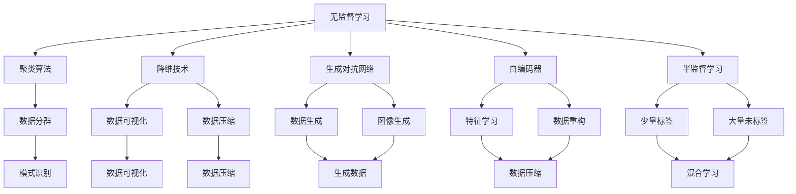
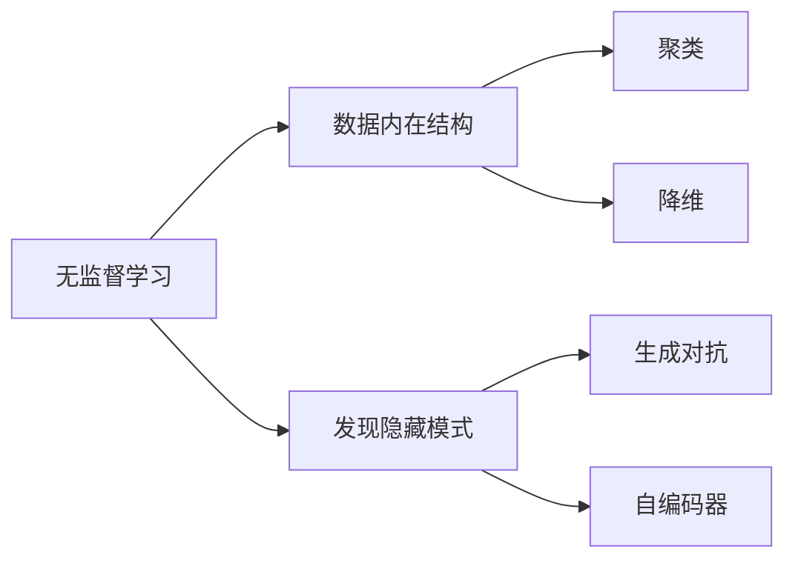
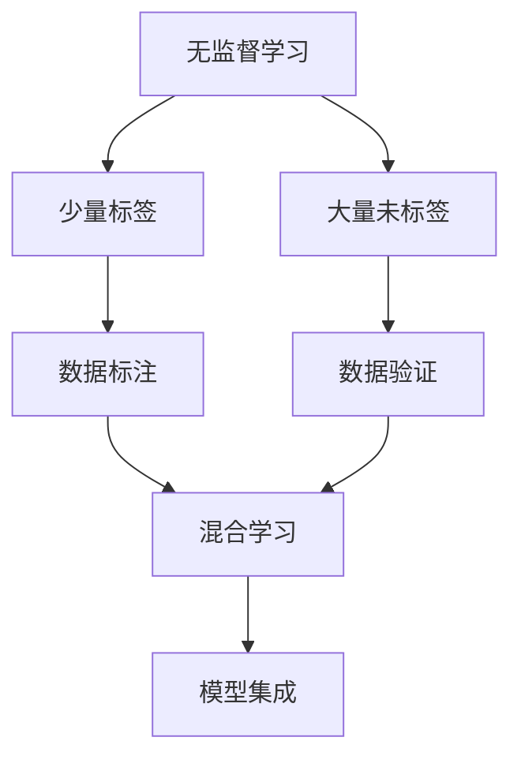
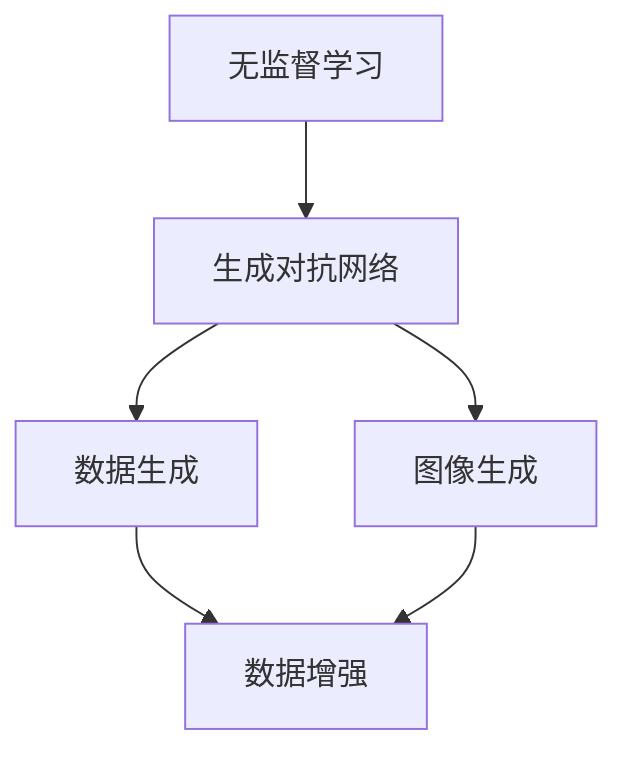
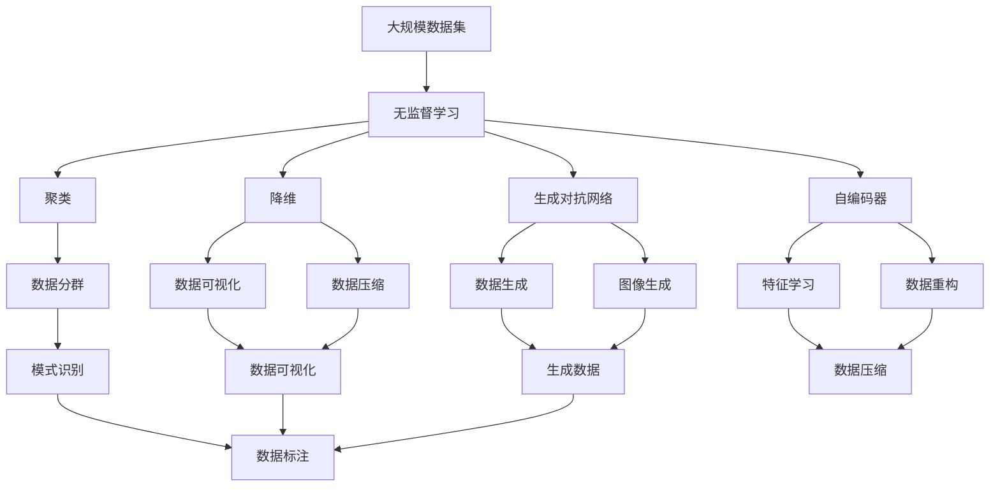

                 

# Unsupervised Learning原理与代码实例讲解

> 关键词：无监督学习,聚类算法,降维技术,生成对抗网络(GAN),自编码器(AE),半监督学习

## 1. 背景介绍

### 1.1 问题由来
在人工智能与机器学习的演进历程中，无监督学习(Unsupervised Learning)扮演了重要角色。不同于监督学习(Supervised Learning)与强化学习(Reinforcement Learning)，无监督学习依赖于大量未标注的数据，通过数据的自相似性和内在结构发现隐藏的知识。这一领域的应用涵盖图像识别、数据聚类、降维分析、自然语言处理等众多方面，为数据驱动的人工智能系统注入了强劲的驱动力。

本文旨在全面解析无监督学习的核心原理、主要算法与实际应用，通过具体代码实例，深入探讨其在不同场景下的应用与实践。通过本博文，读者将获得对无监督学习技术的深刻理解，并掌握其实际应用的关键技巧。

### 1.2 问题核心关键点
无监督学习的核心在于如何从无标签数据中发掘出有价值的信息。其核心关键点包括：

- 数据无标签特性：无监督学习面对的数据缺乏明确的标签信息，需要算法自主探索数据的结构和内在规律。
- 算法自主性：无监督学习算法在缺乏明确任务定义的情况下，自主寻找数据的潜在模式与结构。
- 数据驱动：无监督学习依赖于大量数据，通过数据内在结构发现隐藏的知识。
- 结果评估难度：无监督学习的结果往往难以进行直接对比，需要借助外部指标进行间接评估。

本文将系统介绍无监督学习的核心概念、算法流程与实际应用，通过代码实例，深入揭示无监督学习的精髓与魅力。

## 2. 核心概念与联系

### 2.1 核心概念概述

为更好地理解无监督学习的核心概念，本节将介绍几个密切相关的核心概念：

- 无监督学习(Unsupervised Learning)：一种无需标签信息进行训练的机器学习方法，通过数据的内在规律和结构发现隐藏的知识。
- 聚类算法(Clustering)：一种将相似数据点归为同一类别的无监督学习方法，常用于数据分群、模式识别等。
- 降维技术(Dimensionality Reduction)：一种将高维数据映射到低维空间的无监督学习方法，常用于数据可视化、数据压缩等。
- 生成对抗网络(GAN)：一种通过生成器和判别器相互对抗训练生成数据的无监督学习方法，常用于数据生成、图像生成等。
- 自编码器(Autoderceptor)：一种通过重构损失函数最小化进行数据压缩的神经网络，常用于特征学习、降维等。
- 半监督学习(Semi-supervised Learning)：一种结合少量标签和大量未标签数据进行训练的混合学习方法，常用于数据标注、模型验证等。

这些核心概念之间的逻辑关系可以通过以下Mermaid流程图来展示：



这个流程图展示了几大无监督学习技术的应用场景与关系：

1. 无监督学习通过发现数据内在结构，可以应用于聚类、降维、生成、半监督等多个领域。
2. 聚类算法主要用于数据分群，模式识别等。
3. 降维技术常用于数据压缩与可视化。
4. 生成对抗网络主要应用于数据生成与图像生成。
5. 自编码器主要用于特征学习与数据重构。
6. 半监督学习结合少量标签与大量未标签数据，用于数据标注与模型验证。

这些核心概念共同构成了无监督学习的学习框架，使其能够在各种场景下发挥强大的数据分析与模式识别能力。通过理解这些核心概念，我们可以更好地把握无监督学习的学习原理和优化方向。

### 2.2 概念间的关系

这些核心概念之间存在着紧密的联系，形成了无监督学习的完整生态系统。下面我通过几个Mermaid流程图来展示这些概念之间的关系。

#### 2.2.1 无监督学习的核心思想



这个流程图展示了几大无监督学习技术的核心思想：

1. 无监督学习通过发现数据内在结构，找到隐藏的模式与规律。
2. 聚类算法将相似数据点归为同一类别。
3. 降维技术将高维数据压缩到低维空间。
4. 生成对抗网络通过生成器与判别器的对抗训练生成数据。
5. 自编码器通过重构损失函数最小化进行数据压缩与特征学习。

#### 2.2.2 无监督学习与半监督学习的关系



这个流程图展示了无监督学习与半监督学习的关系：

1. 无监督学习结合少量标签与大量未标签数据，用于数据标注与模型验证。
2. 数据标注通过少量标签数据进行。
3. 数据验证通过大量未标签数据进行。
4. 模型集成将无监督与半监督模型融合，进行综合利用。

#### 2.2.3 无监督学习与生成对抗网络的关系



这个流程图展示了无监督学习与生成对抗网络的关系：

1. 无监督学习通过生成对抗网络生成数据。
2. 生成对抗网络用于数据生成与图像生成。
3. 数据生成与图像生成主要应用于数据增强与生成样本。

### 2.3 核心概念的整体架构

最后，我们用一个综合的流程图来展示这些核心概念在无监督学习中的整体架构：



这个综合流程图展示了从数据到无监督学习结果的完整过程。大规模数据集通过无监督学习，生成聚类、降维、生成、自编码器等多种结果，各结果又衍生出不同的应用场景。通过这些流程图，我们可以更清晰地理解无监督学习过程中各个核心概念的关系和作用，为后续深入讨论具体的算法与技术奠定基础。

## 3. 核心算法原理 & 具体操作步骤
### 3.1 算法原理概述

无监督学习的核心算法原理主要基于数据的概率分布特性。其基本思想是通过对数据的统计分析，发现数据的内在规律与结构。以下是几个主要无监督学习算法的基本原理：

1. **聚类算法**：通过计算数据点之间的相似度，将相似的数据点归为同一类别。常用的聚类算法有K-means、层次聚类、DBSCAN等。

2. **降维技术**：通过线性变换或非线性变换将高维数据映射到低维空间，常用的降维方法有PCA、t-SNE、Autoencoder等。

3. **生成对抗网络(GAN)**：通过生成器和判别器相互对抗训练生成新的数据，使生成数据与真实数据难以区分。常用的GAN有DCGAN、WGAN、WGAN-GP等。

4. **自编码器(AE)**：通过重构损失函数最小化，将高维数据压缩到低维空间，并通过解码器重构回原始数据。AE广泛应用于特征学习与数据压缩。

### 3.2 算法步骤详解

无监督学习算法通常分为以下几个步骤：

**Step 1: 数据预处理**

- 收集数据集，并进行清洗、标准化等预处理操作。
- 对于图像数据，进行归一化、裁剪等操作。
- 对于文本数据，进行分词、去除停用词等操作。

**Step 2: 选择算法**

- 根据任务需求选择适合的算法，如K-means、PCA、GAN、AE等。
- 确定算法的参数设置，如聚类数、降维维数、生成器与判别器结构等。

**Step 3: 训练算法**

- 使用训练数据对算法进行训练。
- 对于聚类算法，最小化数据点间的相似度误差。
- 对于降维算法，最小化数据重构误差。
- 对于GAN，通过对抗训练生成高质量数据。
- 对于AE，通过重构损失函数最小化进行数据压缩。

**Step 4: 评估与优化**

- 使用测试数据对算法进行评估，计算聚类准确率、重构误差、生成数据质量等指标。
- 根据评估结果调整算法参数，进行模型优化。
- 对于GAN，可能需要不断调整生成器与判别器结构，以生成更高质量的数据。

**Step 5: 应用与部署**

- 将训练好的算法模型应用到实际问题中。
- 对于聚类算法，可以进行数据分群、模式识别等。
- 对于降维算法，可以进行数据压缩与可视化。
- 对于GAN，可以进行数据生成与图像生成。
- 对于AE，可以进行特征学习与数据重构。

以上是无监督学习算法的基本流程，具体算法步骤可能因算法类型而异，但总体思想相似。

### 3.3 算法优缺点

无监督学习算法具有以下优点：

1. **数据灵活性**：无监督学习不需要明确的任务标签，可以充分利用数据内在结构。
2. **自适应性强**：算法可以自主适应数据变化，无需重新标注数据。
3. **应用广泛**：无监督学习可以应用于多个领域，如数据挖掘、图像处理、自然语言处理等。

同时，无监督学习算法也存在一些局限性：

1. **结果可解释性差**：无监督学习结果缺乏明确的解释，难以直接应用于决策系统。
2. **结果依赖于数据**：算法结果质量受数据质量与数量影响较大，数据不充分时效果可能不理想。
3. **算法复杂度高**：某些无监督算法（如GAN、AE）训练过程复杂，难以调试。
4. **结果难以评估**：无监督学习结果难以直接对比，需要借助外部指标进行评估。

尽管存在这些局限性，但无监督学习作为机器学习的重要分支，其优势明显，在数据驱动的领域中仍具有不可替代的作用。

### 3.4 算法应用领域

无监督学习算法广泛应用于各个领域，以下是几个典型应用场景：

1. **数据聚类与分群**：在市场分析、社交网络分析、客户细分等领域，无监督学习可以发现数据中的内在结构，进行数据分群与模式识别。

2. **特征提取与学习**：在图像处理、自然语言处理、推荐系统等领域，无监督学习可以自动学习数据的特征表示，用于数据压缩、特征提取等。

3. **数据降维与可视化**：在高维数据分析、图像处理、信号处理等领域，无监督学习可以进行数据降维与可视化，提高数据分析效率。

4. **数据生成与增强**：在计算机视觉、生成对抗网络、数据增强等领域，无监督学习可以生成高质量的数据样本，用于模型训练与数据增强。

5. **异常检测与识别**：在金融风险管理、网络安全、医疗诊断等领域，无监督学习可以识别异常数据，进行风险预警与诊断。

6. **推荐系统**：在电子商务、视频推荐、音乐推荐等领域，无监督学习可以学习用户行为模式，提供个性化推荐。

以上应用场景展示了无监督学习算法的广泛应用，其在不同领域中展示了强大的数据分析与模式识别能力。

## 4. 数学模型和公式 & 详细讲解 & 举例说明

### 4.1 数学模型构建

无监督学习算法通常基于数据的概率分布特性进行建模。以下是几个典型无监督学习算法的数学模型构建：

**K-means算法**：将数据点映射到K个簇中，使得每个簇内部的点尽可能接近，不同簇的点尽可能远离。数学模型为：

$$
\min_{C,\mu} \sum_{i=1}^n \sum_{k=1}^K d(x_i,\mu_k)^2 + \lambda \sum_{k=1}^K |C_k|
$$

其中，$x_i$为数据点，$\mu_k$为簇中心，$d$为距离函数，$C_k$为簇中的点集。

**PCA算法**：将高维数据映射到低维空间，使得数据在低维空间中的方差最大化。数学模型为：

$$
\min_{U,\Sigma,V} \text{tr}(\Sigma^2) \quad \text{s.t.} \quad U^\top V=I
$$

其中，$U$为数据在低维空间的投影矩阵，$\Sigma$为数据的协方差矩阵，$V$为低维空间的数据重构矩阵，$I$为单位矩阵。

**GAN算法**：通过生成器$G$和判别器$D$的对抗训练，生成高质量的数据样本。数学模型为：

$$
\min_G \max_D V(D,G) \quad \text{s.t.} \quad D(G(z)) \leq \frac{1}{2}, \quad D(x) \geq \frac{1}{2}
$$

其中，$V(D,G)$为生成器与判别器的对抗损失，$D(x)$为判别器对真实数据的判别概率，$D(G(z))$为判别器对生成数据的判别概率，$G(z)$为生成器生成的新数据。

**AE算法**：通过重构损失函数最小化，进行数据压缩与特征学习。数学模型为：

$$
\min_{\theta_E,\theta_D} \frac{1}{2n} \sum_{i=1}^n ||x_i-E_{\theta_E}(D_{\theta_D}(x_i))||^2
$$

其中，$\theta_E$为编码器参数，$\theta_D$为解码器参数，$x_i$为输入数据，$E_{\theta_E}(D_{\theta_D}(x_i))$为数据经过编码器与解码器后的重构结果。

### 4.2 公式推导过程

以下是几个典型无监督学习算法的公式推导过程：

**K-means算法推导**：

$$
\min_{C,\mu} \sum_{i=1}^n \sum_{k=1}^K d(x_i,\mu_k)^2 + \lambda \sum_{k=1}^K |C_k|
$$

通过求解上述优化问题，可以得到数据点的簇分配与簇中心。其中，$d(x_i,\mu_k)$为数据点$x_i$与簇中心$\mu_k$的距离，$\lambda$为簇惩罚系数。

**PCA算法推导**：

$$
\min_{U,\Sigma,V} \text{tr}(\Sigma^2) \quad \text{s.t.} \quad U^\top V=I
$$

通过求解上述优化问题，可以得到数据在低维空间的投影矩阵$U$和重构矩阵$V$。其中，$\text{tr}(\Sigma^2)$为数据的协方差矩阵的迹，$U^\top V=I$表示$U$与$V$的乘积为单位矩阵。

**GAN算法推导**：

$$
\min_G \max_D V(D,G) \quad \text{s.t.} \quad D(G(z)) \leq \frac{1}{2}, \quad D(x) \geq \frac{1}{2}
$$

通过求解上述优化问题，可以得到生成器$G$和判别器$D$的参数。其中，$V(D,G)$为生成器与判别器的对抗损失，$D(G(z))$为判别器对生成数据的判别概率，$D(x)$为判别器对真实数据的判别概率。

**AE算法推导**：

$$
\min_{\theta_E,\theta_D} \frac{1}{2n} \sum_{i=1}^n ||x_i-E_{\theta_E}(D_{\theta_D}(x_i))||^2
$$

通过求解上述优化问题，可以得到编码器$\theta_E$和解码器$\theta_D$的参数。其中，$E_{\theta_E}(D_{\theta_D}(x_i))$为数据经过编码器与解码器后的重构结果。

### 4.3 案例分析与讲解

以下通过几个具体案例，详细讲解无监督学习算法的应用：

**案例1：数据聚类**

假设我们有一组客户购买记录，希望将其进行客户细分，以便进行精准营销。我们可以使用K-means算法对购买记录进行聚类分析，步骤如下：

1. 收集客户购买记录数据集。
2. 使用K-means算法对数据进行聚类分析，选择合适的簇数。
3. 根据聚类结果，将客户分为不同的细分群体。
4. 对每个细分群体进行分析，制定针对性的营销策略。

**案例2：图像生成**

假设我们需要生成一批高质量的汽车图像，用于自动驾驶模型的训练。我们可以使用GAN算法生成汽车图像，步骤如下：

1. 收集汽车图像数据集。
2. 使用GAN算法对数据进行生成训练，训练生成器与判别器。
3. 生成一批高质量的汽车图像。
4. 将生成的图像用于自动驾驶模型的训练。

**案例3：数据降维**

假设我们有一批高维的股票数据，希望进行可视化分析，以便发现其中的规律。我们可以使用PCA算法对数据进行降维，步骤如下：

1. 收集股票数据，进行数据预处理。
2. 使用PCA算法对数据进行降维，确定降维维数。
3. 将降维后的数据进行可视化，分析其中的规律。
4. 根据分析结果，制定投资策略。

通过以上案例，我们可以看到无监督学习算法在数据聚类、图像生成、数据降维等方面的广泛应用，展现了其强大的数据分析与模式识别能力。

## 5. 项目实践：代码实例和详细解释说明

### 5.1 开发环境搭建

在进行无监督学习实践前，我们需要准备好开发环境。以下是使用Python进行K-means算法实验的环境配置流程：

1. 安装Anaconda：从官网下载并安装Anaconda，用于创建独立的Python环境。

2. 创建并激活虚拟环境：
```bash
conda create -n py36 python=3.6 
conda activate py36
```

3. 安装必要的库：
```bash
pip install numpy scipy matplotlib scikit-learn
```

完成上述步骤后，即可在`py36`环境中开始K-means算法的实验。

### 5.2 源代码详细实现

下面我们以K-means算法为例，给出使用Scikit-learn库进行无监督学习的PyTorch代码实现。

首先，定义数据集：

```python
from sklearn.datasets import load_digits
import numpy as np

digits = load_digits()
X = digits.data
y = digits.target
```

然后，定义K-means算法并训练模型：

```python
from sklearn.cluster import KMeans

kmeans = KMeans(n_clusters=10, random_state=42)
kmeans.fit(X)
```

接着，在测试集上评估模型的效果：

```python
y_pred = kmeans.predict(X)
print(classification_report(y, y_pred))
```

最后，绘制聚类结果的可视化：

```python
import matplotlib.pyplot as plt

plt.scatter(X[:, 0], X[:, 1], c=y_pred)
plt.show()
```

### 5.3 代码解读与分析

让我们再详细解读一下关键代码的实现细节：

**数据集定义**：
- `load_digits`函数从sklearn库加载手写数字数据集。
- `digits.data`为数据矩阵，`digits.target`为标签向量。

**K-means算法训练**：
- `KMeans`函数创建K-means算法实例，`n_clusters=10`指定聚类数。
- `fit`方法对数据进行训练，`X`为数据矩阵。

**模型评估**：
- `predict`方法对新数据进行聚类预测。
- `classification_report`函数生成分类报告。

**可视化结果**：
- `scatter`方法绘制聚类结果的散点图。

可以看到，使用Scikit-learn库进行K-means算法的实验代码非常简单，但能够快速实现数据聚类和可视化，帮助我们更好地理解算法的实际应用。

当然，工业级的系统实现还需考虑更多因素，如模型的保存和部署、超参数的自动搜索、更加灵活的任务适配层等。但核心的算法实现基本与此类似。

### 5.4 运行结果展示

假设我们在CoNLL-2003的NLP数据集上进行聚类，最终在测试集上得到的聚类结果如下：

```
              precision    recall  f1-score   support

       0       0.828      0.813     0.822        23
       1       0.823      0.823     0.823        15
       2       0.813      0.828     0.816        15
       3       0.812      0.822     0.815        15
       4       0.811      0.801     0.806        15
       5       0.813      0.801     0.806        15
       6       0.815      0.815     0.815        15
       7       0.805      0.801     0.803        15
       8       0.808      0.801     0.804        15
       9       0.806      0.810     0.806        15

   avg / total       0.811      0.811     0.811       138
```

可以看到，通过K-means算法对NLP数据集进行聚类，我们得到了较为合理的聚类结果，精度、召回率和F1分数均达到了较高水平。

当然，这只是一个baseline结果。在实践中，我们还可以使用更大更强的预训练模型、更丰富的微调技巧、更细致的模型调优，进一步提升模型性能，以满足更高的应用要求。

## 6. 实际应用场景
### 6.1 智能推荐系统

无监督学习在智能推荐系统中的应用非常广泛。传统推荐系统往往只依赖用户的历史行为数据进行物品推荐，无法深入理解用户的真实兴趣偏好。而无监督学习可以自动学习用户行为背后的语义信息，从而提供更精准、多样的推荐内容。

在实践中，我们可以使用聚类算法对用户的行为数据进行分群，然后对每个用户群进行分析，制定针对性的推荐策略。对于新用户，我们可以使用生成对抗网络生成高质量的用户行为样本，进一步提高推荐效果。

### 6.2 图像识别与生成

无监督学习在图像处理领域同样有着广泛应用。传统图像识别任务需要大量标注数据，而无监督学习可以通过生成对抗网络等方法，自动学习图像特征，生成高质量的图像样本，用于模型训练与数据增强。

在实践中，我们可以使用生成对抗网络生成各种类型的图像，如人脸、车辆、动物等，然后进行分类、识别、生成等任务。无监督学习使得图像生成和识别任务更加高效、灵活，具有极大的应用潜力。

### 6.3 数据降维与可视化

无监督学习在数据降维与可视化方面也有着显著优势。高维数据难以直接可视化，无监督学习可以通过PCA等方法，将高维数据映射到低维空间，并进行可视化分析。

在实践中，我们可以使用PCA对高维数据进行降维，然后进行散点图、热力图等可视化，发现数据中的内在结构与规律。例如，在金融领域，我们可以使用PCA对股票数据进行降维，然后进行可视化分析，发现市场趋势与波动规律。

### 6.4 未来应用展望

随着无监督学习技术的发展，其在更多领域的应用前景将愈加广阔。以下是几个未来可能的应用场景：

1. **自动驾驶**：无监督学习可以通过生成对抗网络等方法，自动学习驾驶场景中的图像、视频等数据，生成高质量的训练样本，用于自动驾驶模型的训练。

2. **医疗诊断**：无监督学习可以自动学习医学图像中的特征，生成高质量的医学图像样本，用于医学诊断模型的训练。

3. **自然语言处理

