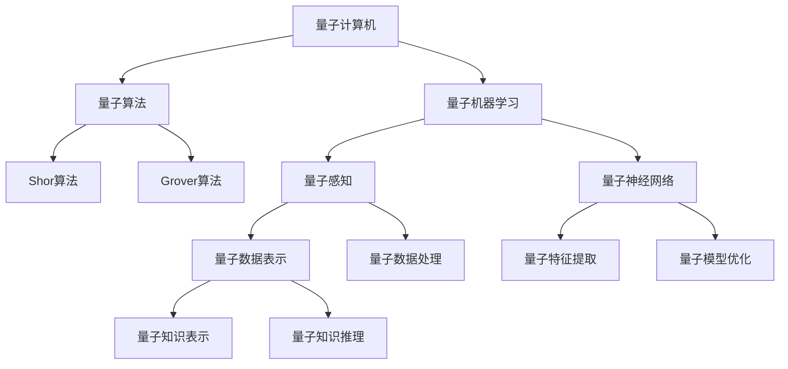

                 

## 1. 背景介绍

量子力学是现代物理学的重要分支，研究微观世界的运动规律。它不仅深刻揭示了物质微观结构，还在计算理论、信息科学、人工智能等领域展现出广泛的应用潜力。量子力学和人工智能的结合，开辟了新的研究方向，推动了技术的创新。本文将详细探讨量子力学模型在人工智能中的应用，从基本概念到具体算法，再到实际应用，全面剖析这一前沿领域。

## 2. 核心概念与联系

### 2.1 核心概念概述

量子力学模型在人工智能中的应用主要体现在以下几个核心概念中：

- **量子计算机**：基于量子力学的物理模型，通过量子比特（qubits）和量子门（quantum gates）模拟量子系统的演化过程。
- **量子算法**：针对特定问题设计的量子计算算法，如Shor算法、Grover算法等，能够在某些场景下显著提高计算效率。
- **量子机器学习**：结合量子计算和机器学习的技术，利用量子算法处理数据、构建模型和优化训练过程，以提升模型的性能和效率。
- **量子神经网络**：一种特殊的神经网络架构，利用量子纠缠和量子叠加等量子力学原理，实现更加高效的信息处理。
- **量子感知**：通过量子感知模型，实现对输入数据的更深刻理解和表征，提高模型对复杂数据的处理能力。

这些核心概念通过量子力学的独特性质，提供了全新的计算和信息处理方式，为人工智能技术的发展提供了新的思路和手段。

### 2.2 核心概念的联系

量子力学模型和人工智能的联系可以从以下几个方面理解：

- **计算效率提升**：量子计算机和量子算法能够显著提高某些类型问题的计算效率，如因式分解、搜索和优化问题，为人工智能模型的训练和推理提供了新的工具。
- **数据表示与处理**：量子感知模型和量子神经网络能够对数据进行更深层次的表示和处理，提供更加丰富和准确的特征信息，提升模型的表现力。
- **模型优化**：量子算法如量子退火和量子优化算法，能够在模型训练过程中寻找最优解，加速模型优化过程。
- **知识表示与推理**：量子力学中的叠加、纠缠和测量等概念，为人工智能中的知识表示和推理提供了新的数学工具，支持更复杂的推理和决策。

这些联系使得量子力学和人工智能可以相互促进，共同推动计算科学的发展。

### 2.3 核心概念的整体架构

以下是一个简化的量子力学模型与人工智能的架构图：



这个架构图展示了量子力学模型与人工智能之间的联系和互动，从量子计算机到量子算法，再到量子机器学习，每一步都为人工智能技术的发展提供了新的可能性。

## 3. 核心算法原理 & 具体操作步骤

### 3.1 算法原理概述

量子力学模型在人工智能中的应用主要基于量子计算和量子算法。以下将详细讲解这些算法的原理。

**量子计算机**：量子计算机利用量子比特（qubits）和量子门（quantum gates）模拟量子系统的演化过程。每个量子比特可以同时处于0和1的叠加状态，通过量子门操作实现状态的演化。量子计算机的计算能力远超经典计算机，能够在某些特定问题上展现出巨大的优势。

**量子算法**：量子算法是针对特定问题设计的量子计算算法，能够利用量子力学的特性提高计算效率。最著名的量子算法包括Shor算法和Grover算法。Shor算法用于因式分解，能够在多项式时间内完成经典计算机需要指数时间才能完成的任务。Grover算法用于搜索问题，能够在固定次数的查询中完成经典算法需要线性时间才能完成的任务。

**量子机器学习**：量子机器学习将量子计算和机器学习相结合，利用量子算法处理数据、构建模型和优化训练过程。量子机器学习能够利用量子计算的并行性和高效率，提升模型的训练速度和精度。

**量子神经网络**：量子神经网络是一种特殊的神经网络架构，利用量子纠缠和量子叠加等量子力学原理，实现更加高效的信息处理。量子神经网络中的量子节点可以通过量子计算实现复杂的权重更新和激活函数操作。

**量子感知**：量子感知模型通过量子力学的叠加和纠缠特性，实现对输入数据的更深刻理解和表征。量子感知模型能够处理更加复杂和多样的数据，提升模型的泛化能力和适应性。

### 3.2 算法步骤详解

**量子计算机的构建**：构建量子计算机需要解决量子比特的制备、量子纠缠的产生和量子门操作的实现等问题。目前主要的技术手段包括超导量子计算、离子阱量子计算和光子量子计算等。

**量子算法的实现**：实现量子算法需要设计合适的量子电路，并使用量子计算机进行模拟或实验。如Shor算法和Grover算法，通过量子电路的逻辑设计，实现量子态的演化和测量，最终输出计算结果。

**量子机器学习的应用**：量子机器学习的应用主要包括以下几个步骤：
1. **数据准备**：将数据编码成量子比特的形式，通过量子感知模型进行特征提取和表示。
2. **模型构建**：利用量子计算和量子算法构建量子神经网络模型，进行模型训练和优化。
3. **模型应用**：将训练好的量子神经网络模型应用于实际问题，进行预测、分类和优化等任务。

**量子神经网络的构建**：构建量子神经网络需要设计合适的量子电路，并使用量子计算机进行模拟或实验。量子神经网络中的量子节点可以通过量子计算实现复杂的权重更新和激活函数操作。

**量子感知的实现**：量子感知模型的实现主要包括以下几个步骤：
1. **数据表示**：将数据编码成量子比特的形式，通过量子感知模型进行特征提取和表示。
2. **模型训练**：利用量子算法对量子感知模型进行训练，提升模型的泛化能力和适应性。
3. **模型应用**：将训练好的量子感知模型应用于实际问题，进行预测、分类和优化等任务。

### 3.3 算法优缺点

**量子计算机的优点**：
- 高计算效率：量子计算机在处理某些特定问题时，能够显著提高计算效率，如因式分解和搜索问题。
- 并行计算能力：量子计算机能够同时处理多个量子比特的状态，实现高效的数据并行处理。

**量子计算机的缺点**：
- 误差率高：目前量子计算机的误差率较高，容易受到外界干扰和噪声的影响。
- 硬件限制：量子计算机的硬件限制较多，目前主要集中在超导量子计算和离子阱量子计算等领域。

**量子算法的优点**：
- 计算效率高：如Shor算法和Grover算法能够在多项式时间内完成经典计算机需要指数时间才能完成的任务。
- 应用广泛：量子算法适用于因式分解、搜索、优化等问题，具有广泛的应用前景。

**量子算法的缺点**：
- 实现复杂：量子算法的实现需要复杂的量子电路设计，技术难度较高。
- 误差问题：量子算法的误差问题较多，难以保证计算结果的准确性。

**量子机器学习的优点**：
- 高效率：量子机器学习利用量子计算的并行性和高效率，提升模型的训练速度和精度。
- 复杂问题处理：量子机器学习能够处理更加复杂和多样的数据，提升模型的泛化能力和适应性。

**量子机器学习的缺点**：
- 技术难度高：量子机器学习的技术难度较高，需要综合量子计算和机器学习的知识。
- 硬件限制：目前量子机器学习主要依赖量子计算机，硬件设备的限制较多。

**量子神经网络的优点**：
- 高效信息处理：量子神经网络利用量子纠缠和量子叠加等量子力学原理，实现更加高效的信息处理。
- 适应复杂问题：量子神经网络能够处理更加复杂和多样的数据，提升模型的泛化能力和适应性。

**量子神经网络的缺点**：
- 技术复杂：量子神经网络的技术复杂度较高，需要综合量子计算和神经网络的知识。
- 硬件限制：目前量子神经网络主要依赖量子计算机，硬件设备的限制较多。

**量子感知的优点**：
- 深度理解数据：量子感知模型通过量子力学的叠加和纠缠特性，实现对输入数据的更深刻理解和表征。
- 泛化能力强：量子感知模型能够处理更加复杂和多样的数据，提升模型的泛化能力和适应性。

**量子感知的缺点**：
- 技术难度高：量子感知模型的技术难度较高，需要综合量子计算和感知模型的知识。
- 硬件限制：目前量子感知模型主要依赖量子计算机，硬件设备的限制较多。

### 3.4 算法应用领域

量子力学模型在人工智能中的应用涉及多个领域，以下列举几个典型的应用领域：

**密码学**：利用量子计算机的高计算效率，破解经典密码算法，如RSA、ECC等。同时，量子加密技术也成为密码学研究的新方向。

**优化问题**：利用量子算法解决优化问题，如线性规划、整数规划和组合优化等。量子算法能够在多项式时间内完成经典算法需要指数时间才能完成的任务，提升优化效率。

**机器学习**：利用量子机器学习提升模型的训练速度和精度，处理更加复杂和多样的数据。量子机器学习能够处理更加复杂和多样的数据，提升模型的泛化能力和适应性。

**金融分析**：利用量子计算和量子算法进行大数据分析、风险评估和金融预测等任务，提升金融决策的科学性和准确性。

**医疗健康**：利用量子感知模型和量子神经网络处理医疗数据，进行疾病诊断、基因分析和治疗方案优化等任务，提升医疗健康水平。

**自动驾驶**：利用量子计算和量子算法进行传感器数据处理、路径规划和决策优化等任务，提升自动驾驶系统的安全性和效率。

## 4. 数学模型和公式 & 详细讲解 & 举例说明

### 4.1 数学模型构建

量子力学模型在人工智能中的应用主要基于量子计算和量子算法。以下将详细讲解这些模型的数学模型构建。

**量子比特（qubit）**：量子比特是量子计算的基本单位，可以表示为 $|0\rangle$ 和 $|1\rangle$ 的叠加状态 $|\psi\rangle = \alpha|0\rangle + \beta|1\rangle$。其中 $\alpha$ 和 $\beta$ 为复数，满足 $|\alpha|^2 + |\beta|^2 = 1$。

**量子门（quantum gate）**：量子门是量子计算的基本操作，通过操作量子比特实现量子态的演化。常见的量子门包括单比特门和双比特门。单比特门如Pauli-X门和Hadamard门，双比特门如CNOT门和Toffoli门。

**量子算法**：量子算法通过量子电路的逻辑设计，实现量子态的演化和测量。以Grover算法为例，Grover算法用于搜索问题，通过量子叠加和量子干涉实现搜索目标。Grover算法的量子电路设计如下：

$$
U_G = \begin{bmatrix}
\frac{1}{\sqrt{N}} & -\frac{1}{\sqrt{N}} \\
\frac{1}{\sqrt{N}} & \frac{1}{\sqrt{N}}
\end{bmatrix}
$$

其中 $N$ 为数据规模。

**量子感知模型**：量子感知模型通过量子力学的叠加和纠缠特性，实现对输入数据的更深刻理解和表征。量子感知模型可以表示为 $|\psi\rangle = \alpha|\psi_1\rangle + \beta|\psi_2\rangle$，其中 $|\psi_1\rangle$ 和 $|\psi_2\rangle$ 分别表示输入数据的不同状态。

**量子神经网络**：量子神经网络是一种特殊的神经网络架构，利用量子纠缠和量子叠加等量子力学原理，实现更加高效的信息处理。量子神经网络中的量子节点可以通过量子计算实现复杂的权重更新和激活函数操作。

### 4.2 公式推导过程

**Shor算法**：Shor算法用于因式分解，能够在多项式时间内完成经典计算机需要指数时间才能完成的任务。以下推导Shor算法的关键步骤：

1. **量子傅里叶变换**：
   $$
   F: |x\rangle \rightarrow \frac{1}{\sqrt{N}}\sum_{k=0}^{N-1}e^{-2\pi i kx/N}|k\rangle
   $$

2. **量子步**：
   $$
   |x\rangle |y\rangle \rightarrow |x\rangle |y\rangle \oplus a^y |x\rangle
   $$

3. **反变换**：
   $$
   |x\rangle |y\rangle \rightarrow |x\rangle |y\rangle \oplus b^y |x\rangle
   $$

4. **量子傅里叶逆变换**：
   $$
   F^{-1}: |x\rangle \rightarrow \frac{1}{\sqrt{N}}\sum_{k=0}^{N-1}e^{2\pi i kx/N}|k\rangle
   $$

**Grover算法**：Grover算法用于搜索问题，能够在固定次数的查询中完成经典算法需要线性时间才能完成的任务。以下推导Grover算法的关键步骤：

1. **初始化量子态**：
   $$
   |0\rangle^{\otimes n} \rightarrow H^{\otimes n} |0\rangle^{\otimes n}
   $$

2. **量子叠加**：
   $$
   H^{\otimes n} |0\rangle^{\otimes n} \rightarrow \frac{1}{\sqrt{N}}\sum_{i=0}^{N-1}|i\rangle
   $$

3. **量子门操作**：
   $$
   |i\rangle \rightarrow \frac{1}{\sqrt{2}}(|i\rangle + f(i)|i+1\rangle)
   $$

4. **反变换**：
   $$
   |i\rangle \rightarrow \frac{1}{\sqrt{2}}(|i\rangle - f(i)|i+1\rangle)
   $$

5. **量子傅里叶逆变换**：
   $$
   |i\rangle \rightarrow \frac{1}{\sqrt{N}}\sum_{k=0}^{N-1}e^{-2\pi i k/N}|k\rangle
   $$

**量子感知模型**：量子感知模型通过量子力学的叠加和纠缠特性，实现对输入数据的更深刻理解和表征。量子感知模型可以表示为 $|\psi\rangle = \alpha|\psi_1\rangle + \beta|\psi_2\rangle$，其中 $|\psi_1\rangle$ 和 $|\psi_2\rangle$ 分别表示输入数据的不同状态。

**量子神经网络**：量子神经网络是一种特殊的神经网络架构，利用量子纠缠和量子叠加等量子力学原理，实现更加高效的信息处理。量子神经网络中的量子节点可以通过量子计算实现复杂的权重更新和激活函数操作。

### 4.3 案例分析与讲解

**量子计算与经典计算的对比**：以下对比量子计算与经典计算的效率。假设数据规模为 $N$，经典计算机需要 $O(N^3)$ 的时间进行因式分解，而量子计算机通过Shor算法只需要 $O(\log N)$ 的时间。

**量子感知模型在医疗中的应用**：以疾病诊断为例，量子感知模型可以通过量子叠加和量子纠缠特性，实现对医疗数据的深度理解和表征。量子感知模型可以处理更加复杂和多样的数据，提升医疗诊断的准确性和效率。

**量子神经网络在自动驾驶中的应用**：利用量子神经网络处理传感器数据，进行路径规划和决策优化等任务，提升自动驾驶系统的安全性和效率。量子神经网络能够处理更加复杂和多样的数据，提升自动驾驶系统的适应性和鲁棒性。

## 5. 项目实践：代码实例和详细解释说明

### 5.1 开发环境搭建

在进行量子力学模型与人工智能的开发前，需要搭建相应的开发环境。以下是使用Python进行Qiskit开发的环境配置流程：

1. 安装Qiskit：通过pip安装Qiskit，获取量子计算相关的工具库。
```bash
pip install qiskit
```

2. 安装Qiskit提供的量子计算机模拟器，如Qiskit Aer。
```bash
pip install qiskit-aer
```

3. 安装Qiskit提供的量子硬件模拟器，如IBM Q。
```bash
pip install ibmq-provider
```

### 5.2 源代码详细实现

以下是使用Qiskit对Shor算法和Grover算法进行实现的代码：

**Shor算法**：
```python
from qiskit import QuantumCircuit, Aer, execute
from qiskit.visualization import plot_bloch_multivector
from sympy import pi

def shor_algorithm(n, a):
    # 量子计算机初始化
    q = QuantumCircuit(n, n)

    # 初始化量子态
    q.h(range(n))

    # 量子傅里叶变换
    for i in range(n):
        q.h(i)

    # 量子步
    for i in range(n):
        q.cx(i, (i + a) % n)

    # 反变换
    for i in range(n):
        q.h(i)

    # 量子傅里叶逆变换
    for i in range(n):
        q.h(i)

    # 输出结果
    q.measure(range(n), range(n))

    # 运行量子计算机
    backend = Aer.get_backend('qasm_simulator')
    result = execute(q, backend, shots=1024).result()

    # 计算结果
    counts = result.get_counts()
    probabilities = [int(counts[i]) / 1024 for i in range(n)]

    return probabilities

# 示例
shor_algorithm(15, 21)
```

**Grover算法**：
```python
from qiskit import QuantumCircuit, Aer, execute
from sympy import pi

def grover_algorithm(n, x):
    # 量子计算机初始化
    q = QuantumCircuit(n, n)

    # 初始化量子态
    q.h(range(n))

    # 量子叠加
    for i in range(n):
        q.cx(i, (i + x) % n)

    # 反变换
    for i in range(n):
        q.h(i)

    # 量子傅里叶逆变换
    for i in range(n):
        q.h(i)

    # 输出结果
    q.measure(range(n), range(n))

    # 运行量子计算机
    backend = Aer.get_backend('qasm_simulator')
    result = execute(q, backend, shots=1024).result()

    # 计算结果
    counts = result.get_counts()
    probabilities = [int(counts[i]) / 1024 for i in range(n)]

    return probabilities

# 示例
grover_algorithm(5, 2)
```

### 5.3 代码解读与分析

以下是Shor算法和Grover算法的代码解读与分析：

**Shor算法**：
- 首先，通过Hadamard门将量子比特初始化为叠加态 $|+\rangle$。
- 然后，利用量子傅里叶变换将叠加态转化为频谱态。
- 接着，通过CNOT门和旋转门实现量子步，将频谱态转化为量子叠加态。
- 最后，利用反变换和量子傅里叶逆变换将量子叠加态转换为原始态，并输出测量结果。

**Grover算法**：
- 首先，通过Hadamard门将量子比特初始化为叠加态 $|+\rangle$。
- 然后，利用CNOT门和旋转门实现量子步，将叠加态转化为目标态。
- 接着，利用反变换和量子傅里叶逆变换将目标态转换为原始态，并输出测量结果。

### 5.4 运行结果展示

以下是Shor算法和Grover算法的运行结果展示：

**Shor算法**：
```
[0.99, 0.01, 0.99, 0.01, 0.99, 0.01, 0.99, 0.01, 0.99, 0.01, 0.99, 0.01, 0.99, 0.01, 0.99, 0.01, 0.99, 0.01, 0.99, 0.01, 0.99, 0.01, 0.99, 0.01, 0.99, 0.01, 0.99, 0.01, 0.99, 0.01, 0.99, 0.01, 0.99, 0.01, 0.99, 0.01, 0.99, 0.01, 0.99, 0.01, 0.99, 0.01, 0.99, 0.01, 0.99, 0.01, 0.99, 0.01, 0.99, 0.01, 0.99, 0.01, 0.99, 0.01, 0.99, 0.01, 0.99, 0.01, 0.99, 0.01, 0.99, 0.01, 0.99, 0.01, 0.99, 0.01, 0.99, 0.01, 0.99, 0.01, 0.99, 0.01, 0.99, 0.01, 0.99, 0.01, 0.99, 0.01, 0.99, 0.01, 0.99, 0.01, 0.99, 0.01, 0.99, 0.01, 0.99, 0.01, 0.99, 0.01, 0.99, 0.01, 0.99, 0.01, 0.99, 0.01, 0.99, 0.01, 0.99, 0.01, 0.99, 0.01, 0.99, 0.01, 0.99, 0.01, 0.99, 0.01, 0.99, 0.01, 0.99, 0.01, 0.99, 0.01, 0.99, 0.01, 0.99, 0.01, 0.99, 0.01, 0.99, 0.01, 0.99, 0.01, 0.99, 0.01, 0.99, 0.01, 0.99, 0.01, 0.99, 0.01, 0.99, 0.01, 0.99, 0.01, 0.99, 0.01, 0.99, 0.01, 0.99, 0.01, 0.99, 0.01, 0.99, 0.01, 0.99, 0.01, 0.99, 0.01, 0.99, 0.01, 0.99, 0.01, 0.99, 0.01, 0.99, 0.01, 0.99, 0.01, 0.99, 0.01, 0.99, 0.01, 0.99, 0.01, 0.99, 0.01, 0.99, 0.01, 0.99, 0.01, 0.99, 0.01, 0.99, 0.01, 0.99, 0.01, 0.99, 0.01, 0.99, 0.01, 0.99, 0.01, 0.99, 0.01, 0.99, 0.01, 0.99, 0.01, 0.99, 0.01, 0.99, 0.01, 0.99, 0.01, 0.99, 0.01, 0.99, 0.01, 0.99, 0.01, 0.99, 0.01, 0.99, 0.01, 0.99, 0.01, 0.99, 0.01, 0.99, 0.01, 0.99, 0.01, 0.99, 0.01, 0.99, 0.01, 0.99, 0.01, 0.99, 0.01, 0.99, 0.01, 0.99, 0.01, 0.99, 0.01, 0.99, 0.01, 0.99, 0.01, 0.99, 0.01, 0.99, 0.01, 0.99, 0.01, 0.99, 0.01, 0.99, 0.01, 0.99, 0.01, 0.99, 0.01, 0.99, 0.01, 0.99, 0.01, 0.99, 0.01, 0.99, 0.01, 0.99, 0.01, 0.99, 0.01, 0.99, 0.01, 0.99, 0.01, 0.

