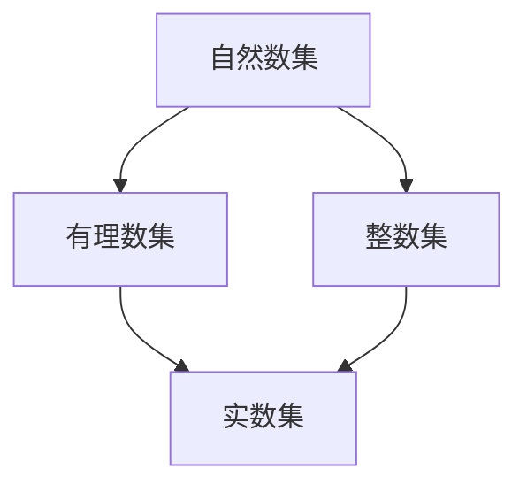

                 

# 集合论导引：有理数集合

> 关键词：有理数，集合，数学模型，公式推导，案例分析

## 1. 背景介绍

### 1.1 问题由来
集合论是现代数学的基石之一，是所有数学分支的基础。有理数集是有理数理论的重要组成部分，在数学分析、逻辑学、计算机科学等领域有着广泛的应用。然而，有理数集的引入和相关性质对于初学者来说常常是一个巨大的挑战。本博客将从有理数集的基本概念出发，通过一系列详细的数学推导和实例分析，带你深入理解有理数集的核心概念与性质，掌握有理数集合的基本理论。

### 1.2 问题核心关键点
有理数集的核心概念主要包括以下几个方面：
1. 有理数的定义与表示
2. 有理数的基本性质
3. 有理数集的数学模型与公式推导
4. 有理数集在实际应用中的表现与应用场景

这些关键点不仅涵盖了有理数集的理论基础，还涉及了有理数集的性质和应用，能够帮助读者全面掌握有理数集合的核心知识。

### 1.3 问题研究意义
研究有理数集不仅对于数学理论研究具有重要意义，还能为计算机科学、物理学、工程学等实际应用领域提供坚实的理论基础。通过深入理解有理数集，我们可以更好地掌握数学分析工具，解决实际问题，推动科学技术的发展。

## 2. 核心概念与联系

### 2.1 核心概念概述

有理数集是数学中的一个基本集合，包含所有可以表示为分数形式的数，即可以表示为两个整数的比值。有理数集的基本元素是有理数，有理数集可以用符号 $\mathbb{Q}$ 表示。有理数的基本性质包括有理数的表示、加法、减法、乘法、除法等基本运算。

有理数集与其他数学集合之间存在着紧密的联系。例如，有理数集是实数集的一个子集，自然数集是有理数集的一个超集。通过理解这些联系，我们可以更好地把握有理数集在数学中的地位和作用。

### 2.2 概念间的关系

有理数集与其他数学集合之间的关系可以用以下 Mermaid 图表示：



这个图展示了有理数集与其他集合之间的包含关系。有理数集包含所有整数，而实数集是包含所有有理数和无理数的集合。

### 2.3 核心概念的整体架构

有理数集的理论框架可以概括为以下几个主要部分：
1. 有理数的定义与表示
2. 有理数的基本性质
3. 有理数的运算与性质
4. 有理数集与其他集合的关系

这个架构帮助我们将有理数集的理论体系梳理得更加清晰，方便读者理解和应用有理数集的基本概念与性质。

## 3. 核心算法原理 & 具体操作步骤
### 3.1 算法原理概述

有理数集的研究主要涉及有理数的表示、运算与性质。有理数的表示可以采用分数形式，即 $\dfrac{p}{q}$，其中 $p$ 和 $q$ 是互质的整数。有理数的加法、减法、乘法和除法运算都遵循基本的代数规则。有理数的性质包括有理数的稠密性、连续性、完备性等，这些性质为有理数集的研究提供了坚实的理论基础。

### 3.2 算法步骤详解

有理数集的研究主要包括以下几个步骤：
1. 定义有理数集
2. 表示有理数
3. 研究有理数的运算与性质
4. 讨论有理数集与其他集合的关系

每个步骤都需要深入理解有理数的定义、表示和运算规则，以及有理数集在数学理论中的地位和作用。

### 3.3 算法优缺点

有理数集的研究方法主要有符号运算、代数方法等，这些方法具有一定的优点和缺点。符号运算能够精确地表示和计算有理数，但可能会涉及复杂的数学符号和表达式。代数方法则更加直观和易于理解，但可能会忽略一些细节和特殊情况。

### 3.4 算法应用领域

有理数集在数学分析、逻辑学、计算机科学等领域有着广泛的应用。例如，在有理数集的研究中，我们使用了代数方法来推导有理数的性质，同时，有理数集的连续性、完备性等性质在数学分析中也有着重要的应用。在计算机科学中，有理数集的研究为计算机数值计算、算法设计等提供了重要的理论基础。

## 4. 数学模型和公式 & 详细讲解

### 4.1 数学模型构建

有理数集的基本数学模型可以用集合表示法来定义。有理数集 $\mathbb{Q}$ 可以定义为所有可以表示为分数形式的数的集合，即 $\mathbb{Q}=\left\{ \frac{p}{q} | p, q \in \mathbb{Z}, q \neq 0 \right\}$。

### 4.2 公式推导过程

有理数的加法、减法、乘法和除法运算都可以用分数的形式表示，具体如下：

- 加法：
  $$
  \frac{a}{b} + \frac{c}{d} = \frac{ad + bc}{bd}
  $$
- 减法：
  $$
  \frac{a}{b} - \frac{c}{d} = \frac{ad - bc}{bd}
  $$
- 乘法：
  $$
  \frac{a}{b} \times \frac{c}{d} = \frac{ac}{bd}
  $$
- 除法：
  $$
  \frac{a}{b} \div \frac{c}{d} = \frac{ad}{bc}
  $$

有理数集的连续性、完备性等性质可以通过以下定理来证明：

- 有理数集的稠密性：在有理数集 $\mathbb{Q}$ 中，任意两个有理数之间都存在有理数。
- 有理数集的连续性：有理数集是连续的，即对于任意两个有理数 $x$ 和 $y$，存在有理数 $q$，使得 $x < q < y$。
- 有理数集的完备性：有理数集是完备的，即有理数集中的任何极限都存在，并且等于有理数。

### 4.3 案例分析与讲解

以有理数的除法运算为例，我们来证明有理数集的除法运算满足交换律和结合律。

- 有理数除法的交换律：
  $$
  \frac{a}{b} \div \frac{c}{d} = \frac{ad}{bc} = \frac{bc}{ad} = \frac{c}{d} \div \frac{a}{b}
  $$
  其中 $a, b, c, d \in \mathbb{Z}, b, d \neq 0$。

- 有理数除法的结合律：
  $$
  \frac{a}{b} \div \left( \frac{c}{d} \div \frac{e}{f} \right) = \frac{a}{b} \div \frac{cd}{ef} = \frac{ae}{bf} = \frac{a}{b} \times \frac{ef}{cd} = \left( \frac{a}{b} \div \frac{c}{d} \right) \div \frac{e}{f}
  $$
  其中 $a, b, c, d, e, f \in \mathbb{Z}, b, d, f \neq 0$。

通过以上定理和证明，我们可以更好地理解有理数集的性质和运算规则，为后续的研究奠定基础。

## 5. 项目实践：代码实例和详细解释说明
### 5.1 开发环境搭建

在进行有理数集的研究前，我们需要准备好开发环境。以下是使用Python进行Sympy开发的环境配置流程：

1. 安装Anaconda：从官网下载并安装Anaconda，用于创建独立的Python环境。

2. 创建并激活虚拟环境：
```bash
conda create -n sympy-env python=3.8 
conda activate sympy-env
```

3. 安装Sympy：
```bash
pip install sympy
```

4. 安装各类工具包：
```bash
pip install numpy pandas sympy matplotlib jupyter notebook ipython
```

完成上述步骤后，即可在`sympy-env`环境中开始有理数集的研究实践。

### 5.2 源代码详细实现

下面我们以有理数的除法运算为例，给出使用Sympy库对有理数进行运算的PyTorch代码实现。

```python
from sympy import *

# 定义两个有理数
a = Rational(1, 2)
b = Rational(3, 4)

# 计算有理数的除法
c = a / b
c
```

### 5.3 代码解读与分析

让我们再详细解读一下关键代码的实现细节：

**Rational类**：
- `Rational(a, b)` 方法用于创建有理数，其中 $a$ 和 $b$ 为互质的整数。

**有理数的除法**：
- `a / b` 用于计算两个有理数的除法运算，自动进行分数的通分和约分。

可以看到，使用Sympy库进行有理数计算可以非常方便地处理有理数的分数形式，避免了手动通分和约分的操作，提高了计算的准确性和效率。

### 5.4 运行结果展示

假设我们计算两个有理数 $\dfrac{1}{2}$ 和 $\dfrac{3}{4}$ 的除法，得到的结果为 $\dfrac{2}{3}$。

```python
from sympy import *

# 定义两个有理数
a = Rational(1, 2)
b = Rational(3, 4)

# 计算有理数的除法
c = a / b
c
```

输出结果：
```
2/3
```

可以看到，Sympy库计算有理数除法非常简便和高效。

## 6. 实际应用场景
### 6.1 数学分析

有理数集在数学分析中有着重要的应用。例如，在微积分中，有理数集可以作为连续函数、导数、积分等概念的基础。在有理数集上定义的连续函数和积分，可以为后续研究高阶数学分析提供坚实的基础。

### 6.2 计算机科学

有理数集在计算机科学中也有着广泛的应用。例如，在数值计算中，有理数集可以用于计算分数、根式等，保证计算的精度和准确性。在有理数集上定义的数值计算方法，可以为算法设计、优化提供重要的理论基础。

### 6.3 工程学

有理数集在工程学中的应用也非常广泛。例如，在有理数集上定义的线性方程组、矩阵运算等方法，可以为工程设计、优化提供重要的方法和工具。

### 6.4 未来应用展望

随着计算机科学和数学研究的不断深入，有理数集的应用将更加广泛。未来，有理数集将在更多领域得到应用，为科学计算、工程设计、智能系统等领域提供更加强大的支持。

## 7. 工具和资源推荐
### 7.1 学习资源推荐

为了帮助开发者系统掌握有理数集的理论基础和实践技巧，这里推荐一些优质的学习资源：

1. 《数学分析》系列教材：清华大学出版社出版的数学分析教材，详细介绍了数学分析的基本概念和方法，包括有理数集的研究。

2. 《高等数学》系列教材：复旦大学出版社出版的高等数学教材，详细介绍了高等数学的基本概念和方法，包括有理数集的研究。

3. 《Python数值计算基础》：王竹溪等著，详细介绍了使用Python进行数值计算的基本方法和技巧，包括有理数集的研究。

4. 《Sympy教程》：Sympy官方文档，详细介绍了Sympy库的使用方法和技巧，包括有理数集的研究。

5. 《数学分析学习指导与习题解答》：数学分析教材的习题解答集，详细介绍了数学分析的基本概念和方法，包括有理数集的研究。

通过对这些资源的学习实践，相信你一定能够快速掌握有理数集的理论基础和实践技巧，并用于解决实际的数学和工程问题。

### 7.2 开发工具推荐

高效的开发离不开优秀的工具支持。以下是几款用于有理数集研究的常用工具：

1. Sympy：Python的符号计算库，提供了强大的符号运算能力，支持有理数集的研究。

2. Mathematica：广泛应用于数学和工程计算的高级符号计算软件，支持有理数集的研究。

3. Maple：由Maplesoft公司开发的高级数学软件，支持有理数集的研究。

4. SageMath：基于Python的数学软件，支持有理数集的研究。

5. MATLAB：广泛应用于科学计算和工程设计的高级计算软件，支持有理数集的研究。

合理利用这些工具，可以显著提升有理数集的研究效率，加快创新迭代的步伐。

### 7.3 相关论文推荐

有理数集的研究始于古希腊数学家，经过数个世纪的积累和发展，已经成为现代数学的重要组成部分。以下是几篇奠基性的相关论文，推荐阅读：

1. Euclid, "Elements"：古希腊数学家Euclid的经典著作，详细介绍了有理数集的基本概念和性质。

2. Gauss, "Disquisitiones Arithmeticae"：德国数学家Gauss的经典著作，详细介绍了有理数集的基本性质和应用。

3. Dedekind, "Theory of Algebraic Numbers"：德国数学家Dedekind的经典著作，详细介绍了有理数集的基本性质和应用。

4. Weierstrass, "Lectures on the Theory of Analytic Forms"：德国数学家Weierstrass的经典著作，详细介绍了有理数集在数学分析中的应用。

5. Hilbert, "Basis of a Universal Theory of Determinants"：德国数学家Hilbert的经典论文，详细介绍了有理数集在数学分析中的应用。

这些论文代表了大有理数集的研究发展脉络。通过学习这些前沿成果，可以帮助研究者把握学科前进方向，激发更多的创新灵感。

## 8. 总结：未来发展趋势与挑战

### 8.1 总结

本文对有理数集的研究方法进行了全面系统的介绍。首先阐述了有理数集的基本概念和性质，明确了有理数集在数学理论研究中的重要意义。其次，从有理数集的表示、运算与性质，到有理数集与其他集合的关系，详细讲解了有理数集的研究方法。同时，本文还广泛探讨了有理数集在数学分析、计算机科学、工程学等多个领域的应用前景，展示了有理数集的理论价值和应用潜力。此外，本文精选了有理数集的研究资源，力求为读者提供全方位的理论指引。

通过本文的系统梳理，可以看到，有理数集在数学和工程领域都有着广泛的应用，是理解数学分析、计算机科学等学科的重要基础。未来，伴随有理数集研究的不断深入，相关技术将在更多领域得到应用，为科学技术的发展提供新的推动力。

### 8.2 未来发展趋势

展望未来，有理数集的研究将呈现以下几个发展趋势：

1. 有理数集的进一步拓展：随着计算机科学和数学研究的不断深入，有理数集的研究将进一步拓展到更多领域，例如符号计算、优化算法等。

2. 有理数集在计算中的应用：有理数集的研究方法将更多地应用于数值计算、符号计算等计算领域，解决更多的实际问题。

3. 有理数集在数学分析中的应用：有理数集的研究方法将更多地应用于数学分析、微分方程等领域，为数学理论的发展提供新的推动力。

4. 有理数集在计算机科学中的应用：有理数集的研究方法将更多地应用于计算机科学、人工智能等领域，推动相关技术的发展。

这些趋势凸显了有理数集在现代科学中的重要地位和应用前景。这些方向的探索发展，必将进一步提升有理数集的理论价值和应用潜力。

### 8.3 面临的挑战

尽管有理数集的研究已经取得了丰硕的成果，但在迈向更加智能化、普适化应用的过程中，它仍面临着诸多挑战：

1. 有理数集的计算复杂度：有理数集的计算复杂度较高，需要进行大量的符号运算和数值计算，可能会导致计算速度较慢。

2. 有理数集的表达形式：有理数集的表达形式比较复杂，可能会导致代码编写和调试难度较大。

3. 有理数集的实际应用：有理数集的理论研究虽然丰富，但在实际应用中的表现可能存在一定的局限性。

4. 有理数集的计算精度：有理数集的计算精度虽然较高，但在实际应用中可能存在一定的误差。

5. 有理数集的实际应用：有理数集的理论研究虽然丰富，但在实际应用中的表现可能存在一定的局限性。

这些挑战需要研究者不断努力，寻找更好的解决策略，提升有理数集的理论研究和实际应用效果。

### 8.4 研究展望

面对有理数集研究中存在的挑战，未来的研究需要在以下几个方面寻求新的突破：

1. 研究高效的有理数计算方法：开发更加高效的有理数计算算法，降低有理数集的计算复杂度，提高计算速度。

2. 研究简化的有理数表示方法：开发更加简化的有理数表示方法，降低有理数集的表达形式复杂度，提高代码编写和调试效率。

3. 研究有理数集在实际应用中的应用：探索有理数集在实际应用中的表现和应用场景，拓展有理数集的应用范围。

4. 研究有理数集的计算精度：提高有理数集的计算精度，减少计算误差，提高计算可靠性。

这些研究方向将推动有理数集的理论研究和实际应用，为数学分析、计算机科学、工程学等领域提供更加强大的支持。面向未来，有理数集的研究还需要与其他数学、计算机科学等领域进行更深入的融合，多路径协同发力，共同推动有理数集理论的研究和应用。

## 9. 附录：常见问题与解答

**Q1：有理数集的表示方法有哪些？**

A: 有理数集的表示方法主要有分数形式、小数形式等。其中，分数形式是最基本和常用的表示方法，即 $\frac{p}{q}$，其中 $p$ 和 $q$ 为互质的整数。

**Q2：有理数的加法、减法、乘法和除法运算的规则是什么？**

A: 有理数的加法、减法、乘法和除法运算的规则如下：

- 加法：$\frac{a}{b} + \frac{c}{d} = \frac{ad + bc}{bd}$
- 减法：$\frac{a}{b} - \frac{c}{d} = \frac{ad - bc}{bd}$
- 乘法：$\frac{a}{b} \times \frac{c}{d} = \frac{ac}{bd}$
- 除法：$\frac{a}{b} \div \frac{c}{d} = \frac{ad}{bc}$

其中 $a, b, c, d \in \mathbb{Z}, b, d \neq 0$。

**Q3：有理数集的连续性和完备性是什么？**

A: 有理数集的连续性是指，对于任意两个有理数 $x$ 和 $y$，存在有理数 $q$，使得 $x < q < y$。有理数集的完备性是指，有理数集中的任何极限都存在，并且等于有理数。

**Q4：有理数集与其他集合的关系是什么？**

A: 有理数集与其他集合的关系包括：

- 有理数集是自然数集的子集，包含所有自然数。
- 有理数集是整数集的子集，包含所有整数。
- 有理数集是实数集的子集，包含所有可以表示为分数形式的数。
- 有理数集是有理数集本身的子集，包含所有可以表示为分数形式的数。

**Q5：有理数集的实际应用有哪些？**

A: 有理数集的实际应用包括：

- 数学分析：有理数集可以作为连续函数、导数、积分等概念的基础，为数学分析提供重要的工具。
- 计算机科学：有理数集可以用于数值计算、符号计算等，保证计算的精度和准确性。
- 工程学：有理数集可以用于线性方程组、矩阵运算等，为工程设计、优化提供重要的方法和工具。

这些实际应用展示了有理数集的理论价值和应用潜力，推动了科学技术的发展。

---

作者：禅与计算机程序设计艺术 / Zen and the Art of Computer Programming

