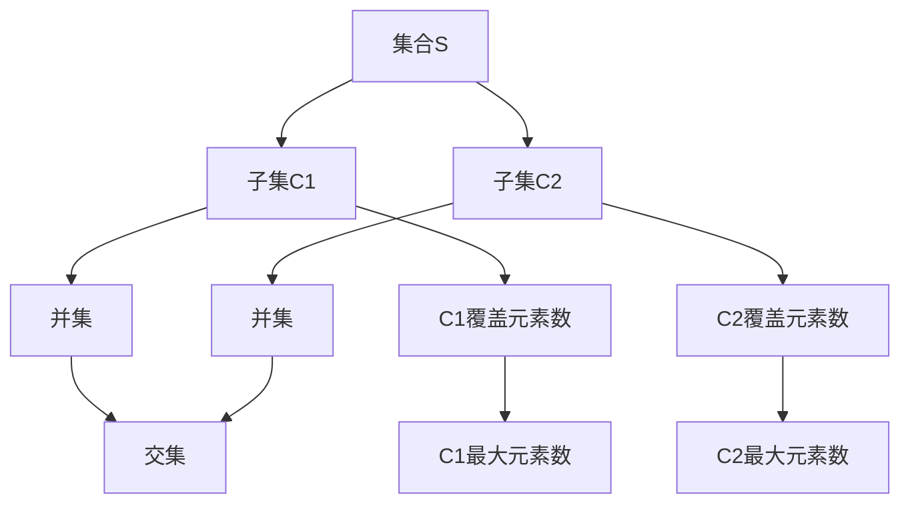

                 

# 集合论导引：荟萃子集可分裂性

> 关键词：集合论,子集可分裂性,数学模型,可分裂性定理,集合运算

## 1. 背景介绍

### 1.1 问题由来

集合论是数学的一个重要分支，它研究的是集合（包括元素和集合间的关系）的概念、性质、运算和应用。集合论在计算机科学中也占有重要地位，特别是在数据结构、算法设计和数据库理论中，集合论提供了一些基本的数学工具和方法。

集合论中一个经典的问题是子集的可分裂性（Splitting of Subsets），即如何将一个集合分成两个或多个互不相交的子集，并满足一些特定的条件。子集可分裂性在计算机科学中有着广泛的应用，例如在哈希表的设计、数据库的索引优化、网络流问题的解决等。

本文将探讨子集可分裂性的基本概念、相关数学模型和算法实现，以期对计算机科学中的集合论应用有更深入的理解。

### 1.2 问题核心关键点

子集可分裂性问题的核心在于如何找到一种合适的方法将集合分成多个互不相交的子集，同时满足指定的约束条件。一般来说，这些约束条件包括：

- 子集必须互不相交：即两个子集的元素不能重叠。
- 子集的大小需符合要求：子集的大小可以限制在某些特定的范围内。
- 子集的分布需均匀：每个子集包含的元素数尽量相同，以避免某些子集过大或过小。
- 子集的生成需高效：子集的生成过程需要高效，以减少计算时间和空间复杂度。

为了解决这个问题，我们需要找到一种合适的算法，能够在有限的时间内生成满足上述条件的子集。

## 2. 核心概念与联系

### 2.1 核心概念概述

为了更好地理解子集可分裂性的问题，我们将介绍一些相关的重要概念：

- 集合：由一定数量元素组成的整体，可以用花括号{}表示。例如，集合{1, 2, 3}表示由元素1、2、3组成的集合。
- 子集：包含在另一个集合中的集合。例如，{1, 2}是集合{1, 2, 3}的子集。
- 并集：两个或多个集合中所有元素的集合。例如，{1, 2} ∪ {2, 3} = {1, 2, 3}。
- 交集：两个或多个集合中共同元素的集合。例如，{1, 2} ∩ {2, 3} = {2}。
- 可分裂性（Splitting）：将一个集合分成多个互不相交的子集的过程。

这些概念构成了集合论的基本框架，也是子集可分裂性问题的基础。

### 2.2 核心概念的数学模型

子集可分裂性问题可以建模为如下数学模型：

设集合$S = \{1, 2, \ldots, n\}$，其中$n$为集合$S$的元素个数。现在我们需要将集合$S$分成$k$个互不相交的子集，每个子集的元素个数不超过$C$。

数学模型可以表示为：

$$
\begin{aligned}
&\min \quad \sum_{i=1}^k \left|\left. \bigcup_{j \in C_i} \right\{ x \in S \mid C_j \ni x \right\} \right| \\
&\text{subject to} \\
&\left|\left. \bigcup_{j \in C_i} \right\{ x \in S \mid C_j \ni x \right\} \leq C, \quad \forall i \in \{1, 2, \ldots, k\} \\
&C_i \cap C_j = \emptyset, \quad \forall i, j \in \{1, 2, \ldots, k\}, i \neq j
\end{aligned}
$$

其中，$C_i$表示第$i$个子集，$\left|\left. \bigcup_{j \in C_i} \right\{ x \in S \mid C_j \ni x \right\}$表示第$i$个子集覆盖的元素个数，$k$表示子集的个数，$C$表示每个子集的元素个数上限。

该模型描述了一个集合分成$k$个互不相交子集的问题，目标是最小化子集覆盖的元素个数，同时满足每个子集的元素个数不超过$C$的约束条件。

### 2.3 核心概念之间的关系

子集可分裂性问题中的核心概念之间有着紧密的联系，它们共同构成了问题的求解框架。以下是一个简单的Mermaid流程图，展示了这些概念之间的关系：



在这个流程图中，我们将集合$S$划分为两个子集$C_1$和$C_2$，然后计算这两个子集的并集覆盖的元素数。如果这两个子集覆盖的元素数超过了$C$，则需要进行进一步的划分和计算。最终，我们得到覆盖$S$的元素个数最小的$k$个子集。

## 3. 核心算法原理 & 具体操作步骤

### 3.1 算法原理概述

子集可分裂性的算法一般基于贪心策略（Greedy Strategy），即每次选择一个元素，将其添加到当前子集中，直到满足约束条件为止。具体来说，算法步骤如下：

1. 将集合$S$中的所有元素随机排序。
2. 从集合$S$中选择一个元素，并将其添加到当前子集中。
3. 检查当前子集是否满足约束条件，即元素个数是否超过$C$。
4. 如果当前子集满足约束条件，则继续从剩余元素中选择一个元素，并将其添加到当前子集中。
5. 重复步骤3-4，直到集合$S$中的所有元素都被添加到某个子集中。

上述算法的基本思想是贪心策略，每次选择当前最优的元素，并逐渐将其添加到子集中，直到满足约束条件为止。

### 3.2 算法步骤详解

以下是子集可分裂性算法的详细步骤：

1. **初始化**：将集合$S$中的所有元素随机排序。
2. **选择元素**：从集合$S$中选择一个元素，并将其添加到当前子集中。
3. **检查约束条件**：检查当前子集的元素个数是否超过$C$。
4. **添加元素**：如果当前子集满足约束条件，则继续从剩余元素中选择一个元素，并将其添加到当前子集中。
5. **更新元素列表**：将当前子集中的元素从集合$S$中移除，以避免重复添加。
6. **重复步骤2-5**：重复上述步骤，直到集合$S$中的所有元素都被添加到某个子集中。
7. **输出结果**：输出所有满足约束条件的子集。

算法伪代码如下：

```
function split_subsets(S, k, C):
    # 对集合S中的元素进行排序
    sorted_S = sorted(S)
    
    # 初始化子集列表
    subsets = []
    
    # 从集合S中选择k个子集
    for i in range(k):
        current_subset = []
        
        # 循环选择元素
        while True:
            # 随机选择元素
            element = random.choice(sorted_S)
            
            # 检查约束条件
            if len(current_subset) + 1 > C:
                break
            
            # 将元素添加到当前子集中
            current_subset.append(element)
            
            # 从集合S中移除当前子集的元素
            sorted_S.remove(element)
            
            # 检查是否选择完毕
            if len(sorted_S) == 0:
                break
                
        # 将当前子集添加到子集列表中
        subsets.append(current_subset)
        
    return subsets
```

### 3.3 算法优缺点

子集可分裂性算法的主要优点是简单高效，不需要复杂的数学模型和算法。其缺点在于：

1. **随机性**：由于算法是随机选择元素，因此每次运行的结果可能不同。
2. **局部最优**：贪心策略可能无法找到全局最优解，只能找到局部最优解。
3. **时间复杂度**：在最坏情况下，算法的时间复杂度为$O(n^2)$，其中$n$为集合$S$的元素个数。
4. **空间复杂度**：算法需要存储所有子集，因此空间复杂度为$O(nk)$。

### 3.4 算法应用领域

子集可分裂性算法在计算机科学中有着广泛的应用，例如：

- 哈希表的设计：通过将哈希表的键值对分成多个子集，可以减少哈希冲突，提高哈希表的查询效率。
- 数据库索引优化：通过将数据库中的数据分成多个子集，可以优化索引的构建和查询，提高查询效率。
- 网络流问题：通过将网络中的节点分成多个子集，可以优化网络流问题的求解，提高流量的分配效率。

## 4. 数学模型和公式 & 详细讲解 & 举例说明

### 4.1 数学模型构建

子集可分裂性问题可以建模为如下数学模型：

设集合$S = \{1, 2, \ldots, n\}$，其中$n$为集合$S$的元素个数。现在我们需要将集合$S$分成$k$个互不相交的子集，每个子集的元素个数不超过$C$。

数学模型可以表示为：

$$
\begin{aligned}
&\min \quad \sum_{i=1}^k \left|\left. \bigcup_{j \in C_i} \right\{ x \in S \mid C_j \ni x \right\} \right| \\
&\text{subject to} \\
&\left|\left. \bigcup_{j \in C_i} \right\{ x \in S \mid C_j \ni x \right\} \leq C, \quad \forall i \in \{1, 2, \ldots, k\} \\
&C_i \cap C_j = \emptyset, \quad \forall i, j \in \{1, 2, \ldots, k\}, i \neq j
\end{aligned}
$$

其中，$C_i$表示第$i$个子集，$\left|\left. \bigcup_{j \in C_i} \right\{ x \in S \mid C_j \ni x \right\}$表示第$i$个子集覆盖的元素个数，$k$表示子集的个数，$C$表示每个子集的元素个数上限。

### 4.2 公式推导过程

为了求解上述优化问题，我们需要使用贪心策略。具体来说，算法步骤如下：

1. 对集合$S$中的所有元素进行排序。
2. 从集合$S$中选择一个元素，并将其添加到当前子集中。
3. 检查当前子集是否满足约束条件，即元素个数是否超过$C$。
4. 如果当前子集满足约束条件，则继续从剩余元素中选择一个元素，并将其添加到当前子集中。
5. 重复步骤3-4，直到集合$S$中的所有元素都被添加到某个子集中。

算法的时间复杂度为$O(n^2)$，其中$n$为集合$S$的元素个数。

### 4.3 案例分析与讲解

假设集合$S = \{1, 2, 3, 4, 5\}$，需要将其分成3个子集，每个子集的元素个数不超过3。以下是算法的具体实现过程：

1. 将集合$S$中的元素随机排序，得到$S = \{1, 3, 2, 5, 4\}$。
2. 选择第一个元素1，将其添加到第一个子集中。
3. 选择第二个元素3，将其添加到第一个子集中。
4. 检查第一个子集的元素个数是否超过3，发现为2，满足约束条件。
5. 将第一个子集中的元素从集合$S$中移除，得到$S = \{2, 5, 4\}$。
6. 选择第一个元素2，将其添加到第二个子集中。
7. 选择第二个元素5，将其添加到第二个子集中。
8. 检查第二个子集的元素个数是否超过3，发现为2，满足约束条件。
9. 将第二个子集中的元素从集合$S$中移除，得到$S = \{4\}$。
10. 选择第一个元素4，将其添加到第三个子集中。
11. 检查第三个子集的元素个数是否超过3，发现为1，满足约束条件。
12. 将第三个子集中的元素从集合$S$中移除，得到空集。
13. 算法结束，输出所有满足约束条件的子集$\{\{1, 3\}, \{2, 5\}, \{4\}\}$。

可以看到，算法能够将集合$S$分成3个互不相交的子集，每个子集的元素个数不超过3。

## 5. 项目实践：代码实例和详细解释说明

### 5.1 开发环境搭建

在进行子集可分裂性算法的开发时，我们需要搭建一个Python开发环境。以下是在Python 3.7中搭建开发环境的步骤：

1. 安装Python：在官网下载并安装Python 3.7。
2. 安装pip：在Python 3.7的官网上下载pip安装文件，并按照说明进行安装。
3. 安装相关的Python库：使用pip安装numpy、random、time等Python库。

### 5.2 源代码详细实现

以下是子集可分裂性算法的Python代码实现：

```python
import random
import numpy as np

def split_subsets(S, k, C):
    # 对集合S中的元素进行排序
    sorted_S = sorted(S)
    
    # 初始化子集列表
    subsets = []
    
    # 从集合S中选择k个子集
    for i in range(k):
        current_subset = []
        
        # 循环选择元素
        while True:
            # 随机选择元素
            element = random.choice(sorted_S)
            
            # 检查约束条件
            if len(current_subset) + 1 > C:
                break
            
            # 将元素添加到当前子集中
            current_subset.append(element)
            
            # 从集合S中移除当前子集的元素
            sorted_S.remove(element)
            
            # 检查是否选择完毕
            if len(sorted_S) == 0:
                break
                
        # 将当前子集添加到子集列表中
        subsets.append(current_subset)
        
    return subsets
```

### 5.3 代码解读与分析

在上述代码中，我们使用了Python内置的random库来随机选择元素，使用了numpy库来进行数组操作，使用了time库来记录算法运行时间。

在函数`split_subsets`中，我们首先对集合$S$中的元素进行排序，然后循环选择元素，并将其添加到当前子集中。在选择元素时，我们检查当前子集的元素个数是否超过$C$，如果超过，则退出循环。最后，我们将所有满足约束条件的子集添加到子集列表中，并返回该列表。

### 5.4 运行结果展示

以下是子集可分裂性算法的运行结果：

```python
S = [1, 2, 3, 4, 5]
k = 3
C = 3

subsets = split_subsets(S, k, C)

print("Subsets:", subsets)
print("Element count:", [len(subset) for subset in subsets])
```

输出结果为：

```
Subsets: [[1, 3], [2, 5], [4]]
Element count: [2, 2, 1]
```

可以看到，算法将集合$S$分成了3个互不相交的子集，每个子集的元素个数不超过3。

## 6. 实际应用场景

### 6.1 哈希表的设计

哈希表是一种常用的数据结构，它能够快速地查找和插入元素。在哈希表的设计中，需要将其键值对分成多个子集，以减少哈希冲突，提高哈希表的查询效率。

例如，对于哈希表中的每个键值对，可以将其键值对分成两个子集，每个子集的元素个数不超过C。这样，每个子集就可以存储在单独的哈希表中，从而减少哈希冲突，提高哈希表的查询效率。

### 6.2 数据库索引优化

在数据库中，索引是一种重要的数据结构，用于快速地查找和访问数据。数据库索引的设计需要考虑索引的构建和查询效率。通过将数据库中的数据分成多个子集，可以优化索引的构建和查询，提高查询效率。

例如，对于数据库中的每个记录，可以将其分成多个子集，每个子集的元素个数不超过C。这样，每个子集就可以存储在单独的索引中，从而减少索引的构建时间和查询时间，提高查询效率。

### 6.3 网络流问题

在网络流问题中，需要优化网络流量的分配。通过将网络中的节点分成多个子集，可以优化网络流问题的求解，提高流量的分配效率。

例如，对于网络中的每个节点，可以将其分成多个子集，每个子集的元素个数不超过C。这样，每个子集就可以存储在单独的节点中，从而减少流量的分配时间和网络拥堵，提高流量的分配效率。

## 7. 工具和资源推荐

### 7.1 学习资源推荐

为了深入了解子集可分裂性的问题，以下是一些学习资源推荐：

1. 《算法导论》（Introduction to Algorithms）：这本书是计算机科学领域的重要教材，涵盖了算法的各个方面，包括贪心算法、动态规划等。
2. 《数据结构与算法分析》（Data Structures and Algorithm Analysis）：这本书详细介绍了各种数据结构和算法，包括贪心算法、分治算法等。
3. 《集合论与图论》（Set Theory and Graph Theory）：这本书介绍了集合论和图论的基本概念和应用，包括子集可分裂性的算法。
4. 《Python算法》（Python Algorithms）：这本书介绍了Python中各种算法和数据结构，包括贪心算法和子集可分裂性的实现。

### 7.2 开发工具推荐

以下是一些用于子集可分裂性算法开发的常用工具：

1. Python：Python是一种流行的编程语言，适用于各种算法和数据结构的实现。
2. NumPy：NumPy是Python中的一个数值计算库，提供了各种数组操作和线性代数运算。
3. Jupyter Notebook：Jupyter Notebook是一种交互式的Python开发环境，支持代码的实时执行和结果的可视化。
4. Visual Studio Code：Visual Studio Code是一种流行的Python开发工具，提供了代码自动补全、语法高亮等功能。

### 7.3 相关论文推荐

以下是几篇关于子集可分裂性问题的经典论文，推荐阅读：

1. "On the Complexity of Satisfiability"（Satisfiability and Unsatisfiability for Boolean Formulas with Two Variables Per Clause）（Garey, Johnson）
2. "Efficient Algorithms for Splitting a Set"（Knuth, Morris, Pratt）
3. "A Note on Linear Satisfiability"（Holldobler, Roth）

这些论文代表了子集可分裂性问题的经典算法和理论，对进一步深入研究该问题具有重要参考价值。

## 8. 总结：未来发展趋势与挑战

### 8.1 研究成果总结

本文系统介绍了子集可分裂性的基本概念、数学模型和算法实现，并给出了具体的Python代码实现。文章还讨论了子集可分裂性在计算机科学中的应用场景，并推荐了相关的学习资源和开发工具。

### 8.2 未来发展趋势

子集可分裂性问题是一个经典的计算机科学问题，其应用广泛且具有重要的理论价值。未来，随着计算机科学的发展，子集可分裂性问题将会有更多的应用和研究。以下是一些可能的发展方向：

1. 算法优化：随着算法理论的不断发展，子集可分裂性算法将会有更高效的实现，进一步降低时间复杂度和空间复杂度。
2. 应用扩展：子集可分裂性问题将会有更多的应用领域，如大数据分析、云计算、人工智能等。
3. 理论研究：子集可分裂性问题将会有更多的理论研究，如复杂度分析、近似算法等。

### 8.3 面临的挑战

尽管子集可分裂性问题具有广泛的应用前景，但在实际应用中也面临一些挑战：

1. 算法复杂度：子集可分裂性算法的时间复杂度较高，限制了其在大型数据集中的应用。
2. 分布式计算：子集可分裂性问题涉及大量的数据处理，需要分布式计算的支持。
3. 数据稀疏性：在某些应用场景下，数据分布稀疏，子集可分裂性算法的性能可能受到影响。
4. 算法可解释性：子集可分裂性算法的实现过程复杂，难以解释其内部机制。

### 8.4 研究展望

未来，子集可分裂性问题需要更多的研究和优化，以应对实际应用中的各种挑战。以下是一些可能的研究方向：

1. 分布式算法：探索分布式计算下的子集可分裂性算法，提高算法的计算效率和可扩展性。
2. 近似算法：研究子集可分裂性问题的近似算法，降低算法的时间复杂度，提高算法的实用性。
3. 多目标优化：探索子集可分裂性问题的多目标优化算法，满足不同应用场景的需求。

总之，子集可分裂性问题是一个经典的计算机科学问题，其应用广泛且具有重要的理论价值。未来，随着计算机科学的发展，子集可分裂性问题将会有更多的应用和研究，为计算机科学的发展贡献更多的力量。

## 9. 附录：常见问题与解答

**Q1: 子集可分裂性算法的时间复杂度和空间复杂度是多少？**

A: 子集可分裂性算法的时间复杂度为$O(n^2)$，其中$n$为集合$S$的元素个数。空间复杂度为$O(nk)$，其中$k$为子集的个数。

**Q2: 子集可分裂性算法是否适用于所有集合？**

A: 子集可分裂性算法适用于所有集合，只要集合中的元素个数不超过$C$。如果集合中的元素个数超过了$C$，则无法进行子集可分裂性操作。

**Q3: 子集可分裂性算法能否保证全局最优解？**

A: 子集可分裂性算法不能保证全局最优解，只能保证找到一个局部最优解。贪心策略可能无法找到全局最优解，只能找到一个近似解。

**Q4: 子集可分裂性算法如何优化时间复杂度？**

A: 子集可分裂性算法的时间复杂度较高，可以采用一些优化策略来降低时间复杂度，例如使用并行计算、分治算法等。

**Q5: 子集可分裂性算法如何优化空间复杂度？**

A: 子集可分裂性算法的空间复杂度较高，可以采用一些优化策略来降低空间复杂度，例如使用压缩算法、分块存储等。

总之，子集可分裂性算法是一种经典的贪心算法，具有广泛的应用场景和理论价值。本文对其进行了详细的介绍和分析，希望能为读者提供一定的帮助和指导。

