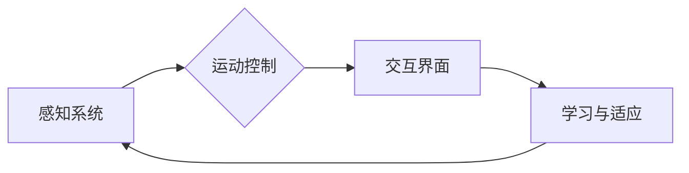

# AI Agent: AI的下一个风口 具身智能的定义与特点

> 关键词：AI Agent, 具身智能, 人工智能, 机器人, 强化学习, 感知系统, 交互界面, 智能代理

## 1. 背景介绍

随着人工智能技术的快速发展，我们见证了从简单的规则系统到复杂的深度学习模型的一系列变革。然而，尽管人工智能在图像识别、语言处理等领域取得了显著成就，但它们仍然缺乏与人类相似的学习、感知和交互能力。近年来，一种被称为“具身智能”的概念逐渐成为研究热点，它旨在构建能够与物理世界互动的智能代理（AI Agent）。本文将深入探讨具身智能的定义、特点以及其在人工智能领域的应用前景。

### 1.1 问题的由来

传统的AI系统通常被设计为“黑盒”，它们在虚拟环境中运行，缺乏对现实世界的直接感知和交互能力。这种限制限制了AI系统在实际场景中的应用，例如在复杂的工业环境、医疗领域或家庭服务中。具身智能的提出，正是为了解决这一瓶颈，通过赋予AI系统感知、运动和交互的能力，使其能够更好地理解和适应真实世界。

### 1.2 研究现状

具身智能的研究涵盖了多个学科，包括机器人学、认知科学、人工智能和神经科学。目前，研究人员正在探索以下关键技术：

- **感知系统**：使用传感器（如摄像头、激光雷达、触觉传感器等）来获取环境信息。
- **运动控制**：设计能够执行复杂任务的机器人控制算法。
- **强化学习**：训练AI代理在动态环境中学习最优行为。
- **交互界面**：开发能够理解人类语言和指令的交互系统。

### 1.3 研究意义

具身智能的研究具有深远的意义：

- **推动人工智能技术的发展**：通过将AI系统与物理世界结合，可以推动人工智能技术的创新，并拓展其应用领域。
- **改善人类生活质量**：具身智能可以用于开发辅助机器人、智能家居系统、以及医疗康复设备，从而改善人类的生活质量。
- **促进跨学科研究**：具身智能的研究需要多学科的合作，有助于推动跨学科研究的发展。

### 1.4 本文结构

本文将分为以下章节：

- **核心概念与联系**：介绍具身智能的定义、特点和相关技术。
- **核心算法原理 & 具体操作步骤**：探讨具身智能的关键技术和实现方法。
- **数学模型和公式**：介绍具身智能中的数学模型和公式。
- **项目实践**：提供具体的代码实例和实现步骤。
- **实际应用场景**：探讨具身智能在各个领域的应用。
- **未来应用展望**：展望具身智能的发展趋势和潜在挑战。
- **工具和资源推荐**：推荐学习资源、开发工具和相关论文。
- **总结**：总结研究成果，并展望未来研究方向。

## 2. 核心概念与联系

### 2.1 具身智能的定义

具身智能（Embodied AI）是指通过将人工智能系统与物理实体（如机器人）结合，使AI系统具备感知、运动和交互的能力，从而使其能够像人类一样理解和适应物理世界。

### 2.2 具身智能的特点

- **感知能力**：能够通过传感器感知环境信息，如视觉、听觉、触觉等。
- **运动能力**：能够控制物理实体进行运动，如移动、抓取、操作等。
- **交互能力**：能够与人类或其他智能代理进行交互，理解语言和指令。
- **适应性**：能够适应不断变化的环境和任务。

### 2.3 Mermaid 流程图



在上述流程图中，感知系统获取环境信息，运动控制系统根据这些信息控制物理实体的动作，交互界面使AI系统能够与人类或其他智能代理进行交流，学习与适应系统则使AI系统能够从经验中学习并改进其行为。

## 3. 核心算法原理 & 具体操作步骤

### 3.1 算法原理概述

具身智能的核心算法包括：

- **感知系统**：使用机器视觉、传感器融合等技术获取环境信息。
- **运动控制**：使用运动规划、控制理论等技术控制物理实体的动作。
- **强化学习**：使用强化学习算法训练AI代理在动态环境中学习最优行为。
- **交互界面**：使用自然语言处理、语音识别等技术理解人类语言和指令。

### 3.2 算法步骤详解

1. **感知**：通过传感器收集环境信息，如使用摄像头获取图像，使用激光雷达获取距离信息等。
2. **感知处理**：对感知数据进行预处理，如图像去噪、特征提取等。
3. **运动规划**：根据感知信息和任务目标，规划物理实体的运动路径和动作序列。
4. **运动执行**：控制物理实体执行规划的运动路径和动作序列。
5. **交互**：使用自然语言处理技术理解人类语言和指令，并生成相应的语言或动作反馈。
6. **学习与适应**：使用强化学习等技术从经验中学习并改进AI代理的行为。

### 3.3 算法优缺点

**优点**：

- 能够使AI系统更好地理解和适应物理世界。
- 能够实现更复杂、更智能的行为。
- 能够与人类和其他智能代理进行交互。

**缺点**：

- 技术难度高，需要跨学科的知识和技术。
- 对硬件和软件的要求较高。
- 需要大量的训练数据和计算资源。

### 3.4 算法应用领域

- **机器人**：工业机器人、服务机器人、娱乐机器人等。
- **自动驾驶**：自动驾驶汽车、无人机等。
- **智能家居**：智能家电、智能家庭助理等。
- **医疗领域**：康复机器人、手术机器人等。

## 4. 数学模型和公式

### 4.1 数学模型构建

具身智能的数学模型包括：

- **感知模型**：使用图像处理、信号处理等方法描述传感器数据。
- **运动模型**：使用运动学、动力学等方法描述物理实体的运动。
- **强化学习模型**：使用马尔可夫决策过程（MDP）、策略梯度等方法描述学习过程。

### 4.2 公式推导过程

以下是一个简单的感知模型的例子：

$$
I(t) = f(\text{Sensory Input}(t))
$$

其中，$I(t)$ 是在时间 $t$ 收集的传感器数据，$\text{Sensory Input}(t)$ 是传感器输入，$f$ 是感知函数，用于将传感器输入转换为感知数据。

### 4.3 案例分析与讲解

以自动驾驶为例，感知模型可以使用以下公式来描述：

$$
\text{Sensor Data}(t) = \text{Camera}(t) + \text{Lidar}(t) + \text{Radar}(t)
$$

其中，$\text{Sensor Data}(t)$ 是在时间 $t$ 收集的传感器数据，$\text{Camera}(t)$、$\text{Lidar}(t)$ 和 $\text{Radar}(t)$ 分别是摄像头、激光雷达和雷达传感器在时间 $t$ 的输出。

## 5. 项目实践：代码实例和详细解释说明

### 5.1 开发环境搭建

为了实现具身智能项目，我们需要以下开发环境：

- 操作系统：Linux或Windows
- 编程语言：Python
- 深度学习框架：TensorFlow或PyTorch
- 机器人操作系统：ROS（可选）

### 5.2 源代码详细实现

以下是一个简单的Python代码示例，展示了如何使用ROS和TensorFlow构建一个简单的机器人感知系统：

```python
import rospy
from sensor_msgs.msg import Image
from cv_bridge import CvBridge
import cv2

class RobotPerception:
    def __init__(self):
        self.bridge = CvBridge()
        rospy.init_node('robot_perception', anonymous=True)
        self.image_sub = rospy.Subscriber("/camera/image", Image, self.image_callback)
    
    def image_callback(self, msg):
        image = self.bridge.imgmsg_to_cv2(msg, desired_encoding='bgr8')
        # 处理图像，例如：目标检测、跟踪等
        # ...
        cv2.imshow('Robot Perception', image)
        cv2.waitKey(1)

if __name__ == '__main__':
    perception = RobotPerception()
    rospy.spin()
```

### 5.3 代码解读与分析

在上述代码中，我们定义了一个名为`RobotPerception`的类，用于从摄像头接收图像并进行处理。`__init__`方法初始化了ROS节点、摄像头订阅者和CvBridge对象。`image_callback`方法处理接收到的图像消息，将其转换为OpenCV图像格式，并对其进行处理。最后，我们创建了一个`RobotPerception`实例，并调用`rospy.spin()`方法启动ROS节点。

### 5.4 运行结果展示

运行上述代码后，我们可以在OpenCV窗口中看到从摄像头接收到的实时图像。接下来，我们可以根据需要添加目标检测、跟踪等算法，使机器人能够更好地理解周围环境。

## 6. 实际应用场景

### 6.1 工业机器人

工业机器人是具身智能的一个重要应用场景。通过赋予机器人感知、运动和交互的能力，可以提高生产效率，降低人工成本。

### 6.2 自动驾驶

自动驾驶汽车是另一个具有巨大潜力的应用场景。通过将感知、运动和交互技术应用于汽车，可以实现完全自动化的驾驶体验。

### 6.3 智能家居

智能家居系统可以集成具身智能技术，实现更智能、更便捷的家庭生活体验。

## 7. 未来应用展望

随着技术的不断发展，具身智能将在更多领域得到应用，例如：

- **医疗领域**：开发能够辅助医生进行手术的机器人。
- **教育领域**：开发能够教授学生的智能教育机器人。
- **娱乐领域**：开发能够与人类互动的虚拟角色。

## 8. 工具和资源推荐

### 8.1 学习资源推荐

- **书籍**：
  - 《机器人学导论》（Introduction to Robotics）
  - 《深度学习》（Deep Learning）
  - 《强化学习》（Reinforcement Learning: An Introduction）
- **在线课程**：
  - Coursera上的《机器学习》课程
  - Udacity上的《机器人工程师纳米学位》课程

### 8.2 开发工具推荐

- **深度学习框架**：TensorFlow、PyTorch
- **机器人操作系统**：ROS
- **传感器数据集**：KITTI、Cityscapes、COCO

### 8.3 相关论文推荐

- **感知系统**：
  - "Learning Deep Features for Robot Navigation"
  - "Visual servoing by learning a correspondence"
- **运动控制**：
  - "Efficient Motion Planning for Manipulators"
  - "Control of a Robot Manipulator by Learning an Inverse Kinematics Map"
- **强化学习**：
  - "Deep Reinforcement Learning for Autonomous Navigation"
  - "Policy Gradient Methods for Reinforcement Learning"

## 9. 总结：未来发展趋势与挑战

### 9.1 研究成果总结

具身智能是人工智能领域的一个重要研究方向，它旨在构建能够与物理世界互动的智能代理。通过将感知、运动和交互技术应用于物理实体，我们可以开发出更智能、更安全的机器人系统。

### 9.2 未来发展趋势

- **多模态感知**：结合多种传感器数据，提高AI代理的环境感知能力。
- **多智能体协同**：使多个AI代理能够协同工作，完成更复杂的任务。
- **人机交互**：开发更加自然、直观的人机交互界面。

### 9.3 面临的挑战

- **技术挑战**：多模态感知、运动控制和强化学习等领域仍存在技术难题。
- **伦理挑战**：如何确保AI代理的行为符合伦理道德标准。
- **安全挑战**：如何确保AI代理在执行任务时的安全性。

### 9.4 研究展望

具身智能是人工智能领域的下一个风口，它将推动人工智能技术的进一步发展，并为人类创造更加美好的未来。

---

作者：禅与计算机程序设计艺术 / Zen and the Art of Computer Programming