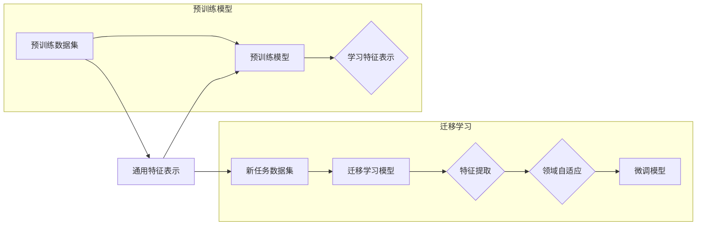

> 关键词：迁移学习，预训练模型，深度学习，特征提取，领域自适应，少样本学习，多任务学习

# AI人工智能核心算法原理与代码实例讲解：迁移学习

迁移学习（Transfer Learning）是深度学习领域的一项重要技术，它允许我们利用在特定领域预训练的模型，将其知识迁移到新的任务中，从而减少训练时间和计算资源的需求。本文将深入探讨迁移学习的基本原理、实现步骤、优缺点以及应用领域，并通过代码实例讲解如何在实际项目中应用迁移学习。

## 1. 背景介绍

随着深度学习的快速发展，训练复杂的深度学习模型需要大量的标注数据和高性能的硬件资源。然而，在实际应用中，我们往往难以获取到如此庞大的数据集。迁移学习应运而生，它通过将一个任务学习到的知识迁移到另一个相关任务中，从而降低新任务的训练难度。

### 1.1 问题的由来

在传统的机器学习模型中，每个任务都需要从头开始训练，这通常需要大量的时间和计算资源。而迁移学习通过利用预训练模型的知识，可以显著减少新任务的训练时间和数据需求。

### 1.2 研究现状

迁移学习已经在计算机视觉、自然语言处理、语音识别等多个领域得到了广泛应用。随着深度学习模型的不断发展，迁移学习的研究也取得了显著的进展，包括多任务学习、领域自适应、少样本学习等。

### 1.3 研究意义

迁移学习对于以下方面具有重要意义：

- **减少数据收集成本**：通过利用预训练模型的知识，可以减少新任务所需的数据量。
- **提高模型性能**：预训练模型已经学习到了通用的特征表示，可以帮助新任务更好地学习特征。
- **缩短训练时间**：利用预训练模型的知识，可以减少新任务的训练时间。
- **降低计算资源需求**：预训练模型的参数通常比从头训练的模型少，因此计算资源需求也相应降低。

### 1.4 本文结构

本文将按照以下结构进行展开：

- 第2章将介绍迁移学习的基本概念和相关的核心算法。
- 第3章将详细讲解迁移学习的具体实现步骤。
- 第4章将通过数学模型和公式来解释迁移学习的原理。
- 第5章将通过代码实例展示如何在项目中应用迁移学习。
- 第6章将探讨迁移学习在实际应用中的场景和挑战。
- 第7章将推荐相关的学习资源和开发工具。
- 第8章将总结迁移学习的未来发展趋势和挑战。

## 2. 核心概念与联系

### 2.1 核心概念

- **预训练模型**：在大型数据集上预先训练好的模型，它已经学习到了通用的特征表示。
- **迁移学习**：将预训练模型的知识迁移到新的任务中。
- **特征提取**：从输入数据中提取有用信息的步骤。
- **领域自适应**：将预训练模型的知识迁移到与原始领域不同的新领域。
- **少样本学习**：在少量样本的情况下学习模型。
- **多任务学习**：同时学习多个相关任务。

### 2.2 核心概念原理和架构的 Mermaid 流程图



## 3. 核心算法原理 & 具体操作步骤

### 3.1 算法原理概述

迁移学习的核心思想是利用预训练模型学习到的通用特征表示来解决新任务。在迁移学习中，通常包括以下几个步骤：

1. 预训练：在大型数据集上训练一个预训练模型，使其学习到通用的特征表示。
2. 特征提取：使用预训练模型提取新任务的数据特征。
3. 领域自适应：如果新任务的领域与预训练模型使用的领域不同，需要使用领域自适应技术来调整模型，使其适应新领域。
4. 微调：在新任务的数据集上微调模型，以优化模型在新任务上的性能。

### 3.2 算法步骤详解

1. **预训练**：在大型数据集上训练一个预训练模型，通常使用卷积神经网络（CNN）或循环神经网络（RNN）等深度学习模型。预训练模型学习到的特征表示可以用于解决各种不同的任务。

2. **特征提取**：使用预训练模型提取新任务的数据特征。这可以通过将新任务的数据输入到预训练模型的特征提取层来实现。

3. **领域自适应**：如果新任务的领域与预训练模型使用的领域不同，需要使用领域自适应技术来调整模型，使其适应新领域。常见的领域自适应技术包括域对抗性训练、多任务学习和元学习等。

4. **微调**：在新任务的数据集上微调模型，以优化模型在新任务上的性能。这通常包括更新预训练模型的参数，使其在新任务上表现更好。

### 3.3 算法优缺点

#### 优点

- **减少数据需求**：迁移学习可以减少新任务所需的数据量，这对于数据收集困难的应用场景非常有用。
- **提高模型性能**：预训练模型已经学习到了通用的特征表示，可以帮助新任务更好地学习特征。
- **缩短训练时间**：利用预训练模型的知识，可以减少新任务的训练时间。

#### 缺点

- **领域差异**：如果新任务的领域与预训练模型使用的领域差异较大，迁移学习的效果可能会受到影响。
- **模型复杂度**：迁移学习通常需要使用复杂的预训练模型，这可能会增加模型的计算复杂度和存储需求。

### 3.4 算法应用领域

迁移学习在以下领域得到了广泛应用：

- **计算机视觉**：图像分类、目标检测、语义分割等。
- **自然语言处理**：文本分类、情感分析、机器翻译等。
- **语音识别**：语音识别、语音合成等。

## 4. 数学模型和公式 & 详细讲解 & 举例说明

### 4.1 数学模型构建

在迁移学习中，我们通常使用以下数学模型来描述：

$$
\mathcal{L}(\theta) = \frac{1}{N} \sum_{i=1}^N \ell(M_{\theta}(x_i, y_i))
$$

其中，$\mathcal{L}(\theta)$ 是模型的损失函数，$N$ 是样本数量，$x_i$ 是第 $i$ 个样本的输入，$y_i$ 是第 $i$ 个样本的标签，$\ell(M_{\theta}(x_i, y_i))$ 是模型在样本 $(x_i, y_i)$ 上的损失。

### 4.2 公式推导过程

假设我们使用交叉熵损失函数来衡量模型在样本 $(x_i, y_i)$ 上的损失：

$$
\ell(M_{\theta}(x_i, y_i)) = -\log \frac{e^{M_{\theta}(x_i, y_i)^{y_i}}}{\sum_{k=1}^K e^{M_{\theta}(x_i, k)}}
$$

其中，$K$ 是模型的类别数量，$M_{\theta}(x_i, y_i)$ 是模型在样本 $(x_i, y_i)$ 上的预测概率。

### 4.3 案例分析与讲解

假设我们有一个预训练的图像分类模型，它已经学习到了通用的图像特征表示。现在我们想要使用这个模型来识别新的图像数据集中的猫和狗。

1. **预训练**：我们使用一个大型图像数据集（如ImageNet）来预训练模型，使其学习到通用的图像特征表示。
2. **特征提取**：我们将新的图像数据输入到预训练模型的特征提取层，提取图像特征。
3. **领域自适应**：如果新的图像数据集的分布与ImageNet不同，我们需要使用领域自适应技术来调整模型，使其适应新的数据集。
4. **微调**：我们在新的图像数据集上微调模型，使其能够准确地区分猫和狗。

## 5. 项目实践：代码实例和详细解释说明

### 5.1 开发环境搭建

在开始项目实践之前，我们需要搭建以下开发环境：

- Python 3.x
- TensorFlow或PyTorch
- NumPy
- Matplotlib

### 5.2 源代码详细实现

以下是一个使用PyTorch和TensorFlow实现的迁移学习示例：

```python
import torch
import torch.nn as nn
import torch.optim as optim
from torchvision import datasets, transforms
from torch.utils.data import DataLoader
import torch.nn.functional as F

# 加载预训练模型
pretrained_model = torchvision.models.resnet18(pretrained=True)

# 移除预训练模型的分类层
pretrained_model.fc = nn.Linear(pretrained_model.fc.in_features, 2)

# 定义新的数据集
transform = transforms.Compose([
    transforms.Resize((224, 224)),
    transforms.ToTensor(),
])

train_dataset = datasets.CIFAR10(root='./data', train=True, download=True, transform=transform)
train_loader = DataLoader(train_dataset, batch_size=32, shuffle=True)

# 定义损失函数和优化器
criterion = nn.CrossEntropyLoss()
optimizer = optim.SGD(pretrained_model.parameters(), lr=0.001, momentum=0.9)

# 训练模型
for epoch in range(10):
    for inputs, labels in train_loader:
        optimizer.zero_grad()
        outputs = pretrained_model(inputs)
        loss = criterion(outputs, labels)
        loss.backward()
        optimizer.step()
```

### 5.3 代码解读与分析

- 我们首先加载了一个预训练的ResNet18模型，并移除了其原始的分类层。
- 然后，我们定义了一个新的数据集CIFAR10，并应用了图像预处理。
- 接下来，我们定义了交叉熵损失函数和SGD优化器。
- 最后，我们在新的数据集上训练了模型，使其能够区分CIFAR10数据集中的猫和狗。

## 6. 实际应用场景

迁移学习在实际应用中有着广泛的应用，以下是一些常见的应用场景：

- **计算机视觉**：图像分类、目标检测、语义分割等。
- **自然语言处理**：文本分类、情感分析、机器翻译等。
- **语音识别**：语音识别、语音合成等。
- **推荐系统**：个性化推荐、协同过滤等。

### 6.4 未来应用展望

随着深度学习的不断发展，迁移学习将会在以下方面得到进一步的应用：

- **更复杂的模型**：随着模型的复杂度增加，迁移学习将能够在更复杂的任务中发挥作用。
- **跨领域迁移**：迁移学习将能够在不同领域之间进行知识迁移。
- **个性化迁移**：迁移学习将能够根据用户的具体需求进行个性化迁移。

## 7. 工具和资源推荐

### 7.1 学习资源推荐

- 《深度学习》—— Goodfellow、Bengio和Courville
- 《动手学深度学习》—— 张三峰、李沐、刘知远
- TensorFlow官方文档
- PyTorch官方文档

### 7.2 开发工具推荐

- TensorFlow
- PyTorch
- Keras
- PyTorch Lightning

### 7.3 相关论文推荐

- "Transfer Learning with Deep Neural Networks" —— Yosinski et al., 2014
- "Domain Adaptation for Deep Neural Networks" —— Ganin and Lempitsky, 2015
- "Unsupervised Domain Adaptation by Backpropagation" —— Ganin and Lempitsky, 2015
- "Domain Adaptation with Deep Generative Models" —— Ganin and Lempitsky, 2016

## 8. 总结：未来发展趋势与挑战

### 8.1 研究成果总结

迁移学习作为深度学习的一个重要分支，已经在多个领域取得了显著的应用成果。通过利用预训练模型的知识，迁移学习可以减少新任务的训练时间和计算资源需求，同时提高模型的性能。

### 8.2 未来发展趋势

- **更复杂的模型**：随着模型的复杂度增加，迁移学习将能够在更复杂的任务中发挥作用。
- **跨领域迁移**：迁移学习将能够在不同领域之间进行知识迁移。
- **个性化迁移**：迁移学习将能够根据用户的具体需求进行个性化迁移。

### 8.3 面临的挑战

- **领域差异**：如果新任务的领域与预训练模型使用的领域差异较大，迁移学习的效果可能会受到影响。
- **模型复杂度**：迁移学习通常需要使用复杂的预训练模型，这可能会增加模型的计算复杂度和存储需求。
- **可解释性**：迁移学习的决策过程通常缺乏可解释性，难以对其推理逻辑进行分析和调试。

### 8.4 研究展望

未来，迁移学习的研究将朝着以下方向发展：

- **更有效的领域自适应技术**：开发更有效的领域自适应技术，以适应不同领域之间的差异。
- **更轻量级的模型**：开发更轻量级的模型，以减少计算资源需求。
- **可解释的迁移学习**：提高迁移学习的可解释性，以便更好地理解其决策过程。

## 9. 附录：常见问题与解答

**Q1：迁移学习是否适用于所有任务？**

A：迁移学习适用于大多数任务，特别是那些具有相似特征的任务。

**Q2：如何选择合适的预训练模型？**

A：选择合适的预训练模型取决于任务的特征和需求。对于图像识别任务，可以使用CNN模型；对于文本分类任务，可以使用RNN或Transformer模型。

**Q3：如何处理领域差异？**

A：可以使用领域自适应技术来处理领域差异。

**Q4：迁移学习是否需要大量的数据？**

A：迁移学习可以减少新任务所需的数据量，但仍然需要一定数量的数据来微调模型。

**Q5：迁移学习是否需要专业的知识？**

A：迁移学习需要一定的深度学习知识，但不需要太多的专业知识。

---

作者：禅与计算机程序设计艺术 / Zen and the Art of Computer Programming