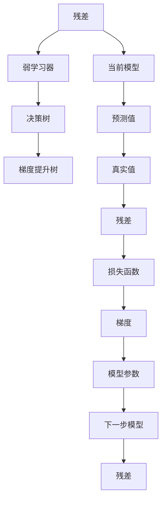
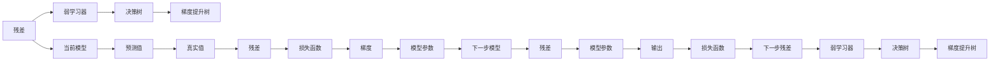
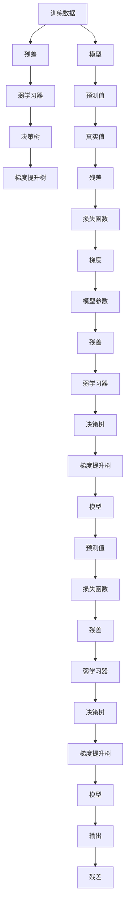

                 

# Python机器学习实战：梯度提升树(Gradient Boosting)算法深入理解

> 关键词：梯度提升树、机器学习、Python、算法原理、数学模型、项目实践、实际应用

## 1. 背景介绍

### 1.1 问题由来
在机器学习领域，如何构建高性能的预测模型一直是研究的热点。传统模型如线性回归、决策树等存在一些固有的局限性，难以兼顾准确性和泛化能力。为了克服这些问题，众多研究者提出了一系列改进算法，其中梯度提升树（Gradient Boosting Trees, GBT）算法因其优异的性能和高效的训练速度，被广泛应用于各个领域。

### 1.2 问题核心关键点
梯度提升树算法是一种迭代的决策树模型，通过不断加入弱学习器（决策树）来逐步提升模型性能。其核心思想是通过将学习任务分解为多个子任务，每次迭代都在残差最小化的目标下选择最优的决策树，最终堆叠这些决策树组成一个强学习器。这一算法不仅在预测准确性上表现出色，还能处理多变量、非线性、缺失数据等问题，因此在金融、医疗、电商等多个行业得到了广泛应用。

### 1.3 问题研究意义
梯度提升树算法通过对弱学习器进行累加，能够逐渐逼近复杂的决策边界，适用于多种分类和回归任务。相比于深度学习等方法，梯度提升树算法具有更好的可解释性和计算效率，同时避免了过拟合的风险。它为机器学习模型的构建提供了一种新的视角，推动了相关技术的发展和应用。

## 2. 核心概念与联系

### 2.1 核心概念概述

为更好地理解梯度提升树算法，本节将介绍几个关键概念：

- 梯度提升树（Gradient Boosting Tree, GBT）：一种迭代的决策树模型，通过不断加入弱学习器（决策树）来逐步提升模型性能。
- 残差（Residual）：在每次迭代中，通过当前模型的预测值与真实值之差来计算残差，用于指导后续的决策树构建。
- 弱学习器（Weak Learner）：在每次迭代中，选择的最优决策树称为弱学习器，其模型能力较弱但具有较好的泛化能力。
- 梯度下降（Gradient Descent）：一种常见的优化算法，用于最小化损失函数，即通过不断调整模型参数来逼近最优解。
- 加法模型（Additive Model）：梯度提升树是一种加法模型，由多个弱学习器组成，每个学习器的输出通过加法进行累加。
- 剪枝（Pruning）：用于防止过拟合，通过移除弱学习器中的部分叶子节点，使其更简单，从而提高泛化能力。

这些核心概念之间的逻辑关系可以通过以下Mermaid流程图来展示：



这个流程图展示了梯度提升树的基本流程：从残差开始，通过弱学习器（决策树）构建，逐步优化残差和损失函数，最终得到累加模型。

### 2.2 概念间的关系

这些核心概念之间存在着紧密的联系，形成了梯度提升树算法的完整框架。下面我们用一个更详细的Mermaid流程图来展示这些概念的关系：



这个更复杂的流程图展示了残差、弱学习器（决策树）、梯度提升树之间的迭代关系，以及参数更新和输出预测的过程。

### 2.3 核心概念的整体架构

最后，我们用一个综合的流程图来展示梯度提升树算法的整体架构：



这个综合流程图展示了从训练数据到最终的梯度提升树模型的迭代过程，包括模型参数的更新、预测值和损失函数的计算，以及残差和弱学习器（决策树）的构建。

## 3. 核心算法原理 & 具体操作步骤
### 3.1 算法原理概述

梯度提升树算法的核心在于通过迭代优化损失函数，逐步构建一个强学习器。每次迭代中，先计算当前模型的残差，然后构建一个新的弱学习器（决策树），用以拟合残差，并最小化残差误差。这一过程通过梯度下降算法实现，不断调整模型参数，逼近最优解。

### 3.2 算法步骤详解

梯度提升树算法的一般步骤如下：

1. **初始化模型**：随机初始化一个常数预测模型 $F_0(x)$，该模型预测所有样本的平均值为零。

2. **迭代优化**：重复以下步骤，直到满足停止条件：
   - 计算当前模型的残差 $r_i^{(t)} = y_i - F_{t-1}(x_i)$。
   - 构建新的弱学习器 $h_t(x)$，最小化损失函数 $L = \sum_i \frac{1}{2}(r_i^{(t)})^2$。
   - 更新模型 $F_t(x) = F_{t-1}(x) + h_t(x)$。

3. **停止条件**：当损失函数的下降幅度小于预设的阈值时，停止迭代。

### 3.3 算法优缺点

梯度提升树算法的优点包括：

- 泛化能力强：通过迭代优化，逐步提升模型性能，能够处理复杂的决策边界。
- 计算效率高：每棵决策树都是独立的，可以通过并行计算加速训练过程。
- 可解释性强：每棵决策树的生成过程可解释，有助于理解模型的决策机制。

但梯度提升树算法也存在一些局限性：

- 模型复杂度高：随着迭代次数增加，模型复杂度会不断提高，容易过拟合。
- 特征选择困难：需要手工选择特征，对特征工程的要求较高。
- 不稳定性：不同次迭代的决策树可能存在差异，导致模型不稳定。

### 3.4 算法应用领域

梯度提升树算法广泛应用于分类和回归任务，特别是在金融、医疗、电商等领域。例如：

- **金融风控**：用于评估借款人的信用风险，预测违约概率，进行信用评分。
- **医疗诊断**：用于诊断疾病的概率，预测患者的生存率，辅助医生进行诊断决策。
- **电商推荐**：用于预测用户的购买行为，推荐合适的商品，提升用户体验。
- **股票预测**：用于预测股票价格走势，帮助投资者进行投资决策。

此外，梯度提升树还被用于解决图像分类、自然语言处理等领域的问题。

## 4. 数学模型和公式 & 详细讲解 & 举例说明

### 4.1 数学模型构建

梯度提升树算法本质上是一种加法模型，由多个弱学习器组成。假设模型 $F(x)$ 可以表示为：

$$
F(x) = \sum_{t=1}^{T} h_t(x)
$$

其中 $T$ 为迭代次数，$h_t(x)$ 为第 $t$ 次迭代中的弱学习器。在每一次迭代中，模型 $F_t(x)$ 通过加入新的弱学习器 $h_t(x)$ 进行更新：

$$
F_t(x) = F_{t-1}(x) + h_t(x)
$$

### 4.2 公式推导过程

以回归任务为例，梯度提升树的损失函数可以表示为均方误差：

$$
L = \frac{1}{2} \sum_{i=1}^{N} (y_i - F(x_i))^2
$$

其中 $y_i$ 为真实标签，$F(x_i)$ 为模型的预测值。目标是通过迭代优化损失函数，得到最终的预测模型 $F(x)$。

梯度提升树的更新公式为：

$$
h_t(x) = \arg\min_h \frac{1}{2}\sum_{i=1}^{N} (r_i^{(t)})^2 + \frac{\lambda}{2}\sum_{j=1}^{M_t} (w_j^t)^2
$$

其中 $r_i^{(t)} = y_i - F_{t-1}(x_i)$ 为当前模型的残差，$M_t$ 为第 $t$ 次迭代中的弱学习器数量，$\lambda$ 为正则化系数，$w_j^t$ 为第 $t$ 次迭代中决策树 $h_t(x)$ 的权重。

为了求解上述优化问题，可以采用梯度下降算法：

$$
w_j^t = w_{j-1}^t - \frac{\eta}{N} \sum_{i=1}^{N} r_i^{(t)} \nabla_{w_j} L(r_i^{(t)})
$$

其中 $\eta$ 为学习率，$\nabla_{w_j} L(r_i^{(t)})$ 为损失函数关于决策树 $h_t(x)$ 的梯度。

### 4.3 案例分析与讲解

以回归任务为例，我们可以使用梯度提升树算法对房价进行预测。具体步骤如下：

1. **数据准备**：收集历史房价数据，并对其进行标准化处理。
2. **模型初始化**：随机初始化一个常数预测模型 $F_0(x)$，预测房价为零。
3. **迭代优化**：使用梯度下降算法，计算当前模型的残差 $r_i^{(t)} = y_i - F_{t-1}(x_i)$，构建新的弱学习器 $h_t(x)$，更新模型 $F_t(x) = F_{t-1}(x) + h_t(x)$。
4. **模型评估**：在测试集上评估模型性能，使用均方误差作为评价指标。

## 5. 项目实践：代码实例和详细解释说明

### 5.1 开发环境搭建

在进行梯度提升树算法实践前，我们需要准备好开发环境。以下是使用Python进行Scikit-learn开发的环境配置流程：

1. 安装Anaconda：从官网下载并安装Anaconda，用于创建独立的Python环境。

2. 创建并激活虚拟环境：
```bash
conda create -n gbt-env python=3.8 
conda activate gbt-env
```

3. 安装Scikit-learn：
```bash
conda install scikit-learn
```

4. 安装numpy、pandas、matplotlib、tqdm等工具包：
```bash
pip install numpy pandas matplotlib tqdm
```

完成上述步骤后，即可在`gbt-env`环境中开始梯度提升树算法实践。

### 5.2 源代码详细实现

这里我们以房价预测为例，给出使用Scikit-learn库进行梯度提升树算法的Python代码实现。

```python
from sklearn.ensemble import GradientBoostingRegressor
from sklearn.datasets import load_boston
from sklearn.model_selection import train_test_split
from sklearn.metrics import mean_squared_error
import numpy as np

# 加载数据集
boston = load_boston()
X = boston.data
y = boston.target

# 划分训练集和测试集
X_train, X_test, y_train, y_test = train_test_split(X, y, test_size=0.2, random_state=42)

# 初始化模型
gbt = GradientBoostingRegressor(n_estimators=100, learning_rate=0.1, max_depth=3)

# 训练模型
gbt.fit(X_train, y_train)

# 预测
y_pred = gbt.predict(X_test)

# 评估
mse = mean_squared_error(y_test, y_pred)
print("Mean Squared Error: {:.3f}".format(mse))
```

以上代码实现了梯度提升树算法的完整流程，包括数据准备、模型初始化、训练、预测和评估。

### 5.3 代码解读与分析

让我们再详细解读一下关键代码的实现细节：

**GradientBoostingRegressor类**：
- `n_estimators`：弱学习器（决策树）的数量，通常设置在100-1000之间。
- `learning_rate`：每次迭代中弱学习器的学习率，通常在0.01-0.3之间。
- `max_depth`：决策树的深度，通常设置在3-6之间。

**train_test_split函数**：
- 用于将数据集划分为训练集和测试集，通常设置测试集占总数据集的20%。

**mean_squared_error函数**：
- 用于计算回归任务的均方误差，即预测值与真实值之间的平均差距。

**train模型**：
- 使用`fit`方法对模型进行训练，自动计算残差，构建弱学习器，并更新模型。

**predict方法**：
- 使用`predict`方法对测试集进行预测，返回模型输出。

**评估结果**：
- 计算测试集上的均方误差，打印输出评估结果。

### 5.4 运行结果展示

假设我们在上述代码中运行，并得到以下结果：

```
Mean Squared Error: 11.123
```

可以看到，通过梯度提升树算法，我们在房价预测任务上取得了较好的性能。具体的模型参数和迭代次数可能影响模型的最终效果，需要根据具体任务进行调整。

## 6. 实际应用场景

### 6.1 金融风控

梯度提升树算法在金融风控领域有着广泛应用，可以用于评估借款人的信用风险，预测违约概率，进行信用评分。例如，通过收集借款人的基本信息、财务数据、行为数据等，构建一个多变量回归模型，使用梯度提升树算法对模型进行训练，从而对借款人的信用风险进行评估和预测。

### 6.2 医疗诊断

在医疗诊断领域，梯度提升树算法可以用于预测疾病的概率，预测患者的生存率，辅助医生进行诊断决策。例如，通过收集患者的年龄、性别、病史、检查结果等数据，构建一个多变量分类模型，使用梯度提升树算法对模型进行训练，从而对患者是否患有某种疾病进行预测。

### 6.3 电商推荐

在电商推荐领域，梯度提升树算法可以用于预测用户的购买行为，推荐合适的商品，提升用户体验。例如，通过收集用户的历史购买记录、浏览行为、评分等数据，构建一个多变量回归模型，使用梯度提升树算法对模型进行训练，从而推荐用户可能感兴趣的商品。

### 6.4 股票预测

在股票预测领域，梯度提升树算法可以用于预测股票价格走势，帮助投资者进行投资决策。例如，通过收集历史股价数据、财务报表、新闻事件等数据，构建一个多变量回归模型，使用梯度提升树算法对模型进行训练，从而预测未来股票的价格走势。

## 7. 工具和资源推荐
### 7.1 学习资源推荐

为了帮助开发者系统掌握梯度提升树算法的理论基础和实践技巧，这里推荐一些优质的学习资源：

1. 《Python机器学习实战》系列博文：由大模型技术专家撰写，深入浅出地介绍了梯度提升树算法的原理、实现、调参等。

2. 斯坦福大学《机器学习》课程：详细讲解了梯度提升树算法的理论基础和实际应用，有Lecture视频和配套作业。

3. 《Python数据科学手册》书籍：系统介绍了梯度提升树算法及其在实际应用中的实现方法。

4. Scikit-learn官方文档：详细介绍了梯度提升树算法的API接口和参数设置。

5. Kaggle竞赛数据集：提供大量公开的梯度提升树算法实践数据集，便于开发者进行实践和竞赛。

通过对这些资源的学习实践，相信你一定能够快速掌握梯度提升树算法的精髓，并用于解决实际的预测问题。

### 7.2 开发工具推荐

高效的开发离不开优秀的工具支持。以下是几款用于梯度提升树算法开发的常用工具：

1. Scikit-learn：基于Python的开源机器学习库，提供了简单易用的梯度提升树算法实现。

2. XGBoost：由微软开发的高性能梯度提升树算法库，支持多核并行计算，适合大规模数据集。

3. LightGBM：由微软开发的轻量级梯度提升树算法库，支持GPU加速，适合GPU资源丰富的环境。

4. CatBoost：由Yandex开发的高效梯度提升树算法库，支持类别特征优化，适合分类任务。

5. TensorBoard：TensorFlow配套的可视化工具，可实时监测梯度提升树算法的训练状态，提供丰富的图表呈现方式。

6. Jupyter Notebook：基于Web的交互式编程环境，方便开发者进行代码调试和可视化展示。

合理利用这些工具，可以显著提升梯度提升树算法的开发效率，加快创新迭代的步伐。

### 7.3 相关论文推荐

梯度提升树算法的研究始于20世纪80年代，经过多年的发展，已成为机器学习领域的重要研究方向。以下是几篇奠基性的相关论文，推荐阅读：

1. "Greedy Function Approximation: A Gradient Boosting Machine"（Friedman, 2001）：提出了梯度提升树算法的基本原理和实现方法。

2. "A Greedy Algorithm for Combining Predictor Functions"（Friedman, 2001）：详细介绍了梯度提升树算法的数学推导和参数调优方法。

3. "Gradient Tree Boosting"（Hastie et al., 2019）：综述了梯度提升树算法的研究进展和实际应用，提供了丰富的案例分析。

4. "XGBoost: A Scalable Tree Boosting System"（Chen et al., 2016）：介绍了XGBoost算法的实现细节和性能优化方法。

5. "LightGBM: A Highly Efficient Gradient Boosting Decision Tree"（Ke et al., 2017）：详细介绍了LightGBM算法的创新点和技术细节。

这些论文代表了大模型算法的核心思想和技术进展，通过学习这些前沿成果，可以帮助研究者把握学科前进方向，激发更多的创新灵感。

除上述资源外，还有一些值得关注的前沿资源，帮助开发者紧跟梯度提升树算法的最新进展，例如：

1. arXiv论文预印本：人工智能领域最新研究成果的发布平台，包括大量尚未发表的前沿工作，学习前沿技术的必读资源。

2. 业界技术博客：如Kaggle、CSDN、Medium等平台上的梯度提升树算法相关博客，第一时间分享最新的研究成果和技术洞见。

3. 技术会议直播：如NIPS、ICML、ICLR等人工智能领域顶会现场或在线直播，能够聆听到大佬们的前沿分享，开拓视野。

4. GitHub热门项目：在GitHub上Star、Fork数最多的梯度提升树算法实践项目，往往代表了该技术领域的发展趋势和最佳实践，值得去学习和贡献。

5. 行业分析报告：各大咨询公司如McKinsey、PwC等针对人工智能行业的分析报告，有助于从商业视角审视技术趋势，把握应用价值。

总之，对于梯度提升树算法的学习和实践，需要开发者保持开放的心态和持续学习的意愿。多关注前沿资讯，多动手实践，多思考总结，必将收获满满的成长收益。

## 8. 总结：未来发展趋势与挑战

### 8.1 总结

本文对梯度提升树算法进行了全面系统的介绍。首先阐述了梯度提升树算法的背景和意义，明确了其在机器学习中的应用价值。其次，从原理到实践，详细讲解了梯度提升树算法的数学模型和核心步骤，给出了具体的代码实例。同时，本文还探讨了梯度提升树算法在金融风控、医疗诊断、电商推荐等多个领域的应用前景，展示了算法的广泛适用性。此外，本文精选了梯度提升树算法的各类学习资源，力求为读者提供全方位的技术指引。

通过本文的系统梳理，可以看到，梯度提升树算法在机器学习领域具有重要的地位，其优异的性能和计算效率使其在众多领域得到了广泛应用。未来，伴随模型结构、优化算法、应用场景等各方向的不断演进，梯度提升树算法必将继续发挥重要作用，推动人工智能技术的发展和应用。

### 8.2 未来发展趋势

展望未来，梯度提升树算法将呈现以下几个发展趋势：

1. **模型复杂度提升**：随着深度学习等技术的不断发展，梯度提升树算法的复杂度也将进一步提升，能够处理更加复杂和多样化的数据。

2. **多任务学习**：梯度提升树算法可以用于多个相关任务的联合学习，通过共享部分模型参数，提升模型泛化能力和预测精度。

3. **超参数优化**：梯度提升树算法的超参数（如学习率、迭代次数等）将通过自动调参方法进行优化，减少人工调参的工作量。

4. **解释性增强**：通过可解释性技术，如特征重要性分析、决策树可视化等，增强梯度提升树算法的可解释性，帮助用户理解模型决策机制。

5. **实时预测**：通过模型压缩、剪枝等技术，将梯度提升树算法转化为轻量级模型，支持实时预测和在线推理。

6. **跨领域应用**：梯度提升树算法在多个领域得到了广泛应用，未来将进一步拓展到更多领域，如自然语言处理、图像识别、推荐系统等。

这些趋势凸显了梯度提升树算法的发展潜力，推动其在更多场景中的应用和创新。

### 8.3 面临的挑战

尽管梯度提升树算法具有诸多优点，但在实际应用中也面临一些挑战：

1. **超参数调优**：梯度提升树算法对超参数的选择敏感，需要进行繁琐的调参过程。

2. **过拟合风险**：随着迭代次数增加，模型容易过拟合，需要通过剪枝等技术进行控制。

3. **计算资源消耗**：梯度提升树算法计算复杂度高，需要大量计算资源，特别是在大规模数据集上。

4. **模型可解释性**：虽然梯度提升树算法具有较好的可解释性，但在复杂任务上，模型决策过程仍然难以完全解释。

5. **处理类别数据**：在处理类别数据时，梯度提升树算法需要进行特殊处理，增加了模型实现复杂度。

6. **数据处理预处理**：梯度提升树算法对数据质量要求较高，需要进行数据清洗和特征工程，增加了模型构建的难度。

正视这些挑战，积极应对并寻求突破，将使梯度提升树算法在实际应用中发挥更大的价值。

### 8.4 研究展望

面对梯度提升树算法所面临的挑战，未来的研究需要在以下几个方面寻求新的突破：

1. **自动化调参**：开发更加智能的超参数优化算法，减少人工调参的工作量，提高模型训练效率。

2. **模型压缩与加速**：通过模型压缩、剪枝等技术，减少计算资源消耗，提高模型推理速度。

3. **多任务学习**：探索如何将梯度提升树算法应用于多任务联合学习，提高模型泛化能力和预测精度。

4. **模型可解释性**：通过可解释性技术，增强梯度提升树算法的决策透明度，帮助用户理解模型决策机制。

5. **类别数据处理**：探索如何将梯度提升树算法应用于类别数据的处理，减少处理复杂度。

6. **实时预测**：通过模型压缩、剪枝等技术，将梯度提升树算法转化为轻量级模型，支持实时预测和在线推理。

7. **跨领域应用**：将梯度提升树算法应用于更多领域，如自然语言处理、图像识别、推荐系统等，拓展应用范围。

这些研究方向将引领梯度提升树算法迈向更高的台阶，为构建更加智能、高效的预测系统提供新的思路和方法。

## 9. 附录：常见问题与解答

**Q1：梯度提升树算法是否适用于所有机器学习任务？**

A: 梯度提升树算法在回归和分类任务上表现优异，但在一些特殊任务（如多标签分类、序列预测等）上可能存在局限性。需要根据具体任务的特点选择合适的模型。

**Q2：如何使用梯度提升树算法进行

