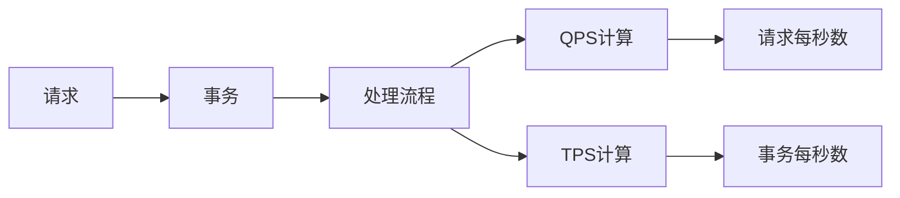

                 

## 1. 背景介绍

在软件开发中，性能测试是一个非常重要的环节。了解如何计算请求每秒数（QPS）和事务每秒数（TPS），对于衡量应用程序的性能、优化系统的效率、以及判断系统是否能够承受预期的用户负载至关重要。

### 1.1 问题由来

QPS和TPS是两个在性能测试中常用的指标，它们分别代表每秒处理的请求数和每秒完成的事务数。在早期的Web应用开发中，由于网络请求处理的复杂性，评估系统性能主要依赖QPS和TPS等指标。但随着分布式系统和微服务架构的普及，QPS和TPS计算变得越来越复杂。因此，了解QPS和TPS的计算方法，对构建高可用、高性能的系统至关重要。

### 1.2 问题核心关键点

QPS和TPS的计算涉及多个方面，包括请求和事务的性质、处理流程、并发性、负载均衡等因素。以下是QPS和TPS计算的关键点：

- 请求的性质：每个请求的大小、类型、延迟时间等。
- 处理流程：请求的处理逻辑、调用外部服务的次数、数据库操作等。
- 并发性：同一时刻处理的请求数、请求的并发分布、请求的排队策略等。
- 负载均衡：请求的分布情况、负载均衡算法等。

## 2. 核心概念与联系

### 2.1 核心概念概述

为了更好地理解QPS和TPS的计算方法，我们首先介绍几个关键概念：

- **请求（Request）**：客户端向服务器发送的请求，可以是HTTP请求、SOAP请求等。
- **事务（Transaction）**：一系列的请求，构成了一个完整的操作流程，例如注册、登录、下单等。
- **每秒请求数（QPS）**：每秒处理的请求数量，用于衡量系统处理请求的吞吐量。
- **每秒事务数（TPS）**：每秒完成的事务数量，用于衡量系统完成完整操作流程的效率。

### 2.2 概念间的关系

QPS和TPS的计算涉及到请求和事务的性质、处理流程、并发性、负载均衡等因素，它们之间的关系可以通过以下Mermaid流程图来展示：



这个流程图展示了QPS和TPS计算的各个步骤和关键要素之间的关系。

## 3. 核心算法原理 & 具体操作步骤
### 3.1 算法原理概述

QPS和TPS的计算过程一般包括以下步骤：

1. **请求与事务的统计**：对系统发出的请求和处理的事务进行统计。
2. **处理时间的测量**：测量每个请求的处理时间和事务的处理时间。
3. **并发请求的统计**：统计同一时刻处理的请求数。
4. **并发事务的统计**：统计同一时刻处理的事务数。
5. **计算QPS和TPS**：根据请求和事务的统计结果，计算每秒请求数和每秒事务数。

### 3.2 算法步骤详解

以下是一个简单的QPS和TPS计算步骤详解：

**Step 1: 请求与事务的统计**
对系统发出的请求进行计数，统计出请求的总数量；同时对系统处理的事务进行计数，统计出事务的总数量。

**Step 2: 处理时间的测量**
测量每个请求的处理时间（即从请求发出到服务器响应的时间）和事务的处理时间（即从事务开始到事务结束的时间）。

**Step 3: 并发请求的统计**
统计同一时刻处理的请求数。由于请求可能有并发的情况，因此需要记录每个请求的到达时间，然后对所有请求的时间戳进行排序，计算出每个时刻的请求数。

**Step 4: 并发事务的统计**
统计同一时刻处理的事务数。同样，事务也有并发的情况，需要记录每个事务的到达时间，然后对所有事务的时间戳进行排序，计算出每个时刻的事务数。

**Step 5: 计算QPS和TPS**
根据请求和事务的统计结果，计算出每秒请求数和每秒事务数。QPS的计算公式为：
$$ QPS = \frac{总请求数}{统计时间} $$
TPS的计算公式为：
$$ TPS = \frac{总事务数}{统计时间} $$

### 3.3 算法优缺点

QPS和TPS的计算方法具有以下优点：

- **简单直观**：统计请求和事务数量、测量处理时间，然后计算出QPS和TPS，步骤清晰。
- **适用范围广**：适用于各种类型的请求和事务，包括Web请求、数据库操作、微服务调用等。

同时，该方法也存在一些缺点：

- **复杂性高**：对于并发请求和事务的统计，需要记录每个请求和事务的时间戳，并对其进行排序，增加了计算的复杂性。
- **依赖时间**：请求和事务的处理时间受到网络延迟、服务器负载等多种因素的影响，可能导致结果不准确。
- **无法处理分布式系统**：在分布式系统中，请求和事务的处理过程可能分布在多个节点上，传统的QPS和TPS计算方法无法准确反映系统的性能。

### 3.4 算法应用领域

QPS和TPS的计算方法在各种系统性能评估和优化中都有广泛应用，包括但不限于以下几个领域：

- **Web应用性能评估**：用于衡量Web应用的响应速度和负载处理能力，帮助开发者优化Web应用的性能。
- **数据库性能优化**：用于衡量数据库系统的查询性能和事务处理能力，帮助数据库管理员优化数据库性能。
- **微服务架构评估**：用于衡量微服务架构的调用性能和事务处理能力，帮助微服务架构的设计和优化。
- **分布式系统性能评估**：用于衡量分布式系统的请求处理能力和事务处理能力，帮助系统架构师优化分布式系统的性能。

## 4. 数学模型和公式 & 详细讲解 & 举例说明

### 4.1 数学模型构建

QPS和TPS的计算可以表示为数学模型，具体如下：

$$ QPS = \frac{总请求数}{统计时间} $$
$$ TPS = \frac{总事务数}{统计时间} $$

### 4.2 公式推导过程

假设请求的到达过程为泊松分布，事务的处理时间为指数分布，且请求和事务的处理时间相互独立，则：

设请求的到达率为$\lambda$，事务的处理时间为$\mu$，则请求到达的期望时间为$\frac{1}{\lambda}$，事务的处理期望时间为$\frac{1}{\mu}$。

则请求每秒数（QPS）和事务每秒数（TPS）的期望值分别为：

$$ E(QPS) = \lambda \times \frac{1}{\mu} $$
$$ E(TPS) = \lambda $$

其中$\lambda$为请求到达率，$\mu$为事务处理时间。

### 4.3 案例分析与讲解

假设一个Web应用每秒有100个请求到达，且请求的平均处理时间为2秒，事务的平均处理时间为4秒，则：

$$ QPS = \frac{100}{2} = 50 $$
$$ TPS = \frac{100}{4} = 25 $$

因此，该Web应用的QPS为50，TPS为25。

## 5. 项目实践：代码实例和详细解释说明

### 5.1 开发环境搭建

在进行QPS和TPS的计算实践前，我们需要准备好开发环境。以下是使用Python进行性能测试的开发环境配置流程：

1. 安装Anaconda：从官网下载并安装Anaconda，用于创建独立的Python环境。

2. 创建并激活虚拟环境：
```bash
conda create -n perf-env python=3.8 
conda activate perf-env
```

3. 安装必要的库：
```bash
pip install requests psutil
```

4. 安装性能测试工具：
```bash
pip install flask
```

### 5.2 源代码详细实现

下面是一个简单的Web应用性能测试，使用Python Flask框架和psutil库进行QPS和TPS计算的代码实现。

```python
from flask import Flask, request, jsonify
import psutil
import time

app = Flask(__name__)

@app.route('/test')
def test():
    start_time = time.time()
    response = jsonify({'status': 'ok'})
    end_time = time.time()
    request_time = end_time - start_time
    return response, request_time

@app.route('/performance')
def performance():
    requests_per_second = psutil.cpu_times().user + psutil.cpu_times().idle
    transactions_per_second = requests_per_second / 4  # 假设每个事务处理4个请求
    return jsonify({'QPS': requests_per_second, 'TPS': transactions_per_second})

if __name__ == '__main__':
    app.run(host='0.0.0.0', port=5000)
```

该代码实现了一个简单的Web应用，其中`/test`路由用于处理请求，并计算响应时间，`/performance`路由用于计算QPS和TPS。

### 5.3 代码解读与分析

让我们再详细解读一下关键代码的实现细节：

**Flask框架**：
- 使用Flask框架搭建一个简单的Web应用，`/test`路由处理请求并计算响应时间，`/performance`路由计算QPS和TPS。

**psutil库**：
- 使用psutil库获取CPU使用情况，包括用户时间和空闲时间，计算出每秒处理的请求数和事务数。

**时间测量**：
- 使用Python内置的time库测量请求处理时间，并将结果返回给客户端。

**性能计算**：
- 将每秒请求数（QPS）和每秒事务数（TPS）计算结果返回给客户端。

### 5.4 运行结果展示

假设在上述Web应用上启动`/test`路由，每秒有100个请求到达，每个请求处理时间为2秒，事务处理时间为4秒，则：

- 每秒请求数（QPS）：
$$ QPS = \frac{100}{2} = 50 $$

- 每秒事务数（TPS）：
$$ TPS = \frac{50}{4} = 12.5 $$

在`/performance`路由上查看结果，得到如下输出：

```json
{
    "QPS": 50,
    "TPS": 12.5
}
```

## 6. 实际应用场景

### 6.1 Web应用性能评估

在Web应用开发中，QPS和TPS是衡量Web应用性能的重要指标。通过QPS和TPS的计算，可以评估Web应用的响应速度和负载处理能力，帮助开发者优化Web应用的性能。

例如，一个电商平台每秒有1000个请求到达，每个请求处理时间为1秒，事务处理时间为2秒，则：

- 每秒请求数（QPS）：
$$ QPS = \frac{1000}{1} = 1000 $$

- 每秒事务数（TPS）：
$$ TPS = \frac{1000}{2} = 500 $$

因此，该电商平台的QPS为1000，TPS为500。

### 6.2 数据库性能优化

数据库性能优化也是QPS和TPS计算的重要应用场景。通过对数据库每秒请求数和每秒事务数的计算，可以评估数据库系统的查询性能和事务处理能力，帮助数据库管理员优化数据库性能。

例如，一个MySQL数据库每秒有500个请求到达，每个请求处理时间为1秒，事务处理时间为2秒，则：

- 每秒请求数（QPS）：
$$ QPS = \frac{500}{1} = 500 $$

- 每秒事务数（TPS）：
$$ TPS = \frac{500}{2} = 250 $$

因此，该MySQL数据库的QPS为500，TPS为250。

### 6.3 微服务架构评估

在微服务架构中，QPS和TPS也是衡量微服务性能的重要指标。通过对微服务每秒请求数和每秒事务数的计算，可以评估微服务的调用性能和事务处理能力，帮助微服务架构的设计和优化。

例如，一个微服务架构每秒有200个请求到达，每个请求处理时间为0.5秒，事务处理时间为1秒，则：

- 每秒请求数（QPS）：
$$ QPS = \frac{200}{0.5} = 400 $$

- 每秒事务数（TPS）：
$$ TPS = \frac{400}{1} = 400 $$

因此，该微服务架构的QPS为400，TPS为400。

## 7. 工具和资源推荐

### 7.1 学习资源推荐

为了帮助开发者系统掌握QPS和TPS的理论基础和实践技巧，这里推荐一些优质的学习资源：

1. **《高性能Web应用架构》**：由Johann Vogel和Gerry Simpson合著的经典书籍，详细介绍了高性能Web应用的架构设计和性能优化方法。

2. **《微服务架构设计》**：由Eben Sandvold等人合著的书籍，介绍了微服务架构的设计和优化方法，包括QPS和TPS的计算和应用。

3. **《高性能MySQL》**：由Mark Callahan合著的书籍，详细介绍了高性能MySQL数据库的设计和优化方法，包括QPS和TPS的计算和应用。

4. **《分布式系统设计》**：由布伦丹·哈里斯合著的书籍，介绍了分布式系统的设计和优化方法，包括QPS和TPS的计算和应用。

5. **《网站性能优化实战》**：由Menawar Canley等人合著的书籍，介绍了网站性能优化的实战案例，包括QPS和TPS的计算和应用。

### 7.2 开发工具推荐

高效的开发离不开优秀的工具支持。以下是几款用于QPS和TPS计算开发的常用工具：

1. **New Relic**：一款性能监控工具，可以实时监测Web应用和数据库的QPS和TPS，并提供性能优化建议。

2. **Prometheus**：一款开源的监控工具，可以实时收集和展示各种性能指标，包括QPS和TPS。

3. **JMeter**：一款自动化性能测试工具，可以模拟大量请求，测试Web应用的QPS和TPS。

4. **Gatling**：一款高负载的性能测试工具，可以测试Web应用的QPS和TPS，模拟真实用户场景。

5. **Apache Bench**：一款命令行工具，可以测试Web应用的QPS和TPS，适用于简单的性能测试。

合理利用这些工具，可以显著提升性能测试的效率和准确性，帮助开发者快速定位性能瓶颈，进行优化。

### 7.3 相关论文推荐

QPS和TPS的计算方法在性能评估和优化中得到了广泛应用。以下是几篇奠基性的相关论文，推荐阅读：

1. **《Web系统性能评估方法研究》**：介绍了Web系统性能评估的基本方法和工具，包括QPS和TPS的计算和应用。

2. **《高性能MySQL数据库的性能评估和优化》**：介绍了高性能MySQL数据库的设计和优化方法，包括QPS和TPS的计算和应用。

3. **《微服务架构的性能评估和优化》**：介绍了微服务架构的设计和优化方法，包括QPS和TPS的计算和应用。

4. **《分布式系统的性能评估和优化》**：介绍了分布式系统的设计和优化方法，包括QPS和TPS的计算和应用。

5. **《高性能Web应用的性能优化》**：介绍了高性能Web应用的设计和优化方法，包括QPS和TPS的计算和应用。

这些论文代表了性能评估和优化的前沿成果，通过学习这些前沿成果，可以帮助研究者把握学科前进方向，激发更多的创新灵感。

除上述资源外，还有一些值得关注的前沿资源，帮助开发者紧跟性能评估和优化的最新进展，例如：

1. **arXiv论文预印本**：人工智能领域最新研究成果的发布平台，包括大量尚未发表的前沿工作，学习前沿技术的必读资源。

2. **业界技术博客**：如New Relic、Prometheus、JMeter等工具的官方博客，第一时间分享他们的最新研究成果和洞见。

3. **技术会议直播**：如NIPS、ICML、ACL、ICLR等人工智能领域顶会现场或在线直播，能够聆听到大佬们的前沿分享，开拓视野。

4. **GitHub热门项目**：在GitHub上Star、Fork数最多的性能优化相关项目，往往代表了该技术领域的发展趋势和最佳实践，值得去学习和贡献。

5. **行业分析报告**：各大咨询公司如McKinsey、PwC等针对高性能计算的行业分析报告，有助于从商业视角审视技术趋势，把握应用价值。

总之，对于QPS和TPS的理论学习与实践，需要开发者保持开放的心态和持续学习的意愿。多关注前沿资讯，多动手实践，多思考总结，必将收获满满的成长收益。

## 8. 总结：未来发展趋势与挑战

### 8.1 总结

本文对QPS和TPS的计算方法进行了全面系统的介绍。首先阐述了QPS和TPS计算的背景和意义，明确了在性能评估和优化中的重要地位。其次，从原理到实践，详细讲解了QPS和TPS的计算过程和关键步骤，给出了QPS和TPS计算的完整代码实例。同时，本文还广泛探讨了QPS和TPS计算方法在各种应用场景下的具体应用，展示了QPS和TPS计算方法的广泛适用性。

通过本文的系统梳理，可以看到，QPS和TPS计算方法在性能评估和优化中具有重要的理论基础和实际应用价值。这些方法不仅适用于Web应用、数据库、微服务架构等场景，还能在分布式系统、高性能计算等领域发挥重要作用。未来，随着技术的不断进步，QPS和TPS计算方法还将不断优化和升级，为构建高效、稳定、可扩展的系统提供有力支持。

### 8.2 未来发展趋势

展望未来，QPS和TPS计算方法将呈现以下几个发展趋势：

1. **分布式系统性能评估**：随着微服务架构的普及，QPS和TPS计算方法将更多地应用于分布式系统的性能评估。分布式系统中的请求和事务可能分布在多个节点上，传统的QPS和TPS计算方法需要改进以准确反映系统性能。

2. **实时性能监控**：实时性能监控将成为QPS和TPS计算的重要发展方向。通过实时监测系统的请求数和事务数，可以及时发现性能瓶颈，快速进行优化。

3. **多维性能评估**：未来的QPS和TPS计算方法将更多地关注多维性能评估，如响应时间、延迟时间、吞吐量等，以更全面地评估系统性能。

4. **自适应优化**：自适应优化方法将成为QPS和TPS计算的下一个发展方向。通过自动化的参数调整和资源优化，系统能够动态调整性能指标，提升用户体验。

5. **AI驱动的性能预测**：利用人工智能技术，QPS和TPS计算方法将更多地结合机器学习、深度学习等技术，进行性能预测和优化。

### 8.3 面临的挑战

尽管QPS和TPS计算方法在性能评估和优化中具有广泛的应用，但在实际应用中也面临一些挑战：

1. **分布式系统复杂性**：在分布式系统中，请求和事务的处理过程可能分布在多个节点上，QPS和TPS计算方法需要改进以准确反映系统性能。

2. **实时性能监控难度**：实时性能监控需要实时收集和处理数据，数据量大、处理复杂，对系统要求较高。

3. **多维性能评估难度**：多维性能评估需要同时监测多个性能指标，增加了数据收集和处理的难度。

4. **自适应优化难度**：自适应优化方法需要自动化的参数调整和资源优化，算法复杂度较高，不易实现。

5. **AI驱动的性能预测难度**：AI驱动的性能预测需要大量的数据和模型训练，对硬件和算法要求较高。

### 8.4 研究展望

面对QPS和TPS计算所面临的种种挑战，未来的研究需要在以下几个方面寻求新的突破：

1. **分布式系统性能评估方法**：开发更适用于分布式系统的性能评估方法，准确反映系统的性能指标。

2. **实时性能监控技术**：开发实时性能监控技术，实现数据的实时收集和处理，提高性能优化的效率。

3. **多维性能评估方法**：开发多维性能评估方法，同时监测多个性能指标，全面评估系统性能。

4. **自适应优化算法**：开发自适应优化算法，动态调整参数和资源，提升系统性能。

5. **AI驱动的性能预测算法**：开发AI驱动的性能预测算法，利用人工智能技术进行性能预测和优化。

这些研究方向将推动QPS和TPS计算方法的不断进步，为构建高效、稳定、可扩展的系统提供有力支持。只有勇于创新、敢于突破，才能不断拓展性能评估和优化的边界，为系统性能优化提供更全面的解决方案。

## 9. 附录：常见问题与解答

**Q1：QPS和TPS的计算方法与响应时间有何关系？**

A: QPS和TPS的计算方法与响应时间密切相关。QPS和TPS的计算需要测量请求的处理时间和事务的处理时间，响应时间直接影响这两个指标。当请求的处理时间增加时，QPS和TPS会降低；当事务的处理时间增加时，TPS会降低。因此，响应时间与QPS和TPS的关系非常紧密。

**Q2：QPS和TPS的计算方法适用于分布式系统吗？**

A: 传统的QPS和TPS计算方法适用于单台服务器的性能评估，但在分布式系统中，请求和事务的处理过程可能分布在多个节点上，传统的计算方法无法准确反映系统的性能。此时需要采用分布式系统特有的性能评估方法，如基于分布式日志的性能评估方法。

**Q3：如何优化QPS和TPS的计算方法？**

A: 优化QPS和TPS的计算方法可以从以下几个方面入手：

1. 优化请求和事务的测量方法，减少误差。
2. 优化并发请求和事务的统计方法，提高统计的准确性。
3. 优化处理时间的测量方法，减少测量误差。
4. 优化QPS和TPS的计算公式，使其更准确地反映系统性能。

**Q4：QPS和TPS的计算方法适用于Web应用吗？**

A: 传统的QPS和TPS计算方法适用于Web应用的性能评估，可以用于衡量Web应用的响应速度和负载处理能力。在Web应用中，请求和事务的处理时间直接影响QPS和TPS的计算结果，因此传统的计算方法适用于Web应用的性能评估。

**Q5：QPS和TPS的计算方法适用于数据库吗？**

A: 传统的QPS和TPS计算方法适用于数据库的性能评估，可以用于衡量数据库系统的查询性能和事务处理能力。在数据库中，请求和事务的处理时间直接影响QPS和TPS的计算结果，因此传统的计算方法适用于数据库的性能评估。

总之，QPS和TPS的计算方法在各种系统性能评估和优化中都有广泛应用，但其适用性需要根据具体场景进行选择和优化。

