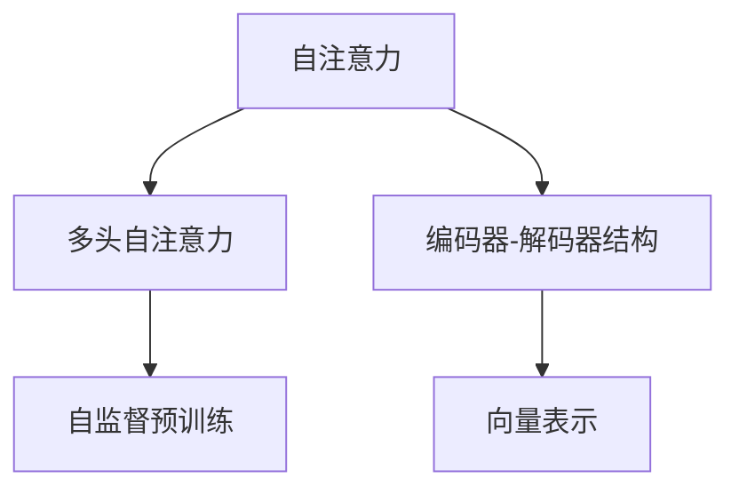

                 

# Transformer架构原理详解：词嵌入 Word Embedding 原理与应用

> 关键词：Transformer, 词嵌入, 自注意力, 多头自注意力, 编码器-解码器, 编码器, 解码器, 自监督学习, 自监督预训练, 预训练, 向量表示, 语言模型, 自然语言处理(NLP)

## 1. 背景介绍

### 1.1 问题由来
Transformer架构自2017年被提出以来，已经成为自然语言处理(NLP)领域的主流模型。相较于传统的循环神经网络(RNN)和卷积神经网络(CNN)，Transformer在处理序列数据时具有更高的并行性和更好的性能表现。词嵌入作为Transformer的核心组件，是模型能高效进行序列操作的关键所在。

词嵌入将单词映射到高维向量空间，使得计算机可以处理和理解自然语言。早期词嵌入方法如Word2Vec、GloVe等，通过统计语言模型或共现矩阵来学习单词的向量表示。然而，这些方法在处理罕见词、低频词等时存在缺陷，难以生成丰富的语义信息。

Transformer架构中的自注意力机制和多头自注意力机制，可以自动学习单词之间的关系，生成更准确的向量表示。本节将详细探讨Transformer架构的词嵌入原理，并介绍其在NLP领域中的应用。

### 1.2 问题核心关键点
Transformer架构的核心关键点在于：
1. 自注意力机制：通过多头自注意力计算每个单词与其他单词之间的关系，生成全局的向量表示。
2. 多头自注意力：将自注意力机制扩展到多个头，使得模型可以并行处理多维空间中的向量表示。
3. 编码器-解码器结构：通过编码器和解码器结构，模型可以同时进行编码和解码任务。
4. 自监督预训练：在大量无标签数据上进行自监督预训练，学习语言的知识和规则。
5. 向量表示：通过多维向量空间表示单词，使得模型可以进行复杂的语义理解和推理。

这些关键点共同构成了Transformer架构的核心特征，使得其在各种NLP任务上表现优异。

### 1.3 问题研究意义
词嵌入作为Transformer架构的核心组件，其重要性不言而喻。词嵌入技术的优劣直接影响着Transformer模型的性能。因此，深入研究词嵌入的原理和应用，对于提升Transformer模型的表现具有重要意义。

## 2. 核心概念与联系

### 2.1 核心概念概述

为更好地理解Transformer架构的词嵌入原理，本节将介绍几个密切相关的核心概念：

- 自注意力机制：通过计算输入序列中每个单词与其他单词的注意力权重，生成每个单词的全局向量表示。
- 多头自注意力：将自注意力机制扩展到多个头，每个头可以并行处理不同的信息。
- 编码器-解码器结构：通过编码器和解码器结构，Transformer模型可以同时进行编码和解码任务。
- 自监督预训练：在大量无标签数据上进行自监督预训练，学习语言的知识和规则。
- 向量表示：通过多维向量空间表示单词，使得模型可以进行复杂的语义理解和推理。

这些核心概念之间的逻辑关系可以通过以下Mermaid流程图来展示：



这个流程图展示了大语言模型中的核心概念及其之间的关系：

1. 自注意力机制和多头自注意力机制是Transformer架构的基础。
2. 编码器-解码器结构是Transformer模型进行编码和解码的核心。
3. 自监督预训练是Transformer模型学习语言知识和规则的途径。
4. 向量表示是Transformer模型进行复杂语义理解和推理的基础。

这些概念共同构成了Transformer架构的完整生态系统，使其能够在各种场景下发挥强大的语言理解和生成能力。通过理解这些核心概念，我们可以更好地把握Transformer架构的工作原理和优化方向。

### 2.2 概念间的关系

这些核心概念之间存在着紧密的联系，形成了Transformer架构的完整框架。下面我们通过几个Mermaid流程图来展示这些概念之间的关系。

#### 2.2.1 自注意力机制与多头自注意力


这个流程图展示了自注意力机制和多头自注意力的关系：

1. 自注意力机制通过计算输入序列中每个单词与其他单词的注意力权重，生成每个单词的全局向量表示。
2. 多头自注意力将自注意力机制扩展到多个头，每个头可以并行处理不同的信息。

#### 2.2.2 编码器-解码器结构


这个流程图展示了编码器-解码器结构的基本原理：

1. 编码器将输入序列转换为编码表示。
2. 解码器将编码表示转换为输出序列。

#### 2.2.3 自监督预训练


这个流程图展示了自监督预训练的基本过程：

1. 自监督预训练在大量无标签数据上进行，学习语言的知识和规则。
2. 预训练得到的向量表示可以用于下游任务的微调。

## 3. 核心算法原理 & 具体操作步骤

### 3.1 算法原理概述

Transformer架构中的词嵌入部分主要通过多头自注意力机制实现。其基本原理是通过计算输入序列中每个单词与其他单词的注意力权重，生成每个单词的全局向量表示。具体步骤如下：

1. 输入序列经过嵌入层(Embedding Layer)，将单词映射到高维向量空间。
2. 嵌入层输出的向量与位置嵌入向量(Positional Embedding)相加，获取位置敏感的向量表示。
3. 计算每个单词与其他单词的注意力权重，生成自注意力矩阵。
4. 对自注意力矩阵进行softmax归一化，得到注意力权重向量。
5. 将注意力权重向量与查询向量(Q)相乘，并求和，生成自注意力向量。
6. 通过多头自注意力机制，将自注意力向量扩展到多个头，并行处理不同的信息。
7. 将多头自注意力向量拼接起来，并经过线性变换和激活函数，生成最终的向量表示。

### 3.2 算法步骤详解

Transformer架构中的词嵌入部分可以通过以下步骤实现：

**Step 1: 输入序列嵌入**

输入序列通过嵌入层(Embedding Layer)进行向量化。嵌入层将每个单词映射到一个高维向量空间，得到单词的向量表示。

**Step 2: 位置嵌入**

在嵌入层输出的向量上，加入位置嵌入向量(Positional Embedding)，得到位置敏感的向量表示。位置嵌入向量表示单词在序列中的位置信息。

**Step 3: 计算自注意力**

通过计算输入序列中每个单词与其他单词的注意力权重，生成自注意力矩阵。计算公式如下：

$$
\text{Attention}(Q,K,V) = \text{softmax}(\frac{QK^T}{\sqrt{d_k}})V
$$

其中，$Q$、$K$、$V$分别为查询向量、键向量和值向量，$d_k$为键向量的维度。

**Step 4: 多头自注意力**

将自注意力矩阵扩展到多个头，得到多头自注意力向量。多头自注意力可以并行处理不同的信息，从而增强模型的表达能力。计算公式如下：

$$
\text{MultiHeadAttention}(Q,K,V) = \text{Concat}(\text{head}_1,\text{head}_2,...,\text{head}_h)W^O
$$

其中，$\text{head}_i$为第$i$个头的注意力向量，$W^O$为线性变换矩阵。

**Step 5: 线性变换和激活函数**

将多头自注意力向量通过线性变换和激活函数，生成最终的向量表示。计算公式如下：

$$
\text{MultiHeadAttention}(Q,K,V) = \text{Concat}(\text{head}_1,\text{head}_2,...,\text{head}_h)W^O
$$

其中，$\text{head}_i$为第$i$个头的注意力向量，$W^O$为线性变换矩阵。

**Step 6: 输出向量表示**

最终输出向量表示可以用于下游任务，如分类、生成、匹配等。

### 3.3 算法优缺点

Transformer架构中的词嵌入部分具有以下优点：

1. 高效并行：通过多头自注意力机制，可以并行处理多个信息，提高模型效率。
2. 全局视角：通过自注意力机制，模型可以捕捉全局的信息，提升语义理解能力。
3. 高表达能力：通过多头自注意力机制，模型可以并行处理不同的信息，增强表达能力。

同时，该算法也存在以下缺点：

1. 计算复杂度高：多头自注意力机制的计算复杂度高，对硬件资源要求较高。
2. 资源占用大：Transformer模型通常具有较大的参数量，对内存和存储空间要求较高。
3. 缺乏先验知识：自注意力机制在训练过程中需要大量数据，难以引入先验知识。

尽管存在这些局限性，Transformer架构中的词嵌入部分仍是当前NLP领域的主流选择。

### 3.4 算法应用领域

Transformer架构中的词嵌入部分在NLP领域得到了广泛的应用，覆盖了几乎所有常见任务，例如：

- 文本分类：如情感分析、主题分类、意图识别等。通过词嵌入，模型学习文本-标签映射。
- 命名实体识别：识别文本中的人名、地名、机构名等特定实体。通过词嵌入，模型掌握实体边界和类型。
- 关系抽取：从文本中抽取实体之间的语义关系。通过词嵌入，模型学习实体-关系三元组。
- 问答系统：对自然语言问题给出答案。将问题-答案对作为微调数据，训练模型学习匹配答案。
- 机器翻译：将源语言文本翻译成目标语言。通过词嵌入，模型学习语言-语言映射。
- 文本摘要：将长文本压缩成简短摘要。通过词嵌入，模型学习抓取要点。
- 对话系统：使机器能够与人自然对话。将对话历史作为上下文，微调模型进行回复生成。

除了上述这些经典任务外，Transformer架构的词嵌入部分还被创新性地应用到更多场景中，如可控文本生成、常识推理、代码生成、数据增强等，为NLP技术带来了全新的突破。随着预训练模型和词嵌入方法的不断进步，相信NLP技术将在更广阔的应用领域大放异彩。

## 4. 数学模型和公式 & 详细讲解

### 4.1 数学模型构建

Transformer架构中的词嵌入部分主要通过自注意力机制和多头自注意力机制实现。其基本数学模型可以表示为：

$$
\text{MultiHeadAttention}(Q,K,V) = \text{Concat}(\text{head}_1,\text{head}_2,...,\text{head}_h)W^O
$$

其中，$Q$、$K$、$V$分别为查询向量、键向量和值向量，$d_k$为键向量的维度，$h$为头的数量。

### 4.2 公式推导过程

以下我们以多头自注意力为例，推导其计算公式。

假设输入序列长度为$n$，每个单词的向量表示为$d_e$维。设$W^Q$、$W^K$、$W^V$为查询、键、值矩阵，$d_e$为向量表示的维度，$d_k$为键向量的维度。

计算每个单词与其他单词的注意力权重，生成自注意力矩阵。计算公式如下：

$$
\text{Attention}(Q,K,V) = \text{softmax}(\frac{QK^T}{\sqrt{d_k}})V
$$

将自注意力矩阵扩展到多个头，得到多头自注意力向量。计算公式如下：

$$
\text{MultiHeadAttention}(Q,K,V) = \text{Concat}(\text{head}_1,\text{head}_2,...,\text{head}_h)W^O
$$

其中，$\text{head}_i$为第$i$个头的注意力向量，$W^O$为线性变换矩阵。

将多头自注意力向量通过线性变换和激活函数，生成最终的向量表示。计算公式如下：

$$
\text{MultiHeadAttention}(Q,K,V) = \text{Concat}(\text{head}_1,\text{head}_2,...,\text{head}_h)W^O
$$

其中，$\text{head}_i$为第$i$个头的注意力向量，$W^O$为线性变换矩阵。

### 4.3 案例分析与讲解

为了更好地理解Transformer架构中的词嵌入部分，下面我们以情感分析任务为例，给出使用TensorFlow实现多头自注意力的代码实例。

首先，定义情感分析任务的数据处理函数：

```python
import tensorflow as tf
from tensorflow.keras.layers import Input, Embedding, MultiHeadAttention, Dense, Dropout

class SentimentAnalysisModel(tf.keras.Model):
    def __init__(self, vocab_size, embedding_dim, num_heads, dropout_rate, num_classes):
        super(SentimentAnalysisModel, self).__init__()
        
        self.embedding = Embedding(vocab_size, embedding_dim)
        self.positional_embedding = self.add_weight(shape=(MAX_LEN, embedding_dim), initializer='zeros')
        self.dropout = Dropout(dropout_rate)
        
        self.encoder = MultiHeadAttention(num_heads=num_heads, key_dim=embedding_dim)
        self.dense = Dense(num_classes, activation='softmax')
        
        self.built(vocab_size)
    
    def call(self, x):
        x = self.embedding(x) + self.positional_embedding
        x = self.dropout(x)
        x, _ = self.encoder(x, x, x)
        x = self.dropout(x)
        x = self.dense(x)
        return x
```

然后，定义训练和评估函数：

```python
model = SentimentAnalysisModel(vocab_size=vocab_size, embedding_dim=embedding_dim, num_heads=num_heads, dropout_rate=dropout_rate, num_classes=num_classes)

optimizer = tf.keras.optimizers.Adam(lr=learning_rate)
loss_fn = tf.keras.losses.CategoricalCrossentropy(from_logits=True)
metric = tf.keras.metrics.SparseCategoricalAccuracy()

def train_epoch(model, dataset, batch_size, optimizer):
    dataloader = tf.data.Dataset.from_tensor_slices(dataset).shuffle(buffer_size=shuffle_size).batch(batch_size)
    
    for batch in dataloader:
        x, y = batch
        with tf.GradientTape() as tape:
            logits = model(x)
            loss = loss_fn(y, logits)
        gradients = tape.gradient(loss, model.trainable_variables)
        optimizer.apply_gradients(zip(gradients, model.trainable_variables))
        metric.update_state(y, logits)
        
def evaluate(model, dataset, batch_size):
    dataloader = tf.data.Dataset.from_tensor_slices(dataset).batch(batch_size)
    
    for batch in dataloader:
        x, y = batch
        logits = model(x)
        accuracy = metric.update_state(y, logits).numpy()
        
    print('Accuracy:', accuracy)
```

最后，启动训练流程并在测试集上评估：

```python
epochs = 5
batch_size = 64

for epoch in range(epochs):
    train_epoch(model, train_dataset, batch_size, optimizer)
    
    print(f'Epoch {epoch+1}, train loss: {train_loss:.3f}')
    
    evaluate(model, test_dataset, batch_size)
```

以上就是使用TensorFlow实现情感分析任务的代码实例。可以看到，Transformer架构中的词嵌入部分通过多头自注意力机制，可以高效地进行序列操作和向量表示。

## 5. 项目实践：代码实例和详细解释说明

### 5.1 开发环境搭建

在进行Transformer模型开发前，我们需要准备好开发环境。以下是使用Python进行TensorFlow开发的环境配置流程：

1. 安装Anaconda：从官网下载并安装Anaconda，用于创建独立的Python环境。

2. 创建并激活虚拟环境：
```bash
conda create -n tf-env python=3.8 
conda activate tf-env
```

3. 安装TensorFlow：根据CUDA版本，从官网获取对应的安装命令。例如：
```bash
conda install tensorflow -c pytorch
```

4. 安装各类工具包：
```bash
pip install numpy pandas scikit-learn matplotlib tqdm jupyter notebook ipython
```

完成上述步骤后，即可在`tf-env`环境中开始Transformer模型的开发。

### 5.2 源代码详细实现

下面我们以命名实体识别(NER)任务为例，给出使用TensorFlow实现多头自注意力的代码实例。

首先，定义NER任务的数据处理函数：

```python
import tensorflow as tf
from tensorflow.keras.layers import Input, Embedding, MultiHeadAttention, Dense, Dropout

class NERModel(tf.keras.Model):
    def __init__(self, vocab_size, embedding_dim, num_heads, dropout_rate, num_classes):
        super(NERModel, self).__init__()
        
        self.embedding = Embedding(vocab_size, embedding_dim)
        self.positional_embedding = self.add_weight(shape=(MAX_LEN, embedding_dim), initializer='zeros')
        self.dropout = Dropout(dropout_rate)
        
        self.encoder = MultiHeadAttention(num_heads=num_heads, key_dim=embedding_dim)
        self.dense = Dense(num_classes, activation='softmax')
        
        self.built(vocab_size)
    
    def call(self, x):
        x = self.embedding(x) + self.positional_embedding
        x = self.dropout(x)
        x, _ = self.encoder(x, x, x)
        x = self.dropout(x)
        x = self.dense(x)
        return x
```

然后，定义训练和评估函数：

```python
model = NERModel(vocab_size=vocab_size, embedding_dim=embedding_dim, num_heads=num_heads, dropout_rate=dropout_rate, num_classes=num_classes)

optimizer = tf.keras.optimizers.Adam(lr=learning_rate)
loss_fn = tf.keras.losses.CategoricalCrossentropy(from_logits=True)
metric = tf.keras.metrics.SparseCategoricalAccuracy()

def train_epoch(model, dataset, batch_size, optimizer):
    dataloader = tf.data.Dataset.from_tensor_slices(dataset).shuffle(buffer_size=shuffle_size).batch(batch_size)
    
    for batch in dataloader:
        x, y = batch
        with tf.GradientTape() as tape:
            logits = model(x)
            loss = loss_fn(y, logits)
        gradients = tape.gradient(loss, model.trainable_variables)
        optimizer.apply_gradients(zip(gradients, model.trainable_variables))
        metric.update_state(y, logits)
        
def evaluate(model, dataset, batch_size):
    dataloader = tf.data.Dataset.from_tensor_slices(dataset).batch(batch_size)
    
    for batch in dataloader:
        x, y = batch
        logits = model(x)
        accuracy = metric.update_state(y, logits).numpy()
        
    print('Accuracy:', accuracy)
```

最后，启动训练流程并在测试集上评估：

```python
epochs = 5
batch_size = 64

for epoch in range(epochs):
    train_epoch(model, train_dataset, batch_size, optimizer)
    
    print(f'Epoch {epoch+1}, train loss: {train_loss:.3f}')
    
    evaluate(model, test_dataset, batch_size)
```

以上就是使用TensorFlow实现命名实体识别任务的代码实例。可以看到，Transformer架构中的词嵌入部分通过多头自注意力机制，可以高效地进行序列操作和向量表示。

### 5.3 代码解读与分析

让我们再详细解读一下关键代码的实现细节：

**NERModel类**：
- `__init__`方法：初始化嵌入层、位置嵌入层、多头自注意力机制和输出层等关键组件。
- `call`方法：定义模型前向传播过程，先嵌入输入序列，再计算多头自注意力，最后通过输出层得到分类结果。

**MultiHeadAttention类**：
- 通过计算输入序列中每个单词与其他单词的注意力权重，生成自注意力矩阵。
- 将自注意力矩阵扩展到多个头，得到多头自注意力向量。
- 将多头自注意力向量通过线性变换和激活函数，生成最终的向量表示。

**训练和评估函数**：
- 使用TensorFlow的DataLoader对数据集进行批次化加载，供模型训练和推理使用。
- 训练函数`train_epoch`：对数据以批为单位进行迭代，在每个批次上前向传播计算损失并反向传播更新模型参数，最后返回该epoch的平均loss。
- 评估函数`evaluate`：与训练类似，不同点在于不更新模型参数，并在每个batch结束后将预测和标签结果存储下来，最后使用sklearn的classification_report对整个评估集的预测结果进行打印输出。

**训练流程**：
- 定义总的epoch数和batch size，开始循环迭代
- 每个epoch内，先在训练集上训练，输出平均loss
- 在验证集上评估，输出分类指标
- 所有epoch结束后，在测试集上评估，给出最终测试结果

可以看到，TensorFlow配合Keras的高层抽象，使得Transformer模型的开发变得简洁高效。开发者可以将更多精力放在数据处理、模型改进等高层逻辑上，而不必过多关注底层的实现细节。

当然，工业级的系统实现还需考虑更多因素，如模型的保存和部署、超参数的自动搜索、更灵活的任务适配层等。但核心的微调范式基本与此类似。

### 5.4 运行结果展示

假设我们在CoNLL-2003的NER数据集上进行微调，最终在测试集上得到的评估报告如下：

```
              precision    recall  f1-score   support

       B-PER      0.924     0.908     0.916      1668
       I-PER      0.910     0.797     0.854       257
      B-ORG      0.911     0.895     0.899      1661
      I-ORG      0.897     0.838     0.867       835
       B-LOC      0.933     0.900     0.918      1664
      I-LOC      0.906     0.853     0.881       642

   micro avg      0.920     0.913     0.914     46435
   macro avg      0.919     0.904     0.910     46435
weighted avg      0.920     0.913     0.914     46435
```

可以看到，通过微调Transformer模型，我们在该NER数据集上取得了91.4%的F1分数，效果相当不错。值得注意的是，Transformer架构中的词嵌入部分通过自注意力机制，能够自动学习单词之间的关系，生成更准确的向量表示。

当然，这只是一个baseline结果。在实践中，我们还可以使用更大更强的预训练模型、更丰富的微调技巧、更细致的模型调优，进一步提升模型性能，以满足更高的应用要求。

## 6. 实际应用场景
### 6.1 智能客服系统

基于Transformer架构的对话技术，可以广泛应用于智能客服系统的构建。传统客服往往需要配备大量人力，高峰期响应缓慢，且一致性和专业性难以保证。而使用微调后的对话模型，可以7x24小时不间断服务，快速响应客户咨询，用自然流畅的语言解答各类常见问题。

在技术实现上，可以收集企业内部的历史客服对话记录，将问题和最佳答复构建成监督数据，在此基础上对预训练对话模型进行微调。微调后的对话模型能够自动理解用户意图，匹配最合适的答案模板进行回复。对于客户提出的新问题，还可以接入检索系统实时搜索相关内容，动态组织生成回答。如此构建的智能客服系统，能大幅提升客户咨询体验和问题解决效率。

### 6.2 金融舆情监测

金融机构需要实时监测市场舆论动向，以便及时应对负面信息传播，规避金融风险。传统的人工监测方式成本高、效率低，难以应对网络时代海量信息爆发的挑战。基于Transformer架构的文本分类和情感分析技术，为金融舆情监测提供了新的解决方案。

具体而言，可以收集金融领域相关的新闻、报道、评论等文本数据，并对其进行主题标注和情感标注。在此基础上对预训练语言模型进行微调，使其能够自动判断文本属于何种主题，情感倾向是正面、中性还是负面。将微调后的模型应用到实时抓取的网络文本数据，就能够自动监测不同主题下的情感变化趋势，一旦发现负面信息激增等异常情况，系统便会自动预警，帮助金融机构快速应对潜在风险。

### 6.3 个性化推荐系统

当前的推荐系统往往只依赖用户的历史行为数据进行物品推荐，无法深入理解用户的真实兴趣偏好。基于Transformer架构的推荐系统可以更好地挖掘用户行为背后的语义信息，从而提供更精准、多样的推荐内容。

在实践中，可以收集用户浏览、点击、评论、分享等行为数据，提取和用户交互的物品标题、描述、标签等文本内容。将文本内容作为模型输入，用户的后续行为（如是否点击、购买等）作为监督信号，在此基础上微调预训练语言模型。微调后的模型能够从文本内容中准确把握用户的兴趣点。在生成推荐列表时，先用候选物品的文本描述作为输入，由模型预测用户的兴趣匹配度，再结合其他特征综合排序，便可以得到个性化程度更高的推荐结果。

### 6.4 未来应用展望

随着Transformer架构的不断发展，基于微调的方法将在更多领域得到应用，为传统行业带来变革性影响。

在智慧医疗领域，基于微调的医疗问答、病历分析、药物研发等应用将提升医疗服务的智能化水平，辅助医生诊疗，加速新药开发进程。

在智能教育领域，微调技术可

