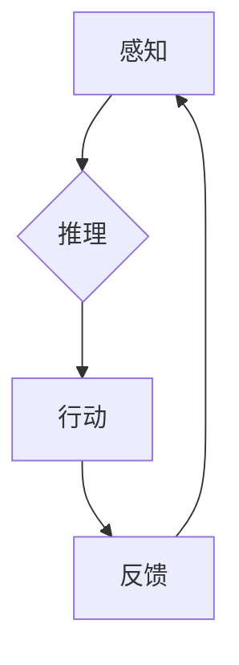

> 关键词：AI Agent, 具身智能, 智能体, 机器学习, 强化学习, 深度学习, 人机交互, 虚拟现实, 物理仿真

# AI Agent: AI的下一个风口 具身智能的核心概念

## 1. 背景介绍

随着人工智能技术的飞速发展，从早期的符号主义、连接主义到如今的深度学习时代，人工智能已经取得了令人瞩目的成果。然而，尽管在图像识别、语音识别、自然语言处理等领域取得了突破，传统的AI系统仍然面临着一些挑战，如缺乏情境感知能力、难以处理复杂任务、缺乏自主性和适应性等。为了解决这些问题，具身智能（Embodied AI）和AI Agent的概念应运而生。本文将深入探讨AI Agent的核心概念，分析其原理、操作步骤、应用领域，并展望其未来发展趋势。

## 2. 核心概念与联系

### 2.1 具身智能

具身智能是近年来人工智能领域的一个新兴研究方向，它强调将智能体（Agent）放置在真实的或模拟的环境中，使其能够通过感知、推理、决策和行动来与周围环境互动，从而获得真正的智能。

**具身智能的核心概念**：

- **感知（Perception）**：智能体通过传感器（如摄像头、麦克风、触觉传感器等）获取环境信息。
- **推理（Reasoning）**：智能体根据感知到的信息进行逻辑推理和决策。
- **行动（Action）**：智能体根据推理结果执行相应的动作。
- **反馈（Feedback）**：环境对智能体的动作做出响应，智能体根据反馈调整其行为。

### 2.2 AI Agent

AI Agent是具身智能的核心载体，它是一个能够感知环境、做出决策并采取行动的实体。AI Agent可以是虚拟的，如计算机程序；也可以是物理的，如机器人。

**AI Agent的关键特性**：

- **自主性（Autonomy）**：能够独立地做出决策和行动。
- **适应性（Adaptability）**：能够根据环境变化调整其行为。
- **协作性（Cooperation）**：能够与其他智能体协作完成任务。

### 2.3 Mermaid 流程图

以下是一个Mermaid流程图，展示了AI Agent的核心概念和流程：



## 3. 核心算法原理 & 具体操作步骤

### 3.1 算法原理概述

AI Agent的算法原理主要基于以下几种技术：

- **机器学习（Machine Learning）**：通过学习大量数据来改善智能体的性能。
- **强化学习（Reinforcement Learning）**：通过与环境的交互来学习最优策略。
- **深度学习（Deep Learning）**：利用神经网络模拟人脑神经元的工作原理，用于特征提取和模式识别。

### 3.2 算法步骤详解

AI Agent的算法步骤通常包括以下步骤：

1. **环境建模**：建立智能体所处的环境的数学模型。
2. **感知输入**：通过传感器获取环境信息。
3. **状态估计**：根据感知输入估计智能体的状态。
4. **决策制定**：根据状态信息制定行动策略。
5. **执行动作**：根据策略执行动作。
6. **观察结果**：观察环境对动作的响应。
7. **更新模型**：根据观察结果更新智能体的模型。

### 3.3 算法优缺点

**优点**：

- **自主学习**：AI Agent能够通过与环境交互来自主学习。
- **适应性**：AI Agent能够根据环境变化调整其行为。
- **协作性**：AI Agent能够与其他智能体协作完成任务。

**缺点**：

- **训练成本高**：需要大量的数据和时间来训练AI Agent。
- **对环境依赖性强**：AI Agent的性能受环境影响较大。

### 3.4 算法应用领域

AI Agent的应用领域非常广泛，包括：

- **机器人**：工业机器人、服务机器人、家庭机器人等。
- **游戏**：电子游戏、虚拟现实游戏等。
- **自动驾驶**：无人驾驶汽车、无人机等。
- **智能客服**：自动回答客户问题、处理客户请求等。

## 4. 数学模型和公式 & 详细讲解 & 举例说明

### 4.1 数学模型构建

AI Agent的数学模型通常包括以下部分：

- **状态空间（State Space）**：智能体可能的状态集合。
- **动作空间（Action Space）**：智能体可能采取的动作集合。
- **奖励函数（Reward Function）**：定义智能体在不同状态下采取不同动作的奖励。

### 4.2 公式推导过程

以下是一个简单的Q-Learning算法的公式推导过程：

$$
Q(s,a) = Q(s,a) + \alpha [R + \gamma \max_{a'} Q(s',a') - Q(s,a)]
$$

其中，$Q(s,a)$ 是在状态 $s$ 下采取动作 $a$ 的期望回报，$\alpha$ 是学习率，$R$ 是奖励，$\gamma$ 是折扣因子，$s'$ 是采取动作 $a$ 后的状态。

### 4.3 案例分析与讲解

以下是一个简单的AI Agent案例，用于实现一个简单的迷宫导航：

- **状态空间**：迷宫的每个位置。
- **动作空间**：上下左右移动。
- **奖励函数**：到达终点获得奖励，否则不奖励。

通过训练，AI Agent能够学会在迷宫中找到正确的路径。

## 5. 项目实践：代码实例和详细解释说明

### 5.1 开发环境搭建

为了实现AI Agent，我们需要搭建以下开发环境：

- **编程语言**：Python
- **库**：PyTorch、TensorFlow、OpenAI Gym等

### 5.2 源代码详细实现

以下是一个简单的迷宫导航AI Agent的Python代码实现：

```python
import numpy as np
import random
from gym import wrappers
from gym.envs.toy_text import GridWorld

# 初始化迷宫环境
env = wrappers.Monitor(GridWorld(), "maze", force=True)

# 初始化Q表
Q = np.zeros((3, 3, 4))

# 设置学习参数
alpha = 0.1
gamma = 0.9

# 训练AI Agent
for episode in range(1000):
    state = env.reset()
    done = False
    while not done:
        action = np.argmax(Q[state[:, 0], state[:, 1])
        next_state, reward, done, _ = env.step(action)
        Q[state[:, 0], state[:, 1], action] = (1 - alpha) * Q[state[:, 0], state[:, 1], action] + alpha * (reward + gamma * np.max(Q[next_state[:, 0], next_state[:, 1]]))
        state = next_state

# 关闭环境
env.close()
```

### 5.3 代码解读与分析

以上代码实现了一个简单的迷宫导航AI Agent，使用Q-Learning算法进行训练。代码首先初始化迷宫环境和Q表，然后设置学习参数，接着进行多次训练，最后关闭环境。

### 5.4 运行结果展示

运行以上代码，AI Agent将学会在迷宫中找到正确的路径。

## 6. 实际应用场景

### 6.1 机器人

AI Agent在机器人领域的应用非常广泛，如：

- **工业机器人**：用于自动化生产线上的装配、搬运等工作。
- **服务机器人**：用于医院、商场、家庭等场景中的服务。
- **探索机器人**：用于探索未知环境，如太空、海底等。

### 6.2 游戏

AI Agent在游戏领域的应用也非常广泛，如：

- **电子游戏**：用于开发更智能的游戏角色。
- **虚拟现实游戏**：用于创建更真实的虚拟世界。

### 6.3 自动驾驶

AI Agent在自动驾驶领域的应用也具有重要意义，如：

- **无人驾驶汽车**：用于实现自动驾驶汽车的安全运行。
- **无人机**：用于实现无人机的智能飞行。

## 7. 工具和资源推荐

### 7.1 学习资源推荐

- **书籍**：
  - 《Reinforcement Learning: An Introduction》
  - 《Deep Reinforcement Learning》
- **在线课程**：
  - Coursera上的《机器学习纳米学位》
  - Udacity上的《强化学习纳米学位》

### 7.2 开发工具推荐

- **编程语言**：Python
- **库**：PyTorch、TensorFlow、OpenAI Gym等

### 7.3 相关论文推荐

- **《Deep Reinforcement Learning》**
- **《Human-level control through deep reinforcement learning》**

## 8. 总结：未来发展趋势与挑战

### 8.1 研究成果总结

本文对AI Agent和具身智能的核心概念进行了深入探讨，分析了其原理、操作步骤、应用领域，并展望了其未来发展趋势。

### 8.2 未来发展趋势

- **更加智能化的智能体**：通过融合多种人工智能技术，使AI Agent能够处理更复杂的任务。
- **更加自主化的智能体**：通过引入强化学习等算法，使AI Agent能够更加自主地适应环境。
- **更加协作化的智能体**：通过引入多智能体系统，使AI Agent能够与其他智能体协作完成任务。

### 8.3 面临的挑战

- **数据收集和标注**：需要大量的数据来训练AI Agent。
- **算法优化**：需要开发更加高效的算法来提高AI Agent的性能。
- **伦理和安全问题**：需要解决AI Agent可能带来的伦理和安全问题。

### 8.4 研究展望

随着人工智能技术的不断发展，AI Agent和具身智能将在未来发挥越来越重要的作用。通过克服面临的挑战，AI Agent和具身智能将为人类社会带来更多的便利和进步。

## 9. 附录：常见问题与解答

**Q1：什么是具身智能？**

A：具身智能是将智能体放置在真实的或模拟的环境中，使其能够通过感知、推理、决策和行动来与周围环境互动，从而获得真正的智能。

**Q2：AI Agent有哪些特点？**

A：AI Agent具有自主性、适应性和协作性等特点。

**Q3：AI Agent的应用领域有哪些？**

A：AI Agent的应用领域包括机器人、游戏、自动驾驶等。

**Q4：如何训练AI Agent？**

A：可以通过机器学习、强化学习等算法来训练AI Agent。

**Q5：AI Agent的未来发展趋势是什么？**

A：AI Agent的未来发展趋势包括更加智能化、自主化和协作化。