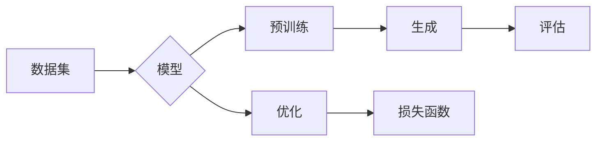

> AIGC, 自动生成内容, 自然语言处理, 计算机视觉, 机器学习, 预训练模型, 文本生成, 图像生成, 生成式模型

# AIGC 原理与代码实例讲解

AIGC，即人工智能生成内容（Artificial Intelligence Generated Content），是人工智能领域的热门研究方向。它利用机器学习技术自动生成文本、图像、音频等内容，具有广泛的应用前景。本文将深入探讨AIGC的原理，并通过代码实例进行讲解。

## 1. 背景介绍

随着深度学习技术的不断发展，AIGC技术逐渐成熟，并在多个领域展现出强大的潜力。从文本生成到图像生成，从音乐创作到视频编辑，AIGC技术正在改变着内容创作的模式。

### 1.1 问题的由来

传统的内容创作依赖于人类创作者的创意和技能。然而，随着信息量的爆炸式增长，人类创作者难以满足不断增长的内容需求。AIGC技术的出现，为内容创作提供了新的解决方案。

### 1.2 研究现状

目前，AIGC技术主要包括以下几个方面：

- **文本生成**：利用自然语言处理（NLP）技术生成文本，如新闻、小说、诗歌等。
- **图像生成**：利用计算机视觉技术生成图像，如照片、绘画、动画等。
- **音频生成**：利用音频处理技术生成音频，如音乐、语音、音效等。
- **视频生成**：利用视频处理技术生成视频，如视频剪辑、动画制作等。

### 1.3 研究意义

AIGC技术具有以下意义：

- **提高效率**：自动化生成内容，减少人力成本，提高生产效率。
- **拓展创作空间**：为创作者提供新的工具和素材，拓展创作空间。
- **创新应用**：在游戏、广告、教育等领域创造新的应用场景。

## 2. 核心概念与联系

AIGC技术涉及多个核心概念，以下是其中一些重要的概念及其相互关系：



- **数据集（A）**：为AIGC模型提供训练数据，用于学习内容生成规则。
- **模型（B）**：AIGC的核心，负责学习数据集中的模式并生成内容。
- **预训练（C）**：在大量数据集上对模型进行训练，使其具备一定的泛化能力。
- **生成（D）**：模型根据输入或特定条件生成新的内容。
- **评估（E）**：对生成的内容进行评估，以衡量模型性能。
- **优化（F）**：根据评估结果调整模型参数，提高生成质量。
- **损失函数（G）**：评估生成内容与真实内容之间的差异，用于优化模型。

## 3. 核心算法原理 & 具体操作步骤

### 3.1 算法原理概述

AIGC算法通常基于生成式模型，如变分自编码器（VAE）、生成对抗网络（GAN）等。以下是一些常见的AIGC算法：

- **VAE**：通过编码器和解码器学习数据的潜在空间表示，并在此空间中生成新的内容。
- **GAN**：通过对抗训练使生成器和判别器相互竞争，从而生成高质量的内容。

### 3.2 算法步骤详解

以VAE为例，AIGC算法的基本步骤如下：

1. **数据预处理**：对输入数据进行清洗、标准化等操作，构建训练数据集。
2. **模型构建**：选择合适的模型架构，如VAE，并设置模型参数。
3. **预训练**：在大量无标签数据上对模型进行预训练，使模型学习数据的潜在空间表示。
4. **生成**：根据预训练模型生成新的内容。
5. **评估**：对生成的内容进行评估，如计算生成内容与真实内容之间的相似度。
6. **优化**：根据评估结果调整模型参数，提高生成质量。

### 3.3 算法优缺点

- **VAE**：
  - **优点**：生成质量较高，易于理解。
  - **缺点**：训练时间长，生成质量受潜在空间分布影响较大。
- **GAN**：
  - **优点**：生成质量较好，能够生成多样性的内容。
  - **缺点**：训练不稳定，生成内容可能存在模式重复。

### 3.4 算法应用领域

AIGC算法在以下领域具有广泛的应用：

- **文本生成**：新闻、小说、诗歌、剧本等。
- **图像生成**：艺术创作、游戏开发、广告设计等。
- **音频生成**：音乐创作、语音合成、音效制作等。
- **视频生成**：视频剪辑、动画制作、虚拟现实等。

## 4. 数学模型和公式 & 详细讲解 & 举例说明

### 4.1 数学模型构建

以VAE为例，其数学模型如下：

- **编码器**：将数据映射到潜在空间。

$$
z = \mu(x) + \sigma(x) \cdot \mathcal{N}(0, I)
$$

- **解码器**：将潜在空间的数据映射回数据空间。

$$
x = \phi(z)
$$

- **生成器**：直接生成数据。

$$
x = \phi(z)
$$

- **判别器**：判断数据来自真实数据集还是生成器。

$$
D(x) \in [0,1]
$$

### 4.2 公式推导过程

VAE的推导过程涉及概率论、信息论等数学知识，这里不再赘述。

### 4.3 案例分析与讲解

以下是一个使用PyTorch实现VAE的代码实例：

```python
import torch
import torch.nn as nn
import torch.nn.functional as F

class VAE(nn.Module):
    def __init__(self, input_size, hidden_size, latent_size):
        super(VAE, self).__init__()
        self.encoder = nn.Sequential(
            nn.Linear(input_size, hidden_size),
            nn.ReLU(True),
            nn.Linear(hidden_size, latent_size)
        )
        self.decoder = nn.Sequential(
            nn.Linear(latent_size, hidden_size),
            nn.ReLU(True),
            nn.Linear(hidden_size, input_size)
        )

    def encode(self, x):
        mu, logvar = self.encoder(x).chunk(2, dim=1)
        return mu, logvar

    def reparameterize(self, mu, logvar):
        std = torch.exp(0.5 * logvar)
        eps = torch.randn_like(std)
        return mu + eps * std

    def decode(self, z):
        return self.decoder(z)

    def forward(self, x):
        mu, logvar = self.encode(x)
        z = self.reparameterize(mu, logvar)
        return self.decode(z), mu, logvar

    def loss_function(self, recon_x, x, mu, logvar):
        BCE_loss = F.binary_cross_entropy(recon_x, x.view(-1, 1), reduction='sum')
        KLD_loss = -0.5 * torch.sum(1 + logvar - mu.pow(2) - logvar.exp())
        return BCE_loss + KLD_loss

# 实例化模型、优化器和损失函数
input_size = 784  # 28x28 pixel image
hidden_size = 400
latent_size = 20
vae = VAE(input_size, hidden_size, latent_size).to(device)
optimizer = torch.optim.Adam(vae.parameters(), lr=0.001)
criterion = nn.BCELoss()

# 训练模型
for epoch in range(epochs):
    for data in dataloader:
        # 前向传播
        x, _ = data
        x = x.to(device)
        recon_x, mu, logvar = vae(x)

        # 计算损失
        loss = vae.loss_function(recon_x, x, mu, logvar)

        # 反向传播和优化
        optimizer.zero_grad()
        loss.backward()
        optimizer.step()
```

以上代码展示了如何使用PyTorch实现VAE模型，包括编码器、解码器、生成器、判别器和损失函数。

## 5. 项目实践：代码实例和详细解释说明

### 5.1 开发环境搭建

在进行AIGC项目实践前，我们需要搭建以下开发环境：

1. Python环境：安装Python 3.7或更高版本。
2. PyTorch环境：安装PyTorch 1.5或更高版本。
3. NumPy环境：安装NumPy 1.16或更高版本。

### 5.2 源代码详细实现

以下是一个使用VAE生成手写数字图像的代码实例：

```python
import torch
import torch.nn as nn
import torch.nn.functional as F
from torchvision import datasets, transforms
from torchvision.utils import save_image
import os

# 定义VAE模型
class VAE(nn.Module):
    # ...（与之前VAE模型定义相同）

# 加载数据集
transform = transforms.Compose([transforms.ToTensor()])
train_dataset = datasets.MNIST(root='./data', train=True, download=True, transform=transform)
train_loader = torch.utils.data.DataLoader(dataset=train_dataset, batch_size=128, shuffle=True)

# 实例化模型、优化器和损失函数
vae = VAE(input_size=784, hidden_size=400, latent_size=20).to(device)
optimizer = torch.optim.Adam(vae.parameters(), lr=0.001)
criterion = nn.BCELoss()

# 训练模型
for epoch in range(epochs):
    for data in train_loader:
        # 前向传播
        x, _ = data
        x = x.to(device)
        recon_x, mu, logvar = vae(x)

        # 计算损失
        loss = vae.loss_function(recon_x, x, mu, logvar)

        # 反向传播和优化
        optimizer.zero_grad()
        loss.backward()
        optimizer.step()

    # 保存生成图像
    if epoch % 10 == 0:
        with torch.no_grad():
            z = torch.randn(64, 20).to(device)
            generated_images = vae.decode(z)
            save_image(generated_images.view(64, 1, 28, 28), f'images/epoch_{epoch}.png', nrow=8)
```

### 5.3 代码解读与分析

以上代码展示了如何使用PyTorch实现VAE模型，并使用MNIST手写数字数据集进行训练。模型训练过程中，每隔10个epoch保存一次生成的图像。

### 5.4 运行结果展示

运行上述代码，可以在`images`目录下生成一系列生成的手写数字图像。从图中可以看出，VAE模型能够生成具有一定相似性的手写数字图像。

## 6. 实际应用场景

AIGC技术在以下领域具有广泛的应用：

### 6.1 文本生成

- 自动生成新闻、报告、诗歌、剧本等。
- 自动生成对话、聊天机器人等。

### 6.2 图像生成

- 自动生成艺术创作、游戏设计、广告设计等。
- 自动生成修复老照片、图片编辑等。

### 6.3 音频生成

- 自动生成音乐、音效、语音合成等。
- 自动生成语音对话、语音助手等。

### 6.4 视频生成

- 自动生成视频剪辑、动画制作、虚拟现实等。

## 7. 工具和资源推荐

### 7.1 学习资源推荐

1. 《深度学习》[Ian Goodfellow, Yoshua Bengio, Aaron Courville]：深度学习领域的经典教材，全面介绍了深度学习的基本概念、算法和原理。
2. 《PyTorch深度学习实战》[Adam Geitgey]：PyTorch框架的实战教程，适合初学者快速上手深度学习。
3. 《Hugging Face Transformers》文档：Transformers库的官方文档，提供了丰富的预训练模型和代码示例。

### 7.2 开发工具推荐

1. PyTorch：开源的深度学习框架，具有灵活的动态计算图。
2. TensorFlow：由Google开发的深度学习框架，适用于大规模部署。
3. Jupyter Notebook：用于数据分析和机器学习的交互式计算平台。

### 7.3 相关论文推荐

1. Generative Adversarial Nets [Ian J. Goodfellow, et al.]：GAN的奠基性论文，介绍了GAN的基本原理。
2. Variational Autoencoders [Diederik P. Kingma, Max Welling]：VAE的奠基性论文，介绍了VAE的基本原理。
3. Generative Models for Text [Alex M. Rush, et al.]：介绍了文本生成模型的最新进展。

## 8. 总结：未来发展趋势与挑战

### 8.1 研究成果总结

AIGC技术近年来取得了显著进展，在多个领域展现出强大的潜力。然而，AIGC技术仍面临一些挑战：

- **数据质量**：AIGC模型的性能依赖于数据质量，如何获取高质量的数据集是一个重要问题。
- **生成质量**：如何提高AIGC模型的生成质量，生成更加多样化、个性化的内容，是一个重要研究方向。
- **模型可解释性**：AIGC模型的决策过程往往难以解释，如何提高模型的可解释性，是一个重要挑战。

### 8.2 未来发展趋势

未来，AIGC技术将朝着以下方向发展：

- **多模态生成**：将文本、图像、音频等多模态数据融合，生成更加丰富多样的内容。
- **个性化生成**：根据用户需求和喜好，生成个性化的内容。
- **可解释性生成**：提高模型的可解释性，使生成过程更加透明。

### 8.3 面临的挑战

AIGC技术面临的挑战包括：

- **数据隐私**：如何保护用户数据隐私，防止数据泄露，是一个重要问题。
- **伦理问题**：AIGC技术可能被用于生成虚假信息、歧视性内容等，需要制定相应的伦理规范。
- **技术瓶颈**：AIGC模型的计算量和存储量较大，需要进一步优化模型结构和算法，提高效率。

### 8.4 研究展望

未来，AIGC技术将在以下方面取得突破：

- **数据隐私保护**：开发更加安全的AIGC模型，保护用户数据隐私。
- **可解释性增强**：提高AIGC模型的可解释性，使生成过程更加透明。
- **应用场景拓展**：将AIGC技术应用于更多领域，如教育、医疗、金融等。

## 9. 附录：常见问题与解答

**Q1：AIGC技术可以应用于哪些领域？**

A：AIGC技术可以应用于文本生成、图像生成、音频生成、视频生成等多个领域。

**Q2：如何提高AIGC模型的生成质量？**

A：提高AIGC模型的生成质量可以从以下方面入手：
- 获取高质量的数据集
- 优化模型结构
- 调整超参数
- 引入更多先验知识

**Q3：AIGC技术存在哪些伦理问题？**

A：AIGC技术可能存在以下伦理问题：
- 生成虚假信息
- 歧视性内容
- 版权侵犯

**Q4：如何解决AIGC技术的伦理问题？**

A：解决AIGC技术的伦理问题需要从以下几个方面入手：
- 制定伦理规范
- 加强技术监管
- 提高用户意识

**Q5：AIGC技术会取代人类创作者吗？**

A：AIGC技术可以辅助人类创作者，提高创作效率，但无法完全取代人类创作者的创意和情感。

---

作者：禅与计算机程序设计艺术 / Zen and the Art of Computer Programming