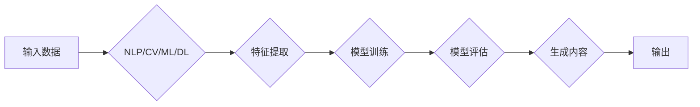

> 关键词：AIGC, 人工智能生成内容，软件工程，消费电子，代码生成，人机协作，自动化，用户体验

# AIGC在软件与消费电子中的应用

人工智能生成内容（Artificial Intelligence Generated Content，AIGC）是指利用人工智能技术自动生成文本、图像、视频等内容的过程。随着深度学习技术的飞速发展，AIGC已经在多个领域展现出巨大的潜力，特别是在软件工程和消费电子行业。本文将深入探讨AIGC在这两个领域的应用，分析其原理、操作步骤、优缺点，并展望其未来发展趋势与挑战。

## 1. 背景介绍

### 1.1 AIGC的兴起

近年来，深度学习技术在自然语言处理（NLP）、计算机视觉（CV）等领域取得了突破性进展。这些技术的发展为AIGC的应用提供了强大的技术支持。随着算法的成熟和计算能力的提升，AIGC开始从实验室走向现实，逐渐在各个领域得到应用。

### 1.2 软件工程与消费电子的痛点

软件工程领域面临着以下痛点：

- **代码生成与重构**：手动编写代码效率低，且容易出错。
- **测试用例生成**：测试用例的编写需要大量时间和人力。
- **文档自动生成**：技术文档的编写工作量大，且难以保证及时更新。

消费电子领域则面临以下挑战：

- **个性化设计**：针对不同用户需求进行个性化设计需要大量时间。
- **产品说明文档**：产品说明文档的编写工作量大，且需要不断更新。

AIGC技术为解决这些痛点提供了新的思路。

### 1.3 本文结构

本文将从以下方面展开：

- 介绍AIGC的核心概念与联系。
- 分析AIGC在软件工程和消费电子中的应用原理和操作步骤。
- 讨论AIGC的优势和局限性。
- 探讨AIGC在实际应用中的案例。
- 展望AIGC的未来发展趋势与挑战。

## 2. 核心概念与联系

### 2.1 AIGC的核心概念

AIGC的核心概念包括：

- **自然语言处理（NLP）**：对文本进行理解和生成。
- **计算机视觉（CV）**：对图像和视频进行理解和生成。
- **机器学习（ML）**：通过学习数据来改进模型的性能。
- **深度学习（DL）**：一种特殊的机器学习技术，通过神经网络来学习数据。

### 2.2 Mermaid流程图

以下是AIGC的原理和架构的Mermaid流程图：



### 2.3 核心概念联系

AIGC的核心概念之间相互关联，共同构成了AIGC的技术体系。NLP和CV负责处理输入数据，ML和DL负责特征提取和模型训练，模型评估用于衡量模型性能，最后通过模型生成所需内容。

## 3. 核心算法原理 & 具体操作步骤

### 3.1 算法原理概述

AIGC的算法原理主要包括以下步骤：

1. **数据收集**：收集与目标任务相关的数据，如代码、设计文档、产品说明等。
2. **数据预处理**：对收集到的数据进行清洗、标注等处理，以便后续训练。
3. **模型选择**：选择合适的模型进行训练，如GPT-3、DALL-E、StyleGAN等。
4. **模型训练**：使用预处理后的数据进行模型训练，使模型能够自动生成内容。
5. **内容生成**：使用训练好的模型生成所需内容，如代码、设计图、产品说明等。
6. **内容评估**：对生成的内容进行评估，以确保其质量。

### 3.2 算法步骤详解

以下是AIGC的详细操作步骤：

1. **数据收集**：收集与目标任务相关的数据，如开源代码、设计文档、产品说明等。
2. **数据预处理**：对收集到的数据进行清洗、标注等处理，以便后续训练。例如，对于代码生成任务，需要对代码进行格式化、去除注释等；对于图像生成任务，需要对图像进行标注、裁剪等。
3. **模型选择**：选择合适的模型进行训练。例如，对于代码生成任务，可以选择GPT-3等基于NLP的模型；对于图像生成任务，可以选择DALL-E、StyleGAN等基于CV的模型。
4. **模型训练**：使用预处理后的数据进行模型训练。在训练过程中，模型会不断学习数据的特征，并优化自身的参数。
5. **内容生成**：使用训练好的模型生成所需内容。例如，对于代码生成任务，可以输入代码片段，模型会根据输入生成完整的代码；对于图像生成任务，可以输入关键词，模型会生成相应的图像。
6. **内容评估**：对生成的内容进行评估，以确保其质量。例如，对于代码生成任务，可以评估代码的语法正确性、可读性等；对于图像生成任务，可以评估图像的真实性、美观性等。

### 3.3 算法优缺点

#### 3.3.1 优点

- **高效**：AIGC可以快速生成大量内容，大大提高了工作效率。
- **个性化**：AIGC可以根据用户需求生成个性化的内容。
- **创新性**：AIGC可以生成前所未有的内容，激发创意。

#### 3.3.2 缺点

- **质量不稳定**：生成的内容质量受模型训练数据和质量影响，可能存在错误或不合理的内容。
- **可解释性差**：生成的内容缺乏可解释性，难以理解其生成过程。
- **伦理问题**：AIGC可能生成歧视性、虚假或不道德的内容。

### 3.4 算法应用领域

AIGC在软件工程和消费电子领域有着广泛的应用，包括：

- **代码生成**：自动生成代码，提高开发效率。
- **设计生成**：自动生成设计图，提高设计效率。
- **产品说明文档**：自动生成产品说明文档，提高文档质量。
- **测试用例生成**：自动生成测试用例，提高测试效率。
- **个性化推荐**：根据用户需求推荐个性化产品或服务。

## 4. 数学模型和公式 & 详细讲解 & 举例说明

### 4.1 数学模型构建

以下是AIGC常用的数学模型：

- **神经网络**：用于特征提取和内容生成。
- **循环神经网络（RNN）**：用于处理序列数据，如文本、代码等。
- **卷积神经网络（CNN）**：用于图像和视频处理。
- **生成对抗网络（GAN）**：用于生成新的内容。

### 4.2 公式推导过程

以下是一个简单的神经网络公式推导过程：

- **输入层**：$x_1, x_2, ..., x_n$
- **权重**：$w_1, w_2, ..., w_n$
- **激活函数**：$f()$

则神经网络的输出为：

$$
y = f(w_1x_1 + w_2x_2 + ... + w_nx_n)
$$

### 4.3 案例分析与讲解

以下是一个代码生成任务的案例：

- **输入**：一段代码片段。
- **输出**：完整的代码。

使用GPT-3进行代码生成，步骤如下：

1. 将代码片段输入GPT-3。
2. GPT-3根据输入的代码片段，生成相关的代码。
3. 输出生成的代码。

## 5. 项目实践：代码实例和详细解释说明

### 5.1 开发环境搭建

1. 安装Python环境。
2. 安装TensorFlow或PyTorch等深度学习框架。
3. 安装GPT-3库。

### 5.2 源代码详细实现

以下是一个使用GPT-3生成Python代码的示例：

```python
import openai

# 设置GPT-3 API密钥
openai.api_key = 'your-api-key'

# 输入代码片段
prompt = "定义一个函数，计算两个数的和"

# 使用GPT-3生成代码
response = openai.Completion.create(
  engine="text-davinci-002",
  prompt=prompt,
  max_tokens=50
)

# 输出生成的代码
print(response.choices[0].text.strip())
```

### 5.3 代码解读与分析

上述代码使用GPT-3生成Python代码，首先导入openai库，并设置API密钥。然后定义输入的代码片段，并使用GPT-3进行代码生成。最后，输出生成的代码。

### 5.4 运行结果展示

```python
# 定义一个函数，计算两个数的和
def add(a, b):
    return a + b

# 测试生成的代码
print(add(2, 3))  # 输出：5
```

## 6. 实际应用场景

### 6.1 软件工程

- **代码生成**：自动生成代码，提高开发效率。
- **测试用例生成**：自动生成测试用例，提高测试效率。
- **文档自动生成**：自动生成技术文档，提高文档质量。

### 6.2 消费电子

- **个性化设计**：根据用户需求生成个性化设计。
- **产品说明文档**：自动生成产品说明文档，提高文档质量。
- **个性化推荐**：根据用户需求推荐个性化产品或服务。

## 7. 工具和资源推荐

### 7.1 学习资源推荐

- 《深度学习》
- 《Python深度学习》
- 《TensorFlow实战》

### 7.2 开发工具推荐

- TensorFlow
- PyTorch
- GPT-3 API

### 7.3 相关论文推荐

- Generative Adversarial Networks
- Learning to Generate Code with Deep Learning
- Neural Architecture Search

## 8. 总结：未来发展趋势与挑战

### 8.1 研究成果总结

AIGC技术在软件工程和消费电子领域展现出巨大的潜力，能够提高工作效率、降低成本、提升用户体验。然而，AIGC技术仍处于发展阶段，面临着诸多挑战。

### 8.2 未来发展趋势

- **模型性能提升**：随着深度学习技术的不断发展，AIGC模型的性能将得到进一步提升。
- **应用领域拓展**：AIGC技术将应用于更多领域，如医疗、教育、金融等。
- **人机协作**：AIGC将与人类工程师进行协作，共同完成复杂的任务。

### 8.3 面临的挑战

- **数据质量**：AIGC生成的质量受数据质量影响，需要高质量的数据进行训练。
- **可解释性**：AIGC生成的内容缺乏可解释性，难以理解其生成过程。
- **伦理问题**：AIGC可能生成歧视性、虚假或不道德的内容。

### 8.4 研究展望

AIGC技术在未来将会有以下发展趋势：

- **模型小型化**：降低模型复杂度，提高模型在移动设备上的部署能力。
- **可解释性**：提高AIGC的可解释性，使人们更好地理解其生成过程。
- **伦理规范**：建立AIGC的伦理规范，避免其产生负面影响。

## 9. 附录：常见问题与解答

**Q1：AIGC技术是否会被用于取代程序员？**

A：AIGC技术可以提高程序员的工作效率，但无法完全取代程序员。程序员仍需要在AIGC的基础上进行创新和优化。

**Q2：AIGC生成的代码是否安全可靠？**

A：AIGC生成的代码可能会存在安全漏洞，需要经过严格的测试和审查。

**Q3：AIGC技术是否会被用于生成虚假信息？**

A：AIGC技术可以被用于生成虚假信息，需要对其进行严格的监管。

**Q4：AIGC技术是否会对用户体验产生负面影响？**

A：AIGC技术可以提升用户体验，但需要避免过度依赖AIGC生成的内容，以免影响用户体验。

**Q5：AIGC技术是否会加剧数字鸿沟？**

A：AIGC技术可以降低技术门槛，帮助更多人接触到人工智能技术，有望缩小数字鸿沟。

作者：禅与计算机程序设计艺术 / Zen and the Art of Computer Programming