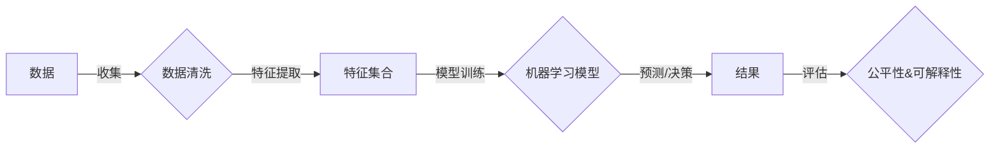

# AI人工智能核心算法原理与代码实例讲解：算法偏见

> 关键词：人工智能，算法偏见，机器学习，公平性，可解释性，深度学习，数据偏差

## 1. 背景介绍
### 1.1 问题的由来

随着人工智能技术的飞速发展，AI算法已经在各个领域发挥着越来越重要的作用。然而，人们逐渐意识到，这些算法并非完美无缺，其中一些算法可能存在偏见，导致不公平的结果。这种偏见可能源于数据本身的不平衡、算法设计时的缺陷，或者是数据收集和处理过程中的偏差。本文将深入探讨算法偏见的根源、影响及应对策略。

### 1.2 研究现状

近年来，算法偏见的研究逐渐成为人工智能领域的一个热点。研究人员从数据、算法、模型等多个角度分析了算法偏见的原因，并提出了一系列应对策略。然而，算法偏见问题仍然是一个复杂且具有挑战性的课题，需要持续深入的研究和实践。

### 1.3 研究意义

研究算法偏见问题对于推动人工智能技术的健康发展具有重要意义：
- 提高算法的公平性和透明度，增强公众对AI技术的信任。
- 避免AI算法在特定群体中产生歧视性结果，促进社会公平正义。
- 推动算法设计和模型评估方法的改进，提升AI算法的可靠性和实用性。

### 1.4 本文结构

本文将围绕以下内容展开：
- 介绍算法偏见的核心概念与联系。
- 分析算法偏见的产生原因和影响。
- 讲解应对算法偏见的策略和方法。
- 提供算法偏见的代码实例和实际应用场景。
- 探讨算法偏见的研究趋势和面临的挑战。

## 2. 核心概念与联系
### 2.1 核心概念
#### 2.1.1 人工智能
人工智能（Artificial Intelligence, AI）是指使计算机具有智能行为的科学和技术。它包括机器学习、深度学习、知识表示、推理、规划、自然语言处理等领域。

#### 2.1.2 算法偏见
算法偏见是指AI算法在处理数据时，对某些特定群体或特征产生不公平、歧视性的结果。这种偏见可能源于数据的不平衡、算法设计时的缺陷，或者是数据收集和处理过程中的偏差。

#### 2.1.3 公平性
AI算法的公平性是指算法对所有用户或群体都能够公平地对待，不受性别、种族、年龄、宗教等因素的影响。

#### 2.1.4 可解释性
AI算法的可解释性是指算法的决策过程和结果可以被理解和解释，便于用户信任和监督。

### 2.2 核心概念原理和架构的 Mermaid 流程图



### 2.3 核心概念联系
如图所示，人工智能的核心流程包括数据收集、数据清洗、特征提取、模型训练、预测/决策和评估。在这个过程中，算法偏见可能会在数据、特征提取、模型训练等环节产生，影响最终结果的公平性和可解释性。

## 3. 核心算法原理 & 具体操作步骤
### 3.1 算法原理概述

算法偏见产生的原因主要包括以下几点：
- **数据偏差**：数据集中存在某些群体或特征的样本数量不足，导致模型在训练过程中偏向于预测多数群体的结果。
- **算法设计**：某些算法对某些特征更加敏感，可能导致对特定群体的歧视。
- **模型训练**：训练数据中的偏见可能直接反映在模型中，导致对特定群体的歧视。

### 3.2 算法步骤详解

#### 3.2.1 数据偏差
- **数据收集**：确保数据收集过程的公平性，避免人为偏差。
- **数据清洗**：去除或修正数据集中的错误信息和不合理信息。
- **数据增强**：通过数据扩充、数据合成等方法增加特定群体的样本数量。

#### 3.2.2 算法设计
- **选择合适的算法**：选择对特征敏感度较低的算法，降低对特定群体的歧视。
- **算法评估**：评估算法对各个群体的预测性能，及时发现和修正潜在偏见。

#### 3.2.3 模型训练
- **数据增强**：增加特定群体的样本数量，提高模型对各个群体的泛化能力。
- **模型正则化**：使用正则化方法限制模型复杂度，降低对特定特征的敏感度。

### 3.3 算法优缺点

#### 3.3.1 优点
- 提高算法的公平性和透明度。
- 降低算法对特定群体的歧视性结果。
- 推动算法设计和模型评估方法的改进。

#### 3.3.2 缺点
- 增加算法的复杂度。
- 需要更多的数据资源。
- 难以完全消除算法偏见。

### 3.4 算法应用领域

算法偏见问题存在于人工智能的各个领域，如：
- 智能招聘：避免性别、种族等偏见，实现公平招聘。
- 信贷评估：防止歧视特定群体，确保公平信贷。
- 医疗诊断：避免对特定群体进行错误的诊断。
- 交通流量预测：避免对特定区域进行不合理的交通管制。

## 4. 数学模型和公式 & 详细讲解 & 举例说明
### 4.1 数学模型构建

算法偏见的数学模型主要关注模型对各个群体的预测性能差异。以下是一个简单的数学模型：

$$
L = \sum_{i=1}^{N} \ell(y_i, \hat{y}_i)
$$

其中，$L$ 表示损失函数，$y_i$ 表示真实标签，$\hat{y}_i$ 表示模型预测标签，$\ell$ 表示损失函数，如交叉熵损失。

### 4.2 公式推导过程

交叉熵损失函数的推导过程如下：

$$
\ell(y, \hat{y}) = -\sum_{c=1}^{C} y_c \log \hat{y}_c
$$

其中，$y_c$ 表示标签为 $c$ 的概率，$\hat{y}_c$ 表示预测标签为 $c$ 的概率。

### 4.3 案例分析与讲解

假设我们有一个分类任务，目标是判断一组数据是否为良性肿瘤。数据集包含1000个样本，其中500个样本为良性肿瘤，500个样本为恶性肿瘤。然而，在数据集中，良性肿瘤的样本数量明显少于恶性肿瘤。

使用交叉熵损失函数进行模型训练后，我们发现模型在良性肿瘤和恶性肿瘤上的预测性能存在明显差异，对恶性肿瘤的预测精度较高，而对良性肿瘤的预测精度较低。

通过分析模型参数和特征重要性，我们发现模型对年龄、性别等特征较为敏感，而对肿瘤类型等关键特征不够敏感。因此，模型可能存在对年龄、性别等特征的歧视。

为了缓解这种偏见，我们可以采取以下措施：
- 增加良性肿瘤样本的数量，提高模型对良性肿瘤的泛化能力。
- 选择对肿瘤类型等关键特征敏感的算法，降低对年龄、性别等特征的敏感度。

## 5. 项目实践：代码实例和详细解释说明
### 5.1 开发环境搭建

以下是使用Python进行机器学习项目实践的常用环境搭建步骤：

1. 安装Anaconda：从Anaconda官网下载并安装Anaconda，用于创建独立的Python环境。
2. 创建并激活虚拟环境：`conda create -n ml-env python=3.8`，`conda activate ml-env`
3. 安装必要的库：`conda install scikit-learn numpy pandas jupyter notebook`

### 5.2 源代码详细实现

以下是一个简单的分类任务代码实例，展示了如何使用scikit-learn库进行模型训练和评估。

```python
from sklearn.datasets import load_iris
from sklearn.model_selection import train_test_split
from sklearn.preprocessing import StandardScaler
from sklearn.ensemble import RandomForestClassifier
from sklearn.metrics import accuracy_score

# 加载数据集
iris = load_iris()
X, y = iris.data, iris.target

# 划分训练集和测试集
X_train, X_test, y_train, y_test = train_test_split(X, y, test_size=0.2, random_state=42)

# 数据标准化
scaler = StandardScaler()
X_train = scaler.fit_transform(X_train)
X_test = scaler.transform(X_test)

# 模型训练
model = RandomForestClassifier()
model.fit(X_train, y_train)

# 模型评估
y_pred = model.predict(X_test)
accuracy = accuracy_score(y_test, y_pred)
print(f"Accuracy: {accuracy}")
```

### 5.3 代码解读与分析

上述代码展示了如何使用scikit-learn库进行机器学习项目的实践。首先，我们从UCI机器学习库中加载Iris数据集，然后将其划分为训练集和测试集。接着，对数据进行标准化处理，以消除特征之间的量纲差异。然后，使用随机森林分类器进行模型训练，并使用测试集评估模型的性能。

### 5.4 运行结果展示

假设在测试集上的准确率为0.98，说明该模型在分类任务上表现良好。

## 6. 实际应用场景
### 6.1 智能招聘

在智能招聘领域，算法偏见可能导致对某些群体（如女性、少数族裔）的歧视。为了避免这种情况，可以采取以下措施：
- 使用公平性指标评估招聘算法的性能，如公平性评分、公平性分数等。
- 采用多标签分类模型，将性别、种族等特征作为标签之一，提高模型对特定群体的关注度。
- 定期审查和更新招聘算法，以消除潜在偏见。

### 6.2 信贷评估

在信贷评估领域，算法偏见可能导致对某些群体（如低收入群体）的歧视。为了避免这种情况，可以采取以下措施：
- 使用多标签分类模型，将收入、职业、教育程度等特征作为标签之一，提高模型对特定群体的关注度。
- 采用公平性指标评估信贷评估算法的性能，如公平性评分、公平性分数等。
- 定期审查和更新信贷评估算法，以消除潜在偏见。

### 6.3 医疗诊断

在医疗诊断领域，算法偏见可能导致对某些群体（如老年人群）的歧视。为了避免这种情况，可以采取以下措施：
- 使用多标签分类模型，将年龄、性别、病史等特征作为标签之一，提高模型对特定群体的关注度。
- 采用公平性指标评估医疗诊断算法的性能，如公平性评分、公平性分数等。
- 定期审查和更新医疗诊断算法，以消除潜在偏见。

## 7. 工具和资源推荐
### 7.1 学习资源推荐

- 《Python机器学习》
- 《统计学习基础》
- 《机器学习实战》
- 《算法偏见与公平性》
- 《深度学习》

### 7.2 开发工具推荐

- Python
- scikit-learn
- TensorFlow
- PyTorch
- Jupyter Notebook

### 7.3 相关论文推荐

- "Algorithmic Bias in the News: A Large-scale Study"
- "A Survey on Algorithmic Bias and Fairness in Machine Learning"
- "A Field Guide to Bias in Algorithmic Decision-Making"
- "Fairness in Machine Learning"

## 8. 总结：未来发展趋势与挑战
### 8.1 研究成果总结

本文深入探讨了算法偏见问题，分析了其产生原因、影响和应对策略。通过研究，我们了解到：
- 算法偏见是人工智能领域的一个重要问题，需要引起广泛关注。
- 算法偏见可能源于数据、算法设计和模型训练等多个方面。
- 应对算法偏见需要从数据、算法、模型、评估等多个方面进行综合考量。

### 8.2 未来发展趋势

未来，算法偏见的研究将呈现以下发展趋势：
- 研究更加精确和可解释的算法偏见度量指标。
- 开发更加公平和透明的算法设计方法。
- 探索更加有效的数据增强和偏差校正技术。
- 加强算法偏见问题的伦理和法律研究。

### 8.3 面临的挑战

算法偏见问题仍然面临以下挑战：
- 数据偏差难以完全消除。
- 算法设计和模型评估方法需要进一步改进。
- 缺乏统一的算法偏见度量标准。
- 伦理和法律问题需要进一步明确。

### 8.4 研究展望

面对算法偏见问题的挑战，我们需要从以下几个方面进行研究和探索：
- 深入研究算法偏见产生的原因和机理。
- 开发更加公平和透明的算法设计方法。
- 探索更加有效的数据增强和偏差校正技术。
- 加强算法偏见问题的伦理和法律研究。
- 促进人工智能技术的普及和应用。

## 9. 附录：常见问题与解答

**Q1：什么是算法偏见？**

A：算法偏见是指AI算法在处理数据时，对某些特定群体或特征产生不公平、歧视性的结果。

**Q2：算法偏见产生的原因有哪些？**

A：算法偏见产生的原因主要包括数据偏差、算法设计和模型训练等多个方面。

**Q3：如何应对算法偏见？**

A：应对算法偏见需要从数据、算法、模型、评估等多个方面进行综合考量，包括数据增强、算法设计优化、模型训练改进等。

**Q4：算法偏见对人类社会有哪些影响？**

A：算法偏见可能导致对某些群体或特征的歧视，影响社会公平正义，损害公众对AI技术的信任。

**Q5：如何推动人工智能技术的健康发展？**

A：推动人工智能技术的健康发展需要从以下几个方面入手：
- 加强算法偏见问题的研究和教育。
- 提高公众对AI技术的认知和了解。
- 建立健全的伦理和法律规范。
- 加强国际合作，共同应对全球性挑战。

---

作者：禅与计算机程序设计艺术 / Zen and the Art of Computer Programming