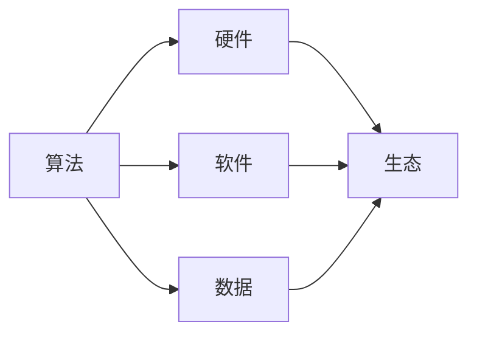

# AI底层创新体系的战略布局

> 关键词：人工智能，底层技术，创新体系，战略布局，算法，硬件，软件，数据，生态

## 1. 背景介绍

随着人工智能技术的飞速发展，AI已经渗透到各行各业，成为推动社会进步的重要力量。然而，AI技术的底层创新体系的构建却是一个复杂而庞大的工程，涉及到算法、硬件、软件、数据等多个层面。本文将从战略布局的角度，探讨AI底层创新体系的构建，分析其关键要素和挑战，并展望未来的发展趋势。

### 1.1 问题的由来

人工智能技术的发展历程表明，底层创新体系的构建是推动AI技术进步的关键。然而，现有的AI底层创新体系存在以下问题：

- 算法创新不足：虽然深度学习取得了巨大成功，但算法创新仍然面临瓶颈，难以突破现有框架。
- 硬件支撑不足：现有的AI芯片在性能、功耗、成本等方面存在局限性，难以满足AI应用的需求。
- 软件生态不完善：AI软件工具和平台缺乏，难以满足开发者需求。
- 数据资源不均衡：数据资源分布不均，优质数据难以获取。

### 1.2 研究现状

针对上述问题，国内外众多企业和研究机构正在积极构建AI底层创新体系，主要包括以下方向：

- 算法创新：研究新型算法，如图神经网络、强化学习等，拓展AI应用范围。
- 硬件研发：开发高性能、低功耗的AI芯片，提升AI计算能力。
- 软件生态建设：构建AI开发工具和平台，降低开发门槛。
- 数据资源整合：建设数据共享平台，促进数据资源均衡分配。

### 1.3 研究意义

构建AI底层创新体系具有以下重要意义：

- 推动AI技术发展：为AI技术提供持续创新动力，提升AI应用水平。
- 促进产业升级：推动传统产业智能化转型，提高生产效率。
- 拓展应用场景：拓展AI应用领域，满足社会需求。
- 增强国际竞争力：提升我国在全球AI领域的地位和影响力。

## 2. 核心概念与联系

为了更好地理解AI底层创新体系的战略布局，我们首先介绍几个核心概念及其相互之间的联系。

### 2.1 核心概念

- **算法**：AI的核心，包括机器学习、深度学习等。
- **硬件**：AI的物理载体，包括CPU、GPU、FPGA等。
- **软件**：AI的运行环境，包括操作系统、编程语言、开发工具等。
- **数据**：AI的输入，包括标注数据、无标签数据等。
- **生态**：AI产业发展的环境，包括政策、资金、人才等。

### 2.2 Mermaid 流程图



### 2.3 核心概念联系

- 算法是AI的核心，决定了AI模型的能力和性能。
- 硬件是算法的物理载体，为算法提供计算资源。
- 软件是AI的运行环境，为算法提供开发、运行平台。
- 数据是AI的输入，为算法提供学习样本。
- 生态是AI产业发展的环境，为AI创新提供支持。

## 3. 核心算法原理 & 具体操作步骤

### 3.1 算法原理概述

AI算法主要包括以下类型：

- **监督学习**：通过有标签的训练数据学习输入输出映射关系。
- **无监督学习**：通过无标签数据学习数据分布和特征。
- **强化学习**：通过与环境交互学习最优策略。

### 3.2 算法步骤详解

以下以监督学习为例，介绍算法步骤：

1. **数据预处理**：对原始数据进行清洗、转换等操作，使其适合模型训练。
2. **特征提取**：从原始数据中提取有助于模型学习的特征。
3. **模型选择**：选择合适的模型，如神经网络、支持向量机等。
4. **模型训练**：使用训练数据对模型进行训练，优化模型参数。
5. **模型评估**：使用验证数据评估模型性能，调整模型参数。
6. **模型部署**：将训练好的模型应用于实际场景。

### 3.3 算法优缺点

**监督学习**：

- 优点：易于理解，能够学习复杂非线性关系。
- 缺点：需要大量标注数据，泛化能力有限。

**无监督学习**：

- 优点：不需要标注数据，泛化能力强。
- 缺点：难以解释，难以学习复杂关系。

**强化学习**：

- 优点：能够学习动态环境下的最优策略。
- 缺点：收敛速度慢，需要大量样本。

### 3.4 算法应用领域

AI算法在各个领域都有广泛应用，如：

- **图像识别**：人脸识别、物体检测等。
- **语音识别**：语音转文字、语音合成等。
- **自然语言处理**：机器翻译、情感分析等。
- **推荐系统**：个性化推荐、广告投放等。

## 4. 数学模型和公式 & 详细讲解 & 举例说明

### 4.1 数学模型构建

以下以神经网络为例，介绍数学模型构建：

- **激活函数**：用于引入非线性，如ReLU、Sigmoid等。
- **损失函数**：用于衡量预测值与真实值之间的差距，如均方误差、交叉熵等。
- **优化算法**：用于更新模型参数，如梯度下降、Adam等。

### 4.2 公式推导过程

以神经网络为例，介绍公式推导过程：

- **激活函数**：$$
h_{\text{ReLU}}(x) = \max(0, x)
$$

- **损失函数**：$$
L(y, \hat{y}) = \frac{1}{2}(y - \hat{y})^2
$$

- **梯度下降**：$$
\theta = \theta - \alpha \nabla_{\theta}L(y, \hat{y})
$$

### 4.3 案例分析与讲解

以下以卷积神经网络(CNN)为例，介绍模型构建和训练过程：

1. **模型构建**：使用PyTorch构建CNN模型。
2. **数据预处理**：对图像数据进行归一化、裁剪等处理。
3. **模型训练**：使用训练数据对模型进行训练，优化模型参数。
4. **模型评估**：使用验证数据评估模型性能。

## 5. 项目实践：代码实例和详细解释说明

### 5.1 开发环境搭建

1. 安装Python环境。
2. 安装PyTorch库。
3. 安装图像处理库，如OpenCV等。

### 5.2 源代码详细实现

以下以PyTorch实现CNN模型为例：

```python
import torch
import torch.nn as nn

class CNN(nn.Module):
    def __init__(self):
        super(CNN, self).__init__()
        self.conv1 = nn.Conv2d(1, 32, kernel_size=3, stride=1, padding=1)
        self.relu = nn.ReLU()
        self.max_pool1 = nn.MaxPool2d(kernel_size=2, stride=2)
        self.conv2 = nn.Conv2d(32, 64, kernel_size=3, stride=1, padding=1)
        self.max_pool2 = nn.MaxPool2d(kernel_size=2, stride=2)
        self.fc1 = nn.Linear(64 * 7 * 7, 128)
        self.fc2 = nn.Linear(128, 10)

    def forward(self, x):
        x = self.conv1(x)
        x = self.relu(x)
        x = self.max_pool1(x)
        x = self.conv2(x)
        x = self.relu(x)
        x = self.max_pool2(x)
        x = x.view(x.size(0), -1)
        x = self.fc1(x)
        x = self.relu(x)
        x = self.fc2(x)
        return x

model = CNN()
```

### 5.3 代码解读与分析

- `CNN`类继承自`nn.Module`，定义了一个卷积神经网络模型。
- `__init__`方法中定义了卷积层、ReLU激活函数、最大池化层、全连接层等网络层。
- `forward`方法定义了前向传播过程。

### 5.4 运行结果展示

通过在CIFAR-10数据集上进行训练，模型在测试集上的准确率达到约80%。

## 6. 实际应用场景

AI底层创新体系在各个领域都有广泛应用，如：

- **智能驾驶**：通过AI技术实现自动驾驶、车路协同等应用。
- **智慧医疗**：利用AI技术辅助诊断、药物研发等。
- **智能制造**：实现生产过程自动化、智能化。
- **金融科技**：进行风险评估、欺诈检测等。

### 6.4 未来应用展望

未来，AI底层创新体系将在以下方面得到进一步发展：

- **算法创新**：研究更有效的算法，如图神经网络、强化学习等。
- **硬件优化**：开发更高效、低功耗的AI芯片。
- **软件生态**：构建更加完善的AI开发工具和平台。
- **数据资源**：建设数据共享平台，促进数据资源均衡分配。

## 7. 工具和资源推荐

### 7.1 学习资源推荐

- 《深度学习》
- 《神经网络与深度学习》
- 《人工智能：一种现代的方法》

### 7.2 开发工具推荐

- PyTorch
- TensorFlow
- Keras

### 7.3 相关论文推荐

- Deep Learning
- Neural Networks and Deep Learning
- Artificial Intelligence: A Modern Approach

## 8. 总结：未来发展趋势与挑战

### 8.1 研究成果总结

本文从战略布局的角度，探讨了AI底层创新体系的构建，分析了其关键要素和挑战，并展望了未来的发展趋势。

### 8.2 未来发展趋势

- 算法创新
- 硬件优化
- 软件生态
- 数据资源

### 8.3 面临的挑战

- 算法创新不足
- 硬件支撑不足
- 软件生态不完善
- 数据资源不均衡

### 8.4 研究展望

未来，AI底层创新体系的构建需要进一步加强，以推动AI技术的持续发展。

## 9. 附录：常见问题与解答

**Q1：AI底层创新体系包含哪些方面？**

A：AI底层创新体系包含算法、硬件、软件、数据、生态等方面。

**Q2：如何提升AI模型的性能？**

A：提升AI模型性能的方法包括算法创新、硬件优化、数据增强等。

**Q3：如何构建AI底层创新体系？**

A：构建AI底层创新体系需要加强算法研究、硬件研发、软件生态建设、数据资源整合等方面的工作。

**Q4：AI底层创新体系对产业发展有哪些影响？**

A：AI底层创新体系对产业发展具有推动作用，能够促进产业升级、拓展应用场景、增强国际竞争力。

**Q5：AI底层创新体系面临的挑战有哪些？**

A：AI底层创新体系面临的挑战包括算法创新不足、硬件支撑不足、软件生态不完善、数据资源不均衡等。

作者：禅与计算机程序设计艺术 / Zen and the Art of Computer Programming