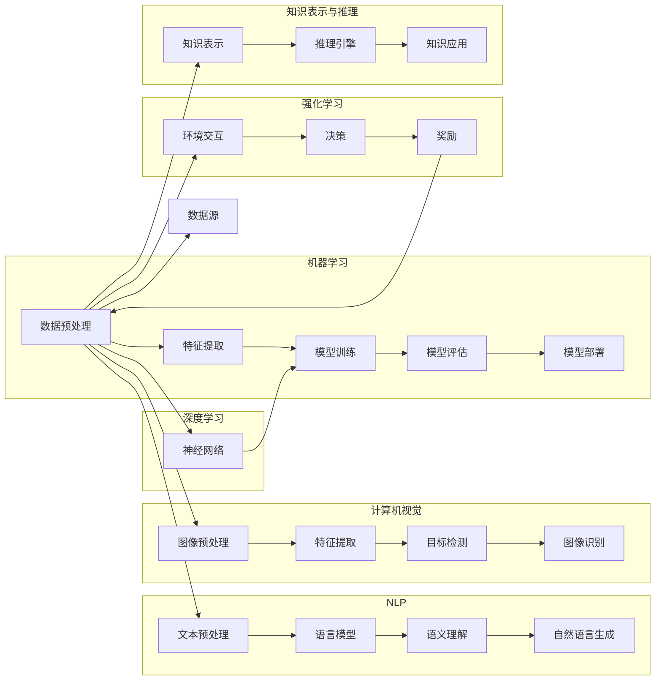

# AI技术趋势与应用场景

> 关键词：人工智能，机器学习，深度学习，自然语言处理，计算机视觉，应用场景，未来趋势

## 1. 背景介绍

人工智能（AI）作为计算机科学的一个分支，已经经历了数十年的发展。从早期的专家系统到如今的深度学习，AI技术取得了长足的进步。随着计算能力的提升和大数据的积累，AI技术正在从实验室走向现实世界，深刻地影响着各行各业。本文将探讨AI技术的核心概念、当前趋势、应用场景以及未来发展方向。

## 2. 核心概念与联系

### 2.1 核心概念

- **机器学习**：机器学习是AI的一个子领域，它使计算机能够从数据中学习并做出决策或预测，而不是通过明确的编程指令。

- **深度学习**：深度学习是机器学习的一个子集，它使用类似于人脑的神经网络结构来学习数据中的复杂模式。

- **自然语言处理（NLP）**：NLP是AI的一个应用领域，它使计算机能够理解、解释和生成人类语言。

- **计算机视觉**：计算机视觉是AI的一个应用领域，它使计算机能够从图像或视频中提取信息。

- **强化学习**：强化学习是一种机器学习方法，通过试错学习在给定环境中做出最优决策。

- **知识表示与推理**：知识表示是AI的一个基础领域，它研究如何将知识编码到计算机系统中，推理则是使用这些知识来解决问题。

### 2.2 架构的 Mermaid 流程图



## 3. 核心算法原理 & 具体操作步骤

### 3.1 算法原理概述

#### 3.1.1 机器学习

机器学习算法根据数据类型和任务类型分为监督学习、无监督学习和强化学习。监督学习通过标记的训练数据来训练模型，无监督学习从无标记数据中寻找模式，强化学习通过试错来学习最佳策略。

#### 3.1.2 深度学习

深度学习使用多层神经网络来学习数据中的复杂模式。通过前向传播和反向传播算法，模型可以从数据中学习特征和表示。

#### 3.1.3 自然语言处理

NLP算法包括文本预处理、语言模型、语义理解和自然语言生成。这些算法使计算机能够理解和生成人类语言。

#### 3.1.4 计算机视觉

计算机视觉算法包括图像预处理、特征提取、目标检测和图像识别。这些算法使计算机能够从图像和视频中提取信息。

#### 3.1.5 强化学习

强化学习算法通过与环境的交互来学习最佳策略。通过奖励机制，模型能够不断改进其行为。

#### 3.1.6 知识表示与推理

知识表示将知识编码到计算机系统中，推理算法使用这些知识来解决问题。

### 3.2 算法步骤详解

#### 3.2.1 机器学习

1. 数据收集：收集相关领域的数据。
2. 数据预处理：清洗、归一化、降维等。
3. 特征提取：从数据中提取有用的特征。
4. 模型训练：使用训练数据训练模型。
5. 模型评估：使用测试数据评估模型性能。
6. 模型部署：将模型应用到实际场景中。

#### 3.2.2 深度学习

1. 数据准备：收集和预处理数据。
2. 神经网络设计：设计神经网络结构。
3. 模型训练：训练神经网络模型。
4. 模型评估：评估模型性能。
5. 模型优化：调整模型参数以改进性能。

#### 3.2.3 自然语言处理

1. 文本预处理：分词、词性标注、去除停用词等。
2. 语言模型：训练语言模型以预测下一个词。
3. 语义理解：理解文本的深层含义。
4. 自然语言生成：生成新的文本。

#### 3.2.4 计算机视觉

1. 图像预处理：调整图像大小、灰度化等。
2. 特征提取：提取图像中的特征。
3. 目标检测：识别图像中的对象。
4. 图像识别：识别图像中的内容。

#### 3.2.5 强化学习

1. 环境定义：定义环境状态、动作和奖励。
2. 策略学习：学习最佳策略。
3. 策略执行：执行策略并获取奖励。
4. 策略评估：评估策略性能。
5. 策略改进：改进策略以获得更好的性能。

#### 3.2.6 知识表示与推理

1. 知识表示：将知识编码到计算机系统中。
2. 推理引擎：使用推理算法处理问题。
3. 知识应用：将知识应用到实际场景中。

### 3.3 算法优缺点

每种算法都有其优缺点，以下是几种主要算法的优缺点：

- **机器学习**：
  - 优点：通用性强，适用于各种类型的数据和任务。
  - 缺点：需要大量标注数据，模型可解释性较差。

- **深度学习**：
  - 优点：能够处理复杂数据，性能优异。
  - 缺点：模型可解释性较差，需要大量数据和计算资源。

- **自然语言处理**：
  - 优点：能够处理和理解人类语言。
  - 缺点：处理歧义和上下文理解仍具有挑战性。

- **计算机视觉**：
  - 优点：能够从图像和视频中提取信息。
  - 缺点：对光照、角度等因素敏感。

- **强化学习**：
  - 优点：能够学习复杂的环境和策略。
  - 缺点：学习过程可能非常缓慢。

- **知识表示与推理**：
  - 优点：能够处理逻辑和推理问题。
  - 缺点：知识表示复杂，推理过程可能非常复杂。

### 3.4 算法应用领域

AI技术在各个领域都有广泛的应用，以下是部分应用领域：

- **医疗保健**：用于疾病诊断、药物发现、个性化医疗等。
- **金融**：用于风险评估、欺诈检测、投资建议等。
- **交通**：用于自动驾驶、交通流量管理、智能交通信号灯等。
- **零售**：用于客户画像、需求预测、个性化推荐等。
- **制造业**：用于质量控制、预测性维护、自动化生产等。

## 4. 数学模型和公式 & 详细讲解 & 举例说明

### 4.1 数学模型构建

以下是几个常用的AI数学模型：

- **线性回归**：$ y = \beta_0 + \beta_1x + \epsilon $

- **逻辑回归**：$ P(y=1) = \sigma(\beta_0 + \beta_1x) $

- **神经网络**：$ y = \sigma(Wx + b) $

### 4.2 公式推导过程

- **线性回归**：最小化误差平方和。

- **逻辑回归**：使用对数似然函数来估计概率。

- **神经网络**：使用链式法则进行反向传播。

### 4.3 案例分析与讲解

#### 4.3.1 线性回归

假设我们要预测房价，我们可以使用线性回归模型来建模：

- **数据**：包含房价和若干特征的房屋销售数据。

- **模型**：$ y = \beta_0 + \beta_1x_1 + \beta_2x_2 + ... + \beta_nx_n $

- **训练**：使用最小二乘法来估计参数 $\beta_0, \beta_1, ..., \beta_n$。

- **预测**：使用模型来预测新的房价。

#### 4.3.2 逻辑回归

假设我们要预测一个二元分类问题，我们可以使用逻辑回归模型来建模：

- **数据**：包含特征和标签的二元分类数据。

- **模型**：$ P(y=1) = \sigma(\beta_0 + \beta_1x_1 + \beta_2x_2 + ... + \beta_nx_n) $

- **训练**：使用最大似然估计来估计参数 $\beta_0, \beta_1, ..., \beta_n$。

- **预测**：使用模型来预测新样本的类别。

#### 4.3.3 神经网络

假设我们要识别手写数字，我们可以使用卷积神经网络来建模：

- **数据**：包含手写数字图像和标签的数据集。

- **模型**：一个多层卷积神经网络。

- **训练**：使用反向传播算法来训练模型。

- **预测**：使用训练好的模型来识别新的手写数字。

## 5. 项目实践：代码实例和详细解释说明

### 5.1 开发环境搭建

以下是使用Python和TensorFlow进行机器学习项目开发的环境搭建步骤：

1. 安装Anaconda。

2. 创建并激活虚拟环境。

3. 安装TensorFlow。

4. 安装相关库，如NumPy、Pandas、Scikit-learn等。

### 5.2 源代码详细实现

以下是一个使用TensorFlow实现线性回归的简单示例：

```python
import tensorflow as tf

# 创建模型
model = tf.keras.Sequential([
    tf.keras.layers.Dense(units=1, input_shape=[1])
])

# 编译模型
model.compile(optimizer='sgd', loss='mean_squared_error')

# 训练模型
model.fit(x_train, y_train, epochs=100)

# 预测结果
y_pred = model.predict(x_test)
```

### 5.3 代码解读与分析

这个示例中，我们首先创建了一个包含一个全连接层的模型。然后，我们使用随机梯度下降优化器和均方误差损失函数来编译模型。接着，我们使用训练数据来训练模型，最后使用测试数据来评估模型的性能。

### 5.4 运行结果展示

假设我们有一个包含100个样本的房价数据集，我们可以使用上述代码来训练一个线性回归模型，并使用测试集来评估模型的性能。

## 6. 实际应用场景

### 6.1 医疗保健

AI技术在医疗保健领域的应用包括：

- 疾病诊断：使用AI模型来辅助医生诊断疾病。

- 药物发现：使用AI模型来发现新的药物。

- 个性化医疗：使用AI模型来制定个性化的治疗方案。

### 6.2 金融

AI技术在金融领域的应用包括：

- 风险评估：使用AI模型来评估贷款风险。

- 欺诈检测：使用AI模型来检测欺诈行为。

- 投资建议：使用AI模型来提供投资建议。

### 6.3 交通

AI技术在交通领域的应用包括：

- 自动驾驶：使用AI技术来控制车辆。

- 交通流量管理：使用AI模型来预测交通流量并优化路线。

- 智能交通信号灯：使用AI模型来控制交通信号灯。

### 6.4 零售

AI技术在零售领域的应用包括：

- 客户画像：使用AI模型来分析客户行为。

- 需求预测：使用AI模型来预测产品需求。

- 个性化推荐：使用AI模型来提供个性化推荐。

## 7. 工具和资源推荐

### 7.1 学习资源推荐

- 《机器学习》（周志华）

- 《深度学习》（Ian Goodfellow）

- 《自然语言处理综合指南》（Daniel Jurafsky）

- 《计算机视觉：算法与应用》（Richard Szeliski）

### 7.2 开发工具推荐

- TensorFlow

- PyTorch

- Keras

- Scikit-learn

### 7.3 相关论文推荐

- "The Hundred-Page Machine Learning Book" by Andriy Burkov

- "Deep Learning for Natural Language Processing" by Daniel H. Jurafsky and James H. Martin

- "Computer Vision: Algorithms and Applications" by Richard Szeliski

- "Deep Learning" by Ian Goodfellow, Yoshua Bengio, and Aaron Courville

## 8. 总结：未来发展趋势与挑战

### 8.1 研究成果总结

AI技术在过去几十年取得了巨大的进步，从机器学习、深度学习到自然语言处理、计算机视觉，AI技术已经深入到我们生活的方方面面。随着计算能力的提升和大数据的积累，AI技术的应用范围还将不断扩大。

### 8.2 未来发展趋势

- **更强大的模型**：随着计算能力的提升，我们将能够训练更大、更复杂的模型。

- **更丰富的数据**：随着物联网和传感器技术的发展，我们将能够收集到更多更丰富的数据。

- **更高效的算法**：我们将开发出更高效、更鲁棒的算法。

- **更广泛的应用**：AI技术将在更多领域得到应用，如医疗保健、金融、交通、零售等。

### 8.3 面临的挑战

- **数据隐私**：随着AI技术的应用，数据隐私问题越来越突出。

- **算法偏见**：AI模型可能会学习到数据中的偏见，导致歧视。

- **可解释性**：AI模型的可解释性较差，难以理解其决策过程。

- **安全性和可靠性**：AI系统需要保证安全性和可靠性。

### 8.4 研究展望

- **可解释AI**：开发可解释的AI模型，提高模型的透明度和可信度。

- **隐私保护AI**：开发隐私保护AI技术，保护用户数据隐私。

- **公平AI**：开发公平的AI模型，避免算法偏见。

- **安全AI**：开发安全的AI系统，防止恶意攻击。

AI技术正在快速发展，未来将为我们带来更多的惊喜和挑战。我们需要不断探索和创新，以推动AI技术的发展，使其更好地服务于人类社会。

## 9. 附录：常见问题与解答

**Q1：什么是机器学习？**

A：机器学习是AI的一个子领域，它使计算机能够从数据中学习并做出决策或预测，而不是通过明确的编程指令。

**Q2：什么是深度学习？**

A：深度学习是机器学习的一个子集，它使用类似于人脑的神经网络结构来学习数据中的复杂模式。

**Q3：什么是自然语言处理？**

A：自然语言处理是AI的一个应用领域，它使计算机能够理解、解释和生成人类语言。

**Q4：什么是计算机视觉？**

A：计算机视觉是AI的一个应用领域，它使计算机能够从图像或视频中提取信息。

**Q5：什么是强化学习？**

A：强化学习是一种机器学习方法，通过试错学习在给定环境中做出最优决策。

**Q6：什么是知识表示与推理？**

A：知识表示是AI的一个基础领域，它研究如何将知识编码到计算机系统中，推理则是使用这些知识来解决问题。

**Q7：AI技术在医疗保健领域的应用有哪些？**

A：AI技术在医疗保健领域的应用包括疾病诊断、药物发现、个性化医疗等。

**Q8：AI技术在金融领域的应用有哪些？**

A：AI技术在金融领域的应用包括风险评估、欺诈检测、投资建议等。

**Q9：AI技术在交通领域的应用有哪些？**

A：AI技术在交通领域的应用包括自动驾驶、交通流量管理、智能交通信号灯等。

**Q10：AI技术在零售领域的应用有哪些？**

A：AI技术在零售领域的应用包括客户画像、需求预测、个性化推荐等。

作者：禅与计算机程序设计艺术 / Zen and the Art of Computer Programming