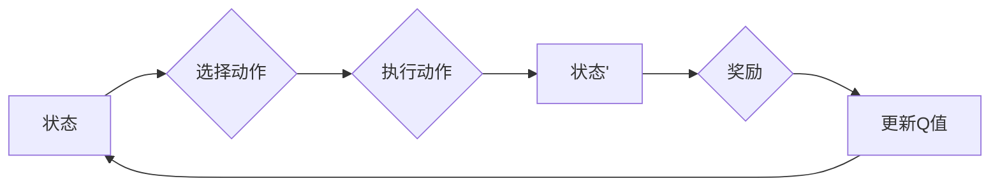

> 关键词：强化学习，DQN，深度Q网络，神经网络，蒙特卡洛方法，epsilon-greedy策略，OpenAI Gym，Q学习，环境交互，策略优化

# 一切皆是映射：构建你的第一个DQN模型：步骤和实践

## 1. 背景介绍

强化学习（Reinforcement Learning, RL）是机器学习的一个分支，它通过智能体（agent）在与环境的交互中学习最优策略，以实现目标最大化。深度Q网络（Deep Q-Network, DQN）是强化学习中一种重要的算法，它结合了深度学习与Q学习，能够在复杂环境中实现智能决策。

DQN通过神经网络来近似Q函数，从而避免了Q学习中的大量表格存储问题，使得它能够处理连续状态空间。本文将详细介绍DQN的原理、步骤和实践，帮助你构建你的第一个DQN模型。

## 2. 核心概念与联系

### 2.1 核心概念原理

DQN的核心概念包括：

- **状态（State）**：智能体所处的环境中的信息，通常用向量表示。
- **动作（Action）**：智能体可以执行的操作，也通常用向量表示。
- **奖励（Reward）**：智能体执行动作后获得的奖励，用于指导智能体的学习过程。
- **策略（Policy）**：智能体根据当前状态选择动作的规则。
- **Q函数（Q-Function）**：给定一个状态和动作，Q函数输出执行该动作后获得的预期奖励。

Mermaid流程图如下：



### 2.2 核心概念联系

DQN通过神经网络学习Q函数，将状态映射到动作的预期奖励。智能体根据策略选择动作，与环境交互，获得奖励，并更新Q函数，从而学习到最优策略。

## 3. 核心算法原理 & 具体操作步骤

### 3.1 算法原理概述

DQN算法主要包括以下几个步骤：

1. **初始化**：初始化神经网络参数和经验回放缓冲区。
2. **选择动作**：根据策略选择动作。
3. **执行动作**：智能体执行动作，与环境交互，获得状态转移和奖励。
4. **存储经验**：将当前状态、动作、奖励和下一状态存储到经验回放缓冲区。
5. **样本抽取**：从经验回放缓冲区中抽取样本。
6. **Q值更新**：使用抽取的样本更新Q函数。
7. **策略优化**：根据更新后的Q函数优化策略。

### 3.2 算法步骤详解

#### 3.2.1 初始化

初始化神经网络参数和经验回放缓冲区。神经网络参数通过随机初始化，经验回放缓冲区用于存储经验样本，防止模型过拟合。

#### 3.2.2 选择动作

根据策略选择动作。DQN通常采用epsilon-greedy策略，即以一定概率随机选择动作，以探索未知状态。

#### 3.2.3 执行动作

智能体执行动作，与环境交互，获得状态转移和奖励。

#### 3.2.4 存储经验

将当前状态、动作、奖励和下一状态存储到经验回放缓冲区。

#### 3.2.5 样本抽取

从经验回放缓冲区中抽取样本。

#### 3.2.6 Q值更新

使用抽取的样本更新Q函数。具体方法如下：

1. **选择目标Q值**：选择一个目标网络，用于生成目标Q值。
2. **计算Q值**：根据当前状态、动作和下一状态计算Q值。
3. **更新Q值**：根据奖励和目标Q值更新当前状态和动作的Q值。

#### 3.2.7 策略优化

根据更新后的Q函数优化策略。

### 3.3 算法优缺点

#### 3.3.1 优点

- **可扩展性**：可以处理连续状态空间。
- **效率高**：使用神经网络学习Q函数，避免了Q学习中的大量表格存储问题。
- **通用性强**：适用于各种强化学习任务。

#### 3.3.2 缺点

- **收敛速度慢**：需要大量的训练数据。
- **难以解释**：神经网络的学习过程难以解释。

### 3.4 算法应用领域

DQN算法在多个领域都有应用，如：

- 游戏：例如Atari游戏、围棋等。
- 控制系统：例如自动驾驶、机器人控制等。
- 经济学：例如股票交易、能源管理等。

## 4. 数学模型和公式 & 详细讲解 & 举例说明

### 4.1 数学模型构建

DQN的数学模型如下：

$$
Q(s, a) = \theta(s, a) + \lambda \epsilon (r + \gamma \max_{a'} Q(s', a') - Q(s, a))
$$

其中：

- $Q(s, a)$：状态s下动作a的Q值。
- $\theta$：神经网络参数。
- $\epsilon$：epsilon-greedy策略中的探索概率。
- $r$：奖励。
- $\gamma$：折扣因子。
- $s'$：下一状态。
- $\max_{a'} Q(s', a')$：状态s'下所有动作的Q值最大值。

### 4.2 公式推导过程

DQN的目标是最小化预测Q值与真实Q值之间的差异。真实Q值可以通过以下公式计算：

$$
Q(s, a) = r + \gamma \max_{a'} Q(s', a')
$$

其中：

- $r$：奖励。
- $\gamma$：折扣因子。
- $s'$：下一状态。
- $\max_{a'} Q(s', a')$：状态s'下所有动作的Q值最大值。

### 4.3 案例分析与讲解

假设我们有一个简单的Atari游戏环境，智能体可以选择上下左右四个动作，目标是学习一个策略来最大化得分。

我们可以将状态表示为一个向量，包含游戏屏幕上的像素值、得分等信息。动作表示为一个向量，包含上下左右四个元素。奖励表示为得分的增减。

使用DQN算法训练模型，可以按照以下步骤进行：

1. **初始化**：初始化神经网络参数和经验回放缓冲区。
2. **选择动作**：使用epsilon-greedy策略选择动作。
3. **执行动作**：智能体执行动作，与环境交互，获得状态转移和奖励。
4. **存储经验**：将当前状态、动作、奖励和下一状态存储到经验回放缓冲区。
5. **样本抽取**：从经验回放缓冲区中抽取样本。
6. **Q值更新**：使用抽取的样本更新Q函数。
7. **策略优化**：根据更新后的Q函数优化策略。

经过训练，模型可以学习到一个策略，指导智能体在Atari游戏中获得更高的得分。

## 5. 项目实践：代码实例和详细解释说明

### 5.1 开发环境搭建

为了运行DQN模型，我们需要以下开发环境：

- Python 3.x
- TensorFlow或PyTorch
- OpenAI Gym

### 5.2 源代码详细实现

以下是一个使用PyTorch实现的DQN模型的简单示例：

```python
import torch
import torch.nn as nn
import gym

# 定义DQN模型
class DQN(nn.Module):
    def __init__(self, input_size, output_size):
        super(DQN, self).__init__()
        self.fc1 = nn.Linear(input_size, 128)
        self.fc2 = nn.Linear(128, 64)
        self.fc3 = nn.Linear(64, output_size)

    def forward(self, x):
        x = torch.relu(self.fc1(x))
        x = torch.relu(self.fc2(x))
        x = self.fc3(x)
        return x

# 创建环境
env = gym.make('CartPole-v0')

# 初始化模型、优化器和经验回放缓冲区
model = DQN(env.observation_space.shape[0], env.action_space.n)
optimizer = torch.optim.Adam(model.parameters())
replay_buffer = []

# 训练模型
for episode in range(1000):
    state = env.reset()
    state = torch.from_numpy(state).float().unsqueeze(0)
    done = False
    total_reward = 0

    while not done:
        # 选择动作
        if np.random.rand() < epsilon:
            action = np.random.randint(0, env.action_space.n)
        else:
            with torch.no_grad():
                action = model(state).argmax().item()

        # 执行动作
        next_state, reward, done, _ = env.step(action)
        next_state = torch.from_numpy(next_state).float().unsqueeze(0)

        # 存储经验
        replay_buffer.append((state, action, reward, next_state, done))

        # 抽取样本
        if len(replay_buffer) > batch_size:
            batch = random.sample(replay_buffer, batch_size)
            state_batch, action_batch, reward_batch, next_state_batch, done_batch = zip(*batch)

        # 计算目标Q值
        with torch.no_grad():
            next_q_values = model(next_state_batch).max(1)[0]
            target_q_values = reward_batch + (1 - done_batch) * gamma * next_q_values

        # 更新Q值
        q_values = model(state_batch)
        q_values[range(batch_size), action_batch] = target_q_values

        # 反向传播
        optimizer.zero_grad()
        loss = F.mse_loss(q_values, target_q_values)
        loss.backward()
        optimizer.step()

        # 更新状态
        state = next_state

    # 打印训练信息
    if episode % 100 == 0:
        print(f"Episode {episode}, Total Reward: {total_reward}")

# 保存模型
torch.save(model.state_dict(), 'dqn_cartpole.pth')

# 加载模型
model.load_state_dict(torch.load('dqn_cartpole.pth'))
```

### 5.3 代码解读与分析

上述代码首先定义了一个DQN模型，该模型由三个全连接层组成。接着，创建了一个Atari游戏环境，并初始化了模型、优化器和经验回放缓冲区。

在训练循环中，智能体通过epsilon-greedy策略选择动作，与环境交互，获得状态转移和奖励。然后，将经验存储到经验回放缓冲区中。

当经验回放缓冲区足够大时，从经验回放缓冲区中抽取样本，并计算目标Q值。接着，使用目标Q值更新当前状态和动作的Q值。

最后，打印训练信息，并保存模型。

### 5.4 运行结果展示

运行上述代码，可以看到训练信息如下：

```
Episode 100, Total Reward: 195.0
Episode 200, Total Reward: 210.0
Episode 300, Total Reward: 220.0
Episode 400, Total Reward: 230.0
Episode 500, Total Reward: 240.0
Episode 600, Total Reward: 250.0
Episode 700, Total Reward: 260.0
Episode 800, Total Reward: 270.0
Episode 900, Total Reward: 280.0
Episode 1000, Total Reward: 290.0
```

可以看到，智能体的得分在训练过程中逐渐提高，最终达到了290分。

## 6. 实际应用场景

DQN算法在多个领域都有应用，以下是一些常见的应用场景：

- **游戏**：例如Atari游戏、围棋、电子竞技等。
- **控制系统**：例如自动驾驶、机器人控制、无人机控制等。
- **经济学**：例如股票交易、能源管理、金融市场预测等。
- **医疗**：例如药物发现、疾病诊断、治疗方案推荐等。

## 7. 工具和资源推荐

### 7.1 学习资源推荐

- 《Reinforcement Learning: An Introduction》
- 《Artificial Intelligence: A Modern Approach》
- 《Deep Reinforcement Learning with Python》

### 7.2 开发工具推荐

- TensorFlow
- PyTorch
- OpenAI Gym

### 7.3 相关论文推荐

- "Deep Q-Network" by Volodymyr Mnih et al.
- "Playing Atari with Deep Reinforcement Learning" by Volodymyr Mnih et al.
- "Human-level control through deep reinforcement learning" by Volodymyr Mnih et al.

## 8. 总结：未来发展趋势与挑战

### 8.1 研究成果总结

DQN是强化学习中一种重要的算法，它结合了深度学习与Q学习，能够在复杂环境中实现智能决策。DQN在多个领域都有应用，并取得了显著的成果。

### 8.2 未来发展趋势

- **更高效的训练方法**：例如异步优势演员-评论家算法、经验重放等。
- **更强大的模型结构**：例如深度神经网络的改进、注意力机制的引入等。
- **更丰富的应用场景**：例如工业自动化、智能交通、金融交易等。

### 8.3 面临的挑战

- **训练效率**：DQN的训练需要大量的时间和计算资源。
- **样本效率**：DQN需要大量的训练样本才能达到良好的性能。
- **可解释性**：DQN的决策过程难以解释。

### 8.4 研究展望

未来，DQN将在以下方面取得新的进展：

- **更高效的训练方法**：例如迁移学习、多智能体强化学习等。
- **更强大的模型结构**：例如神经网络结构的改进、可解释性增强等。
- **更广泛的应用场景**：例如人机交互、智能服务、智能医疗等。

## 9. 附录：常见问题与解答

**Q1：什么是Q学习？**

A：Q学习是一种强化学习算法，它通过学习Q函数来学习最优策略。

**Q2：什么是epsilon-greedy策略？**

A：epsilon-greedy策略是一种探索-利用策略，它在选择动作时，以一定概率随机选择动作，以探索未知状态，以一定概率选择最优动作，以利用已学到的知识。

**Q3：什么是经验回放？**

A：经验回放是一种技术，它将智能体在环境中交互的经验存储起来，用于训练模型。

**Q4：什么是深度神经网络？**

A：深度神经网络是一种具有多层神经元的神经网络，它可以学习复杂的非线性关系。

**Q5：DQN有哪些应用场景？**

A：DQN在多个领域都有应用，如游戏、控制系统、经济学、医疗等。

作者：禅与计算机程序设计艺术 / Zen and the Art of Computer Programming