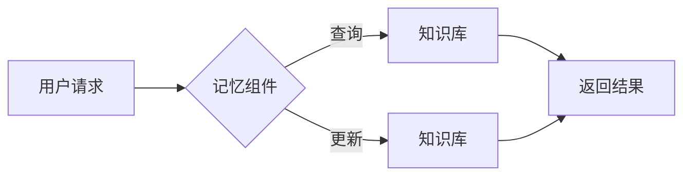

# 【LangChain编程：从入门到实践】记忆组件的应用

> 关键词：LangChain, 编程，记忆组件，知识库，自然语言处理，代码生成，AI助手，软件开发

## 1. 背景介绍

随着人工智能技术的飞速发展，自然语言处理（NLP）和代码生成技术逐渐成为软件开发领域的新宠。LangChain 是一个革命性的平台，它将 NLP 与代码生成技术相结合，为开发者提供了一个强大的工具，用于构建智能化的编程助手和自动化工具。在 LangChain 中，记忆组件是一个关键的功能，它能够存储和管理知识库，为代码生成和决策提供支持。本文将深入探讨 LangChain 编程中的记忆组件，从入门到实践，帮助开发者理解其原理、应用场景，并展示如何在项目中实现和利用它。

## 2. 核心概念与联系

### 2.1 LangChain 简介

LangChain 是一个开源平台，它将 NLP 技术与代码生成技术相结合，旨在简化开发流程，提高开发效率。LangChain 允许开发者使用自然语言来描述他们的需求，然后生成相应的代码。

### 2.2 记忆组件原理

记忆组件是 LangChain 的核心功能之一，它类似于一个知识库，用于存储和管理数据、事实、规则等信息。这些信息可以用于辅助代码生成、决策制定和智能问答等任务。

### 2.3 Mermaid 流程图



在这个流程图中，用户请求通过记忆组件与知识库进行交互。查询操作从知识库中检索信息，而更新操作则将新信息添加到知识库中。

## 3. 核心算法原理 & 具体操作步骤

### 3.1 算法原理概述

记忆组件的核心算法原理是基于键值对的存储机制。用户可以通过键（key）来检索与值（value）相关联的信息。

### 3.2 算法步骤详解

1. **初始化记忆组件**：创建一个内存或数据库来存储知识库。
2. **添加数据**：将数据以键值对的形式存储到知识库中。
3. **检索数据**：使用键来检索相应的值。
4. **更新数据**：当知识库中的信息发生变化时，更新相应的键值对。

### 3.3 算法优缺点

**优点**：

- **高效的数据检索**：通过键值对快速检索信息。
- **灵活的数据管理**：支持动态添加、更新和删除数据。

**缺点**：

- **内存限制**：对于大型知识库，内存消耗可能成为一个问题。
- **数据安全性**：需要确保知识库中的数据安全，防止未授权访问。

### 3.4 算法应用领域

- **代码生成**：存储编程语言语法规则、函数签名等信息，用于自动生成代码。
- **智能问答**：存储常见问题和答案，用于构建智能客服系统。
- **决策支持**：存储业务规则和决策逻辑，用于辅助决策制定。

## 4. 数学模型和公式 & 详细讲解 & 举例说明

### 4.1 数学模型构建

记忆组件的数学模型可以表示为一个键值对集合：

$$
\text{{Memory}} = \{ (k_1, v_1), (k_2, v_2), \ldots, (k_n, v_n) \}
$$

其中，$k_i$ 是键，$v_i$ 是与键相关联的值。

### 4.2 公式推导过程

记忆组件的查询操作可以通过哈希表实现，其时间复杂度为 $O(1)$。

### 4.3 案例分析与讲解

假设我们有一个包含编程语言语法规则的记忆组件。当用户请求生成一段代码时，记忆组件可以通过检索语法规则来生成代码。

## 5. 项目实践：代码实例和详细解释说明

### 5.1 开发环境搭建

- 安装 Node.js 和 npm
- 创建一个新的 Node.js 项目并初始化
- 安装 LangChain 和其他必要的依赖

### 5.2 源代码详细实现

```javascript
const { Memory } = require('langchain');
const { OpenAI } = require('langchain chain);

const memory = new Memory();

// 添加数据
memory.add('function', 'A function declaration in JavaScript looks like this: function functionName() { /* code */ }');

// 检索数据
const functionDeclaration = memory.get('function');
console.log(functionDeclaration); // 输出: A function declaration in JavaScript looks like this: function functionName() { /* code */ }

// 更新数据
memory.update('function', 'A function declaration in JavaScript looks like this: async/await function functionName() { /* code */ }');

// 再次检索数据
const updatedFunctionDeclaration = memory.get('function');
console.log(updatedFunctionDeclaration); // 输出: A function declaration in JavaScript looks like this: async/await function functionName() { /* code */ }
```

### 5.3 代码解读与分析

这段代码展示了如何使用 LangChain 的 Memory 组件来存储、检索和更新数据。首先，我们创建了一个新的 Memory 实例。然后，我们使用 `add` 方法添加了一条数据，使用 `get` 方法检索数据，最后使用 `update` 方法更新数据。

### 5.4 运行结果展示

运行上述代码，将在控制台输出更新后的函数声明格式。

## 6. 实际应用场景

### 6.1 代码生成

记忆组件可以存储编程语言语法规则、库函数等信息，用于自动生成代码。例如，可以根据用户描述生成相应的 JavaScript 代码。

### 6.2 智能问答

记忆组件可以存储常见问题和答案，用于构建智能客服系统。例如，用户可以询问常见的技术问题，记忆组件可以快速给出答案。

### 6.3 决策支持

记忆组件可以存储业务规则和决策逻辑，用于辅助决策制定。例如，根据客户信息和企业规则，记忆组件可以推荐合适的产品。

## 7. 工具和资源推荐

### 7.1 学习资源推荐

- LangChain 官方文档：https://langchain.com/docs/
- LangChain GitHub 仓库：https://github.com/hwchase17/LangChain

### 7.2 开发工具推荐

- Node.js 和 npm：https://nodejs.org/
- Visual Studio Code：https://code.visualstudio.com/

### 7.3 相关论文推荐

- "The Language Model is All You Need" by Aditya Raghavan et al.
- "Generating Code from Natural Language" by Daniele Ceva et al.

## 8. 总结：未来发展趋势与挑战

### 8.1 研究成果总结

本文介绍了 LangChain 编程中的记忆组件，探讨了其原理、应用场景和实现方法。记忆组件作为一种强大的知识库，可以用于代码生成、智能问答和决策支持等多种场景。

### 8.2 未来发展趋势

- 记忆组件将支持更复杂的数据类型，如图像、视频等。
- 记忆组件将具备更强大的推理能力，能够进行更复杂的决策。
- 记忆组件将与其他人工智能技术（如强化学习、迁移学习等）相结合，实现更高级的智能应用。

### 8.3 面临的挑战

- 数据安全性和隐私保护。
- 记忆组件的规模和复杂性。
- 记忆组件的可解释性和可信度。

### 8.4 研究展望

随着人工智能技术的不断发展，记忆组件将在更多领域得到应用，为软件开发和人工智能应用带来新的可能性。

## 9. 附录：常见问题与解答

**Q1：记忆组件如何保证数据的安全性？**

A1：为了确保数据安全性，可以采取以下措施：

- 使用加密技术保护数据。
- 实施访问控制策略，限制对数据库的访问。
- 定期备份数据，以防数据丢失。

**Q2：记忆组件如何处理大型数据集？**

A2：对于大型数据集，可以考虑以下策略：

- 使用分布式数据库。
- 对数据进行分区和索引。
- 使用内存缓存技术。

**Q3：记忆组件如何与其他人工智能技术结合？**

A3：记忆组件可以与其他人工智能技术结合，例如：

- 与强化学习结合，用于构建智能决策系统。
- 与迁移学习结合，用于迁移知识到新的任务。
- 与生成模型结合，用于生成新的数据。

作者：禅与计算机程序设计艺术 / Zen and the Art of Computer Programming