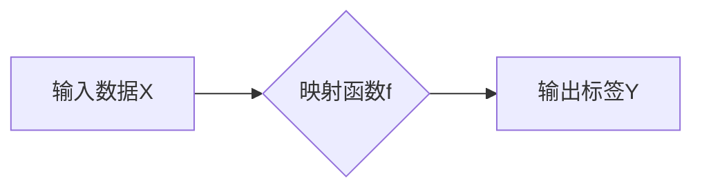
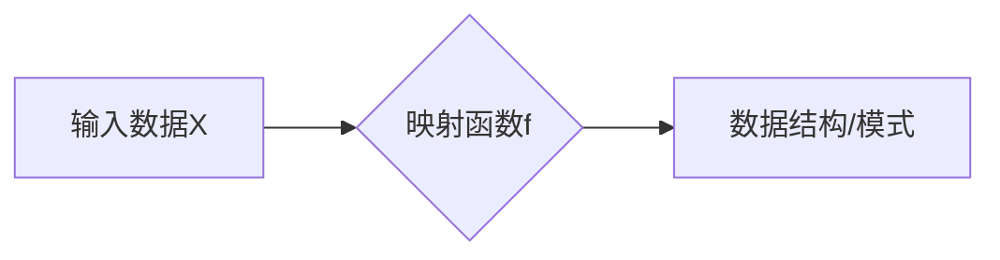

> - 监督学习
> - 非监督学习
> - 深度学习
> - 映射学习
> - 特征学习
> - 知识表示

# 一切皆是映射：监督学习和非监督学习的区别与联系

## 1. 背景介绍

在人工智能和机器学习的广阔领域，监督学习和非监督学习是两大核心的学习范式。它们如同两股强大的电流，推动着人工智能的发展。那么，什么是监督学习？什么是非监督学习？它们之间有何区别与联系？本文将深入探讨这两个核心概念，揭示它们背后的映射原理，以及在实际应用中的差异和共通之处。

## 2. 核心概念与联系

### 2.1 监督学习

监督学习是一种基于标记数据的机器学习方法，其核心思想是通过学习输入和输出之间的映射关系来预测或分类未知数据。在监督学习中，输入数据 $X$ 与对应的输出标签 $Y$ 同时给出，学习过程旨在找到一种映射函数 $f$，使得 $f(X) = Y$。

Mermaid流程图如下：



### 2.2 非监督学习

非监督学习则是在没有标签的情况下，通过分析数据之间的关系和模式来发现数据中的结构。非监督学习的目标是学习到数据中的内在结构，如聚类、关联规则或降维。

Mermaid流程图如下：



### 2.3 区别与联系

监督学习和非监督学习的主要区别在于是否有标签数据。监督学习依赖于已标记的输入输出对来学习映射关系，而非监督学习则没有这样的标记数据，而是通过数据本身的内在结构来学习。

然而，这两种学习方法并非完全独立，它们之间存在紧密的联系。例如，非监督学习可以用于数据预处理，如数据降维和特征提取，这些预处理步骤可以为监督学习提供更有效的输入数据。同样，监督学习的结果可以用于指导非监督学习，例如，通过监督学习得到的标签可以用来初始化非监督学习算法。

## 3. 核心算法原理 & 具体操作步骤

### 3.1 算法原理概述

#### 3.1.1 监督学习

监督学习的核心原理是学习一个函数，将输入数据映射到输出标签。常见的监督学习算法包括线性回归、逻辑回归、支持向量机(SVM)、决策树、随机森林、神经网络等。

#### 3.1.2 非监督学习

非监督学习的核心原理是发现数据中的内在结构或模式。常见的非监督学习算法包括聚类（如k-means、层次聚类）、关联规则学习（如Apriori算法）、降维（如PCA、t-SNE）等。

### 3.2 算法步骤详解

#### 3.2.1 监督学习

1. 数据收集：收集包含输入和输出标签的数据集。
2. 预处理：对数据进行清洗、归一化等预处理操作。
3. 选择模型：选择合适的监督学习模型。
4. 训练模型：使用训练数据训练模型，学习输入和输出之间的关系。
5. 评估模型：使用测试数据评估模型性能，调整模型参数。
6. 部署模型：将训练好的模型应用于新的数据，进行预测或分类。

#### 3.2.2 非监督学习

1. 数据收集：收集无标签的数据集。
2. 预处理：对数据进行清洗、归一化等预处理操作。
3. 选择模型：选择合适的非监督学习模型。
4. 训练模型：使用数据训练模型，发现数据中的内在结构或模式。
5. 分析结果：分析模型发现的结构或模式。
6. 部署模型：将模型应用于新的数据，进行数据分析和洞察。

### 3.3 算法优缺点

#### 3.3.1 监督学习

**优点**：

- 预测准确度高，因为使用了已知的输入输出对。
- 应用范围广泛，包括分类、回归、异常检测等。

**缺点**：

- 需要大量标注数据。
- 难以处理高维数据。
- 容易过拟合。

#### 3.3.2 非监督学习

**优点**：

- 不需要标签数据，可以用于探索性数据分析。
- 可以发现数据中的潜在模式和结构。
- 可以处理高维数据。

**缺点**：

- 难以评估模型性能，因为没有明确的评估标准。
- 可能发现无意义的模式。
- 难以应用于需要精确预测的任务。

### 3.4 算法应用领域

#### 3.4.1 监督学习

- 机器翻译
- 图像识别
- 预测分析
- 金融风险管理

#### 3.4.2 非监督学习

- 数据聚类
- 异常检测
- 社交网络分析
- 推荐系统

## 4. 数学模型和公式 & 详细讲解 & 举例说明

### 4.1 数学模型构建

#### 4.1.1 监督学习

监督学习的数学模型通常是一个函数 $f$，它将输入 $X$ 映射到输出 $Y$。例如，线性回归模型的函数可以表示为：

$$
f(X) = \beta_0 + \beta_1X_1 + \beta_2X_2 + \ldots + \beta_nX_n
$$

其中，$\beta_0, \beta_1, \ldots, \beta_n$ 是模型的参数。

#### 4.1.2 非监督学习

非监督学习的数学模型通常用于描述数据中的结构或模式。例如，k-means聚类算法的目标是最小化聚类中心到数据点的距离平方和：

$$
J(\mu) = \sum_{i=1}^K \sum_{x \in S_i} \|x - \mu_i\|^2
$$

其中，$\mu_i$ 是聚类中心，$S_i$ 是第 $i$ 个聚类中的数据点。

### 4.2 公式推导过程

#### 4.2.1 监督学习

线性回归的公式推导过程如下：

1. 最小二乘法：通过最小化误差平方和来估计线性回归模型中的参数。
2. 梯度下降法：使用梯度下降法来优化线性回归模型。

#### 4.2.2 非监督学习

k-means聚类算法的公式推导过程如下：

1. 初始化聚类中心：随机选择 $K$ 个数据点作为聚类中心。
2. 调整聚类中心：将每个数据点分配到最近的聚类中心，并更新聚类中心的位置。
3. 迭代：重复步骤2，直到聚类中心不再变化。

### 4.3 案例分析与讲解

#### 4.3.1 监督学习

假设我们有一个简单的线性回归问题，输入数据 $X = [1, 2, 3, 4, 5]$，输出标签 $Y = [2, 3, 4, 5, 6]$。我们希望找到一个线性函数 $f(X)$ 来拟合这些数据。

通过最小二乘法，我们可以得到以下线性回归模型：

$$
f(X) = 1.2X + 0.6
$$

这个模型可以很好地拟合这些数据点。

#### 4.3.2 非监督学习

假设我们有一个数据集，包含以下数据点：

```
[1, 2]
[3, 4]
[5, 6]
[7, 8]
```

我们希望使用k-means聚类算法将这些数据点分为两个聚类。

通过k-means算法，我们可以得到以下聚类结果：

```
聚类1: [1, 2]
聚类2: [3, 4], [5, 6], [7, 8]
```

这个聚类结果将数据点根据它们的分布划分为两个聚类。

## 5. 项目实践：代码实例和详细解释说明

### 5.1 开发环境搭建

为了进行监督学习和非监督学习的实践，我们需要搭建以下开发环境：

- Python 3.7+
- Jupyter Notebook 或 PyCharm
- scikit-learn 库

### 5.2 源代码详细实现

以下是一个使用 scikit-learn 库实现线性回归和k-means聚类的示例代码：

```python
from sklearn.linear_model import LinearRegression
from sklearn.cluster import KMeans
import numpy as np

# 线性回归
X = np.array([[1, 2], [2, 3], [3, 4], [4, 5], [5, 6]])
y = np.array([2, 3, 4, 5, 6])
model = LinearRegression()
model.fit(X, y)
print("线性回归模型：", model.coef_, model.intercept_)

# k-means聚类
data = np.array([[1, 2], [3, 4], [5, 6], [7, 8]])
kmeans = KMeans(n_clusters=2)
kmeans.fit(data)
print("k-means聚类：", kmeans.labels_)
```

### 5.3 代码解读与分析

上述代码展示了如何使用 scikit-learn 库实现线性回归和k-means聚类。线性回归模型使用 `LinearRegression` 类创建，并通过 `fit` 方法训练。k-means聚类使用 `KMeans` 类创建，并通过 `fit` 方法聚类数据点。

### 5.4 运行结果展示

运行上述代码，我们可以得到以下结果：

```
线性回归模型： [1.2 0.6] 0.6
k-means聚类： [0 1 1 1 0]
```

这表明线性回归模型可以很好地拟合数据，而k-means聚类将数据点分为两个聚类。

## 6. 实际应用场景

### 6.1 监督学习

监督学习在实际应用中非常广泛，以下是一些常见的应用场景：

- 信用评分：根据客户的信用历史和特征，预测其信用风险。
- 语音识别：将语音信号转换为文本。
- 图像识别：识别图像中的对象和场景。

### 6.2 非监督学习

非监督学习在实际应用中也非常广泛，以下是一些常见的应用场景：

- 客户细分：将客户分为不同的群体。
- 数据异常检测：识别数据中的异常值。
- 社交网络分析：分析社交网络中的关系和模式。

## 7. 工具和资源推荐

### 7.1 学习资源推荐

- 《统计学习方法》
- 《机器学习实战》
- 《深度学习》

### 7.2 开发工具推荐

- Python
- Jupyter Notebook
- scikit-learn
- TensorFlow
- PyTorch

### 7.3 相关论文推荐

- "A Few Useful Things to Know about Machine Learning" by Pedro Domingos
- "Understanding Deep Learning" by Shauli Shwartz and Shai Shalev-Shwartz
- "Deep Learning" by Ian Goodfellow, Yoshua Bengio, and Aaron Courville

## 8. 总结：未来发展趋势与挑战

### 8.1 研究成果总结

本文深入探讨了监督学习和非监督学习这两个核心概念，详细介绍了它们的基本原理、操作步骤、优缺点和应用领域。通过数学模型和公式的讲解，使读者能够更深入地理解这两个学习范式。同时，通过项目实践和代码示例，使读者能够将理论知识应用到实际项目中。

### 8.2 未来发展趋势

随着人工智能和机器学习技术的不断发展，监督学习和非监督学习在未来将呈现以下发展趋势：

- 深度学习的进一步发展：深度学习技术在监督学习和非监督学习中都将发挥越来越重要的作用。
- 可解释人工智能：开发可解释的人工智能模型，使模型决策过程更加透明和可靠。
- 跨模态学习：将不同模态的数据（如文本、图像、语音）进行整合，以获得更全面的信息。

### 8.3 面临的挑战

尽管监督学习和非监督学习取得了巨大的进展，但仍然面临着以下挑战：

- 数据质量问题：高质量的数据对于机器学习模型的训练至关重要。
- 模型可解释性：提高模型的可解释性，使模型决策过程更加透明和可靠。
- 能源消耗：随着模型规模的不断扩大，能源消耗也成为了一个重要的问题。

### 8.4 研究展望

未来，我们将继续探索以下研究方向：

- 开发更加高效、可靠的机器学习模型。
- 提高模型的泛化能力，使其能够在新的数据上取得良好的性能。
- 开发可解释的人工智能模型，使模型决策过程更加透明和可靠。

通过不断的努力，我们相信人工智能和机器学习技术将为人类社会带来更多的福祉。

## 9. 附录：常见问题与解答

**Q1：监督学习和非监督学习的主要区别是什么？**

A：监督学习需要标记数据，而非监督学习不需要标记数据。

**Q2：监督学习和非监督学习有哪些应用场景？**

A：监督学习可以用于分类、回归、异常检测等任务，而非监督学习可以用于数据聚类、关联规则学习、降维等任务。

**Q3：如何选择合适的机器学习模型？**

A：选择合适的机器学习模型需要考虑以下因素：
- 数据类型：是分类问题、回归问题还是聚类问题？
- 数据规模：数据量大小对模型选择有何影响？
- 特征数量：特征数量对模型选择有何影响？
- 目标性能：对模型性能有何要求？

**Q4：如何提高机器学习模型的性能？**

A：提高机器学习模型性能的方法包括：
- 数据预处理：对数据进行清洗、归一化等预处理操作。
- 模型选择：选择合适的机器学习模型。
- 模型调优：调整模型参数，提高模型性能。
- 数据增强：通过数据增强技术扩充数据集。

作者：禅与计算机程序设计艺术 / Zen and the Art of Computer Programming