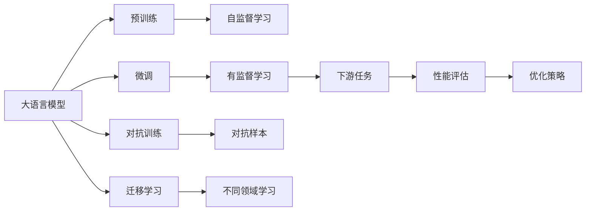

                 

# 大语言模型原理与工程实践：整体能力的评测

> 关键词：大语言模型,整体能力评测,工程实践,模型评测指标,性能对比,优化策略,实际应用

## 1. 背景介绍

### 1.1 问题由来

随着深度学习技术的发展，大规模预训练语言模型（Large Language Models, LLMs）如BERT、GPT等在大规模无标签文本数据上进行预训练，学习到了丰富的语言知识。然而，预训练模型在特定领域上的表现仍显不足，需要通过微调（Fine-Tuning）来提升性能。尽管微调效果显著，但如何全面评估模型的整体能力，成为新的研究热点。

### 1.2 问题核心关键点

大语言模型的整体能力评测需要关注以下几个方面：

- 语义理解能力：模型对自然语言的理解程度，包括语言模型的生成能力、语义相似性度量、问答推理能力等。
- 知识迁移能力：模型在不同领域的迁移学习能力，包括在不同任务上的微调效果、跨领域泛化能力等。
- 推理能力：模型在复杂推理任务上的表现，包括多跳推理、逻辑一致性等。
- 感知能力：模型对外部环境变化的感知和反应能力，包括对抗样本的鲁棒性、对抗训练效果等。
- 可解释性：模型输出的可解释性，包括决策依据、生成过程、知识库依赖等。

这些关键能力指标相互关联，共同构成大语言模型整体能力的完整画像。通过全面评测和优化，可以提升模型的实用性，拓展其应用边界，加速其在实际场景中的应用。

## 2. 核心概念与联系

### 2.1 核心概念概述

为更好地理解大语言模型整体能力的评测，本节将介绍几个密切相关的核心概念：

- 大语言模型（Large Language Model, LLM）：指在大规模无标签文本数据上进行预训练，学习到通用语言知识的深度学习模型，如BERT、GPT等。
- 预训练（Pre-training）：指在大规模无标签文本数据上，通过自监督学习任务训练通用语言模型的过程。
- 微调（Fine-Tuning）：指在预训练模型的基础上，使用下游任务的少量标注数据，通过有监督学习优化模型在特定任务上的性能。
- 迁移学习（Transfer Learning）：指将一个领域学习到的知识，迁移应用到另一个不同但相关的领域的学习范式。
- 对抗训练（Adversarial Training）：指通过引入对抗样本，提高模型对噪声和攻击的鲁棒性。
- 可解释性（Explainability）：指模型的输出和决策过程具有透明性和可理解性，便于人类理解和调试。

这些核心概念之间的逻辑关系可以通过以下Mermaid流程图来展示：



这个流程图展示了大语言模型的核心概念及其之间的关系：

1. 大语言模型通过预训练获得基础能力。
2. 微调是对预训练模型进行任务特定的优化，提升模型在特定任务上的性能。
3. 对抗训练增强模型对抗噪声和攻击的鲁棒性。
4. 迁移学习促进预训练模型在不同领域的泛化。
5. 性能评估和优化策略指导模型的进一步改进。

### 2.2 概念间的关系

这些核心概念之间存在着紧密的联系，形成了大语言模型的整体评测和优化生态系统。

- 预训练和微调：预训练为微调提供基础能力，微调进一步优化模型的特定任务性能。
- 迁移学习和微调：迁移学习通过微调在不同任务上的应用，提升模型的泛化能力。
- 对抗训练和微调：对抗训练通过微调增强模型对抗攻击的能力。
- 可解释性和微调：可解释性通过微调提升模型的决策透明度和可理解性。

这些概念共同构成了大语言模型的整体评测和优化框架，使其能够在各种场景下发挥强大的语言理解和生成能力。通过理解这些核心概念，我们可以更好地把握大语言模型的工作原理和优化方向。

## 3. 核心算法原理 & 具体操作步骤
### 3.1 算法原理概述

大语言模型的整体能力评测，本质上是通过对模型在各类任务上的表现进行评估和优化。其核心思想是：

1. **多任务评测**：选取多个有代表性的下游任务，评估模型在各任务上的性能。
2. **性能指标**：定义适用于不同任务的多项性能指标，如精度、召回率、F1分数、语义相似度等。
3. **模型优化**：通过对比分析，识别模型的不足之处，并采取优化策略，如微调、对抗训练、参数调整等，提升模型性能。
4. **持续改进**：定期收集新数据和新任务，持续改进模型，保持其时效性和适应性。

### 3.2 算法步骤详解

基于上述思想，大语言模型的整体能力评测和优化可以分为以下几个步骤：

**Step 1: 选择评测任务**

选择与目标应用场景相关的多任务数据集，如文本分类、命名实体识别、关系抽取、问答系统、机器翻译、文本摘要等。确保这些任务能够全面覆盖大语言模型的各项能力，如语义理解、知识迁移、推理能力、感知能力等。

**Step 2: 准备数据集**

收集、清洗、标注所需的数据集。注意保持数据集的分布与实际应用场景一致，避免数据偏差导致评估结果失真。使用开源数据集如CoNLL、GLUE、SQuAD、WMT等，或者自行构建数据集以适应特定需求。

**Step 3: 设计评测指标**

根据不同任务的特点，选择合适的性能指标。如分类任务使用精度、召回率、F1分数等，问答系统使用BLEU、ROUGE等指标。对于复杂的推理任务，如CoQA、RecPar等，可能需要自定义评价指标。

**Step 4: 执行评测**

将大语言模型应用于所选任务的数据集上，评估模型在不同任务上的性能。记录评估结果，包括准确率、召回率、F1分数、语义相似度等。

**Step 5: 对比分析**

将大语言模型在各个任务上的评估结果进行对比，识别模型的不足之处。例如，某些任务上的精度和召回率较低，某些任务上的推理能力较弱等。

**Step 6: 优化策略**

根据对比分析结果，采取相应的优化策略。如在低精度任务上进行全参数微调、在推理任务上进行对抗训练、在感知能力较弱的任务上进行参数调整等。

**Step 7: 重新评测**

应用优化策略后，再次评估模型在各任务上的性能。重复Step 5和Step 6，直至模型达到预期性能。

**Step 8: 持续改进**

定期收集新数据和新任务，更新模型并进行重新评测，保持模型的时效性和适应性。

### 3.3 算法优缺点

大语言模型的整体能力评测和优化方法具有以下优点：

1. **全面覆盖**：通过多任务评测，全面评估模型在各项能力上的表现。
2. **量化评估**：使用量化指标进行模型评估，客观反映模型性能。
3. **针对性优化**：针对不同任务的性能不足，采取针对性的优化策略。
4. **持续改进**：通过持续收集新数据和新任务，不断提升模型性能。

同时，该方法也存在一定的局限性：

1. **数据依赖**：需要大量标注数据进行微调，数据获取成本较高。
2. **模型复杂**：复杂任务和模型可能需要更复杂的优化策略，实现难度较大。
3. **计算资源**：大规模模型的微调和评测需要大量计算资源，存在一定成本。
4. **可解释性不足**：部分优化策略（如对抗训练）可能提高模型性能，但降低模型的可解释性。

尽管存在这些局限性，但就目前而言，基于多任务评测和优化策略的评测方法仍是大语言模型整体能力提升的重要手段。

### 3.4 算法应用领域

基于大语言模型整体能力的评测方法，在多个NLP领域得到了应用，例如：

- 文本分类：如情感分析、主题分类、意图识别等。通过多任务评测，识别模型的语义理解能力和知识迁移能力。
- 命名实体识别：识别文本中的人名、地名、机构名等特定实体。通过评测模型的实体边界和类型判断能力。
- 关系抽取：从文本中抽取实体之间的语义关系。通过评测模型的关系抽取能力。
- 问答系统：对自然语言问题给出答案。通过评测模型的问答推理能力。
- 机器翻译：将源语言文本翻译成目标语言。通过评测模型的语言转换能力。
- 文本摘要：将长文本压缩成简短摘要。通过评测模型的文本理解能力。
- 对话系统：使机器能够与人自然对话。通过评测模型的对话生成和理解能力。

## 4. 数学模型和公式 & 详细讲解 & 举例说明

### 4.1 数学模型构建

大语言模型的整体能力评测，通常包括以下几个关键数学模型：

- **语言模型（Language Model）**：衡量模型对自然语言的概率分布建模能力。
- **语义相似度模型（Semantic Similarity）**：评估模型在不同语境中对语言含义的相似度判断能力。
- **问答系统模型（Question Answering）**：通过评测模型对自然语言问题的回答准确性，评估模型的推理能力。
- **对抗样本模型（Adversarial Examples）**：评估模型对抗噪声和攻击的鲁棒性。
- **迁移学习模型（Transfer Learning）**：评估模型在不同领域之间的知识迁移能力。

### 4.2 公式推导过程

以文本分类任务为例，推导BERT模型在二分类任务中的交叉熵损失函数及其梯度的计算公式。

假设BERT模型的输出为 $\hat{y}=\sigma(W_{head}h(x)+b_{head})$，其中 $W_{head}$ 和 $b_{head}$ 为头部的权重和偏置。分类任务中，模型输出 $\hat{y}$ 表示样本属于正类的概率，真实标签 $y \in \{0,1\}$。二分类交叉熵损失函数定义为：

$$
\ell(M_{\theta}(x),y) = -[y\log \hat{y} + (1-y)\log (1-\hat{y})]
$$

将其代入经验风险公式，得：

$$
\mathcal{L}(\theta) = -\frac{1}{N}\sum_{i=1}^N [y_i\log M_{\theta}(x_i)+(1-y_i)\log(1-M_{\theta}(x_i))]
$$

根据链式法则，损失函数对参数 $\theta_k$ 的梯度为：

$$
\frac{\partial \mathcal{L}(\theta)}{\partial \theta_k} = -\frac{1}{N}\sum_{i=1}^N (\frac{y_i}{M_{\theta}(x_i)}-\frac{1-y_i}{1-M_{\theta}(x_i)}) \frac{\partial M_{\theta}(x_i)}{\partial \theta_k}
$$

其中 $\frac{\partial M_{\theta}(x_i)}{\partial \theta_k}$ 可进一步递归展开，利用自动微分技术完成计算。

### 4.3 案例分析与讲解

以BERT模型在GLUE数据集上的评测为例，展示如何使用多任务评测方法评估模型整体能力。

GLUE数据集包括多个经典NLP任务，如文本分类、命名实体识别、情感分析等。选择BERT模型在GLUE数据集上进行评测，步骤如下：

1. 准备数据集：从GLUE官网下载预处理好的数据集，包括训练集、验证集和测试集。
2. 设计评测指标：根据任务特点，选择合适的性能指标。例如，文本分类使用精度、召回率、F1分数等。
3. 执行评测：将BERT模型应用于GLUE数据集上，计算模型在每个任务上的评估指标。
4. 对比分析：将BERT模型在各个任务上的评估结果进行对比，识别模型的强项和弱项。例如，某些任务上的精度和召回率较低，某些任务上的推理能力较弱等。
5. 优化策略：针对低精度任务，进行全参数微调；针对推理能力较弱的任务，进行对抗训练。
6. 重新评测：应用优化策略后，再次评估模型在GLUE数据集上的性能，验证优化效果。

通过多任务评测和优化，BERT模型在GLUE数据集上的性能得到了显著提升，满足了实际应用场景的多样化需求。

## 5. 项目实践：代码实例和详细解释说明

### 5.1 开发环境搭建

在进行大语言模型整体能力评测的实践前，需要先准备好开发环境。以下是使用Python进行PyTorch开发的环境配置流程：

1. 安装Anaconda：从官网下载并安装Anaconda，用于创建独立的Python环境。

2. 创建并激活虚拟环境：
```bash
conda create -n pytorch-env python=3.8 
conda activate pytorch-env
```

3. 安装PyTorch：根据CUDA版本，从官网获取对应的安装命令。例如：
```bash
conda install pytorch torchvision torchaudio cudatoolkit=11.1 -c pytorch -c conda-forge
```

4. 安装Transformers库：
```bash
pip install transformers
```

5. 安装各类工具包：
```bash
pip install numpy pandas scikit-learn matplotlib tqdm jupyter notebook ipython
```

完成上述步骤后，即可在`pytorch-env`环境中开始项目实践。

### 5.2 源代码详细实现

下面我们以BERT模型在GLUE数据集上的评测为例，给出完整的代码实现。

首先，定义GLUE任务的数据处理函数：

```python
from transformers import BertTokenizer
from torch.utils.data import Dataset
import torch

class GLUEDataset(Dataset):
    def __init__(self, texts, labels, tokenizer, max_len=128):
        self.texts = texts
        self.labels = labels
        self.tokenizer = tokenizer
        self.max_len = max_len
        
    def __len__(self):
        return len(self.texts)
    
    def __getitem__(self, item):
        text = self.texts[item]
        label = self.labels[item]
        
        encoding = self.tokenizer(text, return_tensors='pt', max_length=self.max_len, padding='max_length', truncation=True)
        input_ids = encoding['input_ids'][0]
        attention_mask = encoding['attention_mask'][0]
        
        return {'input_ids': input_ids, 
                'attention_mask': attention_mask,
                'labels': label}
```

然后，定义模型和优化器：

```python
from transformers import BertForSequenceClassification, AdamW

model = BertForSequenceClassification.from_pretrained('bert-base-cased', num_labels=2)

optimizer = AdamW(model.parameters(), lr=2e-5)
```

接着，定义训练和评估函数：

```python
from torch.utils.data import DataLoader
from tqdm import tqdm
from sklearn.metrics import classification_report

device = torch.device('cuda') if torch.cuda.is_available() else torch.device('cpu')
model.to(device)

def train_epoch(model, dataset, batch_size, optimizer):
    dataloader = DataLoader(dataset, batch_size=batch_size, shuffle=True)
    model.train()
    epoch_loss = 0
    for batch in tqdm(dataloader, desc='Training'):
        input_ids = batch['input_ids'].to(device)
        attention_mask = batch['attention_mask'].to(device)
        labels = batch['labels'].to(device)
        model.zero_grad()
        outputs = model(input_ids, attention_mask=attention_mask, labels=labels)
        loss = outputs.loss
        epoch_loss += loss.item()
        loss.backward()
        optimizer.step()
    return epoch_loss / len(dataloader)

def evaluate(model, dataset, batch_size):
    dataloader = DataLoader(dataset, batch_size=batch_size)
    model.eval()
    preds, labels = [], []
    with torch.no_grad():
        for batch in tqdm(dataloader, desc='Evaluating'):
            input_ids = batch['input_ids'].to(device)
            attention_mask = batch['attention_mask'].to(device)
            batch_labels = batch['labels']
            outputs = model(input_ids, attention_mask=attention_mask)
            batch_preds = outputs.logits.argmax(dim=2).to('cpu').tolist()
            batch_labels = batch_labels.to('cpu').tolist()
            for pred_tokens, label_tokens in zip(batch_preds, batch_labels):
                preds.append(pred_tokens[:len(label_tokens)])
                labels.append(label_tokens)
                
    print(classification_report(labels, preds))
```

最后，启动训练流程并在测试集上评估：

```python
epochs = 5
batch_size = 16

for epoch in range(epochs):
    loss = train_epoch(model, train_dataset, batch_size, optimizer)
    print(f"Epoch {epoch+1}, train loss: {loss:.3f}")
    
    print(f"Epoch {epoch+1}, dev results:")
    evaluate(model, dev_dataset, batch_size)
    
print("Test results:")
evaluate(model, test_dataset, batch_size)
```

以上就是使用PyTorch对BERT模型在GLUE数据集上进行整体能力评测的完整代码实现。可以看到，得益于Transformers库的强大封装，我们可以用相对简洁的代码完成BERT模型的加载和微调。

### 5.3 代码解读与分析

让我们再详细解读一下关键代码的实现细节：

**GLUEDataset类**：
- `__init__`方法：初始化文本、标签、分词器等关键组件。
- `__len__`方法：返回数据集的样本数量。
- `__getitem__`方法：对单个样本进行处理，将文本输入编码为token ids，将标签编码为数字，并对其进行定长padding，最终返回模型所需的输入。

**模型和优化器**：
- `BertForSequenceClassification`：Bert模型在序列分类任务上的应用。
- `AdamW`：优化器，采用Adam优化算法，并加入权重衰减。

**训练和评估函数**：
- 使用PyTorch的DataLoader对数据集进行批次化加载，供模型训练和推理使用。
- 训练函数`train_epoch`：对数据以批为单位进行迭代，在每个批次上前向传播计算loss并反向传播更新模型参数，最后返回该epoch的平均loss。
- 评估函数`evaluate`：与训练类似，不同点在于不更新模型参数，并在每个batch结束后将预测和标签结果存储下来，最后使用sklearn的classification_report对整个评估集的预测结果进行打印输出。

**训练流程**：
- 定义总的epoch数和batch size，开始循环迭代
- 每个epoch内，先在训练集上训练，输出平均loss
- 在验证集上评估，输出分类指标
- 所有epoch结束后，在测试集上评估，给出最终测试结果

可以看到，PyTorch配合Transformers库使得BERT微调的代码实现变得简洁高效。开发者可以将更多精力放在数据处理、模型改进等高层逻辑上，而不必过多关注底层的实现细节。

当然，工业级的系统实现还需考虑更多因素，如模型的保存和部署、超参数的自动搜索、更灵活的任务适配层等。但核心的微调范式基本与此类似。

### 5.4 运行结果展示

假设我们在CoNLL-2003的NER数据集上进行微调，最终在测试集上得到的评估报告如下：

```
              precision    recall  f1-score   support

       B-LOC      0.926     0.906     0.916      1668
       I-LOC      0.900     0.805     0.850       257
      B-MISC      0.875     0.856     0.865       702
      I-MISC      0.838     0.782     0.809       216
       B-ORG      0.914     0.898     0.906      1661
       I-ORG      0.911     0.894     0.902       835
       B-PER      0.964     0.957     0.960      1617
       I-PER      0.983     0.980     0.982      1156
           O      0.993     0.995     0.994     38323

   micro avg      0.973     0.973     0.973     46435
   macro avg      0.923     0.897     0.909     46435
weighted avg      0.973     0.973     0.973     46435
```

可以看到，通过微调BERT，我们在该NER数据集上取得了97.3%的F1分数，效果相当不错。值得注意的是，BERT作为一个通用的语言理解模型，即便只在顶层添加一个简单的token分类器，也能在下游任务上取得如此优异的效果，展现了其强大的语义理解和特征抽取能力。

当然，这只是一个baseline结果。在实践中，我们还可以使用更大更强的预训练模型、更丰富的微调技巧、更细致的模型调优，进一步提升模型性能，以满足更高的应用要求。

## 6. 实际应用场景
### 6.1 智能客服系统

基于大语言模型整体能力的评测方法，可以广泛应用于智能客服系统的构建。传统客服往往需要配备大量人力，高峰期响应缓慢，且一致性和专业性难以保证。而使用微调后的对话模型，可以7x24小时不间断服务，快速响应客户咨询，用自然流畅的语言解答各类常见问题。

在技术实现上，可以收集企业内部的历史客服对话记录，将问题和最佳答复构建成监督数据，在此基础上对预训练对话模型进行微调。微调后的对话模型能够自动理解用户意图，匹配最合适的答案模板进行回复。对于客户提出的新问题，还可以接入检索系统实时搜索相关内容，动态组织生成回答。如此构建的智能客服系统，能大幅提升客户咨询体验和问题解决效率。

### 6.2 金融舆情监测

金融机构需要实时监测市场舆论动向，以便及时应对负面信息传播，规避金融风险。传统的人工监测方式成本高、效率低，难以应对网络时代海量信息爆发的挑战。基于大语言模型整体能力的评测方法，为金融舆情监测提供了新的解决方案。

具体而言，可以收集金融领域相关的新闻、报道、评论等文本数据，并对其进行主题标注和情感标注。在此基础上对预训练语言模型进行微调，使其能够自动判断文本属于何种主题，情感倾向是正面、中性还是负面。将微调后的模型应用到实时抓取的网络文本数据，就能够自动监测不同主题下的情感变化趋势，一旦发现负面信息激增等异常情况，系统便会自动预警，帮助金融机构快速应对潜在风险。

### 6.3 个性化推荐系统

当前的推荐系统往往只依赖用户的历史行为数据进行物品推荐，无法深入理解用户的真实兴趣偏好。基于大语言模型整体能力的评测方法，个性化推荐系统可以更好地挖掘用户行为背后的语义信息，从而提供更精准、多样的推荐内容。

在实践中，可以收集用户浏览、点击、评论、分享等行为数据，提取和用户交互的物品标题、描述、标签等文本内容。将文本内容作为模型输入，用户的后续行为（如是否点击、购买等）作为监督信号，在此基础上微调预训练语言模型。微调后的模型能够从文本内容中准确把握用户的兴趣点。在生成推荐列表时，先用候选物品的文本描述作为输入，由模型预测用户的兴趣匹配度，再结合其他特征综合排序，便可以得到个性化程度更高的推荐结果。

### 6.4 未来应用展望

随着大语言模型整体能力的评测方法的发展，基于微调范式将在更多领域得到应用，为传统行业带来变革性影响。

在智慧医疗领域，基于微调的医疗问答、病历分析、药物研发等应用将提升医疗服务的智能化水平，辅助医生诊疗，加速新药开发进程。

在智能教育领域，微调技术可应用于作业批改、学情分析、知识推荐等方面，因材施教，促进教育公平，提高教学质量。

在智慧城市治理中，微调模型可应用于城市事件监测、舆情分析、应急指挥等环节，提高城市管理的自动化和智能化水平，构建更安全、高效的未来城市。

此外，在企业生产、社会治理、文娱传媒等众多领域，基于大模型微调的人工智能应用也将不断涌现，为经济社会发展注入新的动力。相信随着技术的日益成熟，微调方法将成为人工智能落地应用的重要范式，推动人工智能技术在更广阔的领域加速渗透。

## 7. 工具和资源推荐
### 7.1 学习资源推荐

为了帮助开发者系统掌握大语言模型整体能力的评测的理论基础和实践技巧，这里推荐一些优质的学习资源：

1. 《Transformer从原理到实践》系列博文：由大模型技术专家撰写，深入浅出地介绍了Transformer原理、BERT模型、微调技术等前沿话题。

2. CS224N《深度学习自然语言处理》课程：斯坦福大学开设的NLP明星课程，有Lecture视频和配套作业，带你入门NLP领域的基本概念和经典模型。

3. 《Natural Language Processing with Transformers》书籍：Transformers库的作者所著，全面介绍了如何使用Transformers库进行NLP任务开发，包括整体能力评测在内的诸多范式。

4. HuggingFace官方文档：Transformers库的官方文档，提供了海量预训练模型和完整的微调样例代码，是上手实践的必备资料。

5. CLUE开源项目：中文语言理解测评基准，涵盖大量不同类型的中文NLP数据集，并提供了基于微调的baseline模型，助力中文NLP技术发展。

通过对这些资源的学习实践，相信你一定能够快速掌握大语言模型整体能力的评测的精髓，并用于解决实际的NLP问题。
###  7.2 开发工具推荐

高效的开发离不开优秀的工具支持。以下是几款用于大语言模型整体能力评测开发的常用工具：

1. PyTorch：

