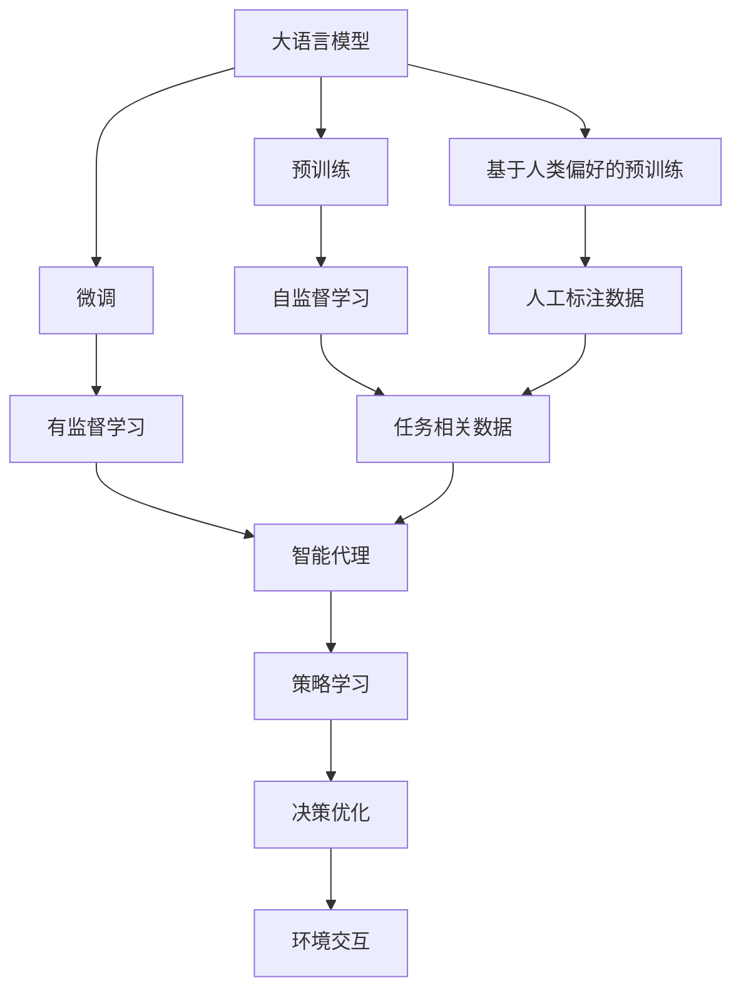
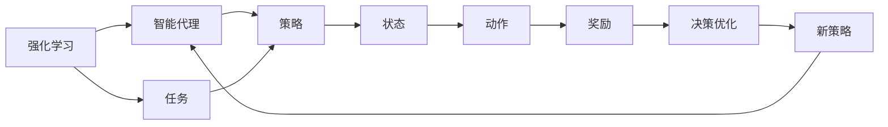
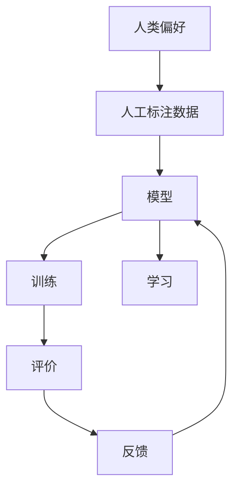

                 

# 大语言模型原理基础与前沿 基于强化学习的微调和基于人类偏好的预训练

> 关键词：大语言模型,强化学习,预训练,微调,人类偏好,智能代理,深度学习

## 1. 背景介绍

### 1.1 问题由来
随着深度学习技术的飞速发展，大语言模型（Large Language Model, LLMs）在自然语言处理（Natural Language Processing, NLP）领域取得了显著的突破。这些模型通过在大量无标签文本数据上进行预训练，学习到丰富的语言知识和常识，然后在下游任务上进行微调，以获得优异的性能。其中，BERT、GPT、T5等模型在多个任务上表现出色，推动了NLP技术的广泛应用。

然而，大语言模型在处理特定领域或任务时，可能无法达到理想的性能。这是因为预训练模型往往缺少针对特定任务的专门化知识，需要进一步微调以适应任务需求。同时，预训练模型的泛化能力有限，在数据分布变化较大的情况下，微调的效果可能受到影响。

### 1.2 问题核心关键点
基于强化学习（Reinforcement Learning, RL）的微调和基于人类偏好的预训练（Preference-based Pretraining）是解决这些问题的重要手段。强化学习微调通过设计合适的奖励函数和策略，使模型在任务上获得更高的回报，从而逐步学习任务特定的知识。基于人类偏好的预训练则通过引入人工标注数据，指导模型学习符合人类期望的语言行为。

这两种方法结合了大语言模型的通用性和特定任务的个性化需求，可以显著提升模型在特定任务上的表现，同时在模型训练过程中引入更多的智能性和灵活性。

### 1.3 问题研究意义
研究基于强化学习和人类偏好的大语言模型微调方法，对于拓展模型应用范围、提升下游任务性能、加速NLP技术产业化进程具有重要意义：

1. 降低应用开发成本。基于预训练模型进行微调，可以减少从头开发所需的数据、计算和人力成本投入。
2. 提升模型效果。微调可以使模型更好地适应特定任务，在应用场景中取得更优表现。
3. 加速开发进度。利用已有预训练模型进行微调，可以加快任务适配，缩短开发周期。
4. 带来技术创新。微调和预训练方法促进了对大语言模型的深入研究，催生了提示学习、少样本学习等新的研究方向。
5. 赋能产业升级。微调使得NLP技术更容易被各行各业采用，为传统行业数字化转型升级提供新的技术路径。

## 2. 核心概念与联系

### 2.1 核心概念概述

为更好地理解基于强化学习和人类偏好的大语言模型微调方法，本节将介绍几个关键概念及其相互关系：

- 大语言模型(Large Language Model, LLM)：以自回归（如GPT）或自编码（如BERT）模型为代表的大规模预训练语言模型。通过在大规模无标签文本数据上进行预训练，学习通用的语言表示，具备强大的语言理解和生成能力。

- 强化学习(Reinforcement Learning, RL)：一种通过试错学习和奖励机制指导智能体（agent）在环境中进行最优决策的学习方法。RL在机器人控制、游戏AI、NLP等多个领域有广泛应用。

- 微调(Fine-Tuning)：指在预训练模型的基础上，使用下游任务的少量标注数据，通过有监督地训练来优化模型在该任务上的性能。通常只需要调整顶层分类器或解码器，并以较小的学习率更新全部或部分模型参数。

- 人类偏好(Preference)：在语言模型训练过程中，通过引入人工标注数据，指导模型学习符合人类期望的语言行为。这包括语法正确性、流畅性、语义相关性等。

- 智能代理(Agent)：在强化学习框架中，智能代理是指在特定环境中，通过与环境的交互进行学习并做出决策的实体。

- 深度学习(Deep Learning)：一种基于神经网络的机器学习方法，通过多层非线性变换，从数据中学习复杂特征和模式。

这些概念之间的逻辑关系可以通过以下Mermaid流程图来展示：



这个流程图展示了核心概念之间的相互关系：

1. 大语言模型通过预训练获得基础能力。
2. 微调通过对预训练模型进行任务特定的优化，提升模型在特定任务上的性能。
3. 基于人类偏好的预训练通过引入人工标注数据，指导模型学习符合人类期望的语言行为。
4. 强化学习通过设计合适的奖励函数和策略，使模型在任务上获得更高的回报。
5. 智能代理在环境中通过与环境的交互进行学习，并做出决策。
6. 深度学习为模型提供强大的特征提取和表示学习能力。

这些概念共同构成了大语言模型的学习和应用框架，使其能够在各种场景下发挥强大的语言理解和生成能力。通过理解这些核心概念，我们可以更好地把握大语言模型的工作原理和优化方向。

### 2.2 概念间的关系

这些核心概念之间存在着紧密的联系，形成了大语言模型的学习和应用生态系统。下面我们通过几个Mermaid流程图来展示这些概念之间的关系。

#### 2.2.1 大语言模型的学习范式


这个流程图展示了大语言模型的三种主要学习范式：预训练、微调和基于人类偏好的预训练。预训练主要采用自监督学习方法，而微调则是有监督学习的过程。基于人类偏好的预训练则通过引入人工标注数据，指导模型学习符合人类期望的语言行为。

#### 2.2.2 强化学习与微调的关系



这个流程图展示了强化学习的基本原理，以及它与微调的关系。强化学习通过智能代理在环境中执行动作，根据奖励机制调整策略，逐步优化决策。这种学习过程与微调相似，都是通过有监督学习来优化模型性能。

#### 2.2.3 人类偏好在大语言模型中的应用



这个流程图展示了人类偏好在大语言模型中的应用。通过人工标注数据，指导模型学习符合人类期望的语言行为。这个过程是一个闭环反馈系统，通过不断迭代优化，逐步提升模型的表现。

### 2.3 核心概念的整体架构

最后，我们用一个综合的流程图来展示这些核心概念在大语言模型微调过程中的整体架构：


这个综合流程图展示了从预训练到微调，再到基于人类偏好的预训练的完整过程。大语言模型首先在大规模文本数据上进行预训练，然后通过微调或基于人类偏好的预训练，逐步学习特定任务或符合人类期望的语言行为。最后，通过持续学习和优化，模型能够不断适应新的任务和数据，实现智能代理的自我完善。

## 3. 核心算法原理 & 具体操作步骤
### 3.1 算法原理概述

基于强化学习和人类偏好的大语言模型微调方法，本质上是一种有监督的细粒度迁移学习过程。其核心思想是：将预训练的大语言模型视作一个强大的"智能代理"，通过与环境的交互，逐步学习特定任务的知识，并通过反馈机制调整决策策略，最终在任务上获得优异的性能。

形式化地，假设预训练模型为 $M_{\theta}$，其中 $\theta$ 为预训练得到的模型参数。给定下游任务 $T$ 的标注数据集 $D=\{(x_i,y_i)\}_{i=1}^N, x_i \in \mathcal{X}, y_i \in \mathcal{Y}$。在基于强化学习的微调中，我们引入一个奖励函数 $R$，用于衡量模型在任务上的表现。优化目标是最小化期望奖励，即找到最优策略 $\pi$：

$$
\pi^* = \mathop{\arg\min}_{\pi} \mathbb{E}_{(x,y) \sim D} R(M_{\theta}(x),y)
$$

在基于人类偏好的预训练中，我们通过引入人工标注数据 $D_H$，指导模型学习符合人类期望的语言行为。优化目标是最小化与人类偏好的差距，即找到最优参数 $\hat{\theta}$：

$$
\hat{\theta} = \mathop{\arg\min}_{\theta} \mathcal{L}(\theta, D_H)
$$

其中 $\mathcal{L}$ 为模型在人工标注数据 $D_H$ 上的损失函数，用于衡量模型输出与人类期望之间的差异。

通过梯度下降等优化算法，微调过程不断更新模型参数 $\theta$ 和策略 $\pi$，最小化期望奖励和与人类偏好的差距，使得模型输出逼近真实标签或符合人类期望。由于 $\theta$ 已经通过预训练获得了较好的初始化，因此即便在小规模数据集 $D$ 上进行微调，也能较快收敛到理想的模型参数 $\hat{\theta}$ 和策略 $\pi$。

### 3.2 算法步骤详解

基于强化学习和人类偏好的大语言模型微调一般包括以下几个关键步骤：

**Step 1: 准备预训练模型和数据集**
- 选择合适的预训练语言模型 $M_{\theta}$ 作为初始化参数，如 BERT、GPT 等。
- 准备下游任务 $T$ 的标注数据集 $D$ 和人工标注数据集 $D_H$，划分为训练集、验证集和测试集。一般要求标注数据与预训练数据的分布不要差异过大。

**Step 2: 设计奖励函数和策略**
- 根据任务类型，设计合适的奖励函数 $R$。对于分类任务，通常使用交叉熵损失作为奖励函数。对于生成任务，可以使用负对数似然作为奖励函数。
- 设计智能代理的决策策略 $\pi$，用于选择模型参数或输出。策略可以是基于规则的，也可以是通过训练得到的模型。

**Step 3: 设置微调超参数**
- 选择合适的优化算法及其参数，如 AdamW、SGD 等，设置学习率、批大小、迭代轮数等。
- 设置正则化技术及强度，包括权重衰减、Dropout、Early Stopping 等。
- 确定冻结预训练参数的策略，如仅微调顶层，或全部参数都参与微调。

**Step 4: 执行梯度训练**
- 将训练集数据分批次输入模型，前向传播计算奖励函数。
- 反向传播计算参数梯度，根据设定的优化算法和学习率更新模型参数和策略。
- 周期性在验证集上评估模型性能，根据性能指标决定是否触发 Early Stopping。
- 重复上述步骤直到满足预设的迭代轮数或 Early Stopping 条件。

**Step 5: 测试和部署**
- 在测试集上评估微调后模型 $M_{\hat{\theta}}$ 的性能，对比微调前后的精度提升。
- 使用微调后的模型对新样本进行推理预测，集成到实际的应用系统中。
- 持续收集新的数据，定期重新微调模型，以适应数据分布的变化。

以上是基于强化学习和人类偏好的大语言模型微调的一般流程。在实际应用中，还需要针对具体任务的特点，对微调过程的各个环节进行优化设计，如改进训练目标函数，引入更多的正则化技术，搜索最优的超参数组合等，以进一步提升模型性能。

### 3.3 算法优缺点

基于强化学习和人类偏好的大语言模型微调方法具有以下优点：

1. 简单高效。只需准备少量标注数据和人工标注数据，即可对预训练模型进行快速适配，获得较大的性能提升。
2. 通用适用。适用于各种NLP下游任务，包括分类、匹配、生成等，设计合适的奖励函数和策略即可实现微调。
3. 参数高效。利用参数高效微调技术，在固定大部分预训练参数的情况下，仍可取得不错的提升。
4. 效果显著。在学术界和工业界的诸多任务上，基于微调的方法已经刷新了最先进的性能指标。

同时，该方法也存在一定的局限性：

1. 依赖标注数据。微调的效果很大程度上取决于标注数据的质量和数量，获取高质量标注数据的成本较高。
2. 迁移能力有限。当目标任务与预训练数据的分布差异较大时，微调的性能提升有限。
3. 负面效果传递。预训练模型的固有偏见、有害信息等，可能通过微调传递到下游任务，造成负面影响。
4. 可解释性不足。微调模型的决策过程通常缺乏可解释性，难以对其推理逻辑进行分析和调试。

尽管存在这些局限性，但就目前而言，基于强化学习和人类偏好的微调方法仍是大语言模型应用的最主流范式。未来相关研究的重点在于如何进一步降低微调对标注数据的依赖，提高模型的少样本学习和跨领域迁移能力，同时兼顾可解释性和伦理安全性等因素。

### 3.4 算法应用领域

基于强化学习和人类偏好的大语言模型微调方法，已经在NLP领域得到了广泛的应用，覆盖了几乎所有常见任务，例如：

- 文本分类：如情感分析、主题分类、意图识别等。通过微调使模型学习文本-标签映射。
- 命名实体识别：识别文本中的人名、地名、机构名等特定实体。通过微调使模型掌握实体边界和类型。
- 关系抽取：从文本中抽取实体之间的语义关系。通过微调使模型学习实体-关系三元组。
- 问答系统：对自然语言问题给出答案。将问题-答案对作为微调数据，训练模型学习匹配答案。
- 机器翻译：将源语言文本翻译成目标语言。通过微调使模型学习语言-语言映射。
- 文本摘要：将长文本压缩成简短摘要。将文章-摘要对作为微调数据，使模型学习抓取要点。
- 对话系统：使机器能够与人自然对话。将多轮对话历史作为上下文，微调模型进行回复生成。

除了上述这些经典任务外，基于强化学习和人类偏好的大语言模型微调也被创新性地应用到更多场景中，如可控文本生成、常识推理、代码生成、数据增强等，为NLP技术带来了全新的突破。随着预训练模型和微调方法的不断进步，相信NLP技术将在更广阔的应用领域大放异彩。

## 4. 数学模型和公式 & 详细讲解  
### 4.1 数学模型构建

本节将使用数学语言对基于强化学习和人类偏好的大语言模型微调过程进行更加严格的刻画。

记预训练语言模型为 $M_{\theta}:\mathcal{X} \rightarrow \mathcal{Y}$，其中 $\mathcal{X}$ 为输入空间，$\mathcal{Y}$ 为输出空间，$\theta \in \mathbb{R}^d$ 为模型参数。假设微调任务的训练集为 $D=\{(x_i,y_i)\}_{i=1}^N, x_i \in \mathcal{X}, y_i \in \mathcal{Y}$。

定义模型 $M_{\theta}$ 在输入 $x$ 上的期望奖励为 $\mathbb{E}_R(M_{\theta}(x))$，则期望奖励函数定义为：

$$
R(M_{\theta}(x)) = \frac{1}{N} \sum_{i=1}^N R_i(M_{\theta}(x_i))
$$

其中 $R_i$ 为第 $i$ 个样本的奖励函数。

在基于人类偏好的预训练中，通过人工标注数据 $D_H=\{(x_i,y_i)\}_{i=1}^N, x_i \in \mathcal{X}, y_i \in \mathcal{Y}$，指导模型学习符合人类期望的语言行为。优化目标是最小化模型与人类偏好的差距，即找到最优参数 $\hat{\theta}$：

$$
\hat{\theta} = \mathop{\arg\min}_{\theta} \mathcal{L}(\theta, D_H)
$$

其中 $\mathcal{L}$ 为模型在人工标注数据 $D_H$ 上的损失函数，用于衡量模型输出与人类期望之间的差异。

### 4.2 公式推导过程

以下我们以二分类任务为例，推导期望奖励函数及其梯度的计算公式。

假设模型 $M_{\theta}$ 在输入 $x$ 上的输出为 $\hat{y}=M_{\theta}(x) \in [0,1]$，表示样本属于正类的概率。真实标签 $y \in \{0,1\}$。则二分类交叉熵损失函数定义为：

$$
\ell(M_{\theta}(x),y) = -[y\log \hat{y} + (1-y)\log (1-\hat{y})]
$$

将其代入期望奖励函数公式，得：

$$
R(M_{\theta}(x)) = \frac{1}{N} \sum_{i=1}^N [y_i\log \hat{y}_i+(1-y_i)\log(1-\hat{y}_i)]
$$

在期望奖励函数的基础上，定义期望奖励梯度：

$$
\nabla_{\theta} R(M_{\theta}(x)) = \frac{1}{N} \sum_{i=1}^N \nabla_{\theta} [y_i\log \hat{y}_i+(1-y_i)\log(1-\hat{y}_i)]
$$

根据链式法则，期望奖励梯度为：

$$
\nabla_{\theta} R(M_{\theta}(x)) = \frac{1}{N} \sum_{i=1}^N [\frac{y_i}{\hat{y}_i} - \frac{1-y_i}{1-\hat{y}_i}] \nabla_{\theta}\hat{y}_i
$$

其中 $\nabla_{\theta}\hat{y}_i$ 可进一步递归展开，利用自动微分技术完成计算。

在得到期望奖励梯度后，即可带入参数更新公式，完成模型的迭代优化。重复上述过程直至收敛，最终得到适应下游任务的最优模型参数 $\hat{\theta}$。

## 5. 项目实践：代码实例和详细解释说明
### 5.1 开发环境搭建

在进行微调实践前，我们需要准备好开发环境。以下是使用Python进行PyTorch开发的环境配置流程：

1. 安装Anaconda：从官网下载并安装Anaconda，用于创建独立的Python环境。

2. 创建并激活虚拟环境：
```bash
conda create -n pytorch-env python=3.8 
conda activate pytorch-env
```

3. 安装PyTorch：根据CUDA版本，从官网获取对应的安装命令。例如：
```bash
conda install pytorch torchvision torchaudio cudatoolkit=11.1 -c pytorch -c conda-forge
```

4. 安装Transformers库：
```bash
pip install transformers
```

5. 安装各类工具包：
```bash
pip install numpy pandas scikit-learn matplotlib tqdm jupyter notebook ipython
```

完成上述步骤后，即可在`pytorch-env`环境中开始微调实践。

### 5.2 源代码详细实现

下面我以BERT模型进行命名实体识别（NER）任务为例，给出使用Transformers库进行基于强化学习的微调的PyTorch代码实现。

首先，定义NER任务的数据处理函数：

```python
from transformers import BertTokenizer
from torch.utils.data import Dataset
import torch

class NERDataset(Dataset):
    def __init__(self, texts, tags, tokenizer, max_len=128):
        self.texts = texts
        self.tags = tags
        self.tokenizer = tokenizer
        self.max_len = max_len
        
    def __len__(self):
        return len(self.texts)
    
    def __getitem__(self, item):
        text = self.texts[item]
        tags = self.tags[item]
        
        encoding = self.tokenizer(text, return_tensors='pt', max_length=self.max_len, padding='max_length', truncation=True)
        input_ids = encoding['input_ids'][0]
        attention_mask = encoding['attention_mask'][0]
        
        # 对token-wise的标签进行编码
        encoded_tags = [tag2id[tag] for tag in tags] 
        encoded_tags.extend([tag2id['O']] * (self.max_len - len(encoded_tags)))
        labels = torch.tensor(encoded_tags, dtype=torch.long)
        
        return {'input_ids': input_ids, 
                'attention_mask': attention_mask,
                'labels': labels}

# 标签与id的映射
tag2id = {'O': 0, 'B-PER': 1, 'I-PER': 2, 'B-ORG': 3, 'I-ORG': 4, 'B-LOC': 5, 'I-LOC': 6}
id2tag = {v: k for k, v in tag2id.items()}

# 创建dataset
tokenizer = BertTokenizer.from_pretrained('bert-base-cased')

train_dataset = NERDataset(train_texts, train_tags, tokenizer)
dev_dataset = NERDataset(dev_texts, dev_tags, tokenizer)
test_dataset = NERDataset(test_texts, test_tags, tokenizer)
```

然后，定义模型和优化器：

```python
from transformers import BertForTokenClassification, AdamW

model = BertForTokenClassification.from_pretrained('bert-base-cased', num_labels=len(tag2id))

optimizer = AdamW(model.parameters(), lr=2e-5)
```

接着，定义训练和评估函数：

```python
from torch.utils.data import DataLoader
from tqdm import tqdm
from sklearn.metrics import classification_report

device = torch.device('cuda') if torch.cuda.is_available() else torch.device('cpu')
model.to(device)

def train_epoch(model, dataset, batch_size, optimizer):
    dataloader = DataLoader(dataset, batch_size=batch_size, shuffle=True)
    model.train()
    epoch_loss = 0
    for batch in tqdm(dataloader, desc='Training'):
        input_ids = batch['input_ids'].to(device)
        attention_mask = batch['attention_mask'].to(device)
        labels = batch['labels'].to(device)
        model.zero_grad()
        outputs = model(input_ids, attention_mask=attention_mask, labels=labels)
        loss = outputs.loss
        epoch_loss += loss.item()
        loss.backward()
        optimizer.step()
    return epoch_loss / len(dataloader)

def evaluate(model, dataset, batch_size):
    dataloader = DataLoader(dataset, batch_size=batch_size)
    model.eval()
    preds, labels = [], []
    with torch.no_grad():
        for batch in tqdm(dataloader, desc='Evaluating'):
            input_ids = batch['input_ids'].to(device)
            attention_mask = batch['attention_mask'].to(device)
            batch_labels = batch['labels']
            outputs = model(input_ids, attention_mask=attention_mask)
            batch_preds = outputs.logits.argmax(dim=2).to('cpu').tolist()
            batch_labels = batch_labels.to('cpu').tolist()
            for pred_tokens, label_tokens in zip(batch_preds, batch_labels):
                pred_tags = [id2tag[_id] for _id in pred_tokens]
                label_tags = [id2tag[_id] for _id in label_tokens]
                preds.append(pred_tags[:len(label_tokens)])
                labels.append(label_tags)
                
    print(classification_report(labels, preds))
```

最后，启动训练流程并在测试集上评估：

```python
epochs = 5
batch_size = 16

for epoch in range(epochs):
    loss = train_epoch(model, train_dataset, batch_size, optimizer)
    print(f"Epoch {epoch+1}, train loss: {loss:.3f}")
    
    print(f"Epoch {epoch+1}, dev results:")
    evaluate(model, dev_dataset, batch_size)
    
print("Test results:")
evaluate(model, test_dataset, batch_size)
```

以上就是使用PyTorch对BERT进行命名实体识别任务微调的完整代码实现。可以看到，得益于Transformers库的强大封装，我们可以用相对简洁的代码完成BERT模型的加载和微调。

### 5.3 代码解读与分析

让我们再详细解读

