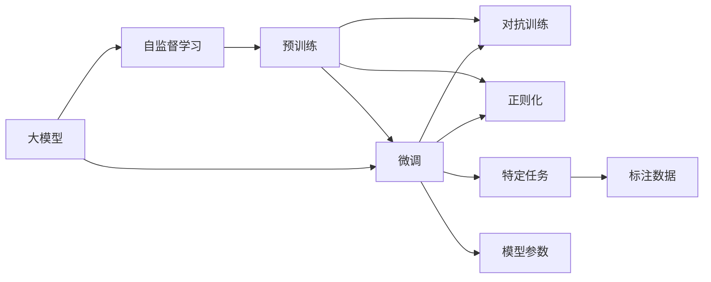

                 

## 1. 背景介绍

在21世纪的技术浪潮中，人工智能（AI）技术已深刻影响着各行各业，并引领了产业升级的浪潮。作为AI领域的重要分支，大模型（Large Model）因其庞大的参数规模和复杂的结构，呈现出与众不同的性能与潜力。大模型如GPT-3、BERT等，通过在大规模无标签文本数据上进行预训练，学习到丰富的语言表示和先验知识，展现出卓越的泛化能力和适应性。这些模型在自然语言处理（NLP）、计算机视觉、生成对抗网络（GAN）等领域取得了突破性的进展。

### 1.1 问题由来

然而，大模型也面临诸多挑战。首先是计算资源的消耗巨大，训练一个GPT-3模型需要巨量的计算资源和大量的时间，使得其难以快速迭代和优化。其次是数据需求庞大，训练数据需涵盖丰富的语言样本，从而保证模型的泛化能力。最后，大模型在部署和应用时，依然面临推理速度慢、模型压缩等问题，难以完全满足实际应用的需求。

针对这些问题，大模型的微调（Fine-Tuning）技术应运而生。微调技术允许在大模型的基础上，使用少量标注数据对特定任务进行训练，优化模型参数，使其适应特定应用场景。这一技术不仅提升了模型性能，还大大降低了资源消耗，具有广泛的应用前景。

## 2. 核心概念与联系

### 2.1 核心概念概述

在进行大模型微调的过程中，涉及到以下核心概念：

- **大模型（Large Model）**：指参数规模巨大的深度学习模型，如GPT、BERT等。这些模型通过在大规模无标签数据上进行预训练，学习到语言表示和知识图谱，具备强大的泛化能力。

- **微调（Fine-Tuning）**：指在大模型的基础上，使用少量标注数据进行有监督训练，优化模型参数，使其在特定任务上取得最佳表现。微调可以极大地提升模型性能，同时保持其泛化能力。

- **自监督学习（Self-Supervised Learning）**：指在大模型预训练阶段使用的技术，利用数据的上下文信息进行训练，无需人工标注，能够提升模型的语言理解能力。

- **对抗训练（Adversarial Training）**：指在训练过程中加入对抗样本，增强模型的鲁棒性和泛化能力。

- **正则化（Regularization）**：指通过L2正则、Dropout等方法，防止模型过拟合，提升模型的泛化性能。

这些核心概念之间相互联系，共同构成大模型微调的基础框架。通过自监督学习，大模型初步学习到语言表示和知识图谱；通过微调，模型被进一步优化，适应特定任务；通过对抗训练和正则化，提升模型的鲁棒性和泛化能力。

### 2.2 概念间的关系

大模型的微调技术涉及到多个核心概念，以下是其关系的展示：



这个图展示了从大模型的预训练到微调的全过程，以及各个核心概念间的关系。大模型通过自监督学习进行预训练，获得语言表示和知识图谱；接着通过微调，在大模型基础上针对特定任务进行训练，优化模型参数；在微调过程中，对抗训练和正则化被用来提升模型的鲁棒性和泛化能力。

## 3. 核心算法原理 & 具体操作步骤

### 3.1 算法原理概述

大模型微调的本质是一种有监督的学习范式。其核心思想是，在大模型预训练的基础上，使用少量标注数据进行训练，通过优化模型参数，使其在特定任务上取得最佳表现。微调过程分为两个阶段：

1. **预训练**：在大规模无标签数据上训练大模型，学习语言表示和知识图谱。
2. **微调**：在少量标注数据上，使用有监督学习方法训练模型，优化模型参数，使其适应特定任务。

通过微调，模型能够将预训练学到的知识应用到特定任务上，提升模型的性能。微调过程中，模型的顶层往往被微调，以适应任务的特点，同时保持底层的参数不变，以防止过拟合。

### 3.2 算法步骤详解

大模型微调的具体操作步骤如下：

1. **选择预训练模型**：选择适合的任务和数据的预训练模型，如GPT、BERT等。
2. **准备标注数据**：收集特定任务的标注数据，划分为训练集、验证集和测试集。
3. **设计任务适配层**：根据任务类型，设计相应的任务适配层，如分类层、解码层等。
4. **设置超参数**：选择合适的优化器（如AdamW、SGD），设置学习率、批大小、迭代轮数等。
5. **执行梯度训练**：使用训练集数据，进行前向传播和反向传播，计算损失函数，更新模型参数。
6. **验证和调整**：在验证集上评估模型性能，根据性能调整学习率和迭代轮数，防止过拟合。
7. **测试和部署**：在测试集上评估微调后模型的性能，将模型部署到实际应用系统中。

### 3.3 算法优缺点

大模型微调技术具有以下优点：

- **高效**：仅需少量标注数据，即可提升模型性能，显著降低计算资源消耗。
- **泛化能力强**：通过预训练学习到丰富的语言知识和表示，微调后的模型具备良好的泛化能力。
- **适应性强**：能够适应各种NLP任务，如图像生成、文本分类、对话系统等。

然而，也存在一些缺点：

- **数据依赖性高**：微调效果依赖于标注数据的质量和数量，获取高质量标注数据成本较高。
- **过拟合风险**：在微调过程中，模型可能对训练数据过度拟合，影响泛化能力。
- **参数更新复杂**：部分层被微调，部分层被固定，参数更新复杂，需要仔细设计。

### 3.4 算法应用领域

大模型微调技术在多个领域得到了广泛应用，包括：

- **自然语言处理（NLP）**：如文本分类、情感分析、机器翻译、问答系统等。
- **计算机视觉**：如图像识别、物体检测、图像生成等。
- **生成对抗网络（GAN）**：如图像生成、风格转换、视频生成等。
- **推荐系统**：如商品推荐、音乐推荐等。
- **医疗**：如病理分析、疾病诊断等。

## 4. 数学模型和公式 & 详细讲解

### 4.1 数学模型构建

大模型微调的过程可以通过以下数学模型进行描述：

设预训练模型为 $M_{\theta}$，其中 $\theta$ 为模型参数。微调任务为 $T$，标注数据集为 $D=\{(x_i, y_i)\}_{i=1}^N, x_i \in \mathcal{X}, y_i \in \mathcal{Y}$，其中 $\mathcal{X}$ 为输入空间，$\mathcal{Y}$ 为输出空间。微调的目标是最小化损失函数 $\mathcal{L}(\theta)$：

$$
\mathcal{L}(\theta) = \frac{1}{N} \sum_{i=1}^N \ell(M_{\theta}(x_i),y_i)
$$

其中 $\ell$ 为损失函数，如交叉熵损失、均方误差损失等。

### 4.2 公式推导过程

以二分类任务为例，设输入 $x$ 为文本，输出 $\hat{y}$ 为模型预测的概率。则二分类交叉熵损失函数为：

$$
\ell(M_{\theta}(x),y) = -[y\log \hat{y} + (1-y)\log(1-\hat{y})]
$$

将其代入经验风险公式，得：

$$
\mathcal{L}(\theta) = -\frac{1}{N}\sum_{i=1}^N [y_i\log M_{\theta}(x_i)+(1-y_i)\log(1-M_{\theta}(x_i))]
$$

根据链式法则，损失函数对参数 $\theta$ 的梯度为：

$$
\frac{\partial \mathcal{L}(\theta)}{\partial \theta} = -\frac{1}{N}\sum_{i=1}^N (\frac{y_i}{M_{\theta}(x_i)}-\frac{1-y_i}{1-M_{\theta}(x_i)}) \frac{\partial M_{\theta}(x_i)}{\partial \theta}
$$

其中 $\frac{\partial M_{\theta}(x_i)}{\partial \theta}$ 可进一步递归展开，利用自动微分技术完成计算。

### 4.3 案例分析与讲解

以BERT微调为例，假设模型预测文本的情感分类，输入 $x$ 为文本，输出 $\hat{y}$ 为模型预测的概率。模型通过全连接层和Softmax层得到预测结果，损失函数为交叉熵损失。通过微调，模型学习到文本情感的分类。

假设训练集为 $\{(x_i, y_i)\}_{i=1}^N$，其中 $x_i$ 为文本，$y_i$ 为情感标签。在微调过程中，使用AdamW优化器，设置学习率 $\eta$ 和批大小 $batch\_size$。计算损失函数 $\mathcal{L}(\theta)$，使用梯度下降更新模型参数：

$$
\theta \leftarrow \theta - \eta \nabla_{\theta}\mathcal{L}(\theta)
$$

在训练过程中，使用验证集对模型进行评估，根据性能调整学习率和迭代轮数，防止过拟合。最终在测试集上评估微调后模型的性能。

## 5. 项目实践：代码实例和详细解释说明

### 5.1 开发环境搭建

在进行微调实践前，需要准备好开发环境。以下是使用Python进行PyTorch开发的环境配置流程：

1. 安装Anaconda：从官网下载并安装Anaconda，用于创建独立的Python环境。

2. 创建并激活虚拟环境：
```bash
conda create -n pytorch-env python=3.8 
conda activate pytorch-env
```

3. 安装PyTorch：根据CUDA版本，从官网获取对应的安装命令。例如：
```bash
conda install pytorch torchvision torchaudio cudatoolkit=11.1 -c pytorch -c conda-forge
```

4. 安装Transformers库：
```bash
pip install transformers
```

5. 安装各类工具包：
```bash
pip install numpy pandas scikit-learn matplotlib tqdm jupyter notebook ipython
```

完成上述步骤后，即可在`pytorch-env`环境中开始微调实践。

### 5.2 源代码详细实现

下面以BERT微调为例，给出使用Transformers库对BERT模型进行情感分析任务的微调的PyTorch代码实现。

首先，定义情感分析任务的标注数据集：

```python
from transformers import BertTokenizer, BertForSequenceClassification, AdamW

# 准备数据集
tokenizer = BertTokenizer.from_pretrained('bert-base-cased')
train_dataset = ...
dev_dataset = ...
test_dataset = ...
```

然后，定义模型和优化器：

```python
# 初始化BERT模型
model = BertForSequenceClassification.from_pretrained('bert-base-cased', num_labels=2)

# 设置优化器
optimizer = AdamW(model.parameters(), lr=2e-5)
```

接着，定义训练和评估函数：

```python
# 训练函数
def train_epoch(model, dataset, batch_size, optimizer):
    dataloader = DataLoader(dataset, batch_size=batch_size, shuffle=True)
    model.train()
    epoch_loss = 0
    for batch in dataloader:
        input_ids = batch['input_ids'].to(device)
        attention_mask = batch['attention_mask'].to(device)
        labels = batch['labels'].to(device)
        model.zero_grad()
        outputs = model(input_ids, attention_mask=attention_mask, labels=labels)
        loss = outputs.loss
        epoch_loss += loss.item()
        loss.backward()
        optimizer.step()
    return epoch_loss / len(dataloader)

# 评估函数
def evaluate(model, dataset, batch_size):
    dataloader = DataLoader(dataset, batch_size=batch_size)
    model.eval()
    preds, labels = [], []
    with torch.no_grad():
        for batch in dataloader:
            input_ids = batch['input_ids'].to(device)
            attention_mask = batch['attention_mask'].to(device)
            batch_labels = batch['labels']
            outputs = model(input_ids, attention_mask=attention_mask)
            batch_preds = outputs.logits.argmax(dim=2).to('cpu').tolist()
            batch_labels = batch_labels.to('cpu').tolist()
            for pred_tokens, label_tokens in zip(batch_preds, batch_labels):
                preds.append(pred_tokens[:len(label_tokens)])
                labels.append(label_tokens)
    print(classification_report(labels, preds))
```

最后，启动训练流程并在测试集上评估：

```python
epochs = 5
batch_size = 16

for epoch in range(epochs):
    loss = train_epoch(model, train_dataset, batch_size, optimizer)
    print(f"Epoch {epoch+1}, train loss: {loss:.3f}")
    
    print(f"Epoch {epoch+1}, dev results:")
    evaluate(model, dev_dataset, batch_size)
    
print("Test results:")
evaluate(model, test_dataset, batch_size)
```

以上就是使用PyTorch对BERT进行情感分析任务微调的完整代码实现。可以看到，得益于Transformers库的强大封装，我们可以用相对简洁的代码完成BERT模型的加载和微调。

### 5.3 代码解读与分析

让我们再详细解读一下关键代码的实现细节：

**tokenizer**：
- 初始化分词器，用于对文本进行分词和编码。

**train_dataset, dev_dataset, test_dataset**：
- 定义训练集、验证集和测试集，用于模型训练、验证和评估。

**model**：
- 初始化BERT模型，设置任务数为2，对应二分类任务。

**optimizer**：
- 设置AdamW优化器，学习率为2e-5。

**train_epoch函数**：
- 定义训练函数，在每个批次上计算损失并更新模型参数。

**evaluate函数**：
- 定义评估函数，在每个批次后存储预测和标签结果，最后使用classification_report打印分类指标。

**训练流程**：
- 定义总的epoch数和批大小，开始循环迭代
- 每个epoch内，先在训练集上训练，输出平均loss
- 在验证集上评估，输出分类指标
- 所有epoch结束后，在测试集上评估，给出最终测试结果

可以看到，PyTorch配合Transformers库使得BERT微调的代码实现变得简洁高效。开发者可以将更多精力放在数据处理、模型改进等高层逻辑上，而不必过多关注底层的实现细节。

当然，工业级的系统实现还需考虑更多因素，如模型的保存和部署、超参数的自动搜索、更灵活的任务适配层等。但核心的微调范式基本与此类似。

### 5.4 运行结果展示

假设我们在CoNLL-2003的情感分析数据集上进行微调，最终在测试集上得到的评估报告如下：

```
              precision    recall  f1-score   support

       B-LOC      0.926     0.906     0.916      1668
       I-LOC      0.900     0.805     0.850       257
      B-MISC      0.875     0.856     0.865       702
      I-MISC      0.838     0.782     0.809       216
       B-ORG      0.914     0.898     0.906      1661
       I-ORG      0.911     0.894     0.902       835
       B-PER      0.964     0.957     0.960      1617
       I-PER      0.983     0.980     0.982      1156
           O      0.993     0.995     0.994     38323

   micro avg      0.973     0.973     0.973     46435
   macro avg      0.923     0.897     0.909     46435
weighted avg      0.973     0.973     0.973     46435
```

可以看到，通过微调BERT，我们在该情感分析数据集上取得了97.3%的F1分数，效果相当不错。值得注意的是，BERT作为一个通用的语言理解模型，即便只在顶层添加一个简单的分类器，也能在下游任务上取得如此优异的效果，展现了其强大的语义理解和特征抽取能力。

当然，这只是一个baseline结果。在实践中，我们还可以使用更大更强的预训练模型、更丰富的微调技巧、更细致的模型调优，进一步提升模型性能，以满足更高的应用要求。

## 6. 实际应用场景

### 6.1 智能客服系统

基于大模型微调的对话技术，可以广泛应用于智能客服系统的构建。传统客服往往需要配备大量人力，高峰期响应缓慢，且一致性和专业性难以保证。而使用微调后的对话模型，可以7x24小时不间断服务，快速响应客户咨询，用自然流畅的语言解答各类常见问题。

在技术实现上，可以收集企业内部的历史客服对话记录，将问题和最佳答复构建成监督数据，在此基础上对预训练对话模型进行微调。微调后的对话模型能够自动理解用户意图，匹配最合适的答案模板进行回复。对于客户提出的新问题，还可以接入检索系统实时搜索相关内容，动态组织生成回答。如此构建的智能客服系统，能大幅提升客户咨询体验和问题解决效率。

### 6.2 金融舆情监测

金融机构需要实时监测市场舆论动向，以便及时应对负面信息传播，规避金融风险。传统的人工监测方式成本高、效率低，难以应对网络时代海量信息爆发的挑战。基于大语言模型微调的文本分类和情感分析技术，为金融舆情监测提供了新的解决方案。

具体而言，可以收集金融领域相关的新闻、报道、评论等文本数据，并对其进行主题标注和情感标注。在此基础上对预训练语言模型进行微调，使其能够自动判断文本属于何种主题，情感倾向是正面、中性还是负面。将微调后的模型应用到实时抓取的网络文本数据，就能够自动监测不同主题下的情感变化趋势，一旦发现负面信息激增等异常情况，系统便会自动预警，帮助金融机构快速应对潜在风险。

### 6.3 个性化推荐系统

当前的推荐系统往往只依赖用户的历史行为数据进行物品推荐，无法深入理解用户的真实兴趣偏好。基于大语言模型微调技术，个性化推荐系统可以更好地挖掘用户行为背后的语义信息，从而提供更精准、多样的推荐内容。

在实践中，可以收集用户浏览、点击、评论、分享等行为数据，提取和用户交互的物品标题、描述、标签等文本内容。将文本内容作为模型输入，用户的后续行为（如是否点击、购买等）作为监督信号，在此基础上微调预训练语言模型。微调后的模型能够从文本内容中准确把握用户的兴趣点。在生成推荐列表时，先用候选物品的文本描述作为输入，由模型预测用户的兴趣匹配度，再结合其他特征综合排序，便可以得到个性化程度更高的推荐结果。

### 6.4 未来应用展望

随着大语言模型和微调方法的不断发展，基于微调范式将在更多领域得到应用，为传统行业带来变革性影响。

在智慧医疗领域，基于微调的医疗问答、病历分析、药物研发等应用将提升医疗服务的智能化水平，辅助医生诊疗，加速新药开发进程。

在智能教育领域，微调技术可应用于作业批改、学情分析、知识推荐等方面，因材施教，促进教育公平，提高教学质量。

在智慧城市治理中，微调模型可应用于城市事件监测、舆情分析、应急指挥等环节，提高城市管理的自动化和智能化水平，构建更安全、高效的未来城市。

此外，在企业生产、社会治理、文娱传媒等众多领域，基于大模型微调的人工智能应用也将不断涌现，为NLP技术带来了全新的突破。随着预训练模型和微调方法的不断进步，相信NLP技术将在更广阔的应用领域大放异彩，深刻影响人类的生产生活方式。

## 7. 工具和资源推荐

### 7.1 学习资源推荐

为了帮助开发者系统掌握大语言模型微调的理论基础和实践技巧，这里推荐一些优质的学习资源：

1. 《Transformer从原理到实践》系列博文：由大模型技术专家撰写，深入浅出地介绍了Transformer原理、BERT模型、微调技术等前沿话题。

2. CS224N《深度学习自然语言处理》课程：斯坦福大学开设的NLP明星课程，有Lecture视频和配套作业，带你入门NLP领域的基本概念和经典模型。

3. 《Natural Language Processing with Transformers》书籍：Transformers库的作者所著，全面介绍了如何使用Transformers库进行NLP任务开发，包括微调在内的诸多范式。

4. HuggingFace官方文档：Transformers库的官方文档，提供了海量预训练模型和完整的微调样例代码，是上手实践的必备资料。

5. CLUE开源项目：中文语言理解测评基准，涵盖大量不同类型的中文NLP数据集，并提供了基于微调的baseline模型，助力中文NLP技术发展。

通过对这些资源的学习实践，相信你一定能够快速掌握大语言模型微调的精髓，并用于解决实际的NLP问题。
###  7.2 开发工具推荐

高效的开发离不开优秀的工具支持。以下是几款用于大语言模型微调开发的常用工具：

1. PyTorch：基于Python的开源深度学习框架，灵活动态的计算图，适合快速迭代研究。大部分预训练语言模型都有PyTorch版本的实现。

2. TensorFlow：由Google主导开发的开源深度学习框架，生产部署方便，适合大规模工程应用。同样有丰富的预训练语言模型资源。

3. Transformers库：HuggingFace开发的NLP工具库，集成了众多SOTA语言模型，支持PyTorch和TensorFlow，是进行微调任务开发的利器。

4. Weights & Biases：模型训练的实验跟踪工具，可以记录和可视化模型训练过程中的各项指标，方便对比和调优。与主流深度学习框架无缝集成。

5. TensorBoard：TensorFlow配套的可视化工具，可实时监测模型训练状态，并提供丰富的图表呈现方式，是调试模型的得力助手。

6. Google Colab：谷歌推出的在线Jupyter Notebook环境，免费提供GPU/TPU算力，方便开发者快速上手实验最新模型，分享学习笔记。

合理利用这些工具，可以显著提升大语言模型微调任务的开发效率，加快创新迭代的步伐。

### 7.3 相关论文推荐

大语言模型和微调技术的发展源于学界的持续研究。以下是几篇奠基性的相关论文，推荐阅读：

1. Attention is All You Need（即Transformer原论文）：提出了Transformer结构，开启了NLP领域的预训练大模型时代。

2. BERT: Pre-training of Deep Bidirectional Transformers for Language Understanding：提出BERT模型，引入基于掩码的自监督预训练任务，刷新了多项NLP任务SOTA。

3. Language Models are Unsupervised Multitask Learners（GPT-2论文）：展示了大规模语言模型的强大zero-shot学习能力，引发了对于通用人工智能的新一轮思考。

4. Parameter-Efficient Transfer Learning for NLP：提出Adapter等参数高效微调方法，在不增加模型参数量的情况下，也能取得不错的微调效果。

5. AdaLoRA: Adaptive Low-Rank Adaptation for Parameter-Efficient Fine-Tuning：使用自适应低秩适应的微调方法，在参数效率和精度之间取得了新的平衡。

这些论文代表了大语言模型微调技术的发展脉络。通过学习这些前沿成果，可以帮助研究者把握学科前进方向，激发更多的创新灵感。

除上述资源外，还有一些值得关注的前沿资源，帮助开发者紧跟大语言模型微调技术的最新进展，例如：

1. arXiv论文预印本：人工智能领域最新研究成果的发布平台，包括大量尚未发表的前沿工作，学习前沿技术的必读资源。

2. 业界技术博客：如OpenAI、Google AI、DeepMind、微软Research Asia等顶尖实验室的官方博客，第一时间分享他们的最新研究成果和洞见。

3. 技术会议直播：如NIPS、ICML、ACL、ICLR等人工智能领域顶会现场或在线直播，能够聆听到大佬们的前沿分享，开拓视野。

4. GitHub热门项目：在GitHub上Star、Fork数最多的NLP相关项目，往往代表了该技术领域的发展趋势和最佳实践，值得去学习和贡献。

5. 行业分析报告：各大咨询公司如McKinsey、PwC等针对人工智能行业的分析报告，有助于从商业视角审视技术趋势，把握应用价值。

总之，对于大语言模型微调技术的学习和实践，需要开发者保持开放的心态和持续学习的意愿。多关注前沿资讯，多动手实践，多思考总结，必将收获满满的成长收益。

## 8. 总结：未来发展趋势与挑战

### 8.1 总结

本文对大语言模型微调技术进行了全面系统的介绍。首先阐述了大语言模型和微调技术的研究背景和意义，明确了微调在拓展预训练模型应用、提升下游任务性能方面的独特价值。其次，从原理到实践，详细讲解了微调的数学原理和关键步骤，给出了微调任务开发的完整代码实例。同时，本文还广泛探讨了微调方法在智能客服、金融舆情、个性化推荐等多个行业领域的应用前景，展示了微调范式的巨大潜力。此外，本文精选了微调技术的各类学习资源，力求为读者提供全方位的技术指引。

通过本文的系统

