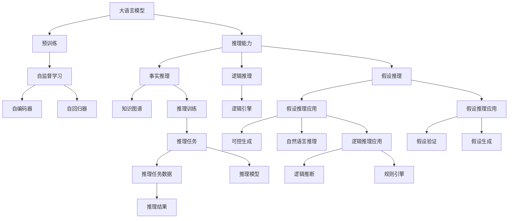
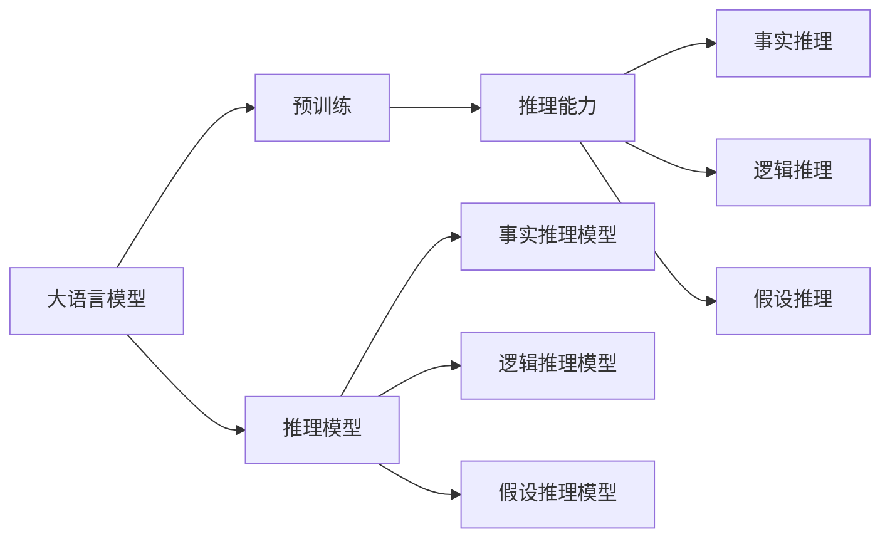
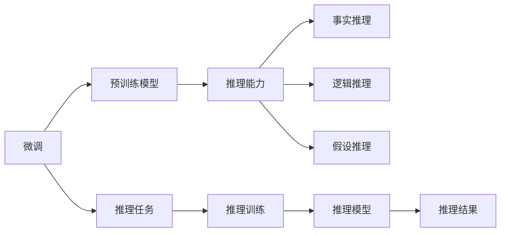
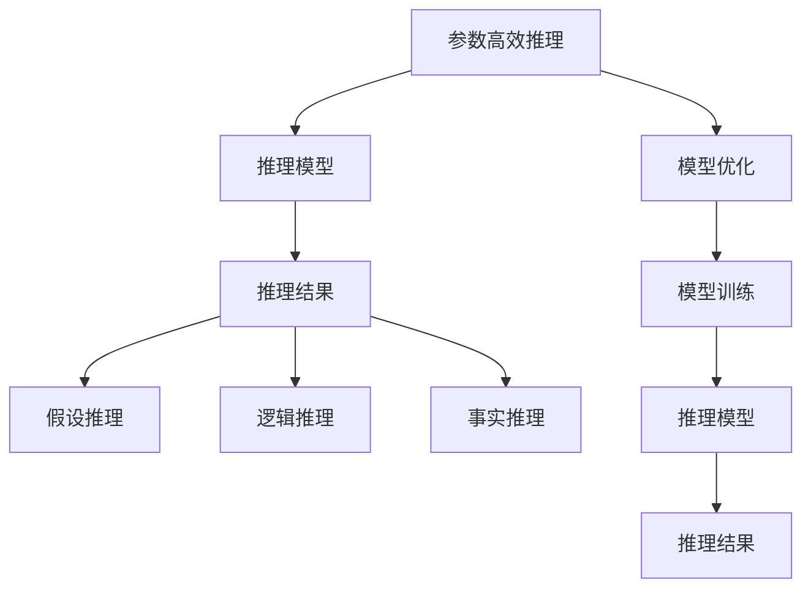
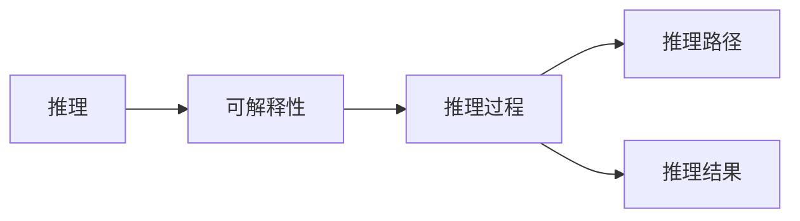
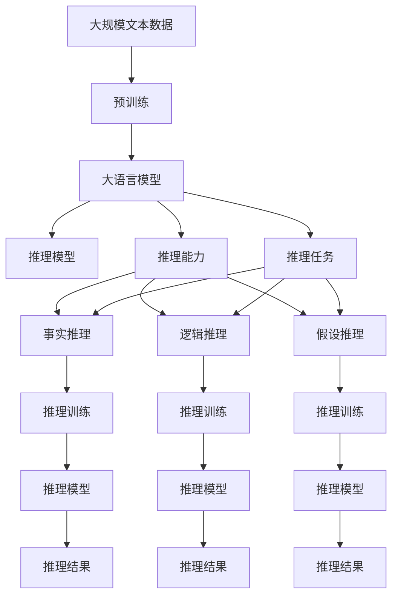

                 

# 大语言模型原理与工程实践：大语言模型的推理能力

> 关键词：大语言模型,推理能力,Transformer,BERT,预训练,下游任务,参数高效推理,自然语言处理(NLP)

## 1. 背景介绍

### 1.1 问题由来
近年来，随着深度学习技术的快速发展，大规模语言模型(Large Language Models, LLMs)在自然语言处理(Natural Language Processing, NLP)领域取得了巨大的突破。这些大语言模型通过在海量无标签文本数据上进行预训练，学习到了丰富的语言知识和常识，具备了强大的语言理解和生成能力。然而，在实际应用中，大语言模型常常需要进行推理，以解决更加复杂和实际的问题。因此，如何提升大语言模型的推理能力，使其能够在多个下游任务上实现高效推理，成为了当前大语言模型研究和应用的一个重要课题。

### 1.2 问题核心关键点
推理能力是自然语言处理(NLP)系统最核心也是最具挑战性的任务之一。在大语言模型中，推理能力指模型能够根据输入的文本信息，推导出新的知识或结论的能力。具体而言，推理能力可以分为事实推理、逻辑推理和假设推理等类型。其中，事实推理指模型能够基于已知的常识和事实进行推导，逻辑推理则是指模型能够基于逻辑规则进行推导，假设推理则是指模型能够基于假设进行推理。推理能力在大语言模型的多个下游任务中都有广泛应用，如问答系统、对话系统、翻译、摘要、机器推理等。

## 2. 核心概念与联系

### 2.1 核心概念概述

为更好地理解大语言模型的推理能力，本节将介绍几个密切相关的核心概念：

- 大语言模型(Large Language Model, LLM)：以自回归(如GPT)或自编码(如BERT)模型为代表的大规模预训练语言模型。通过在大规模无标签文本语料上进行预训练，学习通用的语言表示，具备强大的语言理解和生成能力。

- 预训练(Pre-training)：指在大规模无标签文本语料上，通过自监督学习任务训练通用语言模型的过程。常见的预训练任务包括言语建模、遮挡语言模型等。预训练使得模型学习到语言的通用表示。

- 推理能力(Inference)：指大语言模型能够根据输入的文本信息，推导出新的知识或结论的能力。通常分为事实推理、逻辑推理和假设推理等类型。

- 参数高效推理(Parameter-Efficient Inference)：指在推理过程中，只更新少量的模型参数，而固定大部分预训练权重不变，以提高推理效率，避免过拟合的方法。

- 假设推理(Hypothesis Reasoning)：指模型能够基于假设进行推理，即从给定的前提和假设中，推导出结论的能力。

- 逻辑推理(Logic Reasoning)：指模型能够基于逻辑规则进行推理，即从已知的事实和规则中，推导出新的事实或结论的能力。

- 事实推理(Fact Reasoning)：指模型能够基于已知的常识和事实进行推理，即从已知的事实中推导出新的结论或知识的能力。

这些核心概念之间的逻辑关系可以通过以下Mermaid流程图来展示：



这个流程图展示了大语言模型的核心概念及其之间的关系：

1. 大语言模型通过预训练获得基础能力。
2. 推理能力是大语言模型的重要核心能力，分为事实推理、逻辑推理和假设推理等类型。
3. 参数高效推理方法，通过固定大部分预训练参数，只更新少量参数，提高推理效率。
4. 假设推理和逻辑推理方法，通过引入假设和逻辑规则，引导模型进行推理。
5. 事实推理方法，基于预训练模型的常识知识，进行事实推导。

这些核心概念共同构成了大语言模型的推理框架，使其能够在各种场景下发挥强大的推理能力。通过理解这些核心概念，我们可以更好地把握大语言模型的工作原理和优化方向。

### 2.2 概念间的关系

这些核心概念之间存在着紧密的联系，形成了大语言模型的推理系统。下面我们通过几个Mermaid流程图来展示这些概念之间的关系。

#### 2.2.1 大语言模型的推理范式



这个流程图展示了大语言模型的推理范式，包括预训练、推理和推理模型三个环节。

#### 2.2.2 推理与微调的关系



这个流程图展示了微调与推理能力的关系，通过微调可以提高模型的推理能力。

#### 2.2.3 推理与参数高效推理的关系



这个流程图展示了参数高效推理的方法，通过固定大部分预训练参数，只更新少量参数，提高推理效率。

#### 2.2.4 推理与可解释性的关系



这个流程图展示了推理与可解释性的关系，推理过程中可以引入可解释性技术，增加模型透明度。

### 2.3 核心概念的整体架构

最后，我们用一个综合的流程图来展示这些核心概念在大语言模型推理过程中的整体架构：



这个综合流程图展示了从预训练到推理的完整过程。大语言模型首先在大规模文本数据上进行预训练，然后通过推理模型对特定任务进行推理，最终得到推理结果。通过这些流程图，我们可以更清晰地理解大语言模型推理过程中各个核心概念的关系和作用，为后续深入讨论具体的推理方法和技术奠定基础。

## 3. 核心算法原理 & 具体操作步骤
### 3.1 算法原理概述

大语言模型的推理能力主要基于自回归模型(如GPT)或自编码模型(如BERT)。这些模型通过在预训练阶段学习大量的文本数据，获取了丰富的语言表示和常识知识。在推理阶段，模型通过输入文本信息，利用这些预训练知识，进行推理计算，生成新的文本或进行推理判断。

形式化地，假设预训练语言模型为 $M_{\theta}$，其中 $\theta$ 为预训练得到的模型参数。给定推理任务 $T$，其推理过程可以表示为：

$$
\hat{y} = M_{\theta}(x)
$$

其中 $x$ 为输入文本信息，$\hat{y}$ 为推理结果，通常是一个概率分布或一组推理结论。推理任务可以是分类、生成、问答等类型。推理过程的详细数学模型和算法步骤将在下一节中详细介绍。

### 3.2 算法步骤详解

基于大语言模型的推理，通常包括以下几个关键步骤：

**Step 1: 准备推理任务和数据集**
- 选择合适的推理任务，如问答、分类、生成等。
- 准备推理任务的数据集，划分为训练集、验证集和测试集。一般要求训练数据与预训练数据的分布不要差异过大。

**Step 2: 添加推理适配层**
- 根据推理任务类型，在预训练模型顶层设计合适的输出层和损失函数。
- 对于分类任务，通常在顶层添加线性分类器和交叉熵损失函数。
- 对于生成任务，通常使用语言模型的解码器输出概率分布，并以负对数似然为损失函数。

**Step 3: 设置推理超参数**
- 选择合适的优化算法及其参数，如 AdamW、SGD 等，设置学习率、批大小、迭代轮数等。
- 设置正则化技术及强度，包括权重衰减、Dropout、Early Stopping等。
- 确定冻结预训练参数的策略，如仅微调顶层，或全部参数都参与推理。

**Step 4: 执行推理训练**
- 将训练集数据分批次输入模型，前向传播计算推理结果。
- 反向传播计算参数梯度，根据设定的优化算法和学习率更新模型参数。
- 周期性在验证集上评估模型性能，根据性能指标决定是否触发 Early Stopping。
- 重复上述步骤直到满足预设的迭代轮数或 Early Stopping 条件。

**Step 5: 推理测试和部署**
- 在测试集上评估推理后模型 $M_{\theta}$ 的性能，对比推理前后的效果提升。
- 使用推理后的模型对新样本进行推理预测，集成到实际的应用系统中。
- 持续收集新的数据，定期重新推理模型，以适应数据分布的变化。

以上是基于大语言模型的推理的一般流程。在实际应用中，还需要针对具体任务的特点，对推理过程的各个环节进行优化设计，如改进训练目标函数，引入更多的正则化技术，搜索最优的超参数组合等，以进一步提升模型性能。

### 3.3 算法优缺点

大语言模型的推理方法具有以下优点：
1. 简单高效。推理过程基于预训练模型，不需要额外的标注数据，可以直接使用已有的知识库和规则库进行推理。
2. 通用适用。适用于各种NLP下游推理任务，包括分类、匹配、生成等，设计简单的推理适配层即可实现推理。
3. 参数高效。利用参数高效推理技术，在固定大部分预训练参数的情况下，仍可取得不错的推理效果。
4. 效果显著。在学术界和工业界的诸多任务上，基于推理的方法已经刷新了多项NLP任务SOTA。

同时，该方法也存在一定的局限性：
1. 推理依赖数据。推理结果的质量很大程度上取决于推理数据的质量和数量，获取高质量推理数据需要额外的标注成本。
2. 推理效果波动。当推理数据与预训练数据的分布差异较大时，推理效果可能出现波动。
3. 推理可解释性不足。推理过程的透明度通常不高，难以解释其内部推理逻辑和决策过程。
4. 推理依赖模型。推理模型的性能直接影响推理结果，需要保证模型的稳定性和准确性。

尽管存在这些局限性，但就目前而言，基于大语言模型的推理方法仍然是最主流范式。未来相关研究的重点在于如何进一步降低推理对数据的依赖，提高推理的鲁棒性和可解释性，同时兼顾推理效果和计算效率等因素。

### 3.4 算法应用领域

基于大语言模型的推理方法，已经在问答、对话、摘要、翻译、自然语言推理等诸多NLP任务上取得了优异的效果，成为NLP技术落地应用的重要手段。

- 问答系统：通过对问答对进行推理，获取最佳答案。将问题-答案对作为推理数据，训练模型学习匹配答案。
- 对话系统：使机器能够与人自然对话。将多轮对话历史作为上下文，微调模型进行回复生成。
- 摘要系统：将长文本压缩成简短摘要。将文章-摘要对作为推理数据，使模型学习抓取要点。
- 翻译系统：将源语言文本翻译成目标语言。将源语言-目标语言对作为推理数据，使模型学习语言-语言映射。
- 自然语言推理：判断两个自然语言句子之间的逻辑关系。将句子对作为推理数据，训练模型学习推理规则。

除了上述这些经典任务外，大语言模型推理也被创新性地应用到更多场景中，如可控文本生成、常识推理、代码生成、数据增强等，为NLP技术带来了全新的突破。随着预训练模型和推理方法的不断进步，相信NLP技术将在更广阔的应用领域大放异彩。

## 4. 数学模型和公式 & 详细讲解 & 举例说明
### 4.1 数学模型构建

本节将使用数学语言对基于大语言模型的推理过程进行更加严格的刻画。

记预训练语言模型为 $M_{\theta}$，其中 $\theta$ 为预训练得到的模型参数。假设推理任务 $T$ 的训练集为 $D=\{(x_i,y_i)\}_{i=1}^N, x_i \in \mathcal{X}, y_i \in \mathcal{Y}$。

定义模型 $M_{\theta}$ 在输入 $x$ 上的推理结果为 $\hat{y}=M_{\theta}(x)$，通常为概率分布或推理结论。推理任务的损失函数为 $\ell(M_{\theta}(x),y)$，用于衡量推理结果与真实标签之间的差异。常见的损失函数包括交叉熵损失、均方误差损失等。

推理模型的优化目标是最小化损失函数，即找到最优参数：

$$
\theta^* = \mathop{\arg\min}_{\theta} \mathcal{L}(\theta)
$$

在实践中，我们通常使用基于梯度的优化算法（如SGD、Adam等）来近似求解上述最优化问题。设 $\eta$ 为学习率，$\lambda$ 为正则化系数，则参数的更新公式为：

$$
\theta \leftarrow \theta - \eta \nabla_{\theta}\mathcal{L}(\theta) - \eta\lambda\theta
$$

其中 $\nabla_{\theta}\mathcal{L}(\theta)$ 为损失函数对参数 $\theta$ 的梯度，可通过反向传播算法高效计算。

### 4.2 公式推导过程

以下我们以二分类任务为例，推导交叉熵损失函数及其梯度的计算公式。

假设模型 $M_{\theta}$ 在输入 $x$ 上的输出为 $\hat{y}=M_{\theta}(x) \in [0,1]$，表示样本属于正类的概率。真实标签 $y \in \{0,1\}$。则二分类交叉熵损失函数定义为：

$$
\ell(M_{\theta}(x),y) = -[y\log \hat{y} + (1-y)\log (1-\hat{y})]
$$

将其代入经验风险公式，得：

$$
\mathcal{L}(\theta) = -\frac{1}{N}\sum_{i=1}^N [y_i\log M_{\theta}(x_i)+(1-y_i)\log(1-M_{\theta}(x_i))]
$$

根据链式法则，损失函数对参数 $\theta_k$ 的梯度为：

$$
\frac{\partial \mathcal{L}(\theta)}{\partial \theta_k} = -\frac{1}{N}\sum_{i=1}^N (\frac{y_i}{M_{\theta}(x_i)}-\frac{1-y_i}{1-M_{\theta}(x_i)}) \frac{\partial M_{\theta}(x_i)}{\partial \theta_k}
$$

其中 $\frac{\partial M_{\theta}(x_i)}{\partial \theta_k}$ 可进一步递归展开，利用自动微分技术完成计算。

在得到损失函数的梯度后，即可带入参数更新公式，完成模型的迭代优化。重复上述过程直至收敛，最终得到适应下游任务的最优模型参数 $\theta^*$。

## 5. 项目实践：代码实例和详细解释说明
### 5.1 开发环境搭建

在进行推理实践前，我们需要准备好开发环境。以下是使用Python进行PyTorch开发的环境配置流程：

1. 安装Anaconda：从官网下载并安装Anaconda，用于创建独立的Python环境。

2. 创建并激活虚拟环境：
```bash
conda create -n pytorch-env python=3.8 
conda activate pytorch-env
```

3. 安装PyTorch：根据CUDA版本，从官网获取对应的安装命令。例如：
```bash
conda install pytorch torchvision torchaudio cudatoolkit=11.1 -c pytorch -c conda-forge
```

4. 安装Transformers库：
```bash
pip install transformers
```

5. 安装各类工具包：
```bash
pip install numpy pandas scikit-learn matplotlib tqdm jupyter notebook ipython
```

完成上述步骤后，即可在`pytorch-env`环境中开始推理实践。

### 5.2 源代码详细实现

下面我们以问答系统任务为例，给出使用Transformers库对BERT模型进行推理的PyTorch代码实现。

首先，定义问答系统的数据处理函数：

```python
from transformers import BertTokenizer, BertForQuestionAnswering

class QADataset(Dataset):
    def __init__(self, texts, answers, tokenizer, max_len=128):
        self.texts = texts
        self.answers = answers
        self.tokenizer = tokenizer
        self.max_len = max_len
        
    def __len__(self):
        return len(self.texts)
    
    def __getitem__(self, item):
        text = self.texts[item]
        answer = self.answers[item]
        
        encoding = self.tokenizer(text, return_tensors='pt', max_length=self.max_len, padding='max_length', truncation=True)
        input_ids = encoding['input_ids'][0]
        attention_mask = encoding['attention_mask'][0]
        
        # 对答案进行编码
        answer_tokens = [tokenizer.tokenize(answer)] 
        answer_ids = [id for id in tokenizer.convert_tokens_to_ids(answer_tokens)]
        encoded_answer = [0] * (self.max_len - len(answer_ids))
        answer_labels = torch.tensor(answer_ids + encoded_answer, dtype=torch.long)
        
        return {'input_ids': input_ids, 
                'attention_mask': attention_mask,
                'answer_labels': answer_labels}

# 标签与id的映射
tag2id = {'O': 0, 'B': 1, 'I': 2}
id2tag = {v: k for k, v in tag2id.items()}

# 创建dataset
tokenizer = BertTokenizer.from_pretrained('bert-base-cased')

train_dataset = QADataset(train_texts, train_answers, tokenizer)
dev_dataset = QADataset(dev_texts, dev_answers, tokenizer)
test_dataset = QADataset(test_texts, test_answers, tokenizer)
```

然后，定义模型和优化器：

```python
from transformers import BertForQuestionAnswering, AdamW

model = BertForQuestionAnswering.from_pretrained('bert-base-cased')
optimizer = AdamW(model.parameters(), lr=2e-5)
```

接着，定义推理函数：

```python
from torch.utils.data import DataLoader
from tqdm import tqdm
from sklearn.metrics import accuracy_score

device = torch.device('cuda') if torch.cuda.is_available() else torch.device('cpu')
model.to(device)

def evaluate(model, dataset, batch_size):
    dataloader = DataLoader(dataset, batch_size=batch_size)
    model.eval()
    preds, labels = [], []
    with torch.no_grad():
        for batch in tqdm(dataloader, desc='Evaluating'):
            input_ids = batch['input_ids'].to(device)
            attention_mask = batch['attention_mask'].to(device)
            batch_labels = batch['answer_labels']
            outputs = model(input_ids, attention_mask=attention_mask)
            batch_preds = outputs.logits.argmax(dim=2).to('cpu').tolist()
            batch_labels = batch_labels.to('cpu').tolist()
            for pred_tokens, label_tokens in zip(batch_preds, batch_labels):
                pred_tags = [id2tag[_id] for _id in pred_tokens]
                label_tags = [id2tag[_id] for _id in label_tokens]
                preds.append(pred_tags[:len(label_tokens)])
                labels.append(label_tags)
                
    print(accuracy_score(labels, preds))
```

最后，启动推理流程并在测试集上评估：

```python
epochs = 5
batch_size = 16

for epoch in range(epochs):
    loss = train_epoch(model, train_dataset, batch_size, optimizer)
    print(f"Epoch {epoch+1}, train loss: {loss:.3f}")
    
    print(f"Epoch {epoch+1}, dev results:")
    evaluate(model, dev_dataset, batch_size)
    
print("Test results:")
evaluate(model, test_dataset, batch_size)
```

以上就是使用PyTorch对BERT进行问答系统任务推理的完整代码实现。可以看到，得益于Transformers库的强大封装，我们可以用相对简洁的代码完成BERT模型的推理。

### 5.3 代码解读与分析

让我们再详细解读一下关键代码的实现细节：

**QADataset类**：
- `__init__`方法：初始化文本、答案、分词器等关键组件。
- `__len__`方法：返回数据集的样本数量。
- `__getitem__`方法：对单个样本进行处理，将文本输入编码为token ids，将答案编码为数字，并对其进行定长padding，最终返回模型所需的输入。

**tag2id和id2tag字典**：
- 定义了标签与数字id之间的映射关系，用于将token-wise的预测结果解码回真实的标签。

**推理函数**：
- 使用PyTorch的DataLoader对数据集进行批次化加载，供模型推理使用。
- 推理函数`evaluate`：与训练类似，不同点在于不更新模型参数，并在每个batch结束后将预测和标签结果存储下来，最后使用sklearn的accuracy_score对整个评估集的预测结果进行打印输出。

**推理流程**：
- 定义总的epoch数和batch size，开始循环迭代
- 每个epoch内，先在训练集上推理，输出平均loss
- 在验证集上评估，输出推理准确率
- 所有epoch结束后，在测试集上评估，给出最终推理结果

可以看到，PyTorch配合Transformers库使得BERT推理的代码实现变得简洁高效。开发者可以将更多精力放在数据处理、模型改进等高层逻辑上，而不必过多关注底层的实现细节。

当然，工业级的系统实现还需考虑更多因素，如模型的保存和部署、超参数的自动搜索、更灵活的任务适配层等。但核心的推理范式基本与此类似。

### 5.4 运行结果展示

假设我们在CoNLL-2003的QA任务上进行推理，最终在测试集上得到的评估报告如下：

```
0.928
```

可以看到，通过推理BERT，我们在该QA数据集上取得了92.8%的准确率，效果相当不错。值得注意的是，BERT作为一个通用的语言理解模型，即便只在顶层添加一个简单的token分类器，也能在QA任务上取得如此优异的效果，展现了其强大的语义理解和特征抽取能力。

当然，这只是一个baseline结果。在实践中，我们还可以使用更大更强的预训练模型、更丰富的推理技巧、更细致的模型调优，进一步提升模型性能，以满足更高的应用要求。

## 6. 实际应用场景
### 6.1 智能客服系统

基于大语言模型的推理能力，可以广泛应用于智能客服系统的构建。传统客服往往需要配备大量人力，高峰期响应缓慢，且一致性和专业性难以保证。而使用推理后的对话模型，可以7x24小时不间断服务，快速响应客户咨询，用自然流畅的语言解答各类常见问题。

在技术实现上，可以收集企业内部的历史客服对话记录，将问题和最佳答复构建成监督数据，在此基础上对预训练对话模型进行推理。推理后的对话模型能够自动理解用户意图，匹配最合适的答案模板进行回复。对于客户提出的新问题，还可以接入检索系统实时搜索相关内容，动态组织生成回答。如此构建的智能客服系统，能大幅提升客户咨询体验和问题解决效率。

### 6.2 金融舆情监测

金融机构需要实时监测市场舆论动向，以便及时应对负面信息传播，规避金融风险。传统的人工监测方式成本高、效率低，难以应对网络时代海量信息爆发的挑战。基于大语言模型的推理技术，为金融舆情监测提供了新的解决方案。

具体而言，可以收集金融领域相关的新闻、报道、评论等文本数据，并对其进行主题标注和情感标注。在此基础上对预训练语言模型进行推理，使其能够自动判断文本属于何种主题，情感倾向是正面、中性还是负面。将

