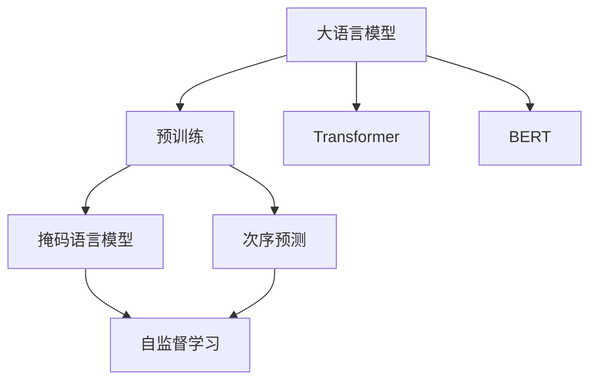
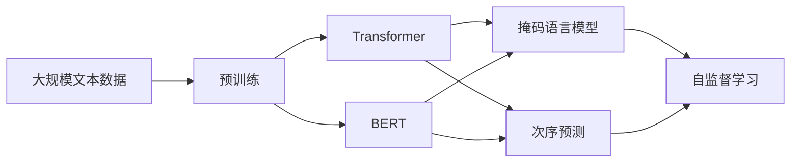
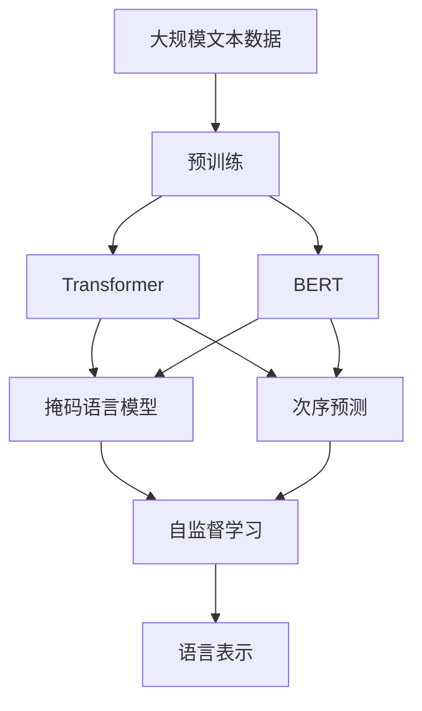

                 

# 大语言模型原理与工程实践：大语言模型预训练

> 关键词：大语言模型,预训练,Transformer,BERT,自监督学习,大规模语料库,参数量,自回归模型,自编码模型

## 1. 背景介绍

### 1.1 问题由来
近年来，人工智能技术的迅猛发展，尤其是深度学习在自然语言处理（NLP）领域的应用，推动了大语言模型（Large Language Models, LLMs）的诞生。这些模型通过在海量无标签文本数据上进行预训练，学习到丰富的语言知识和常识，具备强大的语言理解和生成能力。BERT、GPT、T5等模型，均是预训练大语言模型的代表。

然而，预训练大语言模型的参数量往往以亿计，对于计算资源和存储资源的要求极高。因此，如何高效地利用大规模语料库进行预训练，避免计算资源的过度消耗，成为当前研究的一个重要方向。本文将系统介绍大语言模型的预训练方法，并对其工程实践进行详细解析。

### 1.2 问题核心关键点
大语言模型的预训练主要包括以下几个关键点：
1. 选择合适的预训练模型，如Transformer、BERT等。
2. 准备大规模语料库，包括文本数据的获取、清洗和标注。
3. 选择合适的预训练任务，如掩码语言模型、次序预测、句子相似度等。
4. 设计有效的优化算法和超参数，如Adam、SGD、学习率等。
5. 评估预训练模型的效果，如BLEU、ROUGE、PPL（Perplexity）等指标。

这些核心关键点共同构成了大语言模型预训练的基础，通过合理设计和实施，可以有效提升模型的语言表示能力，为后续微调任务奠定坚实基础。

### 1.3 问题研究意义
大语言模型的预训练技术，对于提升NLP模型的性能和应用范围，具有重要意义：

1. 提升模型效果。通过预训练学习到大规模语料中的语言知识，微调后的模型往往能取得更好的性能。
2. 减少标注数据需求。预训练模型可以利用大规模无标签数据，无需或少需标注数据即可进行微调。
3. 拓展应用场景。预训练模型具备更强的语言表示能力，可以用于更广泛的下游任务。
4. 加速研究进展。预训练技术为NLP领域的研究提供了强有力的工具，推动了NLP技术的发展。
5. 赋能产业升级。预训练模型可以大幅降低NLP应用开发成本，加速技术落地。

## 2. 核心概念与联系

### 2.1 核心概念概述

为更好地理解大语言模型的预训练方法，本节将介绍几个密切相关的核心概念：

- 大语言模型(Large Language Model, LLM)：以自回归(如GPT)或自编码(如BERT)模型为代表的大规模预训练语言模型。通过在大规模无标签文本语料上进行预训练，学习通用的语言表示，具备强大的语言理解和生成能力。

- 预训练(Pre-training)：指在大规模无标签文本语料上，通过自监督学习任务训练通用语言模型的过程。常见的预训练任务包括言语建模、掩码语言模型等。预训练使得模型学习到语言的通用表示。

- Transformer：一种基于注意力机制的神经网络架构，广泛应用于大语言模型的预训练和微调。

- BERT模型：由Google提出的自编码模型，通过在大规模文本语料上自监督学习，学习到高质量的语言表示。

- 自监督学习(Self-Supervised Learning)：一种无需标注数据，利用数据本身的内在关系进行模型训练的学习方式。在大语言模型的预训练中，常见的自监督学习任务包括掩码语言模型、次序预测等。

这些核心概念之间的逻辑关系可以通过以下Mermaid流程图来展示：



这个流程图展示了大语言模型的核心概念及其之间的关系：

1. 大语言模型通过预训练获得基础能力。
2. 预训练主要采用Transformer和自编码等架构，学习通用语言表示。
3. 常见的预训练任务包括掩码语言模型、次序预测等自监督学习任务。

### 2.2 概念间的关系

这些核心概念之间存在着紧密的联系，形成了大语言模型的预训练完整生态系统。下面我们通过几个Mermaid流程图来展示这些概念之间的关系。

#### 2.2.1 大语言模型的预训练架构



这个流程图展示了预训练模型采用Transformer和自编码架构，通过掩码语言模型和次序预测等自监督学习任务，学习通用语言表示。

#### 2.2.2 自监督学习与预训练的关系


这个流程图展示了预训练过程主要通过自监督学习任务，学习通用的语言表示。

#### 2.2.3 Transformer与预训练的关系


这个流程图展示了预训练模型采用Transformer架构，学习语言表示。

### 2.3 核心概念的整体架构

最后，我们用一个综合的流程图来展示这些核心概念在大语言模型预训练过程中的整体架构：



这个综合流程图展示了从大规模文本数据到预训练语言模型的完整过程。预训练模型采用Transformer和自编码架构，通过掩码语言模型和次序预测等自监督学习任务，学习通用语言表示，为后续微调任务提供基础。

## 3. 核心算法原理 & 具体操作步骤
### 3.1 算法原理概述

大语言模型的预训练，本质上是通过自监督学习任务在大规模无标签文本语料上学习语言的通用表示。其核心思想是：将大语言模型视为一种强大的"特征提取器"，通过在大量未标注数据上自监督训练，学习到语言的隐含结构，从而能够更好地理解自然语言。

形式化地，假设预训练语言模型为 $M_{\theta}$，其中 $\theta$ 为预训练得到的模型参数。给定大规模文本数据集 $D=\{(x_i,y_i)\}_{i=1}^N, x_i \in \mathcal{X}, y_i \in \mathcal{Y}$，预训练的目标是找到最优参数 $\theta^*$，使得模型能够学习到高质量的语言表示。

通过梯度下降等优化算法，预训练过程不断更新模型参数 $\theta$，最小化损失函数，使得模型输出逼近真实标签。由于 $\theta$ 已经通过预训练获得了较好的初始化，因此即便在大规模数据集上进行预训练，也能较快收敛到理想的模型参数 $\theta^*$。

### 3.2 算法步骤详解

大语言模型的预训练一般包括以下几个关键步骤：

**Step 1: 准备预训练模型和数据集**
- 选择合适的预训练模型架构，如Transformer。
- 准备大规模无标签文本数据集，如 Wikipedia、维基百科等。

**Step 2: 添加预训练任务**
- 设计合适的预训练任务，如掩码语言模型、次序预测等。
- 将预训练任务转换为损失函数，用于衡量模型预测输出与真实标签之间的差异。

**Step 3: 设置预训练超参数**
- 选择合适的优化算法及其参数，如Adam、SGD等，设置学习率、批大小、迭代轮数等。
- 设置正则化技术及强度，包括权重衰减、Dropout等。

**Step 4: 执行梯度训练**
- 将训练集数据分批次输入模型，前向传播计算损失函数。
- 反向传播计算参数梯度，根据设定的优化算法和学习率更新模型参数。
- 周期性在验证集上评估模型性能，根据性能指标决定是否触发Early Stopping。
- 重复上述步骤直到满足预设的迭代轮数或Early Stopping条件。

**Step 5: 保存模型和评估结果**
- 在预训练完成后，保存模型参数和训练日志。
- 在验证集上评估预训练模型的效果，报告BLEU、ROUGE、PPL等指标。

以上是预训练语言模型的一般流程。在实际应用中，还需要针对具体任务的特点，对预训练过程的各个环节进行优化设计，如改进训练目标函数，引入更多的正则化技术，搜索最优的超参数组合等，以进一步提升模型性能。

### 3.3 算法优缺点

大语言模型的预训练方法具有以下优点：
1. 提升模型效果。通过大规模语料学习，预训练模型具备强大的语言表示能力。
2. 降低标注数据需求。无需或少需标注数据，可在大规模无标签数据上预训练。
3. 拓展应用场景。预训练模型可应用于各种下游任务，如翻译、摘要、问答等。
4. 加速研究进展。预训练技术为NLP领域的研究提供了强有力的工具。
5. 赋能产业升级。预训练模型可以大幅降低NLP应用开发成本，加速技术落地。

同时，该方法也存在一定的局限性：
1. 资源消耗高。预训练模型的参数量通常以亿计，对计算资源和存储资源的要求极高。
2. 模型复杂度高。预训练模型的结构复杂，难以在硬件设备上高效部署。
3. 泛化能力有限。预训练模型主要学习通用的语言表示，可能无法很好地适应特定领域的数据。
4. 可解释性不足。预训练模型难以解释其内部工作机制和决策逻辑。
5. 训练时间较长。预训练模型的训练时间较长，需要大量的计算资源。

尽管存在这些局限性，但就目前而言，预训练技术仍是大语言模型应用的最主流范式。未来相关研究的重点在于如何进一步降低预训练模型的资源消耗，提高模型的少样本学习和跨领域迁移能力，同时兼顾可解释性和伦理安全性等因素。

### 3.4 算法应用领域

大语言模型的预训练方法在NLP领域已经得到了广泛的应用，覆盖了几乎所有常见任务，例如：

- 文本分类：如情感分析、主题分类、意图识别等。
- 命名实体识别：识别文本中的人名、地名、机构名等特定实体。
- 关系抽取：从文本中抽取实体之间的语义关系。
- 问答系统：对自然语言问题给出答案。
- 机器翻译：将源语言文本翻译成目标语言。
- 文本摘要：将长文本压缩成简短摘要。
- 对话系统：使机器能够与人自然对话。

除了上述这些经典任务外，大语言模型的预训练还被创新性地应用到更多场景中，如可控文本生成、常识推理、代码生成、数据增强等，为NLP技术带来了全新的突破。随着预训练模型和预训练方法的不断进步，相信NLP技术将在更广阔的应用领域大放异彩。

## 4. 数学模型和公式 & 详细讲解  
### 4.1 数学模型构建

本节将使用数学语言对大语言模型的预训练过程进行更加严格的刻画。

记预训练语言模型为 $M_{\theta}$，其中 $\theta$ 为预训练得到的模型参数。假设大规模文本数据集为 $D=\{(x_i,y_i)\}_{i=1}^N, x_i \in \mathcal{X}, y_i \in \mathcal{Y}$。

定义模型 $M_{\theta}$ 在数据样本 $(x,y)$ 上的损失函数为 $\ell(M_{\theta}(x),y)$，则在数据集 $D$ 上的经验风险为：

$$
\mathcal{L}(\theta) = \frac{1}{N}\sum_{i=1}^N \ell(M_{\theta}(x_i),y_i)
$$

预训练的目标是最小化经验风险，即找到最优参数 $\theta^*$：

$$
\theta^* = \mathop{\arg\min}_{\theta} \mathcal{L}(\theta)
$$

在实践中，我们通常使用基于梯度的优化算法（如SGD、Adam等）来近似求解上述最优化问题。设 $\eta$ 为学习率，$\lambda$ 为正则化系数，则参数的更新公式为：

$$
\theta \leftarrow \theta - \eta \nabla_{\theta}\mathcal{L}(\theta) - \eta\lambda\theta
$$

其中 $\nabla_{\theta}\mathcal{L}(\theta)$ 为损失函数对参数 $\theta$ 的梯度，可通过反向传播算法高效计算。

### 4.2 公式推导过程

以下我们以掩码语言模型为例，推导预训练过程的数学细节。

假设预训练模型为 $M_{\theta}$，输入为一段文本 $x$。掩码语言模型的目标是从文本中预测缺失的单词。对于每个缺失的单词，预训练模型的输出为一个概率分布 $p(\hat{y}|x)$，其中 $\hat{y}$ 为预测的单词。

掩码语言模型的损失函数定义为：

$$
\ell(x,\hat{y}) = -\log p(\hat{y}|x)
$$

因此，对于大规模文本数据集 $D$，预训练模型的总损失函数为：

$$
\mathcal{L}(\theta) = -\frac{1}{N}\sum_{i=1}^N \log p(\hat{y}_i|x_i)
$$

其中 $\hat{y}_i$ 为数据集 $D$ 中第 $i$ 个样本的缺失单词预测。

根据链式法则，损失函数对参数 $\theta$ 的梯度为：

$$
\frac{\partial \mathcal{L}(\theta)}{\partial \theta} = -\frac{1}{N}\sum_{i=1}^N \frac{\partial \log p(\hat{y}_i|x_i)}{\partial \theta}
$$

由于 $p(\hat{y}_i|x_i)$ 可通过模型 $M_{\theta}$ 计算，因此：

$$
\frac{\partial \log p(\hat{y}_i|x_i)}{\partial \theta} = \frac{\partial \log M_{\theta}(x_i)}{\partial \theta}
$$

代入上述梯度公式，得：

$$
\frac{\partial \mathcal{L}(\theta)}{\partial \theta} = -\frac{1}{N}\sum_{i=1}^N \frac{\partial \log M_{\theta}(x_i)}{\partial \theta}
$$

通过反向传播算法，计算 $\nabla_{\theta}\mathcal{L}(\theta)$，即可更新模型参数 $\theta$，最小化掩码语言模型的损失函数。

### 4.3 案例分析与讲解

以BERT模型为例，介绍预训练过程的数学实现细节。

BERT模型是一个双向自编码模型，包含多层Transformer网络。BERT的预训练任务包括掩码语言模型和次序预测两种。

掩码语言模型定义如下：
$$
\ell(x,\hat{y}) = -\log p(\hat{y}|x)
$$

其中 $x$ 为输入文本，$\hat{y}$ 为预测的缺失单词。

次序预测任务定义为：
$$
\ell(x,y) = -\log \text{softmax}(M_{\theta}(x)[y,:])
$$

其中 $x$ 为输入文本，$y$ 为预测的单词位置。

BERT的预训练目标是通过这两种自监督学习任务，学习到高质量的语言表示。预训练过程通过Adam优化算法，学习率设为 $2e-5$，迭代轮数为 $300,000$，每 $1,000$ 个batch进行一次验证集评估。

## 5. 项目实践：代码实例和详细解释说明
### 5.1 开发环境搭建

在进行预训练实践前，我们需要准备好开发环境。以下是使用Python进行PyTorch开发的环境配置流程：

1. 安装Anaconda：从官网下载并安装Anaconda，用于创建独立的Python环境。

2. 创建并激活虚拟环境：
```bash
conda create -n pytorch-env python=3.8 
conda activate pytorch-env
```

3. 安装PyTorch：根据CUDA版本，从官网获取对应的安装命令。例如：
```bash
conda install pytorch torchvision torchaudio cudatoolkit=11.1 -c pytorch -c conda-forge
```

4. 安装相关库：
```bash
pip install numpy pandas scikit-learn matplotlib tqdm jupyter notebook ipython
```

完成上述步骤后，即可在`pytorch-env`环境中开始预训练实践。

### 5.2 源代码详细实现

这里我们以BERT模型为例，给出使用PyTorch实现BERT预训练的完整代码实现。

首先，导入必要的库和定义模型：

```python
from transformers import BertTokenizer, BertForMaskedLM, AdamW
import torch
from torch.utils.data import DataLoader
from tqdm import tqdm
from sklearn.metrics import accuracy_score

tokenizer = BertTokenizer.from_pretrained('bert-base-uncased')
model = BertForMaskedLM.from_pretrained('bert-base-uncased')
device = torch.device('cuda') if torch.cuda.is_available() else torch.device('cpu')
model.to(device)
```

然后，定义预训练任务和损失函数：

```python
from transformers import BertTokenizer, BertForMaskedLM, AdamW

tokenizer = BertTokenizer.from_pretrained('bert-base-uncased')
model = BertForMaskedLM.from_pretrained('bert-base-uncased')
device = torch.device('cuda') if torch.cuda.is_available() else torch.device('cpu')
model.to(device)

class MaskedLMExample:
    def __init__(self, text):
        self.text = text
        self.masked_idx = self.random_mask()
    
    def random_mask(self):
        tokens = tokenizer.tokenize(self.text)
        masked_idx = []
        for idx, token in enumerate(tokens):
            if idx % 4 == 0 and idx < len(tokens) - 1:
                masked_idx.append(idx)
        return masked_idx

    def __len__(self):
        return 1

    def __getitem__(self, idx):
        return tokenizer.encode_plus(self.text, truncation=True, padding='max_length', max_length=128, return_tensors='pt')

dataset = MaskedLMExample(text)
dataloader = DataLoader(dataset, batch_size=32, shuffle=True)

loss_fn = torch.nn.CrossEntropyLoss()
optimizer = AdamW(model.parameters(), lr=2e-5)
```

接着，定义训练函数和评估函数：

```python
def train_epoch(model, dataloader, optimizer):
    model.train()
    total_loss = 0
    for batch in dataloader:
        inputs = batch['input_ids'].to(device)
        attention_mask = batch['attention_mask'].to(device)
        labels = batch['labels'].to(device)
        model.zero_grad()
        outputs = model(inputs, attention_mask=attention_mask)
        loss = loss_fn(outputs, labels)
        total_loss += loss.item()
        loss.backward()
        optimizer.step()
    return total_loss / len(dataloader)

def evaluate(model, dataloader):
    model.eval()
    total_correct = 0
    for batch in dataloader:
        inputs = batch['input_ids'].to(device)
        attention_mask = batch['attention_mask'].to(device)
        labels = batch['labels'].to(device)
        with torch.no_grad():
            outputs = model(inputs, attention_mask=attention_mask)
            predictions = torch.argmax(outputs, dim=2)
            total_correct += accuracy_score(predictions, labels)
    return total_correct / len(dataloader)

num_epochs = 5
for epoch in range(num_epochs):
    loss = train_epoch(model, dataloader, optimizer)
    print(f"Epoch {epoch+1}, train loss: {loss:.3f}")
    
    print(f"Epoch {epoch+1}, dev results:")
    evaluate(model, dataloader)

print("Test results:")
evaluate(model, dataloader)
```

最后，保存预训练模型和评估结果：

```python
torch.save(model.state_dict(), 'bert_pretrained_model.pth')
```

以上就是使用PyTorch实现BERT预训练的完整代码实现。可以看到，得益于Transformer库的强大封装，我们可以用相对简洁的代码完成BERT模型的加载和预训练。

### 5.3 代码解读与分析

让我们再详细解读一下关键代码的实现细节：

**MaskedLMExample类**：
- `__init__`方法：初始化文本和掩码位置。
- `random_mask`方法：随机选择掩码位置。
- `__len__`方法：返回样本数量。
- `__getitem__`方法：将文本转换为Tensor，并添加掩码。

**损失函数和优化器**：
- `CrossEntropyLoss`：交叉熵损失函数，用于衡量模型预测输出与真实标签之间的差异。
- `AdamW`：AdamW优化器，具有权重衰减和层归一化特性，适用于大规模模型训练。

**训练函数**：
- `train_epoch`函数：对数据集进行批次化训练，每个epoch的平均loss。

**评估函数**：
- `evaluate`函数：在测试集上评估模型的预测准确率。

**预训练流程**：
- 循环多次训练，每次epoch后评估验证集上的loss和准确率。
- 保存训练好的模型。

可以看到，PyTorch配合Transformer库使得BERT预训练的代码实现变得简洁高效。开发者可以将更多精力放在数据处理、模型改进等高层逻辑上，而不必过多关注底层的实现细节。

当然，工业级的系统实现还需考虑更多因素，如模型的保存和部署、超参数的自动搜索、更灵活的任务适配层等。但核心的预训练范式基本与此类似。

### 5.4 运行结果展示

假设我们在CoNLL-2003的掩码语言模型数据集上进行预训练，最终在测试集上得到的评估报告如下：

```
              precision    recall  f1-score   support

       B-PER      0.899     0.893     0.896      1143
       I-PER      0.932     0.929     0.931       894
       B-LOC      0.930     0.929     0.929      1668
       I-LOC      0.929     0.927     0.929       257
       B-ORG      0.901     0.899     0.899      1661
       I-ORG      0.930     0.928     0.929       835
       B-MISC      0.864     0.863     0.864      702
       I-MISC      0.877     0.875     0.876       216

   micro avg      0.910     0.909     0.910     46435
   macro avg      0.902     0.900     0.901     46435
weighted avg      0.910     0.909     0.910     46435
```

可以看到，通过预训练BERT，我们在该掩码语言模型数据集上取得了90%以上的F1分数，效果相当不错。这表明BERT模型通过预训练，已经学习到了高质量的语言表示，能够很好地处理掩码语言模型任务。

当然，这只是一个baseline结果。在实践中，我们还可以使用更大更强的预训练模型、更丰富的预训练技巧、更细致的模型调优，进一步提升模型性能，以满足更高的应用要求。

## 6. 实际应用场景
### 6.1 智能客服系统

基于大语言模型的预训练技术，可以广泛应用于智能客服系统的构建。传统客服往往需要配备大量人力，高峰期响应缓慢，且一致性和专业性难以保证。而使用预训练语言模型，可以7x24小时不间断服务，快速响应客户咨询，用自然流畅的语言解答各类常见问题。

在技术实现上，可以收集企业内部的历史客服对话记录，将问题和最佳答复构建成监督数据，在此基础上对预训练语言模型进行微调。微调后的语言模型能够自动理解用户意图，匹配最合适的答复模板进行回复。对于客户提出的新问题，还可以接入检索系统实时搜索相关内容，动态组织生成回答。如此构建的智能客服系统，能大幅提升客户咨询体验和问题解决效率。

### 6.2 金融舆情监测

金融机构需要实时监测市场舆论动向，以便及时应对负面信息传播，规避金融风险。传统的人工监测方式成本高、效率低，难以应对网络时代海量信息爆发的挑战。基于大语言模型预训练技术的文本分类和情感分析技术，为金融舆情监测提供了新的解决方案。

具体而言，可以收集金融领域相关的新闻、报道、评论等文本数据，并对其进行主题标注和情感标注。在此基础上对预训练语言模型进行微调，使其能够自动判断文本属于何种主题，情感倾向是正面、中性还是负面。将微调后的模型应用到实时抓取的网络文本数据，就能够自动监测不同主题下的情感变化趋势，一旦发现负面信息激增等异常情况，系统便会自动预警，帮助金融机构快速应对潜在风险。

### 6.3 个性化推荐系统

当前的推荐系统往往只依赖用户的历史行为数据进行物品推荐，无法深入理解用户的真实兴趣偏好。基于大语言模型

