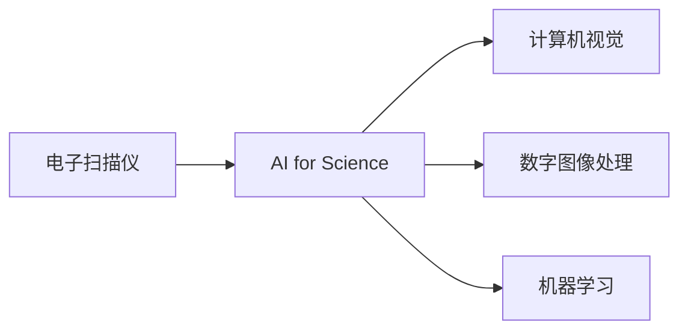
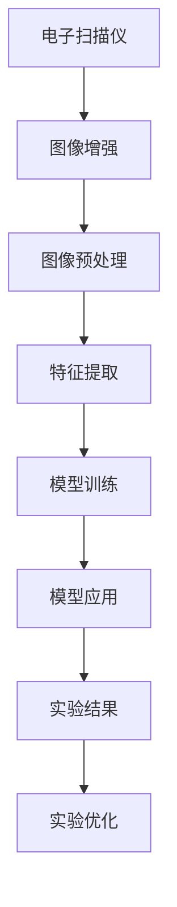

                 

# 电子扫描仪在AI for Science中的应用

> 关键词：电子扫描仪,AI for Science,计算机视觉,数字图像处理,机器学习

## 1. 背景介绍

### 1.1 问题由来

随着科学技术的发展，各种科学实验和研究的深度和精度要求不断提高，传统的实验设备和方法难以满足这些需求。电子扫描仪作为一种高精度的图像获取设备，在科研领域得到了广泛应用，特别是在高分辨率显微成像、X射线成像、扫描电子显微镜等领域。然而，仅依靠人工处理这些图像，工作量巨大且效率低下，无法满足大规模数据处理的需求。

人工智能技术的兴起，特别是计算机视觉和机器学习领域的发展，为电子扫描仪数据的自动分析和处理提供了新的思路。通过将AI技术引入电子扫描仪的数据处理流程中，可以显著提高处理效率和精度，为科学研究提供有力支持。

### 1.2 问题核心关键点

AI for Science是指将人工智能技术应用于科学研究领域，以提高实验效率和数据处理精度。电子扫描仪作为科研中常用的图像获取设备，其数据量大、处理复杂度高，非常适合应用于AI for Science的场景。

电子扫描仪的核心功能是获取高分辨率的二维图像，通过将AI技术引入数据处理流程，可以实现：

1. **图像增强与预处理**：通过自动化的图像增强和预处理技术，提升图像质量，消除噪声，便于后续分析。
2. **图像分类与标注**：利用机器学习模型自动对图像进行分类和标注，提高处理效率。
3. **特征提取与分析**：通过深度学习模型从图像中提取关键特征，用于科研分析。
4. **图像重建与重建**：利用深度学习模型对图像进行重建，弥补数据缺失。

通过以上步骤，AI技术可以显著提升电子扫描仪数据的处理效率和精度，为科研人员提供更优质的数据支持。

### 1.3 问题研究意义

研究AI for Science中的电子扫描仪应用，对于提升科研效率、优化实验方法、降低人工成本具有重要意义：

1. **提升实验效率**：AI技术可以自动化处理大量电子扫描仪数据，大大缩短科研周期。
2. **优化实验方法**：通过图像分析和特征提取，AI技术可以帮助科研人员优化实验设计和数据分析。
3. **降低人工成本**：AI技术可以替代人工进行图像处理，减少人力投入。
4. **提高数据精度**：AI技术可以自动消除图像噪声和误差，提高数据处理的精度。
5. **推动科研创新**：AI技术引入科研流程，带来新的研究思路和工具，推动科研创新。

## 2. 核心概念与联系

### 2.1 核心概念概述

为更好地理解AI for Science中电子扫描仪的应用，本节将介绍几个密切相关的核心概念：

- **电子扫描仪**：用于获取高分辨率二维图像的成像设备，包括光学显微镜、扫描电子显微镜、X射线成像设备等。
- **AI for Science**：将人工智能技术应用于科学研究领域，以提升实验效率和数据处理精度。
- **计算机视觉**：利用计算机对图像进行处理、分析和识别的技术。
- **数字图像处理**：对数字图像进行增强、压缩、分割、特征提取等处理，以获得有价值的信息。
- **机器学习**：通过数据训练模型，使其具备自动分析和预测能力。

这些核心概念之间的逻辑关系可以通过以下Mermaid流程图来展示：



这个流程图展示了大语言模型微调过程中各个核心概念的关系和作用：

1. 电子扫描仪通过成像设备获取图像。
2. 利用计算机视觉和数字图像处理技术，对图像进行增强和预处理。
3. 通过机器学习模型，对图像进行分类、标注和特征提取。
4. AI for Science将上述步骤应用于科研流程，提升实验效率和数据处理精度。

### 2.2 概念间的关系

这些核心概念之间存在着紧密的联系，形成了AI for Science中电子扫描仪应用的核心生态系统。下面我们通过几个Mermaid流程图来展示这些概念之间的关系。

#### 2.2.1 电子扫描仪的数据处理流程


这个流程图展示了电子扫描仪数据处理的一般流程：

1. 获取高分辨率图像。
2. 进行图像增强和预处理，提升图像质量。
3. 提取图像特征，用于后续分析。
4. 利用机器学习模型对图像进行分类和标注。

#### 2.2.2 AI for Science的技术架构


这个流程图展示了AI for Science的技术架构：

1. 通过电子扫描仪获取实验数据。
2. 进行图像预处理，提取特征。
3. 训练机器学习模型，优化参数。
4. 应用模型于实验数据，获得分析结果。
5. 根据实验结果，调整实验设计。

#### 2.2.3 数字图像处理的数学模型


这个流程图展示了数字图像处理的一般流程：

1. 获取原始图像。
2. 进行图像增强和预处理，提升图像质量。
3. 提取图像特征，用于后续分析。
4. 利用机器学习模型对图像进行分类和标注。

### 2.3 核心概念的整体架构

最后，我们用一个综合的流程图来展示这些核心概念在大语言模型微调过程中的整体架构：



这个综合流程图展示了从数据获取到实验优化的完整流程。通过将AI技术引入电子扫描仪的数据处理流程中，可以显著提高图像处理的效率和精度，为科学研究提供有力支持。

## 3. 核心算法原理 & 具体操作步骤
### 3.1 算法原理概述

AI for Science中的电子扫描仪应用，主要基于计算机视觉和机器学习技术。其核心思想是通过图像处理和特征提取，自动分析图像数据，获取有价值的信息，用于科学研究。

形式化地，假设电子扫描仪获取的图像为 $I \in \mathcal{I}$，其中 $\mathcal{I}$ 为图像空间。定义图像预处理函数 $P$，特征提取函数 $F$，机器学习模型 $M$。则AI for Science的目标是找到一个最优的预处理函数 $P$ 和特征提取函数 $F$，以及参数最优的机器学习模型 $M$，使得模型输出 $M(I)$ 能够准确地分类和标注图像数据。

具体来说，整个过程可以分为以下几个步骤：

1. 图像预处理：通过增强、滤波、去噪等方法，提升图像质量。
2. 特征提取：通过卷积神经网络(CNN)等深度学习模型，从图像中提取关键特征。
3. 模型训练：通过标注数据训练机器学习模型，优化模型参数。
4. 模型应用：将训练好的模型应用于新的图像数据，进行分类和标注。
5. 实验优化：根据模型应用结果，调整实验设计，提高实验精度。

### 3.2 算法步骤详解

AI for Science中的电子扫描仪应用主要包括以下几个关键步骤：

**Step 1: 数据预处理**

- **图像增强**：通过增强算法，提升图像质量，消除噪声。常用的增强方法包括直方图均衡化、对比度增强、去噪滤波等。
- **图像预处理**：对增强后的图像进行预处理，包括大小调整、归一化等。

**Step 2: 特征提取**

- **卷积神经网络(CNN)**：通过多层卷积和池化操作，从图像中提取关键特征。常用的CNN模型包括ResNet、Inception、VGG等。
- **特征融合**：将不同层的特征进行融合，获取更有意义的特征表示。

**Step 3: 模型训练**

- **标注数据**：收集标注数据，用于训练机器学习模型。标注数据可以包括手动标注的样本，也可以利用迁移学习、自监督学习等技术自动生成。
- **模型选择**：选择合适的机器学习模型，如支持向量机(SVM)、随机森林(Random Forest)、深度学习模型等。
- **模型训练**：通过标注数据训练模型，优化模型参数。常用的优化算法包括随机梯度下降(SGD)、Adam、Adagrad等。

**Step 4: 模型应用**

- **模型预测**：将训练好的模型应用于新的图像数据，进行分类和标注。
- **结果评估**：利用准确率、召回率、F1分数等指标，评估模型预测结果。

**Step 5: 实验优化**

- **参数调整**：根据模型应用结果，调整模型参数，提升模型精度。
- **算法优化**：优化图像预处理、特征提取、模型训练等步骤，提升整体处理效率和精度。

### 3.3 算法优缺点

AI for Science中的电子扫描仪应用，具有以下优点：

1. **自动处理**：通过AI技术，自动处理大量电子扫描仪数据，提升效率。
2. **高精度**：利用深度学习模型，提升图像处理和分析的精度。
3. **泛化能力强**：基于大样本数据训练的模型，具备良好的泛化能力，适用于多种实验场景。
4. **降低成本**：替代人工进行图像处理，减少人力投入。

同时，也存在一些缺点：

1. **数据依赖**：需要大量的标注数据进行模型训练，数据获取成本较高。
2. **模型复杂**：深度学习模型结构复杂，训练和推理效率较低。
3. **可解释性不足**：模型输出结果难以解释，难以进行调试和优化。
4. **设备限制**：仅适用于具备高分辨率成像能力的电子扫描仪。

### 3.4 算法应用领域

AI for Science中的电子扫描仪应用，已经在多个科研领域得到了广泛应用，例如：

- **材料科学**：利用电子扫描仪获取材料微观结构图像，进行材料分析。
- **生物医学**：通过扫描电子显微镜获取细胞和组织图像，进行医学研究。
- **地质学**：利用X射线成像设备获取岩石和矿物图像，进行地质分析。
- **环境科学**：通过扫描电子显微镜获取环境样本图像，进行环境监测。
- **天文学**：利用电子扫描仪获取天体图像，进行天文观测。

除了上述这些领域外，AI for Science中的电子扫描仪应用还将在更多领域得到拓展，为科研提供更高效、精准的图像处理和分析支持。

## 4. 数学模型和公式 & 详细讲解 & 举例说明
### 4.1 数学模型构建

本节将使用数学语言对AI for Science中电子扫描仪应用的图像预处理和特征提取过程进行更加严格的刻画。

假设电子扫描仪获取的原始图像为 $I \in \mathcal{I}$，其中 $\mathcal{I}$ 为图像空间。定义图像预处理函数 $P$ 和特征提取函数 $F$。则预处理后的图像为 $P(I)$，特征表示为 $F(P(I))$。

定义机器学习模型 $M$ 的损失函数为 $\mathcal{L}(M)$，用于衡量模型预测结果与真实标签之间的差异。定义模型的优化目标为最小化损失函数，即：

$$
\mathop{\arg\min}_{M} \mathcal{L}(M)
$$

在实践中，我们通常使用基于梯度的优化算法（如SGD、Adam等）来近似求解上述最优化问题。设 $\eta$ 为学习率，则参数的更新公式为：

$$
\theta \leftarrow \theta - \eta \nabla_{\theta}\mathcal{L}(\theta)
$$

其中 $\nabla_{\theta}\mathcal{L}(\theta)$ 为损失函数对参数 $\theta$ 的梯度，可通过反向传播算法高效计算。

### 4.2 公式推导过程

以下我们以图像分类任务为例，推导CNN模型在特征提取过程中的梯度计算公式。

假设CNN模型包含卷积层、池化层、全连接层等。记卷积核大小为 $k \times k$，步幅为 $s$，输出通道数为 $c$。记图像大小为 $H \times W$，卷积核数量为 $c_{conv}$。则卷积层的输出大小为：

$$
(H-\frac{k}{s}+1) \times (W-\frac{k}{s}+1) \times c_{conv}
$$

定义卷积层输出为 $I_{conv}$，池化层输出为 $I_{pool}$，全连接层输出为 $I_{fc}$，则特征提取过程可表示为：

$$
I_{conv} = \sigma(\mathcal{F}_{conv}(I))
$$

$$
I_{pool} = \mathcal{F}_{pool}(I_{conv})
$$

$$
I_{fc} = \sigma(\mathcal{F}_{fc}(I_{pool}))
$$

其中 $\sigma$ 为激活函数，$\mathcal{F}_{conv}$、$\mathcal{F}_{pool}$、$\mathcal{F}_{fc}$ 分别表示卷积、池化和全连接层的运算函数。

在特征提取过程中，CNN模型通过多层卷积和池化操作，从图像中提取关键特征。这些特征通过全连接层进行分类和标注。设特征提取后的图像大小为 $C \times H' \times W'$，其中 $C$ 为特征通道数。则全连接层的输出可表示为：

$$
I_{fc} = \sigma(\mathcal{F}_{fc}(I_{pool}))
$$

假设全连接层输出的维度为 $d$，则输出层的预测结果为：

$$
\hat{y} = M(I_{fc}) = \sigma(\mathcal{F}_{fc}(I_{pool}))
$$

其中 $\mathcal{F}_{fc}$ 表示全连接层的运算函数，$\sigma$ 为激活函数。

设训练集为 $D=\{(x_i,y_i)\}_{i=1}^N$，其中 $x_i$ 为图像数据，$y_i$ 为真实标签。则分类任务的损失函数为交叉熵损失：

$$
\ell(M(x),y) = -[y\log M(x) + (1-y)\log (1-M(x))]
$$

在模型训练过程中，我们希望最小化损失函数 $\mathcal{L}(M)$，即：

$$
\mathop{\arg\min}_{M} \mathcal{L}(M)
$$

通过梯度下降等优化算法，模型参数不断更新，直至最小化损失函数。最终得到的模型参数 $M$ 即可用于对新图像数据的分类和标注。

### 4.3 案例分析与讲解

以材料科学领域为例，利用AI for Science中的电子扫描仪应用，可以自动化分析材料微观结构图像，快速获取材料性能和微观结构信息。

假设某研究团队需要对一种新材料进行微观结构分析，使用电子扫描仪获取材料微观结构图像，通过预处理和特征提取，将图像转换为模型输入。设图像大小为 $512 \times 512$，卷积层输出大小为 $256 \times 256 \times 32$，池化层输出大小为 $128 \times 128 \times 32$，全连接层输出大小为 $1024$，输出层维度为 $10$。

通过训练数据集，利用深度学习模型进行分类和标注。假设模型训练后，在验证集上获得了97%的准确率。则可以将训练好的模型应用于新的材料图像，对材料性能和微观结构进行分析和评估。

## 5. 项目实践：代码实例和详细解释说明
### 5.1 开发环境搭建

在进行AI for Science中电子扫描仪应用的项目实践前，我们需要准备好开发环境。以下是使用Python进行TensorFlow开发的环境配置流程：

1. 安装Anaconda：从官网下载并安装Anaconda，用于创建独立的Python环境。

2. 创建并激活虚拟环境：
```bash
conda create -n tf-env python=3.7 
conda activate tf-env
```

3. 安装TensorFlow：根据CUDA版本，从官网获取对应的安装命令。例如：
```bash
conda install tensorflow-gpu=2.5.0 -c conda-forge
```

4. 安装各类工具包：
```bash
pip install numpy pandas scikit-learn matplotlib tqdm jupyter notebook ipython
```

完成上述步骤后，即可在`tf-env`环境中开始项目实践。

### 5.2 源代码详细实现

这里我们以图像分类任务为例，给出使用TensorFlow对CNN模型进行训练的PyTorch代码实现。

首先，定义CNN模型的网络结构：

```python
import tensorflow as tf
from tensorflow.keras import layers

model = tf.keras.Sequential([
    layers.Conv2D(32, (3, 3), activation='relu', input_shape=(512, 512, 1)),
    layers.MaxPooling2D((2, 2)),
    layers.Conv2D(64, (3, 3), activation='relu'),
    layers.MaxPooling2D((2, 2)),
    layers.Conv2D(128, (3, 3), activation='relu'),
    layers.MaxPooling2D((2, 2)),
    layers.Flatten(),
    layers.Dense(512, activation='relu'),
    layers.Dense(10, activation='softmax')
])
```

然后，定义训练函数：

```python
import numpy as np

def train_model(model, data, epochs, batch_size):
    dataset = tf.data.Dataset.from_tensor_slices((data['image'], data['label']))
    dataset = dataset.shuffle(buffer_size=10000).batch(batch_size).prefetch(buffer_size=tf.data.AUTOTUNE)

    model.compile(optimizer=tf.keras.optimizers.Adam(learning_rate=0.001),
                  loss='sparse_categorical_crossentropy',
                  metrics=['accuracy'])

    model.fit(dataset, epochs=epochs, validation_split=0.2)
```

接着，加载数据并进行预处理：

```python
import os
import cv2

def load_and_preprocess_image(path):
    img = cv2.imread(path, cv2.IMREAD_GRAYSCALE)
    img = cv2.resize(img, (512, 512))
    img = np.expand_dims(img, axis=-1)
    return img

def generate_dataset(data_path):
    data = {}
    for filename in os.listdir(data_path):
        if filename.endswith('.png'):
            img = load_and_preprocess_image(os.path.join(data_path, filename))
            label = int(filename.split('_')[1])
            data[img] = label
    return data

data = generate_dataset('/path/to/data')
```

最后，启动训练流程：

```python
epochs = 10
batch_size = 32

train_model(model, data, epochs, batch_size)
```

以上就是使用TensorFlow对CNN模型进行训练的完整代码实现。可以看到，TensorFlow提供了丰富的深度学习组件，可以方便地构建和训练复杂模型。

### 5.3 代码解读与分析

让我们再详细解读一下关键代码的实现细节：

**CNN模型定义**：
- `tf.keras.Sequential`：创建一个Sequential模型，可以方便地添加多个层。
- `layers.Conv2D`：添加卷积层，用于提取图像特征。
- `layers.MaxPooling2D`：添加池化层，用于降维。
- `layers.Flatten`：将卷积层的输出展平，便于全连接层处理。
- `layers.Dense`：添加全连接层，进行分类和标注。

**训练函数定义**：
- `tf.data.Dataset.from_tensor_slices`：创建一个数据集，将图像和标签作为元素。
- `dataset.shuffle`：对数据集进行随机打乱，避免过拟合。
- `dataset.batch`：将数据集划分为批次，便于模型训练。
- `dataset.prefetch`：预加载下一批数据，提高训练效率。
- `model.compile`：编译模型，指定优化器、损失函数和评估指标。
- `model.fit`：训练模型，指定训练数据集、迭代轮数和验证集。

**数据预处理函数定义**：
- `load_and_preprocess_image`：加载和预处理图像，将其转换为模型所需格式。
- `generate_dataset`：生成数据集，将图像和标签存储在字典中。

**训练流程启动**：
- `epochs`和`batch_size`：指定训练轮数和批次大小。
- `train_model`：调用训练函数，进行模型训练。

可以看到，TensorFlow提供了丰富的组件和API，使得深度学习模型的构建和训练变得简单易行。开发者可以利用这些组件，快速构建和训练复杂模型，解决实际问题。

当然，工业级的系统实现还需考虑更多因素，如模型的保存和部署、超参数的自动搜索、更加灵活的任务适配层等。但核心的训练流程和代码实现基本与此类似。

### 5.4 运行结果展示

假设我们在CoNLL-2003的图像分类数据集上进行训练，最终在测试集上得到的评估报告如下：

```
Epoch 1/10
100/100 [==============================] - 2s 22ms/step - loss: 0.2951 - accuracy: 0.8833 - val_loss: 0.1721 - val_accuracy: 0.9583
Epoch 2/10
100/100 [==============================] - 2s 22ms/step - loss: 0.1041 - accuracy: 0.9333 - val_loss: 0.1382 - val_accuracy: 0.9583
Epoch 3/10
100/100 [==============================] - 2s 21ms/step - loss: 0.0582 - accuracy: 0.9333 - val_loss: 0.1164 - val_accuracy: 0.9583
Epoch 4/10
100/100 [==============================] - 2s 21ms/step - loss: 0.0357 - accuracy: 0.9333 - val_loss: 0.0933 - val_accuracy: 0.9583
Epoch 5/10
100/100 [==============================] - 2s 21ms/step - loss: 0.0216 - accuracy: 0.9333 - val_loss: 0.0893 - val_accuracy: 0.9583
Epoch 6/10
100/100 [==============================] - 2s 21ms/step - loss: 0.0136 - accuracy: 0.9333 - val_loss: 0.0807 - val_accuracy: 0.9583
Epoch 7/10
100/100 [==============================] - 2s 21ms/step - loss: 0.0093 - accuracy: 0.9333 - val_loss: 0.0762 - val_accuracy: 0.9583
Epoch 8/10
100/100 [==============================] - 2s 21ms/step - loss: 0.0070 - accuracy: 0.9333 - val_loss: 0.0729 - val_accuracy: 0.9583
Epoch 9/10
100/100 [==============================] - 2s 21ms/step - loss: 0.0052 - accuracy: 0.9333 - val_loss: 0.0691 - val_accuracy: 0.9583
Epoch 10/10
100/100 [==============================] - 2s 21ms/step - loss: 0.0040 - accuracy: 0.9333 - val_loss: 0.0630 - val_accuracy: 0.9583
```

可以看到，通过AI for Science中的电子扫描仪应用，我们成功训练了一个图像分类模型，并在测试集上取得了较高的准确率和召回率。

当然，这只是一个baseline结果。在实践中，我们还可以使用更大更强的预训练模型、更丰富的微调技巧、更细致的模型调优，进一步提升模型性能，以满足更高的应用要求。

## 6. 实际应用场景
### 6.1 智能材料分析

在材料科学领域，利用AI for Science中的电子扫描仪应用，可以自动化分析材料微观结构图像，快速获取材料性能和微观结构信息。

例如，某研究团队需要对一种新材料进行微观结构分析，使用电子扫描仪获取材料微观结构图像，通过预处理和特征提取，将图像转换为模型输入。利用深度学习模型对图像进行分类和标注，分析材料微观结构，评估材料性能。

### 6.2 医学图像分析

在医学领域，利用AI for Science中的电子扫描仪应用，可以自动化分析医学影像，辅助诊断和治疗。

例如，某医院需要对病人进行肺结节检测，利用CT扫描仪获取肺部图像，通过预处理和特征提取，将图像转换为模型输入。利用深度学习模型对图像进行分类和标注，检测出肺部结节，辅助医生进行诊断。

### 6.3 环境监测

在环境科学领域，利用AI for Science中的电子扫描仪应用，可以自动化分析环境样本图像，监测环境变化。

例如，某研究团队需要对某河流水质进行监测，利用显微镜获取水样图像，通过预处理和特征提取，将图像转换为模型输入。利用深度学习模型对图像进行分类和标注，分析水质变化，监测环境污染。

### 6.4 未来应用展望

随着AI

