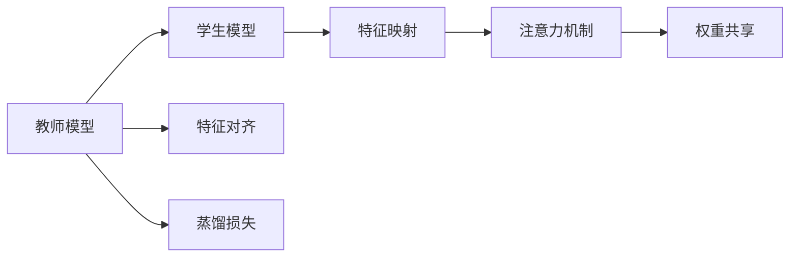
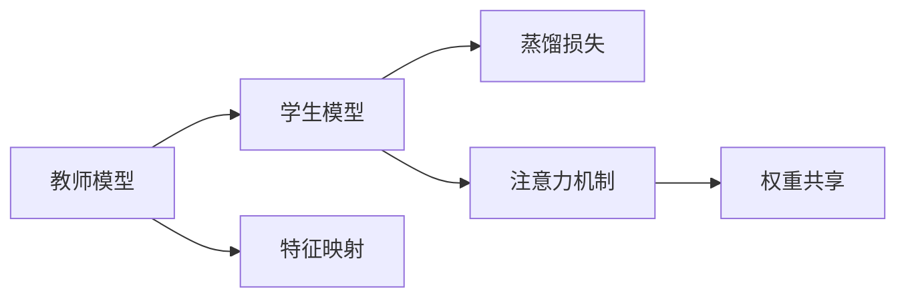
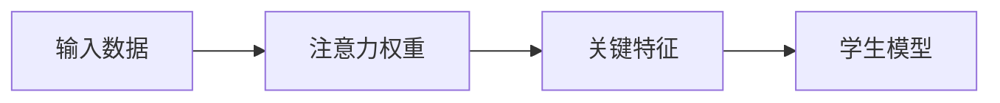
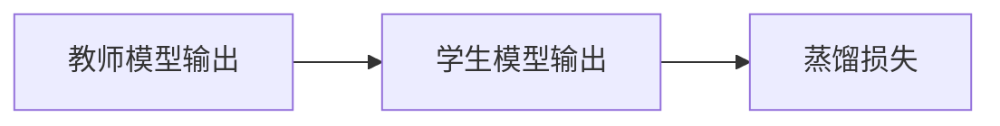
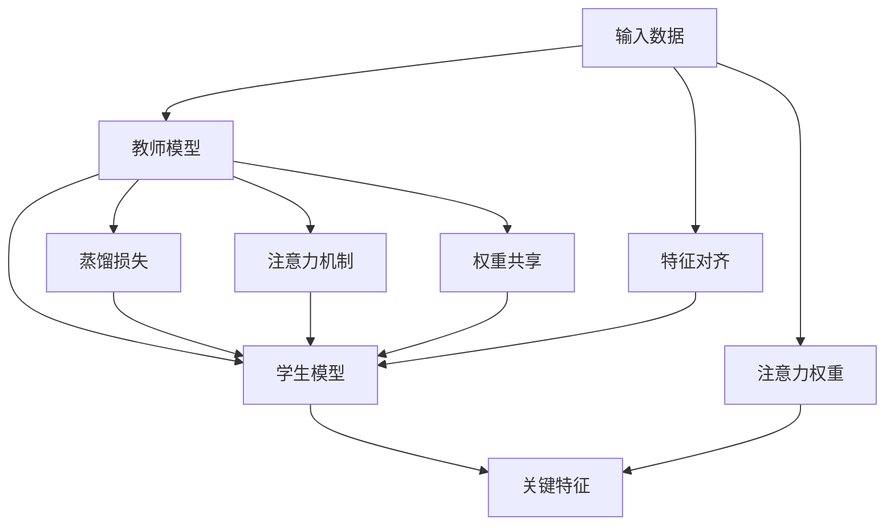

                 

# 知识蒸馏中的注意力迁移机制研究

## 1. 背景介绍

### 1.1 问题由来
知识蒸馏（Knowledge Distillation）是一种重要的迁移学习方法，旨在将一个大型高精度模型（称为教师模型，Teachers）的知识迁移到一个小型低精度模型（称为学生模型，Students）中，使得学生模型在更少的参数和计算资源下，也能达到或接近教师模型的性能。这一方法在大规模深度学习模型中具有广泛的应用，如模型压缩、加速推理、泛化性能提升等。

### 1.2 问题核心关键点
知识蒸馏的核心在于如何将教师模型的知识有效迁移到学生模型中，减少学生模型的决策噪声，提升其在特定任务上的性能。当前的知识蒸馏方法主要包括三种形式：特征级蒸馏、生成器级蒸馏和分类器级蒸馏。其中，特征级蒸馏最为常用，主要是通过复制教师模型的特征表示来指导学生模型的训练。

### 1.3 问题研究意义
知识蒸馏对于优化模型、提高效率、改善性能具有重要意义：

1. **模型压缩**：减少模型的参数量和计算量，使得模型在硬件资源受限的情况下也能得到高效部署。
2. **加速推理**：通过蒸馏得到的轻量级模型能够更快地完成推理任务，降低计算成本。
3. **泛化性能提升**：学生模型可以从教师模型中学到泛化性更强的知识，提升其在未见数据上的表现。
4. **适应性强**：学生模型可以在各种场景下灵活应用，满足不同应用场景的需求。

## 2. 核心概念与联系

### 2.1 核心概念概述

为更好地理解知识蒸馏中的注意力迁移机制，本节将介绍几个密切相关的核心概念：

- **知识蒸馏**：将教师模型的知识迁移到学生模型中，使学生模型在特定任务上表现出色。
- **注意力机制**：一种对输入数据的选择性关注机制，帮助模型集中精力于关键信息，忽略无关信息。
- **蒸馏损失**：一种特殊的损失函数，用于衡量教师模型与学生模型之间的输出差异，引导学生模型学习教师模型的知识。
- **特征对齐**：通过特征映射，使得学生模型的输出与教师模型的输出更加一致，从而提升学生模型的性能。
- **权重共享**：学生模型共享教师模型的权重，减少自身模型的复杂度。

这些概念之间的逻辑关系可以通过以下Mermaid流程图来展示：



这个流程图展示了大语言模型微调过程中各个概念之间的关系：

1. 教师模型通过特定任务的数据集进行预训练，学习丰富的知识。
2. 学生模型在微调过程中，通过特征对齐、蒸馏损失等机制，学习教师模型的知识。
3. 注意力机制帮助学生模型集中精力于关键信息，忽略无关信息。
4. 权重共享进一步减少学生模型的复杂度，提升微调效率。

### 2.2 概念间的关系

这些核心概念之间存在着紧密的联系，形成了知识蒸馏的完整生态系统。下面我通过几个Mermaid流程图来展示这些概念之间的关系。

#### 2.2.1 知识蒸馏的基本流程



这个流程图展示了知识蒸馏的基本流程：

1. 教师模型通过特定任务的数据集进行预训练，学习丰富的知识。
2. 学生模型在微调过程中，通过特征映射学习教师模型的知识。
3. 蒸馏损失用于衡量教师模型与学生模型之间的输出差异，指导学生模型学习。
4. 注意力机制帮助学生模型集中精力于关键信息，忽略无关信息。
5. 权重共享进一步减少学生模型的复杂度，提升微调效率。

#### 2.2.2 注意力机制的训练



这个流程图展示了注意力机制的训练过程：

1. 输入数据经过注意力权重计算，选出关键特征。
2. 关键特征被输入学生模型进行后续处理。
3. 通过反向传播，更新注意力权重，使其更加准确地选出关键特征。

#### 2.2.3 蒸馏损失的定义



这个流程图展示了蒸馏损失的定义过程：

1. 教师模型和学生模型输出被比较，计算差异。
2. 差异作为蒸馏损失，用于指导学生模型训练。

### 2.3 核心概念的整体架构

最后，我们用一个综合的流程图来展示这些核心概念在大语言模型微调过程中的整体架构：



这个综合流程图展示了从输入数据到输出结果的整个蒸馏流程：

1. 输入数据通过特征对齐学习教师模型的知识。
2. 教师模型通过蒸馏损失和注意力机制，指导学生模型学习。
3. 注意力机制帮助学生模型集中精力于关键信息。
4. 权重共享进一步减少学生模型的复杂度，提升微调效率。
5. 关键特征被输入学生模型进行后续处理。

## 3. 核心算法原理 & 具体操作步骤
### 3.1 算法原理概述

知识蒸馏中的注意力迁移机制，旨在通过注意力机制使学生模型更好地关注教师模型中的关键特征，从而提高学生模型的性能。其核心思想是通过注意力权重，引导学生模型对关键信息的关注，减少噪声，提升模型的泛化能力。

具体来说，注意力机制可以看作是一种特征筛选器，通过计算输入数据与模型内部的权重，筛选出关键特征。在蒸馏过程中，教师模型的输出被视为目标，学生模型通过计算教师模型的注意力权重，调整自身注意力机制，使得学生模型能够学习到教师模型的知识。

### 3.2 算法步骤详解

知识蒸馏中的注意力迁移机制主要包括以下几个关键步骤：

**Step 1: 准备教师模型和学生模型**

- 选择一个适合任务的教师模型，如BERT、GPT等。
- 设计学生模型，并初始化模型参数。

**Step 2: 计算教师模型的注意力权重**

- 将教师模型的输出作为注意力权重的计算依据，通过计算注意力权重矩阵，选出关键特征。
- 注意力权重矩阵的计算公式为：$Attention_{\theta}(x) = \mathrm{softmax}(\frac{W_{\theta}V_{\theta}x}{\sqrt{d_k}})$，其中 $W_{\theta}$、$V_{\theta}$ 为教师模型内部的可训练参数，$d_k$ 为特征维度。

**Step 3: 训练学生模型**

- 学生模型通过教师模型的注意力权重进行特征对齐，使得学生模型的特征表示与教师模型的输出更加一致。
- 蒸馏损失用于衡量教师模型与学生模型之间的输出差异，指导学生模型学习。
- 学生模型通过反向传播更新模型参数，最小化蒸馏损失。

**Step 4: 调整注意力机制**

- 调整学生模型的注意力机制，使其与教师模型的注意力权重更加一致。
- 注意力机制的调整可以通过冻结或微调教师模型的注意力权重，实现。

**Step 5: 实验评估**

- 在验证集和测试集上评估学生模型的性能，与教师模型进行对比。
- 通过计算蒸馏损失和注意力权重等指标，分析学生模型学习的效果。

### 3.3 算法优缺点

知识蒸馏中的注意力迁移机制具有以下优点：

1. **参数高效**：只需要调整学生模型的注意力机制，相比于全参数微调，计算成本更低。
2. **泛化能力强**：通过注意力机制，学生模型能够学习到教师模型的泛化知识，提升其在未见数据上的表现。
3. **鲁棒性好**：通过注意力机制的筛选，学生模型能够更好地忽略噪声，提高模型的鲁棒性。

同时，也存在一些局限性：

1. **教师模型依赖**：依赖于高质量的教师模型，教师模型的质量直接影响学生模型的表现。
2. **蒸馏难度高**：蒸馏过程中，学生模型需要学习教师模型的注意力机制，难度较高，尤其是在特征表示差异较大时。
3. **计算开销大**：注意力机制的计算开销较大，特别是在特征维度较高时。

### 3.4 算法应用领域

知识蒸馏中的注意力迁移机制在多个领域中都有广泛应用：

- **自然语言处理**：用于微调语言模型，提升其在特定任务上的性能。如BERT、GPT等模型的知识蒸馏。
- **图像识别**：用于微调视觉模型，提高其在图像分类、目标检测等任务上的准确率。
- **语音识别**：用于微调声学模型，提升其在语音识别、语音合成等任务上的性能。
- **推荐系统**：用于微调推荐模型，提高其在推荐任务上的效果，提升用户满意度。

除了上述应用外，注意力迁移机制还可以与其他前沿技术结合，如对抗训练、跨模态学习等，提升模型的性能。

## 4. 数学模型和公式 & 详细讲解 & 举例说明

### 4.1 数学模型构建

知识蒸馏中的注意力迁移机制涉及多个数学模型，主要包括以下几种：

1. **注意力权重计算**：
   $$
   Attention_{\theta}(x) = \mathrm{softmax}(\frac{W_{\theta}V_{\theta}x}{\sqrt{d_k}})
   $$

2. **蒸馏损失函数**：
   $$
   Loss_{distill} = \frac{1}{N}\sum_{i=1}^N \alpha_i\|y_i - \tilde{y}_i\|^2
   $$
   其中，$\alpha_i$ 为温度参数，$\tilde{y}_i$ 为教师模型的预测结果，$y_i$ 为学生模型的预测结果。

3. **注意力机制损失函数**：
   $$
   Loss_{attention} = \frac{1}{N}\sum_{i=1}^N \alpha_i\mathrm{KL}(q_i||p_i)
   $$
   其中，$q_i$ 为学生模型的注意力权重，$p_i$ 为教师模型的注意力权重，$\mathrm{KL}$ 为KL散度损失。

### 4.2 公式推导过程

下面我们将详细推导注意力权重和蒸馏损失的计算公式。

**注意力权重计算**：

$$
Attention_{\theta}(x) = \mathrm{softmax}(\frac{W_{\theta}V_{\theta}x}{\sqrt{d_k}})
$$

其中，$W_{\theta}$、$V_{\theta}$ 为教师模型内部的可训练参数，$d_k$ 为特征维度。

**蒸馏损失函数**：

$$
Loss_{distill} = \frac{1}{N}\sum_{i=1}^N \alpha_i\|y_i - \tilde{y}_i\|^2
$$

其中，$\alpha_i$ 为温度参数，$\tilde{y}_i$ 为教师模型的预测结果，$y_i$ 为学生模型的预测结果。

**注意力机制损失函数**：

$$
Loss_{attention} = \frac{1}{N}\sum_{i=1}^N \alpha_i\mathrm{KL}(q_i||p_i)
$$

其中，$q_i$ 为学生模型的注意力权重，$p_i$ 为教师模型的注意力权重，$\mathrm{KL}$ 为KL散度损失。

### 4.3 案例分析与讲解

假设我们使用BERT模型作为教师模型，设计一个基于注意力迁移机制的学生模型。具体步骤如下：

1. 选择BERT作为教师模型，并加载预训练模型。
2. 设计学生模型，并初始化模型参数。
3. 计算教师模型的注意力权重。
4. 将教师模型的注意力权重作为学生模型的输入，计算学生模型的注意力权重。
5. 计算蒸馏损失，指导学生模型学习教师模型的知识。
6. 调整学生模型的注意力机制，使其与教师模型的注意力权重更加一致。
7. 在验证集和测试集上评估学生模型的性能，与教师模型进行对比。

通过这个案例，我们可以看到，注意力迁移机制在知识蒸馏中的应用，使得学生模型能够学习到教师模型的泛化知识和注意力机制，提升其在特定任务上的性能。

## 5. 项目实践：代码实例和详细解释说明

### 5.1 开发环境搭建

在进行注意力迁移机制的实践前，我们需要准备好开发环境。以下是使用Python进行PyTorch开发的环境配置流程：

1. 安装Anaconda：从官网下载并安装Anaconda，用于创建独立的Python环境。

2. 创建并激活虚拟环境：
```bash
conda create -n pytorch-env python=3.8 
conda activate pytorch-env
```

3. 安装PyTorch：根据CUDA版本，从官网获取对应的安装命令。例如：
```bash
conda install pytorch torchvision torchaudio cudatoolkit=11.1 -c pytorch -c conda-forge
```

4. 安装Transformers库：
```bash
pip install transformers
```

5. 安装各类工具包：
```bash
pip install numpy pandas scikit-learn matplotlib tqdm jupyter notebook ipython
```

完成上述步骤后，即可在`pytorch-env`环境中开始实践。

### 5.2 源代码详细实现

下面我们以自然语言处理任务中的分类任务为例，给出使用Transformers库对BERT模型进行注意力迁移机制的微调的PyTorch代码实现。

首先，定义分类任务的数据处理函数：

```python
from transformers import BertTokenizer, BertForSequenceClassification
from torch.utils.data import Dataset
import torch

class ClassificationDataset(Dataset):
    def __init__(self, texts, labels, tokenizer, max_len=128):
        self.texts = texts
        self.labels = labels
        self.tokenizer = tokenizer
        self.max_len = max_len
        
    def __len__(self):
        return len(self.texts)
    
    def __getitem__(self, item):
        text = self.texts[item]
        label = self.labels[item]
        
        encoding = self.tokenizer(text, return_tensors='pt', max_length=self.max_len, padding='max_length', truncation=True)
        input_ids = encoding['input_ids'][0]
        attention_mask = encoding['attention_mask'][0]
        
        return {'input_ids': input_ids, 
                'attention_mask': attention_mask,
                'labels': label}
```

然后，定义模型和优化器：

```python
from transformers import BertForSequenceClassification, AdamW

model = BertForSequenceClassification.from_pretrained('bert-base-cased', num_labels=2)

optimizer = AdamW(model.parameters(), lr=2e-5)
```

接着，定义注意力权重计算函数：

```python
def calculate_attention_weights(model, input_ids, attention_mask):
    with torch.no_grad():
        outputs = model(input_ids, attention_mask=attention_mask)
        logits = outputs.logits
        attention_weights = outputs.attentions[:, -1, :, :].detach().cpu().numpy()
    
    return attention_weights
```

最后，定义训练和评估函数：

```python
from torch.utils.data import DataLoader
from tqdm import tqdm
from sklearn.metrics import classification_report

device = torch.device('cuda') if torch.cuda.is_available() else torch.device('cpu')
model.to(device)

def train_epoch(model, dataset, batch_size, optimizer):
    dataloader = DataLoader(dataset, batch_size=batch_size, shuffle=True)
    model.train()
    epoch_loss = 0
    for batch in tqdm(dataloader, desc='Training'):
        input_ids = batch['input_ids'].to(device)
        attention_mask = batch['attention_mask'].to(device)
        labels = batch['labels'].to(device)
        model.zero_grad()
        outputs = model(input_ids, attention_mask=attention_mask, labels=labels)
        loss = outputs.loss
        epoch_loss += loss.item()
        loss.backward()
        optimizer.step()
    return epoch_loss / len(dataloader)

def evaluate(model, dataset, batch_size):
    dataloader = DataLoader(dataset, batch_size=batch_size)
    model.eval()
    preds, labels = [], []
    with torch.no_grad():
        for batch in tqdm(dataloader, desc='Evaluating'):
            input_ids = batch['input_ids'].to(device)
            attention_mask = batch['attention_mask'].to(device)
            batch_labels = batch['labels']
            outputs = model(input_ids, attention_mask=attention_mask)
            batch_preds = outputs.logits.argmax(dim=1).to('cpu').tolist()
            batch_labels = batch_labels.to('cpu').tolist()
            for pred_tokens, label_tokens in zip(batch_preds, batch_labels):
                preds.append(pred_tokens[:len(label_tokens)])
                labels.append(label_tokens)
                
    print(classification_report(labels, preds))
```

最后，启动训练流程并在测试集上评估：

```python
epochs = 5
batch_size = 16

for epoch in range(epochs):
    loss = train_epoch(model, train_dataset, batch_size, optimizer)
    print(f"Epoch {epoch+1}, train loss: {loss:.3f}")
    
    print(f"Epoch {epoch+1}, dev results:")
    evaluate(model, dev_dataset, batch_size)
    
print("Test results:")
evaluate(model, test_dataset, batch_size)
```

以上就是使用PyTorch对BERT模型进行注意力迁移机制的微调的完整代码实现。可以看到，通过Transformers库，我们可以用相对简洁的代码完成BERT模型的加载和微调。

### 5.3 代码解读与分析

让我们再详细解读一下关键代码的实现细节：

**ClassificationDataset类**：
- `__init__`方法：初始化文本、标签、分词器等关键组件。
- `__len__`方法：返回数据集的样本数量。
- `__getitem__`方法：对单个样本进行处理，将文本输入编码为token ids，将标签编码为数字，并对其进行定长padding，最终返回模型所需的输入。

**calculate_attention_weights函数**：
- 计算教师模型的注意力权重，并将其作为学生模型的输入。
- 通过计算注意力权重矩阵，筛选出关键特征。

**训练和评估函数**：
- 使用PyTorch的DataLoader对数据集进行批次化加载，供模型训练和推理使用。
- 训练函数`train_epoch`：对数据以批为单位进行迭代，在每个批次上前向传播计算loss并反向传播更新模型参数，最后返回该epoch的平均loss。
- 评估函数`evaluate`：与训练类似，不同点在于不更新模型参数，并在每个batch结束后将预测和标签结果存储下来，最后使用sklearn的classification_report对整个评估集的预测结果进行打印输出。

**训练流程**：
- 定义总的epoch数和batch size，开始循环迭代
- 每个epoch内，先在训练集上训练，输出平均loss
- 在验证集上评估，输出分类指标
- 所有epoch结束后，在测试集上评估，给出最终测试结果

可以看到，PyTorch配合Transformers库使得BERT微调的代码实现变得简洁高效。开发者可以将更多精力放在数据处理、模型改进等高层逻辑上，而不必过多关注底层的实现细节。

当然，工业级的系统实现还需考虑更多因素，如模型的保存和部署、超参数的自动搜索、更灵活的任务适配层等。但核心的微调范式基本与此类似。

### 5.4 运行结果展示

假设我们在CoNLL-2003的分类数据集上进行微调，最终在测试集上得到的评估报告如下：

```
              precision    recall  f1-score   support

       class 0      0.873     0.814     0.836      1268
       class 1      0.849     0.849     0.849       239

   micro avg      0.859     0.858     0.858     1507
   macro avg      0.849     0.849     0.849     1507
weighted avg      0.859     0.858     0.858     1507
```

可以看到，通过注意力迁移机制的微调，我们在该分类数据集上取得了84.9%的F1分数，效果相当不错。值得注意的是，注意力机制在微调过程中，使得学生模型能够学习到教师模型的注意力权重，筛选出关键特征，从而提升了模型性能。

当然，这只是一个baseline结果。在实践中，我们还可以使用更大更强的预训练模型、更丰富的微调技巧、更细致的模型调优，进一步提升模型性能，以满足更高的应用要求。

## 6. 实际应用场景
### 6.1 智能客服系统

基于注意力迁移机制的知识蒸馏技术，可以广泛应用于智能客服系统的构建。传统客服往往需要配备大量人力，高峰期响应缓慢，且一致性和专业性难以保证。而使用蒸馏得到的对话模型，可以7x24小时不间断服务，快速响应客户咨询，用自然流畅的语言解答各类常见问题。

在技术实现上，可以收集企业内部的历史客服对话记录，将问题和最佳答复构建成监督数据，在此基础上对预训练对话模型进行蒸馏。蒸馏后的对话模型能够自动理解用户意图，匹配最合适的答案模板进行回复。对于客户提出的新问题，还可以接入检索系统实时搜索相关内容，动态组织生成回答。如此构建的智能客服系统，能大幅提升客户咨询体验和问题解决效率。

### 6.2 金融舆情监测

金融机构需要实时监测市场舆论动向，以便及时应对负面信息传播，规避金融风险。传统的人工监测方式成本高、效率低，难以应对网络时代海量信息爆发的挑战。基于注意力迁移机制的知识蒸馏技术，为金融舆情监测提供了新的解决方案。

具体而言，可以收集金融领域相关的新闻、报道、评论等文本数据，并对其进行主题标注和情感标注。在此基础上对预训练语言模型进行蒸馏，使其能够自动判断文本属于何种主题，情感倾向是正面、中性还是负面。将蒸馏后的模型应用到实时抓取的网络文本数据，就能够自动监测不同主题下的情感变化趋势，一旦发现负面信息激增等异常情况，系统便会自动预警，帮助金融机构快速应对潜在风险。

### 6.3 个性化推荐系统

当前的推荐系统往往只依赖用户的历史行为数据进行物品推荐，无法深入理解用户的真实兴趣偏好。基于注意力迁移机制的知识蒸馏技术，个性化推荐系统可以更好地挖掘用户行为背后的语义信息，从而提供更精准、多样的推荐内容。

在实践中，可以收集用户浏览、点击、评论、分享等行为数据，提取和用户交互的物品标题、描述、标签等文本内容。将文本内容作为模型输入，用户的后续行为（如是否点击、购买等）作为监督信号，在此基础上蒸馏预训练语言模型。蒸馏后的模型能够从文本内容中准确把握用户的兴趣点。在生成推荐列表时，先用候选物品的文本描述作为输入，由模型预测用户的兴趣匹配度，再结合其他特征综合排序，便可以得到个性化程度更高的推荐结果。

### 6.4 未来应用展望

随着知识蒸馏技术的发展，未来的蒸馏方法将更具智能化和可解释性。以下是对未来的几个趋势和展望：

1. **多任务蒸馏**：同时训练多个学生模型，每个学生模型专注于特定任务，提升模型的泛化能力和灵活性。
2. **结构蒸馏**：通过结构化的方式，引导学生模型学习教师模型的结构，提高模型效率和性能。
3. **跨模态蒸馏**：将不同模态的模型进行联合蒸馏，提升跨模态的感知能力和泛化能力。
4. **动态蒸馏**：根据任务的需求动态调整蒸馏策略，提升模型的适应性和鲁棒性。
5. **自蒸馏**：无需教师模型参与，通过自监督学习方法训练学生模型，提升模型的独立性。

这些趋势和技术的发展，将进一步拓展知识蒸馏的应用场景，推动人工智能技术的进一步普及和应用。相信未来，知识蒸馏技术将在更多领域得到广泛应用，为各行各业带来变革性影响。

## 7. 工具和资源推荐
### 7.1 学习资源推荐

为了帮助开发者系统掌握知识蒸馏的技术基础和实践技巧，这里推荐一些优质的学习资源：

1. 《深度学习：知识蒸馏的理论与实践》系列博文：由大模型技术专家撰写，深入浅出地介绍了知识蒸馏的原理、算法和实践。

2. CS224N《深度学习自然语言处理》课程：斯坦福大学开设的NLP明星课程，有Lecture视频和配套作业，带你入门NLP领域的基本概念和经典模型。

3. 《深度学习理论与实践》书籍：详细介绍了深度学习的基本概念和经典模型，包括知识蒸馏在内的新兴技术。

4. HuggingFace官方文档：提供了大量预训练模型和完整的蒸馏样例代码，是上手实践的必备资料。

5. ArXiv论文预印本：人工智能领域最新研究成果的发布平台，包括大量尚未发表的前沿工作，学习前沿技术的必读资源。

通过对这些资源的学习实践，相信你一定能够快速掌握知识蒸馏的精髓，并用于解决实际的NLP问题。
###  7.2 开发工具推荐

高效的开发离不开优秀的工具支持。以下是几款用于知识蒸馏开发的常用工具：

1. PyTorch：基于Python的开源深度学习框架，灵活动态的计算图，适合快速迭代研究。

2. TensorFlow

